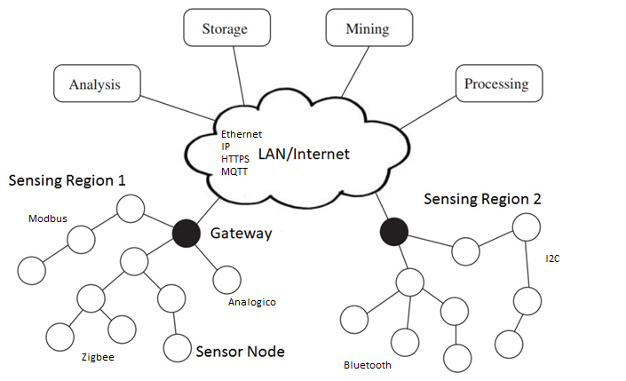
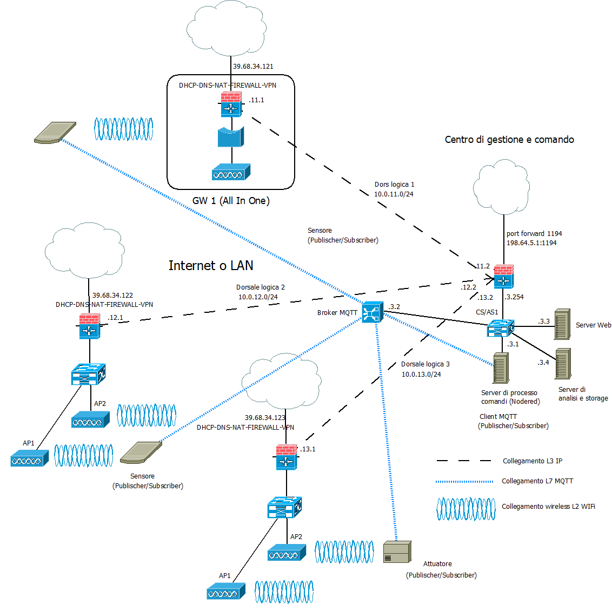
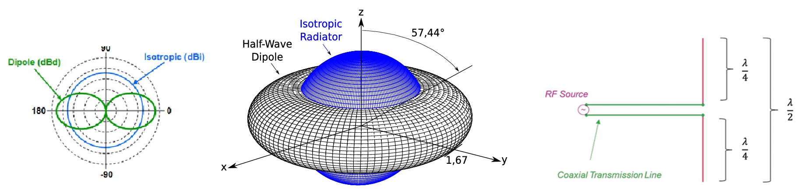
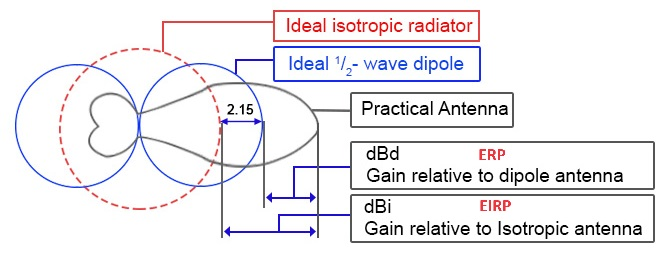

>[Torna a reti di sensori](sensornetworkshort.md#classificazione-delle-tecnologie-wsn-in-base-a-velocità-e-copertura)

Di seguito è riportata l'architettura generale di una rete Zigbee. Essa è composta, a **livello fisico**, essenzialmente di una **rete di accesso** ai sensori e da una **rete di distribuzione** che fa da collante di ciascuna rete di sensori.




La rete di sensori fisica è a stella dove il centro stella è il gateway. Un sensore può anche essere associato a più gateway ed inviare dati a tutti i gateway a cui esso è associato. I dati normalmente arrivano ad un certo dispositivo attraverso un solo gateway.

I gateway utilizzano la rete internet (o una LAN) per realizzare un collegamento diretto **virtuale** con il network server, per cui, in definitiva, la topologia risultante è, **fisicamente**, quella di più **reti di accesso** a stella tenute insieme da una **rete di distribuzione** qualsiasi purchè sia di tipo TCP/IP (LAN o Internet).

### **Gateway standardizzati** 

**Riassumendo**, alla **rete di distribuzione IP** si collegano, quindi, una o più **reti secondarie** che servono da **rete di accesso** per i dispositivi sensori o attuatori con **interfacce** spesso di tipo **non ethernet** che necessitano di un **gateway** di confine con possibili funzioni di:     
  - **Inoltro**, cioè smistamento dei messaggi da un tipo di rete all'altro di tipo L3 (**routing**) o di tipo L2 (**bridging**). L'inoltro del messaggio di un sensore può essere:
       - **diretto** nella rete di distribuzione tramite link fisico verso il dispositivo di smistamento pubblico (router o switch) più vicino.
       - **indiretto** tramite una dorsale virtuale, cioè un **tunnel**, verso il network server o verso un router di una WAN privata, realizzato, ad esempio, in maniera cifrata tramite un **client di VPN**, oppure in maniera non cifrata tramite un client di tunnel generico **GRE**.
  - **Traduzione di formato** dei messaggi da rete a bus a rete ethernet con eventuale realizzazione del **bridge** L4 tra il livello applicativo in uso nella rete di sensori e quello in uso nella rete di distribuzione.
  - **Interrogazione periodica** (polling) dei dispositivi nella rete di sensori (master di una architettura master/slave)
  - **Raccolta e memorizzazione** delle informazioni per essere trasferite in un **secondo momento** al server di gestione
  - **Protezione della rete di sensori**, cioè di firewall, soprattutto quando questa, tramite il gateway, si connette direttamente alla rete **Internet** mediante un **IP pubblico**.


L'albero degli **apparati attivi** di una rete di sensori + rete di distribuzione + server di gestione e controllo potrebbe apparire:



Il **bridge Wifi** (in realtà è un **gateway** e quindi pure un router) è normalmente anche il **coordinatore** della rete di sensori. 

Il **broker MQTT** può essere installato in cloud, in una Virtual Private network, oppure On Premise direttamente nel centro di gestione e controllo. 

### **Rete di dispositivi WiFi** 

Una architettura di rete wireless WiFi è può essere realizzata in tre modalità:
- **Modalità Infrastruttura** di tipo master/slave
- **Modalità ad hoc** di tipo peer to peer 
- **Modalità Wifi Direct**  di tipo Punto – punto
  
Le architetture **più diffuse** in ambito aziendale sono di **tipo infrastruttura** e sono composte di un dispositivo master centrale detto **Access Point (AP)** posto in posizione **baricentrica** rispetto a più dispositivi slave della rete wireless detti **Client**.


Il dispositivo AP è assimilabile ad un **Hub** che realizza un BUS broadcast che collega tutti i device client. Il mezzo radio è di tipo broadcast half duplex in cui uno parla e tutti ascoltano. Per realizzare un canale percepito dalle stazioni client come full duplex l’accesso di queste necessita di essere arbitrato. L'**arbitraggio** può essere di tipo:
- **Peer to peer**: è la soluzione più comune, l’accesso al mezzo degli interlocutori è gestita in maniera autonoma da ciascuno di essi tramite un  meccanismo di ack realizzato dal protocollo 802.11 di tipo CSMA/CA.
- **Master/Slave**: è la soluzione realizzata sotto l’arbitraggio centralizzato del dispositivo AP, che assume il ruolo di **master**. L’AP assegna un tempo prestabilito a ciascuna comunicazione per parlare e lo comunica periodicamente a tutte le stazioni tramite opportune trame di segnalazione (**beacon**).

Per dettagli sulle tecniche di accesso al BUS in generale e per quelle utizzate dal WiFi in particolare vedi [Dettaglio mezzi a BUS](protocollidiaccesso.md)

### **Struttura cellulare**

Una rete wifi è organizzata nelle zone di influenza di ciascun AP dette **cella**. A causa dell'**attenuazione** del segnale radio dovuta alla distanza o agli ostacoli un client raggiunge un AP solo fino ai confini della sua cella.
Il collegamento in **mobilità** di un client da una cella ad un’altra adiacente si chiama **roaming** e determina un passaggio della presa in carico di un utente da una cella a quella di transito vicina che viene detto in gergo **handover**. Un handover avviene generalmente, in maniera trasparente all’utente e **senza la cessazione** di eventuali connessioni in corso. 


Una organizzazione ottima della rete fa in modo di minimizzare la cosidetta **interferenza cocanale**. L’interferenza cocanale è il disturbo creato alle comunicazioni di un AP dalle comunicazioni di un altro AP che condivide la stessa frequenza. L’interferenza cocanale è minimizzata quando:
- Dispositivi adiacenti hanno frequenze molto diverse
- Frequenze uguali sono condivise da dispositivi molto lontani

La divisione in celle è una forma di **SDM**, infatti celle di uno stesso colore possono trasmettere senza interferirsi nella stessa frequenza e nello stesso istante purchè siano in posizioni differenti. 
Per dettagli vedi [multiplazioni statiche](multiplazioni.md)

### **Allocazione dei canali alle celle**


### **Allocazione canali a 2.4 GHz**

A 2.4GHz il WiFi adopera 11 canali FDM con sovrapposizione parziale dei vari canali. Solo tre canali di volta in volta non si sovrappongono.
Una disposizione di celle adiacenti ottima dovrebbe utilizzare possibilmente solo tre canali non sovrapposti per minimizzare l’interferenza cocanale.


Le possibilità sono: 1-6-11, 2-7-12, 3-8-13, 4-9, 5-10 ma rimangono solo 1-6-11 , 5-10 perché le frequenze 12, 13 e 14 non sono autorizzate in Europa (alcuni device supportano il canale 12).
quindi si hanno **più frequenze** solo usando la combinazione **1-6-11**

### **Allocazione canali a 5 GHz**

In questa banda è disponibile uno spettro significativamente più ampio ed anche possibile impostare la larghezza del canale. Cciascun canale occupa la propria sezione a 20 MHz senza sovrapposizioni con altri canali. 


802.11n fornisce la possibilità di utilizzare i canali a 40 MHz, 802.11ac consente canali larghi 80MHz e persino 160MHz. Maggiore ampiezza del canale consente, in teoria, bitrate notevolmente maggiori.
Questi canali più ampi vengono creati collegando insieme i canali a 20 MHz. Raddoppiare l’ampiezza dei canali ha però l’inconveniente di raddoppiare la quantità di rumore e di ridurre le combinazioni di canali che non si sovrappongono, entrambe le circostanze possono di fatto ridurre la bitrate.


### **Pattern di riuso a confronto**


  
## **Messaggi MQTT**

### **Messaggi confermati**

La **conferma** dei messaggi inviati da parte del ricevente normalmente non è necessaria nel caso dei **sensori**. Infatti, se un invio da parte di un sensore non andasse a buon fine, è inutile richiedere la ritrasmissione di un dato che comunque a breve arriva con una misura più aggiornata. 

La conferma, invece, è prevista per funzioni di **comando** o **configurazione**.  Ad esempio  nel caso di pulsanti, rilevatori di transito o allarmi in cui l'invio del messaggiò avviene sporadicamente e in maniera del tutto **asincrona** (cioè non prevedibile dal ricevitore), potrebbe essere auspicabile avere un feedback da parte del protocollo mediante un meccanismo di conferma basato su **ack**. Ma non sempre ciò è possibile.

La **conferma**, però, potrebbe pure essere gestita soltanto dal **livello applicativo** (non dal protocollo) utilizzando un **topic di feeedback** (o stato) per inviare il valore dello stato corrente subito dopo che questo viene interessato da un comando in ingresso sul dispositivo. 

### **Definizione di topic e payload**

Sovente, nella rete di distribuzione IP è presente un server col ruolo di **broker MQTT** a cui sono associati:
- su un **topic di misura o attuazione (comando)**:
    - il dispositivo **sensore** è registrato sul broker col ruolo di **publisher** perchè vuole usare questo canale di output per **inviare il comando** verso l'attuatore 
    - il dispositivo **attuatore** è registrato sul broker con il ruolo di **subscriber** perchè è interessato a ricevere, su un canale di input, eventuali comandi di attuazione (motori, cancelli). 
-  su un **topic di feedback (stato)** (dal dispositivo terminale, verso il broker), utile al server applicativo per ricevere la conferma dell'avvenuto cambio di stato dell'attuatore ma anche utile all'utente per conoscere il nuovo stato:
    - il dispositivo **attuatore** è registrato sul broker con il ruolo di **publisher** perchè intende adoperare questo canale di output per **inviare il feedback** con il proprio stato ad un **display** associato al sensore di comando.
    - il dispositivo **sensore**, ma meglio dire il dispositivo **display** associato al dispositivo sensore (un led o uno schermo), è registrato sul broker con il ruolo di **subscriber** perchè è interessato a ricevere, su un canale di input, eventuali  **feedback** sullo stato dell'attuatore per **mostrarli** all'utente. In questo caso è demandato all'utente, e non al protocollo, **decidere** se e quante volte ripetere il comando, nel caso che lo stato del dispositivo non sia ancora quello voluto.
-  su un **topic di configurazione** dove può pubblicare solamente il sever applicativo mentre tutti gli altri dispositivi IoT sono dei subscriber:
    - sia i dispositivi **sensori** che i dispositivi **attuatori** si registrano sul broker con il ruolo di **subscriber** perchè intendono adoperare questo canale di **input** per ricevere **comandi di configurazione** quali, per esempio, attivazione/disattivazione, frequenza di una misura, durata dello stand by, aggiornamenti del firmware via wirelesss (modo OTA), ecc.
    - il **server applicativo** è responsabile della definizione delle impostazioni di configurazione e decide **quali** mandare e a **chi**.

**In realtà**, il topic di configurazione, pur essendo teoricamente appropriato, potrebbe anche essere incorporato nel topic di comando, magari prevedendo un livello più alto di autorizzazione rispetto ai comandi relativi alle funzioni ordinarie.

Il **canale applicativo** su cui vengono inviati i messaggi sono quindi i **topic**. Su un certo **topic** il dispositivo con il ruolo di **output** agisce come un **publisher**, mentre quello con il ruolo di **input** agisce come un **subscriber**.

l'**ID MQTT** è un identificativo che permette di individuare un dispositivo ma non è un indirizzo di livello 3, non individua la macchina host in base al suo IP, piuttosto è un indirizzo di livello applicativo noto solo ad un server centrale, cioè il broker. Un dispositivo IoT non è tenuto a conoscere l'IP di tutti gli altri dispositivi ma solamente quello del broker. Il broker soltanto sa gli indirizzi di tutti i dispositivi, conoscenza che acquisisce durante la fase di **connessione** di un client al broker, momento in cui avviene anche il recupero del'**socket remoto** del client.

Il **broker**, dal canto suo, **associa** ogni **topic** con tutti gli **ID** che sono registrati presso di esso come **subscriber**. Questa associazione è utilizzata per smistare tutti i messaggi che arrivano con un certo topic verso tutti gli ID che ad esso sono associati. Il topic diventa così un **indirizzo di gruppo**. La particolarità di questo indirizzo è che è **gerarchico** secondo una struttura ad **albero**, cioè gruppi di dispositivi possono essere suddivisi in **sottogruppi** più piccoli estendendo il nome del path con un **ulteriore prefisso**, diverso per ciascun sottogruppo. L'operazione può essere ripetuta ulteriormente in maniera **ricorsiva**.

**Ad esempio**, posso individuare le lampade della casa con il path ```luci``` e accenderle e spegnerle tutte insieme, ma posso sezionarle ulteriormente con il path ```luci/soggiorno``` con il quale accendere o spegnere solo quelle del soggiorno oppure con il path ```luci/soggiorno/piantane``` con il quale fare la stessa cosa ma solo con le piantane del soggiorno.

### **Gestione dei topic di comando**

Potremmo a questo punto inserire il comando delle luci nel topic più generale delle misure ed attuazioni che chiameremo ```comandi``` e registrare i pulsanti del soggiorno al topic ```luci/soggiorno/comandi``` come pubblisher, mentre potremmo registrare le attuazioni delle lampade allo stesso topic come subscriber. Il comando potrebbe essere il JSON  ```{"toggle":"true"}```, per cui alla fine tutto intero il path diventerebbe ```luci/soggiorno/comandi/{"toggle":"true"}```. Se volessimo selezionare un solo dispositivo sono possibili due strade alternative:
- inserire il **prefisso mqtt** del dispositivo direttamente **nel path** ```luci/soggiorno/comandi/mydevice1-98F4ABF298AD/{"toggle":"true"}```
- inserire un **id** del dispositivo **nel JSON** ```luci/soggiorno/comandi/{"deviceid":"01", "toggle":"true"}```, dove con ```01``` ci indica un indirizzo univoco solamente all'interno del sottogruppo ```luci/soggiorno```. Con questa soluzione il dispositivo deve saper gestire un secondo livello di indirizzi indipendente dal meccanismo del path dei topic.

### **Gestione dei topic di stato**

Questo canale viene utilizzato per inviare lo **stato** di un dispositivo a tutti coloro che ne sono interessati. L'interesse potrebbe nascere per più motivi:
- **Conferma dell'avvenuta attuazione**, una volta che l'attuatore ha ricevuto un **comando** (ad esempio "on":"true"), questo potrebbe essere tenuto a **notificare** (in modalità PUSH), al **display** associato al sensore (o al **server di processo**) il proprio **stato attuale**, in modo che l'**utente** (o il server di processo) possa verificare l'effettiva **efficacia** dell'ultimo comando di attuazione.
- **Richiesta del server di processo**. Il server di processo potrebbe richiedere (in modalità PULL) lo **stato** degli attuatori per aggiornare un pannello generale di comando o eseguire delle statistiche o per recuperare gli input di un algoritmo che deve eseguire.
- **Sincronizzazione PULL** di un pannello di controllo. Un **quadro di controllo web** potrebbe richiedere (in modalità PULL) lo **stato** degli attuatori:
    -  una **sola volta**, all'inizio, quando la pagina è stata **caricata/ricaricata** dall'utente
    -  **periodicamente**, per essere certi di avere sempre lo **stato più aggiornato** anche a fronte di una eventuale **disconnessione** di rete che abbia impedito la registrazione dell'ultimo feedback da parte dell'attuatore.
- **sincronizzazione PUSH**. Lo stesso attuatore potrebbe **periodicamente** inviare (in modalità PUSH) il proprio stato a tutti coloro che ne sono interessati (server di processo o tutti i display web che lo comandano). 

Un esempio di **canale MQTT di stato** potrebbe essere: 
- nel caso di **identificazione univoca** del dispositivo via  **path MQTT**: ```luci/soggiorno/stato/mydevice1-98F4ABF298AD/{"state":"on"}```
- nel caso di **identificazione univoca** del dispositivo nel **payload JSON**: ```luci/soggiorno/stato/{"deviceid":"01", "state":"on"}```

### **Gestione dei topic di configurazione**

Questo canale viene utilizzato per inviare **comandi di configurazione** al dispositivo da parte del server di processo. L'interesse potrebbe nascere per più motivi:
- effettuare un aggiornamento del FW di bordo via wireless.
- impostare qualche caratteristica nella definizione delle sue funzioni come, ad esempio, comportarsi come un apricancello o come comando per luci.
- impostare la frequenza di una misura, o l'intervallo di scatto di un allarme, ecc.
- cambiare la sintassi dei JSON di payload o quella di un path MQTT

Un esempio di **canale MQTT di stato** per, ad esempio, impostare il periodo di pubblicazione automatica dello stato potrebbe essere: 
- nel caso di **identificazione univoca** del dispositivo via  **path MQTT**: ```luci/soggiorno/config/mydevice1-98F4ABF298AD/{"stateperiod":"3000"}```
- nel caso di **identificazione univoca** del dispositivo nel **payload JSON**: ```luci/soggiorno/config/{"deviceid":"01", "stateperiod":"3000"}```

## **Banda ISM**

Le bande libere sono le frequenze di uso libero, non tutelate, che non richiedono concessioni per il loro impiego. Sono spesso indicate come ISM (Industrial, Scientific and Medical)[Nota 1].

In realtà ISM è un sottogruppo di tutte le frequenze disponibili.posside 
L’uso di tali bande è regolamentato in modo da consentirne l’impiego condiviso ed evitare che un utente o un servizio possa monopolizzare la risorsa.

In tabella un elenco parziale con le principali limitazioni:


Per le reti Wi-Fi che operano nella banda 2.4 GHz, i **limiti di EIRP** possono variare a seconda del canale utilizzato e sono generalmente compresi tra 20 dBm (100 mW) e 24 dBm (250 mW). Per la banda 5 GHz, i limiti possono essere più elevati e variano in base al canale e alla larghezza di banda utilizzati.

Ogni access point utilizza un singolo canale (largo 22 MHz), che viene condiviso in TDMA-TDD (CSMA/CA) da tutti gli utenti

La trasmissione avviene a pacchetti con conferma di ricezione.

La potenza media (su 6 minuti) dipende dalle condizioni di servizio ed è influenzata dal duty cycle, a sua volta determinato da vari fattori:
- La bidirezionalità della trasmissione (attesa dell’OK di ricezione)
- La necessità di servire più terminali mobili (diminuisce il duty cycle di ogni singolo terminale mobile)
- Il duty cycle aumenta col volume di dati da trasferire, ma raramente ci si avvicina al 100%
- Il duty cycle dipende dalla velocità della connessione (connessioni più veloci richiedono tempi di trasmissione inferiori)
- Il duty cycle dipende anche dalla qualità del collegamento, a causa delle ritrasmissioni
- La presenza di più access point sullo stesso canale determina collisioni che fanno diminuire il duty cycle di un singolo access point
- La capacità di traffico della rete collegata influenza il duty cycle
- Il duty cycle minimo dell’access point è fissato dai segnali di servizio (beacon signals) ed è dell’ordine di 0.01%

Considerata la bassa potenza di uscita di picco, il bassissimo guadagno d’antenna e la riduzione operata dal duty cycle, gli access point delle reti Wi-Fi generano livelli di densità di potenza sempre molti ordini di grandezza sotto i limiti normativi ed anche significativamente inferiori alle stazioni radio base della telefonia cellulare.

I **parametri** e le **limitazioni** che vedremo sono dei criteri di accesso al mezzo radio volti a ridurre **disturbi mutui** fra i vari servizi dei vari utenti e la **monopolizzazione** di un canale da parte di un singolo utente.
- **Potenza disponibile massima**. La potenza in Watt. In genere dell’ordine dei millesimi di watt (mW) è spesso espressa in dBm.
In taluni casi, in relazione alla larghezza di banda, si fa riferimento alla densità di potenza, ovvero alla potenza, in milliwatt per MHz o per KHz. E’ il caso degli apparati WLAN E HiperLAN.
- **EIRP** e **ERP**. La potenza è generalmente riferita al **segnale irradiato** sotto forma di misura ERP o di misura EIRP. L’antenna è un componente passivo, ma possiede pur sempre una sorta di guadagno. Il guadagno quantifica la capacità dell’antenna di concentrare l’energia irradiata (o ricevuta) in una determinata direzione.
     - Un'antenna si dice **isotropa** quando emette la stessa potenza in tutte le direzioni in quanto non possiede direzioni di emissione privilegiate in cui emette più energia rispetto ad altre. Ciò equivale a dire che, in una sfera avente per centro l'antenna, la densità di potenza è la stessa in ogni punto sulla sua superficie. Ma si tratta solo di una approssimazione ideale. Le antenne reali, a parità di distanza, distribuiscono la loro energia in maniera non uniforme al variare della direzione di un punto nello spazio.
       
       
       
     - Le antenne cosidette **direttive** sono progettate proprio per introdurre di proposito un guadagno ulteriore sulla potenza fornita dal trasmettitore detto **guadagno di antenna** che è dovuto proprio alla capacità di concentrare la potenza irradiata in una **direzione privilegiata**. In realtà questa direzione è solo quella dove si concentra la **densità massima** di energia che rimane comunque ancora significativa (almeno la metà) in un cono nello spazio avente una apertura caratteristica detto **apertura a 3dB**. Infatti, 3dB è proprio la differenza di intensità del fascio tra la direzione privilegiata di massima emissione e i bordi del cono in cui la potenza misurata vale la metà di quella massima. Chiaramente, il guadagno elevato, raggiunto in un cono di apertura più o meno stretta, può avvenire solo al prezzo di una analoga perdita in tutte le altre direzioni. Si concentra in una direzione ciò che si perde in tutte le altre. La direzione di **minima intensità** (toricamente nulla) è sempre, paradossalmente, la base dove si alimenta l'antenna.
     - **Principio di reciprocità**. Collega il comportamento di un'antenna ricevente a quello che la stessa possiede quando è usata come trasmittente.  Stabilisce che le proprietà (ampiezza di banda, direttività, ecc.) di un'antenna ricevente sono le stesse che avrebbe la stessa antenna usata come trasmittente.
       
  
  
     - **Antenne direttive vs omnidirezionali**. Per ottenere il massimo guadagno di antenna complessivo di un **collegamento** è necessario **collimare** le antenne trasmittente e ricevente nella direzione di massimo guadagno. Si tenga conto che maggiore è la direttività delle antenne e più precisa e stabile nel tempo dovrà essere mantenuta questa collimazione (aspetto perlomeno critico praticamente), ciò va bene per collegamenti fissi **punto punto** come i **ponti radio**. Se invece, uno terminale è **mobile** o se il collegamento è **punto-multipunto** con un cluster di dispositivi sparpagliati in una certa area dello spazio, allora è più pratico utilizzare antenne con bassa direttività se non addirittura antenne ominidirezionali, cioè isotrope, almeno nel lato a uno del collegamento (gateway). Vedremo dopo che, nella banda ISM, per limitare le interferenze ad altri dispositivi posti in prossimità dell'antenna, si lasciano pressochè omnidirezionali anche le antenne del lato a molti (dispositivi terminali).
      
       
       
     - La potenza **EIRP** di una antenna direttiva è invece la potenza con cui dovrebbe essere alimentata un'antenna isotropica per irradiare la stessa potenza che viene emessa dall'antenna direttiva nella sua direzione di massimo irraggiamento.  La potenza **EIRP** è la somma della **potenza erogata** dal trasmettittore più il **guadagno di antenna** (al netto delle perdite sul cavo sempre presenti). 
     - Un'altra grandezza considerata nella pratica è la potenza **ERP**, analoga alla precedente ma riferita alla potenza emessa da un **dipolo orientato** normalmente alla direzione di massima intensità dell'antenna direttiva (di solito è considerata un'antenna verticale con propagazione orizzontale, parallela al piano terrestre). Stavolta si valuta il guadagno dell'antenna sotto test rispetto al guadagno di un dipolo standard a mezza lunghezza d'onda. In questo caso il valore ERP dBd è leggermente più basso rispetto al valore di un'antenna istropa EIRP dBi (dBi = dBd + 2,15dB) in quanto il dipolo guadagna 2,15dB in più rispetto al radiale isotropico, anche se soltanto lungo la direzione di massima irradiazione. Un limite comune stabilito dalle **regolamentazione** è di fissare l'ERP proprio esattamente uguale alla massima potenza disponibile ammessa sul morsetto di antenna, ciò implica che l'antenna **non debba guadagnare** per nulla rispetto ad un dipolo a mezz'onda o, equivalentemente, che guadagni soltanto **2.15 dB** rispetto ad una antenna isotropa alimentata con la stessa potenza disponibile.

  
## **Ponti radio WiFi**

Un ponte radio WiFi è una dorsale tra due tronchi di rete realizzata mediante due o più dispositivi wireless. Può essere:
- **Punto-Punto**: un dispositivo in modo AP e collegato ad **un solo** dispositivo AP in modo Client o Bridge
- **Punto-Multipunto**: un dispositivo in modo AP è collegato **a più** dispositivi AP configurati in modo Client  o Bridge


In genere, i dispositivi AP coinvolti in una dorsale si comportano anche come router. Un ponte radio wifi è utile quando:
- edifici di una stessa organizzazione sono separati dal suolo pubblico (ad es. una strada)
- Vagoni di uno stesso treno non sono collegati da cavi dati
- Si vuole realizzare un ISP regionale con dorsali wireless disponendo un AP wireless sul tetto delle case degli utenti. Alcuni di questi avranno anche funzione di router di smistamento tra dorsali wireless differenti. 

**Link budget**. Tra trasmettitore e gateway potrebbe essere valutato il cosidetto link budget, overossia la somma dei guadagni e delle attenuazioni lungo il percorso fino al ricevitore. L'obiettivo è valutare il rispetto del **vincolo finale** sul ricevitore, cioè che la potenza ricevuta sia maggiore della **sensibilità minima** del ricevitore più un certo **margine di sicurezza** per tenere conto del **fading** ambientale (multipath oppure attenuazione atmosferica) che è una quantità che varia, più o meno rapidamente, col **tempo**. Per dettagli sul calcolo vedere https://www.vincenzov.net/tutorial/elettronica-di-base/Trasmissioni/link.htm. Rimane assodato che si tratta soltanto di un **calcolo di massima** che fornisce indicazioni sulla fattibilità teorica di un collegamento che, se positiva, richiede attente e ripetute **verifiche sul campo** nelle condizioni di esercizio previste per l'impianto.

### **Esempio treno: bridge mode**

In bridge mode il collegamento tra due AP è assimilabile ad una dorsale L2. Nessun altro dispositivo client può entrare a far parte del bridge oltre i due AP. I dispositivi possono essere connessi in modalità WDS oppure in modalità Ad Hoc. Gli host a monte e a valle dei due dispositivi si vedono reciprocamente. Il bridge a monte si chiama root bridge. 

In generale, il funzionamento della modalità Bridge in un dispositivo wireless coinvolge l'intercettazione del traffico wireless proveniente da una rete e il suo **inoltro** a un'altra rete, consentendo così la comunicazione tra le due reti senza fili come se fossero collegate tra loro. I dispositivi internamente realizzano un bridge SW che inoltra pacchetti tra due **hub wireless distinti**: il primo collega gli utenti mentre il secondo realizza la connessione con gli altri bridge.


Per funzionare efficacemente dovrebbe avere:
- **almeno due radio wireless**: una per la connessione alla prima rete e una per la connessione alla seconda rete. Questo consente al dispositivo di ricevere dati da una rete e trasmetterli all'altra contemporaneamente, facilitando il trasferimento di dati tra le due reti.
- **uso di due canali diversi**:È importante selezionare canali wireless non sovrapposti per evitare interferenze e garantire prestazioni ottimali.

Essendo parte di una unica LAN derivata dalla cascata hub1---bridge1---hub2---bridge2---hub3, tutti i dispossitivi devono possedere indirizzi IP afferenti alla medesima subnet.

### **Esempio sottorete privata: client mode**

In client mode il collegamento tra due AP è assimilabile ad una dorsale L3. Altri dispositivi client possono entrare a far parte del link tra i due AP.


Il dispositivo client implementa un router ed un NAT. In genere, gli host sulla LAN del client utilizzano il server DHCP del router, poiché di fatto è una rete indipendente. 

Gli host del lato AP non vedono quelli del lato client ma solo un router (con indirizzo privato). Gli host del lato client vedono quelli del lato AP, ed accedono ad internet.

### **Esempio sottorete privata: repeater mode**

Il dispositivo amplifica il segnale estendendo la dimensione nello spazio del mezzo a BUS che comunque rimane unico per tutti i dispositivi. Ne consegue che il traffico sul primo hub wireless viene riportato sul secondo e vicerversa.  Dovendo rimanere uguale il throughput complessivo, ne consegue che la banda di ciascun hub wireless non potrà essere superiore al 50% del throughput di uno solo se questi generano lo stesso volume di traffico.


In sintesi, la maggior parte dei ripetitori wireless opera con una singola radio e utilizza gli stessi canali e lo stesso SSID della rete principale per estendere la sua copertura. Questo semplifica la configurazione e consente una transizione fluida tra il segnale del router principale e quello del ripetitore.

Essendo parte di una unica LAN derivata dallo stesso hub esteso, tutti i dispossitivi devono possedere indirizzi IP afferenti alla medesima subnet.

**Sitografia**:
- www.master-iot.it Master Universitario di II Livello "Internet of Things and Big Data" A.A.2018-2019 Università degli Studi di Genova
- https://www.researchgate.net/publication/300111853_Long-Range_IoT_Technologies_The_Dawn_of_LoRa
- https://www.researchgate.net/figure/The-Wi-Fi-trilateration-Technique_fig4_277307295
- https://it.wikipedia.org/wiki/Trilaterazione
- https://en.wikipedia.org/wiki/Beacon_frame
- https://www.metageek.com/training/resources/design-dual-band-wifi.html
- http://mce.it/index.php/airmax-5-ghz
- https://www.semfionetworks.com/blog/co-channel-contention-ccc-explained-with-simple-drawings
- https://www.ekahau.com/blog/2019/04/18/channel-planning-best-practices-for-better-wi-fi/
- https://documentation.meraki.com/Architectures_and_Best_Practices/Cisco_Meraki_Best_Practice_Design/Best_Practice_Design_-_MR_Wireless/High_Density_Wi-Fi_Deployments
- https://7signal.com/802-11ac-migration-part-2-whats-nobodys-telling-you-about-80mhz-and-160mhz-channel-bonding/
- https://www.elettra2000.it/phocadownload/atti-convegni/andreuccetti.pdf
- https://community.cisco.com/t5/wireless/mesh-mode-vs-bridge-mode/td-p/4094691
- https://www.cisco.com/c/en/us/support/docs/wireless-mobility/wireless-lan-wlan/68087-bridges-pt-to-pt.html
- https://www.tp-link.com/it/support/faq/151/
- https://indomus.it/formazione/shelly-mqtt-e-http-comandi-utili/
- https://forum.inductiveautomation.com/t/shelly-relay-1-pro-mqtt-command-for-turn-switch-on-off/81137

>[Torna a reti di sensori](sensornetworkshort.md#classificazione-delle-tecnologie-wsn-in-base-a-velocità-e-copertura)
