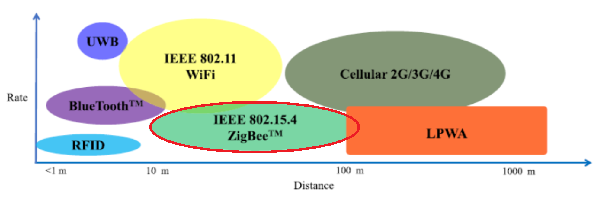
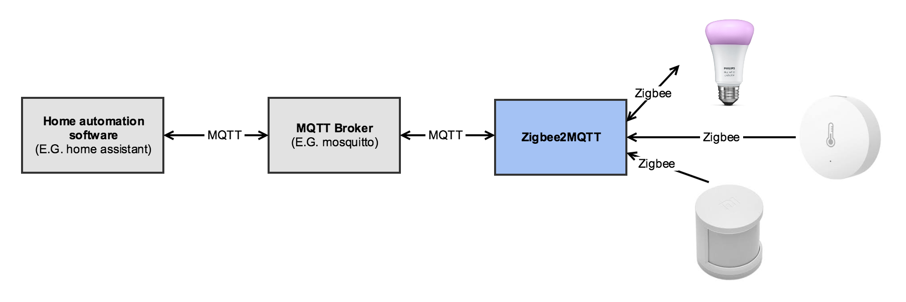
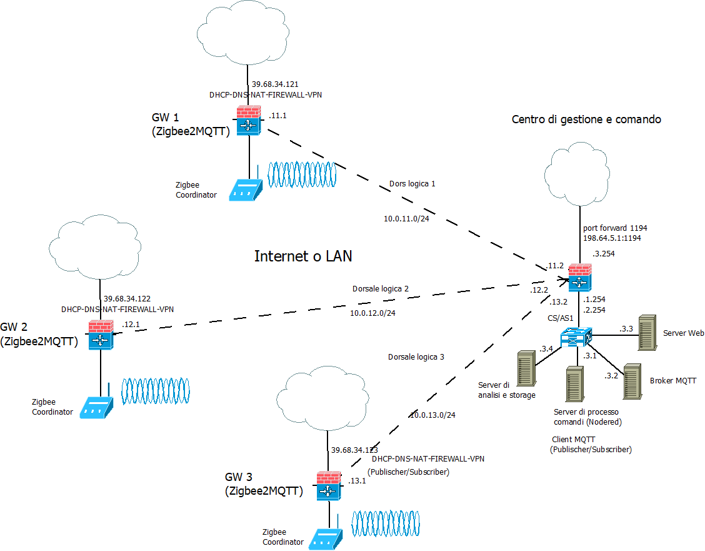
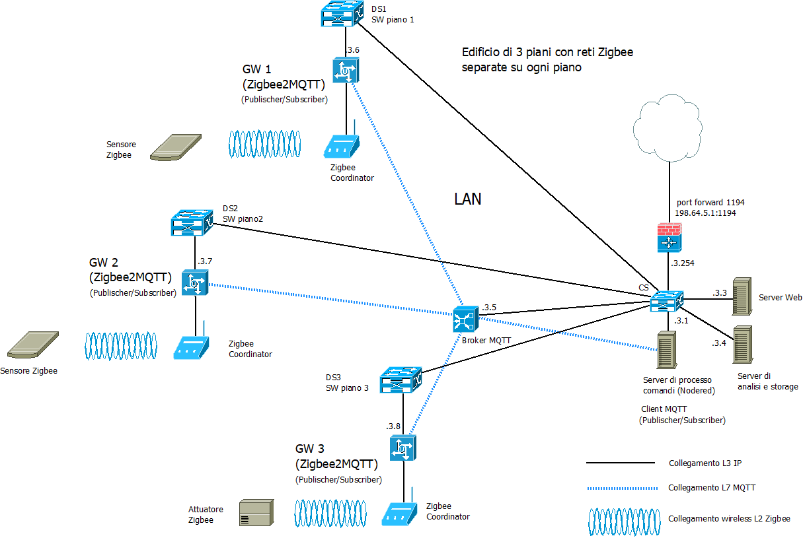
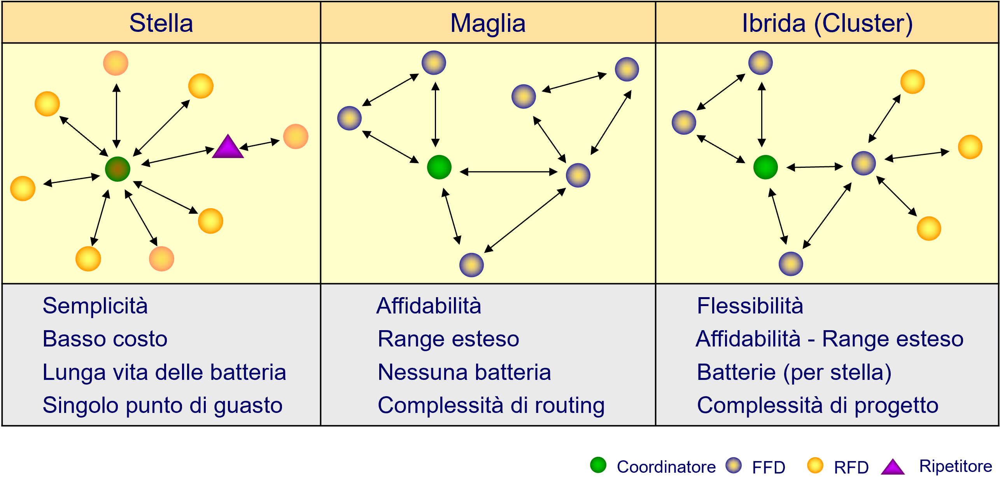
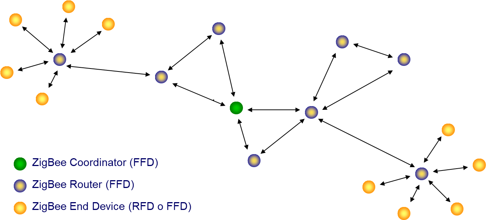
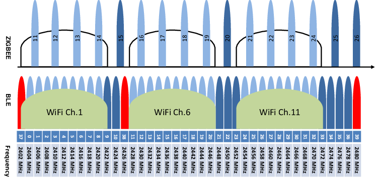
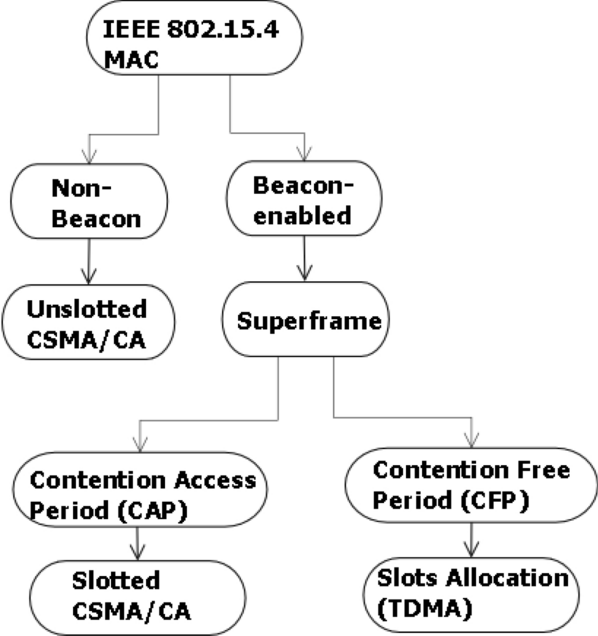
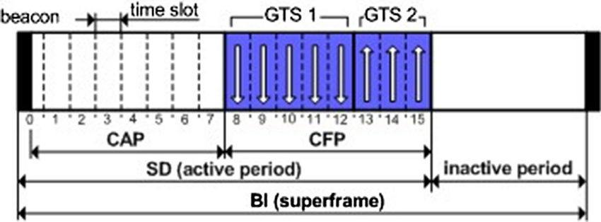

>[Torna a reti di sensori](sensornetworkshort.md#classificazione-delle-tecnologie-wsn-in-base-a-velocità-e-copertura)

## **Caso d'uso Zigbee** 

Date le particolarità della tecnologia, i casi d'uso per la rete di sensori sono quelli tipici applicazioni **IoT indoor** a **corto/medio raggio**, dove concorre con altre tecnologie di rete: WIFi, BLE e, sotto certe condizioni, LoRaWAN. Punti di forza che portano a preferire Zigbee sono essenzialmente:
- possibilità di realizzare **comandi** a distanza wireless anche molto piccoli con una **lunga durata** delle batterie (dell'ordine degli anni).
- possibilità di realizzare **sensori** ambientali molto piccoli e alimentati con batterie che possono essere sostituite dopo anni.
- possibilità di poter mettere **pochi gateway** verso la rete LAN, anche a grande distanza dai sensori e dai comandi che devono poter **coordinare**.
- architettura a **hop multiplo** del collegamento di un dispositivo verso il router più vicino della rete Zigbee che è esso stesso un dispositivo Zigbee.
- **rete di sensori** composta **dai sensori** stessi avendo alcuni (in genere gli attuatori) piena capacità di **routing**, cioè di inoltro dei messaggi tra loro e verso il gateway con la rete LAN (i dispositivi oltre ad essere sensori ed attuatori sono anche infrastruttura).
- **affidabilità** della rete di sensori **indipendente** da quella della rete dati. Topologia predisposta alla **ridondanza** dei percorsi tra i nodi IoT aventi funzioni di routing.
- utilizzo di una modulazione **robusta** e predisposta ad una efficace **convivenza** con una rete **WiFi** presente nello stesso ambiente.



### **Aspetti critici**

Elementi **critici** su cui **bilanciare convenienze** e saper fare delle **scelte argomentate** sono:
- schema fisico (**planimetria**) dell'infrastruttura con etichettatura univoca di tutti gli asset tecnologici di rete.
- tipologia di **divisione in gruppi** degli utenti.
- definizione delle **tecnologie dei dispositivi** chiave quali sensori/attuatori ([dispositivi terminali](sensornetworkshort.md#dispositivi-terminali-sensoriattuatori)), gateway, link (dual radio, three radio), accesso radio (allocazione di servizi sincroni TDM, asincroni CSMA/CA o a basso ritardo slotted CSMA/CA) e loro dimensionamento di  massima (quantità, numero di porte, banda, ecc.).
- eventuali vincoli normativi sulle tecnologie in uso come potenza, EIRP, ERP e duty cycle.
- schema logico (albero degli **apparati attivi**) di tutti i dispositivi di rete con il loro ruolo e i **link virtuali** astratti ai vari livelli della **pila ISO/OSI** (tipicamente L2, L3, L7)
- dislocazione di eventuali **gateway**.
- **subnetting** e definizione degli indirizzi dei vari gruppi di utenti, delle server farm, definizione degli indirizzi dei server.
- definizione del **tipo di routing** (statico o dinamico). In caso si scelga il **routing statico**, definizione delle **tabelle di routing** più significative.
- definizione della posizione del broker MQTT.
- definizione dei topic utili per i casi d'uso richiesti.
- definizione dei **messaggi JSON** per alcuni **dispositivi IoT** ritenuti significativi in merito a **comandi**, **stato** o **configurazione**.
- definizione (anche in pseudocodice) delle **funzioni del firmware** di bordo dei **dispositivi IoT**.

  
## **Architettura di una rete di reti** 

Di seguito è riportata l'architettura generale di una **rete di reti** di sensori. Essa è composta, a **livello fisico**, essenzialmente di una **rete di accesso** ai sensori e da una **rete di distribuzione** che fa da collante di ciascuna rete di sensori.


### **Rete di distribuzione** 

I **gateway** utilizzano la **rete internet** e/o una **LAN** per realizzare un collegamento verso il **broker MQTT**, per cui, in definitiva, la topologia risultante è, **fisicamente**, quella di più **reti di accesso** con tecnologia e topologia differente (a maglia nel caso di zigbee) tenute insieme da una **rete di distribuzione** qualsiasi purchè sia di tipo TCP/IP (LAN o Internet).

Avere a disposizione una **rete di distribuzione IP** per i comandi e le letture è utile perchè permette di creare interfacce web o applicazioni per smartphone o tablet per:
- eseguire, in un'unica interfaccia (form), comandi verso attuatori posti su reti con tecnologia differente.
- riassumere in un'unica interfaccia (report) letture di sensori provenienti da reti eterogenee per tecnologia e topologia

## **Broker MQTT** 

Il **broker MQTT** è solo una delle tante soluzioni possibili per:
- inoltro dei comandi da un **sensore di comando** su una rete di tipo A (ad es. LoRaWAN) ad un attuatore su una rete diversa di tipo B (ad es. Zigbee)
- inoltro di una **misura** da un **sensore ambientale** su una rete di tipo A (ad es. LoRaWAN) ad un **pannello di controllo** su una rete diversa di tipo B (tipicamente IP)
- inoltro di una **misura** da un **sensore ambientale** su una rete di tipo A (ad es. LoRaWAN) ad un **server di gestione** su una rete diversa di tipo B (tipicamente IP)

Il **vantaggio** del **broker MQTT** è quello di poter gestire in modo semplice e **standardizzato** lo **smistamento** (inoltro) delle **misure** e dei **comandi** tra i vari portatori di interesse (stakeholder) di un **cluster** di reti di sensori, siano essi utenti umani, interfacce grafiche, server applicativi diversi o altri dispositivi IoT.

Esistono molte altre soluzioni che magari sono più semplici e graficamente accattivanti ma che passano per portali proprietari o per servizi cloud a pagamento e nulla aggiungono di didatticamente rilevante ai nostri discorsi.

## **Server di gestione** 

E' un **client** del **broker MQTT** con funzioni sia di **publisher** che di **subscriber** per:
-  elaborazioni a **breve termine** quali la generazione di **statistiche** per la determinazione di **soglie** o **predizioni** per:
    - realizzazione da remoto della **logica di comando** (processo dei comandi) degli **attuatori**
    - **report** per l'assistenza alle decisioni
    - generazioni di **allarmi**
    - realizzazione di **ottimizzazioni** della gestione o del consumo di risorse, energia o materie prime
    - contabilizzazione dei consumi (**smart metering**)
    - controllo e sorveglianza in tempo reale dello **stato** di impianti o macchinari
    - segnalazione dei **guasti** o loro **analisi predittiva** prima che accadano
    - **consapevolezza situazionale** di ambienti remoti, difficili, pericolosi o ostili (https://it.wikipedia.org/wiki/Situational_awareness)
-  elaborazioni a **lungo termine** quali:
    - analisi dei dati per la realizzazione di studi scientifici
    - elaborazione di nuovi modelli statistici o fisici o biologici dell'ambiente misurato
  
## **Gateway** 

### **Ruolo del gateway** 

**Riassumendo**, alla **rete di distribuzione IP** si collegano, quindi, una o più **reti secondarie** che servono da **rete di accesso** per i dispositivi sensori o attuatori con **interfacce** spesso di tipo **non ethernet** che necessitano di un **gateway** di confine con possibili funzioni di:     
  - **Inoltro**, cioè smistamento dei messaggi da un tipo di rete all'altro di tipo L3 (**routing**) o di tipo L2 (**bridging**). L'inoltro del messaggio di un sensore può essere:
       - **diretto** nella rete di distribuzione tramite link fisico verso il dispositivo di smistamento (router o switch) più vicino.
           - Nel caso di una LAN il gateway possiede un indirizzo IP privato.
           - Nel caso di una WAN il gateway possiede un indirizzo IP pubblico.
       - **indiretto** tramite una dorsale virtuale, cioè un **tunnel**, verso il network server o verso un router di una WAN privata, realizzato, ad esempio, in maniera cifrata tramite un **client di VPN**, oppure in maniera non cifrata tramite un client di tunnel generico **GRE**. In questo caso il **gateway** possiede:
         - un indirizzo **IP pubblico** nell'interfaccia in **Internet**. 
         - un **IP privato** nell'interfaccia sul **tunnel cifrato**. Il tunnel cifrato, per VPN L3, è gestito con una subnet IP **separata** per ogni tunnel.
  - **Traduzione di formato** dei messaggi da rete a bus a rete ethernet con eventuale realizzazione del **bridge** L4 tra il livello applicativo in uso nella rete di sensori e quello in uso nella rete di distribuzione.
  - **Interrogazione periodica** (polling) dei dispositivi nella rete di sensori (master di una architettura master/slave)
  - **Raccolta e memorizzazione** delle informazioni per essere trasferite in un **secondo momento** al server di gestione
  - **Protezione della rete di sensori**, cioè di firewall, soprattutto quando questa, tramite il gateway, si connette direttamente alla rete **Internet** mediante un **IP pubblico**.

Il **gateway** è uno **snodo nevralgico** dei messaggi, per cui la sua posizione dovrebbe essere **ben nota** e accuratamente **riportata in planimetria** per permettere una sua rapida manutenzione/sostituzione.

E' il dispositivo posto a cavallo tra la rete di accesso ai sensori e la rete di distribuzione. 

Il **gateway** ha tante **schede di interfaccia** quanti sono i **tipi diversi di BUS** a cui si collega. Inoltre il **gateway** deve possedere almeno **una interfaccia** capace di traffico ethernet (cablata o wifi) che lo colleghi alla **rete di distribuzione**. 

#### **Gateway come router L7**

Avendo più interfacce su reti di tipo diverso sia in L1 che in L2, ha anche le funzioni di **router**. Se la rete di distribuzione è pubblica come **Internet** dovrebbe possedere pure le funzioni di **firewall**. Al limite potrebbe anche smistare messaggi in una **WAN privata** realizzata con **VPN** di tipo **trusted** (MPLS) o **secure** (OpenVPN, IPSec).

Il **gateway** ha anche la funzione di adattare il **formato dei servizi** offerti dalle varie **sottoreti di sensori** nel **formato di servizio unificato** (ad esempio un particolare messaggio JSON) con cui i sensori sono interrogati nella rete di distribuzione IP. I **protocolli di livello applicativo** utilizzati a questo scopo in genere sono **HTTPS** o **COAP** per il paradigma di interazione **Request/response** oppure **MQTT** o **Telegram** per il paradigma di interazione **Publish/Subscribe**, oppure **Websocket**, **Webhooks** e **WebRTC** per richieste asincrone, l'ultimo anche per quelle multimediali. Noi useremo MQTT.

#### **Formato dei messaggi**

**Misure** e **comandi** sono attualmente definiti sotto forma di **oggetti JSON** in formato ASCII. Questo dovrebbe garantire da un lato l'interoperabilità tra reti di sensori diverse, dall'altro l'interoperabilità con sistemi terzi che si occupano della pubblicazione dei dati o della loro eleborazione statistica. Il fatto che il formato scelto sia chiaro, testuale ed autoesplicativo è sicuramente un vantaggio nella rete di **distribuzione**. 

Gli oggetti JSON scambiati nella rete di distribuzione vanno **progettati** in modo tale da includere la **semantica** di tutti i dispositivi IoT coinvolti nelle reti di sensori collegate, che di volta in volta, poi andrà **tradotta** nella **semantica applicativa standard** prevista nello stack della rete di accesso Zigbee.

La semantica del servizio lampadina in Zigbee è progettata per essere semplice e interoperabile. Ogni comando e attributo è definito chiaramente all'interno di cluster specifici, permettendo ai dispositivi di diversi produttori di comunicare efficacemente. Questo esempio mostra come controllare una lampadina Zigbee utilizzando i comandi base e i cluster più comuni.

Il Basic Cluster include informazioni generali sul dispositivo e alcune funzioni di configurazione di base.

1. Basic Cluster (0x0000)
- Attributes:
    - ZCLVersion (0x0000): Versione del protocollo Zigbee.
    - ApplicationVersion (0x0001): Versione dell'applicazione.
    - ManufacturerName (0x0004): Nome del produttore.
    - ModelIdentifier (0x0005): Identificatore del modello.
2. On/Off Cluster (0x0006)
Questo cluster controlla lo stato di accensione della lampadina.

- Attributes:
     - OnOff (0x0000): Booleano che indica se la lampadina è accesa (true) o spenta (false).
- Commands:
    - Off (0x00): Spegne la lampadina.
    - On (0x01): Accende la lampadina.
    - Toggle (0x02): Inverte lo stato attuale della lampadina.

Immaginiamo di avere un'applicazione di controllo della casa intelligente che deve interagire con una lampadina Zigbee.

- Accendere la Lampadina:
  - Comando: On
  - Cluster: On/Off Cluster (0x0006)
  - Payload: 0x01

```Json
{
  "Cluster": "0x0006",
  "Command": "0x01"
}
```

### **Traduzione della semantica applicativa** 

**Zigbee2mqtt** è un software open-source progettato per permettere ai dispositivi Zigbee di comunicare direttamente con un server MQTT (Message Queuing Telemetry Transport) senza la necessità di un hub proprietario. 



**Zigbe** è uno **standard** di comunicazione wireless (protocollo) utilizzato per il controllo e l'automazione domestica, mentre **MQTT** è un protocollo di messaggistica leggero utilizzato per il trasferimento di dati tra dispositivi. Utilizzando **Zigbee2mqtt**, gli utenti possono integrare facilmente dispositivi Zigbee di diversi produttori in un sistema di automazione domestica basato su MQTT, offrendo maggiore flessibilità e controllo.


**Zigbee2mqtt** opera a livello di **applicazione** della pila OSI in quanto **traduce** un **payload zigbee** in un **payload JSON MQTT**  (gateway = router applicativo). Si tratta di un software che consente di integrare dispositivi Zigbee in un'infrastruttura di domotica basata su MQTT (Message Queuing Telemetry Transport). Zigbee2mqtt funge da **ponte** tra la rete Zigbee e il broker MQTT, consentendo agli utenti di interagire con i dispositivi Zigbee tramite messaggi MQTT.

## **Documentazione logica della rete (albero degli apparati attivi)** 

### **Reti di sensori federate tramite Internet** 

L'albero degli **apparati attivi** di una rete di sensori + rete di distribuzione **in Internet** + server di gestione e controllo che potrebbe rappresentare **tre edifici** distanti domotizzati tramite **zigbeee** e federati tramite **Internet**: 



Il **bridge zigbee** (in realtà è un **gateway** e quindi pure un router) è normalmente anche il **coordinatore** della rete di sensori. 

Il **gateway**, quando collegato direttamente ad **Internet**, è normalmente anche un **firewall** (con funzioni di NAT se si adopera IPv4), mentre se collegato alla **LAN** (attraverso uno SW o un HUB wiereless) ha solamente la **funzioni** di:
- **router applicativo** che **traduce** i messaggi da una rete IP (la LAN) ad una non IP (la rete di sensori).
- **client MQTT** con funzione di **publisher** (sul topic di stato e traduce **da** i dispositivi) e di **subscriber** (sui topic di comando e configurazione e traduce **verso** i dispositivi).

### **Reti di sensori federate tramite LAN** 

#### **Partizionamento e ridondanza** 

Per quanto riguarda il **numero dei gateway** in una stessa **LAN**, il numero minimo necessario perchè la rete zigbee funzioni è **uno**. Un gateway avente anche funzione di **coordinatore** nelle rete di sensori. Però, data la **criticità** di eventuali **guasti** su questo dispositivo (la rete di sensori diventa nel suo complesso **inaccessibile**), potrebbe essere opportuno prevedere:
- localmente la **ridondanza dei gateway**. Almeno 2 gateway per ogni rete di sensori. Uno master attivo di default, e uno slave che entra in azione quando sente che il proprio master è non raggiungibile.
- globalmente un **partizionamento della rete** di sensori in più settori con frequenze diverse e gestiti da coordinatori diversi inseriti in **più gateway sparsi** in **zone diverse** dell'impianto.

La **partizione** di una rete Zigbee potrebbe essere utile anche in determinate situazioni, specialmente quando si hano un **gran numero** di dispositivi o se si vogliono **separare** i dispositivi **per zone** o **per scopi** diversi. Ecco alcune **situazioni** in cui potrebbe essere **vantaggioso partizionare** una rete Zigbee:

- **Grande numero di dispositivi**: Se hai un'enorme quantità di dispositivi Zigbee sulla stessa rete, potresti voler partizionare la rete in più sotto-reti per migliorare le prestazioni e la gestibilità. Questo può evitare sovraccarichi di traffico eccessivi su una singola rete.

- **Diverse zone o edifici**: Se la tua rete Zigbee si estende su diverse aree fisiche come piani diversi di un edificio o edifici separati, la partizione della rete può essere utile per mantenere la gestione e il controllo in modo più efficiente.

- **Scopi diversi**: Se i dispositivi Zigbee sono utilizzati per scopi diversi, come illuminazione, sicurezza, controllo del clima, ecc., potrebbe essere utile separare i dispositivi in reti dedicate per ciascuno scopo. Questo può semplificare la gestione e consentire configurazioni e politiche di sicurezza specifiche per ogni tipo di dispositivo.

Per **partizionare** una rete Zigbee, si potrebbero creare **più coordinatori** Zigbee, cioè più **gateway**, ciascuno con la propria rete di sensori da gestire, e utilizzare una **LAN** (composta da più switch) per collegare le reti tra loro. 



### **Rete di sensori Zigbee** 

In **alternativa**, si possono sfruttare le funzionalità di creazione e gestione dei **gruppi** e di **segmentazione della rete** offerte dal protocollo Zigbee, per organizzare i dispositivi in **gruppi logici** all'interno di una **stessa rete** di sensori Zigbee.



I dispositivi ZigBee possono essere configurati in modo da realizzare diverse topologie di reti. Una topologia largamente usata è la quella mesh.
Più reti possono organizzarsi in cluster con una struttura logica ad albero (spanning tree ottimo). Viene così realizzata una rete peerto-peer con un minimo overhead di routing.



Caratteristiche distintiva di questa tecnologia di rete di sensori  è la **topologia a maglia** che comporta che:
- qualunque dispositivo collegato **alla rete elettrica** diventa un **router**. Cioé, insieme ad un elettrodomestico (ad es. una lampadina) o ad una macchina industriale si compra pure un dispositivo di rete. Piú se ne mettono e piú la rete é estesa e affidabile.
- un **dispositivo di comand**o non deve spendere l'energia per arrivare al gateway o all'attuatore remoto, ma solamente quella necessaria a raggiungere il **primo router** (next hop), cioè il primo elettrodomestico domotizzato nelle vicinanze.

## **Tipologie di nodi** 

Le specifiche dello standard distinguono 3 tipi di dispositivi:
- Il **coordinatore**, che ha il compito di organizzare la rete e conservare le tabelle di routing. Svolge pure il ruolo di trust center e di archivio per le chiavi di sicurezza.
- I **router** (FFD o full function device), che possono parlare con tutti gli altri dispositivi
- I **dispositivi finali** (Reduced function devices o RFD), hanno funzionalità ridotte e possono parlare con in router e il coordinatore, ma non direttamente tra di loro. Non essendo router, non smistano mai i dati generati da altri. Possono restare inattivi per molto tempo, garantendo così una lunga durata della batteria

  
### **Consumo energetico** 

Bassissimo consumo dei **nodi di comando** dato che, per inviare un messaggio ad un nodo attuatore posto in un luogo remoto della rete, devono spendere sempre e soltanto l'energia necessaria a raggiungere il nodo router più vicino

Per minimizzare il consumo di potenza, e quindi massimizzare la durata delle batterie, i **dispositivi finali** passano la maggior parte del loro tempo “addormentati” (**sleep mode**), si svegliano soltanto quando hanno bisogno di comunicare, e poi si riaddormentano immediatamente.

Lo **standard** prevede invece che i **router** ed il **coordinatore** siano collegati alla rete elettrica e siano **sempre attivi**. Non hanno quindi dei vincoli sul consumo di potenza

### **Potenza e banda di trasmissione**

La potenza in trasmissione usata nella banda a 2.4GHz è compresa tra -3dBm e 10dBm con valore tipico 0dBm
Nella banda 915MHz il limite massimo è di 1000 mW (30dBm). Tuttavia, i terminali costruiti secondo la tecnologia “system-onchip” limitano la potenza intorno ai 10dBm.
Nella banda 868MHz il limite massimo è di circa 14dBm (25mW). La potenza minima deve essere almeno di -3dBm

In generale, la **banda di frequenza** usuale di Zigbee è 2,4 GHz. La specifica Zigbee definisce l'utilizzo di diverse tecniche di modulazione, tra cui Frequency-Hopping Spread Spectrum (FHSS) e Direct Sequence Spread Spectrum (DSSS):
- **FHSS**: Con FHSS, il segnale radio cambia frequenza in modo sincronizzato tra il trasmettitore e il ricevitore su una serie di frequenze specifiche all'interno della banda ISM. Questo aiuta a ridurre le interferenze e a migliorare la sicurezza della trasmissione. [Link FHSS](accessoradio.md#fhss)
- **DSSS**: DSSS, d'altra parte, suddivide i dati in segnali più piccoli, noti come chip, e li trasmette su una larghezza di banda molto più ampia rispetto al segnale originale. Questo aumenta la resistenza alle interferenze e migliora la qualità della trasmissione. [Link DSSS](accessoradio.md#dsss)

L'utilizzo del **FHSS**, in particolare, permette la selezione automatica dei canali in maniera da facilitare la **coesistenza** con un wifi domestico selezionando i salti di frequenza a ridosso degli avvallamenti sempre presenti tra un canale wifi e l'altro.



Zigbee utilizza 16 canali (da 11 a 26) nella banda 2,4 GHz in tutto il mondo, 13 canali nella banda 915 MHz in Nord America, e un unico canale nella banda 868 MHz in Europa. Alcuni dispositivi utilizzano anche la banda 784 MHz in Cina per Zigbee.

Attraverso questi canali, ogni dispositivo Zigbee utilizza una larghezza di banda fino a 2 MHz mentre due canali diversi sono separati da una banda di guardia di 5 MHz per prevenire interferenze dovute ad altri dispositivi Zigbee. La velocità dati che può essere raggiunta nella banda da 2,4 GHz è di 250 Kbps per canale, 40 Kbps per canale nella banda 915 MHz e 20 Kbps per canale nella banda 868 MHz. Tuttavia, il throughput effettivo che può essere fornito è inevitabilmente inferiore ai valori specificati, a causa di vari fattori come il sovraccarico dei pacchetti, i ritardi di elaborazione e la latenza del canale. Le radio Zigbee generalmente forniscono una potenza di uscita di 1-100 mW su queste bande di frequenza.

## **Beacon**

I beacon sono delle **sequenze di sincronizzazione** (dette preambolo) in grado sia di sincronizzare gli **orologi** dei dispositivi (Tx e Rx) che si accingono ad iniziare una comunicazione, ma anche di **indentificare** in maniera univoca i dispositivi che li emettono. Per dei dettagli vedi [preambolo di sincronizzazione](protocolli.md#preambolo-di-sincronizzazione).

La trama dati compresa tra **due beacon** consecutivi viene detta **supertrama** (superframe) ed è generalmente divisa in due zone con **politiche di accesso** al canale diverse:  
- una **deterministica** al riparo dalle collisioni detta **CFP** (Contention Free Period) e regolata dalla multiplazione statica TDMA, che viene usata per trasmettere i dati delle comunicazioni **unicast**.
- una **probabilistica** a contesa, in cui i tentativi di accesso dei dispositivi sono soggetti al **rischio di collisione** perchè regolata da un protocollo di tipo **CSMA/CA**, che invece serve per trasmettere delle particolari informazioni **broadcast** dette **advertisement**.

Nel contesto di Zigbee, un **coordinatore** può assumere un ruolo di **coordinamento**, simile a quello svolto dal PCF in una rete Wi-Fi, gestendo l'accesso al canale in modo master/slave in cui il centrale ha il ruolo di **master** che stabilisce **quale** stazione deve parlare, **quando** e **per quanto** tempo usando una politica di **turnazione** delle stazioni (**polling**).

La situazione può essere riassunta nel seguente modo:



La **superframe** è una trama composta di **16 slot** temporali di uguale larghezza all'interno dei quali inviare i dati di una o più **applicazioni**. E' delimitata da una **coppia di beacons** e viene spedita dal **coordinatore**. 



I **beacons** sono usati per:  
 - sincronizzare i dispositivi
 - identificare il PAN coordinator
 - descrivere la struttura della superframe.
   
Il **PAN coordinator** può dedicare porzioni della superframe ad applicazioni a **bassa latenza** quali quelle multimediali. Queste porzioni sono chiamate garanteed time slot (**GTS**) e sono regolate in maniera deterministica frazie alla multiplazione statica TDM.

Il PAN coordinator può allocare fino 7 di questi GTS per una singola applicazione, ognuno dei quali può occupare più di un periodo di slot. Ad ogni dispositivo che sta trasmettendo in un GTS viene assicurato che la sua operazione venga completata prima dell’inizio del successivo GTS.

Tutte le transazioni basate su contesa saranno completate prima dell’inizio del CFP.

### **Slotted CSMA** 

Lo **slotted CSMA** (Carrier Sense Multiple Access) è un protocollo di accesso al canale utilizzato come via di mezzo tra il GTS e il CSMA/CA. E' comunque un protocollo a contesa probabilistico e funziona seguendo questi passaggi:

- **Divisione del tempo in slot**: Il tempo viene diviso in intervalli di tempo fissi, chiamati slot temporali. Ogni slot ha una durata predefinita e tutti i dispositivi nella rete sono sincronizzati su questi slot.
- **Ascolto del canale** (Carrier Sense): Prima di trasmettere dati, un dispositivo controlla se il canale è occupato o libero ascoltando il mezzo trasmissivo. 
- **Accesso al canale slotted**: Quando un dispositivo decide di trasmettere, aspetta fino all'inizio del prossimo slot temporale disponibile per inviare i dati. Questo significa che tutte le trasmissioni avvengono in momenti ben definiti, consentendo una gestione più ordinata del traffico.
- **Evitamento delle collisioni**: Il rilevamento del canale e l'accesso al canale slotted aiutano a evitare collisioni durante la trasmissione dei dati. Se più dispositivi tentano di trasmettere nello stesso slot, solo uno di essi avrà successo, mentre gli altri rileveranno la presenza di un segnale e ritenteranno la trasmissione in un momento successivo.

In genere, per reti a stella, il CSMA/CA senza slot è migliore del CSMA/CA con slot in termini di probabilità di successo del pacchetto, consumo di energia e ritardo. Mentre CSMA/CA con slot è migliore di CSMA/CA senza slot in termini di throughput, cioè capacità complessiva di traffico.

## **Tipologie di servizio** 

Molti sistemi (wifi, zigbee, bluetooth BLE, LoRaWan, Sigfox) permettono di impostare **contemporaneamente**, sulla **stessa interfaccia** radio, un **servizio sincrono** mediante **TDMA** per le sorgenti che eseguono il **polling** di sensori e un **servizio asincrono** con **ALOHA** o **CSMA/CA** per le sorgenti che devono effettuare la **notifica** del **comando** di un pulsante di accensione di un attuatore. Ciò è ottenuto **attivando** sul canale la funzionalità **beacon** con le cosiddette **superframe**, divise in zone dedicate a:
- **servizi sincroni** concentrati nella parte deterministica della **supertrama**, regolata in modo master slave dal nodo con accesso TDMA
- **servizi asincroni** concentrati nella parte probabilistica della **supertrama**, regolata in modo peer to peer dai dispositivi IoT con accesso CSMA/CA.
- **servizi asincroni a bassa latenza** concentrati nella parte probabilistica slottata della **supertrama**, regolata in modo peer to peer dai dispositivi IoT con accesso CSMA/CA slottato.

Le **tipologie di servizio** supportate da Zigbee quindi sono:
- **Dati periodici**. Si utilizza tipicamente con sorgenti con rate definito che siano anche sincrone, cioè trasmesse regolarmente ad intervalli prestabiliti. Si utilizza una modalità di accesso senza contesa di tipo **TDM** basata sulle superframe delimitate da beacon. Ad esempio, sensori ambientali potrebbero inviare dati di temperatura ogni minuto o ogni ora in modo periodico.
- **Dati intermittenti**. Si riferisce a dati trasmessi occasionalmente o in risposta a specifici eventi. Ad esempio, un sensore di movimento potrebbe inviare dati solo quando rileva un movimento, che può essere sporadico. La modalità di accesso al canale è a contesa basata su **CSMA/CA**. 
- **Dati ripetitivi a bassa latenza**. Questo tipo di messaggi potrebbe essere efficacemente supportato durante gli slot CAP (Contend Access period) delle superframe mediante un accesso multiplo CSMA/CA slottato.

### **Abilitazione ai beacon**

Nelle reti **abilitate ai beacon**, i router Zigbee trasmettono beacon periodici per confermare la loro presenza ad altri nodi di rete. I nodi possono rimanere inattivi in stato di sleep tra un beacon e l'altro, prolungando così la durata della batteria. Gli intervalli dei beacon dipendono dalla velocità dei dati; possono variare da 15,36 millisecondi a 251,65824 secondi a 250 kbit/s, da 24 millisecondi a 393,216 secondi a 40 kbit/s e da 48 millisecondi a 786,432 secondi a 20 kbit/s. Intervalli di segnale lunghi richiedono tempistiche precise, che possono essere costose da implementare in prodotti a basso costo.

I link radio nel **modo non abilitato al beacon** sono regolati dal CSMA/CA e, i nodi della rete con funzioni di smistamento (router), non essendo sincronizzati a ricevere su istanti prefissati, devono rimanere costantemente accesi e quindi alimentati.

Nel caso delle reti in **beacon mode**, i **link** sono regolati in maniera probabilistica con lo slotted CSMA/CA oppure in maniera deterministica con il GTS. I **router** possono beneficiare dei lunghi periodi di inattività tra **due beacon** per risparmiare energia massimizzando la durata di una eventuale alimentazione a batteria. Questa modalità di risparmio energetico è nota come "duty cycling" o "sleeping router". 

In generale, i protocolli Zigbee riducono al minimo il tempo di accensione della radio, così da ridurre il consumo energetico. Nelle reti di beacon, i nodi devono essere attivi solo durante la trasmissione di un beacon. Nelle reti non abilitate ai beacon, il consumo energetico è decisamente asimmetrico: alcuni dispositivi sono **sempre attivi** (generalmente i router) mentre altri passano la maggior parte del tempo a dormire (i nodi terminali RFD).

## **Messaggi MQTT**

### **Messaggi confermati**

La **conferma** dei messaggi inviati da parte del ricevente normalmente non è necessaria nel caso dei **sensori**. Infatti, se un invio da parte di un sensore non andasse a buon fine, è inutile richiedere la ritrasmissione di un dato che comunque a breve arriva con una misura più aggiornata. 

La conferma, invece, è prevista per funzioni di **comando** o **configurazione**.  Ad esempio  nel caso di pulsanti, rilevatori di transito o allarmi in cui l'invio del messaggiò avviene sporadicamente e in maniera del tutto **asincrona** (cioè non prevedibile dal ricevitore), potrebbe essere auspicabile avere un feedback da parte del protocollo mediante un meccanismo di conferma basato su **ack**. Ma non sempre ciò è possibile.

La **conferma**, però, potrebbe pure essere gestita soltanto dal **livello applicativo** (non dal protocollo) utilizzando un **topic di feeedback** (o stato) per inviare il valore dello stato corrente subito dopo che questo viene interessato da un comando in ingresso sul dispositivo. 

### **Definizione di topic e payload**

Sovente, nella rete di distribuzione IP è presente un server col ruolo di **broker MQTT** a cui sono associati:
- su un **topic di misura o attuazione (comando)**:
    - il dispositivo **sensore** è registrato sul broker col ruolo di **publisher** perchè vuole usare questo canale di output per **inviare il comando** verso l'attuatore 
    - il dispositivo **attuatore** è registrato sul broker con il ruolo di **subscriber** perchè è interessato a ricevere, su un canale di input, eventuali comandi di attuazione (motori, cancelli). 
-  su un **topic di feedback (stato)** (dal dispositivo terminale, verso il broker), utile al server applicativo per ricevere la conferma dell'avvenuto cambio di stato dell'attuatore ma anche utile all'utente per conoscere il nuovo stato:
    - il dispositivo **attuatore** è registrato sul broker con il ruolo di **publisher** perchè intende adoperare questo canale di output per **inviare il feedback** con il proprio stato ad un **display** associato al sensore di comando.
    - il dispositivo **sensore**, ma meglio dire il dispositivo **display** associato al dispositivo sensore (un led o uno schermo), è registrato sul broker con il ruolo di **subscriber** perchè è interessato a ricevere, su un canale di input, eventuali  **feedback** sullo stato dell'attuatore per **mostrarli** all'utente. In questo caso è demandato all'utente, e non al protocollo, **decidere** se e quante volte ripetere il comando, nel caso che lo stato del dispositivo non sia ancora quello voluto.
-  su un **topic di configurazione** dove può pubblicare solamente il server applicativo mentre tutti gli altri dispositivi IoT sono dei subscriber:
    - sia i dispositivi **sensori** che i dispositivi **attuatori** si registrano sul broker con il ruolo di **subscriber** perchè intendono adoperare questo canale di **input** per ricevere **comandi di configurazione** quali, per esempio, attivazione/disattivazione, frequenza di una misura, durata dello stand by, aggiornamenti del firmware via wirelesss (modo OTA), ecc.
    - il **server applicativo** è responsabile della definizione delle impostazioni di configurazione e decide **quali** mandare e a **chi**.

**In realtà**, il topic di configurazione, pur essendo teoricamente appropriato, potrebbe anche essere incorporato nel topic di comando, magari prevedendo un livello più alto di autorizzazione rispetto ai comandi relativi alle funzioni ordinarie.

Il **canale applicativo** su cui vengono inviati i messaggi sono quindi i **topic**. Su un certo **topic** il dispositivo con il ruolo di **output** agisce come un **publisher**, mentre quello con il ruolo di **input** agisce come un **subscriber**.

l'**ID MQTT** è un identificativo che permette di individuare un dispositivo ma non è un indirizzo di livello 3, non individua la macchina host in base al suo IP, piuttosto è un indirizzo di livello applicativo noto solo ad un server centrale, cioè il broker. Un dispositivo IoT non è tenuto a conoscere l'IP di tutti gli altri dispositivi ma solamente quello del broker. Il broker soltanto sa gli indirizzi di tutti i dispositivi, conoscenza che acquisisce durante la fase di **connessione** di un client al broker, momento in cui avviene anche il recupero del'**socket remoto** del client.

Il **broker**, dal canto suo, **associa** ogni **topic** con tutti gli **ID** che sono registrati presso di esso come **subscriber**. Questa associazione è utilizzata per smistare tutti i messaggi che arrivano con un certo topic verso tutti gli ID che ad esso sono associati. Il topic diventa così un **indirizzo di gruppo**. La particolarità di questo indirizzo è che è **gerarchico** secondo una struttura ad **albero**, cioè gruppi di dispositivi possono essere suddivisi in **sottogruppi** più piccoli estendendo il nome del path con un **ulteriore prefisso**, diverso per ciascun sottogruppo. L'operazione può essere ripetuta ulteriormente in maniera **ricorsiva**.

**Ad esempio**, posso individuare le lampade della casa con il path ```luci``` e accenderle e spegnerle tutte insieme, ma posso sezionarle ulteriormente con il path ```luci/soggiorno``` con il quale accendere o spegnere solo quelle del soggiorno oppure con il path ```luci/soggiorno/piantane``` con il quale fare la stessa cosa ma solo con le piantane del soggiorno.

### **Gestione dei topic di comando**

Potremmo a questo punto inserire il comando delle luci nel topic più generale delle misure ed attuazioni che chiameremo ```comandi``` e registrare i pulsanti del soggiorno al topic ```luci/soggiorno/comandi``` come pubblisher, mentre potremmo registrare le attuazioni delle lampade allo stesso topic come subscriber. Il comando potrebbe essere il JSON  ```{"toggle":"true"}```, per cui alla fine tutto intero il path diventerebbe ```luci/soggiorno/comandi/{"toggle":"true"}```. Se volessimo selezionare un solo dispositivo sono possibili due strade alternative:
- inserire il **prefisso mqtt** del dispositivo direttamente **nel path** ```luci/soggiorno/comandi/mydevice1-98F4ABF298AD/{"toggle":"true"}```
- inserire un **id** del dispositivo **nel JSON** ```luci/soggiorno/comandi/{"deviceid":"01", "toggle":"true"}```, dove con ```01``` ci indica un indirizzo univoco solamente all'interno del sottogruppo ```luci/soggiorno```. Con questa soluzione il dispositivo deve saper gestire un secondo livello di indirizzi indipendente dal meccanismo del path dei topic.

### **Gestione dei topic di stato**

Questo canale viene utilizzato per inviare lo **stato** di un dispositivo a tutti coloro che ne sono interessati. L'interesse potrebbe nascere per più motivi:
- **Conferma** dell'avvenuta **attuazione**. Alla **ricezione** di un comando (ad esempio "on":"true"), l'**attuatore** potrebbe essere tenuto a **notificare** (in modalità PUSH), al **display** associato al sensore (o al **server di processo**) trasmittente, il proprio **stato attuale**, in modo che l'**utente** (o il server di processo) possa verificare l'effettiva **efficacia** dell'ultimo comando di attuazione.
- **Sincronizzazione PULL** del **server di processo**. Il server di processo potrebbe **prelevare** sul topic di stato, tramite un **comando di richiesta** inviato al dispositivo terminale sul topic comandi, lo **stato** degli attuatori per aggiornare un pannello generale di comando o eseguire delle statistiche o per recuperare gli input di un algoritmo che deve eseguire.
- **Sincronizzazione PULL** di un **pannello di controllo**. Un **quadro di controllo web** potrebbe **prelevare** sul topic di stato, tramite un **comando di richiesta** inviato al dispositivo terminale sul topic comandi, lo **stato** degli attuatori:
    -  una **sola volta**, all'inizio, quando la pagina è stata **caricata/ricaricata** dall'utente
    -  **periodicamente**, per essere certi di avere sempre lo **stato più aggiornato**, anche a fronte di una eventuale **disconnessione** di rete che abbia impedito la registrazione dell'ultimo feedback da parte dell'attuatore.
- **Sincronizzazione PUSH**. Lo stesso attuatore potrebbe prendere l'iniziativa di **spedire periodicamente** il proprio stato a tutti coloro che ne sono interessati (server di processo o tutti i display web che lo comandano), senza che nessuno invii richieste esplicite sul topic di comando. E' un'**alternativa PUSH** alla sincronizzazione PULL periodica.

Un esempio di **canale MQTT di stato** potrebbe essere: 
- nel caso di **identificazione univoca** del dispositivo via  **path MQTT**: ```luci/soggiorno/stato/mydevice1-98F4ABF298AD/{"state":"on"}```
- nel caso di **identificazione univoca** del dispositivo nel **payload JSON**: ```luci/soggiorno/stato/{"deviceid":"01", "state":"on"}```

### **Gestione dei topic di configurazione**

Questo canale viene utilizzato per inviare **comandi di configurazione** al dispositivo da parte del server di processo. L'interesse potrebbe nascere per più motivi:
- effettuare un aggiornamento del FW di bordo via wireless.
- impostare qualche caratteristica nella definizione delle sue funzioni come, ad esempio, comportarsi come un apricancello o come comando per luci.
- impostare la frequenza di una misura, o l'intervallo di scatto di un allarme, ecc.
- cambiare la sintassi dei JSON di payload o quella di un path MQTT

Un esempio di **canale MQTT di configurazione** per, ad esempio, impostare il periodo di pubblicazione automatica dello stato potrebbe essere: 
- nel caso di **identificazione univoca** del dispositivo via  **path MQTT**: ```luci/soggiorno/config/mydevice1-98F4ABF298AD/{"stateperiod":"3000"}```
- nel caso di **identificazione univoca** del dispositivo nel **payload JSON**: ```luci/soggiorno/config/{"deviceid":"01", "stateperiod":"3000"}```
  
**Sitografia**:

- https://ieeexplore.ieee.org/document/7042600
- https://en.wikipedia.org/wiki/Zigbee
- https://www.zigbee2mqtt.io/supported-devices/
- https://www.zigbee2mqtt.io/
- https://www.zigbee2mqtt.io/advanced/zigbee/05_create_a_cc2530_router.html#result
- https://www.zigbee2mqtt.io/guide/adapters/#recommended
- https://www.amazipoint.com/uart%20bridge%20en%204.html
- https://www.researchgate.net/figure/Zigbee-Gateway-architecture-It-must-be-remarked-that-Zigbee-Alliance-has-also-developed_fig4_41392302
- https://www.everythingrf.com/community/zigbee-frequency-bands#:~:text=In%20general%2C%20the%20common%20frequency,due%20to%20other%20Zigbee%20devices.
- chatGPT per il partizionamento dei una rete Zigbee

>[Torna a reti di sensori](sensornetworkshort.md#classificazione-delle-tecnologie-wsn-in-base-a-velocità-e-copertura)
