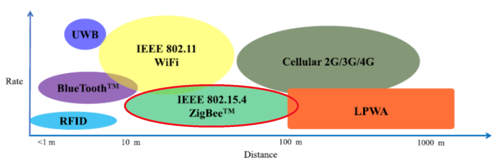
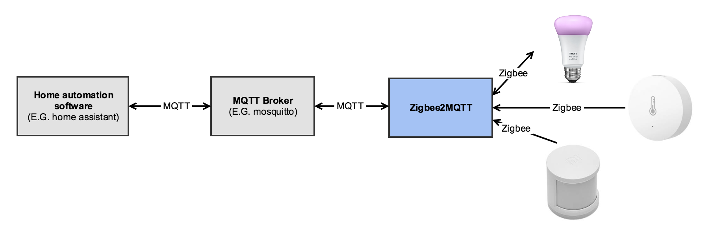
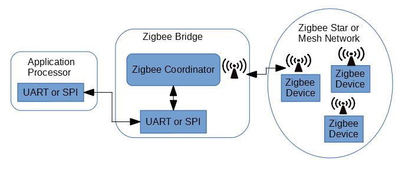
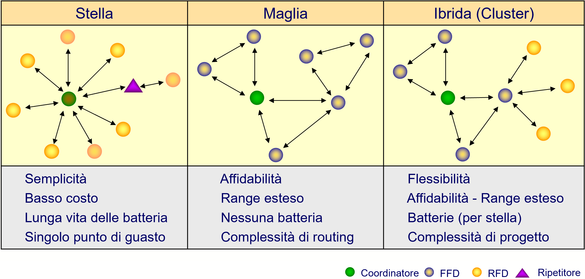
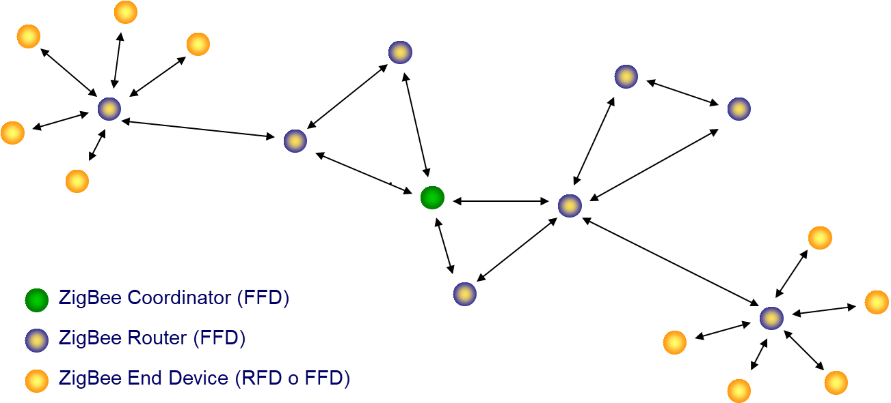
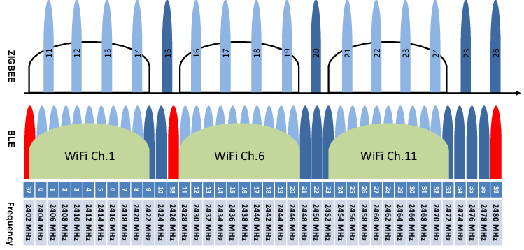
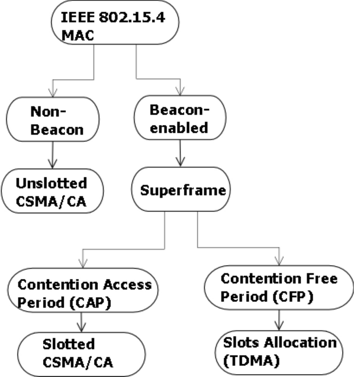
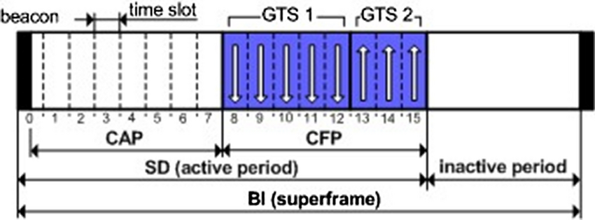

## **TECNOLOGIA WSN ZIGBEE**

>[Torna a reti di sensori](sensornetworkshort.md#classificazione-delle-tecnologie-wsn-in-base-a-velocità-e-copertura)

- [Dettaglio architettura Ethernet](archeth.md)
- [Dettaglio architettura BLE](archble.md)
- [Dettaglio architettura WiFi infrastruttura](archwifi.md)
- [Dettaglio architettura WiFi mesh](archmesh.md) 
- [Dettaglio architettura LoraWAN](lorawanclasses.md) 
- [Dettaglio architettura 5G/6G](ranprivata.md)
- [Dettaglio architettura RFID](archrfid.md)

Servizi:
- [DNS](https://it.wikipedia.org/wiki/Domain_Name_System)
- [DHCP](https://it.wikipedia.org/wiki/Dynamic_Host_Configuration_Protocol)
- [PVLAN](/approfondimenti/private_vlan.md)
- [VPN di reti Ethernet](ethvpn.md).
- [Secure network moderne](/approfondimenti/dispensa_reti_moderne.md)
- [Firewall](firewall.md)
- [ACL](approfondimenti/acl/dispensa_sistemi_reti.md)
- [Autenticazione 802.1X](radius.md)
- [Autenticazione SSO Active Directory](/approfondimenti/00_dispensa_principale.md)
- [Autenticazione utente](/approfondimenti/autenticazione_utente.md)
- [Autenticazione di un link](/approfondimenti/autenticazione_collegamento_guida.md)
- [Autenticazione SSO OpenId](/approfondimenti/dispensa-openid.md)
- [Continuità di servizio](/approfondimenti/continuita_di_servizio.md)
- [Backup](backup.md)
- [Spillamento fibra](/esempi/progetti/dettaglio_spillamento_fibra.md) 
- [Subnetting Ipv6](/esempi/progetti/subnettingipv6.md)

---

## **Caso d'uso Zigbee** 

Date le particolarità della tecnologia, i casi d'uso per la rete di sensori sono quelli tipici applicazioni **IoT indoor** a **corto/medio raggio**, dove concorre con altre tecnologie di rete: WIFi, BLE e, sotto certe condizioni, LoRaWAN. Punti di forza che portano a preferire Zigbee sono essenzialmente:
- possibilità di realizzare **comandi** a distanza wireless anche molto piccoli con una **lunga durata** delle batterie (dell'ordine degli anni).
- possibilità di realizzare **sensori** ambientali molto piccoli e alimentati con batterie che possono essere sostituite dopo anni.
- possibilità di poter mettere **pochi gateway** verso la rete LAN, anche a grande distanza dai sensori e dai comandi che devono poter **coordinare**.
- architettura a **hop multiplo** del collegamento di un dispositivo verso il router più vicino della rete Zigbee che è esso stesso un dispositivo Zigbee.
- **rete di sensori** composta **dai sensori** stessi avendo alcuni (in genere gli attuatori) piena capacità di **routing**, cioè di inoltro dei messaggi tra loro e verso il gateway con la rete LAN (i dispositivi oltre ad essere sensori ed attuatori sono anche infrastruttura).
- **affidabilità** della rete di sensori **indipendente** da quella della rete dati. Topologia predisposta alla **ridondanza** dei percorsi tra i nodi IoT aventi funzioni di routing.
- utilizzo di una modulazione **robusta** e predisposta ad una efficace **convivenza** con una rete **WiFi** presente nello stesso ambiente.



## **Aspetti critici**

- [Aspetti critici comuni per tutte le tecnologie](approfondimenti/aspetti_critici_generali.md)
- **Aspetti particolari per Zigbee**

     - Posizionamento in planimetria dei **nodi** con relativa etichetta, avendo cura di posizionare tra essi
  almeno **un gateway** che permetta l'accesso a una rete IP. Progettare dei **percorsi alternativi
  (backup)** in caso di guasto del gateway principale.
     - Tecnologie dei dispositivi: definizione della **tipologia di servizio** (polling sincrono,
  comando asincrono, ecc.).
     - Gestire eventuali **vincoli di prossimità** (mediante controllo di potenza o gestione del roaming)
  ed eventuali **vincoli di posizionamento** (mediante trilaterazione).
     - Definizione del percorso dei dati tra sensori ed eventuali attuatori per stabilire la
  **sede dell'elaborazione dei comandi** più opportuna (locale/edge sul gateway vs remota on-premise/cloud).


---

## **Progetto di esempio completo**

[Testo della prova Albergo Domotizzato](/esempi/progetti/albergo.pdf)

[Svolgimento Albergo Domotizzato](/esempi/progetti//albergo_soluzione.md)

---

[Rete di reti Zigbee](/approfondimenti/zigbee_federation.md)
       
[Broker MQTT](/approfondimenti/broker_mqtt.md)

[Messaggi MQTT](/approfondimenti/messaggi_mqtt.md)

[Server di gestione](/approfondimenti/server_di_gestione.md)

[Sensori](/approfondimenti/sensore.md)

[Cheat Sheet](/cheatsheet/cheatsheet.md)

---

## **Profili Zigbee**

Ogni dispositivo Zigbee aderisce a un profilo di dispositivo specifico che descrive le sue funzionalità e capacità. Questi profili sono standardizzati per garantire che i dispositivi di produttori diversi possano funzionare insieme senza problemi. Alcuni esempi di profili di dispositivi sono:
- **Home Automation (HA)**: Utilizzato per applicazioni domestiche come luci, termostati e serrature.
- **Smart Energy (SE)**: Usato per applicazioni di gestione energetica come contatori intelligenti e dispositivi di controllo della domanda.
- **Building Automation (BA)**: Impiegato in contesti commerciali per il controllo di illuminazione, HVAC e sicurezza.

### **Cluster Library**

Zigbee utilizza un concetto chiamato "clusters", che sono gruppi di attributi e comandi legati a una funzione specifica. Ad esempio, un cluster di illuminazione potrebbe includere comandi per accendere/spegnere una luce e per regolare la luminosità. Ogni cluster ha un ID univoco e può essere riutilizzato in diversi profili di dispositivo.

### **Endpoints**

I dispositivi Zigbee possono avere uno o più "endpoints", che sono punti di comunicazione logici che mappano le funzionalità del dispositivo. Ogni endpoint supporta uno o più cluster e ha un proprio ID univoco. Ad esempio, un dispositivo potrebbe avere un endpoint per il controllo della luce e un altro per la gestione dell'energia.

### **Attribute Reporting**

Gli attributi all'interno dei cluster possono essere configurati per segnalare automaticamente i cambiamenti. Questo è essenziale per applicazioni in tempo reale come il monitoraggio dell'energia o la sicurezza domestica.

### **Binding**

Il binding è un processo che collega due endpoint di dispositivi diversi, consentendo loro di comunicare direttamente tra loro. Questo è utilizzato, ad esempio, per associare un interruttore a una luce specifica senza passare attraverso un hub centrale.

### **Scenario d'Uso**

Immaginiamo di avere un'applicazione di controllo della casa intelligente che deve interagire con una lampadina Zigbee.

#### **Basic Cluster (0x0000):**

Il Basic Cluster include informazioni generali sul dispositivo e alcune funzioni di configurazione di base.

```
Attributes:
  ZCLVersion (0x0000): Versione del protocollo Zigbee.
  ApplicationVersion (0x0001): Versione dell'applicazione.
  ManufacturerName (0x0004): Nome del produttore.
  ModelIdentifier (0x0005): Identificatore del modello.
```

#### **Accendere la Lampadina:**

```
Comando: On
Cluster: On/Off Cluster (0x0006)
Payload: 0x01
```

```Json
{
  "source_endpoint": 1,
  "destination_endpoint": 1,
  "Cluster": "0x0006",
  "Command": "0x01"
}
```

#### **Impostare la Luminosità a 50%:**

```
Comando: MoveToLevel
Cluster: Level Control Cluster (0x0008)
Payload:
  Level: 128 (50% di 255)
  TransitionTime: 10 (1 secondo)
```

```Json
{
  "source_endpoint": 1,
  "destination_endpoint": 1,
  "Cluster": "0x0008",
  "Command": "0x00",
  "Payload": {
    "Level": 128,
    "TransitionTime": 10
  }
}
```

#### **Spegnere la Lampadina:**

```
Comando: Off
Cluster: On/Off Cluster (0x0006)
Payload: 0x00
```

```Json
{
  "source_endpoint": 1,
  "destination_endpoint": 1,
  "Cluster": "0x0006",
  "Command": "0x00"
}
```
---

## **Zigbee: gateway come router applicativo** 

### **Ruolo del gateway** 

**Riassumendo**, alla **rete di distribuzione IP** si collegano, quindi, una o più **reti secondarie** che servono da **rete di accesso** per i dispositivi sensori o attuatori con **interfacce** spesso di tipo **non ethernet** che necessitano di un **gateway** di confine con possibili funzioni di:     
  - **Inoltro**, cioè smistamento dei messaggi da un tipo di rete all'altro di tipo L3 (**routing**) o di tipo L2 (**bridging**). L'inoltro del messaggio di un sensore può essere:
       - **diretto** nella rete di distribuzione tramite link fisico verso il dispositivo di smistamento (router o switch) più vicino.
           - Nel caso di una LAN il gateway possiede un indirizzo IP privato.
           - Nel caso di una WAN il gateway possiede un indirizzo IP pubblico.
       - **indiretto** tramite una dorsale virtuale, cioè un **tunnel**, verso il network server o verso un router di una WAN privata, realizzato, ad esempio, in maniera cifrata tramite un **client di VPN**, oppure in maniera non cifrata tramite un client di tunnel generico **GRE**. In questo caso il **gateway** possiede:
         - un indirizzo **IP pubblico** nell'interfaccia in **Internet**. 
         - un **IP privato** nell'interfaccia sul **tunnel cifrato**. Il tunnel cifrato, per VPN L3, è gestito con una subnet IP **separata** per ogni tunnel.
  - **Traduzione di formato** dei messaggi da **rete Zigbee** a rete **ethernet** con eventuale realizzazione del **bridge** L4 tra il livello applicativo in uso nella rete di sensori e quello in uso nella rete di distribuzione.
  - **Interrogazione periodica** (polling) dei dispositivi nella rete di sensori (master di una architettura master/slave)
  - **Raccolta e memorizzazione** delle informazioni per essere trasferite in un **secondo momento** al server di gestione
  - **Protezione della rete di sensori**, cioè di firewall, soprattutto quando questa, tramite il gateway, si connette direttamente alla rete **Internet** mediante un **IP pubblico**.

Il **gateway** è uno **snodo nevralgico** dei messaggi, per cui la sua posizione dovrebbe essere **ben nota** e accuratamente **riportata in planimetria** per permettere una sua rapida manutenzione/sostituzione.

E' il dispositivo posto a cavallo tra la rete di accesso ai sensori e la rete di distribuzione. 

Il **gateway** ha tante **schede di interfaccia** quanti sono i **tipi diversi di rete** a cui si collega. Inoltre il **gateway** deve possedere almeno **una interfaccia** capace di traffico ethernet (cablata o wifi) che lo colleghi alla **rete di distribuzione**. 

### **Gateway come router ci confine**

Il gateway è anche il **router di confine** della rete Zigbee, cioè il primo router che si collega con gli altri nodi router della rete di sensori. Per migliorare l'affidabilità sarebbe opportuno che questo nodo realizzi collegamenti verso nodi diversi della rete Zigbee creando **più percorsi fisici** con funzione di **ridondanza**. Con questo intento potrebbe essere utile posizionare il gatreway in una **locazione densa di router** nelle vicinanze, quale un corridoio con molte lampade lampade.

### **Gateway come Client MQTT**

In **generale**, su reti **non IP**, i **client MQTT** (con il ruolo di **publisher** o di **subscriber**) sono sempre i **gateway di confine** della **rete di sensori**. Le uniche reti di sensori che non hanno bisogno di un gateway di confine che sia, nel contempo anche client MQTT, sono le reti IP. Esistono ancora i gateway nelle **reti IP** ma con **scopi diversi** da quello di **realizzare** un **client MQTT**. Nelle **reti IP**, il **client MQTT** è, normalmente, direttamente **a bordo** del **dispositivo** sensore dotato di indirizzo IP (**MCU**).

### **Gateway come MCU hub di sensori**

La **parola gateway** potrebbe talvolta portare a **fraintendimenti** dovuti al diverso significato nei **diversi contesti** in cui la si usa. **Spesso**, con il **termine gateway** si intente anche il **dispositivo IoT** che potrebbe essere, **a sua volta**, un **gateway** tra la il **link di campo**, porte analogiche/digitali o BUS, (vedi [bus di campo](cablatisemplici.md) per dettagli) e la **rete di sensori** (WiFi, Zigbee, LoraWAN, LAN, BLE, ecc.). Vedi ([dispositivi terminali](sensornetworkshort.md#dispositivi-terminali-sensoriattuatori)) per approfondimenti.

### **Gateway come router L7**

Avendo più interfacce su reti di tipo diverso sia in L1 che in L2, ha anche le funzioni di **router**. Se la rete di distribuzione è pubblica come **Internet** dovrebbe possedere pure le funzioni di **firewall**. 

Ma la funzione **più importante** che possiede nel contesto di una rete di dispositivi IoT è la **traduzione** della **semantica**, cioè del significato degli oggetti, dalla rete **zigbee** al livello applicativo **MQTT** che smista i messaggi nella rete IP. Questa funzione rende il gateway un **bridge di traduzione** di comandi da un ambiente all'altro.

**Misure** e **comandi** sono definiti due volte:
- nella **rete di distribuzione** sotto forma di **oggetti JSON** in formato ASCII. Questo dovrebbe garantire da un lato l'interoperabilità tra reti di sensori diverse, dall'altro l'interoperabilità con sistemi terzi che si occupano della pubblicazione dei dati o della loro eleborazione statistica. Il fatto che il formato scelto sia chiaro, testuale ed autoesplicativo è sicuramente un vantaggio nella rete di **distribuzione**.
- nella **rete di sensori** (Zigbee) dove hanno una loro rappresentazione che normalmente non coincide con quella in uso nella rete di distribuzione.

In ogni caso, per gli **oggetti Zigbee**, la semantica dei comandi e dello stato è **standardizzata**, nel senso che dispositivi di **marche diverse** si possono **comandare** allo **stesso modo**. Tutti i dispositivi di **ugual tipo** si rappresentano come uno **stesso oggetto** Zigbee, avente gli **stessi attributi** per tutti i dispositivi di quel tipo.

Gli oggetti JSON scambiati nella rete di distribuzione vanno **progettati** in modo tale da includere la **semantica** di tutti i dispositivi IoT coinvolti nelle reti di sensori collegate, che di volta in volta, poi andrà **tradotta** nella **semantica applicativa standard** prevista nello stack della rete di accesso Zigbee.

### **Traduzione della semantica applicativa** 

**Zigbee2mqtt** è un software open-source progettato per permettere ai dispositivi Zigbee di comunicare direttamente con un server MQTT (Message Queuing Telemetry Transport) senza la necessità di un hub proprietario. 



**Zigbee** è uno **standard** di comunicazione wireless (protocollo) utilizzato per il controllo e l'automazione domestica, mentre **MQTT** è un protocollo di messaggistica leggero utilizzato per il trasferimento di dati tra dispositivi. Utilizzando **Zigbee2mqtt**, gli utenti possono integrare facilmente dispositivi Zigbee di diversi produttori in un sistema di automazione domestica basato su MQTT, con elevata flessibilità e controllo.



Il bridge **zigbee2mqtt** opera a livello di **presentazione** della pila OSI ed esegue, nell'ordine, le seguenti **operazioni**:
1. **sbusta** tutti i messaggi provenienti dall'interfaccia Zigbee uno dopo l'altro, a partire dal **livello fisico** fino ad arrivare al **livello di presentazione**, dove Zigbee realizza la sua **rappresentazione semantica** dell'oggetto comandato/attuato/configurato, completa di **attributi** e corrispondenti **valori**.
2. a questo punto **traduce** il **payload Zigbee** in un **payload JSON** che contiene gli stessi attributi con gli stessi valori. 
3. dopo di che **smista** il **JSON** così costruito sull'**interfaccia IP** del gateway, dove viene imbustato come **payload** del protocollo **MQTT** ed **inviato** fino al **broker**.

Il bridge **zigbee2mqtt** funge da **ponte** tra la rete Zigbee e il broker MQTT, consentendo agli utenti di interagire con i dispositivi Zigbee tramite messaggi MQTT. 

La **traduzione** è resa possibile perchè le reti Zigbee definiscono per ogni dispositvo la **semantica applicativa standard** che abbiamo visto sopra (una lampadina ha gli stessi comandi, lo stesso stato e la stessa configurazione per tutte le lampadine Zigbee mai prodotte da chiunque). Compito del bridge **zigbee2mqtt** è **tradurre** gli **oggetti standard** Zigbee in **JSON** e inserirli in un **messaggio MQTT**.

#### **Funzionamento di zigbee2mqtt** 
Ecco una descrizione di come funziona zigbee2mqtt:

1. **Scansione dei Dispositivi Zigbee**: zigbee2mqtt esegue una scansione per rilevare dispositivi Zigbee nelle vicinanze e li aggiunge alla rete Zigbee.
2. **Connessione ai Dispositivi Zigbee**: zigbee2mqtt si connette ai dispositivi Zigbee per leggere e scrivere dati. Questo include sensori, attuatori, lampadine, interruttori, ecc.
3. **Pubblicazione su MQTT**: I dati letti dai dispositivi Zigbee vengono convertiti in messaggi MQTT e pubblicati su un broker MQTT. Questo può includere dati di stato, misurazioni di sensori, ecc.
4. **Sottoscrizione a Comandi MQTT**: zigbee2mqtt si iscrive anche a determinati topic MQTT per ricevere comandi. Quando un comando MQTT viene ricevuto, zigbee2mqtt lo traduce in un'operazione Zigbee e lo invia al dispositivo appropriato.

#### **Configurazione di zigbee2mqtt** 

Per controllare tre lampadine diverse sotto lo stesso topic stanzetta usando zigbee2mqtt, è possibile configurare un approccio che permetta di inviare comandi a tutte e tre le lampadine contemporaneamente o individualmente. Un modo efficace per farlo è usare un payload JSON che includa informazioni specifiche per ciascuna lampadina.

```Python
homeassistant: false
permit_join: true
mqtt:
  base_topic: zigbee2mqtt
  server: 'mqtt://localhost'
  user: 'MQTT_USERNAME'
  password: 'MQTT_PASSWORD'
serial:
  port: '/dev/ttyUSB0'
devices:
  '0x00124b0014d2b5d2':
    friendly_name: lampadina1
  '0x00124b0014d2b5d3':
    friendly_name: lampadina2
  '0x00124b0014d2b5d4':
    friendly_name: lampadina3
```
Il parametro permit_join: true nella configurazione di Zigbee2MQTT permette ai nuovi dispositivi Zigbee di unirsi alla rete Zigbee. Quando questa opzione è attivata, il coordinatore Zigbee accetta nuovi dispositivi che cercano di connettersi. Mantenere permit_join attivato permanentemente non è consigliato per motivi di sicurezza, poiché potrebbe permettere a dispositivi non autorizzati di connettersi alla rete Zigbee.

Per permettere ad un sensore di comando di modificare lo stato di un attuatore, in Zigbee è sempre necessario effettuare il **binding** (associazione) tra i due dispositivi (in gergo **endpoint**).

Una volta che le lampadine sono **riconosciute** da Zigbee2MQTT, possono eesere configurate per accettare i **comandi MQTT**. La **configurazione** di Zigbee2MQTT si occuperà del **binding automatico** tra il gateway e tutte le lampadine.

Ora, configurando un singolo topic zigbee2mqtt/stanzetta/comandi per inviare comandi a tutte e tre le lampadine, possiamo usare un payload JSON per specificare lo stato desiderato di ogni lampadina.

#### **Accendere tutte le Lampadine:**

```Bash
#!/bin/bash

# Accendere lampadina1
mosquitto_pub -h localhost -t 'zigbee2mqtt/lampadina1/set' -m '{"state": "ON"}'

# Accendere lampadina2
mosquitto_pub -h localhost -t 'zigbee2mqtt/lampadina2/set' -m '{"state": "ON"}'

# Accendere lampadina3
mosquitto_pub -h localhost -t 'zigbee2mqtt/lampadina3/set' -m '{"state": "ON"}'
```

#### **Spegnere tutte le Lampadine:**

```Bash
#!/bin/bash

# Accendere lampadina1
mosquitto_pub -h localhost -t 'zigbee2mqtt/lampadina1/set' -m '{"state": "OFF"}'

# Accendere lampadina2
mosquitto_pub -h localhost -t 'zigbee2mqtt/lampadina2/set' -m '{"state": "OFF"}'

# Accendere lampadina3
mosquitto_pub -h localhost -t 'zigbee2mqtt/lampadina3/set' -m '{"state": "OFF"}'
```

#### **Comandare le Lampadine Singolarmente:**

```Bash
#!/bin/bash

# Accendere lampadina1
mosquitto_pub -h localhost -t 'zigbee2mqtt/lampadina1/set' -m '{"state": "ON"}'

# Accendere lampadina2
mosquitto_pub -h localhost -t 'zigbee2mqtt/lampadina2/set' -m '{"state": "OFF"}'

# Accendere lampadina3
mosquitto_pub -h localhost -t 'zigbee2mqtt/lampadina3/set' -m '{"state": "ON"}'
```

#### **Utilizzo dei topic**

Puoi definire una gerarchia di topic MQTT per raggruppare le lampadine. Ad esempio, potresti avere un topic per ciascun ambiente della tua casa o per ciascun piano dell'edificio. Ecco un esempio di come potrebbe apparire la gerarchia dei topic:

```Bash
casa/
  └── soggiorno/
      ├── lampadina1/
      │   ├── comandi
      │   └── stato
      ├── lampadina2/
      │   ├── comandi
      │   └── stato
      └── lampadina3/
          ├── comandi
          └── stato
```
In questo esempio, ```casa``` è il prefisso di tutti i tuoi topic MQTT. All'interno di questo prefisso, hai un sotto-topic per il soggiorno chiamato ```soggiorno```, e all'interno di questo sotto-topic hai i sotto-topic per ciascuna delle tue lampadine, ciascuno dei quali ha due sotto-topic: ```comandi``` e ```stato```.

```Bash
mqtt:
  base_topic: casa
  server: 'mqtt://localhost'
  user: 'MQTT_USERNAME'
  password: 'MQTT_PASSWORD'
serial:
  port: '/dev/ttyUSB0'
devices:
  '0x00124b0014d2b5d2':
    friendly_name: lampadina1
    state_topic: 'soggiorno/lampadina1/stato'
    set_topic: 'soggiorno/lampadina1/comandi'
  '0x00124b0014d2b5d3':
    friendly_name: lampadina2
    state_topic: 'soggiorno/lampadina2/stato'
    set_topic: 'soggiorno/lampadina2/comandi'
  '0x00124b0014d2b5d4':
    friendly_name: lampadina3
    state_topic: 'soggiorno/lampadina3/stato'
    set_topic: 'soggiorno/lampadina3/comandi'
```

#### **Accendere una lampadina del Soggiorno**
```Bash
mosquitto_pub -h localhost -t 'casa/soggiorno/lampadina1/comandi' -m '{"state": "ON"}'
```

#### **Accendere Tutte le Lampadine nel Soggiorno**
```Bash
mosquitto_pub -h localhost -t 'casa/soggiorno/comandi' -m '{"state": "ON"}'
```

#### **Spegnere Tutte le Lampadine nel Soggiorno**
```Bash
mosquitto_pub -h localhost -t 'casa/soggiorno/comandi' -m '{"state": "OFF"}'
```
---

## **Matter: gateway come router L3**


**Crea un'unica rete** utilizzando livelli di rete **compatibili** o **praticamente uguali** come sono **IPV6 e 6LowPan**. Lo stesso deve accadere per i **protocolli di routing** usando ad es. REPL. Se le condizioni di **uniformità** dei protocolli sono **soddisfatte solo parzialmente**, ad esempio mantenendo uguale protocollo di inoltro (6LowPAN) ma **protocolli di routing diversi** (OSPF nella rete di distribuzione e REPL in quella dei sensori), allora il router deve necessariamente possedere anche limitate funzionalità di **gateway**, in questo caso almeno per effettuare l'interoperabilità tra **dominii di routing** differenti.


**Estensione naturale — Matter come payload IPv6 in una rete IP di soli router L3**: i protocolli di livello fisico e data link (L1 e L2 OSI) sono diversi da IP mentre quelli di livello di rete e trasporto (L3 e L4 della pila OSI) sono esattamente gli stessi. Una conseguenza diretta dell'avere un **livello applicativo standardizzato** (come Matter) **sopra** un livello di rete unificato (IPv6/6LoWPAN) è che il **payload applicativo** può viaggiare **intatto** attraverso una qualunque rete IP intermedia, senza che gli apparati di rete debbano conoscerne il significato. I router della rete di distribuzione restano **semplici smistatori di livello 3** in senso ISO/OSI puro: vedono pacchetti IPv6 + UDP cifrati e li instradano, esattamente come farebbero per un qualunque flusso applicativo. All'estremità di **consumo** del payload Matter si presentano due scenari, entrambi compatibili con la stessa identica rete di trasporto:
- **Scenario 1. attuatore Matter nativo**: il dispositivo destinatario è un endpoint Matter a tutti gli effetti, decifra il payload TLV grazie alle chiavi di sessione condivise con il mittente, ed esegue direttamente il comando. È la realizzazione più pura della **Strategia 1**: il gateway tra le due reti fisiche è davvero solo un router e non c'è alcuna traduzione applicativa. L'attuatore potrebbe essere indifferentemente in una rete IP o in una Zigbee/Thread e sarebbe comunque in grado di intepretare la semantica applicativa Matter ed eseguire corrrettamente il comando ad essa associato.
- **Scenario 2. Connettore applicativo**: il dispositivo destinatario è un controller Matter "intelligente" (ad esempio **Node-RED** con plugin Matter, oppure **Home Assistant**) che non si limita ad eseguire il comando, ma **decifra il TLV**, lo **traduce in un formato web-friendly** (tipicamente JSON) e lo **ripubblica** su un secondo canale applicativo: un broker MQTT per server applicativi, un endpoint REST per dashboard web, un database time-series per statistiche, e così via.

La **proprietà** che viene garantita in questo schema è una doppia separazione di competenze: la **rete IP** non vede mai la semantica applicativa, e la **traduzione semantica** verso protocolli di consumo (MQTT, REST, ecc.) avviene solo all'**endpoint applicativo**, non in mezzo. Il connettore non è quindi un **bridge** nel senso tecnico discusso più avanti (non sta a cavallo tra due reti fisiche eterogenee) ma un **client Matter legittimo** che fa da **pivot semantico** verso il mondo delle web API. La crittografia end-to-end di Matter resta intatta fino al connettore, perché questo è un interlocutore autorizzato della fabric, non un man-in-the-middle.


Questo modello realizza in modo molto pulito il principio **end-to-end** della rete IP: l'intelligenza sta agli estremi, la rete in mezzo è "stupida" e generica, e lo stesso payload può essere consumato da destinazioni diverse (un attuatore fisico, una dashboard web, un server statistico) senza che nessuna di queste richieda modifiche all'infrastruttura di rete.

La **standardizzazione** del livello applicativo possiede anche il vantaggio di poter associare senza sforzo un dispositivo IoT ad un **server applicativo** che ne comanda o gestisce molti altri semplicemente esibendo **nome e versione del protocollo** di presentazione. Sarà poi l'applicazione (ad es. OpenHab, Home Assistant) a cercare nel proprio database il **formato** definito dallo standard per quella particolare categoria (in gergo entità) a cui appartiene il dispositivo da associare.
  


---

## **Rete di sensori Zigbee** 

In **alternativa**, si possono sfruttare le funzionalità di creazione e gestione dei **gruppi** e di **segmentazione della rete** offerte dal protocollo Zigbee, per organizzare i dispositivi in **gruppi logici** all'interno di una **stessa rete** di sensori Zigbee.



I dispositivi ZigBee possono essere configurati in modo da realizzare diverse topologie di reti. Una topologia largamente usata è la quella mesh.
Più reti possono organizzarsi in cluster con una struttura logica ad albero (spanning tree ottimo). Viene così realizzata una rete peerto-peer con un minimo overhead di routing.



Caratteristiche distintiva di questa tecnologia di rete di sensori  è la **topologia a maglia** che comporta che:
- qualunque dispositivo collegato **alla rete elettrica** diventa un **router**. Cioé, insieme ad un elettrodomestico (ad es. una lampadina) o ad una macchina industriale si compra pure un dispositivo di rete. Piú se ne mettono e piú la rete é estesa e affidabile.
- un **dispositivo di comando** non deve spendere l'energia per arrivare al gateway o all'attuatore remoto, ma solamente quella necessaria a raggiungere il **primo router** (next hop), cioè il primo elettrodomestico domotizzato nelle vicinanze.

Ecco la trattazione adattata per lo **Zigbee (basato sullo standard IEEE 802.15.4)**, mantenendo la stessa struttura e lo stesso taglio logico incentrato sulla gestione delle dimensioni radio e sulla struttura della supertrama.

---

## **Collisioni nello Zigbee**

La tratta tra un dispositivo terminale (End Device), un Router e il Coordinatore in una rete Zigbee è un collegamento radio che, essendo un **mezzo broadcast** (se uno parla, tutti ascoltano), è per sua natura soggetta al fenomeno delle collisioni (interferenza distruttiva tra i messaggi).

In generale, in una rete Zigbee le **collisioni** tra messaggi di sorgenti diverse vengono evitate o ridotte sfruttando le **dimensioni disponibili** della comunicazione radio, sebbene con vincoli hardware più stringenti rispetto a tecnologie industriali o cellulari.

Esistono due **direzioni** di trasmissione, entrambe soggette a collisione:

* **uplink** dal dispositivo terminale verso i router o il coordinatore.
* **downlink**, dal coordinatore/router verso i dispositivi terminale.


### **SDM: Separazione spaziale e topologia Mesh**

I dispositivi Zigbee sono tipicamente apparati a corto raggio e bassa potenza. L'**attenuazione di spazio libero** viene sfruttata geometricamente attraverso la **topologia Mesh**:

* Coppie di dispositivi sufficientemente lontane tra loro possono trasmettere contemporaneamente sullo stesso canale frequenziale senza interferire, poiché i rispettivi segnali decadono prima di sovrapporsi con potenza distruttiva.
* La rete frammenta la copertura in tanti piccoli saltelli (multi-hop). Questo permette il riuso della stessa frequenza in punti diversi della casa o dell'industria, ottimizzando lo spazio ed evitando che un singolo device impegni l'etere dell'intera area coperta dalla rete.

### **FDM: Selezione del canale (Coesistenza statica)**

A differenza di altre tecnologie, lo standard Zigbee standard non implementa un *frequency hopping* dinamico pacchetto per pacchetto. Nella banda ISM a 2.4 GHz, lo standard suddivide lo spettro in **16 canali fissi** (numerati da 11 a 26), larghi 2 MHz e spaziati di 5 MHz l'uno dall'altro.

Al momento della creazione della rete, il Coordinatore effettua una scansione energetica dei canali (Energy Scan) per identificare quello meno affollato (ad esempio per evitare i canali Wi-Fi più usati) e **fissa la rete su quel singolo canale**. Tutti i dispositivi della rete comunicheranno da quel momento in poi su quell'unica frequenza. La separazione in frequenza (FDM) serve quindi a isolare *reti Zigbee diverse* nello stesso spazio, o a evitare interferenze esterne, ma non a separare i client della stessa rete.

### **DSSS: Robustezza del codice (Direct Sequence Spread Spectrum)**

Zigbee non possiede un meccanismo di modulazione multi-codice parallelo (come il multi-SF). Tuttavia, per proteggere i pacchetti dalle collisioni e dal rumore all'interno dello stesso canale, utilizza il **DSSS**.

Ogni blocco di 4 bit di dati viene convertito a livello fisico in una sequenza ortogonale di 32 chip (detta *pseudo-random noise sequence*). Questa espansione dello spettro fornisce un **guadagno di processo** che permette al ricevitore di ricostruire correttamente il messaggio anche in presenza di interferenze parziali o rumore di fondo. Se due pacchetti collidono ma uno arriva con una potenza nettamente superiore (effetto cattura), il DSSS permette di decodificare il messaggio più forte ignorando quello più debole come semplice rumore.

### **CSMA/CA e GTS: Separazione nel tempo e accesso al mezzo**

L'ultima e fondamentale grandezza per isolare i messaggi all'interno della stessa rete è il **Tempo**. Lo Zigbee può operare in due modalità gestite nel dominio del tempo:

* **Accesso a contesa (CSMA/CA):** Nella modalità asincrona (Non-Beacon enabled), i dispositivi usano il meccanismo *Listen Before Talk*. Prima di trasmettere, il device esegue un controllo del canale (CCA - Clear Channel Assessment). Se il canale è occupato, attende il tempo imposto da un algoritmo di **Backoff esponenziale causale** prima di riprovare. Se due device trasmettono nello stesso istante, avviene una collisione; l'assenza del pacchetto di ACK (conferma) obbligherà i nodi a ripetere la procedura aumentando il tempo di attesa.  [Dettaglio CSMA/CA](protocollidiaccesso.md#csmaca) 
* **Accesso programmato (GTS - Guaranteed Time Slots):** Nella modalità sincrona (Beacon-enabled), il tempo viene regolato centralmente eliminando la contesa per i messaggi critici, allocando slot temporali dedicati in logica TDMA.

---

## **Tipologie di nodi** 

Le specifiche dello standard distinguono 3 tipi di dispositivi:
- Il **coordinatore**, che ha il compito di organizzare la rete e conservare le tabelle di routing. Svolge pure il ruolo di trust center e di archivio per le chiavi di sicurezza.
- I **router** (FFD o full function device), che possono parlare con tutti gli altri dispositivi
- I **dispositivi finali** (Reduced function devices o RFD), hanno funzionalità ridotte e possono parlare con in router e il coordinatore, ma non direttamente tra di loro. Non essendo router, non smistano mai i dati generati da altri. Possono restare inattivi per molto tempo, garantendo così una lunga durata della batteria

  
### **Consumo energetico** 

Bassissimo consumo dei **nodi di comando** dato che, per inviare un messaggio ad un nodo attuatore posto in un luogo remoto della rete, devono spendere sempre e soltanto l'energia necessaria a raggiungere il nodo router più vicino

Per minimizzare il consumo di potenza, e quindi massimizzare la durata delle batterie, i **dispositivi finali** passano la maggior parte del loro tempo “addormentati” (**sleep mode**), si svegliano soltanto quando hanno bisogno di comunicare, e poi si riaddormentano immediatamente.

Lo **standard** prevede invece che i **router** ed il **coordinatore** siano collegati alla rete elettrica e siano **sempre attivi**. Non hanno quindi dei vincoli sul consumo di potenza

### **Potenza e banda di trasmissione**

La potenza in trasmissione usata nella banda a 2.4GHz è compresa tra -3dBm e 10dBm con valore tipico 0dBm
Nella banda 915MHz il limite massimo è di 1000 mW (30dBm). Tuttavia, i terminali costruiti secondo la tecnologia “system-onchip” limitano la potenza intorno ai 10dBm.
Nella banda 868MHz il limite massimo è di circa 14dBm (25mW). La potenza minima deve essere almeno di -3dBm

In generale, la **banda di frequenza** usuale di Zigbee è 2,4 GHz. La specifica Zigbee definisce l'utilizzo di diverse tecniche di modulazione, tra cui Frequency-Hopping Spread Spectrum (FHSS) e Direct Sequence Spread Spectrum (DSSS):
- **FHSS**: Con FHSS, il segnale radio cambia frequenza in modo sincronizzato tra il trasmettitore e il ricevitore su una serie di frequenze specifiche all'interno della banda ISM. Questo aiuta a ridurre le interferenze e a migliorare la sicurezza della trasmissione. [Modulazione FHSS](accessoradio.md#fhss)
- **DSSS**: DSSS, d'altra parte, suddivide i dati in segnali più piccoli, noti come chip, e li trasmette su una larghezza di banda molto più ampia rispetto al segnale originale. Questo aumenta la resistenza alle interferenze e migliora la qualità della trasmissione. [Modulazione DSSS](accessoradio.md#dsss)

L'utilizzo del **FHSS**, in particolare, permette la selezione automatica dei canali in maniera da facilitare la **coesistenza** con un wifi domestico selezionando i salti di frequenza a ridosso degli avvallamenti sempre presenti tra un canale wifi e l'altro.



Zigbee utilizza 16 canali (da 11 a 26) nella banda 2,4 GHz in tutto il mondo, 13 canali nella banda 915 MHz in Nord America, e un unico canale nella banda 868 MHz in Europa. Alcuni dispositivi utilizzano anche la banda 784 MHz in Cina per Zigbee.

Attraverso questi canali, ogni dispositivo Zigbee utilizza una larghezza di banda fino a 2 MHz mentre due canali diversi sono separati da una banda di guardia di 5 MHz per prevenire interferenze dovute ad altri dispositivi Zigbee. La velocità dati che può essere raggiunta nella banda da 2,4 GHz è di 250 Kbps per canale, 40 Kbps per canale nella banda 915 MHz e 20 Kbps per canale nella banda 868 MHz. Tuttavia, il throughput effettivo che può essere fornito è inevitabilmente inferiore ai valori specificati, a causa di vari fattori come il sovraccarico dei pacchetti, i ritardi di elaborazione e la latenza del canale. Le radio Zigbee generalmente forniscono una potenza di uscita di 1-100 mW su queste bande di frequenza.

---

## **Beacon**

I beacon sono delle **sequenze di sincronizzazione** (dette preambolo) in grado sia di sincronizzare gli **orologi** dei dispositivi (Tx e Rx) che si accingono ad iniziare una comunicazione, ma anche di **indentificare** in maniera univoca i dispositivi che li emettono. Per dei dettagli vedi [preambolo di sincronizzazione](protocolli.md#preambolo-di-sincronizzazione).

La trama dati compresa tra **due beacon** consecutivi viene detta **supertrama** (superframe) ed è generalmente divisa in due zone con **politiche di accesso** al canale diverse:  
- una **deterministica** al riparo dalle collisioni detta **CFP** (Contention Free Period) e regolata dalla multiplazione statica TDMA, che viene usata per trasmettere i dati delle comunicazioni **unicast**.
- una **probabilistica** a contesa, in cui i tentativi di accesso dei dispositivi sono soggetti al **rischio di collisione** perchè regolata da un protocollo di tipo **CSMA/CA**, che invece serve per trasmettere delle particolari informazioni **broadcast** dette **advertisement**.

Nel contesto di Zigbee, un **coordinatore** può assumere un ruolo di **coordinamento**, simile a quello svolto dal PCF in una rete Wi-Fi, gestendo l'accesso al canale in modo master/slave in cui il centrale ha il ruolo di **master** che stabilisce **quale** stazione deve parlare, **quando** e **per quanto** tempo usando una politica di **turnazione** delle stazioni (**polling**).

La situazione può essere riassunta nel seguente modo:



La **superframe** è una trama composta di **16 slot** temporali di uguale larghezza all'interno dei quali inviare i dati di una o più **applicazioni**. E' delimitata da una **coppia di beacons** e viene spedita dal **coordinatore**. 



I **beacons** sono usati per:  
 - sincronizzare i dispositivi
 - identificare il PAN coordinator
 - descrivere la struttura della superframe.
   
Il **PAN coordinator** può dedicare porzioni della superframe ad applicazioni a **bassa latenza** quali quelle multimediali. Queste porzioni sono chiamate garanteed time slot (**GTS**) e sono regolate in maniera deterministica frazie alla multiplazione statica TDM.

Il PAN coordinator può allocare fino 7 di questi GTS per una singola applicazione, ognuno dei quali può occupare più di un periodo di slot. Ad ogni dispositivo che sta trasmettendo in un GTS viene assicurato che la sua operazione venga completata prima dell’inizio del successivo GTS.

Tutte le transazioni basate su contesa saranno completate prima dell’inizio del CFP.

### **Slotted CSMA** 

Lo **slotted CSMA** (Carrier Sense Multiple Access) è un protocollo di accesso al canale utilizzato come via di mezzo tra il GTS e il CSMA/CA. E' comunque un protocollo a contesa probabilistico e funziona seguendo questi passaggi:

- **Divisione del tempo in slot**: Il tempo viene diviso in intervalli di tempo fissi, chiamati slot temporali. Ogni slot ha una durata predefinita e tutti i dispositivi nella rete sono sincronizzati su questi slot.
- **Ascolto del canale** (Carrier Sense): Prima di trasmettere dati, un dispositivo controlla se il canale è occupato o libero ascoltando il mezzo trasmissivo. 
- **Accesso al canale slotted**: Quando un dispositivo decide di trasmettere, aspetta fino all'inizio del prossimo slot temporale disponibile per inviare i dati. Questo significa che tutte le trasmissioni avvengono in momenti ben definiti, consentendo una gestione più ordinata del traffico.
- **Evitamento delle collisioni**: Il rilevamento del canale e l'accesso al canale slotted aiutano a evitare collisioni durante la trasmissione dei dati. Se più dispositivi tentano di trasmettere nello stesso slot, solo uno di essi avrà successo, mentre gli altri rileveranno la presenza di un segnale e ritenteranno la trasmissione in un momento successivo.

In genere, per reti a stella, il CSMA/CA senza slot è migliore del CSMA/CA con slot in termini di probabilità di successo del pacchetto, consumo di energia e ritardo. Mentre CSMA/CA con slot è migliore di CSMA/CA senza slot in termini di throughput, cioè capacità complessiva di traffico.

---

## **Tipologie di servizio** 

Molti sistemi (wifi, zigbee, bluetooth BLE, LoRaWan, Sigfox) permettono di impostare **contemporaneamente**, sulla **stessa interfaccia** radio, un **servizio sincrono** mediante **TDMA** per le sorgenti che eseguono il **polling** di sensori e un **servizio asincrono** con **ALOHA** o **CSMA/CA** per le sorgenti che devono effettuare la **notifica** del **comando** di un pulsante di accensione di un attuatore. Ciò è ottenuto **attivando** sul canale la funzionalità **beacon** con le cosiddette **superframe**, divise in zone dedicate a:
- **servizi sincroni** concentrati nella parte deterministica della **supertrama**, regolata in modo master slave dal nodo con accesso TDMA
- **servizi asincroni** concentrati nella parte probabilistica della **supertrama**, regolata in modo peer to peer dai dispositivi IoT con accesso CSMA/CA.
- **servizi asincroni a bassa latenza** concentrati nella parte probabilistica slottata della **supertrama**, regolata in modo peer to peer dai dispositivi IoT con accesso CSMA/CA slottato.

Le **tipologie di servizio** supportate da Zigbee quindi sono:
- **Dati periodici**. Si utilizza tipicamente con sorgenti con rate definito che siano anche sincrone, cioè trasmesse regolarmente ad intervalli prestabiliti. Si utilizza una modalità di accesso senza contesa di tipo **TDM** basata sulle superframe delimitate da beacon. Ad esempio, sensori ambientali potrebbero inviare dati di temperatura ogni minuto o ogni ora in modo periodico.
- **Dati intermittenti**. Si riferisce a dati trasmessi occasionalmente o in risposta a specifici eventi. Ad esempio, un sensore di movimento potrebbe inviare dati solo quando rileva un movimento, che può essere sporadico. La modalità di accesso al canale è a contesa basata su **CSMA/CA**. 
- **Dati ripetitivi a bassa latenza**. Questo tipo di messaggi potrebbe essere efficacemente supportato durante gli slot CAP (Contend Access period) delle superframe mediante un accesso multiplo CSMA/CA slottato.

### **Abilitazione ai beacon**

Nelle reti **abilitate ai beacon**, i router Zigbee trasmettono beacon periodici per confermare la loro presenza ad altri nodi di rete. I nodi possono rimanere inattivi in stato di sleep tra un beacon e l'altro, prolungando così la durata della batteria. Gli intervalli dei beacon dipendono dalla velocità dei dati; possono variare da 15,36 millisecondi a 251,65824 secondi a 250 kbit/s, da 24 millisecondi a 393,216 secondi a 40 kbit/s e da 48 millisecondi a 786,432 secondi a 20 kbit/s. Intervalli di segnale lunghi richiedono tempistiche precise, che possono essere costose da implementare in prodotti a basso costo.

I link radio nel **modo non abilitato al beacon** sono regolati dal CSMA/CA e, i nodi della rete con funzioni di smistamento (router), non essendo sincronizzati a ricevere su istanti prefissati, devono rimanere costantemente accesi e quindi alimentati.

Nel caso delle reti in **beacon mode**, i **link** sono regolati in maniera probabilistica con lo slotted CSMA/CA oppure in maniera deterministica con il GTS. I **router** possono beneficiare dei lunghi periodi di inattività tra **due beacon** per risparmiare energia massimizzando la durata di una eventuale alimentazione a batteria. Questa modalità di risparmio energetico è nota come "duty cycling" o "sleeping router". 

In generale, i protocolli Zigbee riducono al minimo il tempo di accensione della radio, così da ridurre il consumo energetico. Nelle reti di beacon, i nodi devono essere attivi solo durante la trasmissione di un beacon. Nelle reti non abilitate ai beacon, il consumo energetico è decisamente asimmetrico: alcuni dispositivi sono **sempre attivi** (generalmente i router) mentre altri passano la maggior parte del tempo a dormire (i nodi terminali RFD).

---

### **Pagine correlate:**

- [Dettaglio architettura Ethernet](archeth.md)
- [Dettaglio architettura BLE](archble.md)
- [Dettaglio architettura WiFi infrastruttura](archwifi.md)
- [Dettaglio architettura WiFi mesh](archmesh.md) 
- [Dettaglio architettura LoraWAN](lorawanclasses.md) 

**Sitografia**:

- https://ieeexplore.ieee.org/document/7042600
- https://en.wikipedia.org/wiki/Zigbee
- https://www.zigbee2mqtt.io/supported-devices/
- https://www.zigbee2mqtt.io/
- https://www.zigbee2mqtt.io/advanced/zigbee/05_create_a_cc2530_router.html#result
- https://www.zigbee2mqtt.io/guide/adapters/#recommended
- https://www.amazipoint.com/uart%20bridge%20en%204.html
- https://www.researchgate.net/figure/Zigbee-Gateway-architecture-It-must-be-remarked-that-Zigbee-Alliance-has-also-developed_fig4_41392302
- https://www.everythingrf.com/community/zigbee-frequency-bands#:~:text=In%20general%2C%20the%20common%20frequency,due%20to%20other%20Zigbee%20devices.
- chatGPT per il partizionamento dei una rete Zigbee
 
>[Torna a reti di sensori](sensornetworkshort.md#classificazione-delle-tecnologie-wsn-in-base-a-velocità-e-copertura)
