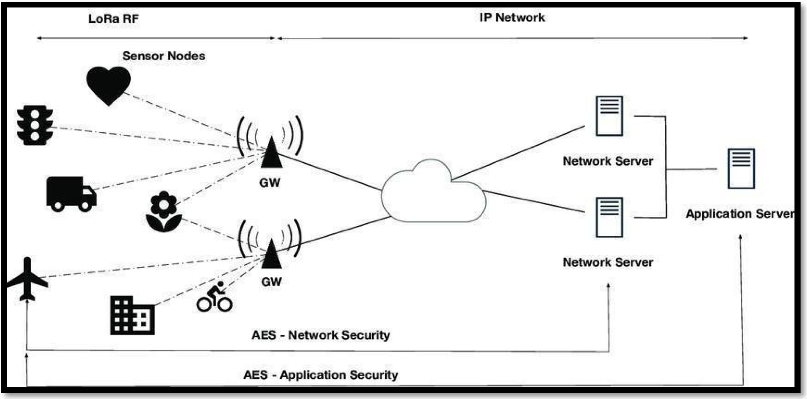

>[Torna a reti di sensori](sensornetworkshort.md#classificazione-delle-tecnologie-wsn-in-base-a-velocità-e-copertura)

Di seguito è riportata l'architettura generale di una rete Zigbee. Essa è composta, a **livello fisico**, essenzialmente di una **rete di accesso** ai sensori e da una **rete di distribuzione** che fa da collante di ciascuna rete di sensori.

La rete di sensori fisica è a stella dove il centro stella è il gateway. Un sensore può anche essere associato a più gateway ed inviare dati a tutti i gateway a cui esso è associato. I dati normalmente arrivano ad un certo dispositivo attraverso un solo gateway.

I gateway utilizzano la rete internet (o una LAN) per realizzare un collegamento diretto **virtuale** con il network server, per cui, in definitiva, la topologia risultante è:
- **fisicamente** quella di più **reti di accesso** a stella tenute insieme da una **rete di distribuzione** qualsiasi purchè sia di tipo TCP/IP (LAN o Internet).
- **logicamente** quella di una stella di reti a stella. Il **centrostella** di livello gerarchico più alto è il **network server** ed aggrega solo gateways, gli altri centrostella sono realizzati dai **gateway** che aggregano solamente **dispositivi IoT**.

  
   

I dispositivi ZigBee possono essere configurati in modo da realizzare diverse topologie di reti. Una topologia largamente usata è la quella mesh.

Le specifiche dello standard distinguono 3 tipi di dispositivi:
- Il **coordinatore**, che ha il compito di organizzare la rete e conservare le tabelle di routing
- I **router**, che possono parlare con tutti gli altri dispositivi
- I **dispositivi finali** (Reduced devices), che hanno funzionalità ridotte e che possono parlare con in router e il coordinatore, ma non tra di loro

Più reti possono organizzarsi in cluster con una struttura logica ad albero (spanning tree ottimo). Viene così realizzata una rete peerto-peer con un minimo overhead di routing.

Bassissimo consumo dei nodi di comando dato che, per inviare un messaggio ad un nodo attuatore posto in un luogo remoto della rete, devono spendere sempre e soltanto l'energia necessaria a raggiungere il nodo router più vicino

Per minimizzare il consumo di potenza, e quindi massimizzare la durata delle batterie, i dispositivi finali passano la maggior parte del loro tempo “addormentati” (sleep mode), si svegliano soltanto quando hanno bisogno di comunicare, e poi si riaddormentano immediatamente.

Lo standard prevede invece che i router ed il coordinatore siano collegati alla rete elettrica e siano sempre attivi. Non hanno quindi dei vincoli sul consumo di potenza

La potenza in trasmissione usata nella banda a 2.4GHz è compresa tra -3dBm e 10dBm con valore tipico 0dBm
Nella banda 915MHz il limite massimo è di 1000 mW (30dBm). Tuttavia, i terminali costruiti secondo la tecnologia “system-onchip” limitano la potenza intorno ai 10dBm.
Nella banda 868MHz il limite massimo è di circa 14dBm (25mW). La potenza minima deve essere almeno di -3dBm

>[Torna a reti di sensori](sensornetworkshort.md#classificazione-delle-tecnologie-wsn-in-base-a-velocità-e-copertura)
