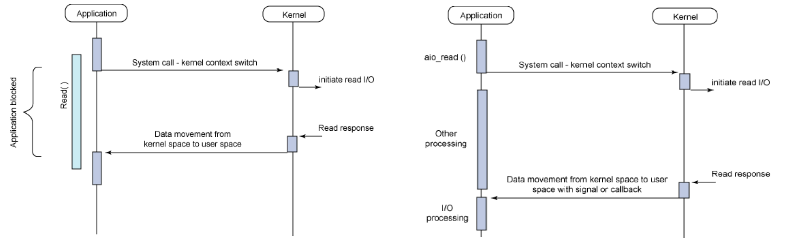
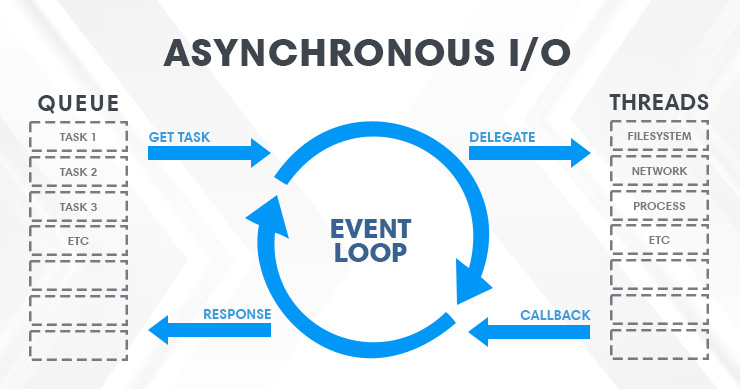
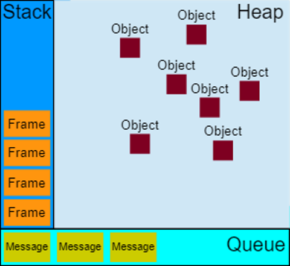
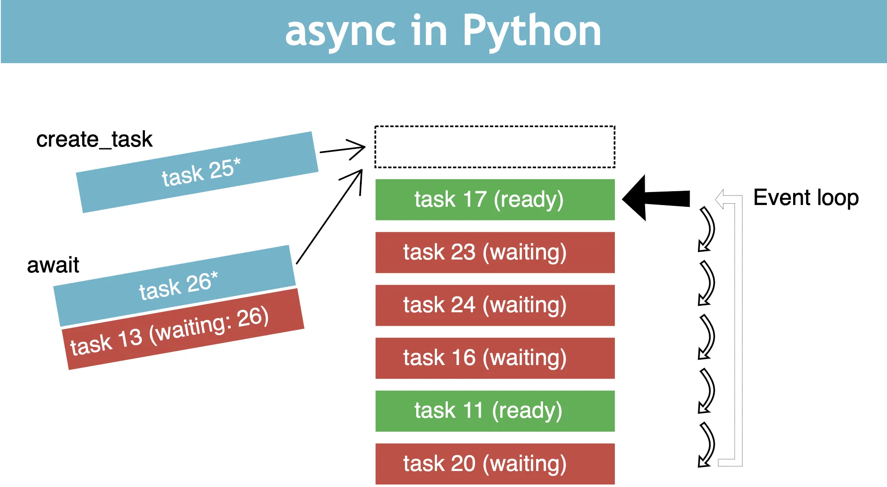
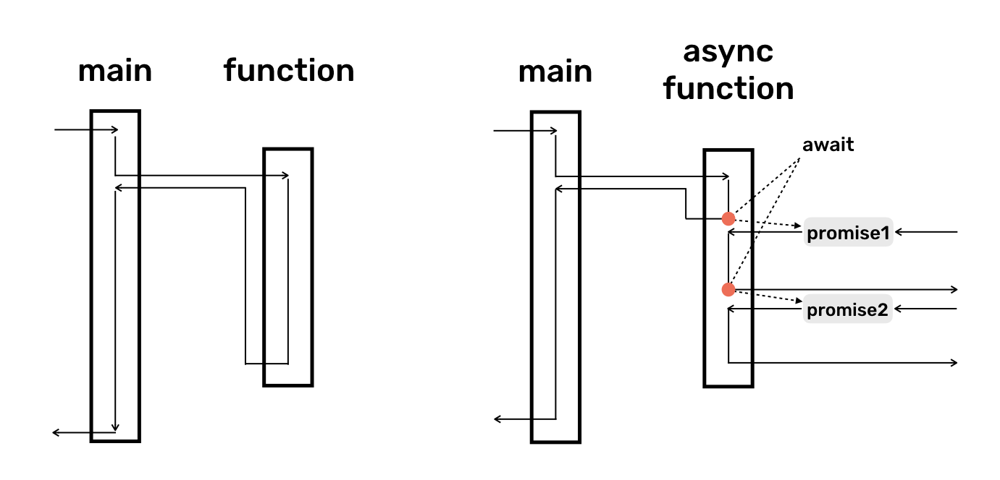

>[Torna all'indice generazione tempi](indexgenerazionetempi.md)   >[Versione in Python](async_await_py.md)

# **SCHEDULAZIONE CON ASYNC/AWAIT**

### **Base teorica**

Gestione con I/O sincrono bloccante in figura a sinistra. Gestione con I/O asincrono e non bloccante nella stessa figura ma a destra.



### **Eventi vs thread**
Il modello di gestione della CPU nei SO normalmente è di tipo **multithreading  preemptive**, cioè con interruzione anticipata del task in esecuzione con riassegnazione della risorsa CPU ad un altro task, per almeno due motivi:
- Evitare lo spreco della risorsa CPU in attesa di un input bloccante che tarda la sua risposta di un tempo non prevedibile
- per realizzare un multitasking equo (fair) tramite l’esecuzione concorrente di più task in tempi uguali

Il modello di gestione della CPU in ambienti server come node JS e client come l’ambiente javascript di un browser web, invece, è normalmente a **singolo thread** dove il **multitasking** è generato non utilizzando il multithreading ma un modello di esecuzione **ad eventi (event driven runtime)** composto da:
- Un **singolo thread**
- Un singolo task in esecuzione alla volta (esecuzione **seriale** dei **task**)
- Più input in elaborazione contemporaneamente (esecuzione **parallela** degli **input**)

### **Modello ad eventi**

I **casi d'uso** che potrebbero beneficiare di un modello a thread singolo ad eventi potrebbero essere:
- **Concorrenza in un ambiente a thread singolo**. Alcuni linguaggi/ambienti di programmazione hanno un solo thread. Un altro esempio è un microcontrollore con risorse limitate che esegue un sistema operativo senza thread. In tutti questi casi, se si ha bisogno di **concorrenza**, le coroutine sono l'unica scelta.

- **Per semplificare il codice**. Può essere fatto usando la parola chiave **yield**, usando **async/await** per **"appiattire"**, cioè ridurre ad un **unico livello di annidamento** il codice asincrono evitando **l'inferno delle callback** o scrivendo codice asincrono in **stile imperativo** cioè lineare e **sequenziale**, molto più naturale da **scrivere** e **mantenere** rispetto ad un groviglio disordinato di callback che non seguono un filo temporale preciso.

- Maggiore **efficienza** e maggiore **scalabilità** delle risorse del sistema operativo e dell'hardware. In presenza di applicazioni che consumano molti thread, si può trarre vantaggio dalle coroutine risparmiando sull'allocazione della memoria, il tempo necessario per eseguire il cambio di contesto e, in definitiva, trarre vantaggio dall'utilizzo più efficiente dell'hardware che, a **parità di risorse**, adesso può **eseguire più task**. Un esempio è l'utilizzo dell'IO non bloccante con molti utenti simultanei. Poiché in generale i thread sono più costosi dei socket, i thread disponibili del sistema operativo si possono esaurire più rapidamente dei socket. Per evitare questo problema è possibile utilizzare l'IO non bloccante con le coroutine.



La libreria async.io ha un modello di runtime basato su un ciclo di eventi (event loop), che è responsabile:
- dell'esecuzione del codice
- della raccolta e dell'elaborazione degli eventi
- dell'esecuzione delle dei sotto task (sub-tasks) in coda.
   
Questo modello è abbastanza diverso dai modelli in altri linguaggi come C e Java basati su processi e thread.
Una proprietà molto interessante è che un **linguaggio ad eventi**, a differenza di molti altri linguaggi, **non blocca** mai gli altri task quando si è in attesa di un input sul task corrente.

La **gestione dell'I/O** viene in genere eseguita tramite **eventi** e **callback**:
- ad un **evento** sono associate una o più **callback**.
- Un **evento** è un’**azione** eseguita in qualche **I/O**. 
- Una **callback** è una **funzione** che viene richiamata quando viene **servito** l’evento ad essa **associato**.
- Gli eventi che occorrono (accadono) **contemporaneamente** e che sono pronti per essere processati dalla CPU vengono ospitati in una **coda** di messaggi. In questa attesa il sistema può ancora **elaborare** altri eventi immagazzinandoli in coda rimanendo così **responsivo**. 

Il primo messaggio in coda viene di volta in volta estratto e processato per essere **eseguito** inserendo la sua **callback**, e tutte le funzioni ad essa annidate, in altrettanti **frame** sullo stack. La callback correntemente sullo stack, viene eseguita fino a che non ritornano tutte le sottofunzioni ad essa annidate.

### **Allocazione della RAM**


Gli oggetti sono allocati nella heap che è un’ampia regione di memoria per lo più non strutturata.
Gli eventi sono immagazzinati in una coda di messaggi. 
Ogni messaggio ha una funzione associata (listener) che viene chiamata per gestire il messaggio.


### **Meccanismo di esecuzione**



Ad un certo punto durante il ciclo di eventi, il processo runtime inizia a gestire i messaggi sulla coda, a partire da quello più vecchio. Per fare ciò:
- Il messaggio viene rimosso dalla coda
- la sua funzione corrispondente (callback listener) viene chiamata con il messaggio come parametro di input. 
- come sempre, la chiamata di una funzione crea un nuovo stack frame per l'uso di quella funzione.

L'elaborazione delle funzioni continua finché lo stack non è nuovamente vuoto. Quindi, il ciclo di eventi elaborerà il messaggio successivo nella coda (se ce n'è uno).

Loop di gestione degli eventi:
```python
while queue.waitForMessage():
	queue.processNextMessage()

```
La funzione queue.waitForMessage() attende in modo sincrono l'arrivo di un messaggio (se uno non è già disponibile e in attesa di essere gestito).

### **Run to completition**

Ogni messaggio viene elaborato completamente prima che venga elaborato qualsiasi altro messaggio.

Questo comportamento induce alcune proprietà desiderabili sui programmi, incluso il fatto che, ogni volta che una funzione viene eseguita, non può essere terminata in anticipo e verrà eseguita interamente prima dell'esecuzione di qualsiasi altro codice (chee potrebbe alterare i dati manipolati dalla funzione). Ciò differisce da C, ad esempio, dove se una funzione viene eseguita in un thread, può essere interrotta in qualsiasi momento dal sistema di runtime (un timer HW) per eseguire altro codice in un altro thread.

Uno svantaggio di questo modello è che se un messaggio richiede troppo tempo per essere completato, l'applicazione Web non è in grado di elaborare le interazioni dell'utente come il clic di un pulsante.  Una buona pratica da seguire è rendere breve l'elaborazione dei messaggi e, se possibile, scomporre un messaggio in più messaggi.

### **Aggiunta di un messaggio in coda**

- **Ascoltatore:** nei sistemi di I/O asincroni, i **messaggi** vengono aggiunti alla coda dei messaggi ogni volta che si verifica un **evento**. Ad ogni evento è collegato un **listener** (ascoltatore) di eventi. Se non c'è un ascoltatore, l'evento è perso. 

- **Delay zero apparente:** l'argomento della funzione di ritardo ```asyncio.sleep(t_sec)```, il valore del tempo timeout rappresenta il ritardo (minimo) dopo il quale il messaggio verrà inserito nella coda. 
Se non ci sono altri messaggi nella coda e lo stack è vuoto, il messaggio viene elaborato subito dopo il ritardo. 
Tuttavia, se sono presenti altri messaggi, il messaggio ```asyncio.sleep()``` dovrà **attendere** la loro elaborazione. Per questo motivo, l'argomento indica un **tempo minimo**, non un **tempo garantito**. Si potrebbe attendere sia perchè in coda ci stanno task pesanti oppure perchè ci stanno molti task piccoli ma tutti con **delay zero** e quindi non interlacciabili con lo sleep del task in esame. Questo problema nasce a causa del fatto che la gestione degli eventi è si parallela ma quella dei tasck in coda è pur sempre sequenziale. Di questo fatto si deve tenere nella realizzazione di un eventuale del **polling delle periferiche**.

### **Callback**
Un callback è una funzione che:
- viene passata ad un’altra funzione (via riferimento) con l'aspettativa che venga chiamata al momento opportuno
- Poiché la chiamata di queste funzioni spesso è legata alla notifica di un evento esterno al sistema (I/O dell’utente o l’arrivo di un messaggio da internet) di cui non si è in grado di prevedere in anticipo il tempo in cui accadrà, esse vengono dette asincrone (analogia con gli interrupt).
- Il parametro della chiamata è un messaggio che contiene le proprietà correnti dell’evento

Le callback sono il modo principale in cui vengono implementate in un modello ad eventi le azioni di risposta ad un evento, spesso mediante funzioni definite una sola volta nel codice in forma anonima.

Le callback possono essere:
- **Disgiunte** (separate) se relative ad eventi slegati tra loro che accadono in maniera indipendente
- **Annidate** una dentro l’altra se ogni callback è associata ad un evento attivato proprio dentro un’altra callback mediante una richiesta di I/O. Sono particolarmente difficili da approcciare in maniera chiara.

### **Future**

Una **future** è un oggetto restituito da una funzione **asincrona**, che rappresenta lo stato corrente dell'operazione di recupero di una informazione (da I/O o da un timer HW). 
- Nel momento in cui la future viene restituita al chiamante, l'operazione spesso non è terminata (pending). L'oggetto future fornisce **due funzioni** sotto forma di callbacks per gestire l'eventuale **successo (fulfilled)** o **fallimento (rejected)** dell'operazione.
- I metodi verranno richiamati in un **tempo successivo** (non noto in anticipo) allorquando la future si dice che verrà **risolta**.
- Una future è un oggetto Python che collega il momento della produzione di codice asincrono con quello del suo consumo. In pratica, sono oggetti usati per collegare codice a basso livello **ad eventi** (basato sulle callback) con codice ad alto livello **sequenziale** (basato su async/await).
- Le future sono in genere **restituite** da funzioni di **I/O** predisposte per questo.

### **Async/await**

Il **caso d'uso** principale per **async/await** è rendere più **semplice** la scrittura di **codice asincrono** o, in generale, qualsiasi codice che utilizzi molte callback o futures/promesse. In particolare, async/await può aiutare a evitare **l'inferno delle callback** annidate (callback hell noto anche come piramide del destino) scrivendo programmi in **stile imperativo** invece che **ad eventi**. L'obiettivo è **ristrutturare** il programma in modo che sia **più facile** da **scrivere** e **mantenere** per gli umani. Anche se i programmi asincroni sono il caso d'uso più comune, async/await non richiede che il codice sia effettivamente asincrono o utilizzi IO non bloccanti. Fondamentalmente, si tratta solo di trasformazione strutturale di un programma.



```python
import uasyncio
async def c():
    print('2')
    await uasyncio.sleep_ms(2000)
    print('4')
    await uasyncio.sleep_ms(5000)
    print('5')

async def main():
    print('1')
    uasyncio.create_task(c()) # inserisce il task nel loop
    await uasyncio.sleep_ms(0) # permette di cominciare l'altro task prima che termini il corrente
    print('3')
    await uasyncio.sleep_ms(10000) # attende il tempo necessario per completare gli altri task

uasyncio.run(main()) # Crea un nuovo task dalla coroutine specificata e lo esegue fino al completamento.
```

Link simulazione online: https://wokwi.com/projects/369865863273101313

Le funzioni asincrone sono tecnica che rende molto più intuitiva la gestione delle promesse svincolandola dall'esigenza di definire per ciascuna due callback.

Ciò avviene in Python tramite le cosidette **"coroutine"**. Una coroutine è una subroutine (funzione) che può essere **sospesa** e **ripresa**. Viene **sospesa** dall'espressione di **await** e ripresa una volta **risolta** la await. La ripresa dal punto di sospensione avviene mantenendo gli argomenti e le variabili locali della funzione sospesa. 

La sospensione del flusso di controllo di un task avviene spontaneamente normalmente per due motivi:
- attesa di un timer HW (funzione sleep)
- attesa della risposta differita di un I/O

Ad ogni **sospensione pendente** corrisponde l'**attesa** di un **evento** che **risolve** la Future (o la Promise) che la sblocca. Una volta risolta viene inserita nella **coda** di esecuzione il **microtask** associato a quella Future risolta positivamente. Potrebbe esserci pure un microtask alternativo associato ad una future non risolta (alla scadenza di un timeout).

Nonostante il nome, Il blocco di codice async diventa per tutte le funzioni che restituiscono una future, sincrono e bloccante nel senso che, ciascuna funzione con **await davanti**, rimane bloccata e non può passare all’istruzione successiva fino a che la **sua future** non viene **risolta**. Il blocco dell'esecuzione è in realtà solamente **apparente** perchè è sostanzialmente **emulato** ma, nonostante tutto, **efficace** nell'**impedire** l'esecuzione le **istruzioni seguenti** all'interno dello stesso task.
- **Await** va usato soltanto **dentro** un blocco di codice **async** e **davanti** a funzioni che **restituiscono una future**.
- Possiamo usare un blocco try...catch per la gestione degli errori, esattamente come si farebbe se il codice fosse sincrono.
- le funzioni dichiarate **asincrone** con async davanti **restituiscono** sempre una **future** per cui await forza il completamento in serie delle operazioni asincrone quando il risultato dell'operazione successiva dipende dal risultato della precedente. 

Esisono delle **differenze implementative** nella realizzazione delle coroutine neii vari **linguaggi**. Il **comportamento comune** a tutti è che una **coroutine**, una volta invocata, non ritornerà subito alla funzione chiamante (sincrona) ma solo successivamente, seguendo un percorso **a tappe**, man mano che gli eventi che essa, di volta in volta, **attende** verranno, **risolti tutti**. La **differenza** risiede essenzialmente nel comportamento della **funzione chiamante**:  
- In **Javascript**, ad esempio, una funzione **normale sincrona** che chiama una funzione asincrona (coroutine) **ritorna sempre** dopo essere stata eseguita **per intero**. Rimane la particolarità del JS di trattare il main che, pur essendo una funzione sincrona, viene considerata alla stregua di un task come un altro, anzi è proprio il **primo task** che viene inserito nella coda dei messaggi.
- in **Python**, il meccanismo è del tutto analogo ma, in questo caso, il loop dei messaggi non è nativamente gestito dal linguaggio come in JS, ma deve essere attivato esplicitamente, ad esempio, con ```asyncio.run(main())```. Inoltre il main non è di base un task gestito dal loop dei messaggi ma dalla schedulatore dei thread del SO sottostante.
  
Il modello **async/await** fornise un meccanismo di **blocco dei task** (compiti) in cima a un **sistema ad eventi**, senza l'overhead di uno stack per ogni thread. Lo **scopo** del modello è quello di implementare un **flusso sequenziale di controllo** senza utilizzare complesse macchine a stati finiti ed evitando l'overhead di un multi-threading completo, cioè quello dotato anche del **modo preemptive**.  L'asynchronous I/O scheduler fornisce la sola **modalità cooperativa** e il **rilascio anticipato** delle risorse è realizzato in maniera cooperativa **senza l'utilizzo di interrupt** che generino il **cambio di contesto** dei thread forzato da uno schedulatore parte del SO. 

### **Confronto con le altre tecniche**

Anche i **processi** e i **thread** sono flussi di esecuzione indipendenti che procedono in parallelo su una o più CPU, esiste però una **differenza pratica** notevole tra di essi:
- nei **processi** sia input/output, che **area dati globale** che **area dati locale** (stack) sono indipendenti e utilizzate nello **stesso tempo** ma in zone diverse della memoria RAM. Il **parallelismo** è **reale** sia per gli **eventi** che per i **task**.
- nei **thread**  input/output e **area dati globale** sono **in comune** nella **stessa posizione** in RAM mentre soltanto le **aree dati locali** (stack) sono indipendenti e utilizzate nello **stesso tempo** ma in **zone diverse** della memoria RAM secondo una logica a divisione di spazio (SDM). Anche in questo caso il **parallelismo** è **reale** sia per gli **eventi** che per i **task**.
- nei **modello ad eventi** sia input/output che l'**area dati globale** ma anche se le **aree dati locali** (stack) sono **in comune**, queste occupano tutta la RAM ma in **istanti diversi** secondo una logica a divisione di tempo (TDM). Pertanto le **variabili locali** sono isolate perchè utilizzate in momenti diversi. In questo caso il **parallelismo** per gli **eventi** è reale mentre per i **task** la gestione rimane **sequenziale** e realizzata mediante una **coda di messaggi**.

### **Utilizzo in pratica**

**Ogni task asincrono** realizza un **flusso** di esecuzione **indipendente** da quello degli altri task, inoltre ognuno possiede un proprio **loop() principale** di esecuzione in cui realizzare le operazioni che tipicamente riguardano le **tre fasi** di lettura degli ingressi, calcolo dello stato del sistema e della sua risposta e la fase finale di scrittura della risposta sulle uscite. Il loop principale è definito sotto forma di **ciclo infinito** come ad esempio:

```python
while True:
    # codice del task
    #.........................

```
Le **fasi di lavoro** del loop possono essere **schedulate** (pianificate nel tempo) dal delay() ```asyncio.sleep(t_sec)``` che restituiscono un oggetto **future** (future) che, pur essendo non bloccante, fa **ritornare in anticipo** la funzione, **prima** che possa eseguire altre istruzioni **emulando** quindi, in tutto e per tutto, una **funzione bloccante**. Questa proprietà permette la progettazione sostanzialmente **lineare** e **sequenziale** di un algoritmo nel tempo.

- **Ogni task** è definito da una **funzione asincrona**, dichiarata come tale attraverso la parola chiave async.
- Ogni task ha una parte di **setup** in cui vengono iniziate le variabili di servizio del loop del task.
- ogni task possiede una porzioe di **loop infinito** in cui vengono eseguite le operazioni del task, in maniera del tutto indipendente da quelle definite all'interno degli altri task.
- ogni task può essere **"bloccato"** da qualunque funzione che, nel contemnpo, sia preceduta dalla parola chiave **await** e restitisca una **future**. Queste funzioni sono in genere o delle funzioni di I/O oppure dei delay che restituiscono oggetti future come ```asyncio.sleep_ms```.

```python
async def nome_task(x):
    # setup del tasl
    count = 0
    # loop del tasl
    while True: 
        count += 1
        print('Instance: {} count: {}'.format(x, count))
        await asyncio.sleep(delay_secs)
        print('Hello')
        await asyncio.sleep_ms(delay_ms)
```

Se si volesse bloccare l'esecuzione di un task finchè un flag, asserito in un altro task, non la sblocca si deve tenere conto che non si può usare un blocco del genere
```python
    global flag
    while not flag:
        pass
    flag = False
    #.........................

```
ma piuttosto il seguente:
```python
    global flag
    while not flag:
        await asyncio.sleep(0)
    flag = False
    #.........................

```

Il **flusso di esecuzione** di un task è **definito** all'interno di una **funzione asincrona** e può essere avviato passando allo schedulatore il riferimento a questa funzione sotto la forma di parametro. In sostanza la funzione **serve** al programmatore per definire il task e allo schedulatore per poterlo richiamare. Allo scopo si usa la funzione ```asyncio.create_task(nome_task)``` che apparentemente blocca il task in cui è inserita ma non impedisce la schedulazione parallela degli altri task.

E' importante notare che anche la funzione **main** deve essere resa asincrona con la parola chiave async se si desidera eseguirla in parallelo con gli altri task seguendo una modalità cooperativa. In sostanza, anche la funzione **main deve** diventare un **task asincrono**. Se così non fosse, una funzione di ritardo delay() oppure una qualunque funzione di I/O bloccante monopolizzarebbero l'unico thread a disposizione impedendo la schedulazione degli altri task.

Il task principale che contine il main può essere mandato in esecuzione con la funzione ```asyncio.run(main()))``` .

In definitiva la **dichiarazione e definizione** di **descrittore e funzione** del pattern async/await possono assumere la forma:

```python
import uasyncio as asyncio
async def bar(x):
    count = 0
    while True:
        count += 1
        print('Instance: {} count: {}'.format(x, count))
        await asyncio.sleep(1)  # Pause 1s

async def main():
    for x in range(3):
        asyncio.create_task(bar(x))
    await asyncio.sleep(10)

asyncio.run(main())
```

**Una tipica app firmware**

La maggior parte delle applicazioni firmware funziona ininterottamente per sempre. Ciò richiede che la coroutine del task sia passata a asyncio.run() e che dopo il main attende una await su una funzione non terminante (che giri per sempre).

Per facilitare il debug e per la compatibilità con CPython, nell'esempio seguente viene suggerito del codice "boilerplate".

Per impostazione predefinita, un'eccezione in un'attività non interromperà l'esecuzione dell'intera applicazione. Questo può rendere difficile il debug. 

È una cattiva pratica creare un'attività prima di eseguire asyncio.run(). CPython genererà un'eccezione in questo caso. MicroPython no, ma è saggio evitare di farlo.

Infine, uasyncio mantiene lo stato. Ciò significa che, per impostazione predefinita, è necessario riavviare tra le esecuzioni di un'applicazione. Questo può essere risolto con il metodo new_event_loop.

```python
import uasyncio as asyncio
from my_app import MyClass

def set_global_exception():
    def handle_exception(loop, context):
        import sys
        sys.print_exception(context["exception"])
        sys.exit()
    loop = asyncio.get_event_loop()
    loop.set_exception_handler(handle_exception)

async def main():
    set_global_exception()  # Debug aid
    my_class = MyClass()  # Constructor might create tasks
    asyncio.create_task(my_class.foo())  # Or you might do this
    await my_class.run_forever()  # Non-terminating method
try:
    asyncio.run(main())
finally:
    asyncio.new_event_loop()  # Clear retained state
```
### **Esempi**

**Blink sequenziali interagenti**

Di seguito è riportato un esempio di **blink sequenziale** in esecuzione su **due thread** separati su scheda **Arduino Uno**, con **IDE Arduino** e  con la libreria **protothread.h**  (https://gitlab.com/airbornemint/arduino-protothreads). I thread sono senza stack e **non preemptive** (solo collaborativi). La **programmazione sequenziale** del blink del led è **emulata** tramite una funzione delay() **non bloccante** ``` PT_SLEEP(pt, 200) ``` fornita dalla libreria ``` protothreads.h ```.


```python
import uasyncio as asyncio
async def bar(x):
    count = 0
    while True:
        count += 1
        print('Instance: {} count: {}'.format(x, count))
        await asyncio.sleep(1)  # Pause 1s

async def main():
    for x in range(3):
        asyncio.create_task(bar(x))
    await asyncio.sleep(10)

asyncio.run(main())
```
Link simulazione online: https://wokwi.com/projects/369675288427672577

```python
import uasyncio
from machine import Pin

async def blink(led, period_ms):
    while True:
        led.on()
        await uasyncio.sleep_ms(period_ms)
        led.off()
        await uasyncio.sleep_ms(period_ms)

async def main(led1, led2):
    uasyncio.create_task(blink(led1, 1000))
    uasyncio.create_task(blink(led2, 2000))
    await uasyncio.sleep_ms(10000)
    print('Ending all tasks')
    led1.off()
    led2.off()
    
led1 = Pin(12,Pin.OUT)
led2 = Pin(18,Pin.OUT)

uasyncio.run(main(led1, led2))
```

Link simulazione online: https://wokwi.com/projects/369678530188573697

```python
import uasyncio
from machine import Pin

async def blink(led, period_ms):
    while True:
        led.on()
        await uasyncio.sleep_ms(period_ms)
        led.off()
        await uasyncio.sleep_ms(period_ms)

async def main(led1, led2):
    uasyncio.create_task(blink(led1, 1000))
    uasyncio.create_task(blink(led2, 2000))
    while True:
        await uasyncio.sleep_ms(500)

led1 = Pin(12,Pin.OUT)
led2 = Pin(18,Pin.OUT)

uasyncio.run(main(led1, led2))
```

Link simulazione online: https://wokwi.com/projects/369680006454647809


**Pulsante responsivo + blink**

Di seguito è riportato un esempio di un blink sequenziale in esecuzione su un task e di gestione del pulsante sul loop principale. I ritardi sleep agiscono sul task secondario ma non bloccano la lettura dello stato del pulsante che rimane responsivo nell'accendere il secondo led durante entrambe le fasi del blink del primo led. 

```python
import uasyncio
from machine import Pin

async def blink(led, period_ms):
    while True:
        led.on()
        await uasyncio.sleep_ms(period_ms)
        led.off()
        await uasyncio.sleep_ms(period_ms)

async def main(btn, led1, led2):
    uasyncio.create_task(blink(led2, 1000))
    while True:
        if btn.value():
            led1.on()
        else:
            led1.off()
        
        await uasyncio.sleep_ms(50)

btn = Pin(12,Pin.IN)
led1 = Pin(13,Pin.OUT)
led2 = Pin(18,Pin.OUT)

uasyncio.run(main(btn, led1, led2))
```
Link simulazione online: https://wokwi.com/projects/369680948206974977

### **Osservazioni**:

Quando si tratta di sistemi embedded, il modello cooperativo presenta due vantaggi. 
- Innanzitutto, è leggero. È possibile avere un numero elevato di attività perché, a differenza dei thread annullati, le attività in pausa contengono poco stato.
- In secondo luogo evita alcuni degli insidiosi problemi associati alla programmazione con prerilascio forzato delle risorse. In pratica, il multitasking cooperativo è ampiamente utilizzato, in particolare nelle applicazioni che gestiscono interfacce utente.
- d'altronde, se si realizzano task molto pesanti, cioè di tipo CPU intensive quale il seguente:
  ```python
    for x in range(1000000):
    # fai qualcosa che perde molto tempo
  ```
  accade che gli altri task rimangono bloccati in attesa del completamento di questo.


### **Sitografia:**
- https://docs.micropython.org/en/v1.15/library/uasyncio.html
- https://github.com/peterhinch/micropython-async/blob/master/v3/docs/TUTORIAL.md
- https://medium.com/martinomburajr/rxjava2-schedulers-2-breaking-down-the-i-o-scheduler-7e83160df2ed
- https://www.sobyte.net/post/2022-08/py-coroutine/
- https://medium.com/@nooraldinahmed/getting-started-with-python-asyncio-part-1-9eee7944f9f7
- https://hackersandslackers.com/python-concurrency-asyncio/
- https://developer.mozilla.org/en-US/docs/Web/JavaScript/Event_loop
- https://superfastpython.com/python-asyncio/
- https://stackoverflow.com/questions/68139555/difference-between-async-await-in-python-vs-javascript
- http://dmitrykandalov.com/async-await
- https://stackoverflow.com/questions/48993459/python-calling-coroutine-from-normal-function

>[Torna all'indice generazione tempi](indexgenerazionetempi.md)  >[Versione in Python](async_await_py.md)
