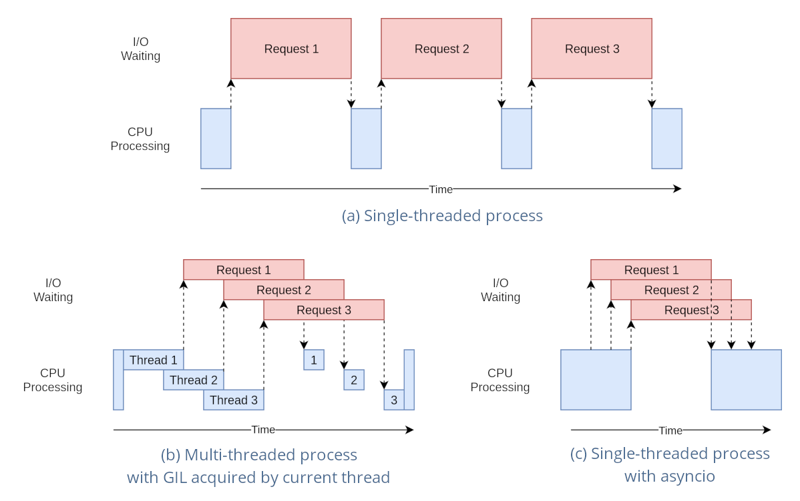
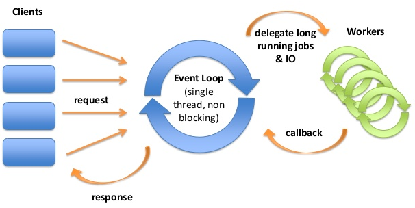

>[Torna all'indice generazione tempi](indexgenerazionetempi.md)   >[Versione in Python](async_await_py.md)

# **SCHEDULAZIONE CON ASYNC/AWAIT**

### **Base teorica**

Gestione con **I/O sincrono bloccante** in figura a sinistra. Gestione con **I/O asincrono e non bloccante** nella stessa figura ma a destra.


### **Eventi vs thread**




Il modello di gestione della CPU nei SO normalmente è di tipo **multithreading  preemptive**, cioè con interruzione anticipata del task in esecuzione con riassegnazione della risorsa CPU ad un altro task, per almeno due motivi:
- Evitare lo spreco della risorsa CPU in attesa di un input bloccante che tarda la sua risposta di un tempo non prevedibile
- per realizzare un multitasking equo (fair) tramite l’esecuzione concorrente di più task in tempi uguali

Il modello di gestione della CPU in ambienti server come node JS e client come l’ambiente javascript di un browser web, invece, è normalmente a **singolo thread** dove il **multitasking** è generato non utilizzando il multithreading ma un modello di esecuzione **ad eventi (event driven runtime)** composto da:
- Un **singolo thread**
- Un singolo task in esecuzione alla volta (esecuzione **seriale** dei **task**)
- Più input in elaborazione contemporaneamente (esecuzione **parallela** degli **input**)

### **Callback**
Un callback è una funzione che:
- viene passata ad un’altra funzione (via riferimento) con l'aspettativa che venga chiamata al **momento opportuno**
- Poiché la chiamata di queste funzioni spesso è legata alla notifica di un **evento esterno** al sistema (I/O dell’utente o l’arrivo di un messaggio da internet) di cui non si è in grado di prevedere **in anticipo** il tempo in cui accadrà, esse vengono dette **asincrone** (analogia con gli interrupt).
- Il **parametro** della chiamata è un messaggio che contiene le **proprietà** correnti dell’evento

Le **callback** sono il modo principale in cui vengono implementate in un **modello ad eventi** le **azioni** di risposta ad un evento, spesso mediante funzioni definite una **sola volta** nel codice, tipicamente in **forma anonima**.

Le callback possono essere:
- **Disgiunte** (separate) se relative ad eventi slegati tra loro che accadono in maniera indipendente
- **Annidate** una dentro l’altra se ogni callback è associata ad un evento attivato proprio dentro un’altra callback mediante una richiesta di I/O. Sono particolarmente difficili da approcciare in maniera chiara.

### **Modello ad eventi**

I **casi d'uso** che potrebbero beneficiare di un modello a thread singolo ad eventi potrebbero essere:
- **Concorrenza in un ambiente a thread singolo**. Alcuni linguaggi/ambienti di programmazione hanno un solo thread. Un altro esempio è un microcontrollore con risorse limitate che esegue un sistema operativo senza thread. In tutti questi casi, se si ha bisogno di **concorrenza**, le coroutine sono l'unica scelta.
- **Per semplificare il codice**. Può essere fatto usando la parola chiave **yield**, usando **async/await** per **"appiattire"**, cioè ridurre ad un **unico livello di annidamento** il codice asincrono evitando **l'inferno delle callback** o scrivendo codice asincrono in **stile imperativo** cioè lineare e **sequenziale**, molto più naturale da **scrivere** e **mantenere** rispetto ad un groviglio disordinato di callback che non seguono un filo temporale preciso.
- Maggiore **efficienza** e maggiore **scalabilità** delle risorse del sistema operativo e dell'hardware. In presenza di applicazioni che consumano molti thread, si può trarre vantaggio dalle coroutine risparmiando sull'allocazione della memoria, il tempo necessario per eseguire il cambio di contesto e, in definitiva, trarre vantaggio dall'utilizzo più efficiente dell'hardware che, a **parità di risorse**, adesso può **eseguire più task**. Un esempio è l'utilizzo dell'IO non bloccante con molti utenti simultanei. Poiché in generale i thread sono più costosi dei socket, i thread disponibili del sistema operativo si possono esaurire più rapidamente dei socket. Per evitare questo problema è possibile utilizzare l'IO non bloccante con le coroutine.
- **riduzione dei rischi** connessi all'**accesso** di **risorse condivise** tra vari task che, con **eventi** e **coda di messaggi**, sono accedute in maniera rigorosamente **sequenziale**. Inoltre, l'**atomicità** è realizzata a livello di **task** piuttosto che di una **singola istruzione macchina** e potrebbe potenzialmente comprendere una intera **transazione** (svolgendola per intero **senza interferenze** grazie al **run to completition**).

Gli **svantaggi** sono ascrivibili a:
- una **certa complessità** rispetto alla getione del multitasking con i thread che, nonostante tutto, rimane al programmatore più trasparente e più semplice.
- una **gestione meno accurata dei tempi**, la cui schedulazione, come vedremo più avanti (delay zero apparente), risente della pesantezza dei task precedenti a quello correntemente eseguito
- una **efficacia ridotta** a trattare quelle **risorse** che si interfaccciano esclusivamente in maniera **sincrona e bloccante**, per le quali, pur rimanendo sempre possibile la gestione asincrona spostandone l'esecuzione su un altro thread, si riduce significativamente la semplicità che si cercava con questa soluzione. In più, serve di nuovo un SO che gestisca la **schedulazione dei thread**. Una maniera per aggirare il problema della gestione di più thread, potrebbe essere **delegare** a servizi **in rete** le operazioni gravose tramite **richieste HTTP**.



La libreria async.io ha un modello di runtime basato su un ciclo di eventi (event loop), che è responsabile:
- dell'esecuzione del codice
- della raccolta e dell'elaborazione degli eventi
- dell'esecuzione delle dei sotto task (sub-tasks) in coda.
   
Questo modello è abbastanza diverso dai modelli in altri linguaggi come C e Java basati su processi e thread.
Una proprietà molto interessante è che un **linguaggio ad eventi**, a differenza di molti altri linguaggi, **non blocca** mai gli altri task quando si è in attesa di un input sul task corrente.

La **gestione dell'I/O** viene in genere eseguita tramite **eventi** e **callback**:
- ad un **evento** sono associate una o più **callback**.
- Un **evento** è un’**azione** eseguita in qualche **I/O**. 
- Una **callback** è una **funzione** che viene richiamata quando viene **servito** l’evento ad essa **associato**.
- Gli eventi che occorrono (accadono) **contemporaneamente** e che sono pronti per essere processati dalla CPU vengono ospitati in una **coda** di messaggi. In questa attesa il sistema può ancora **elaborare** altri eventi immagazzinandoli in coda rimanendo così **responsivo**. 

Il primo messaggio in coda viene di volta in volta estratto e processato per essere **eseguito** inserendo la sua **callback**, e tutte le funzioni ad essa annidate, in altrettanti **frame** sullo stack. La callback correntemente sullo stack, viene eseguita fino a che non ritornano tutte le sottofunzioni ad essa annidate.

Se le operazioni da svolgere nei task sono **CPU intensive** è buona norma **delegarle** a fornitori di servizi **esterni** al thread corrente, questi possono essere servizi **in rete** oppure servizi in esecuzione su **altri thread**. Una volta **completata** l'operazione delegata (può trascorrere un certo tempo), viene richiamata una **callback** (sul thread del loop degli eventi) con cui si **notificano** i **risultati** dell'operazione.

Purtroppo, la libreria standard C++ di Arduino non supporta, per il momento, direttamente il costrutto async/await. Tuttavia, possiamo simulare un comportamento simile utilizzando la libreria di macro [async.h](async.h) , che fornisce un'implementazione della programmazione concorrente su Arduino basata sui **Duff's device** su cui si basano i **protothread**. 

Caratteristiche:
- È C. puro e portatile al 100%.
- Richiede pochissimo stato (2 byte).
- Non dipende da un sistema operativo.
- È un po' più semplice da comprendere rispetto ai protothread perché lo stato asincrono viene salvato dal chiamante anziché dal chiamato.

Funzioni:
- **async_begin(state)** Segna l'inizio di una subroutine asincrona
- **async_end** Segna la fine di una subroutine asincrona
- **async_yield** Restituisce l'esecuzione finché non viene richiamato nuovamente
- **wait(cond)** Blocca l'avanzamento finché la cond non diventa vera
- **await_while(cond)** Blocca l'avanzamento mentre cond è vera
- **async_exit** Termina la subroutine asincrona corrente
- **async_call(func, state)** Chiama in modo asincrono func(state) e restituisce true se l'esecuzione è terminata (opzionale). Puoi anche semplicemente chiamare direttamente func(state) che restituisce true/false.
- **async_init(state)** Inizializza lo stato della subroutine asincrona
- **async_done(state)** Restituisce vero se la subroutine asincrona ha completato l'esecuzione, altrimenti falso
- **await_delay(x)** Attesa non bloccante per un certo numero x di millisecondi

Precauzioni:
- Come con i protothread, bisogna fare attenzione alle **istruzioni switch** all'interno di una subroutine asincrona. Attenendosi a questa semplice regola non si avranno mai problemi: posizionare ogni istruzione switch all'interno di una sua funzione. Questa, in genere, è comunque una buona pratica.
- Come con i protothread, non è possibile effettuare chiamate di **sistema bloccanti** e preservare la semantica asincrona. Queste devono essere **trasformate** in chiamate **non bloccanti** che testano una condizione.

Nelle situazioni in cui non è possibile includere librerie come accade nel **simulatore Tinkercad**, allora si può inserire in cima al file la definizione delle **macro** che definiscono i costrutti **async/await**:

```C++
typedef enum ASYNC_EVT { ASYNC_INIT = 0, ASYNC_CONT = ASYNC_INIT, ASYNC_DONE = 1 } async;
#define async_state unsigned _async_k
struct as_state { async_state; };
#define async_begin(k) unsigned *_async_k = &(k)->_async_k; switch(*_async_k) { default:
#define async_end *_async_k=ASYNC_DONE; case ASYNC_DONE: return ASYNC_DONE; }
#define await(cond) await_while(!(cond))
#define await_while(cond) *_async_k = __LINE__; case __LINE__: if (cond) return ASYNC_CONT
#define async_yield *_async_k = __LINE__; return ASYNC_CONT; case __LINE__:
#define async_exit *_async_k = ASYNC_DONE; return ASYNC_DONE
#define async_init(state) (state)->_async_k=ASYNC_INIT
#define async_done(state) (state)->_async_k==ASYNC_DONE
#define async_call(f, state) (async_done(state) || (f)(state))
#define await_delay(delay) \
{ \
  do { \
    static unsigned long as_sleep; \
    as_sleep = millis(); \
    await(millis() - as_sleep > delay); \
  } while(false); \
}
```

Tratto da  https://github.com/naasking/async.h
  
## **Esempi**

### **Blink sequenziali interagenti**

Di seguito è riportato un esempio di **blink sequenziale** in esecuzione su **due task** separati su scheda **ESP32**, con **IDE Wokwi** e  con la libreria **uasync.io**. La **programmazione sequenziale** del blink del led è **emulata** tramite una funzione delay() **non bloccante** ```asyncio.sleep()``` fornita dalla libreria ```uasync.io ```.

```C++
#include "async.h"

bool blink1_running = true;
int led1 = 13;
int led2 = 12;
byte pulsante=2;
as_state pt1, pt2;

async asyncTask1(as_state *pt) {
  async_begin(pt);
  // Loop secondario protothread
  while(true) {
	digitalWrite(led1, HIGH);   // turn the LED on (HIGH is the voltage level)
	await_delay(500);			// delay non bloccanti
	digitalWrite(led1, LOW);    // turn the LED off by making the voltage LOW
	await_delay(500);			// delay non bloccanti
  }
  async_end;
}

async asyncTask2(as_state *pt) {
  async_begin(pt);
  // Loop secondario protothread
  while(true) {
	digitalWrite(led2, HIGH);   // turn the LED on (HIGH is the voltage level)
	await_delay(1000);			// delay non bloccanti
	digitalWrite(led2, LOW);    // turn the LED off by making the voltage LOW
	await_delay(1000);			// delay non bloccanti
  }
  async_end;
}

// the setup function runs once when you press reset or power the board
void setup() {
  // initialize digital pin LED_BUILTIN as an output.
  pinMode(led1, OUTPUT);
  pinMode(led2, OUTPUT);
  /* Initialize the async state variables with async_init(). */
  async_init(&pt1);
  async_init(&pt2);
}

void loop() { // loop principale
  asyncTask1(&pt1);
  asyncTask2(&pt2);
  delay(10);
}
```
Link simulazione online: https://wokwi.com/projects/393802635182647297


### **Pulsante toggle + blink**

In questo caso, il **rilevatore dei fronti** è realizzato **campionando** il valore del livello al loop di CPU **attuale** e **confrontandolo** con il valore del livello campionato **nello stesso loop** ma in un momento diverso stabilito mediante un istruzione ```waitUntilInputLow()```. La funzione, di fatto, esegue un **blocco** del **task** corrente in **"attesa"**  della soddisfazione di una certa **condizione**, senza bloccare l'esecuzione degli altri task. L'**attesa** è spesa campionando continuamente un **ingresso** fino a che questo non **diventa LOW**. Quando ciò accade allora vuol dire che si è rilevato un **fronte di discesa** per cui, qualora **in futuro**, in un loop successivo, si determinasse sullo stesso ingresso un valore HIGH, allora si può essere certi di essere in presenza di un **fronte di salita**. 

Pulsante toggle che realizza blink e  antirimbalzo realizzato con una **schedulazione sequenziale con i ritardi** emulati all'interno di **task** diversi su **uno stesso thread**. La libreria usata è quella nativa dello ESP32 uasync.io:

```C++
#Alla pressione del pulsante si attiva o disattiva il lampeggo di un led 
#include "async.h"

bool blink1_running = true;
int led1 = 13;
int led2 = 12;
byte pulsante=2;
bool stato;
as_state pt1, pt2, pt3;

async asyncTask3(as_state *pt) {
  async_begin(pt);
  // Loop secondario protothread
  while(true) {
	if(digitalRead(pulsante)==HIGH){		// se è alto c'è stato un fronte di salita
		stato = !(stato); 			// impostazione dello stato del toggle
		await_delay(50);
		await(digitalRead(pulsante)==LOW);  // attendi fino al prossimo fronte di discesa
	}else{
		async_yield;
	}
  }
  async_end;
}

async asyncTask1(as_state *pt) {
  async_begin(pt);
  // Loop secondario protothread
  while(true) {
	if(stato){
		digitalWrite(led1, HIGH);   // turn the LED on (HIGH is the voltage level)
		await_delay(500);						// delay non bloccanti
		digitalWrite(led1, LOW);    // turn the LED off by making the voltage LOW
		await_delay(500);						// delay non bloccanti
	}else{
		digitalWrite(led1, LOW);
		async_yield;
	}	
  }
  async_end;
}

async asyncTask2(as_state *pt) {
  async_begin(pt);
  // Loop secondario protothread
  while(true) {
	digitalWrite(led2, HIGH);   // turn the LED on (HIGH is the voltage level)
	await_delay(1000);			// delay non bloccanti
	digitalWrite(led2, LOW);    // turn the LED off by making the voltage LOW
	await_delay(1000);			// delay non bloccanti
  }
  async_end;
}

// the setup function runs once when you press reset or power the board
void setup() {
  // initialize digital pin LED_BUILTIN as an output.
  pinMode(led1, OUTPUT);
  pinMode(led2, OUTPUT);
  /* Initialize the async state variables with async_init(). */
  async_init(&pt1);
  async_init(&pt2);
  async_init(&pt3);
  stato = false;
}

void loop() { // loop principale
  asyncTask1(&pt1);
  asyncTask2(&pt2);
  asyncTask3(&pt3);
  delay(10);
}
```
Link simulazione online: https://wokwi.com/projects/393860825891092481

### **Osservazioni**:

Quando si tratta di sistemi embedded, il modello cooperativo presenta due vantaggi. 
- Innanzitutto, è leggero. È possibile avere un numero elevato di attività perché, a differenza dei thread annullati, le attività in pausa contengono poco stato.
- In secondo luogo evita alcuni degli insidiosi problemi associati alla programmazione con prerilascio forzato delle risorse. In pratica, il multitasking cooperativo è ampiamente utilizzato, in particolare nelle applicazioni che gestiscono interfacce utente.
- d'altronde, se si realizzano task molto pesanti, cioè di tipo CPU intensive quale il seguente:
  ```python
    for x in range(1000000):
    # fai qualcosa che perde molto tempo
  ```
  accade che gli altri task rimangono bloccati in attesa del completamento di questo.


### **Sitografia:**
- https://docs.micropython.org/en/v1.15/library/uasyncio.html
- https://github.com/peterhinch/micropython-async/blob/master/v3/docs/TUTORIAL.md
- https://medium.com/martinomburajr/rxjava2-schedulers-2-breaking-down-the-i-o-scheduler-7e83160df2ed
- https://hackaday.com/2019/09/24/asynchronous-routines-for-c/#more-377555
- https://github.com/naasking/async.h

>[Torna all'indice generazione tempi](indexgenerazionetempi.md)  >[Versione in Python](async_await_py.md)
