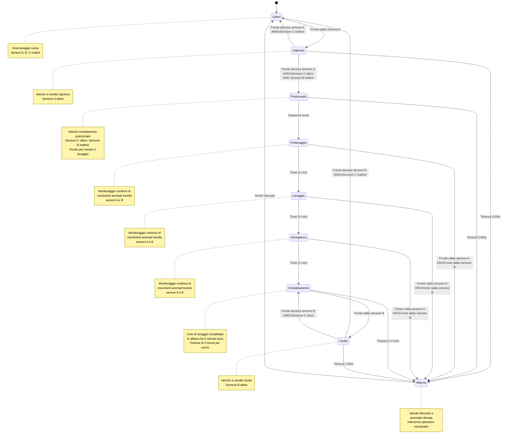

>[Torna all'indice generale](indexstatifiniti.md)

# **AUTOLAVAGGIO**

Un'azienda di autolavaggi ha la necessità di automatizzare il processo di lavaggio dei veicoli per migliorare l'efficienza operativa e garantire un servizio uniforme. Il sistema deve gestire automaticamente le varie fasi del lavaggio, assicurandosi che il veicolo sia correttamente posizionato e che ogni fase venga completata prima di passare alla successiva.

Il sistema deve rilevare quando un veicolo entra nell'area di lavaggio e avviarsi solo quando il veicolo è fermo nella posizione corretta. Il ciclo di lavaggio comprende diverse fasi, tra cui prelavaggio di un minuto, lavaggio principale di 5 minuti e asciugatura di un minuto. Al termine del processo, il sistema deve notificare al conducente quando è possibile uscire.

Gli studenti dovranno:
- Identificare gli stati necessari per descrivere il funzionamento del sistema.
- Definire le transizioni tra gli stati in base agli eventi rilevati dai sensori e alle azioni richieste dal sistema.
- Individuare quali siano gli ingressi (input) e le uscite (output) che il sistema deve gestire.
- Implementare la logica della FSM in un microcontrollore (Arduino, ESP32 o altro) utilizzando un linguaggio di programmazione adeguato.
- Documentare il lavoro svolto con un diagramma a stati e una breve relazione che descriva il funzionamento del sistema e le scelte progettuali adottate.


## Tabella di Transizione del Sistema di Autolavaggio con Rilevamento Movimento Anomalo

| Stato attuale | Input | Stato prossimo | Output |
|---------------|-------|----------------|--------|
| LIBERO | Fronte salita sensore A | INGRESSO | LED giallo ingresso, barriera bloccata |
| INGRESSO | Fronte discesa sensore A AND Sensore C attivo AND Sensore B inattivo | POSIZIONATO | LED verde posizionamento, indicazioni di avvio |
| INGRESSO | Fronte discesa sensore A AND Sensore C inattivo | LIBERO | LED verde sistema pronto, reset sistema |
| INGRESSO | Timeout (>30s) | ALLARME | LED rosso lampeggiante, segnalatore acustico |
| POSIZIONATO | Conferma avvio (automatica o manuale) | PRELAVAGGIO | Attivazione spruzzatori, LED fase prelavaggio |
| POSIZIONATO | Timeout (>60s) | ALLARME | LED rosso lampeggiante, segnalatore acustico |
| PRELAVAGGIO | Timer scaduto (1 min) | LAVAGGIO | Disattivazione spruzzatori, attivazione spazzole e detergente, LED fase lavaggio |
| PRELAVAGGIO | Fronte salita sensore A OR Fronte salita sensore B | ALLARME | LED rosso lampeggiante, segnalatore acustico, messaggio "Movimento anomalo" |
| LAVAGGIO | Timer scaduto (5 min) | ASCIUGATURA | Disattivazione spazzole e detergente, attivazione ventole, LED fase asciugatura |
| LAVAGGIO | Fronte salita sensore A OR Fronte salita sensore B | ALLARME | LED rosso lampeggiante, segnalatore acustico, messaggio "Movimento anomalo" |
| ASCIUGATURA | Timer scaduto (1 min) | COMPLETAMENTO | Disattivazione ventole, LED verde completamento, messaggio "Procedere all'uscita" |
| ASCIUGATURA | Fronte salita sensore A OR Fronte salita sensore B | ALLARME | LED rosso lampeggiante, segnalatore acustico, messaggio "Movimento anomalo" |
| COMPLETAMENTO | Fronte salita sensore B | USCITA | LED giallo uscita, barriera uscita aperta |
| COMPLETAMENTO | Timeout (>3 min) | ALLARME | LED rosso lampeggiante, segnalatore acustico |
| USCITA | Fronte discesa sensore B AND Sensore C inattivo | LIBERO | LED verde sistema pronto, reset sistema |
| USCITA | Fronte discesa sensore B AND Sensore C attivo | COMPLETAMENTO | LED verde completamento, messaggio "Procedere all'uscita" |
| USCITA | Timeout (>30s) | ALLARME | LED rosso lampeggiante, segnalatore acustico |
| ALLARME | Reset manuale | LIBERO | LED verde sistema pronto, reset sistema |

## **Diagramma degli stati**



## **Codice Arduino**

Per lo sviluppo fare riferimento alla metodologia esposta in: [priorità-statoingresso](statifinitisviluppo.md#priorità-statoingresso)

```C++
//##### urutils.h #####
void waitUntilInputLow(int btn, unsigned t)
{
   do{
     delay(t);
   }while(digitalRead(btn)!=LOW);
}

struct DiffTimer
{
	unsigned long elapsed, last;
	bool timerstate=false;
	byte state = 0;
	byte count = 0;
	void reset(){
		elapsed = 0;
		last = millis();
	}
	void toggle(){
		if(timerstate){
    	    stop();
		}else{
			start();
		}	
	}
	void stop(){
		if(timerstate){
			timerstate = false;
    	    elapsed += millis() - last;
		}	
	}
	void start(){
		if(!timerstate){
			timerstate = true;
			last = millis();
		}
	}
	unsigned long get(){
		if(timerstate){
			return millis() - last + elapsed;
		}
		return elapsed;
	}
	void set(unsigned long e){
		reset();
		elapsed = e;
	}
};
//##### urutils.h #####

// Definizione pin per sensori e attuatori
int sensore_A = 2;       // Sensore di ingresso (fronte)
int sensore_B = 3;       // Sensore di uscita (fronte)
int sensore_C = 4;       // Sensore interno (livello)

// LED indicatori
int led_verde = 5;       // Sistema libero/pronto
int led_giallo = 6;      // Ingresso/uscita/attesa
int led_fase = 7;        // Indicatore fase lavaggio
int led_rosso = 8;       // Allarme

// Attuatori
int spruzzatori = 9;     // Spruzzatori prelavaggio
int spazzole = 10;       // Spazzole lavaggio
int ventole = 11;        // Ventole asciugatura
int buzzer = 12;         // Segnalatore acustico

// Timer per le diverse fasi
DiffTimer timerProcesso; // Usato sia per fasi di lavaggio che per timeout completamento
DiffTimer timerTimeout;  // Usato per timeout di ingresso/uscita/posizionamento

// Definizione stati del sistema
enum Stati {
  LIBERO,
  INGRESSO,
  POSIZIONATO,
  PRELAVAGGIO,
  LAVAGGIO,
  ASCIUGATURA,
  COMPLETAMENTO,
  USCITA,
  ALLARME
};

// Variabili di stato
uint8_t statoCorrente;

void setup() {
  // Inizializzazione I/O
  pinMode(sensore_A, INPUT);
  pinMode(sensore_B, INPUT);
  pinMode(sensore_C, INPUT);
  
  pinMode(led_verde, OUTPUT);
  pinMode(led_giallo, OUTPUT);
  pinMode(led_fase, OUTPUT);
  pinMode(led_rosso, OUTPUT);
  
  pinMode(spruzzatori, OUTPUT);
  pinMode(spazzole, OUTPUT);
  pinMode(ventole, OUTPUT);
  pinMode(buzzer, OUTPUT);
  
  // Inizializzazione stato
  statoCorrente = LIBERO;
  
  // Inizializzazione seriale per debug
  Serial.begin(115200);
  
  // Stato iniziale: sistema libero
  digitalWrite(led_verde, HIGH);
  Serial.println("Sistema Autolavaggio inizializzato - STATO: LIBERO");
}

// Funzione per spegnere tutti gli attuatori
void spegniTuttiAttuatori() {
  digitalWrite(spruzzatori, LOW);
  digitalWrite(spazzole, LOW);
  digitalWrite(ventole, LOW);
}

void loop() {
  // Verifica movimenti anomali durante le fasi di lavaggio
  if ((statoCorrente == PRELAVAGGIO || statoCorrente == LAVAGGIO || statoCorrente == ASCIUGATURA) &&
      (digitalRead(sensore_A) == HIGH || digitalRead(sensore_B) == HIGH)) {
    Serial.println("STATO: ALLARME - Movimento anomalo del veicolo durante il lavaggio");
    statoCorrente = ALLARME;
    // impostazione valore uscite
    spegniTuttiAttuatori();
    digitalWrite(led_rosso, HIGH);
    digitalWrite(buzzer, HIGH);
    // inizializzazione stato successivo
    timerProcesso.stop();
  }
  
  // Macchina a stati
  switch (statoCorrente) {
    case LIBERO:
      // Sistema in attesa di veicoli
      Serial.println("LIBERO");
      if (digitalRead(sensore_A) == HIGH) {
        // Rileva fronte salita sensore A tramite waitUntilInputLow
        waitUntilInputLow(sensore_A, 50); // Debounce di 50ms
        Serial.println("STATO: INGRESSO - Veicolo a cavallo dell'ingresso");
	// impostazione valore uscite
        digitalWrite(led_verde, LOW);
        digitalWrite(led_giallo, HIGH);
        // inizializzazione stato successivo
        timerTimeout.reset();
        timerTimeout.start();
        statoCorrente = INGRESSO;
      }
      break;
      
    case INGRESSO:
      // Veicolo a cavallo dell'ingresso
      Serial.println("INGRESSO");
      // Controlla se il veicolo è completamente entrato e posizionato correttamente
      // (sensore A basso, C alto e B basso)
      if (digitalRead(sensore_A) == LOW && digitalRead(sensore_C) == HIGH && digitalRead(sensore_B) == LOW) {
        Serial.println("STATO: POSIZIONATO - Veicolo entrato e posizionato correttamente");
        // impostazione valore uscite
        digitalWrite(led_giallo, LOW);
        digitalWrite(led_verde, HIGH);
        // inizializzazione stato successivo
        timerTimeout.reset();
        timerTimeout.start(); // Avvia timer per controllo tempo di inattività
        statoCorrente = POSIZIONATO;
      } 
      // Controlla se il veicolo è tornato indietro (sensore A basso e C basso)
      else if (digitalRead(sensore_A) == LOW && digitalRead(sensore_C) == LOW) {
        Serial.println("STATO: LIBERO - Veicolo tornato indietro");
        // impostazione valore uscite
        digitalWrite(led_giallo, LOW);
        digitalWrite(led_verde, HIGH);
        // inizializzazione stato successivo
        timerTimeout.stop();
        statoCorrente = LIBERO;
      }
      else if (timerTimeout.get() > 30000) {
        // Timeout veicolo bloccato in ingresso
        Serial.println("STATO: ALLARME - Veicolo bloccato in ingresso");
        // impostazione valore uscite
        digitalWrite(led_giallo, LOW);
        digitalWrite(led_rosso, HIGH);
        digitalWrite(buzzer, HIGH);
	// inizializzazione stato successivo
	timerProcesso.stop();
        statoCorrente = ALLARME;
      }
      break;
      
    case POSIZIONATO:
      // Veicolo pronto per iniziare il processo
      Serial.println("POSIZIONATO");
      
      // Verifica se il veicolo è ancora posizionato correttamente
      if (digitalRead(sensore_C) == HIGH) {
        // Avvio automatico dopo breve pausa
        if (timerTimeout.get() > 2000) { // Attesa di 2 secondi prima di avviare
          Serial.println("STATO: PRELAVAGGIO - Inizio ciclo di lavaggio");
          // impostazione valore uscite
          digitalWrite(led_verde, LOW);
          digitalWrite(led_fase, HIGH);
          digitalWrite(spruzzatori, HIGH);
          // inizializzazione stato successivo
          timerTimeout.stop();
          timerProcesso.reset();
          timerProcesso.start();
          statoCorrente = PRELAVAGGIO;
        }
      } 
      else if (timerTimeout.get() > 60000) {
        // Timeout veicolo non più posizionato correttamente
        Serial.println("STATO: ALLARME - Timeout posizionamento");
        // impostazione valore uscite
        digitalWrite(led_verde, LOW);
        digitalWrite(led_rosso, HIGH);
        digitalWrite(buzzer, HIGH);
	
        statoCorrente = ALLARME;
      }
      break;
      
    case PRELAVAGGIO:
      // Fase di prelavaggio
      Serial.println("PRELAVAGGIO");
      if (timerProcesso.get() > 60000) { // 1 minuto
        Serial.println("STATO: LAVAGGIO - Passaggio a fase di lavaggio principale");
        // impostazione valore uscite
        digitalWrite(spruzzatori, LOW);
        digitalWrite(spazzole, HIGH);
        // inizializzazione stato successivo
        timerProcesso.reset();
        statoCorrente = LAVAGGIO;
      }
      break;
      
    case LAVAGGIO:
      // Fase di lavaggio principale
      Serial.println("LAVAGGIO");
      if (timerProcesso.get() > 300000) { // 5 minuti
        Serial.println("STATO: ASCIUGATURA - Passaggio a fase di asciugatura");
        // impostazione valore uscite
        digitalWrite(spazzole, LOW);
        digitalWrite(ventole, HIGH);
	// inizializzazione stato successivo
	timerProcesso.reset();
        statoCorrente = ASCIUGATURA;
      }
      break;
      
    case ASCIUGATURA:
      // Fase di asciugatura
      Serial.println("ASCIUGATURA");
      if (timerProcesso.get() > 60000) { // 1 minuto
        Serial.println("STATO: COMPLETAMENTO - Ciclo di lavaggio completato");
	// impostazione valore uscite
        digitalWrite(ventole, LOW);
        digitalWrite(led_fase, LOW);
        digitalWrite(led_verde, HIGH);
        // Riutilizziamo timerProcesso per monitorare il tempo di attesa in COMPLETAMENTO
	// inizializzazione stato successivo
        timerProcesso.reset();
        statoCorrente = COMPLETAMENTO;
      }
      break;
      
    case COMPLETAMENTO:
      // Lavaggio completato, in attesa di uscita
      Serial.println("COMPLETAMENTO");
      
      // Controlla se è scaduto il timer di completamento (3 minuti per esempio)
      if (timerProcesso.get() > 180000) { // 3 minuti
        Serial.println("STATO: ALLARME - Timeout uscita veicolo dopo completamento");
	// impostazione valore uscite
        digitalWrite(led_verde, LOW);
        digitalWrite(led_rosso, HIGH);
        digitalWrite(buzzer, HIGH);
	// inizializzazione stato successivo
        timerProcesso.stop();
        statoCorrente = ALLARME;
      }
      // Controlla se il veicolo ha iniziato a uscire
      else if (digitalRead(sensore_B) == HIGH) {
        // Rileva fronte salita sensore B tramite waitUntilInputLow
        waitUntilInputLow(sensore_B, 50); // Debounce di 50ms
        Serial.println("STATO: USCITA - Veicolo in fase di uscita");
	// impostazione valore uscite
        digitalWrite(led_verde, LOW);
        digitalWrite(led_giallo, HIGH);
	// inizializzazione stato successivo
        timerProcesso.stop(); // Ferma il timer di completamento
        timerTimeout.reset();
        timerTimeout.start();
        statoCorrente = USCITA;
      }
      break;
      
    case USCITA:
      // Veicolo a cavallo dell'uscita
      Serial.println("USCITA");
      // Controlla se il veicolo è completamente uscito (sensore B basso e C basso)
      if (digitalRead(sensore_B) == LOW && digitalRead(sensore_C) == LOW) {
        Serial.println("STATO: LIBERO - Veicolo uscito, sistema pronto");
	// impostazione valore uscite
        digitalWrite(led_giallo, LOW);
        digitalWrite(led_verde, HIGH);
	// inizializzazione stato successivo
        timerTimeout.stop();
        statoCorrente = LIBERO;
      }
      // Controlla se il veicolo è tornato indietro (sensore B basso e C alto)
      else if (digitalRead(sensore_B) == LOW && digitalRead(sensore_C) == HIGH) {
        Serial.println("STATO: COMPLETAMENTO - Veicolo tornato nell'area");
        digitalWrite(led_giallo, LOW);
        digitalWrite(led_verde, HIGH);
        timerTimeout.stop();
        // Riavvia il timer per monitorare il tempo di permanenza in COMPLETAMENTO
	// inizializzazione stato successivo
        timerProcesso.reset();
        timerProcesso.start();
        statoCorrente = COMPLETAMENTO;
      }
      else if (timerTimeout.get() > 30000) {
        // Timeout veicolo bloccato in uscita
        Serial.println("STATO: ALLARME - Veicolo bloccato in uscita");
	// impostazione valore uscite
        digitalWrite(led_giallo, LOW);
        digitalWrite(led_rosso, HIGH);
        digitalWrite(buzzer, HIGH);
        statoCorrente = ALLARME;
      }
      break;
      
    case ALLARME:
      // Gestione allarmi - Reset manuale necessario
      Serial.println("ALLARME");
      // Lampeggio LED rosso
      digitalWrite(led_rosso, !digitalRead(led_rosso));
      delay(300);
      
      // Simuliamo il reset manuale con la presenza e successiva assenza di un veicolo
      if (!digitalRead(sensore_A) && !digitalRead(sensore_B) && !digitalRead(sensore_C)) {
        delay(5000); // Simulazione di un reset dopo 5 secondi
        Serial.println("STATO: LIBERO - Sistema resettato dopo allarme");
	// impostazione valore uscite
        digitalWrite(led_rosso, LOW);
        digitalWrite(buzzer, LOW);
        digitalWrite(led_verde, HIGH);
        // Reset di tutti gli attuatori per sicurezza
        spegniTuttiAttuatori();
        statoCorrente = LIBERO;
      }
      break;
  }
  delay(10); // Piccolo delay per stabilità
}
```

>[Torna all'indice generale](indexstatifiniti.md)
