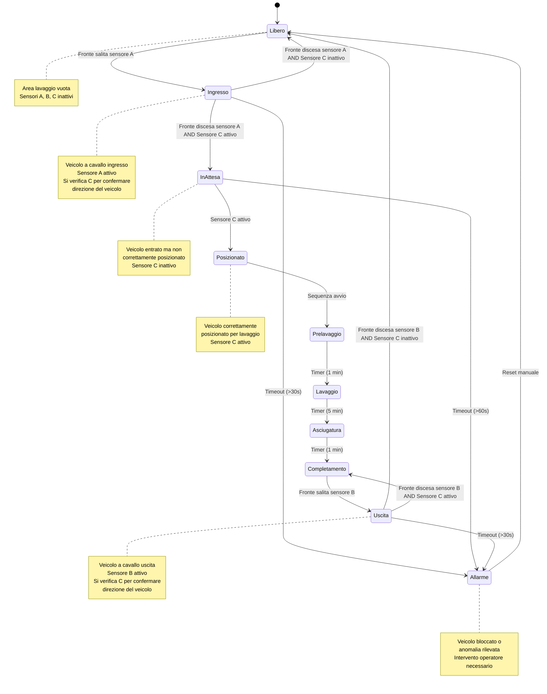

>[Torna all'indice generale](indexstatifiniti.md)

# **AUTOLAVAGGIO**

Un'azienda di autolavaggi ha la necessità di automatizzare il processo di lavaggio dei veicoli per migliorare l'efficienza operativa e garantire un servizio uniforme. Il sistema deve gestire automaticamente le varie fasi del lavaggio, assicurandosi che il veicolo sia correttamente posizionato e che ogni fase venga completata prima di passare alla successiva.

Il sistema deve rilevare quando un veicolo entra nell'area di lavaggio e avviarsi solo quando il veicolo è fermo nella posizione corretta. Il ciclo di lavaggio comprende diverse fasi, tra cui prelavaggio di un minuto, lavaggio principale di 5 minuti e asciugatura di un minuto. Al termine del processo, il sistema deve notificare al conducente quando è possibile uscire.

Gli studenti dovranno:
- Identificare gli stati necessari per descrivere il funzionamento del sistema.
- Definire le transizioni tra gli stati in base agli eventi rilevati dai sensori e alle azioni richieste dal sistema.
- Individuare quali siano gli ingressi (input) e le uscite (output) che il sistema deve gestire.
- Implementare la logica della FSM in un microcontrollore (Arduino, ESP32 o altro) utilizzando un linguaggio di programmazione adeguato.
- Documentare il lavoro svolto con un diagramma a stati e una breve relazione che descriva il funzionamento del sistema e le scelte progettuali adottate.

## Tabella di Transizione del Sistema di Autolavaggio con Sensori di Transito

| Stato attuale | Input | Stato prossimo | Output |
|---------------|-------|----------------|--------|
| LIBERO | Fronte salita sensore A | INGRESSO | LED giallo ingresso, barriera bloccata |
| INGRESSO | Fronte discesa sensore A AND Sensore C attivo | IN_ATTESA | LED giallo lampeggiante, indicazioni di posizionamento |
| INGRESSO | Fronte discesa sensore A AND Sensore C inattivo | LIBERO | LED verde sistema pronto, reset sistema |
| INGRESSO | Timeout (>30s) | ALLARME | LED rosso lampeggiante, segnalatore acustico |
| IN_ATTESA | Sensore C attivo | POSIZIONATO | LED verde posizionamento, indicazioni di avvio |
| IN_ATTESA | Timeout (>60s) | ALLARME | LED rosso lampeggiante, segnalatore acustico |
| POSIZIONATO | Conferma avvio (automatica o manuale) | PRELAVAGGIO | Attivazione spruzzatori, LED fase prelavaggio |
| PRELAVAGGIO | Timer scaduto (1 min) | LAVAGGIO | Disattivazione spruzzatori, attivazione spazzole e detergente, LED fase lavaggio |
| LAVAGGIO | Timer scaduto (5 min) | ASCIUGATURA | Disattivazione spazzole e detergente, attivazione ventole, LED fase asciugatura |
| ASCIUGATURA | Timer scaduto (1 min) | COMPLETAMENTO | Disattivazione ventole, LED verde completamento, messaggio "Procedere all'uscita" |
| COMPLETAMENTO | Fronte salita sensore B | USCITA | LED giallo uscita, barriera uscita aperta |
| USCITA | Fronte discesa sensore B AND Sensore C inattivo | LIBERO | LED verde sistema pronto, reset sistema |
| USCITA | Fronte discesa sensore B AND Sensore C attivo | COMPLETAMENTO | LED verde completamento, messaggio "Procedere all'uscita" |
| USCITA | Timeout (>30s) | ALLARME | LED rosso lampeggiante, segnalatore acustico |
| ALLARME | Reset manuale | LIBERO | LED verde sistema pronto, reset sistema |

## **Diagramma degli stati**



## **Codice Arduino**

```C++

```

>[Torna all'indice generale](indexstatifiniti.md)
