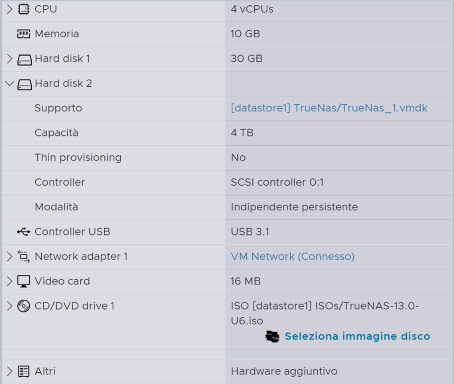
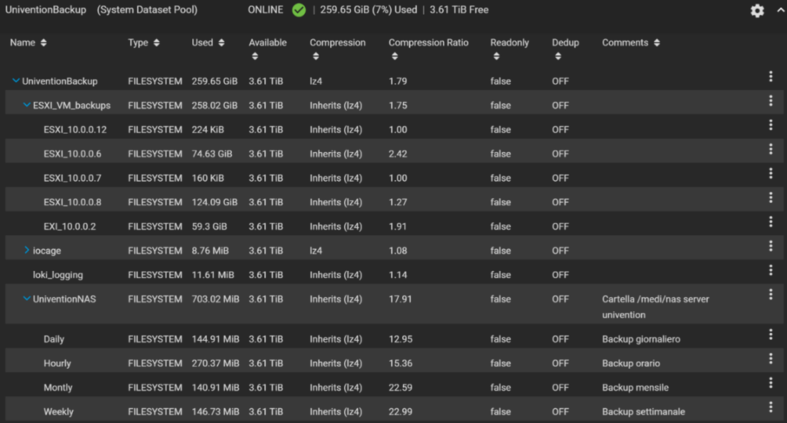
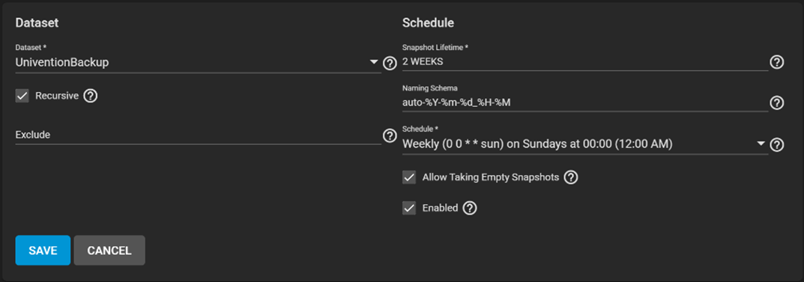
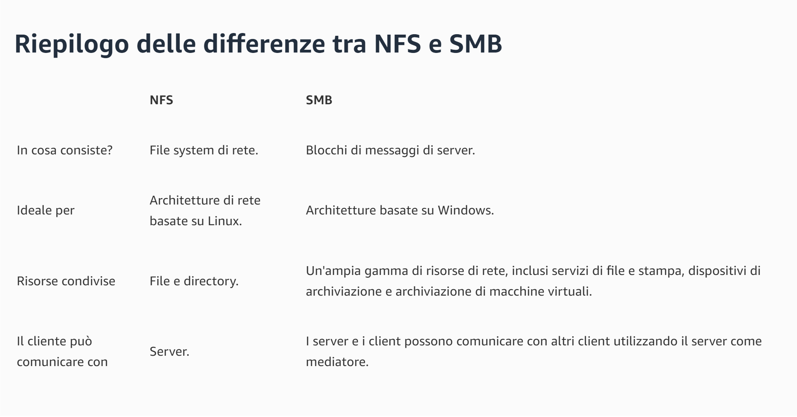

>[Torna a reti ethernet](archeth.md)

- [Dettaglio architettura Zigbee](archzigbee.md)
- [Dettaglio architettura BLE](archble.md)
- [Dettaglio architettura WiFi infrastruttura](archwifi.md)
- [Dettaglio architettura WiFi mesh](archmesh.md) 
- [Dettaglio architettura LoraWAN](lorawanclasses.md) 

# **Backup** 

Il **backup** si realizza essenzialmente per raggiungere due **obiettivi**:
- Il **recupero dei dati** a seguito di una compromissione dovuta a danni accidentali o intrusioni (ad es. ramsonware). La politica adottata di gestione dei dati è in genere quella di conservarli su una serie di dischi separati dal disco del sistema operativo, che vengono utilizzati come archivio di tipo documentale. I dischi sono generalmente montati sul filesystem del disco principale del SO, a partire da una **directory di accesso** (normalmente media o mnt). Da questa directory le **applicazioni** (generalmente di tipo web) mediano l’accesso dell’utente ai dati fornendo servizi di **autenticazione**, **autorizzazione** e **directory**. In un nessun caso l’utente accede direttamente ai dati senza passare per un **servizio di AAA**. 
- Il **recupero dei servizi** in seguito al blocco di una applicazione dovuto a guasti irreversibili delle applicazioni o del SO operativo che li ospita. La politica adottata è in genere quella di installare le **applicazioni server** su **sistemi virtualizzati** invece che **fisici**. La **virtualizzazione** permette funzioni di **recupero del servizio** sconosciute ai sistemi basati su macchine puramente fisiche, quali **snapshots precauzionali** effettuati in occasioni di:
    - **aggiornamenti**, operazioni spesso rischiose in ambiente open source
    - **migrazioni dei sistemi virtualizzati** (sotto forma di files) da una macchina fisica (ad esempio non più idonea) **ad un’altra più prestante**, oppure **verso un NAS** dove viene archiviata una loro **copia di backup**
    - **Snapshot** e **migrazioni** sono funzioni **realizzabili a caldo**, cioè a macchina attiva e pienamente erogante il servizio.
    - Il **recupero** di un sistema **danneggiato** o **infetto** avviene prontamente, abbandonando la copia compromessa e sostituendola con la sua copia più recente conservata sul NAS. Il **procedimento di restore** può avvenire in maniera automatica o manuale, comunque sfruttando i **servizi di connettività** a larga banda offerti dalla **rete locale**.


## **Backup dei dati** 

Riguardo la **tecnica del montaggio**, in un punto del filesystem di un disco di piccole dimensioni che ospita l’SO, di un disco di grandi dimensioni per lo storage dei dati, si può legittimamente ritenere che essa **realizza un NAS**. UN NAS ha essenzialmente **due componenti**:
- il **disco storag**e che ospita i **documenti**.
- un **disco di servizio** che ospita l’**SO** e le **applicazioni** che mediano l’interazione con l’utente realizzando le **interfacce di accesso** al disco. Le **applicazioni** realizzano normalmente anche i **servizi** di **autenticazione**, **autorizzazione** e **logging** locale (**AAA**). 

I **NAS** sono normalmente realizzati per due **scopi**:
- Realizzare un **contenitore** di documenti per l’**applicazione** 
- Realizzare un **contenitore** di documenti per il **backup** 

Il **disco di storage** potrebbe essere realizzato:
- Un **disco fisico** separato dal disco del SO.
- Una **partizione fisica** separata da quella del SO.
- Un **disco virtuale** che, in un hypervisor, rimane separato dal disco (virtuale) del SO.

La **modalità** con cui in un NAS si possono recuperare i dati sono essenzialmente **due**:
- **Politica PULL**, è il **NAS** che ha l’**iniziativa** di prelevare i dati dal server o NAS remoto attraverso un accesso tramite, ad es., un **client SSH** o un **client NFS**, o un client **SFTP**. 
- **Politica PUSH**, è il **server remoto** (on un agente del NAS sul server) che ha l’**iniziativa di spostare** i dati dalla loro directory locale **verso il NAS**, utilizzando un **protocollo di clonazione** come **rsync** o **rclone**, oppure **copiando i files** su un **montaggio** locale delle **cartelle remote di backup** sul NAS. Il montaggio può essere ottenuto, ad esempio, tramite i protocolli **NFS** o **Samba (SMB)**.

### **NAS virtualizzati**

Per quanto riguarda la realizzazione del **disco di storage** da aggiungere al **disco del SO** di una **VM**, si è scelta la modalità di **aggregazione indipendente**. In questo modo un eventuale backup o un eventuale snapshot della VM conserverà sul NAS solo il disco del SO e non quello del NAS. L'impostazione è necessaria perchè:
- altrimenti si eseguirebbe un salvataggio ricorsivo
- il NAS è un disco troppo grosso per essere backuppato sulla stessa macchina (normalmente è il più grande).



Nel momento in cui si fa il **backup delle VM**, questo esegue solamente il **backup del disco di servizio**, cioè quello con il **SO**.

## **True NAS** 

I **dati** vengono conservati su un **disco di grande dimensione** (attualmente 4TB), virtualizzato su VMWARE ESXI e **montato** su un **sistema operativo specializzato** nella realizzazione delle funzioni tipiche di un NAS noto sotto il nome di **TrueNAS**.

**TrueNAS** (chiamato FreeNAS prima della versione 12.0) è un sistema operativo open source basato su FreeBSD che permette di costruire un dispositivo collegato ad una rete di computer la cui funzione principale è quella di **condividere** tra gli utenti della rete una Area di storage (o disco), cioè un **NAS** (https://it.wikipedia.org/wiki/FreeNAS).

FreeNAS permette di configurare ogni dettaglio tramite un'interfaccia grafica WebGUI; ciò permette di usare un **browser** per modificare i settaggi, **montare dischi** e avere **informazioni sul sistema**. Questo rende possibile la **gestione remota** dell'hardware su cui è installato FreeNAS che non necessita perciò di mouse, tastiera e monitor. Si tratta quindi di un prodotto ideale per essere virtualizzato in un hypervisor (https://it.wikipedia.org/wiki/FreeNAS).

Truenas **organizza il disco** in strutture dati chiamate **pools** simili a directory su cui è possibile impostare tutta una serie di **parametri** quali **permessi** e **quote** per singolo utente.



Al momento sono stati creati i seguenti **contenitori di files** che in gergo TrueNAS si chiamano pools  e sono analoghi a delle **cartelle**:
- 5 pools per far posto al backup dei 5 hypervisor attualmente in funzione, tutti basati su tecnologia VMWARE ESXI in versione freeware.
- 4 pools per far posto a 4 backup delle condivisioni Samba del sistema di Active Directory con l'elenco degli utenti organizzato su servizio LDAP. Le **cartelle** forniscono una **serie di backup** con **granularità diversa**: oraria, giornaliera, settimanale e mensile, in maniera da poter rispondere a **diverse esigenze** di recupero dei dati a seguito di un **incidente**.

Quando si attiva un task di copia di files da una sorgente remota al suo pool di backup sul NAS, l’azione svolta è sostanzialmente una sovrascrittura dei vecchi file del pool con in nuovi files prelevati dalla sorgente:
- Se un file con un certo nome esisteva già, questo viene aggiornato
- Se un file non esisteva, uno nuovo ne viene creato
- E se un files adesso nella sorgente non c’è più, anche quello nel suo pool di backup viene eliminato.

Apparentemente i file sovrascritti, modificati o cancellati andrebbero così irrimediabilmente persi ad ogni copia. In realtà ciò non accade perché è sempre attivo un meccanismo di snapshots che, ad ogni nuova copia, crea dei punti di ripristino, corredati di data, della vecchia. A ben vedere, ad ogni nuova copia, non viene, in realtà, caricato nuovamente tutto il file, ma solamente la sua differenza con  la versione precedente. Gli snapshot sono, in definitiva, un meccanismo deputato al mantenimento della versione (versioning) di un file ad ogni sua successiva modifica. Il tempo di retenzione degli snapshot non è comunque infinito e può essere impostato nel menù Periodic Snapshot Task:



## **Task** 

Inoltre TrueNAS mette a disposizione i cosìdetti Task (compiti) che rappresentano i processi di backup (o restore) che il sistema attualmente mette a disposizione. Di tutti al momento sono stati adoperati (o prevediamo di usare a breve):
- **Cron job**. E’ il task più generico e permette di lanciare un **protocollo di clonazione**, mediante una interfaccia a riga di comando, tra i due installati a bordo (i più comuni attualmente): **rsync** e **rclone**. Entrambi sono molto efficienti in quanto capaci del cosiddetto **backup incrementale**. Abbiamo scelto rsync in quanto universalmente considerato tra i più affidabili. L’impostazione principale che viene fatta via web è l’inserimento della stringa del comando con i suoi parametri e la definizione della periodicità.
- **Replication task**. E’ un task che permette la replicazione dei pool **tra macchine Truenas identiche**. Viene usata per la duplicazione di sicurezza dei dati su un NAS secondario, sempre virtualizzato ma allocato su un hypervisor diverso. E’ possibile impostare autenticazione, compressione, cifratura e periodicità.
- **Cloud Sync Task**. Un client che Serve ad effettuare **copie di backup** su servizi remoti **in cloud**.

### **Backup dei dati** 

Backup delle **cartelle personali** degli alunni nella didattica
Ogni alunno, una volta autenticatosi su una postazione qualsiasi con la propria password personale (protocollo di autenticazione Kerberos), accede al proprio desktop di windows (servizio di Active Directory), dove ha a disposizione due cartelle di rete:
- Una personale su cui ha esclusivo accesso con i propri file di lavoro (per lo più esercitazioni) e su cui gode dei permessi di lettura e scrittura
- Una di gruppo, visibile a tutti i membri di una stessa classe con permesso di lettura e scrittura per le consegne comuni o gli scambi.
  
Le cartelle di rete altro non sono che **condivisioni** ottenute mediante il **montaggio locale** via protocollo **SMB** (detto anche **samba**) di cartelle remote contenute su un **NAS** di servizio associato al server Univention (https://www.univention.com/).
Abbiamo individuato l’obiettivo di proteggere la risorsa dei dati personali e di gruppo rappresentata dalle condivisioni sul server Univention a fronte di perdite accidentali (guasti) o intenzionali (intrusioni), per cui si è reso necessario progettare il backup delle cartelle sul NAS di servizio su un NAS di backup.

Il servizio di TrueNAS scelto per ottenere lo scopo è il **Cron job**. Con Questo task realizziamo il backup delle cartelle personali di Active Directory mediante **tecnica PULL**, ovvero **TrueNAS** si connette, mediante **protocollo ssh** alla macchina AD, si autentica ed esegue il comando **rsync** che clona i file dalla macchina remota (modalità PULL) e dopo **sposta** la copia incrementale sulle cartelle del NAS.

Comandi rsync utilizzati nel CronJob:
``` C++
rsync -av --delete root@ucs1.univention.marconicloud.it:/media/nas/ /mnt/UniventionBackup/UniventionNAS/Daily
rsync -av --delete root@ucs1.univention.marconicloud.it:/media/nas/ /mnt/UniventionBackup/UniventionNAS/Weekly
rsync -av --delete root@ucs1.univention.marconicloud.it:/media/nas/ /mnt/UniventionBackup/UniventionNAS/Montly
rsync -av --delete root@ucs1.univention.marconicloud.it:/media/nas/ /mnt/UniventionBackup/UniventionNAS/Hourly
```
Si rimarca che, in questo processo di backup, l’**iniziativa** di eseguire la copia dei dati è presa dal server TrueNAS che **preleva** i dati da remoto e li conserva in locale con **politica PULL**. Ci sono 4 copie aggiornate con periodicità diversa: oraria, giornaliera, settimanale e mensile. Le copie, al momento, sono mantenute in chiaro. L’accesso alle copie è riservato ai soli sistemisti della rete previa autenticazione.

### **Backup delle VM**

Backup delle macchine virtuali di segreteria e didattica
In questo caso, TrueNAS non è direttamente responsabile del processo di backup ma si limita a mettere a disposizione delle condivisioni NFS (Network File System). Ogni condivisione è specifica per una certa macchina VMWARE ESXI (hypervisor) ed è accessibile utilizzando la versione NFS4 del protocollo che richiede l’autenticazione della macchina al momento del montaggio della condivisione stessa. Le macchine, al momento, si autenticano presso il nas con la password di un utente amministratore del NAS. 
I path di montaggio sono:
- /mnt/UniventionBackup/ESXI_VM_backups/ESXI _10.0.0.2
- /mnt/UniventionBackup/ESXI_VM_backups/ESXI _10.0.0.6
- /mnt/UniventionBackup/ESXI_VM_backups/ESXI _10.0.0.7
- /mnt/UniventionBackup/ESXI_VM_backups/ESXI_10.0.0.8
- /mnt/UniventionBackup/ESXI_VM_backups/ESXI _10.0.0.12

Il montaggio è protetto da una ACL impostata sul NAS che limita gli accessi ai soli client NFS con IP incluso nell’elenco degli IP delle macchine ESXI. 

Il processo di backup è sotto la responsabilità di ciascuna macchina ESXI che, individualmente, programma il proprio backup periodico tramite un servizio di cron. La forma della entry relativa nella cron table è analoga a:
``` C++
30 4 * * * /vmfs/volumes/datastore1/ghettoVCB/ghettoVCB.sh -a -g /vmfs/volumes/datastore1/ghettoVCB/ghettoVCB.conf > /vmfs/volumes/VM_backup_10.0.0.8/ghettoVCB-\$(date +\\%s).log"
```

Si comanda l’esecuzione di un certo script  30 minuti dopo le ore 4 tutti i giorni, tutte le settimane e tutti i mesi (carattere *) con destinazione la condivisione NFS VM_backup_10.0.0.8 (ESXI della segreteria in questo caso). I backup sono corredati di log memorizzato sulla cartella della condivisione. La rotazione dei backup è di 3, ovvero vengono mantenute solamente le copie degli ultimi 3 giorni. 

Per i dettagli vedi:  [Backup delle VM](backupvm.md)

Si rimarca che, in questo processo di backup, l’iniziativa di eseguire la copia dei dati è presa indipendentemente da **ciascun hypervisor Vmaware ESXI** che preleva i dati da locale e li conserva in remoto con **politica PUSH**. Si producono, sul NAS di backup, 3 copie aggiornate con periodicità giornaliera. Le copie, al momento, sono mantenute in chiaro. L’accesso alle copie è riservato ai soli sistemisti della rete previa autenticazione.

Per i dettagli sui protocolli NFS e SMB vedi:  [NFS vs SMB](https://aws.amazon.com/it/compare/the-difference-between-nfs-smb/)



### **Esempio di configurazione Samba**

``` C++
sudo nano /etc/samba/smb.conf
```
Aggiungi una sezione per la condivisione dei backup:

``` C++
[Backup]
path = /path/to/backup/folder
valid users = @users
read only = no
browsable = yes
``` 
Creare la directory per i backup e impostare le autorizzazioni:
``` C++
sudo mkdir -p /path/to/backup/folder
sudo chown -R nobody:nogroup /path/to/backup/folder
sudo chmod -R 0777 /path/to/backup/folder
``` 
Riavvia Samba per applicare le modifiche:

``` C++
sudo systemctl restart smbd
sudo systemctl restart nmbd
```

### **Esempio di script bash di backup**

``` C++
#!/bin/bash

# Monta la condivisione Samba
sudo mount -t cifs -o username=username,password=password //server_ip/Backup /mnt/backup

# Esegui il backup con rsync
rsync -av --delete /path/to/local/data/ /mnt/backup/

# Smonta la condivisione Samba
sudo umount /mnt/backup
```

Apri crontab:
``` C++
crontab -e
```
Aggiungi una linea per eseguire lo script di backup (ad esempio, ogni giorno alle 2:00 AM):

``` C++
0 2 * * * /path/to/backup_script.sh
```

Sitografia:
- https://aws.amazon.com/it/compare/the-difference-between-nfs-smb/

>[Torna a reti ethernet](archeth.md)

- [Dettaglio architettura Zigbee](archzigbee.md)
- [Dettaglio architettura BLE](archble.md)
- [Dettaglio architettura WiFi infrastruttura](archwifi.md)
- [Dettaglio architettura WiFi mesh](archmesh.md) 
- [Dettaglio architettura LoraWAN](lorawanclasses.md) 

