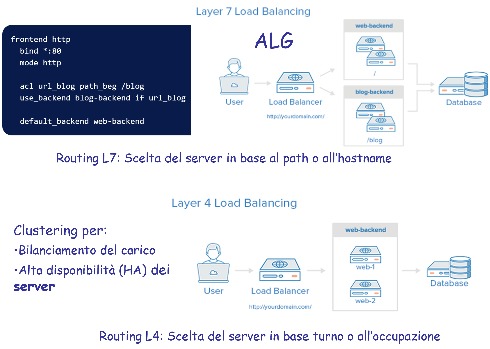

>[Torna a reti ethernet](archeth.md)

- [Dettaglio architettura Zigbee](archzigbee.md)
- [Dettaglio architettura BLE](archble.md)
- [Dettaglio architettura WiFi infrastruttura](archwifi.md)
- [Dettaglio architettura WiFi mesh](archmesh.md) 
- [Dettaglio architettura LoraWAN](lorawanclasses.md) 

# **Backup** 

Il backup realizzato ha essenzialmente due obiettivi:
•	Il **recupero dei dati** a seguito di una compromissione dovuta a danni accidentali o intrusioni (ad es. ramsonware). La politica adottata di gestione dei dati è stata quella di conservarli su una serie di dischi separati dal disco del sistema operativo, che vengono utilizzati come archivio documentale di tipo documentale. I dischi sono generalmente montati sul filesystem del disco principale del SO, a partire da una directory di accesso (normalmente media o mnt). Da questa directory le applicazioni (generalmente di tipo web) mediano l’accesso dell’utente ai dati fornendo servizi di autenticazione, autorizzazione e directory. In un nessun caso l’utente accede direttamente ai dati senza passare per un servizio di AAA. 
•	Il **recupero dei servizi** in seguito al blocco di una applicazione dovuto a guasti irreversibili delle applicazioni o del SO operativo che li ospita. La politica adottata è stata quella di installare le applicazioni server su sistemi virtualizzati invece che fisici. La virtualizzazione permette funzioni di recupero del servizio sconosciute ai sistemi basati su macchine puramente fisiche, quali snapshots precauzionali  in occasioni di aggiornamenti, spesso rischiosi in ambiente open source, oppure migrazioni dei sistemi virtualizzati (sotto forma di files) da una macchina fisica (ad esempio non più idonea) ad un’altra più prestante, oppure verso un NAS dove viene archiviata una loro copia di backup. Snapshot e migrazioni sono funzioni realizzate a caldo, cioè a macchina attiva e pienamente erogante il servizio. Il recupero di un sistema danneggiato o infetto avviene prontamente, abbandonando la copia compromessa e sostituendola con la sua copia più recente conservata sul NAS. Il procedimento di restore può avvenire in maniera automatica o manuale, comunque sfruttando i servizi di connettività a larga banda offerti dalla rete locale.


## **Backup dei dati** 

Riguardo la tecnica del montaggio, in un punto del filesystem di un disco di piccole dimensioni che ospita l’SO, di un disco di grandi dimensioni per lo storage dei dati, si può legittimamente ritenere che essa realizza un NAS. UN NAS ha essenzialmente due componenti il disco storage che ospita i documenti e un disco di servizio che ospita l’SO con le applicazioni che mediano l’interazione con l’utente realizzando le interfacce di accesso al disco. Le applicazioni realizzano normalmente anche i servizi di autenticazione, autorizzazione e logging locale (AAA). I NAS sono normalmente realizzati per due scopi:
- Realizzare un **contenitore** di documenti per l’**applicazione** 
- Realizzare un **contenitore** di documenti per il **backup** 

Il **disco di storage** potrebbe essere realizzato:
- Un **disco fisico** separato dal disco del SO.
- Una **partizione fisica** separata da quella del SO.
- Un **disco virtuale** che, in un hypervisor, rimane separato dal disco (virtuale) del SO.

La **modalità** con cui in un NAS si possono recuperare i dati sono essenzialmente **due**:
- **Politica PULL**, è il **NAS** che ha l’**iniziativa** di prelevare i dati dal server o NAS remoto attraverso un accesso tramite, ad es., un **client SSH** o un **client NFS**, o un client **SFTP**. 
- **Politica PUSH**, è il **server remoto** (on un agente del NAS sul server) che ha l’**iniziativa di spostare** i dati dalla loro directory locale **verso il NAS**, utilizzando un **protocollo di clonazione** come **rsync** o **rclone**, oppure **copiando i files** su un **montaggio** locale delle **cartelle remote di backup** sul NAS. Il montaggio può essere ottenuto, ad esempio, tramite i protocolli **NFS** o **Samba (SMB)**.





``` C++

```


Sitografia:


>[Torna a reti ethernet](archeth.md)

- [Dettaglio architettura Zigbee](archzigbee.md)
- [Dettaglio architettura BLE](archble.md)
- [Dettaglio architettura WiFi infrastruttura](archwifi.md)
- [Dettaglio architettura WiFi mesh](archmesh.md) 
- [Dettaglio architettura LoraWAN](lorawanclasses.md) 

