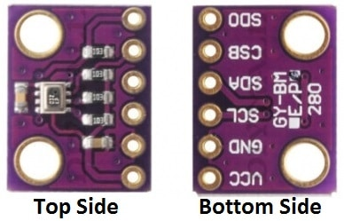
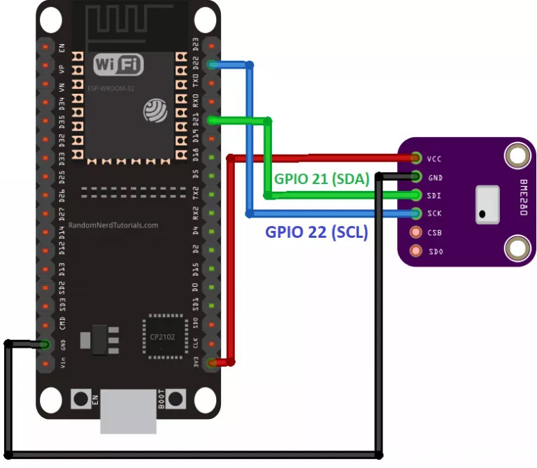
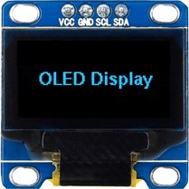
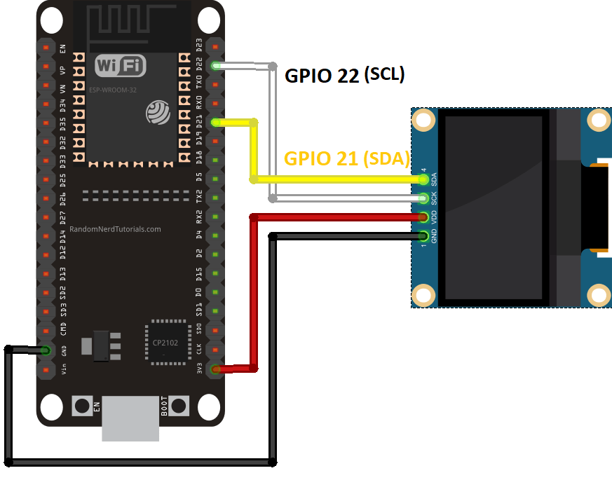

>[Torna a gateway I2C](gatewayi2c.md)

## **Gateway per BME280**

### **Sensore di temperatura, umidità e pressione BME280**



### **Esempio di cablaggio**


### **Display SSD1306**



### **Esempio di cablaggio**


Dal **punto di vista SW** seve **4 librerie** da scaricare dentro la solita cartella **libraries**:
- **adafruit bme280**. Si scarica da https://github.com/adafruit/Adafruit_BME280_Library come Adafruit_BME280_Library-master.zip da scompattare e rinominare semplicemente come **Adafruit_BME280_Library**
- **Adafruit Unified Sensor**. Si scarica da https://github.com/adafruit/Adafruit_Sensor come Adafruit_Sensor-master.zip da scompattare e rinominare semplicemente come **Adafruit_Sensor**
- **Adafruit_SSD1306**. Si scarica da https://github.com/adafruit/Adafruit_SSD1306 come Adafruit_SSD1306-master.zip da scompattare e rinominare semplicemente come **Adafruit_SSD1306**
- **Adafruit GFX Library**. Si scarica da https://github.com/adafruit/Adafruit-GFX-Library come Adafruit-GFX-Library-master.zip da scompattare e rinominare semplicemente come **Adafruit-GFX-Library**
- **Adafruit_BusIO**. Si scarica da https://github.com/adafruit/Adafruit_BusIO come Adafruit_BusIO-master.zip da scompattare e rinominare semplicemente come **Adafruit_BusIO** 

### **Gateway I2C-MQTT con più dispositivi nello stesso BUS I2C**

Il codice di seguito interroga periodicamente (ogni 4 sec) due sensori BME280 collegati sullo stesso BUS I2C. Dopo ogni lettura le misure di temperatura e umidità vengono: mostrate sul display SSD1306 collegato sempre sul medesimo BUS I2C, inviate via MQTT ad un server applicativo sotto forma di messaggio JSON. 

La libreria MQTT è asincrona per cui non bloccante. E' adoperabile sia per **ESP8266** che per **ESP32**.

```C++
//#include <WiFiClientSecure.h>

//#include <ESP8266WiFi.h> per ESP8266
#include <AsyncMqttClient.h>
#include <Ticker.h>
#include <Wire.h>
#include <Adafruit_BME280.h>
#include <Adafruit_SSD1306.h>

#include <WiFi.h>       // per ESP32

// Raspberry Pi Mosquitto MQTT Broker
//#define MQTT_HOST IPAddress(192, 168, 1, 254)
#define MQTT_HOST "test.mosquitto.org"
// For a cloud MQTT broker, type the domain name
//#define MQTT_HOST "example.com"
#define MQTT_PORT 1883

#define WIFI_SSID "myssid"
#define WIFI_PASSWORD "mypsw"

//Temperature MQTT Topic
#define MQTT_PUB "esp/misure/"
#define MAXNDEVICES 4

#define SCREEN_WIDTH 128 // OLED display width, in pixels
#define SCREEN_HEIGHT 64 // OLED display height, in pixels

Ticker mqttReconnectTimer;
Ticker wifiReconnectTimer;

//I2C devices
Adafruit_SSD1306 display(SCREEN_WIDTH, SCREEN_HEIGHT, &Wire, -1);
//Adafruit_BME280 bme1;
//Adafruit_BME280 bme2;
Adafruit_BME280 bme1(0x76); // I2C
Adafruit_BME280 bme2(0x77); // I2C

String datastr = "";

AsyncMqttClient mqttClient;

unsigned long previousMillis = 0;   // Stores last time temperature was published
const long interval = 4000;        // Interval at which to publish sensor readings
byte count = 0;
unsigned short nDevices = 0;
unsigned short addresses[MAXNDEVICES];

unsigned long previusMillis = 0;
bool sensor1 = false;
float t1, t2, h1, h2;

void connectToWifi() {
  Serial.println("Connecting to Wi-Fi...");
  WiFi.mode(WIFI_STA);
  //WiFi.disconnect();
  WiFi.begin(WIFI_SSID, WIFI_PASSWORD);
}

void connectToMqtt() {
  Serial.println("Connecting to MQTT...");
  mqttClient.connect();
}

void WiFiEvent(WiFiEvent_t event) {
  Serial.printf("[WiFi-event] event: %d\n", event);
  switch(event) {
    case SYSTEM_EVENT_STA_GOT_IP:
      Serial.println("WiFi connected");
      Serial.println("IP address: ");
      Serial.println(WiFi.localIP());
      connectToMqtt();
      break;
    case SYSTEM_EVENT_STA_DISCONNECTED:
      Serial.println("WiFi lost connection");
      mqttReconnectTimer.detach(); // ensure we don't reconnect to MQTT while reconnecting to Wi-Fi
      wifiReconnectTimer.once_ms(2000, connectToWifi);
      break;
  }
}

void onMqttConnect(bool sessionPresent) {
  Serial.println("Connected to MQTT.");
  Serial.print("Session present: ");
  Serial.println(sessionPresent);
}

void onMqttDisconnect(AsyncMqttClientDisconnectReason reason) {
  Serial.println("Disconnected from MQTT.");
  if (WiFi.isConnected()) {
    mqttReconnectTimer.once_ms(2000, connectToMqtt);
  }
}

void onMqttPublish(uint16_t packetId) {
  Serial.println("Publish acknowledged.");
  Serial.print("  packetId: ");
  Serial.println(packetId);
}

void addrSearch()
{
  byte error, address;
  int nDevices;
  Serial.println("Scanning...");
  nDevices = 0;
  for(address = 1; address < 127 && nDevices < MAXNDEVICES; address++ )
  {
    // The i2c_scanner uses the return value of
    // the Write.endTransmisstion to see if
    // a device did acknowledge to the address.
    Wire.beginTransmission(address);
    error = Wire.endTransmission();
    if (error == 0)
    {
      Serial.print("I2C device found at address 0x");
      if (address<16)
        Serial.print("0");
      Serial.print(address,HEX);
      Serial.println("  !");
	  addresses[nDevices] = address;
      nDevices++;
    }
    else if (error==4)
    {
      Serial.print("Unknown error at address 0x");
      if (address<16)
        Serial.print("0");
      Serial.println(address,HEX);
    }    
  }
  if (nDevices == 0)
    Serial.println("No I2C devices found\n");
  else
    Serial.println("done\n");
  //delay(5000);           // wait 5 seconds for next scan
}

void busInit(){
	// join I2C bus (I2Cdev library doesn't do this automatically)
	Wire.begin();
	addrSearch();
	// initialize device
	delay(2000);
	Serial.println("Initializing I2C devices...");
	if(!display.begin(SSD1306_SWITCHCAPVCC, 0x3C)) {
		Serial.println(F("SSD1306 allocation failed"));
		for(;;);
	}
	int status = bme1.begin();
    if (!status) {
        Serial.println("Could not find a valid BME280 sensor, check wiring, address, sensor ID!");
        Serial.print("SensorID was: 0x"); Serial.println(bme1.sensorID(),16);
        while (1);
    }
    status = bme2.begin();
    if (!status) {
        Serial.println("Could not find a valid BME280 sensor, check wiring, address, sensor ID!");
        Serial.print("SensorID was: 0x"); Serial.println(bme2.sensorID(),16);
        while (1);
    }
	delay(2000);
	display.clearDisplay();
	display.setTextColor(WHITE);
}

void setup() {
  Serial.begin(115200);
  Serial.println();
  Serial.println();

  WiFi.onEvent(WiFiEvent);

  mqttClient.onConnect(onMqttConnect);
  mqttClient.onDisconnect(onMqttDisconnect);
  mqttClient.onPublish(onMqttPublish);
  mqttClient.setServer(MQTT_HOST, MQTT_PORT);
  // If your broker requires authentication (username and password), set them below
  //mqttClient.setCredentials("REPlACE_WITH_YOUR_USER", "REPLACE_WITH_YOUR_PASSWORD");
  connectToWifi();
  count = 0;
  while (WiFi.status() != WL_CONNECTED && count < 10) {
    delay(500);
    count++;
    Serial.print(".");
  }
  busInit();  
}

void packData(String &str){    
	str = "{\"temp1\":\"";
	str += t1;
	str += "\",\"humidity1\":\"";
	str += h1;
	str += "\",\"temp2\":\"";
	str += t2;
	str += "\",\"humidity2\":\"";
	str += h2;
	str += "\"}";
    //delay(500); 
}

void loop() {
  unsigned long currentMillis = millis();
  if (currentMillis - previousMillis >= interval) {
      previousMillis = currentMillis;
	  sensor1 = !sensor1;
	  
	  Serial.print("Requesting data...");
	  t1 = bme1.readTemperature();
	  h1 = bme1.readHumidity();
	  t2 = bme1.readTemperature();
	  h2 = bme1.readHumidity();	
	  Serial.println("DONE");
	  
	  if(sensor1){
		  display.clearDisplay();
		  // display temperature
		  display.setTextSize(1);
		  display.setCursor(0,0);
		  display.print("Temperature1: ");
		  display.setTextSize(2);
		  display.setCursor(0,10);
		  display.print(String(t1));
		  display.print(" ");
		  display.setTextSize(1);
		  display.cp437(true);
		  display.write(167);
		  display.setTextSize(2);
		  display.print("C");
		  // display humidity
		  display.setTextSize(1);
		  display.setCursor(0, 35);
		  display.print("Humidity1: ");
		  display.setTextSize(2);
		  display.setCursor(0, 45);
		  display.print(String(h1));
		  display.print(" %"); 
	  }else{
		  display.clearDisplay();
		  // display temperature
		  display.setTextSize(1);
		  display.setCursor(0,0);
		  display.print("Temperature2: ");
		  display.setTextSize(2);
		  display.setCursor(0,10);
		  display.print(String(t2));
		  display.print(" ");
		  display.setTextSize(1);
		  display.cp437(true);
		  display.write(167);
		  display.setTextSize(2);
		  display.print("C");
		  // display humidity
		  display.setTextSize(1);
		  display.setCursor(0, 35);
		  display.print("Humidity2: ");
		  display.setTextSize(2);
		  display.setCursor(0, 45);
		  display.print(String(h2));
		  display.print(" %"); 
	  }
	  
	  display.display();
	  packData(datastr);
	    
      // Publish an MQTT message on topic esp32/ds18b20/temperature    
	  uint16_t packetIdPub1 = mqttClient.publish(MQTT_PUB, 1, true, datastr.c_str(), datastr.length());                        
      Serial.print("Pubblicato sul topic %s at QoS 1, packetId: ");
	  Serial.println(MQTT_PUB);
      Serial.println(packetIdPub1);
	  Serial.print("Messaggio inviato: ");
	  Serial.println(datastr); 
  }
}
```
**Sitografia:**
- https://randomnerdtutorials.com/esp32-mqtt-publish-bme280-arduino/


>[Torna a gateway I2C](gatewayi2c.md)
