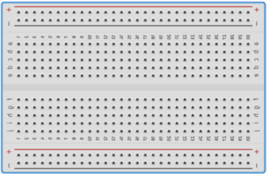

>[Torna all'indice generale](index.md)

## **LA BREADBOARD**

La **breadboard** è una basetta forata dove i componenti si incastrano meccanicamente e per cui i collegamenti elettrici sono realizzati senza bisogno di saldatura. È divisa in zone caratterizzata da specifici collegamenti elettrici interni alla basetta stessa. Questi collegamenti uniscono i fori della basetta secondo certe direzioni escludendone altre.

 
La basetta è divisa da un **solco centrale** in una **zona superiore** e **zona inferiore** che sono uguali specularmente rispetto al solco, percui i discorsi che faremo per una valgono per l'altra.

Concentriamoci sulla **parte superiore**.  Un solco orizzontale più sottile separa la zona di alimentazione dalla zona degli input e output:
- Nella **parte di alimentazione**, tutti i fori di una **stessa riga** sono internamente collegati, per cui sono allo **stesso potenziale**. I collegamenti interni si sviluppano in orizzontale ma non in verticale, per cui fori che stanno sulla stessa colonna ma su righe diverse, non sono elettricamente collegati.
- Nella **parte di input/output**, tutti i fori di una **stessa colonna** sono internamente collegati, per cui sono allo **stesso potenziale**. I collegamenti interni si sviluppano in verticale ma non in orizzontale, per cui fori che stanno sulla stessa riga ma su colonne diverse, non sono elettricamente collegati.

Molti componenti di I/0 sono bipoli, cioè componenti con due piedini che devono stare a **potenziale diverso** per cui devono essere necessariamente collegati **in orizzontale**, oppure **obliquamente**, ma in ogni caso **tra colonne diverse**. Possono essere collegati **in verticale** solo **a cavallo** del **solco grande** centrale oppure **a cavallo** di un dei **solchi sottili** che separano la zona di I/0 da quella di alimentazione.
 

>[Torna all'indice generale](index.md)
