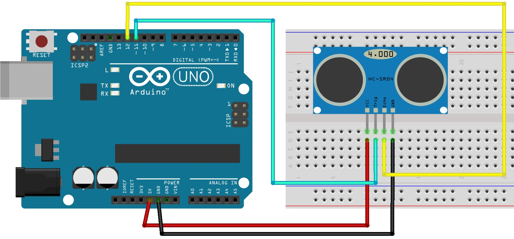
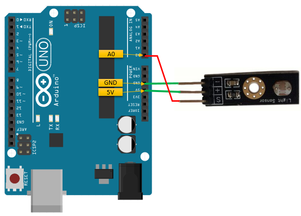
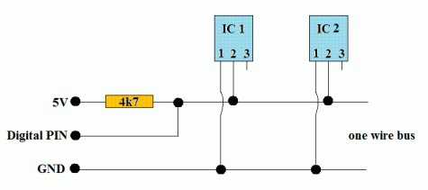
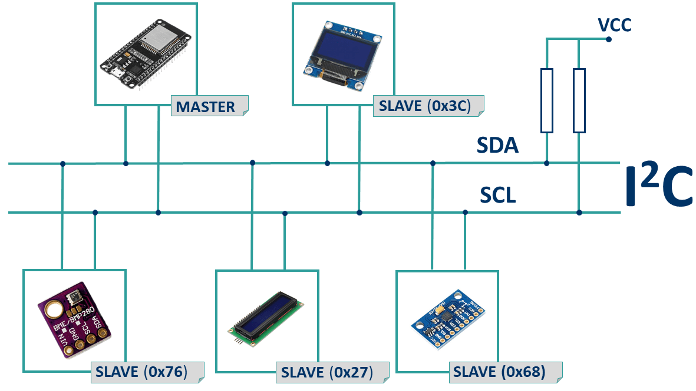
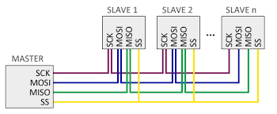
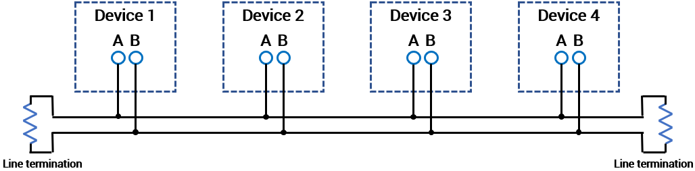
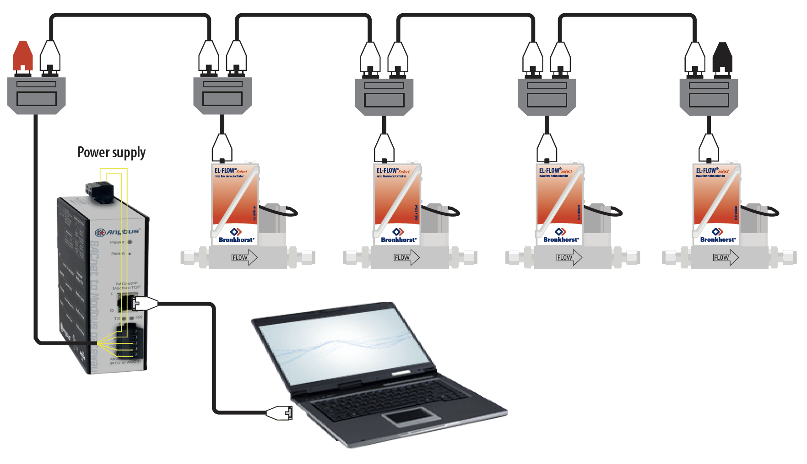
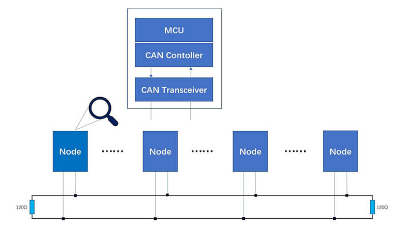

>[Torna a reti di sensori](sensornetworkshort.md#topologia-delle-reti-di-sensori-cablata)

### **Esempi di collegamenti base con topologia a stella**:

  
  
  Accesso in scrittura e in lettura su due **porte digitali** di un sensore ad ultrasuoni:
  - si collega su una delle porte **digitali** del microcontrollore e trasporta bit codificati
  - sono **punto-punto**, cioè **un filo** (escluso GND che comunque va collegato al sensore) per ogni sensore
  - il **collegamento** è in genere **simplex** cioè in una direzione sola, da o verso il sensore
      - se in **ingresso** al microcontrollore si collega ad una porta impostata in modalità **INPUT**
      - se in **uscita** al microcontrollore si collega ad una porta impostata in modalità **OUTPUT**

  
  
  Accesso in in lettura su una **porta analogica** di un sensore di luminosità:
  - si collega su una delle porte **analogiche** del microcontrollore e trasporta bit codificati
  - sono **punto-punto**, cioè **un filo** (escluso GND che comunque va collegato al sensore) per ogni sensore
  - il collegamento è in genere **simplex** cioè in una direzione sola, da o verso il sensore
      - se in **ingresso** al microcontrollore si collega ad una porta **ADC** (Analog Digital Converter) del microcontrollore
      - se in **uscita** al microcontrollore si collega ad una porta **PWM** (Pulse Width Modulation) del microcontrollore
  
  

### **Esempi di collegamenti base con topologia a bus:**

Il BUS è un mezzo ad **accesso multiplo** composto da un **unico filo** per **tutte** le stazioni. Il tipo del collegamento **in parallelo** dei dispositivi lo rende un **mezzo broadcast** cioè un mezzo trasmissivo dove se una stazione **parla** tutte le altre ricevono e **ascoltano**. I mezzi broadcast sono soggetti a **collisioni** che devono essere risolte costringendo le stazioni a parlare **una alla volta** mediante un **protocollo di arbitraggio**. Questi si dividono in due categorie: **centralizzati** e **distribuiti**. Quelli che regolano il collegamento dei **dispositivi sensori** al gateway sono spesso **centralizzati** e, in ogni caso, lo sono la maggior parte dei protocolli che vedremo di seguito (tranne l'ultimo).

La **privatezza** dei dati, in assenza di crittografia, è limitata perchè i messaggi inviati da una stazione sono inviati fisicamente a tutte le altre stazioni. Le stazioni però sono normalmente istruite a filtrare i messaggi a loro non destinati, ma, nonostante ciò, questi sono pur sempre a loro visibili e un attacco di **sniffing** per carpirli da parte di una stazione "malintenzionata" è sempre possibile. 

**Arbitraggio centralizzato Master/Slave**

In un sistema **centralizzato** una stazione è più importante delle altre perché può avere l’**iniziativa di cominciare** una comunicazione ed è detta **Master**. Le altre stazioni hanno un **ruolo passivo**, nel senso che rispondono solo se sono interrogate dal master mediante una tecnica detta polling e sono dette pertanto **Slave**. Il **polling** equivale all’**interrogazione periodica** di più dispositivi seguita da una **risposta immediata**. Il master decide **chi** parla e **quando** parla a rotazione, seguendo un ordine prestabilito detto **round robin**, secondo il quale si scandisce ogni interazione richiesta-risposta. 
Esistono sistemi centralizzati con un **solo master** e altri **multimaster** in cui il controllo del BUS passa alternativamente da un master all'altro. La presenza di più master richiede comunque la concomitante presenza un **meccanismo di sincronizzazione** per evitare **sovrapposizioni** nell'accesso al BUS (lo devono controllare in maniera esclusiva ed uno alla volta).

**Arbitraggio distribuito CSMA/CA**

In un sistema **distribuito a filo** spesso si usano **sistemi di arbitraggio CSMA/CA non distruttivi** come (Carrier sensing multiple access/collision arbitration). La sincronizzazione dei bit tra le stazioni deve esse molto accurata. Ogni elemento ascolta il bus. Quando lo sente libero, avvia la comunicazione. Se due lo fanno insieme, un meccanismo di arbitrazione permette ad una sola trasmissione di continuare.
Nel protocollo CAN si definiscono i bit come **"dominante"** e come **"recessivo"**. Un bit dominante vince su un bit recessivo. Se un nodo trasmette un bit dominante e contemporaneamente un altro nodo trasmette un bit recessivo allora sul bus sara’ presente quello dominante. Nel protocollo CAN si definisce il bit logico **0** come bit **dominante** e il bit logico **1** come bit **recessivo**. Dal punto di **vista elettrico** e di interfaccia si può pensare che il bit 1 sia forzato sul bus da un resistore di pull-up mentre lo zero dominante dal un trasnsistor con il drain sul bus.
Se un nodo **rileva** un **livello dominante** quando **sta inviando** esso stesso un **livello recessivo**, uscirà immediatamente dal processo di arbitraggio e si metterà in **ascolto**, in attesa della **fine della trasmissione dominante**.

 
 
In genere i BUS si trovano in due stati **IDLE** (riposo) e **comunicazione**. Lo stato di **IDLE** è quello **predefinito** ed è ottenuto tramite una **resistenza di pullup** collegata sulla linea. Durante lo stato di **comunicazione** il **valore bit 0** è codificato con il livello basso L=0 Volt mentre il **valore bit 1** è codificato con lo stesso valore dell'IDLE cioè **H**. L'**inizio della trasmissione** di una trama è in genere **segnalata** da un livello basso **L iniziale** detto **start bit**.

Ci sono **sistemi a BUS** che si **connettono direttamente** alle **porte digitali** di un **microcontrollore** senza **driver HW** aggiuntivi. I più diffusi sono 1-wire (Dallas), two-wire (I2C) e 3 o 4-wire (SPI). Il collegamento diretto, **senza driver HW**  (bit banging), alle porte digitali del microcontrollore genera sul BUS **segnali non bilanciati** circostanza che **limita la lunghezza** ammissibile dei collegamenti da **qualche metro** ad una **decina di metri**.

**Tutti i tipi di BUS** richiedono l'**installazione** di **librerie SW** per poter gestire l'**accesso al mezzo** dall'interno del **codice** di un applicativo. In genere, ciò si ottiene mediante **API** di servizio di **alto livello** e quindi comode da utilizzare. Allo scopo, nel codice del programma, o in un file di configurazione, va riportato il **mappaggio** tra il **numero di porta** e il **ruolo** della stessa all'interno del **protocollo**, per tutte quelle **adoperate** per realizzare il **BUS**.
 
Esempio di bus **Dallas** detto anche a 1 filo (**one-wire**):
- è costituito da **un solo filo**, escluso il filo **GND**, comune a tutti i collegamenti e che **va collegato** anch'esso **al sensore**.
- il dispositivo riceve l'alimentazione in CC **miscelata insieme ai dati**. Durante i bit zero, non ricevendo alimentazione dal cavo, il dispositivo la riceve da un condensatore tampone.
- alcuni dispositivi possiedono comunque una linea di **alimentazione separata** da quella dati esibendo quindi, complessivamente **3 terminali**.

 

Esempio di bus **I2C** detto anche a 2 fili (**two-wire**):
- è costituito da **2 fili**, escluso il filo **GND**, comune a tutti i collegamenti e che **va collegato** anch'esso **al sensore**
- terminale **SDA** (Serial DAta) per i dati
- terminale **SCL** (Serial CLock) per il clock (per la presenza di questo segnale l'I2C è un bus sincrono)
 
 
 
Esempio di bus **SPI** detto anche 4 fili (**four-wire**):
- è costituito da **4 fili**, escluso il filo **GND**, comune a tutti i collegamenti e che **va collegato** anch'esso **al sensore**
- terminale **SCLK** - SCK: Serial Clock (emesso dal master)  per il clock (per la presenza di questo segnale l'SPI è un bus sincrono)
- terminale SDI – **MISO** – SOMI – DI - SO: Serial Data Input, Master Input Slave Output (ingresso per il master e uscita per lo slave)
- terminale SDO – **MOSI** – SIMO – DO – SI: Serial Data Output, Master Output Slave Input (uscita dal master)
- terminale **CS** – SS – nCS – nSS – STE: Chip Select, Slave Select, emesso dal master per scegliere con quale dispositivo slave vuole comunicare (dalla figura, il segnale SS negato, si comprende che per comunicare con il dispositivo slave deve venire messo a livello logico basso)

 
 
 Esempio di bus **RS485**:
 - è costituito da **2 fili**, escluso il filo **GND**, comune a tutti i collegamenti che **NON** va collegato anch'esso al sensore
 - il **BUS RS485** è **bilanciato** per cui non è possibile collegare i suoi terminali direttamente sulle porte digitali di un microcontrollore ma bisogna interporre **un driver HW** che trasli i livelli da logica TTL (a 5V o 3.3V) a logica bilanciata AB.
 - i **fili** del BUS sono **attestati** sui **morsetti A e B** del driver. La differenza A-B codifica il valore del bit trasmesso.
 - le **linee bilanciate** permettono distanze che vanno da un **minimo** di 30cm ad un **massimo** di circa 1 Km. 
 - il **numero di dispositivi** connettibile dipende dalle implementazioni e dalla massima corrente erogabile sul BUS, accreditato è un numero di almeno 32 dispositivi.
 - può essere arbitrato dal protocollo **Modbus** che gestisce diversi servizi codificati nel campo **function code** contenuto nel telegramma di ciascuna richiesta
 - può essere arbitrato dal protocolllo **DMX** (Digital MultipleX), uno standard di comunicazione digitale usato principalmente per il controllo dell'illuminazionedi scena nell'industria dello spettacolo.

 
 
  Esempio di attuatori collegati con BUS **RS485** arbitrato dal protocollo Modbus:

 
 
 Esempio di bus **CAN**:
 - è diffuso in automotive, in home automation è una possibilità ancora poco utilizzata.
 - a differenza di tutti i BUS precedenti, l'**accesso** è regolato con un protocollo di **arbitraggio distribuito CSMA/CA**
 - **scelta economica** se la scheda microntrollore possiede già con un driver logico (CAN Controller) a bordo realizzato in HW che espone un'interfaccia CAN TTL nella piedinatura.
 - è costituito da **2 fili** CANH e CANL
 - il **CANBus** è **bilanciato** per cui non è possibile collegare i suoi terminali direttamente sulle porte digitali di un microcontrollore ma bisogna interporre **un driver HW** che trasli i livelli da logica TTL (a 5V o 3.3V) a logica bilanciata HL.
 - i **fili** del BUS sono **attestati** sui **morsetti CANH e CANL** del driver. La differenza CANH-CANL codifica il valore del bit trasmesso.
 - le **linee bilanciate** permettono distanze che vanno da un **minimo** di 40m ad un **massimo** di circa 13Km (1Mbps-5kbps). 
 - il **numero di dispositivi** connettibile dipende dalle implementazioni, dalla massima corrente erogabile sul BUS e dai ritardi, accreditato è un numero di almeno un centinaio di dispositivi.
 
 
 
Abbiamo visto BUS **centralizzati** e di uso generale che **definiscono** il **livello fisico** di una comunicazione via cavo. Degli altri livelli OSI o **non forniscono** affatto la definizione o ne forniscono una **molto essenziale** sotto forma di **function code**. Esistono molti altri **stack commerciali** che si occupano di domotica e automazione che a livello fisico utilizzano sia **reti cablate** che **wireless**. **Esempi notevoli** sono **KNX**, **BACNet**, **DALI**. 

Molti di questi forniscono una **definizione elaborata**, **standard** ed **esaustiva** di tutti i possibili **tipi di servizi** adoperabili nei vari **scenari pratici** dell'automazione (dall'accensione di una lampadina all'azionamento di una tapparella, ecc.) spesso **catalogati e raccolti** in strutture dati dette **profili**. Molti di questi BUS, per **accrescere l'affidabilità**, adoperano un **arbitraggio** del mezzo trasmissivo di tipo **peer to peer** usando, ad esempio, protocolli di tipo **ALOHA** o **CSMA/CA**. [Dettaglio protocolli di accesso su mezzi a BUS](protocollidiaccesso.md)

### **Sitografia:**
- http://www.iotsharing.com/2017/09/how-to-use-arduino-esp32-can-interface.html
- https://www.microchip.com/en-us/product/MCP2518FD
- https://www.beyondlogic.org/adding-can-controller-area-network-to-the-raspberry-pi/
- https://www.hackster.io/youness/how-to-connect-raspberry-pi-to-can-bus-b60235
- https://www.amazon.it/ARACELI-Electronics-Ricevitore-sviluppo-controller/dp/B07MY2D7TW/ref=asc_df_B07MY2D7TW/?tag=googshopit-21&linkCode=df0&hvadid=575035016065&hvpos=&hvnetw=g&hvrand=14339607445270056898&hvpone=&hvptwo=&hvqmt=&hvdev=c&hvdvcmdl=&hvlocint=&hvlocphy=1008727&hvtargid=pla-1115833342224&psc=1

>[Torna a reti di sensori](sensornetworkshort.md#topologia-delle-reti-di-sensori-cablata)

