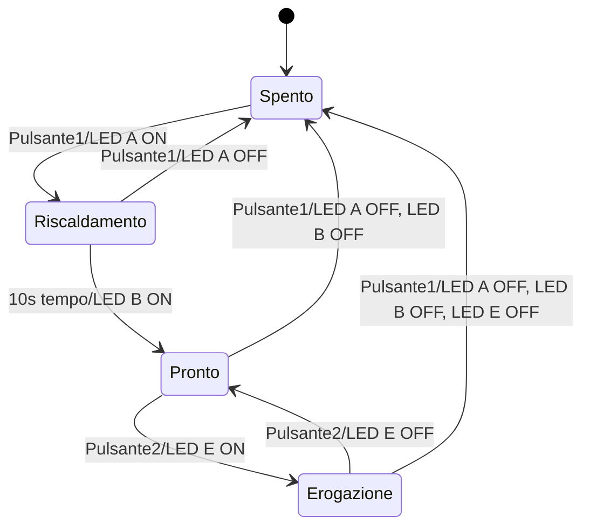

>[Torna all'indice generale](indexstatifiniti.md)

# **MACCHINA PER IL CAFFE'**

Realizzare una macchina per il caffè che funziona nella seguente maniera:
- Quando premo il pulsante 1 si accende il led A(accensione) da questo momento in poi l’acqua è in riscaldamento.
- Terminerà quando bollerà, all’incirca dopo 10s si accende il led B(acqua bolle) e viene abilitato il pulsante 2 è un toggle, alla prima pressione inizia l’erogazione indicata da un led E e termina l’erogazione con la seconda pressione e spengimento del led E.
- (IL PRIMO PULSANTE ALLA SECONDA PRESSIONE SPEGNE LA MACCHINA ESSENDO UN TOGGLE).

Disegnare la mappa degli stati.

Creerò un sistema di controllo per una macchina del caffè con la logica richiesta. Prima analizzerò gli stati e le transizioni, poi realizzerò una tabella degli stati e un diagramma.

Ecco il sistema di controllo per la macchina del caffè secondo le specifiche richieste:

La macchina ha quattro stati principali:
1. **Spento**: Stato iniziale, tutti i LED sono spenti
2. **Riscaldamento**: Attivato dal pulsante 1, LED A acceso
3. **Pronto**: Dopo circa 10 secondi, LED B acceso e pulsante 2 abilitato
4. **Erogazione**: Attivato dal pulsante 2, LED E acceso

Ho creato una tabella degli stati completa che mostra:
- Stati del sistema
- Eventi che causano transizioni
- Azioni intraprese durante ogni transizione
- Stato delle uscite in ciascuno stato

Il diagramma degli stati visualizza graficamente le transizioni tra i vari stati e le condizioni che le attivano.

Punti chiave del funzionamento:
- Il pulsante 1 è un toggle che accende/spegne l'intero sistema
- Quando il sistema è in riscaldamento, dopo circa 10 secondi l'acqua bolle (LED B)
- Solo quando l'acqua è in ebollizione si può utilizzare il pulsante 2
- Il pulsante 2 è un toggle che inizia/termina l'erogazione (LED E)
- Il pulsante 1 può spegnere il sistema da qualsiasi stato

# Tabella degli Stati della Macchina del Caffè

## Stati
- **S0**: Spento (Stato iniziale)
- **S1**: Riscaldamento
- **S2**: Pronto
- **S3**: Erogazione

## Ingressi
- **P1**: Pulsante 1 (toggle on/off generale)
- **P2**: Pulsante 2 (toggle erogazione)
- **T**: Timer (10s per bollire l'acqua)

## Uscite
- **LED A**: Indicatore accensione
- **LED B**: Indicatore acqua in ebollizione
- **LED E**: Indicatore erogazione
- **EP2**: Abilitazione pulsante 2

## **Tabella di Transizione degli Stati**

| Stato Attuale | Evento      | Stato Prossimo | Azioni                           |
|---------------|-------------|----------------|----------------------------------|
| S0 (Spento)   | P1 premuto  | S1             | LED A = ON                       |
| S1 (Riscald.) | P1 premuto  | S0             | LED A = OFF                      |
| S1 (Riscald.) | T scaduto   | S2             | LED B = ON, EP2 = abilitato      |
| S2 (Pronto)   | P1 premuto  | S0             | LED A = OFF, LED B = OFF         |
| S2 (Pronto)   | P2 premuto  | S3             | LED E = ON                       |
| S3 (Erogaz.)  | P2 premuto  | S2             | LED E = OFF                      |
| S3 (Erogaz.)  | P1 premuto  | S0             | LED A = OFF, LED B = OFF, LED E = OFF |

## **Tabella degli Stati e Uscite**

| Stato         | LED A | LED B | LED E | EP2      |
|---------------|-------|-------|-------|----------|
| S0 (Spento)   | OFF   | OFF   | OFF   | Disab.   |
| S1 (Riscald.) | ON    | OFF   | OFF   | Disab.   |
| S2 (Pronto)   | ON    | ON    | OFF   | Abilitato|
| S3 (Erogaz.)  | ON    | ON    | ON    | Abilitato|



## **Codice in Arduino della macchina per il caffè**

```C++

//##### urutils.h #####
void waitUntilInputLow(int btn, unsigned t)
{
   do{
	 delay(t);
   }while(digitalRead(btn)!=LOW);
}

struct DiffTimer
{
	unsigned long elapsed, last;
	bool timerstate=false;
	byte state = 0;
	byte count = 0;
	void reset(){
		elapsed = 0;
		last = millis();
	}
	void toggle(){
		if(timerstate){
    	    stop();
		}else{
			start();
		}	
	}
	void stop(){
		if(timerstate){
			timerstate = false;
    	    elapsed += millis() - last;
		}	
	}
	void start(){
		if(!timerstate){
			timerstate = true;
			last = millis();
		}
	}
	unsigned long get(){
		if(timerstate){
			return millis() - last + elapsed;
		}
		return elapsed;
	}
	void set(unsigned long e){
		reset();
		elapsed = e;
	}
};
//##### urutils.h #####

/*Alla pressione del pulsante si attiva o disattiva un led
mentre un altro led blinka (TASK CONCORRENTI)
*/
int led_E=13; // indicatore di erogazione
int led_A=12; // indicatore di accensione/spegnimento
int led_B=4;  // indicatore di pronto
int pulsante1=2;
int pulsante2=3;
uint8_t state;
DiffTimer t1;

enum Stati{
  SPENTO,
  RISCALDAMENTO,
  PRONTO,
  EROGAZIONE
};

void blink(int led) {
  digitalWrite(led, !digitalRead(led));
}

void setup(){
  pinMode(pulsante1, INPUT);
  pinMode(pulsante2, INPUT);
  pinMode(led_E, OUTPUT); // indicatore di erogazione
  pinMode(led_A, OUTPUT); // indicatore di accensione/spegnimento
  pinMode(led_B, OUTPUT); // indicatore di pronto
  Serial.begin(115200);
  state = SPENTO; // inizialmente l'acqua è fredda
}

void loop() {
  switch (state) {
    case SPENTO:
    	Serial.println("SPENTO");
		if(digitalRead(pulsante1) == HIGH){
			waitUntilInputLow(pulsante1, 50);
			digitalWrite(led_A, HIGH);
			state = RISCALDAMENTO;
			t1.start();
			t1.reset();
		}
    break;
    case RISCALDAMENTO:
		Serial.println("RISCALDAMENTO");
		if(digitalRead(pulsante1) == HIGH){
			waitUntilInputLow(pulsante1, 50);
			digitalWrite(led_A, LOW);
			state = SPENTO;	
		}
		if(t1.get() > 10000){
			t1.stop();
			digitalWrite(led_B, HIGH);
			state = PRONTO;	
		}
    break;
    case PRONTO:
		Serial.println("PRONTO");
		if(digitalRead(pulsante1) == HIGH){
			waitUntilInputLow(pulsante1, 50);
			digitalWrite(led_A, LOW);
			digitalWrite(led_B, LOW);
			state = SPENTO;	
		}
		if(digitalRead(pulsante2) == HIGH){
			waitUntilInputLow(pulsante1, 50);
			digitalWrite(led_E, HIGH);
			state = EROGAZIONE;	
		}
    break;
	case EROGAZIONE:
		Serial.println("EROGAZIONE");
		if(digitalRead(pulsante1) == HIGH){
			waitUntilInputLow(pulsante1, 50);
			digitalWrite(led_A, LOW);
			digitalWrite(led_B, LOW);
			digitalWrite(led_E, LOW);
			state = SPENTO;	
		}
		if(digitalRead(pulsante2) == HIGH){
			waitUntilInputLow(pulsante1, 50);
			digitalWrite(led_E, LOW);
			state = PRONTO;	
		}
    break;
  }
  delay(10);
}
```

>[Torna all'indice generale](indexstatifiniti.md)
