# 📚 Raccolta Cheat Sheet — Reti & Sistemi

> Documento unico in quattro parti. Stile e numerazione coerenti.
> **Parte I** progettazione · **Parte II** Cisco IOS / Linux · **Parte III** backup · **Parte IV** mesh Wi-Fi.

---
# Parte 0 · Scelta della tecnologia di rete 

In base alle esigenze dei client in termini di velocità (e consumo) e di distanza dei collegamenti è possibile realizzare una tassonomia delle reti di dispositivi:


In questo caso, a titolo di esempio, è stata cerchiata la tecnologia WIFi perchè siamo interessati a medie distanze (comprese tra 10m e 100m) e a bit rate sostenute (quindi alti consumi).

Normalmente, bit rate e consumo sono direttamente proporzionali, quando cresce il primo cresce l'altro e viceversa.

---

# Parte I · Aspetti critici di progetto

> Prima il **caso generale** (comune a tutte le tecnologie), poi gli aspetti **particolari**
> di ciascuna. Per ogni tecnologia vanno sempre documentati anche gli aspetti comuni.

## 1 · Aspetti critici comuni

### 1.0 Analisi della realtà
- **Ipotesi sul dominio**: ipotesi più precise sulla distribuzione degli asset (nodi di elaborazione e nodi di rete), ipotesi sui volumi di traffico e sui livelli di servizio.
- **Vincoli normativi**: di privacy (GDPR, NIS), di dominio (codice della strada, regole amministrative, ecc), di sistema (cablaggio strutturato,  BIA e criticità degli asset, Sicurezza funzionale — IEC 61508, potenza, EIRP, ERP, duty cycle, ecc)

### 1.1 Schemi fondamentali
- Schema fisico (**planimetria**) dello scenario: ambienti ed edifici chiave, infrastruttura
  **indoor**/**outdoor**, con **etichettatura univoca** di tutti i **dispositivi passivi** di rete (armadi) e con la definizione del **tracciato** dei mezzi trasmissivi (cavi ethernet e fibra).
- Schema **logico** (albero degli **apparati attivi**) di tutti i dispositivi che rappresenti:
     - eventuale **router di confine** della LAN
     - eventuale gerarchia di **switch** che realizzano fisicamente la LAN
     - **link fisici**: dorsali interne alle LAN e dorsali esterne verso lo ISP
     - **link virtuali** ai vari livelli ISO/OSI (tipicamente L2, L3, L7):
         - link L2/L3 **tunnel** (VPN) su rete pubblica ISP — Secure o Trusted Network;
         - link L2/L3 **ponte radio 802.11** (WiFi) Client/Server o bridged;
         - link L7 tra sensori/attuatori IP e broker MQTT, o tra gateway WSN e broker MQTT.

### 1.2 Utenti e dispositivi
- **Divisione in gruppi** degli utenti e caratterizzazione (dislocazione delimitata via subnet
  oppure diffusa "a macchia di leopardo" via VLAN).
- **Tecnologie dei dispositivi** chiave: sensori/attuatori, **gateway**, con
  **dimensionamento di massima** (quantità, porte, banda). *(I dettagli specifici nelle sezioni particolari.)*
- Dislocazione di eventuali **router/Firewall**.

### 1.3 Indirizzamento e routing
- **Subnetting** dei **link verso le LAN** (fisiche o virtuali per gruppi di utenti, server farm e DMZ) definizione dell **indirizzo del router di confine** della LAN. Definizione degli **indirizzi dei server**.
- **Subnetting** dei **link fisici di dorsale** tra i router e definizione degli **indirizzi delle interfacce fisiche** dei router
- **Subnetting** dei **link logici L3 di dorsale** tra i router e definizione degli **indirizzi delle interfacce virtuali TUN** dei router
- **Tipo di routing** (statico o dinamico). Se statico, definire le **tabelle** più significative.
  *(Eccezione: nel WiFi Mesh il routing è sempre automatico — vedi §3.3.)*

### 1.4 Servizi di rete
- Posizione dei **servizi di sistema** (DHCP, DNS): a bordo del **FW**, collegati al **CS**, o in **server farm**.
- Eventuale **continuità del servizio** mediante replica sul piano servizio, dati e ripristino (backup).
- Eventuali **ACL** in **ingresso** (direzione IN) di ciascun router per il **filtraggio dei pacchetti**.
- **NAT** sull'interfaccia WAN verso internet (indirizzi privati → pool pubblico del router di confine).
- Eventuale **reverse proxy** (WAN o server farm) per funzioni di **ALG** e **clustering**.
- Eventuale **servizio VPN** sulla WAN per:
  - accesso remoto **home-to-site** (manutenzione, smartworking);
  - connessione **site-to-site** (secure o trusted) "like wired" verso sede remota, con
    **autenticazione del nodo** e **cifratura dei dati**.

### 1.5 Autenticazione
- **Autenticazione utenti** (es. **802.1X**) per l'accesso alla **risorsa rete** presso un **supplicant** (NAS):
  - **L2 EAP** porta fisica presso **switch** (MAC o id utente via **RADIUS/DIAMETER**);
  - **L2 EAP** porta logica presso **AP WiFi** (MAC o id utente via **RADIUS/DIAMETER**);
  - **L7 Captive portal** presso switch o AP (username/password o voucher su form web).
- **Autenticazione dei webservice** (openid, psw, sessioni…).
- **Autorizzazione SSO** (openid, kerberos…).
- **Autenticazione nodi sensori/attuatori** (certificati, psw, preshared key…).
- **Autenticazione nodi di elaborazione/pubblicazione** (certificati, psw, preshared key…).
- **Autenticazione nodi di smistamento** (certificati, vpn…).

### 1.6 Applicazione e dati IoT
- Posizione del **broker MQTT**.
- **Topic** utili per i casi d'uso richiesti.
- **Messaggi JSON** per dispositivi IoT significativi (**comandi**, **stato**, **configurazione**).
- **Percorso dei dati** sensori↔attuatori → **sede dell'elaborazione** (locale/edge vs remota on-premise/cloud).
- **Funzioni del firmware** di bordo (anche in **pseudocodice**).

## 2 · Documentazione cablaggio

Nell'**ordine**:
1. Planimetria senza cablaggio (parte fisica utile ma non necessaria).
2. Planimetria con cablaggio (necessaria ovunque tranne cloud; fusa con l'albero degli apparati attivi nelle mesh WiFi).
3. Albero degli apparati passivi (necessario in tutti i contesti ethernet + WSN).
4. Tabella delle dorsali (ethernet + WSN).
5. Albero degli apparati attivi (ethernet + WSN).
6. Schema degli armadi (ethernet + WSN).

Alcuni documenti si possono **trascurare** secondo il peso della parte fisica nel progetto:
- servizi in **cloud** → parte fisica delegata al datacenter;
- servizi **on premise** → parte fisica responsabilità del progetto;
- reti **mesh WiFi** e **WSN** (LoRaWAN, Zigbee, RFID) dove il **gateway WSN** coincide con il
  **gateway di accesso** a Internet → **cablaggio cavi** praticamente inesistente;
- in mesh WiFi/WSN la planimetria comprende anche l'albero degli apparati attivi (solo parte ethernet) e rappresenta:
  - posizione dei nodi;
  - **albero principale** del collegamento wireless (L2 o L3) tra i nodi, con ipotesi di **collegamento secondario (backup)** in caso di guasto;
- scenari diversi e di natura differente → replicare la planimetria per ciascuno;
- reti assimilabili a **aggregazione di client** su una **rete di distribuzione IP** → utile uno schema logico che le rappresenti come **federazione di reti** (tunnel L2/L3 o broker MQTT).

## 3 · Aspetti particolari per tecnologia

### 3.1 Ethernet
- **Dorsali** e **punti di accesso/aggregazione** dei dispositivi utente.
- **Subnetting** strutturato: subnet di **aggregazione** (statica), di **dorsale** (statica o **Link Local**), di **servizio** (server farm e **DMZ**).
- **Indirizzi dei server** e **range** dei client IP (PC, smartphone, tablet, sensori/attuatori).

### 3.2 WiFi infrastruttura
- **AP** etichettati e in **posizione baricentrica** rispetto alle utenze.
- **Indirizzi server** e **range** client IP.
- **Vincoli di prossimità** indoor/outdoor (controllo potenza, roaming) e **di posizionamento** (trilaterazione).
- **Posizione del controller** degli AP.
- **Autenticazione nodi AP** (certificati, psw, preshared key) presso i servizi (es. AP su RADIUS).
- Se VLAN presenti: **associazione VLAN↔SSID** (statica o dinamica con **Tunnel-Private-Group-Id**).

### 3.3 WiFi Mesh
- **Nodi** etichettati con almeno **un percorso LOS** tra vicini; **percorsi alternativi (backup)** in caso di guasto dei nodi centrali.
- Tecnologie: **topologia** (stella, bus, singolo), **link**, **accesso radio** (TDM / CSMA/CA / slotted CSMA/CA) con dimensionamento.
- **Dorsali wireless**, **punti di accesso/aggregazione**, eventuali **link di backhaul**.
- **Interfacce radio**: **2-band** (dual channel) o **3-band** (three channel).
- **Canali** in banda **ISM** con **riuso nello spazio** per minimizzare l'**interferenza cocanale**.
- **Vincoli di prossimità** e **di posizionamento**.
- **Subnetting** strutturato (aggregazione/dorsale/servizio) + **indirizzi server** e **range** client.
- **Autenticazione nodi AP** reciproca (backhaul) o nodi↔servizi (AP su RADIUS).
- **Tipo di mesh**: **routed** vs **bridged**.
- **Routing sempre automatico** (AODV, OLSR, Babel) con subnet automatiche dei link (**LLA**, **SLAAC**). *(Sostituisce il routing statico/dinamico.)*
- Se VLAN: **associazione VLAN↔SSID** (statica o dinamica con **Tunnel-Private-Group-Id**).
- **Posizione del controller** degli AP.

### 3.4 LoRaWAN
- Planimetria con **posizione** ed etichettatura di sensori/attuatori, gateway/packet forwarder (**PF**), network server (**NS**), join server (**JS**), application server (**AS**).
- Stabilire se serve una **federazione di reti**: se **broker** e **NS** sono nel router/gateway o **a comune** tra più reti LoRaWAN.
- stabilire la natura del collegamento fisico (cavo ethernet, fibra ottica, 5G, satellite) e logico IP (tunnel MPLS Trusted Network o tunnel VPN Secure Network o TLS senza tunnel) tra PF e NS, e tra NS e AS
- Definire, se necessario, più AS associati a certi gruppi di sensori.
- **Percorso dei dati** → **sede dell'elaborazione** dove decifrare il payload: AS **locale sul GW** (insieme a PF e NS) oppure in una **sede remota**.
- **Vincoli di prossimità** e **di posizionamento**.
- **Classi di servizio** dei nodi sensori/attuatori.
- **Modalità di autenticazione** dei nodi (**OTAA** o **ABP**).

### 3.5 Zigbee
- **Nodi** etichettati con almeno **un gateway** verso rete IP; **percorsi alternativi (backup)** se cade il gateway principale.
- Tecnologie: **tipologia di servizio** (polling sincrono, comando asincrono…).
- **Vincoli di prossimità** e **di posizionamento**.
- **Percorso dei dati** → **sede dell'elaborazione** (edge sul gateway vs remota).

### 3.6 BLE
- Come Zigbee: **nodi** + **gateway** verso IP, **backup** del gateway, **tipologia di servizio**, **vincoli** prossimità/posizionamento, **sede dell'elaborazione**.

### 3.7 RFID
- **Tecnologie dei tag**: **passivi**, **attivi**, **semi-passivi (BAP)** → determinano **portata**, **costo**, **durata**.
- **Frequenza di lavoro** (**LF**, **HF**, **UHF**, **microonde**) in funzione di **materiali**, **distanza**, **vincoli normativi**.
- **Densità dei tag** simultanei (**dense reader environment**) → eventuali protocolli di **anticollisione**.
- **Nodi** + **gateway** verso IP con **backup**; **vincoli** prossimità/posizionamento; **sede dell'elaborazione**.

---
# Parte II · Cisco IOS & Linux — VLAN · OSPF · NAT · ACL · Tunnel

## 1 · Subnetting — pianificazione e indirizzamento

| Campo | Valore |
|-------|--------|
| Schema | VLAN 10 → `192.168.1.0/24` · GW `.1.254` · BC `.1.255` |
| Schema | VLAN 20 → `192.168.2.0/24` · GW `.2.254` · BC `.2.255` |

```
SW(config-if)# ip address 192.168.1.252 255.255.255.0   ← SVI admin
SW(config-if)# no shutdown
SW(config)#   ip default-gateway 192.168.1.254           ← solo su SW L2
```

> `ip default-gateway` solo su switch L2 (senza `ip routing`).
> Ogni switch prende un SVI diverso (.252, .251, .250 …).

**Test**
```
SW# show interfaces vlan 10
SW# ping 192.168.1.254
```

## 2 · Creazione VLAN

```
SW(config)# vlan 10
SW(config-vlan)# name ROSSA
SW(config-vlan)# exit
```

**Test**
```
SW# show vlan brief
SW# show vlan id 10
```

## 3 · Porte di accesso (access)

```
SW(config)# interface fa0/1                  (oppure: interface range fa0/3-18)
SW(config-if)# switchport mode access
SW(config-if)# switchport access vlan 10
```

**Test**
```
SW# show vlan brief
SW# show interfaces fa0/1 switchport          ← mostra mode e VLAN assegnata
```

## 4 · Porte di trunk

```
SW(config)# interface fa0/24                  (oppure: interface range fa0/23-24)
SW(config-if)# switchport mode trunk
SW(config-if)# switchport trunk native vlan 99
SW(config-if)# switchport trunk allowed vlan 10,20
```

**Test**
```
SW# show interfaces trunk
SW# show interfaces fa0/24 switchport
```

> Native VLAN dedicata (es. 99) diversa dalle VLAN dati → evita **VLAN hopping**.
> `show interfaces trunk` mostra le VLAN allowed, active e in STP forwarding.

## 5 · Inter-VLAN Routing — 3 metodi

### Tradizionale

```
R(config)# interface fa0/0                   ← una interfaccia fisica per VLAN
R(config-if)# ip address 192.168.1.254 255.255.255.0   ← (esempio)
R(config)#   ip route 0.0.0.0 0.0.0.0 <next-hop-WAN>   ← opzionale, default gateway
R(config-if)# no shutdown                              
```

### Router-on-a-stick
```
R(config)# interface fa0/0                   ← una interfaccia fisica comune
R(config-if)# no shutdown                    ← da accendere

R(config)# interface fa0/0.X                ← su ogni interfaccia logica per VLAN X: 10, 20,...
R(config-if)# encapsulation dot1q 10
R(config-if)# ip address 192.168.1.254 255.255.255.0    ← esempio)
R(config)#   ip route 0.0.0.0 0.0.0.0 <next-hop-WAN>    ← opzionale, default gateway
```

### Switch L3 (SVI)
```
SW(config)# ip routing
SW(config)# interface vlanX                             ← su ogni interface vlan X
SW(config-if)# ip address 192.168.1.254 255.255.255.0   ← (esempio)
SW(config-if)# no switchport                            ← porta uplink verso router
SW(config)#   ip route 0.0.0.0 0.0.0.0 10.0.3.2         ← opzionale, default gateway
```

**Test**
```
R# show ip interface brief
R# show ip route
R# ping 192.168.2.1 source 192.168.1.254       ← se risponde, l'inter-VLAN funziona
```

## 6 · OSPF IoS

Due **fasi**:
- impostazione router
- impostazione delle interfacce

### 6.1 · OSPF — fasi in `(config-router)`

Il process-id è lo stesso per tutti i router 

Ripetere per **ogni router** della rete con lo stesso process-id

```
R(config)# router ospf 100                                   ← 0. abilitazione protocollo e settaggio process-id
R(config-router)# router-id 1.1.1.1                          ← 1. Router-ID
R(config-router)# passive-interface default                  ← 2. Blocca Hello su tutte le porte (solo aree aggregazione)
R(config-router)# no passive-interface GigabitEthernet0/2    ←   riabilita solo le porte di transito (solo aree aggregazione)
R(config-router)# area 10 stub                               ← 3. Solo area stub (IR e ABR)
R(config-router)# area 10 stub no-summary                    ← 4. Solo area totally stub (solo ABR)
R(config-router)# area 10 range 192.168.1.0 255.255.255.0    ← 5. Summarization uscente (solo ABR e opzionale)
R(config)#        ip route 0.0.0.0 0.0.0.0 <ip-ISP>          ← 6. Default route (solo ASBR)
R(config-router)# default-information originate              ←   propagazione della default route dell'AS 
```
**Test**
```
R# show ip ospf neighbor       ← lo stato deve essere FULL
R# show ip ospf database       ← LSDB con tutti i LSA ricevuti
```

###  6.2 · OSPF — fasi in `(config-if)`

Ripetere per **ogni interfaccia** con l'area corretta (0 = backbone, 10/20 = aree stub/normali).

```
R(config-if)# ip address 192.168.4.2 255.255.255.252
R(config-if)# ip ospf 100 area 0
R(config-if)# no shutdown
```
**Test**
```
R# show ip interface brief
R# show ip ospf interface GigabitEthernet0/0    ← area, cost, DR/BDR, timer Hello/Dead
```

## 8 · NAT Cisco IOS

### Parte comune (tutti i tipi)
```
R(config)# interface fa0/0
R(config-if)# ip address 192.168.1.254 255.255.255.0
R(config-if)# ip nat inside
R(config-if)# exit
R(config)# interface fa0/1
R(config-if)# ip address 213.234.10.2 255.255.255.252
R(config-if)# ip nat outside
R(config-if)# exit
```

### 1. Statico 1:1 (SNAT)
```
R(config)# ip nat inside source static 192.168.1.5 213.234.10.5
```
Completamento: nessuno. IP pubblico instradato verso di te.

### 2. Dinamico 1:N
```
R(config)# ip nat pool DYNAMIC-IP 213.234.10.5 213.234.10.10 prefix-length 29
R(config)# ip access-list standard NAT-LIST
R(config-std-nacl)# permit 192.168.1.0 0.0.0.255
R(config-std-nacl)# exit
R(config)# ip nat inside source list NAT-LIST pool DYNAMIC-IP
```
Completamento: pool + ACL.

### 3. PAT / overload
```
R(config)# access-list 1 permit 192.168.1.0 0.0.0.255
R(config)# ip nat inside source list 1 interface fa0/1 overload
```
Completamento: solo ACL. `overload` = PAT.

### Port-forward (DNAT, opzionale)
```
R(config)# ip nat inside source static tcp 192.168.1.100 80 213.234.10.2 80
```
Coesiste con PAT/dinamico (ingresso). Ridondante con statico 1:1.

### Verifica
```
R# show ip nat translations
R# show ip nat statistics
R# debug ip nat
```


## 9 · NAT Linux — iptables

### 9.1 Comune

```bash
sudo sh -c "echo 1 > /proc/sys/net/ipv4/ip_forward"   # abilita il forwarding
# eth0 = inside (LAN) · eth1 = outside (WAN)
```

### 9.2 SNAT / PAT (uscita) vs DNAT / port-forward (ingresso)

```bash
# — SNAT/PAT: tutti gli inside escono con l'IP corrente di eth1
sudo iptables -t nat -A POSTROUTING -o eth1 -j MASQUERADE
sudo iptables -A FORWARD -i eth0 -o eth1 -j ACCEPT
sudo iptables -A FORWARD -i eth1 -o eth0 -m state --state RELATED,ESTABLISHED -j ACCEPT

# — DNAT/port-forward: redirige una porta pubblica verso un server interno
sudo iptables -t nat -A PREROUTING -i eth1 -p tcp --dport 443 -j DNAT --to 172.31.0.23:443
# porte multiple: -m multiport --dports 80,443
sudo iptables -A FORWARD -i eth1 -o eth0 -p tcp --dport 443 -d 172.31.0.23 -j ACCEPT  # solo se policy DROP

# Salvataggio regole
sudo sh -c "iptables-save > /etc/iptables.ipv4.nat"
```

> `MASQUERADE` usa l'IP corrente della WAN (IP dinamico). `PREROUTING` intercetta i pacchetti
> prima del routing: indispensabile per il DNAT. La regola `FORWARD` serve solo se la policy è `DROP`.

**Test**
```bash
sudo iptables -t nat -L -v
sudo iptables -L FORWARD -v
```
---

# 10 · Continuità di servizio delle applicazioni

## 10.1 · VRRP — keepalived (IP virtuale in HA)

VRRP elegge un **MASTER** che detiene l'IP virtuale; il **BACKUP** subentra se il master cade.
I due nodi hanno config **identica** tranne `state` e `priority`.

### 10.1.1 Template `/etc/keepalived/keepalived.conf` (un solo file, due valori da cambiare)

```
vrrp_script chk_haproxy {
    script   "pidof haproxy"
    interval 2
}

vrrp_instance VI_1 {
    state            <STATE>          # MASTER | BACKUP
    interface        eth0
    virtual_router_id 51              # IDENTICO sui due nodi
    priority         <PRIORITY>       # 100 sul master, 90 sul backup
    advert_int       1
    authentication {
        auth_type PASS
        auth_pass 1234                # IDENTICO sui due nodi
    }
    virtual_ipaddress {
        192.168.1.100                 # IP virtuale condiviso
    }
    track_script { chk_haproxy }
}
```

### 10.1.2 Parametri per nodo

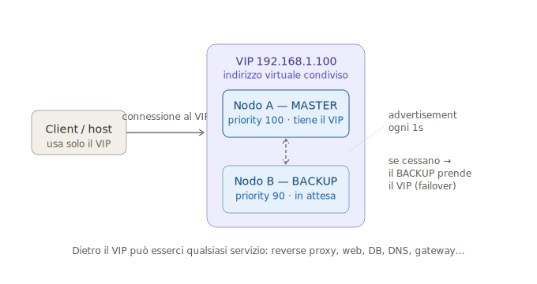

| Nodo | `<STATE>` | `<PRIORITY>` |
|---|---|---|
| Primario | `MASTER` | `100` (più alto = preferito) |
| Secondario | `BACKUP` | `90` |

> `track_script` monitora haproxy: se il processo muore, il nodo abbassa la propria
> `priority` sotto quella del backup e gli cede l'IP virtuale (**failover** automatico).

**Test**
```bash
sudo systemctl status keepalived
ip addr show eth0            ← sul MASTER deve comparire 192.168.1.100
sudo tcpdump -i eth0 vrrp    ← verifica gli advertisement
```
---

## 10.2 IP SLA — failover dual-WAN (Cisco IOS)
> **Def./scopo:** sonda attiva che misura la **raggiungibilità** (e qualità) di un percorso — ICMP/UDP/TCP echo verso un target — e, tramite un `track`, condiziona rotte e azioni. **Scopo: failover automatico del *link* WAN** (la rete, non i dati).

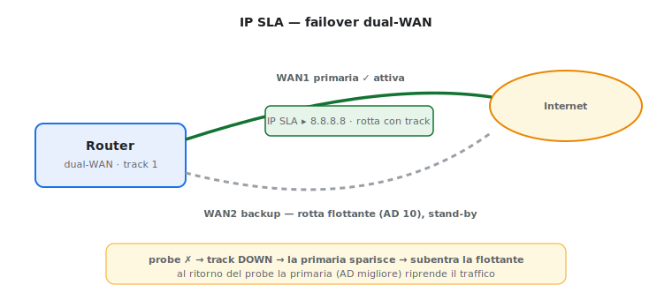

```
ip sla 1
 icmp-echo 8.8.8.8 source-interface GigabitEthernet0/0   ! sonda sul link primario
 frequency 5
ip sla schedule 1 life forever start-time now
track 1 ip sla 1 reachability

ip route 0.0.0.0 0.0.0.0 <gw-primario> track 1           ! attiva SOLO se il track è up
ip route 0.0.0.0 0.0.0.0 <gw-backup> 10                  ! AD 10 = flottante: subentra alla caduta
```

| Elemento | Ruolo |
| -------- | --------------------------------------------------- |
| `ip sla` | invia probe periodici (ICMP/UDP/TCP) verso un target |
| `track`  | lega lo stato della rotta all'esito del probe       |
| AD `10`  | rende **flottante** la rotta di backup              |

> 🔑 Quando il probe fallisce, il `track` va *down* → la rotta primaria sparisce → entra la flottante. **Con dual-WAN + NAT** servono `route-map` per associare il NAT all'interfaccia attiva. **Test:** `show ip sla statistics`, `show track 1`, `show ip route`.

---

## 10.3  HAProxy — ALG, clustering e HA

HAProxy riceve sull'IP virtuale VRRP e smista ai backend.

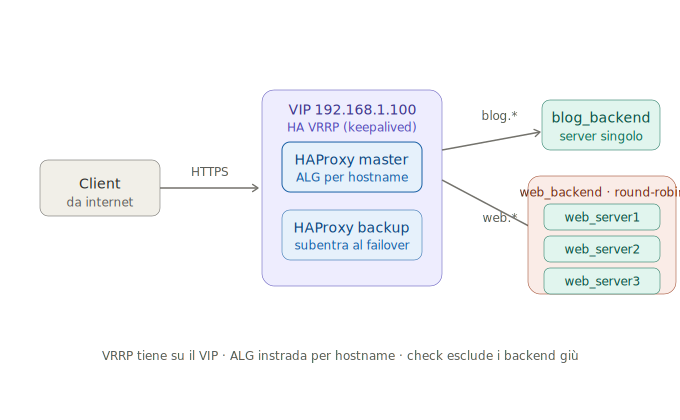

```
defaults
    mode http
    timeout connect 5000
    timeout client  50000
    timeout server  50000

frontend http_front
    bind *:80
    bind *:443 ssl crt /etc/haproxy/cert.pem 
    # SSL termination: il proxy decifra il TLS e parla ai backend in HTTP

    http-request redirect scheme https unless { ssl_fc }            # forza HTTPS a fronte di rchieste HTTP
    http-request add-header X-Forwarded-Proto https if { ssl_fc }   # informa i backend del protocollo HTTPS
    # Impostazione ALG
    acl is_blog hdr_end(host) -i blog.miosito.com   # routing L7 per host (hdr_beg, hdr_end, hdr_sub…) 
    acl is_web  path_beg      -i /web               # routing L7 per path (path_beg, path_end, path_sub, path_reg…)

    use_backend blog_backend if is_blog
    use_backend web_backend  if is_web
    default_backend web_backend                     # fallback: evita i 503

backend blog_backend
    server blog_server1 10.0.0.11:80 check          # ← IP interno, non il nome pubblico

backend web_backend
    # Impostazione CLUSTER
    balance roundrobin
    server web_server1 web1.miosito.com:80 check
    server web_server2 web2.miosito.com:80 check
    server web_server3 web3.miosito.com:80 check
```

> **ALG** — `acl` + `use_backend`: ogni dominio va su un pool diverso (routing L7).
> **Clustering** — `balance roundrobin` (o `leastconn`) distribuisce le richieste.
> **HA backend** — `check` esclude i server che non rispondono.
> **HA del proxy** — garantita da VRRP (§10): se il MASTER cade, il BACKUP prende l'IP virtuale.

**Test**
```bash
sudo haproxy -c -f /etc/haproxy/haproxy.cfg    ← valida la sintassi
sudo systemctl restart haproxy
echo "show stat" | sudo socat stdio /var/run/haproxy/admin.sock
```

---

# 11 · Continuità di servizio dei dischi

## 11.1 RAID — Mirror tra dischi dello stesso nodo

> La copia avviene a livello fisico
> Ridondanza **locale** dei dischi di un nodo: tiene in piedi lo storage al guasto di uno (o due) dischi. **Non è un backup** (non copre cancellazioni, ransomware, doppio guasto oltre soglia) e **non sostituisce** la regola 3-2-1 né DRBD: si **somma** ad essi.

### Scelta del livello

| Livello     | Min dischi | Tollera        | Capacità utile | Uso tipico                                  |
| ----------- | ---------- | -------------- | -------------- | ------------------------------------------- |
| RAID 0      | 2          | nessun guasto  | 100%           | solo prestazioni (scratch) — **mai** dati   |
| RAID 1      | 2          | 1 disco        | 50%            | mirror semplice (boot, piccoli volumi)      |
| RAID 5      | 3          | 1 disco        | (n−1)/n        | parità singola; rebuild lungo su dischi big |
| **RAID 6**  | 4          | **2 dischi**   | (n−2)/n        | **doppia parità** → repository capienti     |
| **RAID 10** | 4          | 1 per coppia   | 50%            | mirror+stripe → **I/O alto** (DB, VM)       |

> 🔑 File grandi e sequenziali (immagini, backup, point cloud) → **RAID 6**. Tante scritture casuali (DB) → **RAID 10**. **Mai RAID 0** per dati.

### mdadm — creazione e gestione (software RAID Linux)

```
# RAID 6: 4 dischi dati + 1 hot spare, chunk 256K per file grandi
mdadm --create /dev/md0 --level=6 --raid-devices=4 --spare-devices=1 --chunk=256 /dev/sd[b-f]
mdadm --grow /dev/md0 --bitmap=internal          # write-intent bitmap → resync rapido dopo crash

# Filesystem allineato allo stripe (ext4): stride=chunk/blocco, stripe-width=stride×dischi-dati
mkfs.ext4 -b 4096 -E stride=64,stripe-width=128 /dev/md0     # 256K/4K=64 ; 64×2(dati)=128

mdadm --detail --scan >> /etc/mdadm/mdadm.conf               # rende persistente l'array
mdadm --monitor --scan --mail admin@host --daemonise         # alert su guasto disco
```

```
# Operazioni tipiche
cat /proc/mdstat                                     # stato rapido dell'array
mdadm --detail /dev/md0                              # livello, dischi, rebuild
mdadm /dev/md0 --fail /dev/sdb --remove /dev/sdb     # disco guasto → poi --add del nuovo
echo check > /sys/block/md0/md/sync_action           # scrubbing on-demand (errori latenti)
```

### Cosa si configura di solito (al netto della "babele" HW/SW)

- **Hot spare**: disco di riserva che subentra **da solo** al guasto (rebuild automatico).
- **Chunk/stripe size**: grande per I/O sequenziale, piccolo per casuale.
- **Write-intent bitmap**: resync rapido dopo crash o rimozione temporanea di un disco.
- **Allineamento FS** (`stride`/`stripe-width`) per non spezzare le scritture sullo stripe.
- **Monitoraggio**: `mdadm --monitor` + **SMART** (`smartd`); **scrubbing** periodico (patrol read).
- **Cache di scrittura** (controller HW): write-back **solo con BBU/flash-backed**, altrimenti write-through.

> 💡 Su **controller RAID hardware** o **ZFS** (`zpool create … raidz2`) i comandi cambiano, ma i concetti — livello, hot spare, stripe, scrubbing, cache+BBU, SMART — sono identici.

---


## 11.2 · DRBD — Mirror tra dischi di nodi diversi nella stessa LAN

> La copia avviene a livello di trasporto in rete e poi a livello di blocco sul disco.
> 
DRBD replica solo il blocco: la promozione del secondario **non è automatica**.
Lo scambio di ruolo automatico è un layer in più (cluster manager).

### Configurazione di base (comune ai due casi)

#### Risorsa — /etc/drbd.d/r0.res
```
resource r0 {
  protocol C;
  on node1 {
    device    /dev/drbd0;
    disk      /dev/sdb1;
    address   192.168.1.1:7789;
    meta-disk internal;
  }
  on node2 {
    device    /dev/drbd0;
    disk      /dev/sdb1;
    address   192.168.1.2:7789;
    meta-disk internal;
  }
}
```
`protocol C` = replica sincrona (default HA).

#### Init (su ENTRAMBI i nodi)
```
node# drbdadm create-md r0
node# drbdadm up r0
```

#### Primo sync (SOLO sul primario)
```
node1# drbdadm primary --force r0
node1# mkfs.ext4 /dev/drbd0
node1# mount /dev/drbd0 /mnt/data
```

### Caso A — Senza failover (promozione manuale)

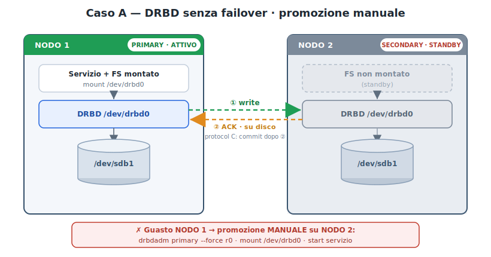

#### A.1 Funzionamento normale
Primario attivo (FS montato + servizio), secondario in standby (FS non montato).
Replica sincrona `protocol C`: la write ritorna OK al client solo dopo l'ACK del secondario.
```
node# drbdadm status r0
node# cat /proc/drbd
```

#### A.2 Guasto del primario — promozione MANUALE
Sul secondario, a mano:
```
node2# drbdadm primary --force r0
node2# mount /dev/drbd0 /mnt/data
node2# systemctl start <servizio>
```
Niente split-brain: decidi tu chi diventa primary.

### Caso B — Con failover automatico (Pacemaker / keepalived)

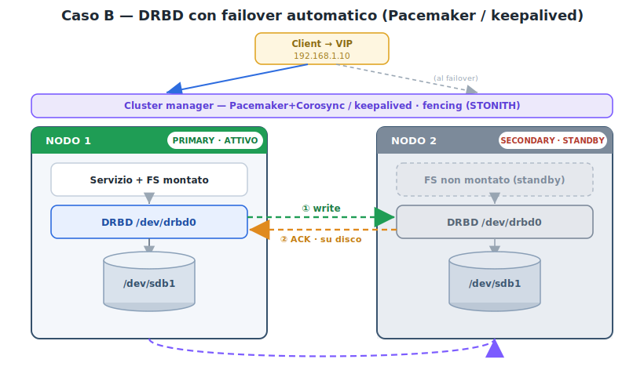

#### B.1 Funzionamento normale
Il cluster manager gestisce 4 risorse + ordering/colocation + STONITH (fencing):
```
node1# pcs resource create drbd ocf:linbit:drbd drbd_resource=r0
node1# pcs resource promotable drbd promoted-max=1
node1# pcs resource create fs Filesystem device=/dev/drbd0 directory=/mnt/data fstype=ext4
node1# pcs resource create vip IPaddr2 ip=192.168.1.10 cidr_netmask=24
! ordine: promuovi drbd → monta fs → avvia servizio → alza vip
```

#### B.2 Guasto del primario — failover AUTOMATICO
Nessun comando manuale: il cluster rileva il guasto → fence del nodo morto → promuove il secondario → monta FS → avvia servizio → sposta la VIP.
```
node# pcs status
node# crm_mon -1
```

> **HA locale vs geografico (la distanza decide sync o async).** La latenza impone il regime di replica, quindi il livello di continuità raggiungibile:
>
> | Regime | Distanza/latenza | Replica | RPO | Cos'è |
> |---|---|---|---|---|
> | **Metro / campus** | bassa (~<10 ms) | **sincrona** (DRBD `protocol C`) | **0** (nessuna perdita) | vero **HA**, failover automatico |
> | **Geografico (WAN)** | alta | **asincrona** (DRBD `protocol A` + DRBD Proxy, replica array, `rsync`) | **> 0** (finestra di dati a rischio) | **Disaster Recovery**, failover orchestrato |
>
> **DRBD sincrono in sede (LAN)** per l'HA dei dati; per il **fuori sede su Internet** si va **asincroni** con **rsync 3-2-1 verso il cloud** (DR, non HA a perdita zero). La scelta si fa su **RPO/RTO** — quanti dati puoi perdere e in quanto tempo devi ripartire.

---

# 12 . Filtraggio con ACL

## 12.1· ACL — premessa e contesto

> Adattato al piano di indirizzamento `10.0.0.0/16` e alle **due politiche di default** in uso:
> - **LAN → default-allow**: si elencano i `deny` (eccezioni) e si chiude con `permit ip any any`.
> - **WAN e tunnel → default-deny**: si elencano i `permit` (servizi ammessi) e si chiude con `deny ip any any` **esplicito**.
> - Convenzione di base: la **riga di default si scrive sempre in chiaro** (anche dove l'implicit deny basterebbe), per renderla visibile e abilitare il contatore di match.
> - Anti-spoofing **silenzioso** sulle LAN (nessun `log`); `log` riservato alla WAN.

Piano di riferimento: A `10.0.1.0/24`, B `10.0.2.0/24`, C `10.0.3.0/24`, D `10.0.4.0/24`, DMZ `10.0.5.0/24`, Server Farm `10.0.6.0/24`. Intranet aggregata: `10.0.0.0 0.0.255.255`. File server `10.0.1.100`, app server `10.0.5.100`, DB `10.0.6.100`, web server `10.0.5.50`.

### Contesto — un solo router, un'ACL inbound per interfaccia

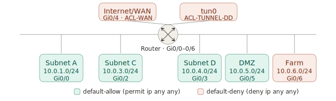

Ogni subnet entra nel router su una porta dedicata; è su quell'interfaccia, in ingresso, che agisce l'ACL. In alto, separate dalle LAN, le due frontiere *default-deny* che riding sulla WAN: la WAN fisica e il tunnel logico. Mappa interfaccia → ACL: `Gi0/0`→`ACL-SUBNET-A-DA`, `Gi0/2`→`ACL-SUBNET-C-DA`, `Gi0/3`→`ACL-SUBNET-D-DA`, `Gi0/5`→`ACL-DMZ-DA`, `Gi0/6`→`ACL-SERVERFARM`, `Gi0/4`→`ACL-WAN`, `tun0`→`ACL-TUNNEL-DD`.

---

## 12.2 · ACL — definizione e tipi

Una **ACL** è una lista ordinata di **ACE**. Il router le esamina in sequenza: alla prima
corrispondenza esegue l'azione e si ferma. Se nessuna corrisponde → **deny all** implicito.

| Tipo | Range | Filtra per | Posizionamento |
|------|-------|------------|----------------|
| Standard | 1–99, 1300–1999 | solo **sorgente IP** | vicino alla **destinazione** |
| Estesa | 100–199, 2000–2699 | sorgente, dest, protocollo, porta, flag TCP | vicino alla **sorgente** |
| Standard con nome | `ip access-list standard NOME` | solo sorgente IP | vicino alla destinazione |
| Estesa con nome | `ip access-list extended NOME` | tutto | vicino alla sorgente |

> Standard vicino alla **destinazione** (filtra solo per sorgente, altrimenti bloccherebbe tutto
> il traffico dell'host). Estesa vicino alla **sorgente** (scarta subito, evita transiti inutili).
> Nella dispensa usiamo **sempre estese con nome, applicate inbound** sull'interfaccia della subnet.

#### Sintassi base (con prompt di modalità)
```cisco
Router> enable                                            ! da user EXEC a privileged EXEC
Router# configure terminal                                ! da privileged EXEC a global config
Router(config)# access-list 1-99    {permit|deny} <sorgente> <wildcard>                          ! standard (numerata)
Router(config)# access-list 100-199 {permit|deny} <proto> <src> <wild> <dst> <wild> [eq <porta>] ! estesa (numerata)
Router(config)# ip access-list {standard|extended} NOME   ! con nome → entra in (config-std-nacl)/(config-ext-nacl)
Router(config-ext-nacl)# {permit|deny} ...                ! qui si scrivono le ACE della lista con nome
Router(config-ext-nacl)# exit
Router(config)# interface <X>
Router(config-if)# ip access-group <numero|NOME> {in|out}
```

> `in` = pacchetti **entranti** sull'interfaccia (è la direzione che usiamo in tutta la dispensa).
> `out` = pacchetti **uscenti** dall'interfaccia (non filtra il traffico generato dal router stesso).

#### La riga di default (politica di default quando nulla matcha)
```cisco
! LAN — default-allow
Router(config-ext-nacl)# ...                 ! (deny delle eccezioni)
Router(config-ext-nacl)# permit ip any any   ! neutralizza l'implicit deny → "tutto permesso se non negato"

! WAN / tunnel — default-deny
Router(config-ext-nacl)# ...                 ! (permit dei servizi ammessi)
Router(config-ext-nacl)# deny ip any any     ! esplicito, anche se ridondante con l'implicit deny
```

**Test** (da privileged EXEC)
```cisco
Router# show access-lists
Router# show ip interface <X>          ! quale ACL è applicata e in che direzione
Router# show ip access-lists NOME      ! contatori per ACE (0 match su un permit = regola mai usata)
```

---

## 12.3 Matrice degli accessi + ACL per interfaccia (modello)

**Matrice degli accessi** (✓ = ammesso con le porte indicate · ✗ = negato · — = nessun flusso):

| Sorgente ↓ \ Dest → | Server farm | DMZ | Mgmt | Internet |
| ------------------- | ----------- | --- | ---- | -------- |
| **LAN utenti**      | solo servizi necessari | ✗ | ✗ | HTTP/S |
| **Server farm**     | intra + DB (dall'app) | ✗ | ✗ | update HTTPS |
| **DMZ**             | solo flussi sanciti | — | ✗ | ✗ |
| **VPN `tun0`** (come WAN) | solo RADIUS (1812) | solo servizi pubblicati (HTTPS/SFTP/MQTT) | ✗ | — |
| **WAN / Internet**  | ✗ | servizi pubblicati | ✗ | — |
| **Mgmt**            | SSH | SSH | — | ✗ |

**Convenzione (sempre la stessa):**

| Zona / interfaccia | Default | In più |
| ------------------ | ------- | ------ |
| LAN fidata | **default-allow** | anti-spoofing (deny verso le altre subnet) |
| Server farm / DMZ / WAN / **`tun0`** (VPN) | **default-deny + log** | anti-spoofing + **solo** i servizi specifici della matrice |
| (tutte) | — | una ACL **estesa con nome, inbound** per interfaccia · **mai `out`** |

> 🔑 I **ritorni** ai confini default-deny li apre l'ispezione **stateful** (CBAC o ZBF): nelle liste si scrive solo il traffico **iniziato**.

**Scheletro di una ACL (la regola di default chiude sempre la lista):**
```
ip access-list extended ACL-<ZONA>
 permit <proto> <sorgente> host <server> eq <porta>     ! flussi ammessi (dalla matrice)
 permit <proto> <sorgente> host <server> eq <porta>
 deny   ip  <sorgente> 10.0.0.0 0.0.255.255             ! (LAN) blocca il resto dell'intranet
 permit ip  <sorgente> any                              ! ← DEFAULT ALLOW   (solo nelle LAN)
! —— oppure, ai confini: ——
 deny   ip  any any log                                 ! ← DEFAULT DENY    (server/DMZ/WAN/VPN)
interface <Vlan/Gi/Tunnel>
 ip access-group ACL-<ZONA> in
```
> 💡 Procedura: (1) compila la matrice; (2) una riga `permit` per ogni ✓; (3) chiudi con la **regola di default** giusta; (4) applica **inbound**; (5) aggiungi CBAC/ZBF per i ritorni.

**Esempio — interfaccia `tun0` trattata come WAN (default-deny, solo servizi specifici):**
```
# netfilter/iptables: confine non fidato → default-deny + soli servizi pubblicati
iptables -A FORWARD -i tun0 ! -s <reti-remote-attese> -j DROP        # anti-spoofing
iptables -A FORWARD -i tun0 -p tcp -d <repository> --dport 443  -j ACCEPT   # HTTPS
iptables -A FORWARD -i tun0 -p tcp -d <repository> --dport 22   -j ACCEPT   # SFTP
iptables -A FORWARD -i tun0 -p tcp -d <mqtt-front> --dport 8883 -j ACCEPT   # MQTT
iptables -A FORWARD -i tun0 -p udp -d <radius> --dport 1812     -j ACCEPT   # auth
iptables -A FORWARD -m state --state ESTABLISHED,RELATED -j ACCEPT          # ritorni (stateful)
iptables -A FORWARD -i tun0 -j DROP                                         # ← DEFAULT DENY
```
> Equivalente Cisco: ACL estesa **inbound** su `interface TunnelN` con gli stessi `permit` + `deny ip any any log`, e CBAC/ZBF per i ritorni. 🔑 `tun0` (OpenVPN/TUN, L3) si tratta **come la WAN**: non è fidata solo perché è una VPN.

**Lo stesso in Cisco IOS con CBAC** (`Tunnel0` trattata come WAN):
```
! Definizione della regola di ispezione CBAC-TUN → apre i ritorni delle sessioni in arrivo dalla VPN
ip inspect name CBAC-TUN tcp
ip inspect name CBAC-TUN udp

! ACL inbound: solo i servizi specifici, poi default-deny
ip access-list extended ACL-TUN0
 permit tcp <reti-remote> host <repository> eq 443     ! HTTPS (source-scoped = anti-spoofing)
 permit tcp <reti-remote> host <repository> eq 22      ! SFTP
 permit tcp <reti-remote> host <mqtt-front> eq 8883    ! MQTT
 permit udp <reti-remote> host <radius> eq 1812        ! auth
 deny   ip  any any log                                ! ← DEFAULT DENY (scarta anche gli spoof)

interface Tunnel0
 ip access-group ACL-TUN0 in      ! filtro inbound (mai out)
 ip inspect CBAC-TUN in           ! stato: ritorni aperti dinamicamente
```
> 🔑 I `permit` con **sorgente** ristretta alle reti remote attese fanno da **anti-spoofing** (il `deny ip any any` finale scarta tutto il resto). `ip inspect … in` è la *direzione d'ispezione*, **non** un'ACL `out`. `tun0`/`Tunnel0` (OpenVPN/TUN, L3) si tratta **come la WAN**: non è fidata solo perché è una VPN. **Test:** `show ip inspect sessions`, `show ip access-lists ACL-TUN0`.


## 12.4 · ACL firewall — scenari tipici

### **12.4.1 — Whitelist a un solo host (standard) · default-DENY esplicito.** Caso "isola chiusa" come la Subnet B: si enumera ciò che passa, il resto cade.

```cisco
Router(config)# access-list 1 permit host 10.0.3.10
Router(config)# access-list 1 deny   any                 ! ← default deny esplicito (riga non necessaria nei router CISCO)
Router(config)# interface GigabitEthernet0/2
Router(config-if)# ip access-group 1 in
```

### **12.4.2 — Negare un host e permettere il resto (standard) · default-ALLOW.**

```cisco
Router(config)# access-list 10 deny   host 10.0.1.66
Router(config)# access-list 10 permit any                ! ← default allow esplicito
Router(config)# interface GigabitEthernet0/0
Router(config-if)# ip access-group 10 in
```

### **12.4.3 — Flusso singolo subnet → host (estesa) · default-DENY esplicito.** Es. Subnet B può raggiungere solo il file server.

```cisco
Router(config)# ip access-list extended ACL-B-WHITELIST
Router(config-ext-nacl)# permit ip 10.0.2.0 0.0.0.255 host 10.0.1.100
Router(config-ext-nacl)# deny   ip any any               ! ← default deny esplicito (riga non necessaria nei router CISCO)
Router(config-ext-nacl)# exit
Router(config)# interface GigabitEthernet0/1
Router(config-if)# ip access-group ACL-B-WHITELIST in
```

### **12.4.4 — Negare Telnet (23) e permettere il resto · default-ALLOW.**

```cisco
Router(config)# ip access-list extended ACL-NO-TELNET
Router(config-ext-nacl)# deny   tcp any any eq 23
Router(config-ext-nacl)# permit ip  any any              ! ← default allow esplicito
Router(config-ext-nacl)# exit
Router(config)# interface GigabitEthernet0/0
Router(config-if)# ip access-group ACL-NO-TELNET in
```

**12.4.5 — Permettere solo DNS (53) verso il resolver · default-DENY esplicito.**

```cisco
Router(config)# ip access-list extended ACL-SOLO-DNS
Router(config-ext-nacl)# permit udp any host 10.0.6.53 eq domain
Router(config-ext-nacl)# permit tcp any host 10.0.6.53 eq domain
Router(config-ext-nacl)# deny   ip  any any              ! ← default deny esplicito (riga non necessaria nei router CISCO)
Router(config-ext-nacl)# exit
Router(config)# interface GigabitEthernet0/3
Router(config-if)# ip access-group ACL-SOLO-DNS in
```

**12.4.6 — Connessioni monodirezionali con `established` (stateless) · default-DENY esplicito.**

```cisco
Router(config)# ip access-list extended ACL-RITORNO
Router(config-ext-nacl)# permit tcp any any gt 1023 established
Router(config-ext-nacl)# deny   ip  any any              ! ← default deny esplicito (riga non necessaria nei router CISCO)
Router(config-ext-nacl)# exit
Router(config)# interface GigabitEthernet0/4
Router(config-if)# ip access-group ACL-RITORNO in
```

> `established` seleziona i pacchetti con flag ACK/RST (esclude i SYN puri). È **stateless**:
> un attaccante può falsificare i flag → preferire le ACL stateful: CBAC (§15) o ZBF (§16).

---

## 12.5 · ACL stateful

* Definizione: È un filtro che tiene traccia del contesto e dello stato delle connessioni di rete.
* Funzionamento: Memorizza le sessioni avviate dall'interno e approva automaticamente il traffico di ritorno, senza bisogno di configurare regole manuali in ingresso.
* Tecnologie Cisco: Si implementa principalmente tramite Reflexive ACL, CBAC o Zone-Based Policy Firewalls.
* Scopo: Blocca i tentativi di accesso non autorizzati dall'esterno, garantendo al contempo una navigazione sicura per gli utenti interni.

### 12.5.1 · ACL stateful con CBAC (Context-Based Access Control)

> Versione moderna che **sostituisce le ACL riflessive**. CBAC (`ip inspect`, a volte chiamato *Classic / legacy IOS Firewall*) ispeziona le sessioni in uscita e **apre da solo i ritorni**, tenendo una vera tabella di stato. Capisce i protocolli a livello applicativo (FTP, SIP, RTSP, TFTP…), che aprono porte dinamiche. 

```cisco
! Passo 1 — regola di ispezione: quali protocolli tracciare in uscita
Router> enable
Router# configure terminal
Router(config)# ip inspect name CBAC-OUT tcp        ! copre TUTTO il TCP (HTTP, HTTPS, SSH...) in un colpo
Router(config)# ip inspect name CBAC-OUT udp        ! copre l'UDP (DNS, NTP...)
Router(config)# ip inspect name CBAC-OUT icmp       ! ping/traceroute di ritorno
! granulare per gli ALG che aprono porte dinamiche:
! Router(config)# ip inspect name CBAC-OUT ftp

! Passo 2 — ACL esterna (entrante): default-DENY esplicito, nessun permit di ritorno scritto a mano
Router(config)# ip access-list extended ACL_INTERFACCIA
Router(config-ext-nacl)# deny ip any any log         ! ← CBAC inserisce i ritorni dinamicamente SOPRA questa riga
Router(config-ext-nacl)# exit

! Passo 3 — applica sull'interfaccia verso la WAN
Router(config)# interface s0/0/0
Router(config-if)# ip access-group ACL_INTERFACCIA in    ! blocca tutto l'ingresso non sollecitato
Router(config-if)# ip inspect CBAC-OUT out           ! ispeziona le sessioni uscenti e apre i ritorni
```

> Sul lato LAN si tiene la solita ACL inbound **default-allow** (Parte C): qui **non serve più** la lista interna con i `reflect`. La differenza pratica con le ACL riflessive classiche è tutta lì: **una ACL invece di due**, e nessuna ACE inversa da gestire.


### 12.5.2 · ACL stateful con ZBF (Zone-Based Firewall)

> Il gradino **più moderno**, quello che Cisco raccomanda per i progetti nuovi. Stesse capacità stateful del CBAC (§15), ma organizzate per **zone** e **zone-pair** invece che per interfaccia. Il grande vantaggio concettuale: il **default-deny è strutturale**, non una riga da ricordare — due interfacce in zone diverse non si parlano *finché non lo dici esplicitamente* con una zone-pair.

**Tre regole di default del modello a zone** (da sapere a memoria):
1. Interfacce nella **stessa zona** → traffico **permesso** (nessuna policy serve).
2. Interfacce in **zone diverse senza zone-pair** → traffico **scartato** (è il default-deny "gratis").
3. Traffico **da/verso il router stesso** → usa la zona speciale `self`, permesso di default (limitabile con zone-pair su `self`: utile per SSH di gestione, OSPF…).

La zone-pair è **unidirezionale**: definisci `INSIDE → OUTSIDE` con `inspect` e i ritorni sono automatici (stateful); `OUTSIDE → INSIDE` non esiste → l'ingresso non sollecitato cade da solo. **Non serve nessuna ACL inbound.**

```cisco
! Passo 1 — definisci le zone
Router> enable
Router# configure terminal
Router(config)# zone security INSIDE
Router(config-sec-zone)# exit
Router(config)# zone security OUTSIDE
Router(config-sec-zone)# exit

! Passo 2 — class-map: QUALE traffico è "interessante" da ispezionare
Router(config)# class-map type inspect match-any CM-OUT
Router(config-cmap)# match protocol tcp           ! tutto il TCP in un colpo
Router(config-cmap)# match protocol udp
Router(config-cmap)# match protocol icmp
Router(config-cmap)# exit

! Passo 3 — policy-map: COSA farne → inspect (stateful), il resto drop
Router(config)# policy-map type inspect PM-IN-OUT
Router(config-pmap)# class type inspect CM-OUT
Router(config-pmap-c)# inspect                     ! traccia la sessione e apre il ritorno
Router(config-pmap-c)# exit
Router(config-pmap)# class class-default
Router(config-pmap-c)# drop log                    ! ← default-deny ESPLICITO 
Router(config-pmap-c)# exit
Router(config-pmap)# exit

! Passo 4 — zone-pair: DA dove A dove applicare la policy (unidirezionale)
Router(config)# zone-pair security ZP-IN-OUT source INSIDE destination OUTSIDE
Router(config-sec-zone-pair)# service-policy type inspect PM-IN-OUT
Router(config-sec-zone-pair)# exit

! Passo 5 — assegna le interfacce alle zone
Router(config)# interface GigabitEthernet0/0       ! LAN
Router(config-if)# zone-member security INSIDE
Router(config-if)# exit
Router(config)# interface Serial0/0/0              ! WAN
Router(config-if)# zone-member security OUTSIDE
Router(config-if)# exit
```

> **Il ritorno e il default-deny sono entrambi impliciti nel modello.** I ritorni delle sessioni `INSIDE→OUTSIDE` sono ammessi dall'`inspect`; l'ingresso non richiesto `OUTSIDE→INSIDE` cade perché **quella zone-pair non esiste**. Il `class-default → drop log` rende comunque visibile e contato ciò che la policy scarta, coerente con la regola di casa della dispensa.

### Estensione a tre zone (DMZ con servizio esposto)

Per esporre un server (es. HTTPS in DMZ) si aggiunge una **terza zona** e una zone-pair `OUTSIDE → DMZ` che ispeziona solo quel servizio:

```cisco
Router(config)# class-map type inspect match-any CM-WEB
Router(config-cmap)# match protocol https
Router(config-cmap)# exit
Router(config)# policy-map type inspect PM-OUT-DMZ
Router(config-pmap)# class type inspect CM-WEB
Router(config-pmap-c)# inspect
Router(config-pmap-c)# exit
Router(config-pmap)# class class-default
Router(config-pmap-c)# drop log
Router(config-pmap-c)# exit
Router(config-pmap)# exit
Router(config)# zone-pair security ZP-OUT-DMZ source OUTSIDE destination DMZ
Router(config-sec-zone-pair)# service-policy type inspect PM-OUT-DMZ
```

> È lo stesso ruolo dei `permit` selettivi prima del `deny ip any any` in §17.1, ma qui ogni flusso vive nella **sua** zone-pair: l'apertura verso la DMZ non tocca minimamente la regola `INSIDE↔OUTSIDE`.

**Test** (da privileged EXEC)
```cisco
Router# show zone security                              ! zone e interfacce membre
Router# show zone-pair security                         ! quali coppie hanno una policy
Router# show policy-map type inspect zone-pair          ! contatori per classe (inspect vs drop)
Router# show policy-map type inspect zone-pair sessions ! sessioni stateful attive
```

> Quando usare quale: **CBAC** se vuoi il minimo indispensabile su un router con due interfacce e ti basta il drop-in delle riflessive; **ZBF** appena le zone diventano tre o più (LAN/DMZ/WAN, o più VLAN), perché il default-deny per zona evita di rincorrere `deny` espliciti su ogni lista.

---

## 12.6 · ACL anti-spoofing — WAN e LAN 

### 12.6.1 WAN in ingresso — **default-deny** (= Caso 5)

```cisco
! Blocca le sorgenti impossibili (con log), poi nega tutto il resto.
Router(config)# ip access-list extended ACL-WAN
Router(config-ext-nacl)# deny   ip host 0.0.0.0       any              log   ! default gateway
Router(config-ext-nacl)# deny   ip 127.0.0.0   0.255.255.255  any      log   ! loopback
Router(config-ext-nacl)# deny   ip 10.0.0.0    0.255.255.255  any      log   ! RFC1918 A
Router(config-ext-nacl)# deny   ip 172.16.0.0  0.15.255.255   any      log   ! RFC1918 B
Router(config-ext-nacl)# deny   ip 192.168.0.0 0.0.255.255    any      log   ! RFC1918 C
Router(config-ext-nacl)# deny   ip 224.0.0.0   15.255.255.255 any      log   ! multicast sorgente
Router(config-ext-nacl)# deny   ip any any                                   ! ← DEFAULT DENY
Router(config-ext-nacl)# exit
Router(config)# interface GigabitEthernet0/4                                 ! WAN (outside)
Router(config-if)# ip access-group ACL-WAN in
```

> Se si espongono servizi in DMZ (Caso 5b), i `permit` selettivi (es. `permit tcp any host 10.0.5.50 eq 443`)
> vanno inseriti **prima** del `deny ip any any` finale. La WAN resta comunque default-deny.

### 12.6.2 LAN in ingresso — **default-allow** con anti-spoofing silenzioso (= Parte C)

Sul nostro piano `10.0.0.0/16` non si può negare `10.0.0.0/8` in blocco (bloccherebbe la LAN stessa).
La logica è inversa: **permetto prima la subnet locale**, poi nego il resto dell'intranet, poi default-allow.

```cisco
! Esempio su Gi0/0 (Subnet A, 10.0.1.0/24)
Router(config)# ip access-list extended ACL-SUBNET-A-DA
Router(config-ext-nacl)# permit ip 10.0.1.0 0.0.0.255  any    ! sorgente locale legittima → esce
Router(config-ext-nacl)# deny   ip 10.0.0.0 0.0.255.255 any   ! anti-spoofing: ogni altra sorgente interna = spoof (silenzioso)
Router(config-ext-nacl)# permit ip any any                    ! ← DEFAULT ALLOW
Router(config-ext-nacl)# exit
Router(config)# interface GigabitEthernet0/0                  ! LAN (inside)
Router(config-if)# ip access-group ACL-SUBNET-A-DA in
```

> 🔑 **L'ordine conta.** Il `permit` della subnet locale deve precedere il `deny 10.0.0.0/16`:
> quel deny copre tutta l'intranet (subnet locale inclusa), quindi senza il permit a monte
> scarterebbe anche il traffico buono. Una sola riga di anti-spoofing basta — non serve elencare
> le subnet sorelle. La protezione è silenziosa, ma il contatore resta visibile:
> `show ip access-lists ACL-SUBNET-A-DA`.

Regola pratica: **default-deny ovunque ci sia un confine di fiducia** (WAN, tunnel, whitelist, accesso al DB);
**default-allow solo dentro una zona già fidata** dove le eccezioni sono poche e serve fluidità.

---


# 13 · Tunnel VPN — L3-su-L3 e L2-su-L3

## 13.1 Anatomia comune (vale per TUTTI i tunnel)

Un tunnel è un **link punto-punto virtuale** su rete pubblica. Tre regole valgono **sempre**:

1. **Si configura su entrambi i capi**, con `source` e `destination` **invertiti**.
2. **Un identificatore deve coincidere** ai due lati:

   | Tecnologia | Identificatore che deve combaciare |
   |---|---|
   | GRE / GRETAP | la coppia `source`↔`destination` (IP pubblici) |
   | L2TPv3 | il **VC-ID** |
   | OpenVPN | i **certificati** + `tls-server`/`tls-client` |

3. **Più sedi → un'interfaccia per sede.** Non duplicare i blocchi: usa **template + tabella** (§18.2).

**Quale tunnel?** Due domande: *(1) cosa trasporto* (IP=L3 o frame Ethernet=L2)? *(2) quale piattaforma?*

| Trasporto | Cisco IOS | Linux |
|---|---|---|
| **Pacchetti IP** (L3 su L3) | **GRE** | GRE / WireGuard |
| **Frame Ethernet** (L2 su L3) | **L2TPv3** | **GRETAP** / OpenVPN TAP |

| | **L3 su L3** (GRE) | **L2 su L3** (L2TPv3/GRETAP/TAP) |
|---|---|---|
| Trasporta | pacchetti IP | frame Ethernet completi |
| VLAN 802.1q | non trasparente | **trasparente** |
| Broadcast/ARP | non propagati | propagati come su cavo |
| Subnet tra sedi | **diverse** (OSPF propaga) | **identiche** (la VLAN si estende) |
| Bridge richiesto | no | sì (tunnel ↔ `eth0`) |
| Caso d'uso | collegare reti IP distinte | estendere lo stesso dominio L2 |

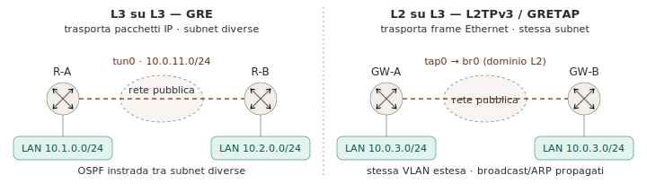

> Nomenclatura Linux TUN/TAP: **`tun0`** = L3 (instradato, subnet diverse) · **`tap0`** = L2 (bridgeato in `br0`, stessa VLAN). Su Cisco IOS gli equivalenti sono `Tunnel0` (GRE) e l'`xconnect` L2TPv3.

## 13.2 L3-su-L3 — GRE (Cisco IOS)

```cisco
! Template (un capo — l'altro è speculare, §18.1)
R0(config)# interface TunnelN
R0(config-if)# ip address <IP-TUNNEL> 255.255.255.0
R0(config-if)# tunnel source <IP-PUB-LOCALE>
R0(config-if)# tunnel destination <IP-PUB-PEER>
R0(config-if)# tunnel mode gre ip
R0(config-if)# ip ospf network point-to-point        ! evita elezione DR/BDR sul tunnel
R0(config-if)# ip ospf 100 area 0
R0(config-if)# no shutdown
```

Parametri per sede (centrale R0 — IP pubblico 198.64.5.1):

| Interfaccia | IP tunnel | `tunnel destination` |
|---|---|---|
| `Tunnel0` | `10.0.11.2/24` | `39.68.34.121` (R1) |
| `Tunnel1` | `10.0.12.2/24` | `39.68.34.122` (R2) |
| `Tunnel2` | `10.0.13.2/24` | `39.68.34.123` (R3) |

```cisco
! ACL WAN — far passare GRE (protocollo IP 47) e OSPF
R0(config)# ip access-list extended ALLOW_GRE
R0(config-ext-nacl)# permit gre  any any
R0(config-ext-nacl)# permit ospf any any
R0(config-ext-nacl)# permit ip   any any        ! restringere in produzione
R0(config-ext-nacl)# exit
R0(config)# interface GigabitEthernet0/0
R0(config-if)# ip access-group ALLOW_GRE in
```

**Test** (da privileged EXEC)
```cisco
R0# show ip ospf neighbor               ! peer FULL
R0# ping 10.0.11.1 source 10.0.11.2     ! connettività end-to-end
```

## 13.3 L2-su-L3 — L2TPv3 (Cisco IOS, nativo)

Crea un **pseudowire** che trasporta i frame Ethernet (trunk 802.1q incluso) senza bridge software.

```cisco
! Template (un capo — l'altro speculare, stesso VC-ID)
R0(config)# pseudowire-class PW-PEER
R0(config-pw-class)# encapsulation l2tpv3
R0(config-pw-class)# protocol none
R0(config-pw-class)# ip local interface GigabitEthernet0/1     ! IP pubblico locale
R0(config-pw-class)# exit
R0(config)# interface GigabitEthernet0/0               ! trunk verso switch
R0(config-if)# no ip address                           ! cavo L2 virtuale
R0(config-if)# xconnect <IP-PUB-PEER> 100 pw-class PW-PEER
```

> `VC-ID` (qui **100**) identico ai due lati. Più sedi → più pseudowire (VC-ID 100,101,102…).
> Per un unico dominio L2 tra molte sedi → **VPLS**.

**Test** (da privileged EXEC): `R0# show l2tun session all` · `R0# show xconnect all` · `R0# show mac address-table`

## 13.4 L2-su-L3 — variante Linux (GRETAP / OpenVPN TAP)

Il **bridge è identico** per le due tecnologie: cambia **solo l'interfaccia tunnel**. I comandi girano sul gateway Linux come root.

```bash
# Bridge L2 (comune — una volta sola)
root@gw:~# ip link add name br0 type bridge && ip link set br0 up
root@gw:~# ip link set tap0 master br0              # tap0: OpenVPN TAP o GRETAP (vedi sotto)
root@gw:~# ip link set eth0 master br0              # trunk verso switch — NO ip su eth0
root@gw:~# ip addr add 10.0.3.254/24 dev br0
root@gw:~# iptables -t nat -A POSTROUTING -o eth1 -j MASQUERADE   # SNAT su eth1 (WAN), MAI sul bridge
```

```bash
# Creazione interfaccia tunnel — SOLO questo cambia
# Opzione 1 — GRETAP (no cifratura: link fidati o sopra IPsec)
root@gw:~# ip link add tap0 type gretap local <IP-PUB-LOCALE> remote <IP-PUB-PEER>   # tipo gretap, nome tap0
root@gw:~# ip link set tap0 up
# Opzione 2 — OpenVPN TAP (TLS nativa): dev tap0 in server.conf/client.conf
```

| | GRETAP | OpenVPN TAP |
|---|---|---|
| Cifratura | nessuna (serve IPsec) | TLS nativa |
| Disponibilità | solo Linux | multipiattaforma |
| Config | 2 comandi `ip link` | file `.conf` + certificati |

**Test** (sul gateway Linux): `root@gw:~# ip -d link show <iface>` · `root@gw:~# bridge link` · `root@gw:~# arping -I br0 <IP-remoto>`

---

## 13.5 IPsec-su-GRE — cifratura del tunnel (Cisco IOS, IKEv2)

```
! 1) IKEv2 — fase 1 (autenticazione + scambio chiavi)
crypto ikev2 proposal P1
 encryption aes-cbc-256
 integrity  sha256
 group 14
crypto ikev2 policy POL
 proposal P1
crypto ikev2 keyring KR
 peer PEER
  address <IP-PUB-PEER>
  pre-shared-key <chiave>
crypto ikev2 profile PROF
 match identity remote address <IP-PUB-PEER> 255.255.255.255
 authentication remote pre-share
 authentication local  pre-share
 keyring local KR

! 2) IPsec — fase 2 (protezione dei dati)
crypto ipsec transform-set TS esp-aes 256 esp-sha256-hmac
 mode transport
crypto ipsec profile IPROF
 set transform-set TS
 set ikev2-profile PROF

! 3) Applica al tunnel GRE (l'altro capo è speculare)
interface Tunnel1
 tunnel protection ipsec profile IPROF
```

| Deve combaciare ai due capi | … |
| --------------------------- | -------------------------------------- |
| `pre-shared-key`            | la stessa chiave                       |
| `transform-set`             | stessi algoritmi (AES-256 / SHA-256)   |
| IKEv2 `proposal`            | encryption / integrity / group         |

```
! ACL WAN: oltre a gre/ospf far passare l'IPsec
 permit udp host <IP-PUB-PEER> any eq isakmp
 permit udp host <IP-PUB-PEER> any eq non500-isakmp
 permit esp host <IP-PUB-PEER> any
```
> 🔑 `mode transport` perché c'è già il GRE; **`tunnel mode`** se è IPsec puro senza GRE. Anti-replay attivo di default: `crypto ipsec security-association replay window-size 1024`. **Test:** `show crypto ikev2 sa`, `show crypto ipsec sa`.

---

# 14 · 802.1X — autenticazione sulle porte access

802.1X blocca la porta switch (`unauthorized`) finché l'utente non si autentica via RADIUS.

| Fase | Dove | Cosa |
|------|------|------|
| 1 | Switch | abilita AAA e 802.1X globalmente |
| 2 | Switch | configura il server RADIUS |
| 3 | Switch | `dot1x port-control auto` su ogni porta access |
| 4 | RADIUS | client (lo switch) + utenti |

```cisco
! Switch — globale e RADIUS
Switch(config)# aaa new-model
Switch(config)# aaa authentication dot1x default group radius local
Switch(config)# dot1x system-auth-control
Switch(config)# radius-server host 192.168.1.100 auth-port 1812 acct-port 1813 key <chiave>
Switch(config)# username admin secret <password>          ! fallback se RADIUS irraggiungibile
```

```cisco
! Switch — porte access
Switch(config)# interface range fa0/1-48
Switch(config-if-range)# switchport mode access
Switch(config-if-range)# switchport access vlan 10
Switch(config-if-range)# dot1x port-control auto                  ! auto | force-authorized | force-unauthorized
Switch(config-if-range)# spanning-tree portfast
```

```
# FreeRADIUS — clients.conf (contenuto di file, non CLI)
client 192.168.1.0/24 {
    secret    = <chiave>                  # IDENTICA al "key" sullo switch
    shortname = switch-lab
}
# users
mario  Cleartext-Password := "password123"
```

> La `secret` di `clients.conf` **deve coincidere** con `key` del comando `radius-server host`:
> un mismatch fa fallire silenziosamente tutte le autenticazioni.

## 14.1 Assegnazione dinamica della VLAN via RADIUS

Nell'`Access-Accept` il RADIUS può dire al NAS **in quale VLAN** mettere l'utente (RFC 2868):

```
# attributi RADIUS (contenuto di file, non CLI)
Tunnel-Type             = VLAN
Tunnel-Medium-Type      = IEEE-802
Tunnel-Private-Group-Id = "10"            # VLAN ID di destinazione
```

Si può **unificare l'SSID** e smistare ogni utente nella VLAN giusta in base al gruppo LDAP:

```
# FreeRADIUS — policy per gruppo LDAP (contenuto di file, non CLI)
DEFAULT Ldap-Group == "cn=tecnici,ou=staff,dc=sito,dc=it"
        Tunnel-Type = VLAN, Tunnel-Medium-Type = IEEE-802, Tunnel-Private-Group-Id = "10"
DEFAULT Ldap-Group == "cn=infopoint,ou=staff,dc=sito,dc=it"
        Tunnel-Type = VLAN, Tunnel-Medium-Type = IEEE-802, Tunnel-Private-Group-Id = "40"
DEFAULT Auth-Type := Reject
```

> Aggiungere un tecnico = creare l'utenza in LDAP nel gruppo giusto, senza toccare AP né switch.
> Stesso meccanismo per confinare un profilo sospeso in una **VLAN di quarantena**.

**Test**: `Switch# show dot1x all` · `Switch# show dot1x interface fa0/1` · `root@radius:~# tail -f /var/log/freeradius/radius.log`

### 14.1.1 · Test end-to-end — comandi utili (da privileged EXEC)

```cisco
R0# ping <ip>
R0# ping <ip> source <ip-sorgente>
R0# traceroute <ip>
R0# show ip route
R0# show ip route ospf
R0# show ip route 192.168.1.0
R0# show ip interface brief
R0# show interfaces GigabitEthernet0/0
R0# show running-config | section ospf
R0# show running-config | section nat
```

> `traceroute` mostra il percorso hop-by-hop: utile per capire quale router smista tra VLAN o aree OSPF.

---

## 14.2 hostapd — Wi-Fi WPA3 + Client Isolation (Linux AP)

```
# /etc/hostapd/hostapd.conf
interface=wlan0
ssid=Cantiere
wpa=2
wpa_key_mgmt=SAE            # WPA3-Personal (SAE). Enterprise: WPA-EAP-SHA256
rsn_pairwise=CCMP
ieee80211w=2               # PMF (Protected Management Frames): OBBLIGATORIO in WPA3
sae_password=<password>
ap_isolate=1              # Client Isolation: i client NON si parlano tra loro

# Variante Enterprise (802.1X → RADIUS, vedi §19):
# ieee8021x=1
# auth_server_addr=10.0.30.30
# auth_server_port=1812
# auth_server_shared_secret=<chiave>
```
> 🔑 `ap_isolate=1` blocca il **movimento laterale** tra dispositivi wireless. Su WLC/AP Cisco l'equivalente è **P2P Blocking Action = Drop**. **Test:** `systemctl status hostapd`, `iw dev wlan0 station dump`.

---

# 15 · Backup & Ripristino

> Backup/restore di **dati** e **VM** con `rsync`, **NFS** e **Samba**.

## 15.1 · Concetti chiave

| Termine | Significato |
|---|---|
| **NAS** | Disco di storage + disco di servizio (SO + AAA) che condivide cartelle in rete |
| **Disaster recovery** | Ripristino di **dati** dopo compromissione (guasto, ransomware) |
| **Service recovery** | Ripristino di **servizi/VM** sostituendo la copia infetta con l'ultima sana |
| **Snapshot** | Punto di ripristino datato; salva solo le **differenze** (versioning) |
| **Backup incrementale** | Copia solo ciò che è cambiato → veloce (`rsync`, `rclone`) |

### PULL vs PUSH — chi prende l'iniziativa?

| | **PULL** 🔽 | **PUSH** 🔼 |
|---|---|---|
| **Iniziativa** | Il **NAS** preleva dal server | Il **server** spinge verso il NAS |
| **Script gira su** | **NAS** | **server da backuppare** |
| **Chiave privata** | NAS | server |
| **Chiave pubblica** | server (sorgente) | NAS (destinazione) |
| **Tipico per** | backup centralizzato di più server | ogni macchina gestisce il proprio |

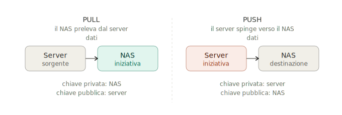

*Fig. 1 — In entrambe le strategie i **dati** viaggiano sempre dal server al NAS; cambia solo **chi avvia** il trasferimento, e con esso dove gira lo script e dove sta la chiave privata.*

### Regola **3-2-1**
**3** copie → **2** supporti diversi → **1** copia *off-site* (altro edificio o **cloud**).
Prevedi sempre il **backup del backup** (NAS gemello + cloud).

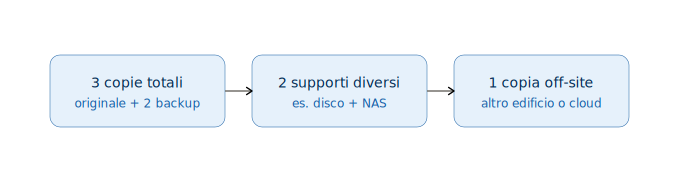

*Fig. 2 — Lo standard minimo per sopravvivere anche al caso peggiore; il "backup del backup" è il modo pratico di coprire la copia off-site.*

## 15.2 · Chiavi SSH (autenticazione senza password)

```bash
ssh-keygen -t rsa                    # sul sistema che AVRÀ l'iniziativa
ssh-copy-id user@host_remoto         # copia la chiave PUBBLICA sull'altro host
ssh user@host_remoto                 # verifica
```

> 🔑 La chiave **privata** resta su chi lancia il comando; la **pubblica** va sull'host a cui ci si connette.

## 15.3 · `rsync` — i flag che servono

```bash
rsync -av --delete  user@host:/sorgente/  /destinazione/
```

| Flag | Cosa fa |
|---|---|
| `-a` | *archive*: ricorsivo + permessi, timestamp, link, owner |
| `-v` | verbose |
| `-z` | comprime nel trasferimento (rete/WAN) |
| `--delete` | copia **speculare** (rimuove dalla dest. ciò che non c'è più in sorgente) |
| `--numeric-ids` | **solo in restore**: mantiene UID/GID originali |
| `--dry-run` | simula senza scrivere → **provalo sempre prima** |

> ⚠️ `--delete` rende la dest. identica alla sorgente: per il versioning affidati agli **snapshot** del NAS.
> ⚠️ La **`/` finale**: `sorgente/` copia il *contenuto*, `sorgente` copia la *cartella*.

## 15.4 · BACKUP

```bash
# 4a · PUSH rsync (gira sul server sorgente)
rsync -avz --delete /path/dati/locali/ user@nas_host:/path/backup/

# 4b · PULL rsync (gira sul NAS)
rsync -avz --delete user@sorgente_host:/path/dati/ /path/backup/locale/

# 4c · PUSH via NFS
sudo mount server_ip:/path/backup/folder /mnt/backup
rsync -av --delete /path/dati/locali/ /mnt/backup/
sudo umount /mnt/backup

# 4d · PUSH via Samba (SMB/CIFS)
sudo mount -t cifs -o username=utente,password=pwd //server_ip/Backup /mnt/backup
rsync -av --delete /path/dati/locali/ /mnt/backup/
sudo umount /mnt/backup
```

## 15.5 · RESTORE

> 🔁 È un backup **al contrario**: la sorgente diventa il backup, la destinazione il sistema da recuperare.
> 🔑 In restore usa **sempre `--numeric-ids`**.

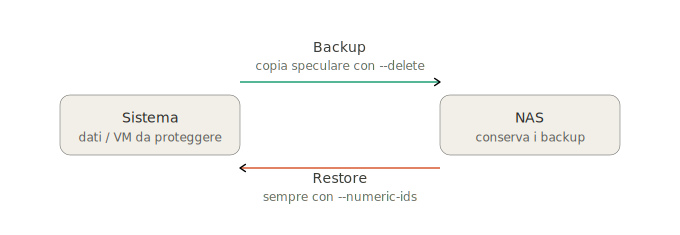

*Fig. 3 — Il restore è il backup invertito: sorgente e destinazione si scambiano, e si aggiunge sempre `--numeric-ids` per conservare UID/GID.*

```bash
# 5a · PULL rsync (gira sul server da ripristinare)
rsync -avz --delete --numeric-ids user@nas_host:/path/backup/ /path/dati/da_ripristinare/

# 5b · PUSH rsync (gira sul NAS che conserva il backup)
rsync -avz --delete --numeric-ids /path/backup/ user@host_destinazione:/path/da_ripristinare/

# 5c · PULL via NFS
sudo mount server_ip:/path/backup/folder /mnt/backup
rsync -av --delete --numeric-ids /mnt/backup/ /path/dati/locali/
sudo umount /mnt/backup

# 5d · PULL via Samba
sudo mount -t cifs -o username=utente,password=pwd //server_ip/path/backup /mnt/backup
rsync -av --delete --numeric-ids /mnt/backup/ /path/dati/locali/
sudo umount /mnt/backup
```

> ℹ️ **NFSv4**: per ripristinare UID/GID, sul NAS abilita *"NFSv3 ownership model for NFSv4"* e
> mappa **RootUser → root**, **RootGroup → wheel/root**.

## 15.6 · Pianificazione con `cron`

```bash
chmod +x /path/to/script.sh
crontab -e
#   0 2 * * *   /path/to/backup.sh        ← ogni giorno alle 02:00
```

```
* * * * *  → minuto · ora · giorno-mese · mese · giorno-settimana
0 2 * * *  ogni giorno 02:00   |  0 * * * *  ogni ora
0 3 * * 0  ogni domenica 03:00 |  0 4 1 * *  il 1° del mese 04:00
```

> 💡 **Granularità multipla** (oraria/giornaliera/settimanale/mensile) in cartelle separate.

## 15.7 · Setup lato server

```bash
# NFS — /etc/exports
#   /path/backup/folder  client_ip(rw,sync,no_subtree_check)
sudo exportfs -a && sudo systemctl restart nfs-kernel-server
```
```ini
# Samba — /etc/samba/smb.conf
[Backup]
   path = /path/backup/folder
   valid users = @users
   read only = no
   browsable = yes
```
```bash
sudo chown -R nobody:nogroup /path/backup/folder
sudo systemctl restart smbd && sudo systemctl restart nmbd
```
---


## 15.8 LUKS — cifratura dei dati a riposo (Linux)

```
# Formattazione cifrata (AES-256 in modalità XTS)
cryptsetup luksFormat --type luks2 --cipher aes-xts-plain64 --key-size 512 /dev/sdb
cryptsetup open /dev/sdb cryptdata        # mappa il volume in /dev/mapper/cryptdata
mkfs.ext4 /dev/mapper/cryptdata
mount /dev/mapper/cryptdata /mnt/data

# Apertura automatica al boot
#  /etc/crypttab :  cryptdata  /dev/sdb  none  luks
#  /etc/fstab    :  /dev/mapper/cryptdata  /mnt/data  ext4  defaults  0 2

# ⚠️ Backup dell'header (senza, i dati sono irrecuperabili)
cryptsetup luksHeaderBackup /dev/sdb --header-backup-file luks-hdr.img
```
> 🔑 `--key-size 512` ⇒ **AES-256**: in XTS la chiave è divisa in due metà da 256 bit. ⚠️ L'header LUKS contiene le chiavi mascherate: **va salvato** e protetto. **Test:** `cryptsetup status cryptdata`, `lsblk -f`.

---

## 15.9 · ✅ Checklist

- [ ] Obiettivo: recupero **dati** o **servizi/VM**?
- [ ] Strategia: **PULL** (NAS centralizza) o **PUSH** (server autonomi)?
- [ ] Chiavi SSH (pubblica sul lato giusto)
- [ ] Testato con `--dry-run`
- [ ] In restore usato `--numeric-ids`
- [ ] `cron` con la giusta granularità
- [ ] **Snapshot/versioning** sul NAS
- [ ] Regola **3-2-1** (off-site / cloud)
- [ ] Accesso ai backup limitato agli amministratori (AAA)

---


# 16 · Wi-Fi Mesh tri-band — pianificazione canali (EU)

> Assegnare canali ad access e backhaul senza interferenza co-canale (CCI), con
> **riuso cellulare a 4 colori (N=4)** in banda 5 GHz.

## 16.1 · Principio guida

> **Vicini nello spazio → frequenze lontane. Lontani → frequenze anche vicine** (la propagazione
> li disaccoppia, il riuso diventa possibile).

Non mettere mai sulla stessa radio **access** (client) e **backhaul** (nodi vicini): il throughput
si dimezza a ogni hop (CSMA/CA serializza). Da qui la scelta tri-band.

## 16.2 · Le 3 radio (apparato tri-band)

| Radio | Banda | Ruolo | Per chi |
|-------|-------|-------|---------|
| **R1** | 2.4 GHz | Access | client legacy (Wi-Fi 4/5, IoT) |
| **R2** | 5 GHz lower (36–64) | Access | client moderni (Wi-Fi 6) |
| **R3** | 5 GHz upper DFS (100–144) | **Backhaul** | solo nodi mesh, 80 MHz |

> 💡 Tratte P2P critiche (es. mastio→gateway): radio **60 GHz** direttiva (Gbps, LOS richiesta).

## 16.3 · Canali ACCESS — i 4 "colori" (riuso N=4)

`ch X @ 80 MHz` = canale 80 MHz da X → occupa X, X+4, X+8, X+12.

| Colore | Canale 80 MHz | Slot 20 MHz | Sotto-banda | DFS |
|--------|---------------|-------------|-------------|-----|
| 🟦 **A** | `ch 36 @ 80` | 36·40·44·48 | U-NII-1 | no |
| 🟩 **B** | `ch 52 @ 80` | 52·56·60·64 | U-NII-2A | sì |
| 🟨 **C** | `ch 100 @ 80` | 100·104·108·112 | U-NII-2C | sì |
| 🟥 **D** | `ch 116 @ 80` | 116·120·124·128 | U-NII-2C | sì |

✅ Spettralmente disgiunti: colori diversi **non** si interferiscono, comunque vicini.
A 40 MHz: A=36/40, B=52/56, C=100/104, D=116/120.

**2.4 GHz**: solo **1, 6, 11** non sovrapposti → riuso a **3 colori**.

## 16.4 · Canali BACKHAUL — sempre fuori dai 4 colori

| Canale | Slot | Banda | DFS | Perché |
|--------|------|-------|-----|--------|
| `ch 132 @ 80` | 132·136·140·144 | U-NII-2C | sì | lontano dall'access, stabile su tratte fisse |
| `ch 149 @ 80` | 149·153·157·161 | U-NII-3 | **no** | **max EIRP outdoor (30 dBm)**, link lunghi |

## 16.5 · Procedura passo-passo

1. **Disegna la griglia** degli AP (chi è vicino a chi).
2. **Colora le celle access** A/B/C/D: adiacenti = colori diversi.
3. **Riusa un colore** solo tra celle ben separate (o schermate da muri/torri).
4. **2.4 GHz**: stesso schema con 1/6/11.
5. **Backhaul**: alterna **132** e **149** lungo l'albero (§6).
6. **Site survey** (RSSI/SNR) e affina.

```
Esempio (4 torri + mastio M):
T1 → 36/40 (A)   T2 → 52/56 (B)   T3 → 100/104 (C)   T4 → 116/120 (D)
M  → 36/40 (A, riusato: lontano da T1, circondato da B/C/D)
```

## 16.6 · Backhaul ad albero — regola dell'**alternanza**

Le due radio mesh di uno stesso concentratore stanno su canali **opposti**:

```
            T5 (root)
          132 /   \ 149
            T2     T3        ← concentratori
        149 |       | 132
          T1/T6   T4/T8      ← foglie (1 sola radio mesh)
```

✅ Le trasmissioni concorrenti avvengono **in parallelo su 2 canali**. Senza alternanza
finirebbero in CSMA/CA sullo stesso canale → throughput dimezzato.

## 16.7 · EIRP (EU, indicativo)

| Banda | EIRP tipico |
|-------|-------------|
| 2.4 GHz | 20–24 dBm |
| 5 GHz DFS (U-NII-2) | ~23 dBm indoor, ~30 dBm outdoor |
| 5 GHz U-NII-3 (149+) | massima outdoor consentita |

## 16.8 · ✅ Checklist & ❌ errori comuni

**Controlla che…**
- [ ] access e backhaul su **radio fisiche diverse**;
- [ ] celle access **adiacenti** con colori diversi;
- [ ] backhaul su **132/149**, mai i 4 colori access;
- [ ] radio mesh di un concentratore **alternate**;
- [ ] canali backhaul **a mano** (no Auto-RF: destabilizza i P2P);
- [ ] access in **Auto-RF** (Cisco RRM, Aruba ARM) per il ribilanciamento.

**Da evitare:**
- ❌ stesso canale su access e backhaul dello stesso AP;
- ❌ riuso colore tra celle troppo vicine;
- ❌ backhaul a larghezza piena su canali dei client;
- ❌ saltare il site survey (Ekahau / NetSpot).

---
# 17 Definizione dei servizi

## 17.1 GPO — Group Policy Objects (mini-sezione)

**Struttura (due metà, stesso GUID):**

| Parte | Dove | Contenuto |
| ----- | ---- | --------- |
| **GPC** | oggetto **LDAP** in `CN=Policies,CN=System` | metadati: GUID, versione, link OU (`gPLink`) |
| **GPT** | cartella in `\\dominio\SYSVOL\…\Policies\{GUID}\` | file `.pol`, `.inf`, script, `.msi` |

**Precedenza — LSDOU** (l'ultima applicata vince):

| Ordine | Livello | Per |
| ------ | ------- | --- |
| 1 | **L**ocal | il singolo PC (senza AD) |
| 2 | **S**ite | sito AD (es. proxy per sede) |
| 3 | **D**omain | tutto il dominio (password, AV) |
| 4 | **OU** | **vince su tutto**; la OU più specifica ha priorità |

**Due sezioni:** *Computer Configuration* (all'avvio, per qualunque utente: USB, firewall, software) · *User Configuration* (al logon, segue l'utente: mappature, restrizioni, estensioni browser).

**Come arriva al client:** DNS (record SRV) → Kerberos (TGT/ST) → LDAP (`gPLink` della OU) → download da SYSVOL → applica in LSDOU. Refresh **90 ± 30 min** (computer) / al logon (utente).

```
gpupdate /force            # ricalcolo immediato di tutte le GPO
gpresult /r                # GPO applicate a utente/computer
gpresult /h report.html    # report con le GPO "vincitrici"
```

```
# Le applicazioni si interfacciano via ADMX → es. blocco estensioni Chrome (chiavi di registro):
HKLM\Software\Policies\Google\Chrome\ExtensionInstallBlocklist   1 = "*"
HKLM\Software\Policies\Google\Chrome\ExtensionInstallAllowlist   1 = "<id_approvato>"
```
> 🔑 Le GPO consumano **DNS + Kerberos + LDAP + SYSVOL**: senza quell'infrastruttura non vengono consegnate. 💡 Il *chi/cosa/dove* alle GPO (per OU/ruolo), il *quando* alla rete (le GPO si rinfrescano ogni 90±30 min).

---

## 17.2 MQTT / Mosquitto — broker, mTLS, ACL e bridge

> **Architettura:** broker **edge** sul cantiere (allarmi locali real-time, regge la caduta del link) **+** broker **centrale** in sede (aggrega i cantieri, log storico), uniti da un **bridge** mTLS che inoltra in `out` a QoS 1 con accodamento (store-and-forward); `in` per i `…/cmd` che scendono.

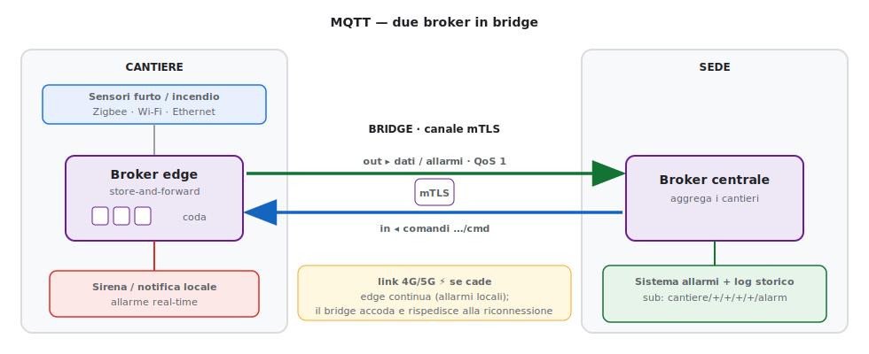
<!-- metti cheatsheet_mqtt_bridge.svg nella cartella img/ accanto al cheatsheet (adatta il path se serve) -->


**Topic** (albero unico per tutti i trasporti):
```
cantiere/{site}/{zona}/{tipo}/{device}/{canale}     # canale: alarm | state | cmd | config
# es.  cantiere/1/zona-A/fire/SMK-0007/alarm
```
**Payload** JSON comune: `ts, site, zone, device_id, type, event, severity, value, transport, gateway`.
**Affidabilità:** allarmi **QoS 1, non retained**; `state` **retained**; **LWT** su `.../state` con `event:"offline"` per i sensori scollegati.

**Broker con mTLS + ACL per topic:**
```
# /etc/mosquitto/mosquitto.conf
listener 8883
cafile   /etc/mosquitto/certs/ca.crt
certfile /etc/mosquitto/certs/server.crt
keyfile  /etc/mosquitto/certs/server.key
require_certificate  true          # mTLS: il client DEVE presentare un certificato
use_identity_as_username true      # l'identità = CN del certificato
acl_file /etc/mosquitto/acl
```
```
# /etc/mosquitto/acl
user gw-cantiere-1
topic write cantiere/1/#
user sede-allarmi
topic read  cantiere/+/+/+/+/alarm
```

**Bridge edge → sede (su mTLS):**
```
# /etc/mosquitto/conf.d/bridge.conf  (broker di cantiere)
connection bridge-sede
address broker.sede.local:8883
topic cantiere/1/# out 1                  # inoltra (out) i topic del cantiere, QoS 1
bridge_cafile  /etc/mosquitto/certs/ca.crt
bridge_certfile /etc/mosquitto/certs/gw.crt
bridge_keyfile  /etc/mosquitto/certs/gw.key
```

**Test:**
```
mosquitto_pub -h broker -p 8883 --cafile ca.crt --cert gw.crt --key gw.key \
  -t cantiere/1/zona-A/fire/SMK-0007/alarm -q 1 -m '{"event":"alarm","type":"fire"}'
mosquitto_sub -h broker -p 8883 --cafile ca.crt --cert c.crt --key c.key -t 'cantiere/+/+/+/+/alarm'
```
> 🔑 I sensori Zigbee non parlano MQTT: è il **gateway** a tradurre verso questo schema; i sensori IP (Wi-Fi/Ethernet) lo pubblicano direttamente. 💡 La sede si abbona a `cantiere/+/+/+/+/alarm` per furto/incendio in tempo reale.

---
