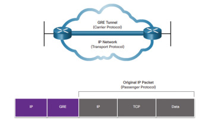
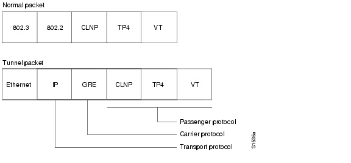

>[Torna a vpn](ethvpn.md)

- [Dettaglio architettura Ethernet](archeth.md)
- [Dettaglio architettura Zigbee](archzigbee.md)
- [Dettaglio architettura BLE](archble.md)
- [Dettaglio architettura WiFi infrastruttura](archwifi.md)
- [Dettaglio architettura WiFi mesh](archmesh.md) 
- [Dettaglio architettura LoraWAN](lorawanclasses.md) 

# **VPN GRE** 

In una configurazione VPN IPsec tra due router Cisco, l'indirizzo IP privato del tunnel (indirizzo di overlay) non è visibile o configurato esplicitamente come si farebbe con una VPN basata su interfaccia virtuale (come GRE o VTI). Invece, la VPN IPsec incapsula il traffico tra le due subnet locali direttamente.

GRE (Generic Routing Encapsulation) è un protocollo di tunneling sviluppato da Cisco Systems che può incapsulare una vasta gamma di protocolli di livello rete all'interno di collegamenti punto-punto virtuali. GRE è spesso utilizzato per creare tunnel che collegano reti remote o dispositivi di rete attraverso una rete IP, come Internet. 



Normalmente, si incapsulano pacchetti **IP privati**, con l'aggiunta di 24 byte di intestazione GRE, direttamente dentro pacchetti **IP pubblici**.




Questo esempio crea un tunnel GRE protetto da IPsec tra Router A e Router B, utilizzando AES per la crittografia e SHA per l'integrità. Supponiamo di avere due router (Router A e Router B) che devono creare un tunnel GRE protetto da IPsec tra di loro. Ecco un esempio completo per Router A:

### **Sede A**

```C++
RouterA(config)# interface tunnel 0
RouterA(config-if)# ip address 10.1.1.1 255.255.255.0
RouterA(config-if)# tunnel source 192.168.1.1
RouterA(config-if)# tunnel destination 192.168.2.2
RouterA(config-if)# tunnel mode gre ip
RouterA(config-if)# exit

RouterA(config)# crypto isakmp policy 1
RouterA(config-isakmp)# encr aes
RouterA(config-isakmp)# hash sha
RouterA(config-isakmp)# authentication pre-share
RouterA(config-isakmp)# group 2
RouterA(config-isakmp)# exit

RouterA(config)# crypto isakmp key YOUR_SECRET_KEY address 192.168.2.2

RouterA(config)# crypto ipsec transform-set MY_TRANSFORM_SET esp-aes esp-sha-hmac

RouterA(config)# access-list 100 permit gre host 192.168.1.1 host 192.168.2.2

RouterA(config)# crypto map MY_CRYPTO_MAP 10 ipsec-isakmp
RouterA(config-crypto-map)# set peer 192.168.2.2
RouterA(config-crypto-map)# set transform-set MY_TRANSFORM_SET
RouterA(config-crypto-map)# match address 100
RouterA(config-crypto-map)# exit

RouterA(config)# interface tunnel 0
RouterA(config-if)# crypto map MY_CRYPTO_MAP
RouterA(config-if)# exit
```

### **Sede B**

```C++
RouterB(config)# interface tunnel 0
RouterB(config-if)# ip address 10.1.1.2 255.255.255.0
RouterB(config-if)# tunnel source 192.168.2.2
RouterB(config-if)# tunnel destination 192.168.1.1
RouterB(config-if)# tunnel mode gre ip
RouterB(config-if)# exit

RouterB(config)# crypto isakmp policy 1
RouterB(config-isakmp)# encr aes
RouterB(config-isakmp)# hash sha
RouterB(config-isakmp)# authentication pre-share
RouterB(config-isakmp)# group 2
RouterB(config-isakmp)# exit

RouterB(config)# crypto isakmp key YOUR_SECRET_KEY address 192.168.1.1

RouterB(config)# crypto ipsec transform-set MY_TRANSFORM_SET esp-aes esp-sha-hmac

RouterB(config)# access-list 100 permit gre host 192.168.2.2 host 192.168.1.1

RouterB(config)# crypto map MY_CRYPTO_MAP 10 ipsec-isakmp
RouterB(config-crypto-map)# set peer 192.168.1.1
RouterB(config-crypto-map)# set transform-set MY_TRANSFORM_SET
RouterB(config-crypto-map)# match address 100
RouterB(config-crypto-map)# exit

RouterB(config)# interface tunnel 0
RouterB(config-if)# crypto map MY_CRYPTO_MAP
RouterB(config-if)# exit
```


>[Torna a vpn](ethvpn.md)

- [Dettaglio architettura Ethernet](archeth.md)
- [Dettaglio architettura Zigbee](archzigbee.md)
- [Dettaglio architettura BLE](archble.md)
- [Dettaglio architettura WiFi infrastruttura](archwifi.md)
- [Dettaglio architettura WiFi mesh](archmesh.md) 
- [Dettaglio architettura LoraWAN](lorawanclasses.md) 


Sitografia:
