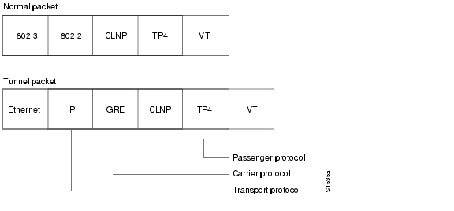

>[Torna a vpn](ethvpn.md)

- [Dettaglio architettura Ethernet](archeth.md)
- [Dettaglio architettura Zigbee](archzigbee.md)
- [Dettaglio architettura BLE](archble.md)
- [Dettaglio architettura WiFi infrastruttura](archwifi.md)
- [Dettaglio architettura WiFi mesh](archmesh.md) 
- [Dettaglio architettura LoraWAN](lorawanclasses.md) 

# **Tunnel GRE** 

In una configurazione VPN IPsec tra due router Cisco, l'indirizzo IP privato del tunnel (indirizzo di overlay) non è visibile o configurato esplicitamente come si farebbe con una VPN basata su interfaccia virtuale (come GRE o VTI). Invece, la VPN IPsec incapsula il traffico tra le due subnet locali direttamente.

GRE (Generic Routing Encapsulation) è un protocollo di tunneling sviluppato da Cisco Systems che può incapsulare una vasta gamma di protocolli di livello rete all'interno di collegamenti punto-punto virtuali. GRE è spesso utilizzato per creare tunnel che collegano reti remote o dispositivi di rete attraverso una rete IP, come Internet. 


Normalmente, si incapsulano pacchetti **IP privati**, con l'aggiunta di 24 byte di intestazione GRE, direttamente dentro pacchetti **IP pubblici**.



Il tunneling **incapsula** i pacchetti di dati da un protocollo all'interno di un **protocollo diverso** e trasporta i pacchetti di dati **senza modifiche** attraverso una **rete esterna**. 

A differenza dell'incapsulamento, il tunneling consente a un protocollo di **livello inferiore**, o a un protocollo dello **stesso livello**, di essere trasportato attraverso il tunnel. Un'**interfaccia** tunnel è un'**interfaccia virtuale** (o logica). 

Il **tunneling** è costituito da **tre componenti** principali:

- **Protocollo passeggero**: il protocollo che si sta incapsulando. Esempi di protocolli passeggero sono AppleTalk, CLNS, IP e IPX.

- **Protocollo carrier** (operatore): il protocollo che esegue l'incapsulamento. Esempi di protocolli operatore sono GRE, IP-in-IP, L2TP, MPLS, STUN e DLSw+.

- **Protocollo di trasporto**: Il protocollo utilizzato per trasportare il protocollo incapsulato. Il protocollo di trasporto principale è IP.


Vantaggi di GRE
- Flessibilità: GRE può trasportare qualsiasi protocollo di livello rete, rendendolo utile in diverse situazioni di rete.
- Compatibilità: GRE è ampiamente supportato su molte piattaforme e dispositivi di rete, inclusi router e firewall di vari produttori.
- Semplicità:GRE è relativamente semplice da configurare e gestire rispetto ad altri protocolli di tunneling più complessi.

Limitazioni di GRE
- Sicurezza: GRE di per sé non fornisce meccanismi di crittografia o autenticazione. Se la sicurezza è una preoccupazione, GRE è spesso utilizzato in combinazione con IPsec per fornire sicurezza ai dati incapsulati.
- Overhead: L'header aggiuntivo di GRE introduce un overhead aggiuntivo di 24 byte, che può influire sulle prestazioni e sull'efficienza della rete.

## **Esempio**

Supponiamo di avere due router (Router A e Router B) e vogliamo creare un tunnel GRE tra di loro. Ecco come configurarlo:

### **Sede A**

```C++
RouterA(config)# interface Tunnel0
RouterA(config-if)# ip address 10.0.0.1 255.255.255.252
RouterA(config-if)# tunnel source 192.168.1.1
RouterA(config-if)# tunnel destination 192.168.2.1
RouterA(config-if)# exit
```

### **Sede B**

```C++
RouterB(config)# interface Tunnel0
RouterB(config-if)# ip address 10.0.0.2 255.255.255.252
RouterB(config-if)# tunnel source 192.168.2.1
RouterB(config-if)# tunnel destination 192.168.1.1
RouterB(config-if)# exit
```

### **Verifica del Tunnel GRE** 

Per verificare che il tunnel GRE sia operativo, puoi usare i seguenti comandi:
```C++
Router# show ip interface brief
Router# show interfaces Tunnel0
Router# show ip route
Router# ping 10.0.0.2 source 10.0.0.1

```

>[Torna a vpn](ethvpn.md)

- [Dettaglio architettura Ethernet](archeth.md)
- [Dettaglio architettura Zigbee](archzigbee.md)
- [Dettaglio architettura BLE](archble.md)
- [Dettaglio architettura WiFi infrastruttura](archwifi.md)
- [Dettaglio architettura WiFi mesh](archmesh.md) 
- [Dettaglio architettura LoraWAN](lorawanclasses.md) 


Sitografia:
