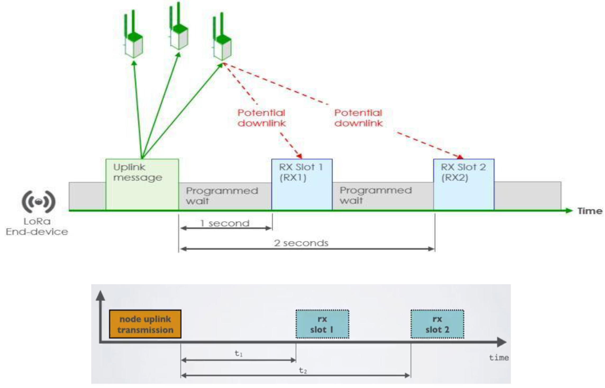
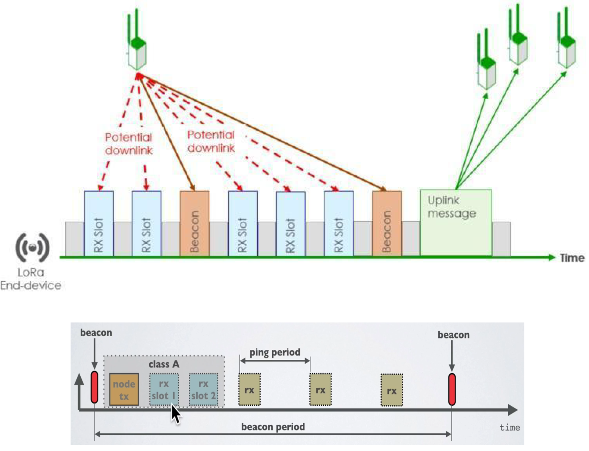
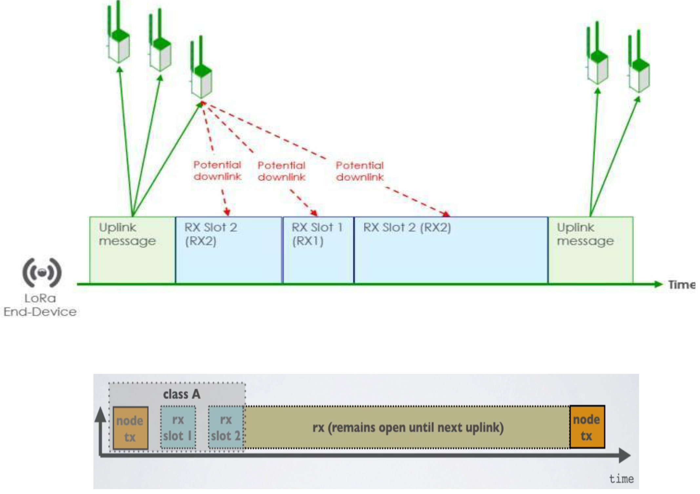
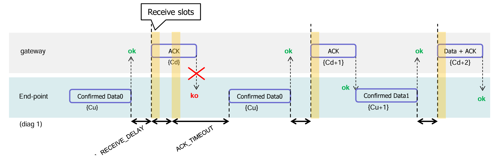
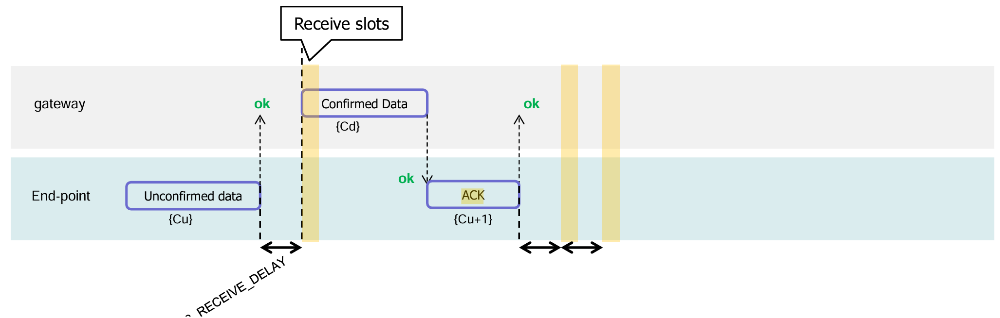
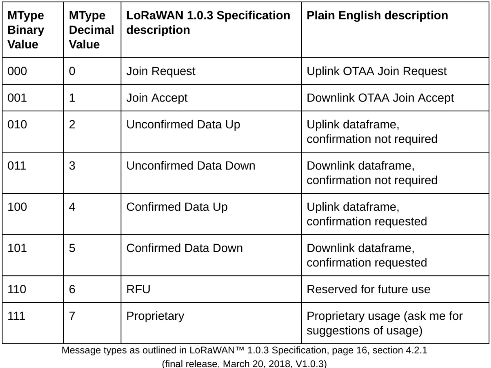

>[Torna a reti Lorawan](lorawanclasses.md#classi-di-dispositivi)

- [Dettaglio architettura Ethernet](archeth.md)
- [Dettaglio architettura Zigbee](archzigbee.md)
- [Dettaglio architettura BLE](archble.md)
- [Dettaglio architettura WiFi infrastruttura](archwifi.md)
- [Dettaglio architettura WiFi mesh](archmesh.md) 

## **Classi di dispositivi**

  La specifica LoRaWAN definisce tre classi di dispositivi:

- **A(ll)** Dispositivi alimentati a batteria. Ogni dispositivo effettua il collegamento in uplink al gateway ed è seguito da due brevi finestre di ricezione del downlink.
- **B(eacon)** Come la classe A ma questi dispositivi aprono anche finestre di ricezione aggiuntive a orari programmati.
- **C(continuo)** Uguale ad A ma questi dispositivi sono in ascolto continuo. Pertanto questi dispositivi consumano più energia e sono spesso alimentati dalla rete elettrica.

### **Classe A**

In qualsiasi momento un nodo terminale può trasmettere un segnale. Dopo questa trasmissione uplink il nodo finale ascolterà una risposta dal gateway aprendo due slot di ricezione in RX1 (1 secondo dopo l'uplink) e RX2 (2 secondi dopo l'uplink). Il gateway può rispondere all'interno del primo slot di ricezione o del secondo, ma non in entrambi. I dispositivi di classe B e C devono supportare anche la funzionalità di classe A.

#### Scenari tipici

La Classe A è la scelta naturale per tutti i device **alimentati a batteria** che hanno un comportamento prevalentemente **unidirezionale verso il server** (uplink-driven): il device misura qualcosa, lo manda, e non si aspetta comandi frequenti dall'esterno.

Esempi concreti:

- **Sensori ambientali periodici** — temperatura, umidità, qualità dell'aria, CO₂: trasmettono una misura ogni N minuti e tornano a dormire. Il server raccoglie i dati ma non ha bisogno di comandare il sensore in tempo reale.
- **Contatori di impulsi** — consumi idrici, elettrici, gas: inviano letture periodiche o al superamento di una soglia.
- **Sensori di livello** — cisterne, fiumi, pozzi: trasmettono il livello a intervalli regolari o su evento (soglia superata).
- **Tracker GPS a basso aggiornamento** — posizione di asset statici o lenti (container, bestiame, macchinari agricoli): trasmettono la posizione ogni ora o ogni pochi minuti, senza necessità di comandi real-time.
- **Sensori di vibrazione o shock** — monitoraggio strutturale di ponti, edifici, macchinari: trasmettono su evento quando viene rilevata un'anomalia.
- **Rilevatori di apertura/chiusura** — porte, finestre, tombini: trasmettono l'evento e non richiedono feedback immediato.
- **Sensori agricoli** — umidità del suolo, irraggiamento solare, meteo: campionamento periodico, nessuna necessità di downlink frequenti.

Il denominatore comune è: **il device decide quando trasmettere**, il server si limita ad ascoltare, e i rari downlink di configurazione o comando possono attendere il prossimo uplink spontaneo senza impatti operativi.

#### Conferma di avvenuto comando

Class A gestisce le conferme, ma con un vincolo importante: la conferma viaggia nell'**uplink successivo**, non immediatamente.

Il flusso è:
1. Il server invia il comando downlink nella finestra RX1 o RX2 dopo un uplink del device.
2. Il device riceve il comando, lo esegue, e nella **prossima trasmissione uplink** include un ACK o un payload applicativo che conferma l'esecuzione.
3. Il server riceve la conferma solo quando il device decide di trasmettere di nuovo — che può essere secondi, minuti o ore dopo, a seconda del periodo di campionamento.

Per applicazioni dove la conferma deve arrivare entro un tempo ragionevole e prevedibile, Class A funziona solo se il device trasmette abbastanza frequentemente. Se trasmette ogni ora, la conferma potrebbe arrivare fino a un'ora dopo — accettabile per alcuni scenari (cambio configurazione), non per altri (apertura di una valvola).

#### Configurazione remota (es. periodo di polling)

Il server invia il nuovo valore come payload downlink. Il device lo riceve nella finestra RX dopo il prossimo uplink, aggiorna il proprio timer interno, e da quel momento trasmette con il nuovo periodo. La conferma arriva nell'uplink successivo. Funziona correttamente, ma se il device trasmette ogni ora e il server vuole cambiare il periodo, deve aspettare fino a un'ora prima che il comando venga consegnato.

#### Nota sull'impostazione dello Spreading Factor

La configurazione dello SF **non dovrebbe essere gestita direttamente dall'applicazione**, ma delegata al meccanismo **ADR (Adaptive Data Rate)** di LoRaWAN, tramite il comando MAC `LinkADRReq` inviato dal network server.

I motivi sono:

- L'ADR si basa su statistiche reali di ricezione (SNR, frame error rate) raccolte su più uplink consecutivi, e adatta lo SF in modo continuo e ottimale alle condizioni reali del link.
- Se l'applicazione imposta SF manualmente, bypassa l'ADR e rischia di fissare un valore subottimale che non si adatta a variazioni del link (mobilità del device, interferenze stagionali, variazioni ambientali).
- C'è inoltre un rischio specifico: se il link è già degradato nel momento in cui si vuole aumentare SF, il comando `LinkADRReq` potrebbe non arrivare proprio perché il link è troppo debole — l'ADR gestisce questo caso con meccanismi di fallback che una configurazione manuale non ha.

L'unico caso in cui fissare SF manualmente ha senso è in **reti private senza ADR**, dove si conosce con certezza la distanza e le condizioni del link e si vuole un bitrate fisso e prevedibile.

---

### **Classe B**

La Classe B nasce per risolvere il limite principale della Classe A: in Class A il server può inviare un downlink **solo nelle due finestre RX1/RX2** che si aprono subito dopo un uplink del device. Se il device non trasmette, il server non ha modo di contattarlo. Questo va bene per sensori che inviano dati periodicamente, ma non per device che devono **ricevere comandi dal server in modo programmato e prevedibile**, senza dover aspettare un uplink.

**Lo scopo** della Classe B è dare al server la possibilità di contattare il device in **slot temporali periodici e noti in anticipo**, chiamati **ping slot**, senza che il device debba trasmettere per primo. La latenza massima del downlink è quindi **deterministica e configurabile**, a differenza della Classe A dove dipende da quando il device decide di trasmettere.

#### Come funziona la sincronizzazione

Il meccanismo si basa su un **beacon** — un segnale radio broadcast trasmesso dal gateway ogni **128 secondi** esatti, sincronizzato all'UTC. Quando il device riceve il beacon, aggancia il proprio orologio interno a quello della rete. Da quel momento in poi il device sa esattamente quando si aprirà il prossimo ping slot, e si sveglia autonomamente in quegli istanti per ascoltare eventuali downlink, anche senza aver trasmesso nulla.

I **ping slot** sono finestre di ricezione aggiuntive che si aprono all'interno di ogni periodo beacon di 128 secondi. La frequenza dei ping slot è configurabile: da 1 a 128 slot per periodo beacon, con intervalli che sono potenze di 2 (ogni 128s, 64s, 32s, 16s, 8s, 4s, 2s, 1s). Più ping slot si aprono, minore è la latenza massima del downlink ma maggiore è il consumo energetico, perché il device si sveglia più spesso.

#### Come avviene la comunicazione

1. Il gateway trasmette il beacon ogni 128s. Il device lo riceve e si sincronizza.
2. Il network server conosce la frequenza di ping del device (comunicata durante il join o con un comando MAC `PingSlotInfoReq`) e sa quindi quando il device sarà in ascolto.
3. Quando il server vuole inviare un downlink, lo accoda e lo trasmette nel **prossimo ping slot disponibile** del device. Il device si sveglia in quell'istante, riceve il messaggio e torna a dormire.
4. Gli uplink spontanei restano possibili esattamente come in Classe A, con le relative finestre RX1/RX2.

Se il device perde il beacon (ad esempio per interferenze o mobilità), entra in una modalità di **beacon tracking** in cui allarga progressivamente la finestra di ascolto per ritrovarlo. Se non riesce a riagganciarsi entro un certo numero di tentativi, il device scade automaticamente in modalità Classe A.

#### Scenari tipici

La Classe B è adatta a device **alimentati a batteria** che devono però ricevere comandi dal server con latenza controllata e prevedibile: valvole di irrigazione intelligenti che ricevono l'orario di apertura dal server, contatori smart che devono rispondere a richieste di lettura programmate, sensori di parcheggio che ricevono aggiornamenti di configurazione, attuatori a basso consumo in reti di controllo industriale leggero.

---

### **Classe C**

La Classe C è la più semplice concettualmente: il device mantiene la **finestra di ricezione sempre aperta**, interrompendola solo per il brevissimo istante in cui sta trasmettendo un uplink. Non c'è beacon, non ci sono ping slot, non c'è sincronizzazione: il device è **sempre in ascolto**.

**Lo scopo** è minimizzare la latenza del downlink. Il server può inviare un messaggio in qualsiasi momento e il device lo riceve **entro pochi millisecondi**, senza dover aspettare né un uplink né un ping slot programmato. È il comportamento opposto alla Classe A: massima reattività, massimo consumo energetico.

#### Come avviene la comunicazione

1. Il device trasmette un uplink (come sempre in LoRaWAN). Subito dopo si aprono le due finestre RX1 e RX2 esattamente come in Classe A.
2. Terminata RX2, invece di tornare a dormire, il device **rimane in ascolto continuo** su RX2 (869,525 MHz, SF12 di default in EU868) finché non deve trasmettere di nuovo.
3. Il server può inviare un downlink in qualsiasi momento: il device lo riceverà immediatamente, indipendentemente da quando ha trasmesso l'ultimo uplink.

Poiché il device è sempre in ricezione, il server può inviare **più downlink consecutivi** senza aspettare un uplink intermedio. Questo apre la possibilità a scenari di **controllo bidirezionale quasi in tempo reale**, che in Classe A sarebbero impossibili.

> **Nota sulla segnalazione al server.** Non esiste un messaggio esplicito con cui il device comunica al server di essere Classe C: è l'applicazione server che deve sapere, in base al contratto stabilito durante il join, che quel device opera in Classe C e quindi può essere contattato in qualsiasi momento.

#### Scenari tipici

La Classe C è adatta a device **alimentati a rete elettrica** (non a batteria) che devono rispondere a comandi del server con la minima latenza possibile: attuatori fissi come interruttori smart, dimmer, relè industriali, controllo di illuminazione pubblica, sistemi di apertura cancelli o serrature, punti di ricarica per veicoli elettrici, qualsiasi applicazione dove un operatore umano preme un pulsante e si aspetta una risposta immediata dall'attuatore remoto.

---

## Confronto tra le classi

| | Classe A | Classe B | Classe C |
|:---|:---:|:---:|:---:|
| Finestre RX dopo uplink | RX1 + RX2 | RX1 + RX2 | RX1 + RX2 |
| Ricezione aggiuntiva | — | Ping slot periodici | Sempre aperta |
| Sincronizzazione | — | Beacon ogni 128s | — |
| Latenza downlink | Alta (dipende dall'uplink) | Media e deterministica | Minima (ms) |
| Consumo | Minimo | Medio | Massimo |
| Alimentazione tipica | Batteria | Batteria | Rete elettrica |
| Scenari tipici | Sensori periodici | Attuatori programmati | Attuatori reattivi |

**Uplink confermato**

Potrebbe essere il caso di un pulsante che comanda l'accensione di un motore, oppure un pulsante di allarme, o anche un apri porta.

1. Il dispositivo finale trasmette innanzitutto un frame di dati confermato contenente il payload Data0 in un istante arbitrario e su un canale arbitrario. Il frame counter Cu è semplicemente derivato aggiungendo 1 al precedente frame counter di uplink.
2. La rete riceve il frame, genera un frame in downlink con il bit ACK impostato, e lo invia esattamente RECEIVE_DELAY1 secondi dopo utilizzando la prima finestra di ricezione del dispositivo finale. Questo frame di downlink utilizza la stessa velocità di dati e lo stesso canale dell'uplink di Dati0. Anche il contatore del frame downlink Cd è derivato aggiungendo 1 all'ultimo downlink verso quello specifico dispositivo finale. Se non c'è alcun payload di downlink in sospeso, la rete genererà un frame senza carico utile.
3. In questo esempio il frame di ACK non viene ricevuto. Se un nodo finale non riceve un frame di ACK in una delle due finestre di ricezione immediatamente dopo la trasmissione, l'uplink può inviare nuovamente lo stesso frame con lo stesso payload e contatore di frame entro ACK_TIMEOUT secondi dopo la seconda finestra di ricezione.
4. Questo nuovo invio deve essere effettuato su un altro canale e deve rispettare la limitazione sul duty cycle come qualsiasi altra normale trasmissione.
5. Se questa volta il dispositivo terminale riceve in downlink l'ACK durante la sua prima finestra di ricezione, appena il frame ACK viene demodulato, il dispositivo terminale è libero di trasmettere un nuovo frame su un nuovo canale.

**Downlink confermato**

Potrebbe essere il caso di una attuazione che è bene che sia confermata, quale un motore, oppure la riuscita di una configurazione, ecc.

1. Lo scambio di frame viene avviato dal dispositivo terminale che trasmette un payload dell'applicazione "non confermato" o qualsiasi altro frame sul canale A.
2. La rete utilizza la finestra di ricezione downlink per trasmettere un frame di dati "confermato" verso il dispositivo finale sullo stesso canale A
3. Alla ricezione di questo frame di dati che richiede una conferma, il dispositivo finale trasmette un frame con il bit ACK impostato a sua discrezione. Questo frame potrebbe anche contenere dati (piggybacking) o comandi MAC come carico utile. Questo uplink ACK viene trattato come qualsiasi uplink standard e come tale viene trasmesso su un canale casuale che potrebbe anche essere diverso dal canale A.
   
**Piggy backing**

Per consentire ai dispositivi terminali di essere il più semplici possibile e di mantenere il minor numero di stati possibile, è possibile trasmettere un messaggio di ack puro cioè senza dati possibilmente subito dopo la ricezione di un messaggio di dati che richiede una conferma. In alternativa, il dispositivo finale può dilazionare la trasmissione di un ack per collegarlo al successivo messaggio di dati (tecnica del piggy backing).

### **Formato dei messaggi**

>[Torna a reti Lorawan](lorawanclasses.md#classi-di-dispositivi)

- [Dettaglio architettura Ethernet](archeth.md)
- [Dettaglio architettura Zigbee](archzigbee.md)
- [Dettaglio architettura BLE](archble.md)
- [Dettaglio architettura WiFi infrastruttura](archwifi.md)
- [Dettaglio architettura WiFi mesh](archmesh.md) 

