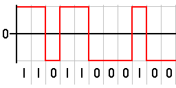
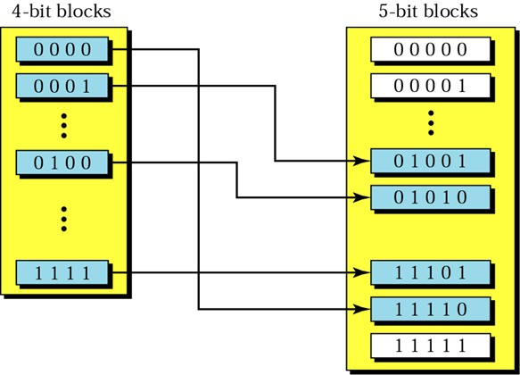

>[Torna a protocolli](protocolli.md#codifica-di-bit)

# **Codifica manchester**

Nelle telecomunicazioni, la codifica **Manchester** è una forma di comunicazione dati nella quale ogni **bit** viene segnalato da una **transizione** (fronte del segnale). La codifica Manchester è considerata una codifica **auto-sincronizzante** (non necessita di un segnale di sincronia esterno), il che significa che permette un'accurata sincronizzazione del flusso dati.


Come possiamo vedere:
- un fronte di **salita** codifica il **bit 0**
- un fronte di **discesa** codifica il **bit 1**

Questo tipo di codifica possiede il **vantaggio** di essere **autosincronizzante** ma anche lo svantaggio di presentare un **consumo doppio** di banda rispetto a codifiche alternative quali la NRZ. E' stata adottata dal livello fisico del protocollo 802.3 **Ethernet** a 10 Mbps.

# **Codifica NRZ**

Nelle telecomunicazioni, un codice di linea di non ritorno a zero (NRZ) è un codice binario in cui gli uno sono rappresentati da una condizione significativa, solitamente una tensione positiva, mentre gli zeri sono rappresentati da qualche altra condizione significativa, solitamente una tensione negativa, senza altra condizione neutra o di riposo. 



A dispetto della codifca Manchester, la NRZ **non** è considerata una codfica autosincronizzante perchè **lunghe sequenze** di tutti **zero** o di tutti **uno**, non presentando neppure **un fronte** per tutta la loro durata, possono compromettere l'efficacia della funzione di **recupero del clock** dal flusso dati (sincronizzazione in banda).

Questo tipo di codifica possiede il **vantaggio** di essere **molto efficiente** nell'utilizzare la banda, per cui è adatta per massimizzare la velocità di trasmissione, al costo dello svantaggio di possibili **perdite di sincronizzazione**.

# **Codifica 4B5B**

Nelle telecomunicazioni, 4B5B è una forma di codice per la trasmissione di dati. 4B5B lavora mappando gruppi di 4 bit in gruppi di 5. Siccome ci sono 32 possibili combinazioni usando 5 bit e solo 16 usandone 4, i 16 gruppi di 5 bit col maggior numero di transizioni sono usati per fornire più transizioni possibili. 4B5B garantisce almeno una transizione per blocco (ingresso di 4 bit / uscita di 5) il quale permette al segnale di essere scoperto. Sfortunatamente l'uso di 5 bit per rappresentarne 4 implica che per trasmettere i dati abbiamo bisogno di una larghezza di banda più grande del 25%.

Dipendentemente dallo standard o dalle specifiche, potrebbero esserci diversi caratteri che 4B5B non usa. La presenza di uno dei caratteri "inusati" nello stream di dati può essere usato come indice di un problema nella connessione. Infatti, i caratteri non usati vengono attualmente usati per scovare gli errori negli stream di dati.



Con la codifica 4B5B vengono risolti i problemi relativi alla trasmissione di più zeri consecutivi. Le sequenze generate vengono poi trasmesse attraverso una codifica NRZI (Senza ritorno a zero invertito), che elimina anche il problema della presenza di un numero eccessivo di 1 consecutivi. Il risultato è che la codifica 4B/5B elimina ripetizioni consecutive di un numero eccessivo di valori binari tutti uguali. E' stata adottata dal livello fisico del protocollo 802.3 **Fast Ethernet** a 100 Mbps.

# **Codifica 4D-PAM5**

La modulazione **4D-PAM5** (Four-Dimensional 5-level Pulse Amplitude Modulation) è una tecnica avanzata di trasmissione dati sviluppata specificamente per le reti Gigabit Ethernet su cavi in rame (1000BASE-T). Questa tecnica combina la modulazione PAM-5 tradizionale con un approccio di codifica a quattro dimensioni per ottenere prestazioni superiori rispetto alle modulazioni convenzionali.

Lo standard IEEE 802.3ab per il Gigabit Ethernet ha adottato 4D-PAM5 come tecnica di modulazione ufficiale, permettendo di raggiungere velocità di 1 Gbps su cavi Cat5e standard attraverso quattro coppie di fili intrecciati.

PAM-5 è una tecnica di modulazione che utilizza **cinque livelli di ampiezza** distinti per rappresentare i dati digitali. I livelli sono tipicamente indicati come:

```
    +2V  ●  ----------
         |
    +1V  ●  ----------
         |
     0V  ●  ----------
         |
    -1V  ●  ----------
         |
    -2V  ●  ----------
```

La modulazione 4D-PAM5 estende il concetto di PAM-5 a quattro dimensioni, sfruttando le quattro coppie di cavi presenti nei cavi Ethernet standard.

## Il concetto di modulazione multidimensionale

In 4D-PAM5, non si considerano quattro segnali PAM-5 separati e indipendenti, ma piuttosto si considera un **unico segnale a quattro dimensioni**.

Un punto nello spazio di segnale 4D è rappresentato da una quadrupla di valori PAM-5, uno per ogni coppia di cavi:
```
(a₁, a₂, a₃, a₄) dove a_i ∈ {-2, -1, 0, +1, +2}
```

## Relazione con la parallelizzazione

Non si tratta di semplice parallelizzazione (invio di 4 simboli PAM-5 indipendenti contemporaneamente), ma di una vera e propria codifica congiunta che introduce dipendenze tra i valori trasmessi sulle diverse coppie.


## Blocchi di dati e codifica

1. I dati vengono elaborati in blocchi di 8 bit (1 byte)
2. Ogni blocco di 8 bit viene mappato su un vettore 4D di simboli PAM-5
3. La capacità teorica di trasportare informazioni di un vettore 4D-PAM5 è:
   4 × log₂(5) ≈ 9,28 bit

Questa capacità extra (rispetto agli 8 bit) viene utilizzata per:
- Controllo degli errori
- Codici di correzione
- Miglioramento delle caratteristiche spettrali del segnale

## Velocità di segnalazione
- Su ciascuna delle quattro coppie di cavi, i simboli PAM-5 vengono trasmessi a una velocità di 125 megabaud (125 milioni di simboli al secondo)
- Con una codifica efficace di circa 2 bit per simbolo, questo si traduce in 250 Mbps per coppia
- Con quattro coppie: 4 × 250 Mbps = 1000 Mbps (1 Gbps)
  
## Trasmissione full-duplex

Una caratteristica chiave di 1000BASE-T è la comunicazione full-duplex su ogni coppia di cavi:
- Ogni coppia trasporta contemporaneamente dati in entrambe le direzioni
- I circuiti di cancellazione dell'eco (echo cancellation) separano i segnali nelle due direzioni
- Questa tecnica raddoppia l'efficienza dell'utilizzo della banda disponibile

Per i dettagli, vedere [codifica 4D-PAM5](pam5.md).

>[Torna a protocolli](protocolli.md#codifica-di-bit)

