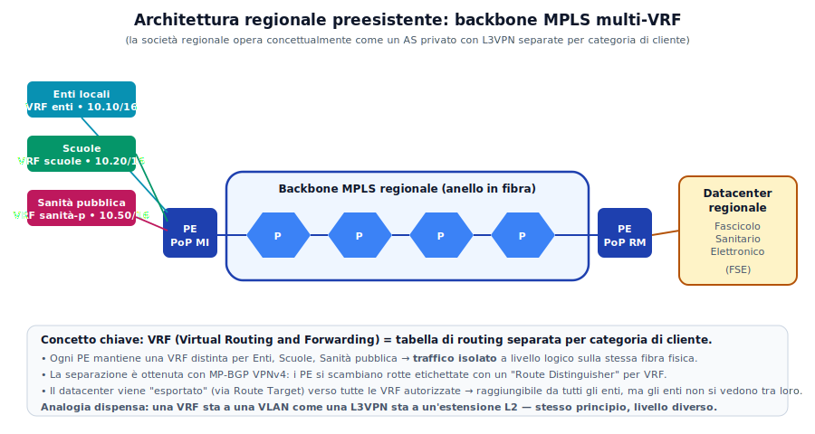
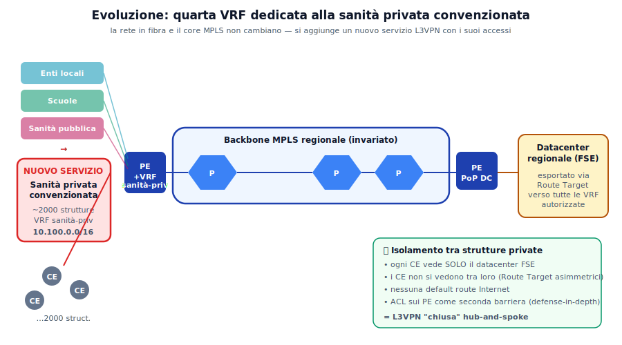
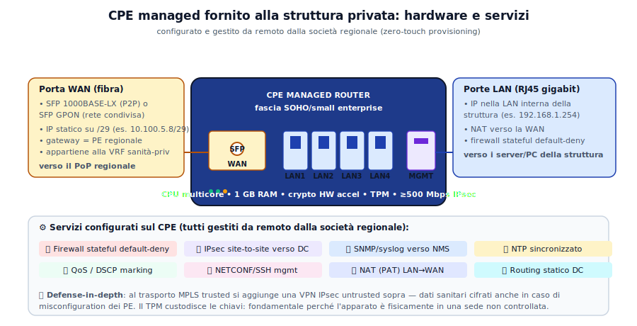
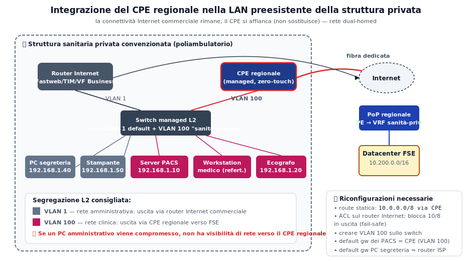
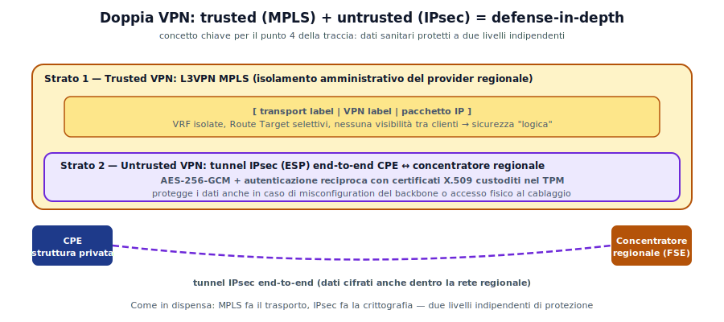

# Seconda prova Sistemi e Reti 2024 — Risposta ragionata (punti 1, 2, 3)

**Traccia A038 — Sessione ordinaria 2024**
*Rete regionale in fibra per sanità privata convenzionata (PNRR M6C2)*

---

## Inquadramento iniziale

Prima di rispondere punto per punto, è essenziale **inquadrare correttamente la natura della rete** descritta nella traccia. La società regionale gestisce a tutti gli effetti una **rete privata di tipo carrier-grade**: non è un ISP pubblico, ma tecnologicamente si comporta come un piccolo operatore telco, con un proprio **backbone MPLS** e un'architettura multi-tenant capace di offrire servizi differenziati a categorie diverse di utenza (Enti locali, scuole, sanità pubblica, sanità privata).

Concettualmente la rete regionale è **un AS privato** con:

- un **IGP interno** (tipicamente OSPF o IS-IS) che governa il routing del backbone;
- un **backbone MPLS** che permette label switching tra i router di core;
- **MP-BGP con famiglia VPNv4** per distribuire le rotte dei clienti all'interno di **VRF separate**, una per categoria;
- **nessun peering eBGP pubblico** verso Internet: la rete è "chiusa" per design, perché non offre servizi di accesso generalizzato.

Due requisiti della traccia suggeriscono esplicitamente l'architettura **L3VPN MPLS multi-VRF**:

- *"ciascuna struttura collegata non possa accedere alle reti di tutte le altre"* → isolamento logico tramite VRF e Route Target;
- *"non offrirà servizi di accesso generalizzato ad Internet"* → VPN **chiusa**, senza default route pubblica.

Con questa lente, la traccia diventa l'applicazione pratica dei concetti di VPN trusted e tunnel L3 studiati.

---

## Punto 1 — Architettura preesistente ed evoluzione

### 1.1 Architettura preesistente

La rete regionale è strutturata su **tre livelli gerarchici**, come una tipica MAN/WAN regionale:

- **Core / backbone in fibra**: dorsali provinciali e metropolitane, con topologia ad anello o a maglia, ridondata. I router di core sono router MPLS di classe carrier (Cisco ASR 9000, Juniper MX, o equivalenti). In terminologia di dispensa sono i **P router**: non hanno clienti direttamente attestati, fanno solo label switching.
- **Livello di distribuzione / PoP** (Points of Presence): situati nei capoluoghi di provincia e nei principali nodi di rete. Qui si trovano i **PE (Provider Edge)** che "affacciano" i clienti, gestiscono le VRF e impongono/rimuovono le etichette MPLS.
- **Livello di accesso**: fibra spenta o illuminata fino alle sedi dei clienti; ogni cliente ha un apparato **CE (Customer Edge)** presso la propria sede che si collega al PE più vicino.

Sulla rete sono configurate **L3VPN MPLS separate** per categoria di utenza, ognuna con un proprio piano di indirizzamento sulla rete privata 10.0.0.0/8:

| Categoria | VRF | Sottorete (esempio) |
|---|---|---|
| Enti locali | `VRF-enti` | 10.10.0.0/16 |
| Scuole | `VRF-scuole` | 10.20.0.0/16 |
| Sanità pubblica | `VRF-sanita-p` | 10.50.0.0/16 |
| **Sanità privata (nuovo)** | `VRF-sanita-priv` | **10.100.0.0/16** |

Il **datacenter regionale** che ospita il Fascicolo Sanitario Elettronico è collegato al backbone tramite due PE ridondati (high-availability) ed è raggiungibile **solo dalle VRF autorizzate** grazie ai **Route Target** di MP-BGP, che controllano quali rotte vengono importate/esportate tra VRF.

> 🔑 **Concetto di dispensa**: una VRF sta a una VLAN come una L3VPN sta a un'estensione L2 — stesso principio di segmentazione, livelli diversi.

### 1.2 Evoluzione per la sanità privata convenzionata

L'intervento PNRR **non modifica il core**: il backbone MPLS e i PoP esistenti rimangono invariati. L'estensione consiste in tre interventi complementari:

**1. Una nuova VRF sui PE esistenti.** Si configura sui PE la nuova `VRF-sanita-priv` con Route Target tali che:
- le rotte delle strutture private vengono **esportate solo verso il datacenter** (non verso altre strutture private);
- il datacenter **importa** le rotte di tutte le strutture private (così può rispondere alle loro richieste);
- le strutture private **importano solo** la rotta del datacenter, non quelle delle altre strutture.

Questa configurazione implementa topologicamente uno schema **hub-and-spoke**: il datacenter è l'hub, le 2000 strutture sono gli spoke che vedono solo l'hub, mai tra loro.

**2. Estensione fisica della fibra di accesso.** Si porta fibra fino a ciascuna delle 2000 strutture convenzionate. Dove la posa di fibra dedicata non è economicamente sostenibile, si può adottare:
- **fibra punto-punto** (P2P) per le strutture grandi/critiche (ospedali privati, grandi laboratori);
- **GPON (Gigabit Passive Optical Network)** per strutture più piccole: un unico OLT nel PoP serve più ONT nelle sedi dei clienti tramite splitter ottici, riducendo i costi.

**3. Fornitura e installazione del CPE managed** presso ogni struttura (dettagliato al punto 2).

L'**isolamento tra strutture private** richiesto dalla traccia si ottiene a due livelli complementari, secondo il principio *defense-in-depth*:

- a livello di **routing**: i Route Target asimmetrici (hub-and-spoke) garantiscono che una struttura non "veda" le altre nemmeno come prefissi IP;
- a livello di **forwarding**: sui PE si configurano ACL che bloccano esplicitamente il traffico inter-struttura nella stessa VRF, come seconda barriera in caso di errori di configurazione futuri.

---

## Punto 2 — Dispositivo fornito alla struttura privata (CPE managed)

Il dispositivo è un **router CPE managed** di fascia SOHO/small enterprise. Dal punto di vista della dispensa è il **CE** dal lato struttura privata, collegato al **PE** regionale tramite un link in fibra.

Caratteristica chiave richiesta dalla traccia: è **configurato e gestito da remoto** dalla società regionale tramite **zero-touch provisioning** — la struttura sanitaria non ha credenziali di amministrazione né accesso al control plane dell'apparato. Questa scelta semplifica enormemente l'operatività a scala (2000+ apparati da mantenere coerenti) e riduce la superficie d'attacco interna.

### 2.1 Caratteristiche hardware

| Componente | Specifica | Motivazione |
|---|---|---|
| **Porta WAN** | 1 × SFP (fibra) 1000BASE-LX o SFP GPON | Termina la connessione verso il PoP; SFP per flessibilità (dedicata o condivisa) |
| **Porte LAN** | 4 × RJ45 gigabit Ethernet | Connessione verso lo switch interno della struttura o direttamente ai dispositivi clinici |
| **Porta management** | 1 × console seriale + 1 × eth dedicata | Accesso out-of-band di emergenza (senza dipendere dalla configurazione del dispositivo) |
| **CPU** | Multi-core (es. ARM quad-core 1.2 GHz) | Supporto simultaneo di routing, firewall, IPsec |
| **RAM** | ≥ 1 GB | Tabelle di routing, stato firewall, sessioni IPsec |
| **Crypto accelerator** | Hardware (AES-NI o dedicato) | Throughput IPsec ≥500 Mbps senza saturare la CPU |
| **TPM / secure element** | Chip dedicato | Custodisce le chiavi IPsec: fondamentale perché l'apparato è in sede non controllata |

### 2.2 Configurazione di rete delle porte

**Porta WAN** (verso il PE regionale):
- Indirizzo IP statico su una sottorete /29 ricavata da 10.100.0.0/16 (es. 10.100.5.8/29 assegnata alla struttura N). L'indirizzo è **statico** per non avere dipendenze da DHCP del provider.
- Default gateway = indirizzo del PE regionale corrispondente.
- Link inserito nella **VRF-sanita-priv** sul PE.
- Layer 2: Ethernet nativo (niente VLAN tagging) oppure con VLAN dedicata se il PoP lo richiede.

**Porte LAN** (verso la struttura):
- IP nella LAN interna della struttura (es. 192.168.1.254 come gateway della VLAN clinica).
- Il CPE si comporta come **router con NAT (PAT)** tra la LAN interna e la WAN 10.100.0.0/16: in questo modo la società regionale non deve conoscere i piani di indirizzamento interni delle 2000 strutture (tutti diversi tra loro).
- Alternativa senza NAT: routing statico puro, con più audit ma maggiore complessità di gestione. Il NAT è la scelta pragmatica.

### 2.3 Servizi configurati sul CPE

1. **Firewall stateful default-deny**: lascia uscire solo traffico verso il datacenter FSE sulle porte applicative necessarie (HTTPS, eventualmente HL7 su TLS, DICOM su TLS per le immagini diagnostiche).
2. **VPN IPsec site-to-site** verso il concentratore regionale, **in aggiunta** al trasporto MPLS — questo è il cuore del *defense-in-depth* (vedi punto 4).
3. **NAT/PAT** dinamico LAN → WAN.
4. **Routing statico** verso il datacenter regionale; nessuna default route Internet configurata (il CPE non "sa" come uscire su Internet — per design).
5. **QoS con marcatura DSCP**: il traffico di immagini diagnostiche (grandi volumi, non latency-critical) viene marcato con bassa priorità; il traffico interattivo di consultazione FSE con priorità alta.
6. **SNMP + syslog** verso i sistemi di monitoraggio regionali (NMS e SIEM) per alerting su anomalie.
7. **NTP sincronizzato** con i server NTP regionali: i timestamp dei log devono essere coerenti a livello regionale per eventuali audit su accessi ai dati sanitari.
8. **Gestione remota via SSH / NETCONF** su canale cifrato, tipicamente su una VRF di management separata dalla VRF dati.

---

## Punto 3 — Integrazione con la LAN preesistente della struttura

### 3.1 Ipotesi realistica sulla LAN preesistente

Una struttura sanitaria privata convenzionata tipica (poliambulatorio, laboratorio analisi, centro diagnostico) dispone già di una rete locale con queste caratteristiche:

- **un router/firewall commerciale** (Fastweb, TIM, Vodafone Business) come uscita verso Internet pubblica per l'operatività ordinaria: email, gestionali cloud, fatturazione elettronica, aggiornamenti software;
- **uno o più switch L2** (managed o unmanaged) che connettono PC amministrativi, postazioni mediche, apparecchiature diagnostiche (ecografi, PACS workstation);
- eventualmente **VLAN separate** tra uffici amministrativi e rete "clinica" (se la struttura è strutturata), oppure flat network (se più piccola);
- **un server locale** gestionale / mini-PACS che raccoglie i dati prima dell'invio al datacenter regionale.

### 3.2 Principio architetturale: rete dual-homed

Il CPE regionale **non sostituisce** il router Internet preesistente: **si affianca**. Questo è un punto fondamentale da chiarire in sede d'esame:

- la connessione Internet commerciale **resta** e continua a essere usata per tutto il traffico ordinario (email, web, cloud generici);
- il CPE regionale si usa **esclusivamente** per il traffico diretto al datacenter FSE (sottoreti 10.x regionali).

Si ottiene così una configurazione **dual-homed**: due uscite distinte, una pubblica (router ISP commerciale) e una privata chiusa (CPE regionale). Il principio è quello della *split VPN*: traffico diverso, uscita diversa, policy diverse.

### 3.3 Riconfigurazioni e apparati aggiuntivi

**1. Route statica sulla LAN.** I dispositivi che devono raggiungere il datacenter FSE devono avere una rotta che punti al CPE regionale come next-hop per le destinazioni 10.x, mantenendo il router commerciale come default gateway per il resto. Si configura in due modi:

- *opzione A* — rotta statica OS-level sui singoli server critici (server PACS, workstation di refertazione);
- *opzione B* — rotta statica centralizzata sul router commerciale: `ip route 10.0.0.0/8 via <IP CPE regionale>` così i client ricevono via DHCP il default gateway standard e il routing avviene in modo trasparente.

L'opzione B è più semplice da gestire, l'opzione A è più selettiva (solo i dispositivi autorizzati raggiungono il FSE).

**2. Segregazione L2 (consigliata): VLAN dedicata "sanita-regione".** Sullo switch managed si crea una **VLAN 100** alla quale si agganciano **solo** i dispositivi che devono dialogare con il FSE:

- server PACS e workstation di refertazione → VLAN 100;
- ecografo e apparecchi diagnostici → VLAN 100;
- PC amministrativi, stampanti, telefoni VoIP → VLAN 1 (default).

Il CPE regionale si affaccia esclusivamente sulla VLAN 100. Beneficio di sicurezza fondamentale: se un PC amministrativo viene compromesso (tipicamente via phishing), **non ha alcuna visibilità di rete** verso il CPE regionale né verso i dispositivi clinici — il malware non può usarlo come pivot verso il FSE.

**3. Firewall rules sul router Internet commerciale: fail-safe.** Si aggiunge una ACL che **blocca il traffico verso 10.0.0.0/8** in uscita sul router commerciale. In questo modo, se per qualunque motivo il CPE regionale dovesse essere down o malconfigurato, il traffico per il datacenter **non** "straborda" accidentalmente su Internet pubblica (con dati sanitari che rischierebbero di finire in chiaro in sessioni non cifrate).

**4. Eventuale apparato aggiuntivo.** Se la LAN preesistente è flat (switch unmanaged, no VLAN) conviene installare uno **switch managed L2** (IEEE 802.1Q) nuovo, dedicato all'area clinica, per poter segmentare senza stravolgere il resto. È un investimento di poche centinaia di euro ma porta benefici di sicurezza sostanziali.

### 3.4 Esempio concreto

Poliambulatorio con LAN 192.168.1.0/24:
- server gestionale PACS su 192.168.1.10
- ecografo con PACS integrato su 192.168.1.20
- PC segreteria vari su 192.168.1.40–50

Dopo l'intervento:
- la Regione assegna alla struttura il blocco WAN 10.100.5.8/29;
- il CPE riceve 10.100.5.10 sulla porta WAN e 192.168.1.254 sulla porta LAN (in VLAN 100);
- sullo switch managed: **VLAN 100** include porte di CPE, server PACS, workstation medico, ecografo; **VLAN 1** include PC segreteria, stampanti;
- sul server PACS: rotta statica `10.0.0.0/8 via 192.168.1.254` (CPE regionale);
- sul router Internet commerciale: ACL deny `10.0.0.0/8` in uscita.

---

## Cornice concettuale: la doppia VPN

Anche se il punto 4 della traccia chiede esplicitamente le misure di sicurezza per i dati sanitari, vale la pena anticipare qui il concetto architetturale che attraversa tutte le risposte: la **doppia VPN**.

- **Strato 1 — Trusted VPN (MPLS L3VPN).** Il backbone regionale è *trusted* in senso amministrativo: l'isolamento tra clienti è garantito dalle VRF e dai Route Target. È il modello "enterprise managed VPN" classico.
- **Strato 2 — Untrusted VPN (IPsec).** Sopra il trasporto MPLS si aggiunge un tunnel IPsec ESP end-to-end tra CPE e concentratore regionale, con cifratura AES-256-GCM e autenticazione reciproca via certificati X.509 custoditi nel TPM del CPE.

I due strati sono **indipendenti**: anche se uno dei due viene compromesso (misconfiguration dei PE, accesso fisico al cablaggio, bug nel software MPLS), l'altro continua a proteggere i dati. Questa è la logica *defense-in-depth* che il trattamento di dati sanitari impone sotto GDPR e direttive europee NIS/NIS2.

> 🔑 **Parallelo con la dispensa**: MPLS fa il trasporto, IPsec fa la crittografia — stessa separazione signalling/trasporto vista in tutte le VPN moderne. Cambia la scala e la finalità, non lo schema concettuale.

---

## Apertura verso il punto 4 e la seconda parte

Questa architettura predispone naturalmente le risposte al punto 4 e alla seconda parte della traccia:

- **sicurezza dei dati** (punto 4): cifratura end-to-end IPsec + cifratura a riposo nel datacenter con chiavi gestite via HSM, autenticazione forte tra CPE e concentratore, segregazione VLAN, audit log centralizzati;
- **trasferimento schedulato** (punto 4): finestra notturna con bandwidth throttling per le immagini diagnostiche; near-real-time per referti e documenti leggeri;
- **strategie contro i malfunzionamenti** (quesito I): buffer locale sui CPE/server di struttura, retry automatico, ridondanza del datacenter con replica geografica;
- **autenticazione multi-fattore per i cittadini** (quesito II): SPID L2/L3 o CIE con lettore NFC + PIN, conformemente al regolamento AgID sul FSE.

---

*Dispensa redatta come risposta ragionata alla prima parte della traccia A038 – Sistemi e Reti, sessione ordinaria 2024. Concetti e terminologia allineati alla dispensa "Dai tunnel VPN agli Autonomous System".*
