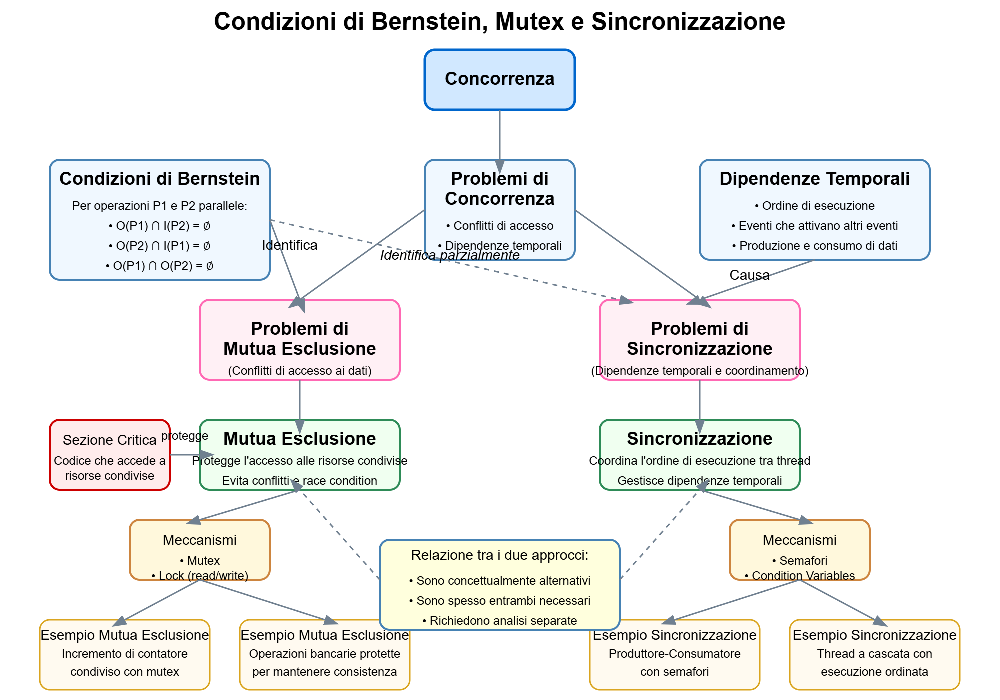

>[Torna a thread](threadsched.md)  >[Versione in Python](threadschedpy.md)

# Concorrenza, Sincronizzazione e Mutua Esclusione
## Dispensa didattica

---

## Indice
1. [Introduzione alla Concorrenza](#introduzione-alla-concorrenza)
2. [Le Condizioni di Bernstein](#le-condizioni-di-bernstein)
3. [Sezioni Critiche](#sezioni-critiche)
4. [Mutua Esclusione](#mutua-esclusione)
5. [Sincronizzazione](#sincronizzazione)
6. [Confronto: Mutex vs Sincronizzazione](#confronto-mutex-vs-sincronizzazione)
7. [Esempi Pratici](#esempi-pratici)
8. [Mappa Concettuale](#mappa-concettuale)
9. [Esercizi](#esercizi)

---

## Introduzione alla Concorrenza

La **concorrenza** è la capacità di un sistema di eseguire più attività nello stesso intervallo di tempo. In un sistema concorrente, diversi processi o thread possono essere in esecuzione simultaneamente. 

In un sistema a multiprocessore o multicore, abbiamo un vero **parallelismo**, dove più istruzioni vengono effettivamente eseguite nello stesso istante. In sistemi con un singolo processore, la concorrenza è spesso simulata tramite context switching, dove il sistema operativo alterna rapidamente l'esecuzione dei diversi thread.

Normalmente eseguire in **parallelo** più task (o più repliche dello stesso task) attraverso la tecnica dell'**interliving** offerta dal multi-threading o dal multi-processing è conveniente perchè produce un **incremento delle prestazioni** nell'esecuzione del codice.

Tuttavia, alcune **operazioni parallele** di accesso su uno stesso dato (o una stessa risorsa) possono portare l'informazione in esso contenuta in uno stato **inconsistente** (o incoerente), rendendola inutilizzabile. 

Le porzioni di codice sensibili a queto problema si dicono affette da **race condition**. La soluzione al problema del race condition è passare, limitatamente a quelle sezioni di codice, da un accesso parallelo ad uno **strettamente sequenziale**. Questo significa che quelle porzioni di codice devono devono essere eseguite da **un thread alla volta**. 

Riassumendo:

**Perché è importante la concorrenza?**
- Migliora le prestazioni sfruttando più unità di elaborazione
- Permette di gestire simultaneamente più attività
- Consente un'interfaccia utente reattiva mentre si eseguono elaborazioni in background
- Ottimizza l'utilizzo delle risorse di sistema

**Sfide della concorrenza:**
- Coordinare l'accesso a risorse condivise
- Evitare race condition, deadlock e starvation
- Garantire la coerenza dei dati


## Le Condizioni di Bernstein

Le **Condizioni di Bernstein** rappresentano un criterio formale per determinare quando due operazioni possono essere eseguite in parallelo senza problemi.

### Definizione

Date due operazioni P1 e P2:
- Sia I(P1) l'insieme di tutte le variabili lette (input) da P1
- Sia O(P1) l'insieme di tutte le variabili scritte (output) da P1
- Sia I(P2) l'insieme di tutte le variabili lette (input) da P2
- Sia O(P2) l'insieme di tutte le variabili scritte (output) da P2

P1 e P2 possono essere eseguite in parallelo (sono indipendenti) se sono soddisfatte tutte le seguenti condizioni:

1. O(P1) ∩ I(P2) = ∅ (P1 non modifica nulla che P2 legge)
2. O(P2) ∩ I(P1) = ∅ (P2 non modifica nulla che P1 legge)
3. O(P1) ∩ O(P2) = ∅ (P1 e P2 non modificano le stesse variabili)

### Significato

Le condizioni di Bernstein indicano quando non ci sono dipendenze tra operazioni, permettendo quindi l'esecuzione parallela senza problemi di coerenza dei dati.

### Esempio

Consideriamo le seguenti operazioni:
```
P1: a = b + c
P2: x = y + z
```

Qui abbiamo:
- I(P1) = {b, c}
- O(P1) = {a}
- I(P2) = {y, z}
- O(P2) = {x}

Poiché non c'è sovrapposizione tra questi insiemi, le operazioni possono essere eseguite in parallelo.

Consideriamo invece:
```
P1: a = b + c
P2: b = x + y
```

Qui abbiamo:
- I(P1) = {b, c}
- O(P1) = {a}
- I(P2) = {x, y}
- O(P2) = {b}

La seconda condizione è violata perché O(P2) ∩ I(P1) = {b} ≠ ∅, quindi queste operazioni non possono essere eseguite in parallelo in sicurezza.

---

## Sezioni Critiche

### Definizione

Una **sezione critica** è una porzione di codice che accede a risorse condivise (come variabili, file, database) e che deve essere eseguita come un'unità atomica, ovvero senza interruzioni da parte di altri thread che accedono alle stesse risorse.

### Caratteristiche

1. **Atomicità**: L'esecuzione della sezione critica deve apparire come istantanea per gli altri thread
2. **Mutua esclusione**: Solo un thread alla volta può eseguire la sezione critica
3. **Progresso**: Se nessun thread è nella sezione critica ma alcuni thread vogliono entrarci, solo i thread interessati possono decidere quale entra, e questa decisione non può essere rimandata indefinitamente
4. **Attesa limitata**: Se un thread richiede di entrare nella sezione critica, c'è un limite al numero di volte che altri thread possono entrare prima di esso

### Esempio

Consideriamo un contatore condiviso tra più thread:

```c
// Variabile condivisa
int contatore = 0;

// Funzione eseguita da più thread
void incrementa() {
    // Inizio sezione critica
    int temp = contatore;    // Leggo il valore attuale
    temp = temp + 1;         // Incremento
    contatore = temp;        // Scrivo il nuovo valore
    // Fine sezione critica
}
```

Questa funzione contiene una sezione critica perché modifica la variabile condivisa `contatore`. Se due thread eseguono questa funzione contemporaneamente senza protezione, possiamo avere una race condition che porta a risultati errati.

---

## Mutua Esclusione

### Definizione

La **mutua esclusione** è un meccanismo che assicura che solo un thread alla volta possa accedere a una risorsa condivisa o eseguire una sezione critica.

### Scopo

Il principale obiettivo della mutua esclusione è prevenire le race condition, situazioni in cui il risultato finale di un'operazione dipende dall'ordine di esecuzione di thread concorrenti.

### Implementazione

La mutua esclusione può essere implementata tramite diverse primitive:

#### 1. Mutex (Mutual Exclusion)

Un mutex è una variabile speciale che può essere "bloccata" o "sbloccata" da un thread:
- Quando un thread vuole accedere alla sezione critica, tenta di bloccare il mutex
- Se il mutex è già bloccato da un altro thread, il thread richiedente viene messo in attesa
- Quando il thread che possiede il mutex ha finito con la sezione critica, sblocca il mutex

```c
// Dichiarazione del mutex
mutex_t lock;

void thread_function() {
    // Acquisizione del mutex
    lock(mutex);
    
    // Sezione critica
    // ... operazioni su risorse condivise ...
    
    // Rilascio del mutex
    unlock(mutex);
}
```

#### 2. Lock di Lettura/Scrittura

I lock di lettura/scrittura permettono l'accesso concorrente per operazioni di sola lettura, ma richiedono accesso esclusivo per la scrittura:
- Più thread possono acquisire un lock di lettura contemporaneamente
- Solo un thread alla volta può acquisire un lock di scrittura
- Nessun thread può acquisire un lock di lettura quando un lock di scrittura è attivo

```c
// Dichiarazione del lock lettura/scrittura
rwlock_t rwlock;

void thread_read() {
    // Acquisizione del lock in modalità lettura
    read_lock(rwlock);
    
    // Operazioni di lettura su risorse condivise
    
    // Rilascio del lock
    read_unlock(rwlock);
}

void thread_write() {
    // Acquisizione del lock in modalità scrittura
    write_lock(rwlock);
    
    // Operazioni di scrittura su risorse condivise
    
    // Rilascio del lock
    write_unlock(rwlock);
}
```

### Problemi della Mutua Esclusione

1. **Deadlock**: Due o più thread si bloccano a vicenda in attesa che l'altro rilasci una risorsa
2. **Starvation**: Un thread viene costantemente impedito di acquisire il lock a causa di altri thread
3. **Inversione di priorità**: Un thread a bassa priorità detiene un lock necessario a un thread ad alta priorità

---

## Sincronizzazione

### Definizione

La **sincronizzazione** è un meccanismo che coordina l'esecuzione di thread o processi in modo che seguano una sequenza specifica o rispettino determinate condizioni per l'accesso alle risorse.

### Scopo

A differenza della mutua esclusione, che si concentra sull'accesso esclusivo a risorse condivise, la sincronizzazione si concentra sull'ordine e la sequenza di operazioni tra thread differenti.

### Problemi di Sincronizzazione nei Sistemi Concorrenti

I problemi di sincronizzazione sono una categoria fondamentale di sfide nella programmazione concorrente che riguardano il **coordinamento dell'ordine di esecuzione** tra thread o processi. A differenza dei problemi di mutua esclusione (che si concentrano sull'accesso esclusivo alle risorse condivise), i problemi di sincronizzazione si verificano quando è necessario garantire che determinate operazioni avvengano in una sequenza specifica, o quando l'esecuzione di un thread dipende dal completamento di operazioni in un altro thread.

Questi problemi emergono da **dipendenze temporali** tra operazioni e non possono essere identificati completamente attraverso la sola analisi dei conflitti di accesso ai dati (come le condizioni di Bernstein). Un thread potrebbe dover attendere che un altro thread completi un calcolo, segnali un evento o renda disponibili dei dati prima di poter procedere.

Esempi tipici di problemi di sincronizzazione includono:

1. **Produttore-Consumatore**: Un thread produce dati che un altro thread deve consumare, richiedendo coordinamento per evitare che il consumatore tenti di elaborare dati non ancora prodotti o che il produttore sovrascriva dati non ancora consumati.

2. **Segnalazione di eventi**: Un thread deve notificare ad altri thread che un certo evento è avvenuto, permettendo loro di proseguire l'esecuzione.

3. **Sincronizzazione a barriera**: Un gruppo di thread deve raggiungere un punto specifico di esecuzione prima che qualsiasi thread possa proseguire oltre quel punto.

4. **Ordinamento di operazioni**: Quando il risultato di un calcolo dipende dall'esecuzione di operazioni in una sequenza specifica tra thread diversi.

I problemi di sincronizzazione vengono tipicamente risolti utilizzando meccanismi come semafori, variabili condition, barriere o altri strumenti di coordinamento che permettono ai thread di comunicare tra loro riguardo al loro stato di esecuzione e di attendere il verificarsi di condizioni specifiche prima di procedere.

### Implementazione

#### 1. Semafori

Un semaforo è una struttura dati che contiene un contatore, che può essere incrementato o decrementato atomicamente, e una coda di thread in attesa:

- L'operazione `wait(sem)` (o `P(sem)`) decrementa il contatore; se il contatore diventa negativo, il thread viene bloccato
- L'operazione `signal(sem)` (o `V(sem)`) incrementa il contatore; se c'erano thread in attesa, uno di essi viene sbloccato

Esistono due tipi principali di semafori:
- **Semafori binari**: Possono assumere solo valori 0 o 1
- **Semafori contatori**: Possono assumere qualsiasi valore non negativo

```c
// Dichiarazione di un semaforo inizializzato a 0
semaphore sem = 0;

// Thread A
void thread_A() {
    // Esegue alcune operazioni
    
    // Segnala al thread B che può procedere
    signal(sem);
}

// Thread B
void thread_B() {
    // Attende che il thread A abbia completato
    wait(sem);
    
    // Esegue operazioni che dipendono dal completamento di A
}
```

#### 2. Variabili Condition

Le variabili condition permettono a un thread di attendere fino a quando una condizione specifica diventa vera:

```c
mutex_t mutex;
condition_variable cv;

void consumer() {
    lock(mutex);
    while (buffer_empty()) {
        // Rilascia mutex e attende la notifica
        wait(cv, mutex);
    }
    // Consuma dati dal buffer
    unlock(mutex);
}

void producer() {
    lock(mutex);
    // Produce dati nel buffer
    // Notifica i consumer in attesa
    signal(cv);
    unlock(mutex);
}
```

### Esempi di Problemi di Sincronizzazione

1. **Produttore-Consumatore**: Un thread produce dati che un altro thread consuma
2. **Lettori-Scrittori**: Molti thread possono leggere, ma solo uno può scrivere alla volta
3. **Problema dei filosofi a cena**: Gestione dell'allocazione di risorse multiple in modo da evitare deadlock

---

## Confronto: Mutex vs Sincronizzazione

| Aspetto | Mutua Esclusione (Mutex) | Sincronizzazione |
|---------|--------------------------|------------------|
| **Scopo principale** | Proteggere l'accesso a risorse condivise | Coordinare l'ordine di esecuzione tra thread |
| **Focus** | Evitare race condition | Garantire la sequenza corretta di operazioni |
| **Analogia** | Chiave di una stanza | Segnale stradale/semaforo |
| **Primitive tipiche** | Mutex, Lock | Semafori, Variabili condition |
| **Chi controlla il rilascio** | Lo stesso thread che ha acquisito il lock | Può essere un thread diverso |
| **Applicazione tipica** | Proteggere una variabile condivisa | Coordinare l'esecuzione tra produttore e consumatore |

### Quando usare la mutua esclusione

- Quando più thread accedono e modificano la stessa risorsa
- Quando devi proteggere l'integrità dei dati durante aggiornamenti
- Quando vuoi garantire che un'operazione sia atomica

### Quando usare la sincronizzazione

- Quando un thread deve attendere che un altro completi un'operazione
- Quando devi garantire un ordine specifico di esecuzione
- Quando devi coordinare thread che producono e consumano dati

---

## Esempi Pratici

### 1. Mutua Esclusione: Protezione di un Contatore

```c
#include <pthread.h>
#include <stdio.h>

int contatore = 0;
pthread_mutex_t mutex;

void* incrementa(void* arg) {
    for (int i = 0; i < 1000000; i++) {
        // Inizio sezione critica
        pthread_mutex_lock(&mutex);
        contatore++; // Operazione non atomica in realtà
        pthread_mutex_unlock(&mutex);
        // Fine sezione critica
    }
    return NULL;
}

int main() {
    pthread_t t1, t2;
    pthread_mutex_init(&mutex, NULL);
    
    pthread_create(&t1, NULL, incrementa, NULL);
    pthread_create(&t2, NULL, incrementa, NULL);
    
    pthread_join(t1, NULL);
    pthread_join(t2, NULL);
    
    printf("Valore finale del contatore: %d\n", contatore);
    // Ci aspettiamo 2000000
    
    pthread_mutex_destroy(&mutex);
    return 0;
}
```

Senza il mutex, a causa della race condition, il valore finale potrebbe essere inferiore a 2.000.000.

### 2. Sincronizzazione: Produttore-Consumatore

In assenza di sincronizzazione tra chi scrive (il produttore) e chi legge (il consumatore), potrebbe accadere che:
- il produttore sovrascriva la vecchia informazione con una nuova, prima che il produttore abbia ancora letto la vecchia
- il consumatore legga la vecchia informazione più volte pensando che essa sia una nuova nel frattempo scritta dal produttore

```c
#include <pthread.h>
#include <stdio.h>
#include <stdlib.h>
#include <unistd.h>

#define BUFFER_SIZE 5

int buffer[BUFFER_SIZE];
int count = 0;  // Numero di elementi nel buffer
int in = 0;     // Indice di inserimento
int out = 0;    // Indice di estrazione

pthread_mutex_t mutex;
pthread_cond_t not_full;
pthread_cond_t not_empty;

void* producer(void* arg) {
    int item;
    for (int i = 0; i < 10; i++) {
        item = rand() % 100;  // Genera un numero casuale
        
        pthread_mutex_lock(&mutex);
        
        // Attendi se il buffer è pieno
        while (count == BUFFER_SIZE) {
            pthread_cond_wait(&not_full, &mutex);
        }
        
        // Inserisci l'elemento nel buffer
        buffer[in] = item;
        in = (in + 1) % BUFFER_SIZE;
        count++;
        
        printf("Prodotto: %d\n", item);
        
        // Segnala che il buffer non è più vuoto
        pthread_cond_signal(&not_empty);
        pthread_mutex_unlock(&mutex);
        
        sleep(1);  // Simula elaborazione
    }
    return NULL;
}

void* consumer(void* arg) {
    int item;
    for (int i = 0; i < 10; i++) {
        pthread_mutex_lock(&mutex);
        
        // Attendi se il buffer è vuoto
        while (count == 0) {
            pthread_cond_wait(&not_empty, &mutex);
        }
        
        // Estrai l'elemento dal buffer
        item = buffer[out];
        out = (out + 1) % BUFFER_SIZE;
        count--;
        
        printf("Consumato: %d\n", item);
        
        // Segnala che il buffer non è più pieno
        pthread_cond_signal(&not_full);
        pthread_mutex_unlock(&mutex);
        
        sleep(2);  // Simula elaborazione
    }
    return NULL;
}

int main() {
    pthread_t prod, cons;
    
    pthread_mutex_init(&mutex, NULL);
    pthread_cond_init(&not_full, NULL);
    pthread_cond_init(&not_empty, NULL);
    
    pthread_create(&prod, NULL, producer, NULL);
    pthread_create(&cons, NULL, consumer, NULL);
    
    pthread_join(prod, NULL);
    pthread_join(cons, NULL);
    
    pthread_mutex_destroy(&mutex);
    pthread_cond_destroy(&not_full);
    pthread_cond_destroy(&not_empty);
    
    return 0;
}
```

In questo esempio, il mutex protegge l'accesso al buffer (mutua esclusione), mentre le variabili condition `not_full` e `not_empty` sincronizzano l'esecuzione del produttore e del consumatore.

### 3. Sincronizzazione con Semafori: Thread a Cascata

```c
#include <pthread.h>
#include <stdio.h>
#include <semaphore.h>
#include <unistd.h>

sem_t sem_A, sem_B, sem_C;

void* thread_A(void* arg) {
    printf("Thread A: Inizio\n");
    sleep(1);
    printf("Thread A: Ho completato la prima parte\n");
    
    // Segnala al thread B che può procedere
    sem_post(&sem_A);
    
    // Aspetta che il thread C abbia finito
    sem_wait(&sem_C);
    
    printf("Thread A: Completo\n");
    return NULL;
}

void* thread_B(void* arg) {
    // Aspetta che il thread A abbia completato la prima parte
    sem_wait(&sem_A);
    
    printf("Thread B: Inizio dopo A\n");
    sleep(1);
    printf("Thread B: Ho completato la mia parte\n");
    
    // Segnala al thread C che può procedere
    sem_post(&sem_B);
    
    return NULL;
}

void* thread_C(void* arg) {
    // Aspetta che il thread B abbia completato
    sem_wait(&sem_B);
    
    printf("Thread C: Inizio dopo B\n");
    sleep(1);
    printf("Thread C: Ho completato la mia parte\n");
    
    // Segnala al thread A che può completare
    sem_post(&sem_C);
    
    return NULL;
}

int main() {
    pthread_t tA, tB, tC;
    
    // Inizializza i semafori (il valore iniziale è 0)
    sem_init(&sem_A, 0, 0);
    sem_init(&sem_B, 0, 0);
    sem_init(&sem_C, 0, 0);
    
    pthread_create(&tA, NULL, thread_A, NULL);
    pthread_create(&tB, NULL, thread_B, NULL);
    pthread_create(&tC, NULL, thread_C, NULL);
    
    pthread_join(tA, NULL);
    pthread_join(tB, NULL);
    pthread_join(tC, NULL);
    
    sem_destroy(&sem_A);
    sem_destroy(&sem_B);
    sem_destroy(&sem_C);
    
    return 0;
}
```

Questo esempio garantisce che i thread vengano eseguiti in un ordine specifico: A → B → C → A completa, utilizzando semafori per la sincronizzazione.

---

## Mappa Concettuale



---

## Esercizi

### Esercizio 1: Identificare Sezioni Critiche
Analizza il seguente codice e identifica le sezioni critiche che dovrebbero essere protette con mutex:

```c
// Un sistema di prenotazione di posti
int posti_disponibili = 100;

void prenota(int num_posti) {
    if (posti_disponibili >= num_posti) {
        // Simula elaborazione
        sleep(1);
        posti_disponibili -= num_posti;
        printf("Prenotazione effettuata. Posti rimanenti: %d\n", posti_disponibili);
    } else {
        printf("Non ci sono abbastanza posti disponibili\n");
    }
}
```

### Esercizio 2: Riconoscere Condizioni di Bernstein
Determina se le seguenti coppie di operazioni possono essere eseguite in parallelo secondo le condizioni di Bernstein:

a) 
```
P1: x = y + z
P2: a = b + c
```

b)
```
P1: x = y + z
P2: y = a + b
```

c)
```
P1: a = b + c
P2: d = a + e
```

### Esercizio 3: Implementazione Produttore-Consumatore
Modifica l'esempio del produttore-consumatore per utilizzare semafori invece di variabili condition.

### Esercizio 4: Lettori-Scrittori
Implementa una soluzione al problema dei lettori-scrittori che dia priorità ai lettori (possono leggere contemporaneamente, ma nessuno può leggere mentre qualcuno scrive).

---

## Bibliografia e Risorse

- Silberschatz, A., Galvin, P. B., & Gagne, G. (2018). *Operating System Concepts*. Wiley.
- Tanenbaum, A. S. (2014). *Modern Operating Systems*. Pearson.
- Stevens, W. R., & Rago, S. A. (2013). *Advanced Programming in the UNIX Environment*. Addison-Wesley.
- *The Little Book of Semaphores* by Allen B. Downey (disponibile gratuitamente online).


>[Torna a thread](threadsched.md)  >[Versione in Python](threadschedpy.md)
