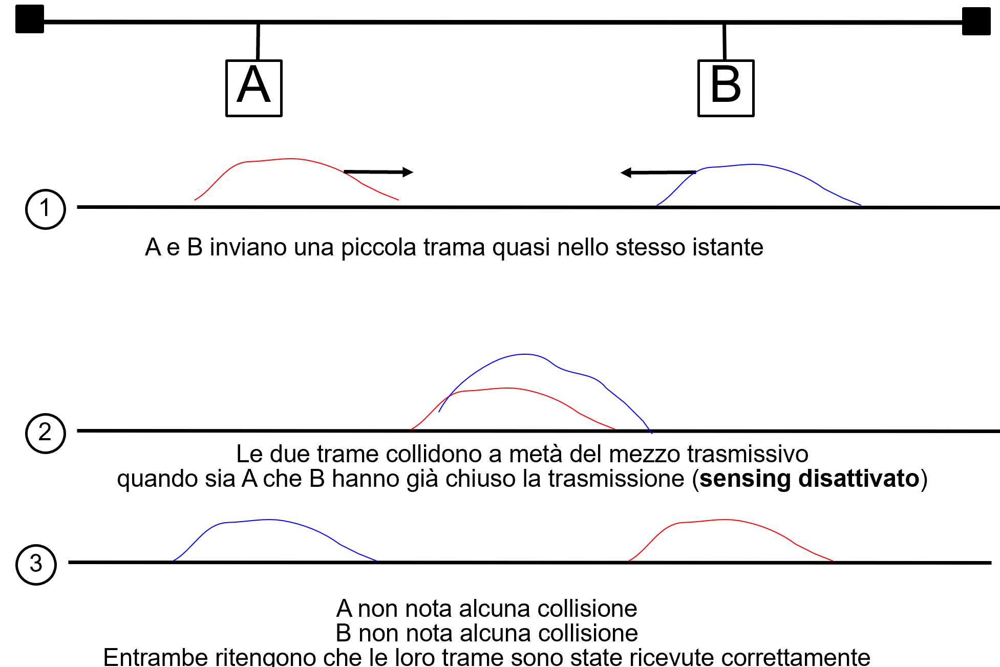

>[Torna a reti di sensori](sensornetworkshort.md#Interfaccia-radio)

## **CSMA/CD**

### **Fasi CSMA/CD basico**

Significa Carrier Sensing Multiple Access Collision Detection cioè protocollo di Accesso Multiplo con Ascolto della Portante (prima della trasmissione) e rilevazione della Collisione (durante la trasmissione).

Una stazione trasmittente:
- al momento che ha una trama pronta, ascolta il canale prima di trasmettere per stabilire se esso è libero o meno.
- Appena essa rileva il canale libero invia immediatamente la trama ma ascolta anche durante la trasmissione.
- L’ascolto durante la trasmissione serve a stabilire se sul canale è avvenuta o meno una collisione. 
- Se non vengono rilevati echi di collisione allora la trasmissione è avvenuta con successo.
- Altrimenti la stazione arresta la trasmissione corrente e ricomincia da zero la trasmissione della trama dopo un tempo casuale.
- Dopo molte volte che non si ricevono conferme (acknowledgement) allora la stazione abbandona l’dea di trasmettere.

### **Protocollo CSMA/CD basico in pseudocodice**

Soluzione di base per il TX

```C++
N=1;
while(N <= max){
	waitUntil(channelFree());
	sendAndListen(frame);
	waitUntil(endOfFrame() or collision());
	if(collision()){
		stopTransmitting();
		send(jamming);
	}else{
		/* no collision detected */
		wait(interframe_delay);
		exit while;
	}
	N=N+1;
}
/* troppi tentativi: rinuncio!*/
```


### **Possiamo determinare tutte le collisioni?**

- Se non si ascolta evidentemente no.
- Ma si ascolta solo finchè si trasmette…


### **Soluzione: trasmissione abbastanza lunga**

- Caso peggiore: il tramittente A è ad un capo e la collisione avviene all’altro capo quando trasmette pure B.
- Per ricevere l’eco della collisione A deve continuare ad ascoltare (cioè a trasmettere) finchè la trama corrotta non si propaga da B fino a lei.



### **Come rilevare tutte le collisioni?**

Caso peggiore: il tramittente A è ad un capo e la collisione avviene all’altro capo quando trasmette pure B.

Per ricevere l’eco della collisione A deve continuare ad ascoltare (cioè a trasmettere) finchè la trama corrotta non si propaga da B fino a lei.

Il tempo di propagazione da A a B per 10Mb/sec è 25.6 µsec
Il tempo di andata da A a B e poi di ritorno ad A è detto RTT (Round Trip Time) e alla velocità di 10Mb/sec è 51.2 µsec

Soluzione ? vincolo operativo: 
- ogni stazione deve ascoltare (cioè trasmettere) per un tempo minimo pari a un RTT cioè 51.2 µsec
- Se la velocità di trasmissione è fissa, la condizione sul tempo si traduce in una condizione sulla lunghezza minima della trama (nel caso di Ethernet 64 byte).
- Cioè ogni stazione deve trasmettere trame lunghe almeno 64 byte

### **Come reagire a fronte di una collisione?**

Soluzione: Backoff esponenziale
- È un tempo casuale
- È calcolato in maniera indipendente l’una dall’altra da tutte le stazioni
- Serve a determinare la stazione che deve trasmettere per prima minimizzando il rischio di trasmissioni contemporanee
- È calcolato all’interno di un intervallo (finestra) di contesa

Il tempo di Backoff si calcola in multipli interi di uno slot che è uguale ad un RTT (slot = 1 RTT) secondo la formula r = random(0, 2k – 1)*RTT
- 1-ma collisione : aspetta da 0 a 1 slot
- 2-da collisione : aspetta 0, 1,2 o 3 slots 
- i-esima collisione : aspetta 0..2i-1 slots 

### **Finestra di contesa**

La finestra di collisione o di contesa (contention Window o CW) è l’intervallo di valori all’interno del quale viene calcolato il tempo casuale di backoff

La finestra di collisione è deterministica (cioè ha un valore non casuale) e può essere fissa o variabile, ad es: [0  2k – 1]è variabile e dipende dal numero k di tentativi andati a vuoto.

Una finestra di collisione grande minimizza la probabilità di una collisione ma aumenta il ritardo medio prima della trasmissione che, a sua volta, diminuisce la velocità media di trasmissione.

Una finestra di collisione variabile realizza un buon compromesso tecnico: quando non ci sono collisioni è piccola e il ritardo è minimo, in presenza di collisioni essa si allarga gradatamente per diminuirne la probabilità ad ogni successivo tentativo.

Il tempo di backoff è un numero casuale calcolato tra un valore minimo ed un valore massimo che  rappresentano la finestra di collisione.
Nel caso del CSMA/CD:
```C++
	        k = min(10, N); //numero di tentativi
		r = random(0, 2k – 1)*RTT; //tempo di backoff
```
### **Procollo CSMA/CD completo in pseudocodice**
```C++
N=1;
while(N<= max){
	waitUntil(channelFree());
	sendAndListen(frame);
	waitUntil(endOfFrame() or collision()); 	
	if(collision()){
		stopTransmitting();
		send(jamming);
		k = min (10, N);
		r = random(0, 2k – 1);
		wait(r*RTT);
	}else{
		/* no collision detected */
		wait(interframe_delay);
		exit while;
	}
	N=N+1;
}
/* troppi tentativi: rinuncio!*/
```

### **Fasi CSMA/CD completo**

Le altre stazioni, quando ricevono la sequenza di jamming, sono avvisate della avvenuta collisione e:
- Se ricevevano, scaricano dal buffer di ricezione quanto ricevuto fino a quell momento
- Se trasmettevano, arrestano immediatamente la trasmissione e fanno partire l’algoritmo di backoff che stabilisce il ritardo casuale prima della ritrasmissione del messaggio interrotto.


### **Riassumendo CSMA e CSMA/CD**

Similitudini:
- CSMA e CSMA/CD devono implementare un meccanismo di ascolto del canale prima della trasmissione per stabilire se esso è libero o meno. 

Differenze:
- il CSMA rileva la collisione indirettamente dopo la trasmissione in fase di ricezione, a seguito del mancato arrivo del messaggio di ack (allo scadere di un timeout), Si tratta di una tecnica SW. Trasmissione e ricezione non devono essere contemporanee.
- Il CSMA/CD durante la trasmissione mantiene attiva anche la funzione di  ricezione che può rilevare una collisione perchè:
- Il segnale “ascoltato” durante la trasmissione ha una potenza più elevata di quello effettivamente trasmesso. É una tecnica HW.
- Il segnale “ascoltato” e decodificato durante la trasmissione ha un valore in bit diverso da quello trasmesso. É una tecnica SW.

>[Torna a reti di sensori](sensornetworkshort.md#Interfaccia-radio)
