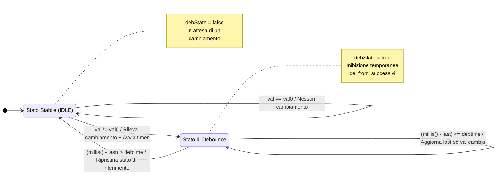

>[Torna all'indice](indexstatifiniti.md) >[versione in Python](indexstatifiniti_py.md)

#  **DEBOUNCER**

##  **Gestione di pulsanti con debouncer**

Questo esempio include due modalità di funzionamento:

### 1. Pulsante senza memoria (momentaneo)
- Il LED1 si accende solo quando il pulsante è premuto
- Quando il pulsante viene rilasciato, il LED si spegne
- Simile a un campanello o un pulsante di un citofono

### 2. Pulsante con memoria (toggle)
- Il LED2 cambia stato ad ogni pressione del pulsante
- Se il LED è spento, premendo si accende
- Se il LED è acceso, premendo si spegne
- Simile a un interruttore della luce in casa

Entrambe le modalità utilizzano lo stesso meccanismo di debounce avanzato che:
1. Rileva immediatamente il primo cambiamento
2. Inibisce successivi rilevamenti per il periodo di debounce
3. Gestisce correttamente gli overflow di `millis()`

Questo esempio presenta l'implementazione in modo più chiaro rispetto al codice del motore stepper, facilitando la comprensione del funzionamento del meccanismo di debounce.

###  **Esigenza**

# Esercitazione di Debouncing per il Controllo di LED

## Obiettivo del progetto
Realizzare un sistema dimostratito di controllo LED che implementi diverse tecniche di gestione dei pulsanti. Il sistema deve illustrare i concetti fondamentali del debouncing software, le macchine a stati e i diversi tipi di interazione utente tramite pulsanti (momentanea e con memoria).

## Requisiti funzionali

1. **Sistema di controllo LED**:
   - Implementazione di due modalità di controllo tramite pulsanti:
     - Modalità momentanea: LED acceso solo quando il pulsante è premuto
     - Modalità toggle (con memoria): LED cambia stato ad ogni pressione

2. **Interfaccia utente**:
   - Due pulsanti di controllo:
     - Pulsante 1: Controllo momentaneo del LED1 (senza memoria)
     - Pulsante 2: Controllo toggle del LED2 (con memoria)

3. **Implementazione di gestione avanzata del debounce**:
   - Sviluppo di un sistema di debounce che rilevi immediatamente il primo fronte ma inibisca temporaneamente i fronti successivi
   - Implementazione di una macchina a stati a due stati (IDLE e DEBOUNCE)
   - Gestione corretta dell'overflow di millis() per garantire stabilità a lungo termine

## Aspetti didattici
Il progetto dimostra:
- Differenza tra controlli momentanei e controlli con memoria (toggle)
- Implementazione di una macchina a stati per il debouncing
- Rilevamento immediato del primo fronte con successiva inibizione temporanea
- Programmazione non bloccante
- Gestione dell'overflow nei timer software
- Tecniche per migliorare l'esperienza utente riducendo falsi trigger

## Materiale necessario
- Arduino Nano o compatibile
- Due LED con relativi resistori limitatori di corrente
- Due pulsanti
- Resistori di pull-up per i pulsanti (se non si utilizzano i pull-up interni)
- Breadboard e cavi di collegamento

## Considerazioni finali
Questo progetto è perfetto come introduzione alle tecniche di debouncing e alla gestione dell'input utente. Può essere utilizzato come base per sistemi più complessi di domotica o automazione che richiedono un'interfaccia utente semplice ma affidabile. L'implementazione della macchina a stati per il debouncing rappresenta un approccio robusto che può essere esteso anche ad altre applicazioni.


## Tabella delle Transizioni del Debouncer

### Definizione delle Variabili
- **pin**: Pin di Arduino collegato al pulsante
- **val0**: Ultimo valore letto (per rilevare cambiamenti)
- **val**: Valore attuale letto dal pin
- **val00**: Ultimo stato stabile (dopo il debounce)
- **last**: Timestamp dell'ultimo cambiamento
- **debState**: Flag stato del debounce (true = in debounce, false = rilevamento abilitato)
- **debtime**: Tempo di debounce in millisecondi
- **chg**: Flag che indica se è stato rilevato un cambiamento valido

## Tabella delle Transizioni

| Stato Attuale | Condizione | Azione | Prossimo Stato | Output (chg) |
|---------------|------------|--------|---------------|--------------|
| IDLE<br>(debState = false) | val == val0 | val0 = val<br>val00 = val | IDLE | false |
| IDLE<br>(debState = false) | val != val0 | debState = true<br>last = millis()<br>val0 = val<br>val00 = val | DEBOUNCE | true |
| DEBOUNCE<br>(debState = true) | val != val0 | last = millis()<br>val0 = val | DEBOUNCE | false |
| DEBOUNCE<br>(debState = true) | val == val0 | val0 = val | DEBOUNCE | false |
| DEBOUNCE<br>(debState = true) | (millis() - last) > debtime | debState = false<br>val0 = val00 | IDLE | false |

## Caratteristiche della Macchina a Stati
1. **Rilevamento immediato**: Il primo cambiamento di stato viene rilevato immediatamente (chg = true)
2. **Periodo di inibizione**: Dopo il primo cambio, tutti i fronti successivi vengono ignorati per un periodo configurabile
3. **Reset del timer**: Se durante il periodo di debounce lo stato continua a cambiare, il timer viene resettato
4. **Ripristino stato di riferimento**: Al termine del debounce, lo stato di riferimento viene reimpostato all'ultimo stato stabile

## Comportamento agli eventi
- **Pulsante premuto/rilasciato**: Viene rilevato immediatamente e poi viene attivato il periodo di inibizione
- **Rimbalzi del contatto**: Vengono filtrati durante il periodo di debounce
- **Nuova pressione dopo debounce**: Viene rilevata come nuovo evento

Questa implementazione di debouncing rileva subito il primo fronte ma ignora i successivi cambiamenti per un periodo definito, combinando reattività e stabilità.

##  **Diagramma degli stati**



##  **Soluzione in logica "prima gli stati"**

Ecco un esempio semplificato che utilizza la tua struttura di debounce per controllare LED con e senza memoria:

```cpp
#define BUTTON1_PIN 2     // Pulsante momentaneo (senza memoria)
#define BUTTON2_PIN 3     // Pulsante toggle (con memoria)
#define LED1_PIN 8        // LED controllato senza memoria
#define LED2_PIN 9        // LED controllato con memoria
#define DEBOUNCETIME 50   // Tempo di debounce in ms

/**
 * Struttura Button per gestione avanzata del debounce
 * 
 * Rileva immediatamente cambiamenti di stato e inibisce 
 * temporaneamente il rilevamento dei fronti successivi
 */
struct Button {
  uint8_t pin;           // Pin di Arduino collegato al pulsante
  uint8_t val0;          // Ultimo valore letto
  unsigned long debtime; // Tempo di debounce in millisecondi
  uint8_t val;           // Valore attuale letto
  uint8_t val00;         // Ultimo stato stabile
  unsigned long last;    // Timestamp ultimo cambiamento
  bool debState;         // Flag per stato debounce (true = in debounce)
  
  /**
   * Rileva cambiamenti di stato con debounce
   * @return true se è stato rilevato un cambiamento stabile
   */
  bool changed() {
    bool chg;

    val = digitalRead(pin);
    if(!debState) {
      // Stato normale: attesa di un cambiamento
      if(val != val0) {
        // Primo cambiamento rilevato - attiva subito
        debState = true;
        last = millis();
        chg = true;
      } else {
        chg = false;
      }
      val0 = val;
      val00 = val;  // Memorizza ultimo stato valido
    } else {
      // In debounce: ignora cambiamenti
      if(val != val0) {
        // Resetta timer se continua a cambiare
        last = millis();
      }
      val0 = val;
      chg = false;
      
      // Gestione sicura dell'overflow di millis()
      if((unsigned long)(millis() - last) > debtime) {
        debState = false;  // Fine debounce
        val0 = val00;      // Ripristina stato di riferimento
      }
    }
        
    return chg;     
  }
};

// Inizializzazione pulsanti
Button buttonMomentary = {BUTTON1_PIN, LOW, 50};  // Pulsante senza memoria
Button buttonToggle = {BUTTON2_PIN, LOW, 50};     // Pulsante con memoria

// Stato per il pulsante con memoria
bool toggleState = false;

void setup() {
  Serial.begin(115200);
  
  // Configurazione I/O
  pinMode(BUTTON1_PIN, INPUT_PULLUP);  // Pulsanti con resistenza pullup
  pinMode(BUTTON2_PIN, INPUT_PULLUP);
  pinMode(LED1_PIN, OUTPUT);           // LED 
  pinMode(LED2_PIN, OUTPUT);
  
  // Stato iniziale LED
  digitalWrite(LED1_PIN, LOW);
  digitalWrite(LED2_PIN, LOW);
  
  Serial.println("Sistema di controllo LED inizializzato");
  Serial.println("- Pulsante 1: Controllo momentaneo (senza memoria)");
  Serial.println("- Pulsante 2: Controllo toggle (con memoria)");
}

void loop() {
  // 1. PULSANTE SENZA MEMORIA (momentaneo)
  // Accende il LED solo quando il pulsante è premuto
  if(buttonMomentary.changed()) {
    // Il pulsante ha cambiato stato
    if(buttonMomentary.val == LOW) {  // Con pullup, LOW = premuto
      digitalWrite(LED1_PIN, HIGH);
      Serial.println("Pulsante 1 premuto - LED 1 acceso");
    } else {
      digitalWrite(LED1_PIN, LOW);
      Serial.println("Pulsante 1 rilasciato - LED 1 spento");
    }
  }
  
  // 2. PULSANTE CON MEMORIA (toggle)
  // Cambia lo stato del LED ad ogni pressione
  if(buttonToggle.changed()) {
    if(buttonToggle.val == LOW) {  // Solo sulla pressione (non sul rilascio)
      toggleState = !toggleState;  // Inverte lo stato
      digitalWrite(LED2_PIN, toggleState);
      Serial.print("Pulsante 2 premuto - LED 2 ");
      Serial.println(toggleState ? "acceso" : "spento");
    }
  }
  
  delay(1);  // Breve pausa per stabilità
}
```
- Simulazione base su Esp32 con Wowki: https://wokwi.com/projects/426050075651040257
- Simulazione su Esp32 con Wowki di un motore stepper con comandi protetti da debouncer: https://wokwi.com/projects/426024956545802241


>[Torna all'indice](indexstatifiniti.md) >[versione in Python](indexstatifiniti_py.md)
