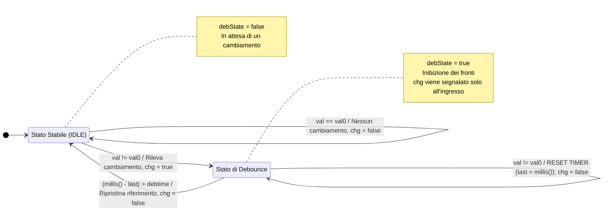

>[Torna all'indice](indexstatifiniti.md) >[versione in Python](indexstatifiniti_py.md)

#  **DEBOUNCER**

##  **Gestione di pulsanti con debouncer**

Questo esempio include due modalità di funzionamento:

### 1. Pulsante senza memoria (momentaneo)
- Il LED1 si accende solo quando il pulsante è premuto
- Quando il pulsante viene rilasciato, il LED si spegne
- Simile a un campanello o un pulsante di un citofono

### 2. Pulsante con memoria (toggle)
- Il LED2 cambia stato ad ogni pressione del pulsante
- Se il LED è spento, premendo si accende
- Se il LED è acceso, premendo si spegne
- Simile a un interruttore della luce in casa

Entrambe le modalità utilizzano lo stesso meccanismo di debounce avanzato che:
1. Rileva immediatamente il primo cambiamento
2. Inibisce successivi rilevamenti per il periodo di debounce
3. Gestisce correttamente gli overflow di `millis()`


# Esercitazione di controllo con Debouncing per l'accensione di un LED

## Obiettivo del progetto
Realizzare un sistema dimostrativo di controllo LED che implementi diverse tecniche di gestione dei pulsanti. Il sistema deve illustrare i concetti fondamentali del debouncing software, le macchine a stati e i diversi tipi di interazione utente tramite pulsanti (momentanea e con memoria).

## Requisiti funzionali

1. **Sistema di controllo LED**:
   - Implementazione di due modalità di controllo tramite pulsanti:
     - Modalità momentanea: LED acceso solo quando il pulsante è premuto
     - Modalità toggle (con memoria): LED cambia stato ad ogni pressione

2. **Interfaccia utente**:
   - Due pulsanti di controllo:
     - Pulsante 1: Controllo momentaneo del LED1 (senza memoria)
     - Pulsante 2: Controllo toggle del LED2 (con memoria)

3. **Implementazione di gestione del debounce**:
   - Sviluppo di un sistema di debounce che rilevi immediatamente il primo fronte ma inibisca temporaneamente i fronti successivi
   - Implementazione di una macchina a stati a due stati (IDLE e DEBOUNCE)
   - Gestione corretta dell'overflow di millis() per garantire stabilità a lungo termine

## Aspetti didattici
Il progetto dimostra:
- Differenza tra controlli momentanei e controlli con memoria (toggle)
- Implementazione di una macchina a stati per il debouncing
- Rilevamento immediato del primo fronte con successiva inibizione temporanea
- Programmazione non bloccante
- Gestione dell'overflow nei timer software
- Tecniche per migliorare l'esperienza utente riducendo falsi trigger

## Materiale necessario
- Arduino Nano o compatibile
- Due LED con relativi resistori limitatori di corrente
- Due pulsanti
- Resistori di pull-up per i pulsanti (se non si utilizzano i pull-up interni)
- Breadboard e cavi di collegamento

## Considerazioni finali
Questo progetto è utile come introduzione alle tecniche di debouncing e alla gestione dell'input utente. Può essere utilizzato come base per sistemi più complessi di domotica o automazione che richiedono un'interfaccia utente semplice ma affidabile. L'implementazione della macchina a stati per il debouncing rappresenta un approccio robusto che può essere esteso anche ad altre applicazioni.

## Approcci al debouncing

Questa implementazione di debouncing rileva subito il **primo fronte** ma ignora i successivi cambiamenti per un periodo definito, combinando reattività e stabilità.

Dal punto di vista concettuale, ci sono due approcci legittimi al debouncing, ma con comportamenti e finalità diverse:

1. **Approccio a singola rilevazione (fronte di ingresso)**: 
   - Rileva solo la transizione iniziale, ignorando i rimbalzi successivi
   - Segnala `chg = true` solo all'ingresso nello stato di debounce
   - Ideale per pulsanti che controllano toggle, contatori, o eventi singoli

2. **Approccio a doppia rilevazione (fronte di ingresso e di uscita)**:
   - Rileva sia la transizione iniziale che la conclusione del periodo di debounce
   - Segnala `chg = true` all'ingresso nello stato di debounce E all'uscita
   - Utile per monitorare la durata stabile di un segnale o per gestire eventi sia all'inizio che alla fine di un input

Tuttavia, per la maggior parte delle applicazioni con pulsanti (come il controllo di LED o motori), l'approccio a singola rilevazione è generalmente più appropriato, poiché permette di eseguire l'azione una sola volta all'inizio della pressione, senza generare eventi aggiuntivi alla fine del periodo di debounce.

Se l'obiettivo è rilevare solo la pressione iniziale, allora bisogna mantenere `chg = false` nella transizione da DEBOUNCE a IDLE.

## Vantaggi dell'Approccio a Singola Rilevazione
- Ideale per pulsanti che controllano toggle (on/off)
- Previene duplicazione di eventi o conteggi multipli
- Più intuitivo per la maggior parte delle interfacce utente
- Simula efficacemente il comportamento di debouncing hardware con flip-flop

Questo approccio è particolarmente utile quando desideri rilevare solo l'inizio di un'azione (come la pressione di un pulsante) e vuoi ignorare completamente eventuali false rilevazioni dovute ai rimbalzi elettrici dei contatti.


# Tabella delle Transizioni - Approccio a Singola Rilevazione

## Definizione delle Variabili
- **pin**: Pin di Arduino collegato al pulsante
- **val0**: Ultimo valore letto (per rilevare cambiamenti)
- **val**: Valore attuale letto dal pin
- **val00**: Ultimo stato stabile (dopo il debounce)
- **last**: Timestamp dell'ultimo cambiamento
- **debState**: Flag stato del debounce (true = in debounce, false = rilevamento abilitato)
- **debtime**: Tempo di debounce in millisecondi
- **chg**: Flag che indica se è stato rilevato un cambiamento valido

## Tabella delle Transizioni

| Stato Attuale | Condizione | Azione | Prossimo Stato | Output (chg) |
|---------------|------------|--------|---------------|--------------|
| IDLE<br>(debState = false) | val == val0 | val0 = val<br>val00 = val | IDLE | false |
| IDLE<br>(debState = false) | val != val0 | debState = true<br>last = millis()<br>val0 = val<br>val00 = val | DEBOUNCE | **true** |
| DEBOUNCE<br>(debState = true) | val != val0 | last = millis()<br>val0 = val | DEBOUNCE | false |
| DEBOUNCE<br>(debState = true) | val == val0 | val0 = val | DEBOUNCE | false |
| DEBOUNCE<br>(debState = true) | (millis() - last) > debtime | debState = false<br>val0 = val00 | IDLE | **false** |

## Caratteristiche dell'Approccio a Singola Rilevazione
1. **Rilevamento solo al fronte iniziale**: L'evento viene segnalato (`chg = true`) solo quando si entra nello stato DEBOUNCE dalla transizione IDLE → DEBOUNCE
2. **Nessun evento alla fine del debounce**: Il ritorno allo stato IDLE non genera un evento (`chg = false`)
3. **Reset del timer durante i rimbalzi**: Se lo stato continua a cambiare durante il periodo di debounce, il timer viene resettato
4. **Filtraggio completo dei rimbalzi**: Tutti gli eventi durante il periodo di debounce vengono ignorati


## Caratteristiche della Macchina a Stati
1. **Rilevamento immediato**: Il primo cambiamento di stato viene rilevato immediatamente (chg = true)
2. **Periodo di inibizione**: Dopo il primo cambio, tutti i fronti successivi vengono ignorati per un periodo configurabile
3. **Reset del timer**: Se durante il periodo di debounce lo stato continua a cambiare, il timer viene resettato
4. **Ripristino stato di riferimento**: Al termine del debounce, lo stato di riferimento viene reimpostato all'ultimo stato stabile

## Comportamento agli eventi
- **Pulsante premuto/rilasciato**: Viene rilevato immediatamente e poi viene attivato il periodo di inibizione
- **Rimbalzi del contatto**: Vengono filtrati durante il periodo di debounce
- **Nuova pressione dopo debounce**: Viene rilevata come nuovo evento


##  **Diagramma degli stati**



##  **Soluzione in logica "prima gli stati"**

La **FSM** che modella il comportamento del pulsante è del tutto **indipendente** ed **isolata** rispetto alla logica principale del programma. Il codice, che implementa la macchina a stati finiti sia del debouncer che del rilevamento dei fronti, è tutta **incapsulata** all'interno dell'**oggetto pulsante**, realizzato, in questo caso, con una **struct** (membri e proprietà **pubblici** di default).

L'inizializzazione dei parametri degli **oggetti statici** è effettuata al momento della dichiarazione mediante ```Button buttonMomentary = {BUTTON1_PIN, LOW, 50}``` utilizzando la notazione ```{}``` che racchiude la **lista** completa dei **membri contigui** da inizializzare dentro le **parentesi graffe**.

L'ultimo **valore valido** è sempre quello che permane **immutato** tra l'**inizio** e la **fine** dell'**intervallo di debounce**.

Si noti che  chg = true in **due cas**i:
- un **fronte** determinato a seguito di una pressione o di un rilascio di un tasto rilevato dalla **differenza** del valore **attuale** con il **valore al loop precedente**.
- un **fronte** determinato a seguito di una pressione o di un rilascio di un tasto rilevato dalla **differenza** del valore **attuale** con l'**ultimo valore valido**. 


Ecco un esempio semplificato che utilizza la tua struttura di debounce per controllare LED con e senza memoria:

```cpp
/**
 * Struttura Button con debouncing a singola rilevazione
 * 
 * Questo debouncer rileva SOLO il fronte iniziale di un cambiamento
 * e ignora tutti i rimbalzi e fronti successivi durante il periodo
 * di debounce. Ritorna a stato stabile senza generare eventi.
 */
struct Button {
  uint8_t pin;           // Pin di Arduino collegato al pulsante
  uint8_t val0;          // Ultimo valore letto
  unsigned long debtime; // Tempo di debounce in millisecondi
  uint8_t val;           // Valore attuale letto
  uint8_t val00;         // Ultimo stato stabile
  unsigned long last;    // Timestamp ultimo cambiamento
  bool debState;         // Flag per stato debounce (true = in debounce)
  
  /**
   * Verifica se c'è stato un cambiamento valido dello stato del pulsante.
   * Rileva solo il fronte iniziale del cambiamento, non la fine del debounce.
   * 
   * @return true solo al rilevamento del primo fronte, false altrimenti
   */
  bool changed() {
    bool chg = false;    // Default: nessun cambiamento rilevato
    val = digitalRead(pin);
    
    if(!debState) {      // STATO IDLE: attesa di un cambiamento
      if(val != val0) {  // Rilevato cambiamento
        debState = true;  // Attiva stato di debounce
        last = millis();  // Memorizza timestamp
        chg = true;       // Segnala cambiamento (SOLO QUI)
        val0 = val;       // Aggiorna ultimo valore letto
        val00 = val;      // Memorizza stato valido
      } 
    } else {              // STATO DEBOUNCE: filtraggio rimbalzi
      if(val != val0) {   // Se lo stato continua a cambiare
        last = millis();  // Reset del timer di debounce
	val0 = val;         // Aggiorna ultimo valore letto
      }else if((unsigned long)(millis() - last) > debtime) {
        debState = false;  // Torna a stato stabile
        val0 = val00;      // Ripristina stato di riferimento
        // chg rimane false quando il debounce termina
      }
    }
    
    return chg;  // Ritorna true solo sul fronte iniziale
  }
};

// Esempio di utilizzo
Button buttonToggle = {2, LOW, 50, 0, 0, 0, false};  // Pin 2, debounce 50ms
Button buttonMomentary = {3, LOW, 50, 0, 0, 0, false};  // Pin 3, debounce 50ms

void setup() {
  pinMode(buttonToggle.pin, INPUT_PULLUP);
  pinMode(buttonMomentary.pin, INPUT_PULLUP);
  pinMode(LED_BUILTIN, OUTPUT);
}

// Variabile di stato per il toggle
bool ledState = false;

void loop() {
  // 1. PULSANTE SENZA MEMORIA (momentaneo)
  // Accende il LED solo quando il pulsante è premuto
  if(buttonMomentary.changed()) {
    // Il pulsante ha cambiato stato
    if(buttonMomentary.val == HIGH) {  // Con pullup, LOW = premuto
      digitalWrite(LED1_PIN, HIGH);
      Serial.println("Pulsante 1 premuto - LED 1 acceso");
    } else {
      digitalWrite(LED1_PIN, LOW);
      Serial.println("Pulsante 1 rilasciato - LED 1 spento");
    }
  }
  
  // 2. PULSANTE CON MEMORIA (toggle)
  // Cambia lo stato del LED ad ogni pressione
  if(buttonToggle.changed()) {
    if(buttonToggle.val == HIGH) {  // Solo sulla pressione (non sul rilascio)
      toggleState = !toggleState;  // Inverte lo stato
      digitalWrite(LED2_PIN, toggleState);
      Serial.print("Pulsante 2 premuto - LED 2 ");
      Serial.println(toggleState ? "acceso" : "spento");
    }
  }
  
  delay(1);  // Breve pausa per stabilità
}
```
- Simulazione su Esp32 con Wowki dell'esempio base essposto sopra: https://wokwi.com/projects/426050075651040257
- Simulazione su Arduino Nano con Wowki del driver di un motore stepper con comandi protetti da debouncer: https://wokwi.com/projects/426024956545802241

>[Torna all'indice](indexstatifiniti.md) >[versione in Python](indexstatifiniti_py.md)
