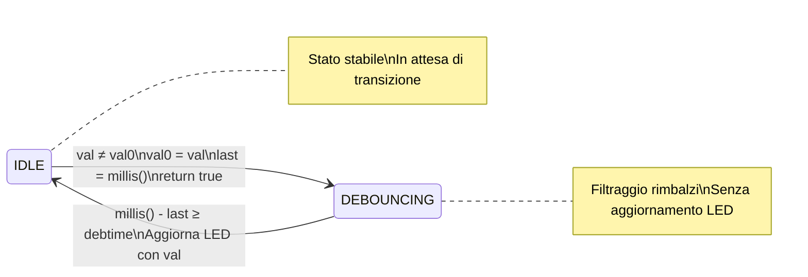

>[Torna all'indice](indexstatifiniti.md) >[versione in Python](indexstatifiniti_py.md)

#  **DEBOUNCER 2**

# Consegna Progetto: Implementazione di una Struttura per il Debounce dei Pulsanti

## Obiettivo
Creare una struttura `Button` che implementi una macchina a stati per gestire il debounce dei pulsanti in Arduino, seguendo l'approccio della rilevazione del fronte iniziale con aggiornamento dell'output solo al termine del periodo di debounce.

## Requisiti

### Struttura `Button`
Implementare una struttura `Button` con i seguenti campi:
- `pin`: pin di Arduino collegato al pulsante (uint8_t)
- `val0`: ultimo valore letto dal pulsante (uint8_t)
- `debtime`: tempo di debounce in millisecondi (unsigned long)
- `val`: valore attuale letto dal pulsante (uint8_t)
- `last`: timestamp dell'ultimo cambiamento rilevato (unsigned long)
- `debState`: flag per lo stato di debounce (bool, true = in debounce)

### Funzionalità Richieste
La struttura deve implementare le seguenti funzioni:

1. **`changed()`**:
   - Rileva se c'è stato un cambiamento valido dello stato del pulsante
   - Gestisce la transizione da IDLE a DEBOUNCING
   - Ritorna `true` solo al rilevamento del primo fronte, `false` altrimenti

2. **`debounceComplete()`**:
   - Verifica se il periodo di debounce è completato
   - Gestisce la transizione da DEBOUNCING a IDLE
   - Ritorna `true` quando il debounce è appena terminato, `false` altrimenti

3. **Costruttore**:
   - Accetta il pin del pulsante e un tempo di debounce opzionale (default TXTIME)
   - Inizializza tutte le variabili e configura il pin come INPUT

### Comportamento della Macchina a Stati
Implementare una macchina a stati con i seguenti stati:
- **IDLE**: Il sistema è in attesa di un cambiamento del segnale
- **DEBOUNCING**: Il sistema sta filtrando i rimbalzi del pulsante

La logica di transizione deve essere la seguente:
- Da IDLE a DEBOUNCING: quando viene rilevata una transizione
- Da DEBOUNCING a IDLE: quando è trascorso il tempo di debounce

### Specifiche di Aggiornamento dell'Output
- L'aggiornamento dell'output (LED) deve avvenire **solo** quando il periodo di debounce è completato
- Durante lo stato di debounce, eventuali cambiamenti dell'input devono essere ignorati

## Esempio di Utilizzo
Includere nel codice un esempio che mostri:
- Come istanziare un oggetto `Button` collegato a un pin specifico
- Come utilizzare le funzioni `changed()` e `debounceComplete()` nel loop principale
- Come aggiornare un LED solo al termine del periodo di debounce

## Criteri di Valutazione
- Correttezza dell'implementazione della macchina a stati
- Efficienza e chiarezza del codice
- Rispetto dei requisiti specifici (aggiornamento dell'output solo al termine del debounce)
- Funzionalità del sistema in condizioni reali di utilizzo

## Note Aggiuntive
- Il tempo di debounce predefinito (TXTIME) è impostato a 100 millisecondi
- Il sistema deve essere in grado di gestire più pulsanti istanziando più oggetti `Button`
- Il codice deve essere ben commentato per spiegare la logica di funzionamento


# Tabella delle Transizioni del Sistema di Debounce

## Stati
- **IDLE**: Sistema in attesa di un cambiamento del segnale di input
- **DEBOUNCING**: Sistema in fase di filtraggio dei rimbalzi (debounce)

## Variabili di Stato
- **val**: Valore attuale letto dal pin
- **val0**: Ultimo valore letto (potenzialmente instabile)
- **val00**: Ultimo stato stabile confermato
- **last**: Timestamp dell'ultimo cambiamento rilevato
- **debState**: Flag che indica lo stato corrente (false = IDLE, true = DEBOUNCING)
- **debtime**: Tempo di attesa per il debounce (tipicamente TXTIME = 100ms)

# Tabella delle Transizioni - Button Aggiornato

## Stati
- **IDLE**: Sistema in attesa di un cambiamento del segnale di input (debState = false)
- **DEBOUNCING**: Sistema in fase di filtraggio dei rimbalzi (debState = true)

## Variabili di Stato
- **val**: Valore attuale letto dal pin
- **val0**: Ultimo valore letto (equivalente a precval nel secondo codice)
- **last**: Timestamp dell'ultimo cambiamento rilevato (equivalente a btntime)
- **debState**: Flag che indica lo stato corrente (false = IDLE, true = DEBOUNCING)
- **debtime**: Tempo di attesa per il debounce (tipicamente TXTIME = 100ms)

## Tabella delle Transizioni

| Stato Attuale | Funzione        | Condizione                | Azioni                                          | Stato Successivo | Valore Ritornato |
|---------------|-----------------|---------------------------|------------------------------------------------|------------------|------------------|
| IDLE          | changed()       | val = val0                | Nessuna                                         | IDLE             | false            |
| IDLE          | changed()       | val ≠ val0                | val0 = val<br>last = millis()<br>debState = true | DEBOUNCING       | true             |
| DEBOUNCING    | changed()       | qualsiasi                 | Nessuna                                         | DEBOUNCING       | false            |
| DEBOUNCING    | debounceComplete() | millis() - last < debtime | Nessuna                                      | DEBOUNCING       | false            |
| DEBOUNCING    | debounceComplete() | millis() - last ≥ debtime | debState = false                             | IDLE             | true             |

## Logica del Sistema

1. **In stato IDLE**:
   - Se viene rilevata una transizione (val ≠ val0), il sistema:
     - Registra il nuovo valore (val0 = val)
     - Memorizza il timestamp (last = millis())
     - Passa allo stato DEBOUNCING (debState = true)
     - La funzione `changed()` segnala la transizione (return true)

2. **In stato DEBOUNCING**:
   - La funzione `changed()` continua a leggere il valore attuale ma ritorna sempre false
   - Il sistema attende che passi il tempo di debounce (debtime)
   - Quando viene chiamata `debounceComplete()`:
     - Se il tempo di debounce è completato:
       - Il sistema ritorna allo stato IDLE (debState = false)
       - La funzione `debounceComplete()` ritorna true
       - Nel loop principale, quando `debounceComplete()` ritorna true, viene aggiornato il LED con il valore attuale (val)

3. **Comportamento complessivo**:
   - Il sistema segnala una transizione solo al primo cambiamento rilevato
   - L'aggiornamento dell'output (LED) avviene solo quando il debounce è completato
   - Durante il debounce, tutte le variazioni dell'input vengono ignorate


##  **Diagramma degli stati**



##  **Soluzione in logica "prima gli stati"**

La **FSM** che modella il comportamento del pulsante è del tutto **indipendente** ed **isolata** rispetto alla logica principale del programma. Il codice, che implementa la macchina a stati finiti sia del debouncer che del rilevamento dei fronti, è tutta **incapsulata** all'interno dell'**oggetto pulsante**, realizzato, in questo caso, con una **struct** (membri e proprietà **pubblici** di default).

L'inizializzazione dei parametri degli **oggetti statici** è effettuata al momento della dichiarazione mediante ```Button buttonMomentary = {BUTTON1_PIN, LOW, 50}``` utilizzando la notazione ```{}``` che racchiude la **lista** completa dei **membri contigui** da inizializzare dentro le **parentesi graffe**.

Ecco un esempio semplificato che utilizza la tua struttura di debounce per controllare LED con e senza memoria:

```cpp
#define TXTIME 100  // Tempo di debounce in millisecondi

struct Button {
  uint8_t pin;           // Pin di Arduino collegato al pulsante
  uint8_t val0;          // Ultimo valore letto (equivalente a precval)
  unsigned long debtime; // Tempo di debounce in millisecondi
  uint8_t val;           // Valore attuale letto
  unsigned long last;    // Timestamp ultimo cambiamento (equivalente a btntime)
  bool debState;         // Flag per stato debounce (true = in debounce, equivalente a stato == DEBOUNCING)
  
  /**
   * Verifica se c'è stato un cambiamento valido dello stato del pulsante.
   * Rileva il cambiamento e gestisce lo stato del debounce.
   * @return true se è stata rilevata una transizione, false altrimenti
   */
  bool changed() {
    val = digitalRead(pin);  // Legge il valore attuale del pin
    bool transitionDetected = false;
    
    if (!debState) {  // Equivalente a stato == IDLE
      if (val != val0) {  // Transizione rilevata
        val0 = val;       // Aggiorna l'ultimo valore letto
        last = millis();  // Registra il timestamp dell'evento
        debState = true;  // Entra in stato debouncing
        transitionDetected = true;  // Segnala la transizione
      }
    } else {  // In stato DEBOUNCING
      if (millis() - last >= debtime) {  // Periodo di debounce completato
        debState = false;  // Torna in stato IDLE
      }
    }
    
    return transitionDetected;  // Ritorna true solo se è stata rilevata una transizione
  }
  
  /**
   * Verifica se il periodo di debounce è completato e aggiorna lo stato.
   * Da chiamare per controllare quando il periodo di debounce è terminato.
   * @return true se il periodo di debounce è appena terminato
   */
  bool debounceComplete() {
    if (debState && (millis() - last >= debtime)) {
      debState = false;  // Torna in stato IDLE
      return true;       // Segnala il completamento del debounce
    }
    return false;
  }

  // Costruttore
  Button(uint8_t _pin, unsigned long _debtime = TXTIME) {
    pin = _pin;
    debtime = _debtime;
    val0 = 0;
    val = 0;
    last = 0;
    debState = false;
    pinMode(pin, INPUT);
  }
};

// Esempio di utilizzo
byte led = 10;
Button button(3);  // Pulsante collegato al pin 3 con tempo di debounce predefinito

void setup() {
  pinMode(led, OUTPUT);
  Serial.begin(115200);
}

void loop() {
  if (button.changed()) {
    Serial.println("Transizione rilevata!");
  }
  
  if (button.debounceComplete()) {
    digitalWrite(led, button.val);  // Aggiorna il LED solo quando il debounce è completato
  }
}
```


>[Torna all'indice](indexstatifiniti.md) >[versione in Python](indexstatifiniti_py.md)
