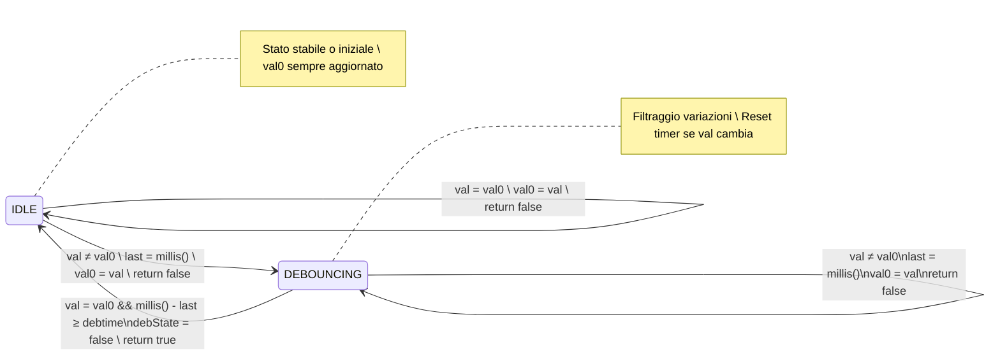

>[Torna all'indice](indexstatifiniti.md) >[versione in Python](indexstatifiniti_py.md)

#  **DEBOUNCER 2**

# Consegna Progetto: Rilevazione di Stabilità per Ingressi Digitali

## Obiettivo
Implementare una struttura `Button` che rilevi quando un segnale digitale (es. pulsante) ha raggiunto una condizione di stabilità per un periodo minimo di tempo. Il sistema deve aggiornare un'uscita (es. LED) solo quando il segnale è rimasto stabile, filtrando eventi brevi o instabili.

## Descrizione Funzionale
Il sistema deve:
1. Rilevare variazioni del segnale di ingresso
2. Attendere che il segnale rimanga stabile (senza variazioni) per un periodo minimo configurabile
3. Segnalare la condizione di stabilità solo dopo che tale periodo è trascorso
4. Resettare il timer di stabilità ogni volta che il segnale varia durante il periodo di attesa

## Requisiti Tecnici

### Struttura `Button`
Implementare una struttura `Button` con i seguenti campi:
- `pin`: numero del pin di Arduino collegato al pulsante (uint8_t)
- `val0`: ultimo valore letto dal pulsante (uint8_t)
- `debtime`: tempo minimo di stabilità richiesto in millisecondi (unsigned long)
- `val`: valore attuale letto dal pin (uint8_t)
- `last`: timestamp dell'ultima variazione rilevata (unsigned long)
- `debState`: flag per indicare lo stato di monitoraggio (bool)

### Funzione `changed()`
Implementare una funzione `changed()` che:
1. Legga il valore attuale del pin
2. Gestisca la macchina a stati per il monitoraggio della stabilità
3. Ritorni `true` SOLO quando:
   - Il segnale è rimasto stabile (senza variazioni) per l'intero periodo `debtime`
   - Il periodo di stabilità è appena terminato
4. Ritorni `false` in tutti gli altri casi
5. Aggiorni `val0` con l'ultimo valore letto in ogni chiamata
6. Resetti il timer (`last`) ogni volta che il segnale varia durante il monitoraggio

### Macchina a Stati
La struttura deve implementare una macchina a stati con due stati:
- **IDLE** (debState = false): sistema in attesa di variazioni
- **DEBOUNCING** (debState = true): sistema in monitoraggio della stabilità

### Comportamento del Sistema
- Quando rileva una variazione, il sistema deve entrare in stato DEBOUNCING e avviare il timer
- Ogni ulteriore variazione durante lo stato DEBOUNCING deve resettare il timer
- Solo quando il segnale rimane invariato per l'intero periodo `debtime`, il sistema deve segnalare la stabilità e tornare allo stato IDLE
- L'uscita (LED) deve essere aggiornata solo quando viene rilevata una condizione di stabilità

## Specifiche di Implementazione

### Costruttore
Implementare un costruttore che:
1. Accetti il numero del pin e un tempo di stabilità opzionale (default = TXTIME)
2. Inizializzi tutte le variabili interne
3. Configuri il pin come INPUT
4. Legga il valore iniziale del pin e lo imposti come valore di riferimento

### Esempio di Utilizzo
Includere un esempio completo che mostri:
- Come istanziare un oggetto `Button` collegato a un pin
- Come utilizzare la funzione `changed()` nel loop principale
- Come aggiornare un LED quando viene rilevata una condizione di stabilità

## Considerazioni Aggiuntive
- Questo approccio è particolarmente utile per interfacce utente che devono ignorare pressioni accidentali o brevi
- Il sistema filtra efficacemente sia i rimbalzi meccanici che le interazioni non intenzionali
- L'uscita verrà aggiornata solo quando l'ingresso è rimasto in uno stato costante per il periodo di tempo specificato

## Requisiti di Consegna
1. Codice completo e ben commentato della struttura `Button`
2. Diagramma degli stati che illustri il comportamento della macchina a stati
3. Esempio funzionante che dimostri il comportamento con un pulsante e un LED
4. Breve relazione che spieghi la logica di funzionamento e i casi d'uso appropriati

# Tabella delle Transizioni - Button (Rilevazione di stabilità)

## Stati
- **IDLE** (debState = false): Sistema in attesa di variazioni del segnale
- **DEBOUNCING** (debState = true): Sistema in fase di monitoraggio della stabilità

## Variabili di Stato
- **val**: Valore attuale letto dal pin
- **val0**: Ultimo valore letto (aggiornato continuamente)
- **last**: Timestamp dell'ultimo cambiamento rilevato
- **debState**: Flag che indica lo stato corrente (false = IDLE, true = DEBOUNCING)
- **debtime**: Tempo di stabilità richiesto (tipicamente TXTIME = 100ms)
- **chg**: Flag temporaneo per segnalare la rilevazione di stabilità

## Tabella delle Transizioni

| Stato Attuale | Condizione                               | Azioni                                         | Stato Successivo | Valore Ritornato |
|---------------|------------------------------------------|------------------------------------------------|------------------|------------------|
| IDLE          | val = val0                               | val0 = val                                      | IDLE             | false            |
| IDLE          | val ≠ val0                               | val0 = val<br>last = millis()<br>debState = true | DEBOUNCING       | false            |
| DEBOUNCING    | val ≠ val0                               | val0 = val<br>last = millis()                   | DEBOUNCING       | false            |
| DEBOUNCING    | val = val0<br>millis() - last < debtime  | Nessuna                                         | DEBOUNCING       | false            |
| DEBOUNCING    | val = val0<br>millis() - last ≥ debtime  | debState = false                                | IDLE             | true             |

## Logica del Sistema

1. **In stato IDLE**:
   - `val0` viene sempre aggiornato con il valore attuale `val`
   - Se viene rilevata una transizione (val ≠ val0), il sistema:
     - Registra il timestamp (last = millis())
     - Passa allo stato DEBOUNCING (debState = true)
     - Non segnala alcun cambiamento (chg = false)

2. **In stato DEBOUNCING**:
   - Se il valore continua a cambiare (val ≠ val0):
     - Il timestamp viene aggiornato (last = millis())
     - `val0` viene aggiornato con il nuovo valore
     - Non segnala alcun cambiamento (chg = false)
   - Se il valore rimane stabile (val = val0) per il periodo di debounce:
     - Torna allo stato IDLE (debState = false)
     - Segnala la stabilità raggiunta (chg = true)

3. **Comportamento complessivo**:
   - Il sistema monitora la stabilità del segnale, non il suo valore specifico
   - Ogni variazione del segnale durante il periodo di debounce resetta il timer
   - La funzione `changed()` ritorna `true` solo quando il segnale è rimasto stabile per l'intero periodo di debounce
   - `val0` viene continuamente aggiornato con l'ultimo valore letto

## Caratteristiche dell'Implementazione

1. **Rilevazione di stabilità**:
   - A differenza di un normale debounce che rileva cambiamenti di stato, questo sistema rileva periodi di stabilità
   - La funzione `changed()` non indica un "cambiamento" ma piuttosto "stabilità raggiunta"

2. **Reset continuo del timer**:
   - Ogni variazione del segnale durante lo stato DEBOUNCING resetta il timer
   - Questo garantisce che il segnale deve rimanere stabile per l'intero `debtime` prima di essere confermato

3. **Aggiornamento continuo di val0**:
   - `val0` non rappresenta un "valore stabile" ma semplicemente l'ultimo valore letto
   - Viene aggiornato continuamente sia in stato IDLE che in stato DEBOUNCING

4. **Comportamento con pulsanti reali**:
   - Pressioni o rilasci brevi (< debtime) non genereranno mai un segnale `true`
   - Solo quando il pulsante rimane in uno stato costante per almeno `debtime` millisecondi la funzione ritorna `true`
   - L'uscita (LED) viene aggiornata solo quando il segnale di ingresso è rimasto stabile per il periodo richiesto


##  **Diagramma degli stati**



##  **Soluzione in logica "prima gli stati"**

La **FSM** che modella il comportamento del pulsante è del tutto **indipendente** ed **isolata** rispetto alla logica principale del programma. Il codice, che implementa la macchina a stati finiti sia del debouncer che del rilevamento dei fronti, è tutta **incapsulata** all'interno dell'**oggetto pulsante**, realizzato, in questo caso, con una **struct** (membri e proprietà **pubblici** di default).

L'inizializzazione dei parametri degli **oggetti statici** è effettuata al momento della dichiarazione mediante ```Button buttonMomentary = {BUTTON1_PIN, LOW, 50}``` utilizzando la notazione ```{}``` che racchiude la **lista** completa dei **membri contigui** da inizializzare dentro le **parentesi graffe**.

Ecco un esempio semplificato che utilizza la tua struttura di debounce per controllare LED con e senza memoria:

```cpp
#define TXTIME 100  // Tempo di debounce in millisecondi

struct Button {
  uint8_t pin;           // Pin di Arduino collegato al pulsante
  uint8_t val0;          // Ultimo valore letto
  unsigned long debtime; // Tempo di debounce in millisecondi
  uint8_t val;           // Valore attuale letto
  unsigned long last;    // Timestamp ultimo cambiamento
  bool debState;         // Flag per stato debounce (true = in debounce)
  
  /**
   * Verifica se lo stato del pulsante è rimasto stabile per il periodo di debounce.
   * Rileva la stabilità solo DOPO che il periodo di debounce è completato.
   * Resetta il timer ogni volta che il valore cambia durante il debounce.
   * @return true solo quando il segnale è rimasto stabile per il periodo di debounce
   */
  bool changed() {
    bool chg = false;    // Default: nessun cambiamento rilevato
    
    val = digitalRead(pin);  // Legge il valore attuale del pin
    
    // Gestione della macchina a stati per il debounce
    if (!debState) {  // Equivalente a stato IDLE
      if (val != val0) {  // Transizione rilevata
        last = millis();  // Registra il timestamp dell'evento
        debState = true;  // Entra in stato debouncing
        chg = false;     // Non segnala ancora il cambiamento
      }
      val0 = val;      // Aggiorna il valore letto
    } else {  // In stato DEBOUNCING
      if(val != val0) {   // Se lo stato continua a cambiare
        last = millis();  // Reset del timer di debounce
        val0 = val;       // Aggiorna ultimo valore letto
      } else if (millis() - last >= debtime) {  // Periodo di debounce completato (val0 == val)
        debState = false; // Torna in stato IDLE
        chg = true;       // Segnala la stabilità (alla fine del debounce)
      }
    }
    
    return chg;  
  }

  // Costruttore
  Button(uint8_t _pin, unsigned long _debtime = TXTIME) {
    pin = _pin;
    debtime = _debtime;
    val = digitalRead(_pin);  // Legge il valore iniziale
    val0 = val;              // Imposta il valore iniziale
    last = 0;
    debState = false;
    pinMode(pin, INPUT);
  }
};

// Esempio di utilizzo
byte led = 10;
Button button(3);  // Pulsante collegato al pin 3 con tempo di debounce predefinito

void setup() {
  pinMode(led, OUTPUT);
  Serial.begin(115200);
}

void loop() {
  if (button.changed()) {
    Serial.println("Stato stabile rilevato!");
    digitalWrite(led, button.val0);  // Aggiorna il LED con il valore stabile
  }
}
```
Simulazione con Wokwi su ESP32: https://wokwi.com/projects/426258191241018369_

>[Torna all'indice](indexstatifiniti.md) >[versione in Python](indexstatifiniti_py.md)
