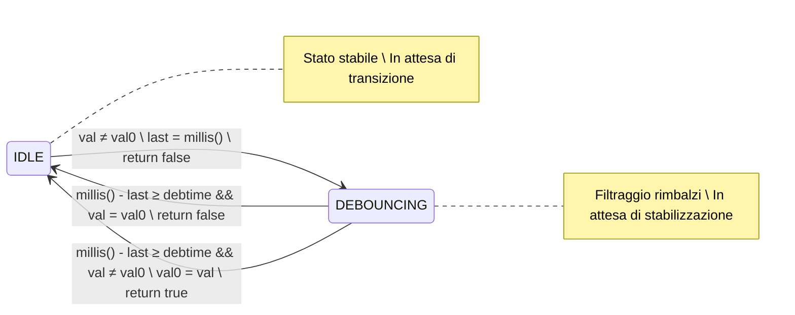

>[Torna all'indice](indexstatifiniti.md) >[versione in Python](indexstatifiniti_py.md)

#  **DEBOUNCER 2**

# Consegna Progetto: Implementazione di una Struttura per il Debounce dei Pulsanti

## Obiettivo
Creare una struttura `Button` che implementi una macchina a stati per gestire il debounce dei pulsanti in Arduino, con rilevazione del cambiamento di stato solo al termine del periodo di debounce.

## Specifiche Tecniche

### Struttura dati
Implementare una struttura `Button` con i seguenti campi:
- `pin`: pin di Arduino collegato al pulsante (tipo: uint8_t)
- `val0`: ultimo valore stabile del pulsante (tipo: uint8_t)
- `debtime`: tempo di debounce in millisecondi (tipo: unsigned long)
- `val`: valore attuale letto dal pulsante (tipo: uint8_t)
- `last`: timestamp dell'ultimo cambiamento rilevato (tipo: unsigned long)
- `debState`: flag per indicare lo stato di debounce (tipo: bool)

### Macchina a Stati
La struttura deve implementare una macchina a stati con due stati:
- **IDLE** (debState = false): sistema in attesa di un cambiamento
- **DEBOUNCING** (debState = true): sistema in fase di filtraggio dei rimbalzi

### Funzione `changed()`
Implementare una funzione `changed()` che:
1. Legga il valore attuale del pin
2. Gestisca la macchina a stati per il debounce
3. Ritorni `true` SOLO quando:
   - È stato rilevato un cambiamento di stato
   - Tale cambiamento è persistito per l'intero periodo di debounce
   - Il periodo di debounce è appena terminato
4. Ritorni `false` in tutti gli altri casi

### Comportamento Richiesto
- **Nessuna rilevazione all'inizio**: quando il valore del pin cambia, il sistema deve entrare in stato DEBOUNCING ma non segnalare subito il cambiamento
- **Rilevazione solo alla fine del debounce**: il cambiamento viene segnalato (`changed()` ritorna `true`) solo alla fine del periodo di debounce se il nuovo valore è stabile
- **Filtraggio dei rimbalzi**: se durante il periodo di debounce il valore torna uguale a quello originale, nessun cambiamento deve essere segnalato
- **Aggiornamento sincronizzato**: il valore stabile (val0) deve essere aggiornato solo quando un cambiamento è confermato stabile

### Costruttore
Implementare un costruttore che:
1. Accetti il numero del pin e un tempo di debounce opzionale (default = TXTIME)
2. Inizializzi tutte le variabili interne
3. Configuri il pin come INPUT
4. Legga il valore iniziale del pin e lo imposti come valore stabile iniziale

## Esempio di Utilizzo
Includere nel codice un esempio che mostri:
- Come istanziare un oggetto `Button` collegato a un pin
- Come utilizzare la funzione `changed()` nel loop principale di Arduino
- Come aggiornare un LED in base al valore stabile del pulsante

## Requisiti di Implementazione
1. Il codice deve essere chiaro e ben commentato
2. Il tempo di debounce predefinito (TXTIME) deve essere impostato a 100 millisecondi
3. La funzione `changed()` deve gestire correttamente tutte le transizioni di stato
4. L'aggiornamento del valore stabile deve avvenire solo quando un cambiamento è confermato

## Note Aggiuntive
- Testare l'implementazione con pulsanti reali per verificare il corretto filtraggio dei rimbalzi
- Considerare che un pulsante può cambiare stato più volte durante l'uso (pressioni multiple)
- L'implementazione deve essere efficiente e consumare poche risorse, considerando le limitazioni dell'hardware Arduino


# Tabella delle Transizioni - Button (Rilevazione alla fine del debounce)

## Stati
- **IDLE**: Sistema in attesa di un cambiamento del segnale di input (debState = false)
- **DEBOUNCING**: Sistema in fase di filtraggio dei rimbalzi (debState = true)

## Variabili di Stato
- **val**: Valore attuale letto dal pin
- **val0**: Ultimo valore stabile (non cambia durante il debounce)
- **last**: Timestamp dell'ultimo cambiamento rilevato
- **debState**: Flag che indica lo stato corrente (false = IDLE, true = DEBOUNCING)
- **debtime**: Tempo di attesa per il debounce (tipicamente TXTIME = 100ms)

## Tabella delle Transizioni

| Stato Attuale | Condizione                                | Azioni                                          | Stato Successivo | Valore Ritornato |
|---------------|--------------------------------------------|------------------------------------------------|------------------|------------------|
| IDLE          | val = val0                                | Nessuna                                         | IDLE             | false            |
| IDLE          | val ≠ val0                                | last = millis()<br>debState = true              | DEBOUNCING       | false            |
| DEBOUNCING    | millis() - last < debtime                 | Nessuna                                         | DEBOUNCING       | false            |
| DEBOUNCING    | millis() - last ≥ debtime<br>val = val0   | debState = false                                | IDLE             | false            |
| DEBOUNCING    | millis() - last ≥ debtime<br>val ≠ val0   | val0 = val<br>debState = false                  | IDLE             | true             |

## Logica del Sistema

1. **In stato IDLE**:
   - Se viene rilevata una transizione (val ≠ val0), il sistema:
     - Memorizza il timestamp (last = millis())
     - Passa allo stato DEBOUNCING (debState = true)
     - NON segnala la transizione (return false)

2. **In stato DEBOUNCING**:
   - Il sistema attende che passi il tempo di debounce (debtime)
   - Una volta trascorso il tempo:
     - Se il valore è ancora diverso da quello stabile (val ≠ val0):
       - Aggiorna il valore stabile (val0 = val)
       - Torna allo stato IDLE (debState = false)
       - Segnala il cambiamento stabile (return true)
     - Se il valore è tornato uguale a quello stabile (val = val0):
       - Era solo un rimbalzo, torna allo stato IDLE (debState = false)
       - Non segnala alcun cambiamento (return false)

3. **Comportamento complessivo**:
   - Il sistema segnala un cambiamento solo DOPO che il periodo di debounce è completato
   - Il valore stabile (val0) viene aggiornato solo quando un cambiamento è confermato
   - I rimbalzi che tornano al valore originale vengono completamente filtrati
   - L'aggiornamento dell'output (LED) avviene solo quando è confermato un cambiamento stabile

## Caratteristiche dell'Implementazione
1. **Rilevamento solo alla fine del debounce**:
   - La funzione `changed()` ritorna `true` solo quando un cambiamento è confermato stabile
   - Questo avviene solo dopo che è trascorso il periodo di debounce completo

2. **Filtraggio completo dei falsi positivi**:
   - Se durante il periodo di debounce il valore torna uguale a quello stabile originale, nessun cambiamento viene segnalato
   - Solo i cambiamenti che persistono per l'intero periodo di debounce vengono confermati

3. **Aggiornamento sincronizzato con la segnalazione**:
   - Il valore stabile (val0) e l'aggiornamento dell'output (LED) avvengono contemporaneamente
   - Entrambi avvengono solo quando un cambiamento è confermato stabile

4. **Semplicità d'uso**:
   - Una singola funzione `changed()` gestisce sia la logica di debounce che la segnalazione
   - Non sono necessarie funzioni aggiuntive o gestioni separate per l'aggiornamento dell'output


##  **Diagramma degli stati**



##  **Soluzione in logica "prima gli stati"**

La **FSM** che modella il comportamento del pulsante è del tutto **indipendente** ed **isolata** rispetto alla logica principale del programma. Il codice, che implementa la macchina a stati finiti sia del debouncer che del rilevamento dei fronti, è tutta **incapsulata** all'interno dell'**oggetto pulsante**, realizzato, in questo caso, con una **struct** (membri e proprietà **pubblici** di default).

L'inizializzazione dei parametri degli **oggetti statici** è effettuata al momento della dichiarazione mediante ```Button buttonMomentary = {BUTTON1_PIN, LOW, 50}``` utilizzando la notazione ```{}``` che racchiude la **lista** completa dei **membri contigui** da inizializzare dentro le **parentesi graffe**.

Ecco un esempio semplificato che utilizza la tua struttura di debounce per controllare LED con e senza memoria:

```cpp
#define TXTIME 100  // Tempo di debounce in millisecondi

struct Button {
  uint8_t pin;           // Pin di Arduino collegato al pulsante
  uint8_t val0;          // Ultimo valore stabile
  unsigned long debtime; // Tempo di debounce in millisecondi
  uint8_t val;           // Valore attuale letto
  unsigned long last;    // Timestamp ultimo cambiamento
  bool debState;         // Flag per stato debounce (true = in debounce)
  
  /**
   * Verifica se c'è stato un cambiamento valido dello stato del pulsante.
   * Rileva un cambiamento solo DOPO che il periodo di debounce è completato.
   * @return true solo quando il debounce è completato, false altrimenti
   */
  bool changed() {
    val = digitalRead(pin);  // Legge il valore attuale del pin
    
    // Gestione della macchina a stati per il debounce
    if (!debState) {  // Equivalente a stato IDLE
      if (val != val0) {  // Transizione rilevata
        last = millis();  // Registra il timestamp dell'evento
        debState = true;  // Entra in stato debouncing
        return false;     // Non segnala ancora il cambiamento
      }
    } else {  // In stato DEBOUNCING
      if (millis() - last >= debtime) {  // Periodo di debounce completato
        if (val != val0) {  // Se il valore è ancora diverso da quello stabile
          val0 = val;      // Aggiorna il valore stabile
          debState = false; // Torna in stato IDLE
          return true;     // Segnala il cambiamento (alla fine del debounce)
        } else {
          // Il valore è tornato uguale a quello precedente, era solo un rimbalzo
          debState = false; // Torna in stato IDLE
        }
      }
    }
    
    return false;  // Nessun cambiamento stabile rilevato
  }

  // Costruttore
  Button(uint8_t _pin, unsigned long _debtime = TXTIME) {
    pin = _pin;
    debtime = _debtime;
    val = digitalRead(_pin);  // Legge il valore iniziale
    val0 = val;              // Imposta il valore stabile iniziale
    last = 0;
    debState = false;
    pinMode(pin, INPUT);
  }
};

// Esempio di utilizzo
byte led = 10;
Button button(3);  // Pulsante collegato al pin 3 con tempo di debounce predefinito

void setup() {
  pinMode(led, OUTPUT);
  Serial.begin(115200);
}

void loop() {
  if (button.changed()) {
    Serial.println("Cambio di stato stabile rilevato!");
    digitalWrite(led, button.val0);  // Aggiorna il LED con il nuovo valore stabile
  }
}
```


>[Torna all'indice](indexstatifiniti.md) >[versione in Python](indexstatifiniti_py.md)
