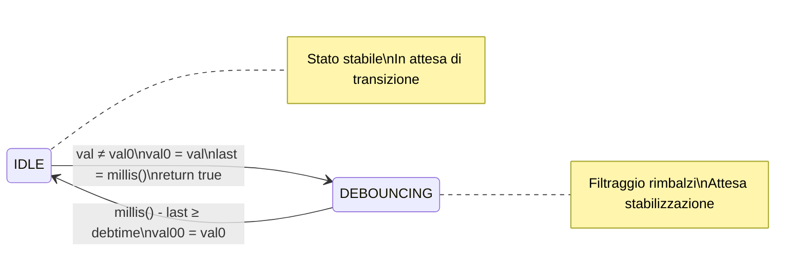

>[Torna all'indice](indexstatifiniti.md) >[versione in Python](indexstatifiniti_py.md)

#  **DEBOUNCER 2**

##  **Gestione di pulsanti con debouncer**

Questo esempio include due modalità di funzionamento:

### 1. Pulsante senza memoria (momentaneo)
- Il LED1 si accende solo quando il pulsante è premuto
- Quando il pulsante viene rilasciato, il LED si spegne
- Simile a un campanello o un pulsante di un citofono

### 2. Pulsante con memoria (toggle)
- Il LED2 cambia stato ad ogni pressione del pulsante
- Se il LED è spento, premendo si accende
- Se il LED è acceso, premendo si spegne
- Simile a un interruttore della luce in casa

Entrambe le modalità utilizzano lo stesso meccanismo di debounce avanzato che:
1. Rileva immediatamente il primo cambiamento
2. Inibisce successivi rilevamenti per il periodo di debounce
3. Gestisce correttamente gli overflow di `millis()`


# Esercitazione di controllo con Debouncing per l'accensione di un LED

## Obiettivo del progetto
Realizzare un sistema dimostrativo di controllo LED che implementi diverse tecniche di gestione dei pulsanti. Il sistema deve illustrare i concetti fondamentali del debouncing software, le macchine a stati e i diversi tipi di interazione utente tramite pulsanti (momentanea e con memoria).

## Requisiti funzionali

1. **Sistema di controllo LED**:
   - Implementazione di due modalità di controllo tramite pulsanti:
     - Modalità momentanea: LED acceso solo quando il pulsante è premuto
     - Modalità toggle (con memoria): LED cambia stato ad ogni pressione

2. **Interfaccia utente**:
   - Due pulsanti di controllo:
     - Pulsante 1: Controllo momentaneo del LED1 (senza memoria)
     - Pulsante 2: Controllo toggle del LED2 (con memoria)

3. **Implementazione di gestione avanzata del debounce**:
   - Sviluppo di un sistema di debounce che rilevi immediatamente il primo fronte ma inibisca temporaneamente i fronti successivi
   - Implementazione di una macchina a stati a due stati (IDLE e DEBOUNCE)
   - Gestione corretta dell'overflow di millis() per garantire stabilità a lungo termine

## Aspetti didattici
Il progetto dimostra:
- Differenza tra controlli momentanei e controlli con memoria (toggle)
- Implementazione di una macchina a stati per il debouncing
- Rilevamento immediato del primo fronte con successiva inibizione temporanea
- Programmazione non bloccante
- Gestione dell'overflow nei timer software
- Tecniche per migliorare l'esperienza utente riducendo falsi trigger

## Materiale necessario
- Arduino Nano o compatibile
- Due LED con relativi resistori limitatori di corrente
- Due pulsanti
- Resistori di pull-up per i pulsanti (se non si utilizzano i pull-up interni)
- Breadboard e cavi di collegamento

## Considerazioni finali
Questo progetto è perfetto come introduzione alle tecniche di debouncing e alla gestione dell'input utente. Può essere utilizzato come base per sistemi più complessi di domotica o automazione che richiedono un'interfaccia utente semplice ma affidabile. L'implementazione della macchina a stati per il debouncing rappresenta un approccio robusto che può essere esteso anche ad altre applicazioni.

## Approcci al debouncing

Questa implementazione di debouncing rileva subito il **primo fronte** ma ignora i successivi cambiamenti per un periodo definito, combinando reattività e stabilità.

Dal punto di vista concettuale, ci sono due approcci legittimi al debouncing, ma con comportamenti e finalità diverse:

1. **Approccio a singola rilevazione (fronte di ingresso)**: 
   - Rileva solo la transizione iniziale, ignorando i rimbalzi successivi
   - Segnala `chg = true` solo all'ingresso nello stato di debounce
   - Ideale per pulsanti che controllano toggle, contatori, o eventi singoli

2. **Approccio a doppia rilevazione (fronte di ingresso e di uscita)**:
   - Rileva sia la transizione iniziale che la conclusione del periodo di debounce
   - Segnala `chg = true` all'ingresso nello stato di debounce E all'uscita
   - Utile per monitorare la durata stabile di un segnale o per gestire eventi sia all'inizio che alla fine di un input

Tuttavia, per la maggior parte delle applicazioni con pulsanti (come il controllo di LED o motori), l'approccio a singola rilevazione è generalmente più appropriato, poiché permette di eseguire l'azione una sola volta all'inizio della pressione, senza generare eventi aggiuntivi alla fine del periodo di debounce.

Se l'obiettivo è rilevare solo la pressione iniziale, allora bisogna mantenere `chg = false` nella transizione da DEBOUNCE a IDLE.

## Vantaggi dell'Approccio a Singola Rilevazione
- Ideale per pulsanti che controllano toggle (on/off)
- Previene duplicazione di eventi o conteggi multipli
- Più intuitivo per la maggior parte delle interfacce utente
- Simula efficacemente il comportamento di debouncing hardware con flip-flop

Questo approccio è particolarmente utile quando desideri rilevare solo l'inizio di un'azione (come la pressione di un pulsante) e vuoi ignorare completamente eventuali false rilevazioni dovute ai rimbalzi elettrici dei contatti.


# Tabella delle Transizioni - Approccio a Singola Rilevazione

## Definizione delle Variabili
- **pin**: Pin di Arduino collegato al pulsante
- **val0**: Ultimo valore letto (per rilevare cambiamenti)
- **val**: Valore attuale letto dal pin
- **val00**: Ultimo stato stabile (dopo il debounce)
- **last**: Timestamp dell'ultimo cambiamento
- **debState**: Flag stato del debounce (true = in debounce, false = rilevamento abilitato)
- **debtime**: Tempo di debounce in millisecondi
- **chg**: Flag che indica se è stato rilevato un cambiamento valido

# Tabella delle Transizioni del Sistema di Debounce

## Stati
- **IDLE**: Sistema in attesa di un cambiamento del segnale di input
- **DEBOUNCING**: Sistema in fase di filtraggio dei rimbalzi (debounce)

## Variabili di Stato
- **val**: Valore attuale letto dal pin
- **val0**: Ultimo valore letto (potenzialmente instabile)
- **val00**: Ultimo stato stabile confermato
- **last**: Timestamp dell'ultimo cambiamento rilevato
- **debState**: Flag che indica lo stato corrente (false = IDLE, true = DEBOUNCING)
- **debtime**: Tempo di attesa per il debounce (tipicamente TXTIME = 100ms)

## Tabella delle Transizioni

La tabella descrive in dettaglio:
- Le condizioni che provocano ogni transizione
- Le azioni eseguite durante ogni transizione
- Lo stato successivo
- Il valore ritornato dalla funzione changed()

Il sistema è progettato per:
- Rilevare immediatamente il fronte iniziale di una transizione
- Ignorare i rimbalzi durante il tempo di debounce
- Aggiornare lo stato stabile solo dopo che il segnale si è stabilizzato

I due componenti principali di questa implementazione sono:
- La rilevazione del cambiamento (val ≠ val0)
- La gestione del tempo (millis() - last ≥ debtime)

Questo approccio garantisce che il sistema risponda rapidamente ai comandi dell'utente, pur filtrando efficacemente i falsi segnali causati dai rimbalzi meccanici del pulsante.

| Stato Attuale | Condizione                | Azioni                                          | Stato Successivo | Valore Ritornato |
|---------------|---------------------------|------------------------------------------------|------------------|------------------|
| IDLE          | val = val0                | Nessuna                                         | IDLE             | false            |
| IDLE          | val ≠ val0                | val0 = val<br>last = millis()<br>debState = true | DEBOUNCING       | true             |
| DEBOUNCING    | millis() - last < debtime | Nessuna                                         | DEBOUNCING       | false            |
| DEBOUNCING    | millis() - last ≥ debtime | val00 = val0<br>debState = false                | IDLE             | false            |


##  **Diagramma degli stati**



##  **Soluzione in logica "prima gli stati"**

La **FSM** che modella il comportamento del pulsante è del tutto **indipendente** ed **isolata** rispetto alla logica principale del programma. Il codice, che implementa la macchina a stati finiti sia del debouncer che del rilevamento dei fronti, è tutta **incapsulata** all'interno dell'**oggetto pulsante**, realizzato, in questo caso, con una **struct** (membri e proprietà **pubblici** di default).

L'inizializzazione dei parametri degli **oggetti statici** è effettuata al momento della dichiarazione mediante ```Button buttonMomentary = {BUTTON1_PIN, LOW, 50}``` utilizzando la notazione ```{}``` che racchiude la **lista** completa dei **membri contigui** da inizializzare dentro le **parentesi graffe**.

Ecco un esempio semplificato che utilizza la tua struttura di debounce per controllare LED con e senza memoria:

```cpp
#define TXTIME 100  // Tempo di debounce in millisecondi

struct Button {
  uint8_t pin;           // Pin di Arduino collegato al pulsante
  uint8_t val0;          // Ultimo valore letto
  unsigned long debtime; // Tempo di debounce in millisecondi
  uint8_t val;           // Valore attuale letto
  uint8_t val00;         // Ultimo stato stabile
  unsigned long last;    // Timestamp ultimo cambiamento
  bool debState;         // Flag per stato debounce (true = in debounce)
  
  /**
   * Verifica se c'è stato un cambiamento valido dello stato del pulsante.
   * Rileva solo il fronte iniziale del cambiamento, non la fine del debounce.
   * @return true solo al rilevamento del primo fronte, false altrimenti
   */
  bool changed() {
    val = digitalRead(pin);  // Legge il valore attuale del pin
    
    // Gestione della macchina a stati per il debounce
    if (!debState) {  // Equivalente a stato IDLE
      if (val != val0) {  // Transizione rilevata
        val0 = val;      // Aggiorna l'ultimo valore letto
        last = millis(); // Registra il timestamp dell'evento
        debState = true; // Entra in stato debouncing
        return true;     // Segnala il cambiamento (fronte iniziale)
      }
    } else {  // In stato DEBOUNCING
      if (millis() - last >= debtime) {  // Periodo di debounce completato
        val00 = val0;    // Aggiorna lo stato stabile
        debState = false; // Torna in stato IDLE
      }
    }
    
    return false;  // Nessun nuovo fronte rilevato
  }

  // Costruttore
  Button(uint8_t _pin, unsigned long _debtime = TXTIME) {
    pin = _pin;
    debtime = _debtime;
    val0 = 0;
    val = 0;
    val00 = 0;
    last = 0;
    debState = false;
    pinMode(pin, INPUT);
  }
};

// Esempio di utilizzo
byte led = 10;
Button button(3);  // Pulsante collegato al pin 3 con tempo di debounce predefinito

void setup() {
  pinMode(led, OUTPUT);
  Serial.begin(115200);
}

void loop() {
  if (button.changed()) {
    Serial.println("Transizione rilevata!");
  }
  
  if (!button.debState) {
    digitalWrite(led, button.val0); // Aggiorna il LED solo quando lo stato è stabile
  }
}
```
- Simulazione su Esp32 con Wowki dell'esempio base essposto sopra: https://wokwi.com/projects/426050075651040257
- Simulazione su Arduino Nano con Wowki di un motore stepper con comandi protetti da debouncer: https://wokwi.com/projects/426024956545802241

>[Torna all'indice](indexstatifiniti.md) >[versione in Python](indexstatifiniti_py.md)
