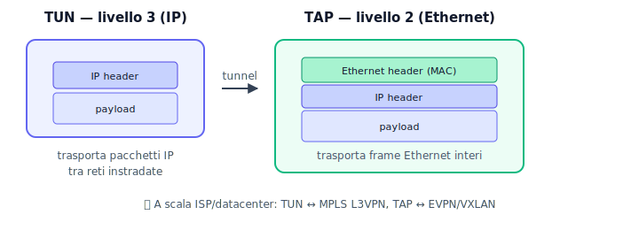
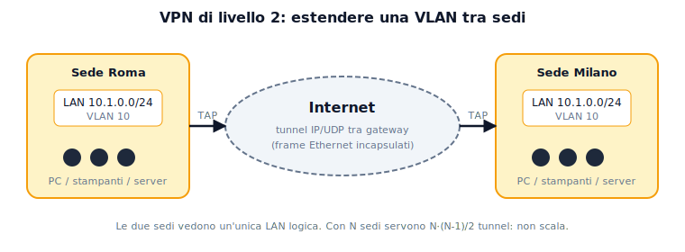
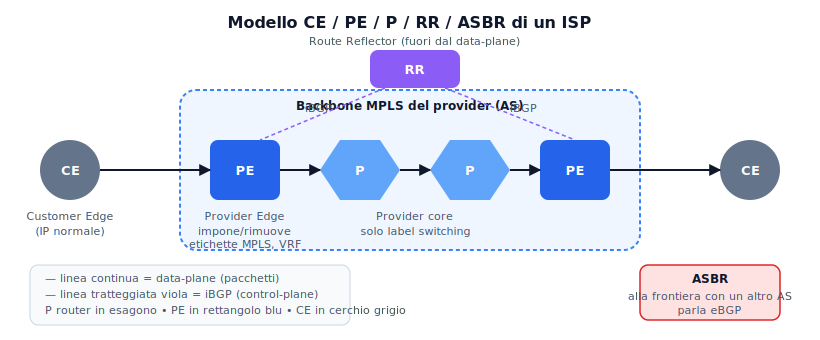
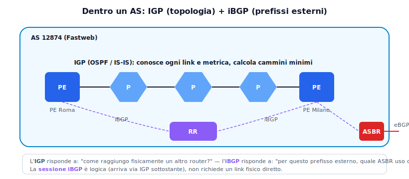
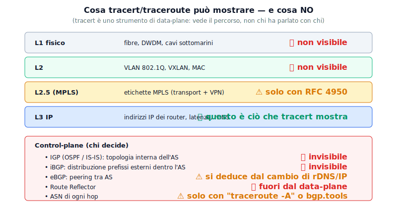
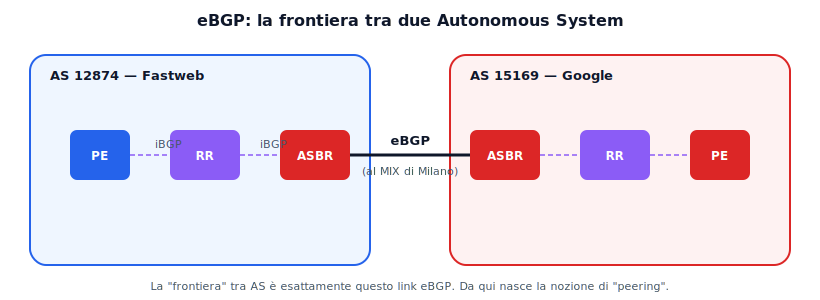
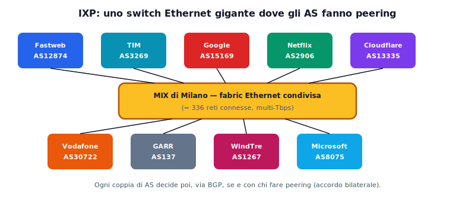
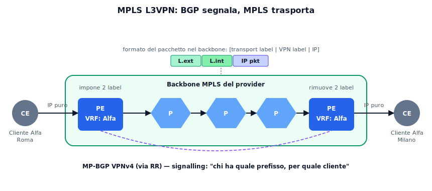
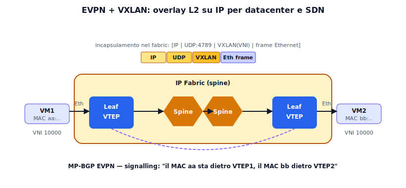
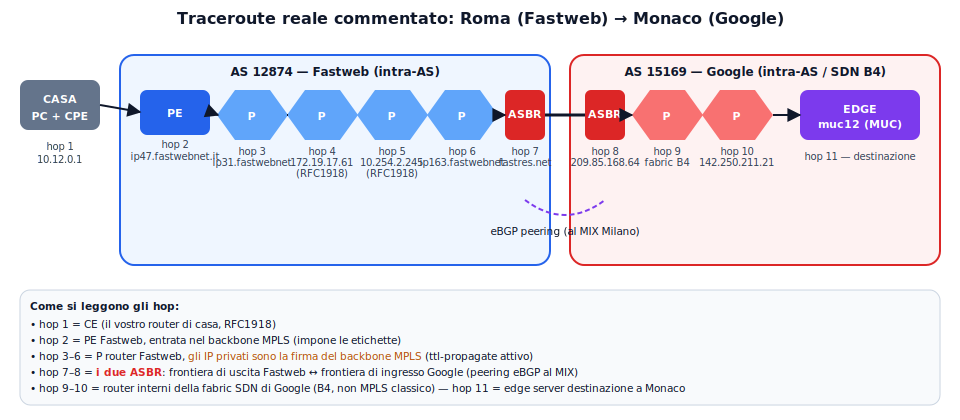

# Dai tunnel VPN agli Autonomous System: come è fatta (davvero) Internet

**Dispensa per Sistemi e Reti — 5° ITIS Informatica**

---

## Indice

0. A chi si rivolge
1. Ricapitolo: VPN, tunnel TUN/TAP, VLAN, crittografia
2. Dalla VLAN locale alla VPN L2 tra sedi
3. Entra in scena il provider: reti di trasporto
4. L'Autonomous System
   - 4.1 Analogia AS ≈ VPN amministrativa
   - 4.2 Classificazione degli AS
   - 4.3 Dentro un AS: IGP + iBGP (intra-AS)
   - 4.4 Cosa mostra tracert (e cosa no)
   - 4.5 Traceroute intra-AS
5. BGP: il linguaggio delle frontiere (inter-AS)
6. MPLS L3VPN: BGP come *signalling* di un tunnel L3
7. EVPN + VXLAN: BGP come *signalling* di un tunnel L2 nelle SDN
8. Scenario italiano
9. Traceroute commentato end-to-end
10. Glossario e domande d'esame

---

## 0. A chi si rivolge

Questa dispensa parte da quello che **già conoscete**: VPN *trusted/untrusted*, tunnel con interfacce **TUN** (L3) e **TAP** (L2), **VLAN 802.1Q**, crittografia simmetrica/asimmetrica.

L'obiettivo è mostrare che **le stesse idee** (separare domini, creare tunnel, definire frontiere di fiducia) **si ritrovano a scala Internet**, dove i domini si chiamano **Autonomous System (AS)** e le frontiere sono gestite da **BGP**.

---

## 1. Ricapitolo rapido

### 1.1 Trusted vs Untrusted VPN

| Tipo | Canale sottostante | Sicurezza garantita da | Esempio |
|---|---|---|---|
| **Untrusted** | Internet pubblica | Crittografia + autenticazione end-to-end | IPsec, OpenVPN, WireGuard |
| **Trusted** | Rete privata del provider (MPLS) | Isolamento logico del provider | MPLS L3VPN aziendale |

> 💡 Stessa sigla, filosofie opposte: una protegge con la matematica, l'altra con l'isolamento amministrativo.

### 1.2 TUN vs TAP



- **TUN** = interfaccia virtuale di **livello 3**: trasporta pacchetti IP. Adatta a VPN tra reti instradate.
- **TAP** = interfaccia virtuale di **livello 2**: trasporta frame Ethernet completi. Adatta a estendere una LAN via bridge.

Questa distinzione **ritornerà identica** a scala provider: MPLS L3VPN ≈ TUN globale gestito dall'ISP; EVPN/VXLAN ≈ TAP globale gestito dal datacenter.

### 1.3 VLAN

Una **VLAN** (IEEE 802.1Q) segmenta un dominio di broadcast L2 su switch fisici condivisi. Il tag 802.1Q (12 bit → max 4094 VLAN) identifica a quale "rete virtuale" appartiene un frame.
**Principio chiave**: una sola infrastruttura fisica, *n* domini logici isolati. È il cuore di tutto ciò che segue.

---

## 2. Dalla VLAN locale alla VPN L2 tra sedi

Supponiamo di avere due sedi aziendali (Roma e Milano) che vogliono essere nella **stessa LAN logica**, come se fossero nello stesso edificio. Con le VLAN "classiche" non si può: 802.1Q funziona solo dove c'è un cavo Ethernet diretto.

**Soluzione naïve**: un tunnel **TAP** (OpenVPN in modalità bridge, L2TP, GRE con bridging...) che incapsula i frame Ethernet dentro pacchetti IP.



Funziona per 2 sedi. Ma con 50 sedi servono 50×49/2 = 1225 tunnel (**full mesh**), tutti da configurare a mano. **Non scala.** È il problema che MPLS L3VPN (per L3) e EVPN (per L2) risolvono automaticamente.

---

## 3. Entra in scena il provider: reti di trasporto

Quando l'azienda ha 50 sedi, smette di costruire tunnel da sola e **compra un servizio** da un operatore (TIM, Fastweb, Vodafone Business...). Il provider offre:

- **Servizio L2 (VPLS/EVPN)**: "ti do una LAN virtuale che collega tutte le tue sedi"
- **Servizio L3 (MPLS L3VPN)**: "ti do un routing virtuale privato tra le tue sedi"

Dal punto di vista del cliente, le sedi sembrano connesse da un cavo magico. Dal punto di vista del provider, **una sola infrastruttura fisica** trasporta il traffico di centinaia di clienti, isolati tra loro — esattamente come le VLAN, ma a livello geografico.

### 3.1 Nomenclatura dei router nel modello provider



- **CE (Customer Edge)**: router del cliente, parla IP normale.
- **PE (Provider Edge)**: router di frontiera del provider. Impone/rimuove le etichette MPLS e tiene tabelle di routing separate per cliente (**VRF**).
- **P (Provider core)**: router interno del backbone. Fa solo label switching, non sa nulla dei clienti.
- **RR (Route Reflector)**: non sul percorso dati, distribuisce rotte BGP evitando il full-mesh iBGP.
- **ASBR (AS Border Router)**: router di frontiera tra AS diversi. Parla **eBGP**.

> 🔑 In un traceroute: i P router sono gli hop di "passaggio" dentro l'operatore, i PE sono il primo e l'ultimo dell'operatore, gli ASBR sono al confine tra due operatori.

---

## 4. L'Autonomous System

Internet **non è una rete**: è una **rete di reti**. Ogni rete gestita in modo autonomo (un ISP, un datacenter, un'università, un content provider) è un **Autonomous System (AS)** identificato da un numero (**ASN**) assegnato dai RIR (in Europa: RIPE NCC).
Esempi: AS3269 = TIM, AS12874 = Fastweb, AS15169 = Google, AS16509 = AWS.

### 4.1 Analogia centrale: AS come VPN amministrativa

| VPN / VLAN | Autonomous System |
|---|---|
| Dominio di broadcast L2 o tunnel L3 | Dominio di routing IP |
| Frontiera = interfaccia del gateway VPN | Frontiera = ASBR |
| Policy = firewall del gateway | Policy = regole BGP (accept/deny/prepend) |
| Interno opaco agli altri | Interno opaco agli altri AS |
| Protocollo interno libero | IGP interno libero (OSPF, IS-IS) |
| Protocollo di "peering" = IPsec/IKE | Protocollo di peering = eBGP |

Gli altri AS non sanno e non devono sapere come siete organizzati dentro. Vedono solo **quali reti IP annunciate** e tramite quali peer. È il concetto di "frontiera di fiducia" delle VPN, applicato alla scala globale.

### 4.2 Classificazione aggiornata degli AS

**Per gerarchia di transito (Tier)**

- **Tier 1**: raggiungono *tutta* Internet senza pagare transito a nessuno. Globali: Lumen (AS3356), Arelion (AS1299), NTT (AS2914), Cogent (AS174), Tata (AS6453). **L'unico Tier 1 italiano è TIM Sparkle (AS6762)**.
- **Tier 2**: fanno peering dove possono e comprano transito per il resto. Qui sta la maggior parte degli ISP italiani (Fastweb, Vodafone, WindTre, Retelit, GARR...).
- **Tier 3**: puri clienti di transito senza peering rilevanti.

**Per funzione (più utile oggi)**

- **Eyeball networks** (utenti finali): TIM, Fastweb, Vodafone IT, WindTre, Iliad.
- **Content networks / CDN**: Google, Meta (AS32934), Netflix (AS2906), Cloudflare (AS13335), Akamai (AS20940).
- **Cloud provider**: AWS, Microsoft (AS8075), Google Cloud, Oracle Cloud (AS31898).
- **Transit / Tier 1**: pura infrastruttura wholesale.
- **Enterprise / università**: es. GARR (AS137).

### 4.3 Dentro un AS: IGP + iBGP (il livello intra-AS)

Apriamo la scatola nera. Dentro un AS convivono **due piani di routing**:

| Piano | Protocollo | A cosa risponde |
|---|---|---|
| **IGP** | OSPF, IS-IS | *"Come raggiungo fisicamente un altro router del mio AS?"* |
| **iBGP** | BGP interno | *"Per un prefisso esterno, quale ASBR uso come uscita?"* |

L'IGP conosce ogni link e metrica, converge in secondi. iBGP non calcola cammini: porta solo le informazioni di raggiungibilità dei prefissi esterni, sfruttando l'IGP come trasporto.



**Regola mnemonica**:
- *"Come ci arrivo?"* → IGP
- *"Per quale uscita devo passare?"* → iBGP
- *"Come lo trasporto?"* → MPLS label switching

### 4.4 Cosa mostra tracert/traceroute (e cosa NO)

Questa è una domanda cruciale. `tracert` (Windows) e `traceroute` (Linux/macOS) mandano pacchetti con **TTL crescente** (1, 2, 3...) e raccolgono i messaggi ICMP *TTL exceeded* che ogni router rimanda. La tecnica ha **limiti strutturali**:



> 🔑 **Punto chiave**: tracert mostra la topologia **data-plane** (per dove passano i pacchetti), **non** il control-plane (chi decide). OSPF, iBGP, eBGP si possono solo *dedurre* dalla posizione dell'hop e dal rDNS. In particolare i **Route Reflector** e le **sessioni BGP** non compaiono mai nel traceroute.

### 4.5 Traceroute intra-AS: un esempio

Traceroute **tutto dentro Fastweb**, da una sede a Roma verso un datacenter Fastweb a Milano (L3VPN interna, niente confini di AS):

```
  1   10.12.0.1                               [CE sede Roma]
  2   93.34.1.25    ip47.fastwebnet.it        [PE ingresso]
  3   172.19.17.61                            [P router (area Roma)]
  4   172.19.4.1                              [P router (backbone RM→MI)]
  5   10.254.2.245                            [P router (area Milano)]
  6   93.57.68.45   ip163.fastwebnet.it       [PE uscita]
  7   10.200.50.15                            [CE datacenter Milano]
```

Cosa si vede: 7 hop, tutti dentro AS12874. I P scelti dall'IGP (probabilmente IS-IS), gli IP privati agli hop 3–5 sono la firma MPLS. **Nessun eBGP** — è tutto intra-AS. Se c'è una L3VPN sottostante, tracert non ve lo dice: vedete solo IP normali, le etichette sono invisibili.

---

## 5. BGP: il linguaggio delle frontiere (inter-AS)

**BGP-4 (RFC 4271)** è un **path vector protocol**: ogni annuncio dice *"per raggiungere il prefisso 8.8.8.0/24 passa attraverso questa sequenza di AS"*.

### 5.1 eBGP vs iBGP

- **eBGP**: tra ASBR di AS diversi. È il BGP "di frontiera".
- **iBGP**: dentro un AS, tra PE/ASBR, per propagare le rotte esterne. Non modifica l'AS_PATH.



### 5.2 Peering vs Transit

- **Peering**: due AS si scambiano *gratis* il traffico dei rispettivi clienti (Fastweb ↔ Google al MIX).
- **Transit**: un AS *paga* un altro per raggiungere tutta Internet (piccolo ↔ grande).

Un peering eBGP può essere **privato** (PNI, cavo dedicato) o **pubblico** (attraverso un IXP).

### 5.3 Gli IXP: switch giganti del peering

Un **IXP (Internet Exchange Point)** è letteralmente **un grande switch Ethernet** dove decine/centinaia di AS si connettono e fanno peering via BGP. È peering L3 che viaggia su un fabric L2 condiviso.



I due IXP italiani principali:
- **MIX (Milano)**: il maggiore, ~336 reti, multi-Tbps.
- **Namex (Roma)**: secondo nazionale, nato nell'Università La Sapienza.
- Minori: **TOP-IX (Torino)**, **VSIX (Padova)**.

---

## 6. MPLS L3VPN: BGP come signalling di un tunnel L3

**MPLS L3VPN (RFC 4364)** è come avere una **"TUN distribuita"** gestita automaticamente dall'ISP tra tutti i suoi PE.



**Come funziona in 4 idee**:

1. **VRF**: ogni PE tiene una tabella di routing separata per ogni cliente. Gli IP dei clienti possono anche sovrapporsi: sono in VRF diverse, non si vedono.
2. **MP-BGP VPNv4**: BGP esteso trasporta tra PE le rotte dei clienti con un **Route Distinguisher** che le rende uniche. **BGP fa il signalling.**
3. **Doppia etichetta MPLS**: etichetta esterna (transport) dice ai P come raggiungere il PE remoto; etichetta interna (VPN) dice al PE remoto a quale VRF consegnare.
4. I P router non sanno nulla dei clienti: fanno solo label switching. Scalabilità enorme.

> 🔑 **Parallelo con VPN classiche**: in OpenVPN, TLS fa il signalling e UDP trasporta. In MPLS L3VPN, MP-BGP fa il signalling e MPLS trasporta. Stesso schema, scala diversa.

---

## 7. EVPN + VXLAN: BGP come signalling di un tunnel L2 nelle SDN

Nei datacenter moderni si vuole lo stesso servizio ma a livello 2. Le VLAN classiche hanno due limiti: **4094 massimo** e **non si estendono** oltre un dominio L2 fisico.

**Soluzione**: **VXLAN + EVPN**.



- **VXLAN** (il "TAP su scala datacenter"): incapsula frame Ethernet in UDP/IP (porta 4789), con un **VNI a 24 bit** → ~16 milioni di segmenti. Gli endpoint si chiamano **VTEP**.
- **EVPN (RFC 7432)**: famiglia BGP per annunciare **quali MAC** sono dietro quali VTEP. Niente più flooding per il MAC learning.

**SDN e BGP**:
- *Data plane*: VXLAN (overlay L2 su IP).
- *Control plane*: MP-BGP EVPN (distribuito) oppure controller centralizzato (es. Google B4, OpenFlow internamente e BGP solo al bordo).

> 🔑 Sia in MPLS L3VPN sia in EVPN/VXLAN, **BGP è il signalling**, MPLS e VXLAN sono il *formato di trasporto*. Stessa separazione signalling/trasporto delle VPN che già conoscete.

---

## 8. Scenario italiano

### 8.1 Principali AS italiani

| ASN | Operatore | Tipo | Note |
|---|---|---|---|
| **AS3269** | TIM | Eyeball | Il più grande per utenti finali |
| **AS6762** | TIM Sparkle | **Tier 1** wholesale | Unico Tier 1 italiano ("Seabone") |
| **AS12874** | Fastweb | Eyeball + enterprise | Backbone MPLS completo |
| **AS30722** | Vodafone Italia | Eyeball | |
| **AS1267** | WindTre | Eyeball | |
| **AS43100** | Iliad Italia | Eyeball | |
| **AS41327** | Fiber Telecom/Retelit | Wholesale | |
| **AS137** | GARR | Rete della ricerca | |
| **AS31034** | Aruba | Hosting/cloud | Datacenter a Ponte San Pietro (BG) |
| **AS12637** | Seeweb | Hosting/cloud | |

### 8.2 IXP e cloud on-ramp

- **MIX (Milano)**, **Namex (Roma)**, TOP-IX, VSIX.
- **AWS Europe (Milan)**: region dal 2020.
- **Microsoft Azure Italy North**: region dal 2023.
- **Google Cloud Milan**: region dal 2022.
- **Oracle Cloud Milan**: region attiva.

Questi cloud permettono alle aziende italiane latenze <5 ms verso il cloud, senza passare da Francoforte/Amsterdam come prima del 2020.

---

## 9. Traceroute commentato end-to-end



```
  1   10.12.0.1                               [CPE/router cliente]
  2   93.34.1.25   ip47.fastwebnet.it         [PE Fastweb — ingresso backbone]
  3   93.32.47.97  ip31.fastwebnet.it         [P router Fastweb]
  4   172.19.17.61                            [P router — IP privato]
  5   10.254.2.245                            [P router — IP privato]
  6   93.57.68.129 ip163.fastwebnet.it        [P router — uscita]
  7   62.101.124.5 fastres.net                [ASBR Fastweb — eBGP]
  8   209.85.168.64                           [ASBR Google — ingresso AS15169]
  9   192.178.104.103                         [P router Google (B4)]
 10   142.250.211.21                          [router Google]
 11   172.217.23.67 muc12s06-in-f3.1e100.net  [edge Google, Monaco]
```

### Cosa ci insegna

- Gli hop 2–7 sono **intra-AS Fastweb**; i 9–11 sono **intra-AS Google**; l'arco eBGP 7↔8 è l'**unico confine inter-AS**.
- Gli IP RFC1918 agli hop 4–5 sono la firma classica del backbone MPLS.
- Il rDNS rivela ruoli e città: `fastwebnet.it` (accesso), `fastres.net` (border), `muc12` (Monaco), `1e100.net` (Google).
- I tempi isolati alti sono quasi sempre *slow path* ICMP sul router, non congestione reale: guardate il minimo delle tre misurazioni.
- Il percorso geografico (Roma→Milano→Monaco) è deciso da **BGP**, non dalla distanza: passa da dove Fastweb e Google fanno peering (MIX di Milano).

---

## 10. Glossario e domande d'esame

### Glossario rapido

- **AS / ASN** – Autonomous System / numero identificativo.
- **ASBR** – AS Border Router, frontiera tra AS, parla eBGP.
- **BGP** – path-vector, protocollo di routing tra AS.
- **eBGP / iBGP** – BGP esterno/interno.
- **CE / PE / P** – Customer/Provider Edge / Provider core router.
- **EVPN** – famiglia BGP per VPN L2 (RFC 7432).
- **IGP** – Interior Gateway Protocol (OSPF, IS-IS).
- **IXP** – Internet Exchange Point.
- **MPLS** – Multiprotocol Label Switching.
- **MP-BGP** – BGP esteso per famiglie di indirizzi (VPNv4, EVPN).
- **Peering / Transit** – scambio gratuito / a pagamento.
- **PNI** – Private Network Interconnect.
- **RR** – Route Reflector.
- **SDN** – Software-Defined Network.
- **VRF** – Virtual Routing and Forwarding.
- **VTEP / VXLAN** – endpoint / overlay L2 su UDP/IP (VNI 24 bit).

### Domande tipo colloquio

1. Analogie e differenze tra VPN OpenVPN punto-punto e MPLS L3VPN aziendale.
2. Come si passa da VLAN 802.1Q a VXLAN? Quali limiti risolve?
3. In un traceroute di 11 hop, come distingui router intra-AS dagli ASBR di frontiera?
4. Perché BGP è usato sia in Internet globale sia dentro MPLS/EVPN di un singolo operatore?
5. Cosa rappresenta il MIX di Milano a livello fisico (L1/L2) e logico (L3/BGP)?
6. Un hop in traceroute ha IP `172.19.x.x`: cosa puoi dedurre?
7. Perché il Route Reflector non compare mai in un traceroute?

### Collegamenti con altre materie

- **Telecomunicazioni**: fibre e DWDM sotto il backbone MPLS; latenza ↔ distanza.
- **Informatica**: BGP come sistema distribuito; route hijacking (AS7007 1997, Pakistan-YouTube 2008).
- **GPOI/Diritto**: sovranità digitale, Polo Strategico Nazionale, cloud di Stato.
- **Sicurezza**: RPKI e BGP Origin Validation contro i route hijack.

---

*Riferimenti: RFC 4271 (BGP-4), RFC 4364 (MPLS L3VPN), RFC 7432 (EVPN), RFC 7348 (VXLAN), RFC 4950 (MPLS Label Stack in ICMP), IEEE 802.1Q.*
