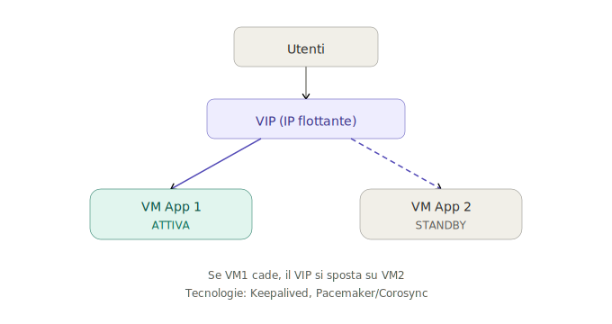
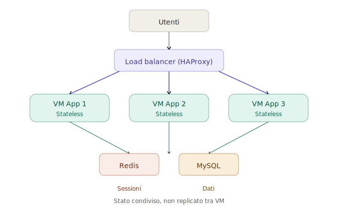
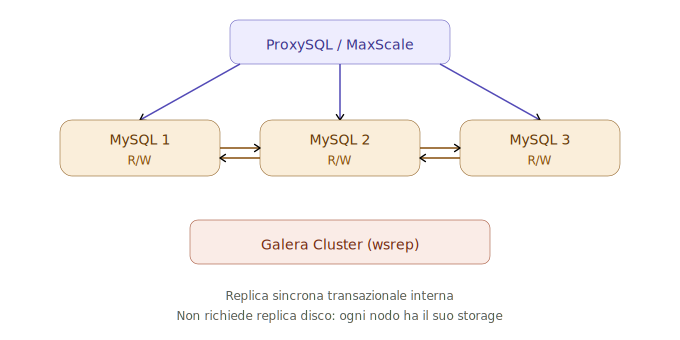
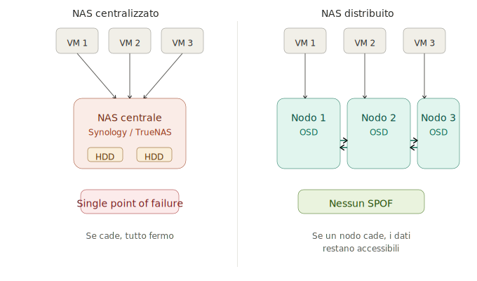
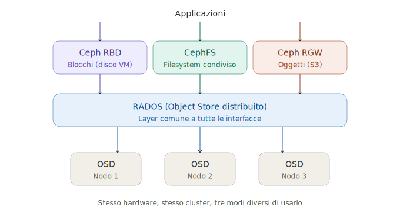
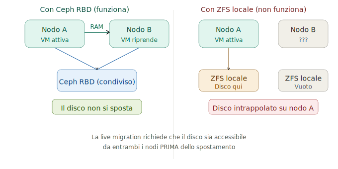
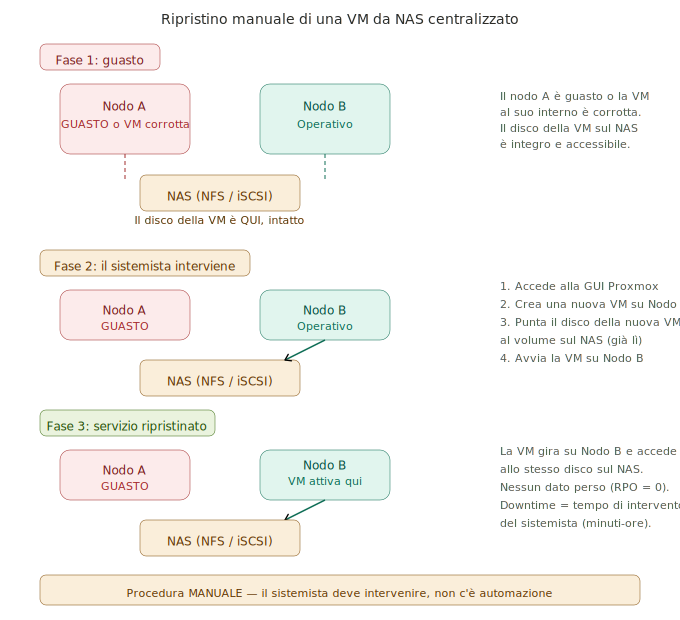
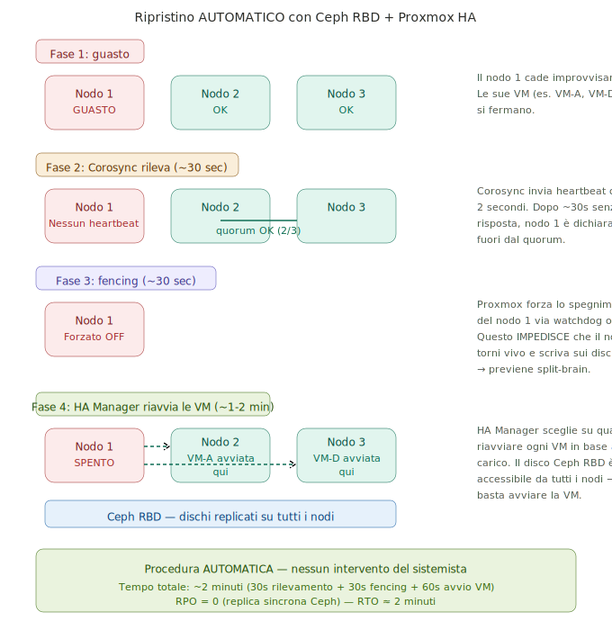
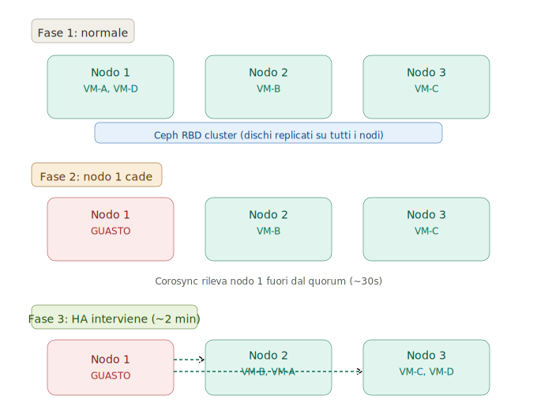
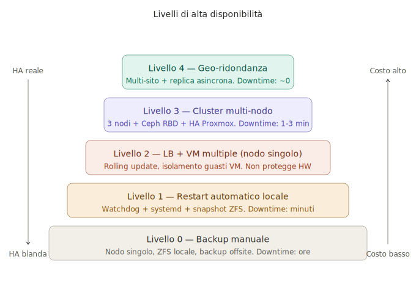

# Replica, Storage Distribuito e Alta Disponibilità

## Dispensa per il quinto anno di informatica

---

## Indice

0. [Glossario: grandezze e metriche fondamentali](#0-glossario-grandezze-e-metriche-fondamentali)
1. [Tipi di replica del disco](#1-tipi-di-replica-del-disco)
    - [1.1 Replica locale](#11-replica-locale-stesso-nodo)
    - [1.2 Replica sincrona di rete](#12-replica-sincrona-di-rete-tra-nodi)
    - [1.3 Replica asincrona di rete](#13-replica-asincrona-di-rete-tra-nodi)
    - [1.4 Tassonomia riassuntiva](#14-tassonomia-riassuntiva)
    - [1.5 Quando serve e quale tipo](#15-quando-serve-la-replica-del-disco-e-quale-tipo)
2. [Tipi di replica del servizio](#2-tipi-di-replica-del-servizio)
    - [2.1 Nessuna replica](#21-nessuna-replica-single-instance)
    - [2.2 Active-Passive](#22-active-passive-failover)
    - [2.3 Active-Active con load balancer](#23-active-active-con-load-balancer)
    - [2.4 Cluster multi-master](#24-cluster-multi-master-database)
    - [2.5 Tassonomia riassuntiva](#25-tassonomia-riassuntiva)
    - [2.6 Il filo logico](#26-il-filo-logico-cosa-guida-la-scelta)
3. [Quando serve anche la replica del disco](#3-quando-serve-anche-la-replica-del-disco)
    - [3.1 Quadro completo dei casi](#31-quadro-completo-dei-casi-comuni)
    - [3.2 La regola generale](#32-la-regola-generale)
    - [3.3 Schema decisionale](#33-schema-decisionale)
4. [NAS centralizzato vs distribuito](#4-nas-centralizzato-vs-nas-distribuito)
    - [4.1 NAS centralizzato](#41-nas-centralizzato)
    - [4.2 NAS distribuito](#42-nas-distribuito)
    - [4.3 Confronto diretto](#43-confronto-diretto)
5. [CephFS: quando conviene](#5-cephfs-quando-conviene)
    - [5.1 Le tre interfacce di Ceph](#51-le-tre-interfacce-di-ceph)
    - [5.2 Quando CephFS è la scelta giusta](#52-quando-cephfs-è-la-scelta-giusta)
    - [5.3 CephFS vs NFS](#53-schema-decisionale-cephfs-vs-nfs)
    - [5.4 CephFS vs GlusterFS](#54-cephfs-vs-glusterfs)
6. [Migrazione delle VM in Proxmox](#6-migrazione-delle-vm-in-proxmox)
    - [6.1 Tipi di migrazione](#61-tipi-di-migrazione)
    - [6.2 Live migration e storage](#62-perché-la-live-migration-richiede-storage-condiviso)
    - [6.3 Ripristino manuale (NAS)](#63-procedura-di-ripristino-manuale-nas-centralizzato)
    - [6.4 Ripristino automatico (Ceph)](#64-procedura-di-ripristino-automatico-ceph-rbd--proxmox-ha)
    - [6.5 Confronto procedure](#65-confronto-tra-le-due-procedure)
    - [6.6 Automatica vs manuale](#66-quando-la-migrazione-è-automatica-e-quando-manuale)
    - [6.7 Prerequisiti HA](#67-prerequisiti-per-la-migrazione-automatica-ha)
    - [6.8 Failover di un nodo](#68-cosa-succede-quando-un-nodo-cade)
7. [Livelli di HA: dalla protezione blanda alla HA reale](#7-livelli-di-ha-dalla-protezione-blanda-alla-ha-reale)
    - [7.1 Livello 0 — Backup](#71-livello-0--backup-manuale-nessuna-ha)
    - [7.2 Livello 1 — Restart locale](#72-livello-1--restart-automatico-locale)
    - [7.3 Livello 2 — LB nodo singolo](#73-livello-2--load-balancer--vm-multiple-nodo-singolo)
    - [7.4 Livello 3 — Cluster HA](#74-livello-3--cluster-multi-nodo-con-ha-automatico)
    - [7.5 Livello 4 — Geo-ridondanza](#75-livello-4--geo-ridondanza-multi-sito)
    - [7.6 Come scegliere](#76-come-scegliere-il-livello-giusto)
    - [7.7 Confronto riassuntivo](#77-confronto-riassuntivo-dei-livelli)
8. [Riepilogo finale](#riepilogo-finale)

---

## 0. Glossario: grandezze e metriche fondamentali

Prima di affrontare i temi della replica e dell'alta disponibilità, è essenziale conoscere le grandezze con cui si misurano le prestazioni e la resilienza di un'infrastruttura.

### Metriche di disponibilità

**Uptime** è il tempo in cui un servizio è operativo e raggiungibile. Si esprime come percentuale su base annua. La tabella seguente mostra i livelli convenzionali detti "nine" (da 9, cioè il numero di cifre significative dopo la virgola).

| Livello | Uptime (%) | Downtime annuo | Esempio tipico |
|---------|-----------|----------------|----------------|
| 2 nine | 99% | 3 giorni 15 ore | Homelab, dev |
| 3 nine | 99.9% | 8 ore 45 minuti | PMI, servizi interni |
| 4 nine | 99.99% | 52 minuti | E-commerce, produzione |
| 5 nine | 99.999% | 5 minuti | Banche, telco, cloud |

**Downtime** è il complementare dell'uptime: il tempo in cui il servizio è indisponibile, sia per guasto sia per manutenzione programmata.

### Metriche di ripristino

**RTO (Recovery Time Objective)** è il tempo massimo accettabile per ripristinare il servizio dopo un guasto. È un obiettivo, non una misura: lo si decide prima che il guasto avvenga e si progetta l'infrastruttura per rispettarlo.

**RPO (Recovery Point Objective)** è la quantità massima di dati che si accetta di perdere in caso di guasto, espressa in tempo. Un RPO di 1 ora significa che, nel caso peggiore, si perdono le ultime 60 minuti di scritture.

```
        Tempo ───────────────────────────────►

        ultimo backup         guasto        servizio ripristinato
             │                   │                   │
             ├───────────────────┤                   │
             │       RPO         │                   │
             │  (dati persi)     │                   │
                                 ├───────────────────┤
                                 │       RTO         │
                                 │  (tempo di fermo) │
```

| Metrica | Domanda a cui risponde | Esempio |
|---------|----------------------|---------|
| **RPO** | "Quanti dati posso permettermi di perdere?" | RPO = 0 → replica sincrona, nessuna perdita |
| **RTO** | "Quanto tempo posso restare fermo?" | RTO = 2 min → serve HA automatico con failover |

### Metriche di latenza e prestazioni

**Latenza (delay)** è il tempo che intercorre tra una richiesta e la sua risposta. Nel contesto della replica, la latenza di rete tra i nodi determina quanto "costa" una replica sincrona: ogni scrittura deve attendere la conferma remota prima di completarsi.

**Throughput (banda)** è la quantità di dati trasferibili nell'unità di tempo (es. MB/s, Gbps). Determina quanto velocemente i dati possono essere replicati tra nodi. Una rete a 1 GbE (~100 MB/s) è spesso insufficiente per replica sincrona sotto carico; 10 GbE (~1 GB/s) è il minimo consigliato per Ceph.

**IOPS (Input/Output Operations Per Second)** è il numero di operazioni di lettura o scrittura che lo storage riesce a gestire al secondo. È la metrica critica per i database: un disco HDD fa 100-200 IOPS, un SSD SATA 10.000-50.000, un NVMe 100.000+.

### Metriche di resilienza

**SPOF (Single Point of Failure)** è un qualsiasi componente il cui guasto provoca l'indisponibilità dell'intero servizio. L'obiettivo dell'alta disponibilità è eliminare ogni SPOF.

**Quorum** è il numero minimo di nodi che devono essere operativi perché il cluster prenda decisioni (es. riavviare una VM su un altro nodo). Con 3 nodi, il quorum è 2: se un nodo cade, i 2 rimanenti possono decidere. Con 2 nodi senza QDevice, la perdita di un nodo impedisce il quorum.

**Split-brain** è la situazione in cui due parti di un cluster, non potendo comunicare tra loro, credono entrambe di essere il cluster attivo e operano in modo indipendente. Porta a corruzione dei dati. Il quorum serve proprio a prevenirlo: solo la partizione con la maggioranza può restare attiva.

**Fencing** è il meccanismo con cui il cluster "isola" un nodo che non risponde, impedendogli di scrivere sui dischi condivisi. Proxmox usa il watchdog hardware o IPMI per forzare lo spegnimento del nodo guasto prima di riavviare le sue VM altrove.

### Relazioni tra le metriche

| Se vuoi... | Ti serve... | Che impatta su... |
|-----------|------------|-------------------|
| RPO = 0 (nessuna perdita dati) | Replica sincrona | Latenza di scrittura (+) |
| RTO basso (ripristino rapido) | HA automatico, Ceph RBD | Costo infrastruttura (+) |
| IOPS alti | SSD/NVMe, Ceph su SSD | Costo storage (+) |
| Eliminare SPOF | Minimo 3 nodi, Ceph | Complessità (+) |
| Prevenire split-brain | Quorum + fencing | Nodi minimi = 3 |

[Torna all'indice](#indice)

---

## 1. Tipi di replica del disco

La replica del disco ha lo scopo di garantire che i dati sopravvivano al guasto di uno o più dispositivi fisici. Esistono tre grandi categorie.

### 1.1 Replica locale (stesso nodo)

I dati vengono duplicati tra dischi fisici della stessa macchina. **Tecnologie:** RAID hardware, RAID software (mdadm), ZFS (mirror, RAIDZ). **Protegge da:** guasto di un disco fisico. **Non protegge da:** guasto del nodo intero (scheda madre, alimentatore, incendio).


### 1.2 Replica sincrona di rete (tra nodi)

Ogni scrittura viene confermata solo quando tutti i nodi coinvolti hanno scritto il dato. Nessun dato viene perso in caso di guasto di un nodo. **Tecnologie:** DRBD (sincrono), Ceph (con replica factor ≥ 2). **Protegge da:** guasto di un nodo intero. **Costo:** latenza aggiuntiva su ogni scrittura (attende la conferma remota).


### 1.3 Replica asincrona di rete (tra nodi)

La scrittura viene confermata subito sul nodo primario. La copia remota avviene dopo, in background. È possibile perdere le ultime scritture in caso di guasto. **Tecnologie:** ZFS send/receive (sanoid/syncoid), DRBD asincrono, rsync periodico. **Protegge da:** guasto del nodo, con possibile perdita delle ultime modifiche. **Costo:** basso impatto sulle prestazioni, ma rischio di perdita dati (RPO > 0).


### 1.4 Tassonomia riassuntiva

```
               Replica del disco
               ┌──────┴──────┐
           Locale          Di rete
          (1 nodo)       (più nodi)
        ┌────┴────┐     ┌────┴────┐
      RAID     ZFS    Sincrona  Asincrona
    hardware  mirror  (DRBD,    (ZFS send,
    (mdadm)  (RAIDZ)   Ceph)     rsync)
```

### 1.5 Quando serve la replica del disco e quale tipo

La replica del disco serve in due scenari fondamentali, entrambi legati a un guasto hardware.

**Guasto di un disco fisico (protezione locale).** Il disco si rompe, i dati devono sopravvivere su un altro disco nella stessa macchina. Il sistema operativo e le applicazioni non si accorgono di nulla — la replica avviene sotto di loro, a livello di blocchi. Tecnologie: RAID hardware, RAID software (mdadm), ZFS mirror/RAIDZ. Esempi tipici: disco di un database su nodo singolo, disco di un file server, disco di sistema di un hypervisor.

**Guasto di un nodo intero (protezione di rete).** Il nodo cade per un problema che non riguarda il singolo disco (alimentatore, scheda madre, incendio, blackout). I dati devono essere già presenti su un altro nodo fisico, pronto a subentrare. Tecnologie: Ceph RBD, DRBD. Esempi tipici: disco di una VM in cluster HA Proxmox, volume persistente di un nodo Kubernetes, replica di disaster recovery su un sito remoto.

#### Sincrona vs asincrona: quando serve quale

La differenza tra replica sincrona e asincrona si riduce a una sola domanda: **posso permettermi di perdere le ultime scritture?**

La replica **sincrona** serve quando i dati sono **transazionali**, cioè ogni singola scrittura ha valore e non è ricostruibile. Se perdo un ordine, una transazione bancaria, o un commit su un database in produzione, quel dato è perso per sempre. La replica sincrona garantisce RPO = 0 (nessuna perdita), al costo di una latenza aggiuntiva su ogni scrittura.

La replica **asincrona** basta quando i dati sono **riacquisibili o tollerabili da perdere**. Il nodo primario conferma la scrittura immediatamente; la copia remota avviene in background, con un ritardo. Se il nodo primario cade prima che la copia sia completata, le ultime scritture vanno perse (RPO > 0).

| Dato | Tipo | Perché |
|------|------|--------|
| Transazioni bancarie | **Sincrona** | Ogni operazione è denaro reale, non ricostruibile |
| Disco VM in cluster HA | **Sincrona** | La VM deve ripartire con dati identici su un altro nodo |
| DB e-commerce (ordini, pagamenti) | **Sincrona** | Un ordine perso è un cliente perso |
| Backup offsite giornaliero | **Asincrona** | Si accetta di perdere fino a 24 ore di dati |
| Replica DR su sito remoto (100+ km) | **Asincrona** | La latenza inter-sito rende la sincrona troppo lenta |
| Log applicativi | **Asincrona** | Perdere qualche riga di log è tollerabile |
| Media e upload utenti | **Asincrona** | File riacquisibili dall'utente, non critici |

**La regola:** se il dato è una transazione (non ricostruibile, non ripetibile) → sincrona. Se il dato è riacquisibile o il costo della sua perdita è accettabile → asincrona, con il vantaggio di meno latenza e meno costi infrastrutturali.

[Torna all'indice](#indice)

---

## 2. Tipi di replica del servizio

La replica del servizio ha lo scopo di garantire la continuità dell'applicazione. Non riguarda i blocchi del disco, ma la logica applicativa. La scelta tra i diversi tipi dipende da una domanda fondamentale: **il servizio modifica i dati sul disco?**

### 2.1 Nessuna replica (single instance)

Un'unica istanza del servizio gira su una sola VM. Se la VM cade, il servizio è indisponibile fino al ripristino manuale.

**Come si recupera:** il sistemista deve intervenire. Il tempo di ripristino dipende dal tipo di guasto e dalla strategia di backup.

| Tipo di guasto | Recupero | Tempo stimato |
|---|---|---|
| Crash del processo | systemd lo riavvia automaticamente | Secondi |
| VM corrotta, nodo sano | Restore da snapshot ZFS | 5-15 minuti |
| VM corrotta, no snapshot | Restore da backup (Proxmox Backup Server) | 30 min - ore |
| Nodo fisico guasto | Riparazione HW + restore, oppure restore su altra macchina | Ore - giorni |

**Punto critico:** senza replica, tutto dipende dalla freschezza del backup. Se il backup è di ieri notte, le ultime 24 ore di dati sono perse (RPO = 24h). Se non c'è backup, i dati sono persi del tutto.

**Uso:** ambienti di sviluppo, servizi non critici, homelab.

### 2.2 Active-Passive (failover)

Il failover si usa quando il servizio **scrive dati che cambiano** — tipicamente un database o un filesystem transazionale. Non si possono avere due istanze che scrivono contemporaneamente sugli stessi dati senza rischiare corruzione — quindi una sola istanza scrive (attiva), l'altra sta ferma e riceve la replica del disco, pronta a subentrare (standby).

La replica del disco non è un prerequisito tecnico scelto a priori — è una **conseguenza** del fatto che il servizio è stateful: se i dati cambiano e vuoi che il nodo standby possa subentrare, quei cambiamenti devono arrivargli in tempo reale.



**Come recupera:** quando il nodo attivo cade, il nodo di standby viene promosso. Il VIP (IP virtuale) si sposta sul nodo standby e il servizio riparte con gli stessi dati.

**Tempi:** lo spostamento del VIP richiede 2-5 secondi (Keepalived). L'avvio del servizio dipende dal tipo di standby: se il servizio era già in esecuzione in sola lettura (hot standby) bastano 10-30 secondi; se la VM va avviata da zero (cold standby) servono 1-3 minuti.

**Quale storage per il failover:** il nodo di standby deve poter accedere allo stesso disco del nodo attivo. Ci sono tre opzioni:

| Storage | Nodi minimi | Failover automatico | SPOF | Caso d'uso tipico |
|---------|-------------|---------------------|------|-------------------|
| DRBD (disco replicato) | 2 | Sì (Pacemaker + DRBD) | No | Caso classico, 2 nodi bastano |
| Ceph RBD (distribuito) | 3 | Sì (HA Manager Proxmox) | No | Cluster Proxmox in produzione |
| NAS (NFS/iSCSI) | 2 + NAS | Sì (Pacemaker) | Sì (il NAS) | PMI, budget limitato |

**Uso:** database, servizi stateful dove una sola istanza deve scrivere (MySQL single-master, PostgreSQL primary, file server con lock).

#### Failover sullo stesso nodo vs su nodi diversi

Il failover può essere realizzato in due modi, con livelli di protezione molto diversi.

**Failover sullo stesso nodo fisico.** Due VM (o due container) sulla stessa macchina: se la VM attiva crasha, la standby subentra. Protegge dal guasto software (crash del processo, corruzione della VM) ma NON dal guasto hardware — se il nodo cade, cadono entrambe. Il disco può essere locale (ZFS) perché entrambe le VM ci accedono dalla stessa macchina. È un'HA "blanda" ma semplice e a costo zero.

**Failover su nodi diversi.** La VM attiva è su un nodo, la standby su un altro nodo fisico. Se il nodo intero cade, la standby sull'altro nodo subentra. Protegge anche dal guasto hardware. Ma qui il disco DEVE essere replicato o condiviso (DRBD, Ceph, NAS) — perché i due nodi non condividono lo storage locale.

| Aspetto | Stesso nodo | Nodi diversi |
|---------|-------------|--------------|
| Protegge da guasto VM/software | **SÌ** | **SÌ** |
| Protegge da guasto nodo/hardware | **NO** | **SÌ** |
| Disco richiesto | Locale (ZFS) basta | Replicato o condiviso (DRBD, Ceph, NAS) |
| Costo | Basso (1 server) | Alto (2+ server) |
| Complessità | Bassa | Media-alta |

### 2.3 Active-Active con load balancer

Il load balancer si usa quando le VM **non modificano dati locali** — servono contenuto statico, elaborano richieste senza scrivere sul proprio disco, o delegano lo stato a servizi esterni. Poiché i dischi delle VM non cambiano, non c'è nulla da replicare: si possono avere quante istanze si vuole, tutte attive contemporaneamente.

Tuttavia "active-active" non significa per forza "senza stato". Significa che **lo stato non è nei dischi delle VM** — ma può esistere ed essere gestito altrove:

| Dove sta lo stato | Chi lo gestisce | Esempio |
|---|---|---|
| Da nessuna parte (stateless puro) | Nessuno | Web server statico, API di calcolo |
| In memoria condivisa | Redis / Memcached | Sessioni utente, cache |
| Su disco condiviso esterno | DB esterno (MySQL) o filesystem (CephFS, NFS) | Dati applicativi, file upload |

Le VM del load balancer sono **interscambiabili**: se una cade, il LB smette di mandarle traffico e le altre continuano. Nessuna replica disco, nessuna migrazione, nessun disco condiviso tra le VM — lo stato sta altrove.



**Tecnologie:** HAProxy, Nginx, Traefik. **Uso:** web app, API, microservizi.

#### Load balancer sullo stesso nodo vs su nodi diversi

Come per il failover, anche il load balancer può distribuire il traffico tra VM sullo stesso nodo o su nodi diversi, con conseguenze diverse.

**LB con VM sullo stesso nodo fisico.** Tutte le VM girano sulla stessa macchina. È utile per isolare i guasti software tra VM e per fare rolling update senza downtime applicativo — si aggiorna una VM alla volta mentre le altre continuano a servire. Ma se il nodo fisico cade, tutte le VM si fermano insieme. Non serve disco replicato né condiviso.

**LB con VM su nodi diversi.** Le VM sono distribuite su più macchine fisiche. Se un nodo cade, le VM sugli altri nodi continuano a servire — il LB smette di inviare traffico al nodo guasto. È HA reale. Il reverse proxy stesso va ridondato (due istanze HAProxy con Keepalived e VIP) per non diventare a sua volta un single point of failure.

| Aspetto | Stesso nodo | Nodi diversi |
|---------|-------------|--------------|
| Protegge da guasto VM/software | **SÌ** | **SÌ** |
| Protegge da guasto nodo/hardware | **NO** | **SÌ** |
| Rolling update senza downtime | **SÌ** | **SÌ** |
| Disco richiesto | Locale per ogni VM | Locale per ogni VM |
| Il LB è SPOF? | Sì (gira sullo stesso nodo) | No (se ridondato con VIP) |
| Costo | Basso (1 server) | Medio (2+ server) |

### 2.4 Cluster multi-master (database)

Il multi-master è il caso in cui il servizio che tiene lo stato (il database) è esso stesso distribuito su più nodi, tutti in lettura e scrittura. Non è il disco che si replica — è il DB che replica le transazioni SQL tra le sue istanze tramite un protocollo applicativo interno.

Ogni nodo MySQL in un cluster Galera ha il **proprio disco locale indipendente**. Quando un nodo riceve una scrittura, il protocollo wsrep la propaga a tutti gli altri nodi prima di confermarla al client. La replica è sincrona e applicativa — avviene a livello di transazione SQL, non a livello di blocchi disco.

| Aspetto | Active-passive (2.2) | Multi-master (2.4) |
|---------|---------------------|--------------------|
| Chi scrive | Una sola istanza | Tutte le istanze |
| Replica | A livello disco (DRBD, Ceph) | A livello applicativo (wsrep) |
| Disco | Condiviso o replicato | Locale e indipendente per ogni nodo |
| Se un nodo cade | Lo standby subentra | Gli altri continuano, nessun failover |



**Tecnologie:** Galera Cluster, MySQL Group Replication, PostgreSQL Patroni. **Uso:** database in alta disponibilità che devono sopravvivere alla perdita di un nodo senza interruzione.

### 2.5 Tassonomia riassuntiva

```
                  Replica del servizio
                  ┌────────┴────────┐
              Passiva              Attiva
          (hot standby)        (tutte servono)
          ┌────┴────┐         ┌────┴────┐
     Manuale    Automatica   Con LB    Multi-master
    (restart)  (Keepalived,  (HAProxy,  (Galera,
               Pacemaker)    Nginx)     Patroni)
```

### 2.6 Il filo logico: cosa guida la scelta

```
    Il servizio scrive dati sul disco?
                    │
              ┌─────┴─────┐
              NO          SÌ
              │            │
    Active-Active      Posso distribuire le
    con LB             scritture su più nodi?
    (dischi statici,       │
     stato altrove)  ┌─────┴─────┐
                     NO          SÌ
                     │            │
               Active-Passive  Multi-master
               (una scrive,   (tutte scrivono,
                l'altra        replica SQL
                replica        interna)
                il disco)
```

[Torna all'indice](#indice)

---

## 3. Quando serve ANCHE la replica del disco

Questa è la domanda chiave: in quali casi la replica del servizio richiede anche la replica sincronizzata del disco sottostante?

### 3.1 Quadro completo dei casi comuni

| Caso | Replica servizio | Replica disco sincronizzata | Motivo |
|------|------------------|-----------------------------|--------|
| Web app stateless dietro LB | Active-Active (HAProxy) | **NO** | Niente stato locale da replicare |
| Sessioni HTTPS | Active-Active | **NO** | Si usa Redis condiviso |
| File upload condivisi | Active-Active | **NO** | Si usa CephFS / NFS |
| Config condivise | Active-Active | **NO** | Si usa etcd / Consul |
| DB MySQL multi-master (Galera) | Multi-master | **NO** | Galera replica internamente via wsrep |
| DB MySQL active-passive con failover | Failover | **SÌ** | Il disco del DB deve essere accessibile dal nodo standby |
| HA VM su cluster Proxmox | Failover automatico | **SÌ** | Ceph RBD replica i blocchi su tutti i nodi |
| VM su nodo singolo con LB locale | Active-Active locale | **NO** | ZFS protegge il disco singolo, non replica tra VM |

### 3.2 La regola generale

La replica sincronizzata del disco serve quando una VM deve poter ripartire su un altro nodo fisico con lo stesso disco (Ceph RBD per HA Proxmox), oppure quando un servizio stateful in failover deve trovare i dati identici sul nodo di standby (DRBD active-passive, Ceph RBD). In tutti gli altri casi si preferisce esternalizzare lo stato (Redis, DB, S3), usare storage condiviso (CephFS, NFS) oppure usare replica applicativa (Galera, Patroni).

### 3.3 Schema decisionale

```
        L'applicazione ha stato locale?
                    │
              ┌─────┴─────┐
              NO          SÌ
              │            │
        App stateless    Posso esternalizzarlo?
        LB basta         (Redis, DB, S3, NFS)
                          │
                    ┌─────┴─────┐
                    SÌ          NO
                    │            │
              Esternalizza    Serve replica disco
              lo stato        sincrona (Ceph RBD,
                              DRBD)
```

[Torna all'indice](#indice)

---

## 4. NAS centralizzato vs NAS distribuito

### 4.1 NAS centralizzato

Un singolo server espone storage via rete (NFS, SMB/CIFS, iSCSI). **Vantaggi:** semplice da gestire, basso costo, ideale per PMI e homelab. **Limiti:** se il NAS cade, tutti i client perdono accesso allo storage. Scalabilità limitata a quanto entra nel singolo chassis.

### 4.2 NAS distribuito

Lo storage è distribuito su più nodi. Non esiste un singolo punto di guasto. **Tecnologie:** Ceph, GlusterFS, MinIO (per S3). **Vantaggi:** nessun single point of failure, scalabilità orizzontale, self-healing automatico. **Limiti:** complessità di gestione, overhead di rete, serve hardware e rete performanti.



### 4.3 Confronto diretto

| Aspetto | NAS centralizzato | NAS distribuito |
|---------|-------------------|-----------------|
| Nodi necessari | 1 | Minimo 3 |
| Single point of failure | **SÌ** (il NAS) | **NO** |
| Scalabilità | Verticale (più dischi) | Orizzontale (più nodi) |
| Complessità | Bassa | Alta |
| Costo iniziale | Basso | Alto |
| Prestazioni | Limitate dalla singola macchina | Crescono con i nodi |
| Rete richiesta | 1 GbE sufficiente | 10 GbE consigliato |
| Self-healing | NO | SÌ (automatico) |
| Esempi | Synology, QNAP, TrueNAS | Ceph, GlusterFS, MinIO |

[Torna all'indice](#indice)

---

## 5. CephFS: quando conviene

CephFS è il filesystem condiviso di Ceph. Non è un prodotto a sé ma un'interfaccia costruita sopra un cluster Ceph esistente, accanto a RBD (blocchi) e RGW (oggetti S3).

### 5.1 Le tre interfacce di Ceph



| Interfaccia | Tipo | Accesso | Uso tipico | Analogo |
|-------------|------|---------|------------|---------|
| **RBD** | Blocchi | Una VM sola (esclusivo) | Disco VM, database | Volume EBS (AWS) |
| **CephFS** | Filesystem | Più VM insieme (condiviso) | File upload, config, asset | NFS, GlusterFS |
| **RGW** | Oggetti (S3) | Via HTTP REST | Backup, media, log | Amazon S3, MinIO |

### 5.2 Quando CephFS è la scelta giusta

**USA CephFS quando:** hai già un cluster Ceph (es. Proxmox con Ceph); più VM devono leggere/scrivere gli stessi file; serve accesso POSIX (mount come directory locale); i file sono di dimensioni medie (documenti, config, upload utenti, asset web); serve scalabilità oltre un singolo NAS; serve tolleranza al guasto senza single point.

**NON usare CephFS quando:** hai 1-2 nodi (Ceph richiede minimo 3); ti basta un NAS centralizzato (Synology, TrueNAS); le VM non devono condividere file tra loro; lo storage serve per blocchi VM (usa RBD); lo storage serve per backup/media via HTTP (usa RGW); non hai rete 10 GbE o superiore.

### 5.3 Schema decisionale CephFS vs NFS

```
             Decidi tra CephFS e NFS
                      │
         Hai già un cluster Ceph?
                      │
                ┌─────┴─────┐
                NO          SÌ
                │            │
       Quanti nodi hai?   Usa CephFS
                │         (è già lì)
          ┌─────┴─────┐
          1-2        3+
          │            │
     NAS centrale   Vuoi eliminare
     (NFS/Synology) il single point
                    of failure?
                       │
                 ┌─────┴─────┐
                 NO          SÌ
                 │            │
            NAS + backup   Installa Ceph
            è sufficiente  e usa CephFS
```

### 5.4 CephFS vs GlusterFS

| Aspetto | CephFS | GlusterFS |
|---------|--------|-----------|
| Architettura | Object store sotto (RADOS) | Brick su filesystem locali |
| Metadati | Server dedicato (MDS) | Distribuiti (no MDS) |
| Integrazione Proxmox | Nativa | Standalone |
| Altre interfacce nello stesso cluster | RBD + RGW | Solo filesystem |
| Complessità | Alta | Media |
| Meglio per | Ambienti già Ceph / Proxmox | Cluster dedicati solo a file |

[Torna all'indice](#indice)

---

## 6. Migrazione delle VM in Proxmox

La migrazione è lo spostamento di una VM da un nodo fisico a un altro all'interno dello stesso cluster Proxmox. Il suo ruolo nell'alta disponibilità è centrale.

### 6.1 Tipi di migrazione

| Aspetto | Live (a caldo) | Offline (a freddo) |
|---------|----------------|--------------------|
| La VM resta accesa? | **SÌ** (millisecondi di interruzione) | **NO** (spenta durante lo spostamento) |
| Storage richiesto | **Deve essere condiviso** (Ceph RBD, NFS, iSCSI) | Può essere anche locale (ZFS, LVM) |
| Cosa si sposta | Solo la RAM (il disco è già accessibile) | RAM + disco (copia completa) |
| Tempo di migrazione | Secondi | Minuti/ore (dipende dalla dimensione) |
| Uso tipico | Manutenzione pianificata, bilanciamento carico, HA | Spostamento tra cluster, cambio storage |

### 6.2 Perché la live migration richiede storage condiviso

La condizione necessaria per la live migration è una sola: il disco della VM deve essere raggiungibile da entrambi i nodi **prima** che la migrazione inizi. Questo si può ottenere in due modi diversi.

**Con storage distribuito (Ceph RBD):** i dati sono replicati su tutti i nodi del cluster. Non esiste un singolo punto di guasto dello storage. È la scelta più robusta ma anche la più costosa e complessa (minimo 3 nodi, rete 10 GbE).

**Con NAS centralizzato (NFS / iSCSI):** un NAS esterno (Synology, TrueNAS, QNAP) espone lo storage via rete. Tutti i nodi Proxmox montano lo stesso volume. È più semplice ed economico, ma il NAS diventa un single point of failure: se il NAS cade, tutte le VM si fermano.

| Aspetto | Ceph RBD (distribuito) | NAS centralizzato (NFS/iSCSI) |
|---------|----------------------|-------------------------------|
| Nodi storage | 3+ (integrati nei nodi Proxmox) | 1 (NAS dedicato) |
| Single point of failure | **NO** | **SÌ** (il NAS) |
| Live migration | **SÌ** | **SÌ** |
| HA automatico Proxmox | **SÌ** | **SÌ** (ma se il NAS cade, l'HA non serve) |
| Costo | Alto | Medio-basso |
| Complessità | Alta | Bassa |
| Caso d'uso tipico | Produzione critica | PMI, budget limitato, homelab avanzato |



### 6.3 Procedura di ripristino manuale (NAS centralizzato)

Quando una VM diventa indisponibile (per corruzione della VM stessa o per guasto del nodo che la ospita) e lo storage è su un NAS centralizzato, il disco della VM è intatto e accessibile da qualsiasi nodo del cluster. Tuttavia il ripristino richiede l'intervento manuale del sistemista.

La procedura è la seguente: il sistemista accede alla GUI di Proxmox, individua la VM guasta, ne registra una nuova istanza su un nodo sano puntandola allo stesso volume sul NAS, e la avvia. Il disco non deve essere copiato perché è già condiviso — si tratta solo di dire a un altro nodo "avvia tu questa VM usando quel disco sul NAS".



Il vantaggio è che non si perdono dati (RPO = 0 perché il disco è lo stesso). Lo svantaggio è che il downtime dipende dalla rapidità con cui il sistemista interviene — possono essere minuti se è al posto di lavoro, ore se è notte o weekend.

### 6.4 Procedura di ripristino automatico (Ceph RBD + Proxmox HA)

Quando lo storage è su Ceph RBD e le VM sono configurate come risorse HA, l'intero processo avviene senza intervento umano. La sequenza è gestita da tre componenti che lavorano in cascata: Corosync (rileva il guasto), il meccanismo di fencing (isola il nodo guasto), e l'HA Manager (riavvia le VM altrove).



La differenza fondamentale rispetto al NAS è che qui nessuno deve intervenire: il cluster decide autonomamente, isola il nodo guasto per prevenire split-brain, e riavvia le VM sui nodi sani. Il tempo totale è circa 2 minuti.

### 6.5 Confronto tra le due procedure

| Aspetto | NAS centralizzato (manuale) | Ceph RBD + HA (automatico) |
|---------|---------------------------|---------------------------|
| Chi interviene | Il sistemista | Il cluster autonomamente |
| Tempo di ripristino (RTO) | Minuti-ore (dipende dal sistemista) | ~2 minuti |
| Dati persi (RPO) | 0 (disco intatto sul NAS) | 0 (replica sincrona Ceph) |
| Fencing | Non previsto | Automatico (watchdog/IPMI) |
| Rischio split-brain | Basso (intervento manuale) | Nullo (quorum + fencing) |
| Funziona di notte/weekend | Solo se c'è reperibilità | Sempre |
| SPOF residuo | Il NAS stesso | Nessuno |

### 6.6 Quando la migrazione è automatica e quando manuale

| Scenario | Tipo | Cosa succede |
|----------|------|-------------|
| Guasto improvviso di un nodo | **AUTOMATICA** | Proxmox HA Manager rileva il nodo down e riavvia la VM su un altro nodo |
| Manutenzione programmata | **MANUALE** | L'amministratore avvia la live migration dalla GUI o CLI |
| Bilanciamento carico tra nodi | **MANUALE** | L'amministratore sposta VM per distribuire il carico |
| Nodo in reboot imprevisto | **AUTOMATICA** | Proxmox HA rileva il nodo fuori dal quorum e avvia le VM altrove |

### 6.7 Prerequisiti per la migrazione automatica (HA)

Per l'HA automatico in Proxmox servono: minimo 3 nodi nel cluster per il quorum (oppure 2 nodi + 1 QDevice esterno); storage condiviso (Ceph RBD, NFS, iSCSI); VM configurata come "HA resource"; rete affidabile tra i nodi con rete dedicata per Corosync e per Ceph. Se manca anche solo uno di questi requisiti, la migrazione non sarà automatica.

### 6.8 Cosa succede quando un nodo cade



**Nota importante:** nell'HA automatico di Proxmox, le VM vengono **riavviate** (cold restart), non migrate a caldo. La live migration richiede che la VM sia accesa e funzionante, il che non è possibile se il nodo è guasto. L'utente subisce un'interruzione di servizio pari al tempo di riavvio della VM (tipicamente 1-3 minuti).

[Torna all'indice](#indice)

---

## 7. Livelli di HA: dalla protezione blanda alla HA reale

Non tutti i contesti richiedono (o possono permettersi) un'alta disponibilità completa. I livelli seguenti rappresentano una scala progressiva di protezione, ognuno con costi e complessità crescenti.



### 7.1 Livello 0 — Backup manuale (nessuna HA)

| Aspetto | Dettaglio |
|---------|-----------|
| Infrastruttura | 1 nodo, ZFS locale, backup offsite periodico |
| Protegge da | Perdita dati (se il backup è aggiornato) |
| Non protegge da | Guasto hardware, corruzione in corso, errori recenti |
| Downtime stimato | **Ore** (restore manuale da backup) |
| Costo | Minimo |
| Uso tipico | Homelab, sviluppo, servizi non critici |

### 7.2 Livello 1 — Restart automatico locale

| Aspetto | Dettaglio |
|---------|-----------|
| Infrastruttura | 1 nodo, ZFS + snapshot automatici, watchdog, systemd restart |
| Protegge da | Crash del processo, corruzione filesystem VM, aggiornamento fallito |
| Non protegge da | Guasto hardware del nodo |
| Downtime stimato | **Minuti** (restart automatico della VM o del servizio) |
| Costo | Basso |
| Uso tipico | Piccole aziende, servizi interni a tolleranza media |

### 7.3 Livello 2 — Load balancer + VM multiple (nodo singolo)

| Aspetto | Dettaglio |
|---------|-----------|
| Infrastruttura | 1 nodo, più VM dietro HAProxy, Redis per sessioni, ZFS locale |
| Protegge da | Guasto singola VM, rolling update senza downtime applicativo |
| Non protegge da | Guasto hardware del nodo (tutte le VM cadono) |
| Downtime stimato | **Zero per guasti VM**, ore per guasti hardware |
| Costo | Medio-basso |
| Uso tipico | PMI, pre-produzione, servizi web con tolleranza al guasto HW |

### 7.4 Livello 3 — Cluster multi-nodo con HA automatico

| Aspetto | Dettaglio |
|---------|-----------|
| Infrastruttura | 3+ nodi Proxmox, Ceph RBD, HA Manager, rete 10 GbE |
| Protegge da | Guasto di un intero nodo fisico, guasto disco, guasto VM |
| Non protegge da | Guasto del sito (incendio, alluvione, blackout prolungato) |
| Downtime stimato | **1-3 minuti** (tempo di riavvio VM su altro nodo) |
| Costo | Alto (3+ server, rete dedicata, competenze) |
| Uso tipico | Produzione aziendale, e-commerce, servizi critici |

### 7.5 Livello 4 — Geo-ridondanza (multi-sito)

| Aspetto | Dettaglio |
|---------|-----------|
| Infrastruttura | 2+ siti geografici, replica asincrona tra siti, DNS failover o anycast |
| Protegge da | Disastro dell'intero sito (incendio, terremoto, blackout regionale) |
| Non protegge da | Errore applicativo globale, corruzione dati replicata |
| Downtime stimato | **Prossimo allo zero** (dipende dal tipo di replica e dal DNS TTL) |
| Costo | Molto alto (doppia infrastruttura, banda inter-sito, competenze avanzate) |
| Uso tipico | Banche, cloud provider, infrastrutture critiche nazionali |

### 7.6 Come scegliere il livello giusto

```
        Quanto costa un'ora di downtime?
                    │
              ┌─────┴─────┐
        Poco/niente      Molto
         (homelab,       (e-commerce,
          sviluppo)       produzione)
              │                │
        Livello 0-1     Quanti siti servono?
                              │
                        ┌─────┴─────┐
                     Uno solo     Più siti
                        │            │
                  Livello 3      Livello 4
                  (3 nodi +      (multi-sito +
                   Ceph RBD)      geo-replica)
```

### 7.7 Confronto riassuntivo dei livelli

| Livello | Nodi | Storage | Downtime max | Costo | Complessità |
|---------|------|---------|-------------|-------|-------------|
| 0 — Backup | 1 | ZFS locale | Ore | Minimo | Bassa |
| 1 — Restart locale | 1 | ZFS + snapshot | Minuti | Basso | Bassa |
| 2 — LB nodo singolo | 1 | ZFS locale | Zero (VM) / Ore (HW) | Medio | Media |
| 3 — Cluster HA | 3+ | Ceph RBD | 1-3 minuti | Alto | Alta |
| 4 — Geo-ridondanza | 6+ | Ceph + replica inter-sito | ~0 | Molto alto | Molto alta |

[Torna all'indice](#indice)

---

## Riepilogo finale

**REPLICA DISCO** protegge i DATI dal guasto hardware (ZFS, RAID, Ceph RBD, DRBD).

**REPLICA SERVIZIO** protegge il SERVIZIO dall'interruzione (LB, failover, multi-master).

Le due cose sono **indipendenti**: puoi avere replica disco senza replica servizio (un DB su ZFS mirror, single instance); puoi avere replica servizio senza replica disco (app stateless dietro LB); servono entrambe solo per HA completa (VM su Ceph RBD + HA Proxmox).

**STORAGE CONDIVISO** (CephFS, NFS) è una terza cosa: non replica né disco né servizio, ma permette a più VM di accedere agli stessi file.

**MIGRAZIONE** è il meccanismo che collega il tutto: senza storage condiviso non c'è migrazione live, senza migrazione non c'è HA automatico.

**LIVELLO DI HA** va scelto in base al costo del downtime: non tutti i servizi hanno bisogno di un cluster a 3 nodi, e non tutti i cluster a 3 nodi hanno bisogno di geo-ridondanza.

---

*Dispensa per il corso di Sistemi e Reti — 5° anno Informatica*
*Argomento: Virtualizzazione, storage distribuito e alta disponibilità*
