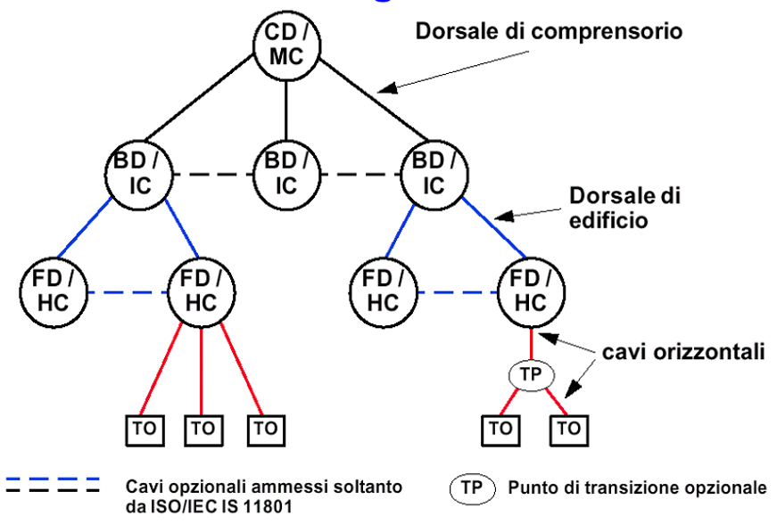

>[Torna a reti ethernet](archeth.md#documentazione)

- [Dettaglio architettura Zigbee](archzigbee.md)
- [Dettaglio architettura BLE](archble.md)
- [Dettaglio architettura WiFi infrastruttura](archwifi.md)
- [Dettaglio architettura WiFi mesh](archmesh.md) 
- [Dettaglio architettura LoraWAN](lorawanclasses.md) 

## **Albero degli apparati passivi** 

- È una rappresentazione **logica** di armadi,  dorsali e TO che ha il vantaggio di riassumere sinteticamente la struttura generale del cablaggio.
- La topologia è ad albero avente per radice l’armadio CD, per nodi gli armadi BD e FD, per foglie le prese TO. 
- I rami dell’albero sono le dorsali intese come singolo cavo di molteplicità base (4 per il doppino, 2 per la fibra). 
- L’architettura ha una profondità massima di tre livelli (campus, edificio, piano).
- Vanno riportati ed etichettati tutti gli armadi. Per quanto riguarda i TO vanno riportati ed etichettati il primo e l’ultimo.
- Ogni nodo DEVE diramare almeno verso altri due nodi di livello inferiore (se non è un ramo cioè una semplice giunzione tra due cavi)

Nello schema sopra sono stati riportati gli **A**P che sono **apparati attivi**. Formalmente sarebbe un **errore** dato che sarebbero dovuti essere rappresentati come una **presa TO**, però l'eccezione è stata voluta per rimarcare che sono dispostivi analoghi a **switch di accesso (AS)**, data l'elevata capacità di traffico che ciascuno è in grado di generare (**superiore al Gbps** nei modelli più recenti). Motivo per cui, nello schema, sono stati collegati a **switch di distribuzione** (con dorsali a 10 Gbps) invece che a scwitch di accesso (con dorsali a 1 Gbps).

## **Tabella delle dorsali** 

Serve stabilire qualità e quantità dei cavi permanenti (installati nell’edificio) impiegati nel cablaggio. Viene redatto subito dopo la planimetria e fornisce un quadro sinottico immediato di tutte le dorsali che è molto utile quando l'impianto è composto da parecchie dorsali.

Deve definire perlomeno le seguenti proprietà:
- **Sigla del cavo**, tipicamente un struttura X-Y dove X è la sigla dell’armadio di livello superiore a cui è collegato un capo del cavo, mentre Y è la sigla dell’armadio di livello inferiore (o del TO) a cui è collegato l’altro capo.
- **Tipo di cavo**. MMF o SMF per la fibra, UTP, FTP o STP per il doppino
- **Categoria**. OM1, OM2 , OM3 , OM4 , OM5 per la fibra MMF. Oppure OS1, OS2 per SMF. Cat 5e, cat 6, cat 6A, cat 7, cat 7A, cat 8 per il doppino.
- **Molteplicità**. Il numero di sottocavi inseriti in divisione di spazio (SDM) dentro il cavo di dorsale. In numero pari, tipicamente 2, 4, 6, 8, 12 per la fibra. Sempre 4 doppini trecciati per un cavo UTP, FTP o STP.
- **Lunghezza**. Misurata in metri e desumibile ad occhio dal percorso del cavo per come appare in planimetria. Stimata individualmente per ogni dorsale se questa è di primo o secondo livello (campus e piano), tipicamente stabilita in maniera forfettaria moltiplicando il numero di TO per una lunghezza media che può essere desunta approssimativamente dalla planimetria oppure stimata secondo un valore medio valido per l’Italia pari a 30m.
- **Ruolo**. Scopo per il quale è previsto quella dorsale. 

### **Cablaggio di campus** 

Nelle ultime due righe della tabella apparentemente ci sta un collegamento tra due armadi di pari livello BD, soluzione normalmente non permessa dallo standard. In realtà, si tratta di una semplice giunzione tra una delle coppie fibre che arrivano ad es su BD2 con una coppia di fibre che va verso BD9 allo scopo di prolungarla verso quell’armadio. La coppia di fibre in questione non viene permutata su BD2 ma solo su BD9. E’ una soluzione tecnica per riutilizzare su BD9 una fibra altrimenti sprecata sull’armadio BD2.

### **Cablaggio di edificio**

Si noti che gli AP sono stati considerati afferenti agli armadi di edificio piuttosto che a quelli di piano. Questa soluzione è particolarmente giustificata se gli AP realizzano una copertura ad alta densità/capacità verso client che consumano una grande mole di dati (bit rate elevata)

In questo caso un AP ha attualmente (WiFi6 e WiFi AC) una collegamento ad 1Gbps. Una costellazione ad alta densità potrebbe aggregarne anche una decina, per cui l’armadio che li serve dovrebbe avere una dorsale di almeno 10Gbps.

### **Cablaggio di piano**

## **Schema degli armadi** 

Non va definito per ogni singolo armadio ma per ogni tipo diverso di armadio. Due armadi sono da considerare diversi se hanno un numero di prese afferenti molto diverso (più di 24) e ruolo diverso.

Uno schema degli armadi dovrebbe stabilire le esigenze in termini di:
- **Numero di patch panel**. Si determina osservando l’albero degli apparati passivi per determinare il numero di TO e dividendo la quantità complessiva per 24 (numero standard di prese di un PP).
- **Numero di cassetti ottici**. Si determina osservando l’albero degli apparati passivi per determinare il numero di dorsali in fibra entranti (provenienti da un armadio di livello superiore) ed uscenti (verso un armadio di livello inferiore)
- **Etichettatura delle prese**. Se gli armadi hanno anche il ruolo di FD allora è buona norma numerare la prese TO dalla prima boccola del PP in su, mentre le dorsali andrebbero numerate dll’ultima in giù (ad es. dalla 24 in giù in caso di un solo PP, o dalla 48 in giù in caso di due PP)
- **Altezza** misurata in unità U.
- **Profondità** misurata in cm, tipicamente 45cm o 60 cm per FD e BD, almeno 70cm o 100cm per un CD.
- **Numero di spazi** vuoti (misurati in unità) dedicati allo smaltimento del calore tramite aereazione 
- **Numero di ciabatte** di alimentazione per i dispositivi attivi in esso contenuti (prese shuko) alte 1U
- **Numero di UPS** (Universal Power Supply), gruppi di continuità per garantire l’alimentazione elettrica tramite batterie in caso di sbalzi di tensione o brevi blackout. Per i blackout lunghi potrebbero comandare il corretto spegnimento dei dispositivi.

### **Schema CD**

Se si realizza un impianto fino a **24 dorsali** potrebbero servire:
- 1 patch panel 
- 1 cassetto ottico per ogni fibra che serve
- spazio vuoto 
- SW di core (CS). Alternative tipiche:
     - 12P 10Gbps + 2P SFP 
     - 12P 10Gbps + 12P SFP 
     - 24P 1Gbps + 2P SFP 
     - 24P 1Gbps + 2P 10Gbps + 2P SFP 
- router firewall bastion Host
- router e modem (packet filter)
- server di sistema, server di business (web, nas, database), server di dominio 
- spazio vuoto 
- 1 ciabatta per ogni server 
- 2 ups

### **Schema BD/FD**

- 1 patch panel ogni 24 prese 
- cassetti ottici (solitamente 1) 
- spazio vuoto 
- switch (vedi [apparati attivi](archeth.md#albero-degli-apparati-attivi)). Alternative tipiche:
    - 12P 10Gbps + 2P SFP 
    - 24P 1Gbps + 2P SFP 
    - 24P 1Gbps + 2P 10Gbps + 2P SFP 
• spazio vuoto 
• 1 ciabatta 
• 1 ups

>[Torna a reti ethernet](archeth.md#documentazione)

- [Dettaglio architettura Zigbee](archzigbee.md)
- [Dettaglio architettura BLE](archble.md)
- [Dettaglio architettura WiFi infrastruttura](archwifi.md)
- [Dettaglio architettura WiFi mesh](archmesh.md) 
- [Dettaglio architettura LoraWAN](lorawanclasses.md) 

