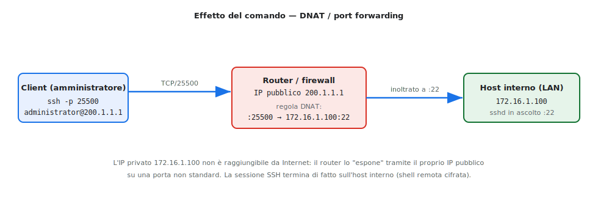
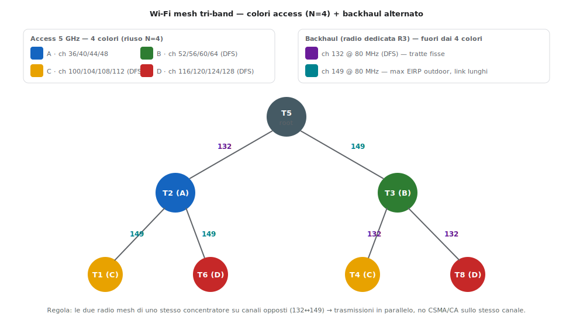
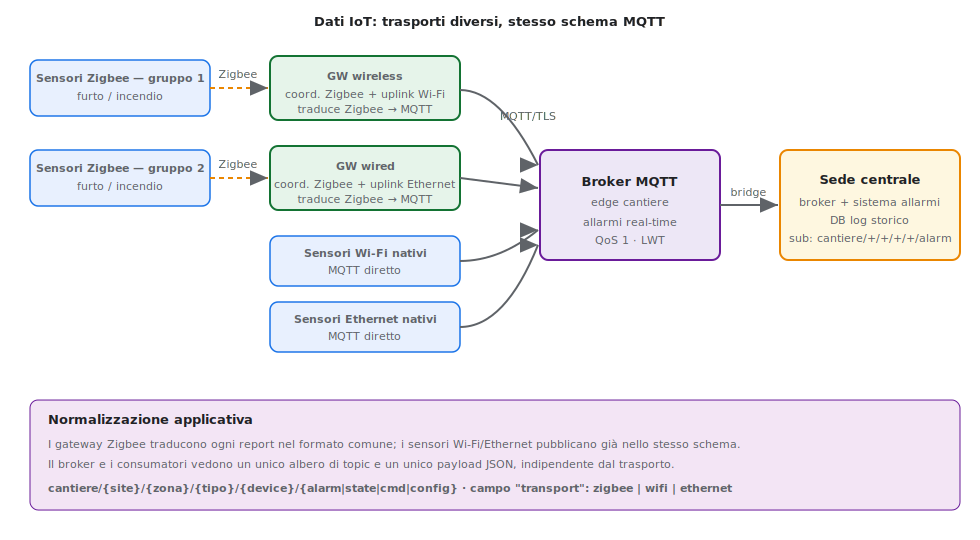
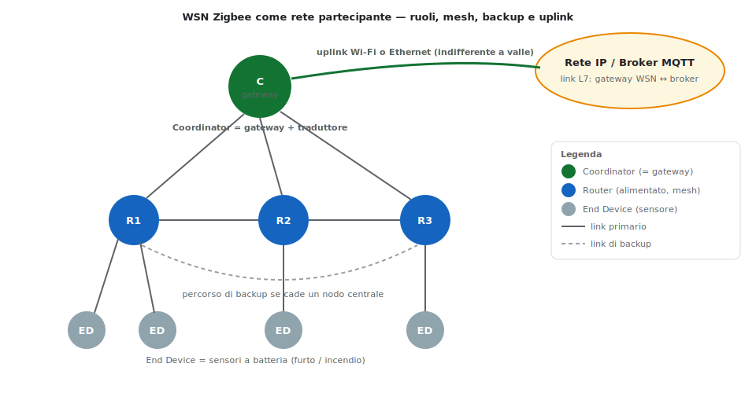
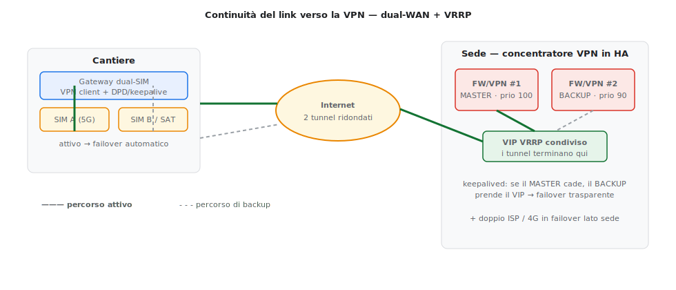
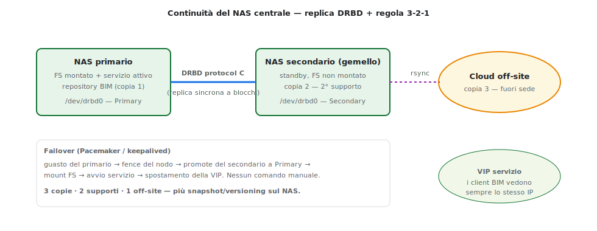
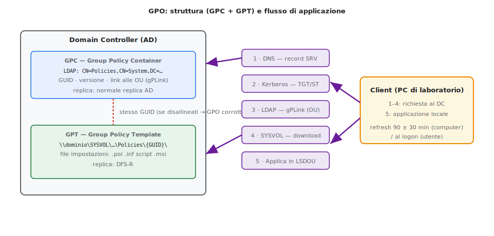

# Approfondimenti tecnici — A038 "Sistemi e Reti"
### Allegato a [risoluzione_A038_sistemi_reti_2026.md](risoluzione_A038_sistemi_reti_2026.md)

> Dettagli e comandi a corredo della Prima/Seconda parte: routing e autenticazione Wi-Fi mesh, SSID statico/dinamico, port-forward SSH in IOS, allocazione dei canali, dati IoT con schema MQTT comune, due ipotesi di continuità di servizio, il dettaglio comandi delle misure di sicurezza (Quesito II/III) e le GPO come piano di autorizzazione.

---

## 1 · Routing nel Wi-Fi mesh

A differenza di Ethernet e del Wi-Fi infrastruttura, in una **mesh il routing è sempre automatico**: i nodi scoprono da soli i percorsi tra loro, e le subnet dei link si assegnano automaticamente (**LLA / SLAAC**). Sostituisce sia il routing statico sia quello dinamico configurati a mano.

Protocolli tipici (uno solo, scelto dall'apparato):

| Protocollo | Tipo | Quando conviene |
|---|---|---|
| **AODV** | reattivo (on-demand) | topologie che cambiano spesso, pochi flussi |
| **OLSR** | proattivo (tabelle sempre pronte) | molti flussi, percorsi stabili |
| **Babel** | ibrido (distance-vector loop-free) | reti miste cablato/wireless |

**Mesh routed vs bridged** — due modi di trasportare il traffico tra i nodi:
- **routed (L3):** ogni hop è un salto IP; subnet diverse per link. Più scalabile, domini di broadcast piccoli.
- **bridged (L2):** i nodi formano un unico dominio L2; la stessa subnet si estende a tutta la mesh. Più semplice per i client, ma broadcast più ampio.

Per il cantiere conviene la **mesh routed** con almeno **un percorso LOS** tra vicini e **percorsi alternativi (backup)** se cade un nodo centrale (coerente con §3.3 del cheatsheet). Va sempre indicata la **posizione del controller** degli AP.

---

## 2 · Autenticazione dei nodi Wi-Fi mesh

Due piani distinti, entrambi a **L2** (ammissione alla rete), coerenti con lo stack del documento centrale:

1. **Reciproca tra nodi (backhaul).** I nodi mesh si autenticano *l'un l'altro* prima di formare il link wireless di dorsale: **WPA3-SAE** (o chiave mesh pre-condivisa nelle implementazioni 802.11s). Impedisce a un nodo non autorizzato di unirsi alla dorsale.
2. **Nodo ↔ servizi (AP su RADIUS).** Ogni AP/nodo è un client RADIUS e si autentica al server AAA centrale (come gli switch in §19): è il presupposto per l'assegnazione dinamica della VLAN (vedi §3 sotto).

Lato **client** (operatori/tablet) resta l'**802.1X / WPA2-3-Enterprise** verso RADIUS, esattamente come sul Wi-Fi infrastruttura.

Configurazione del nodo come **client RADIUS** (impianto §19 del cheatsheet):

```cisco
! Sull'apparato (switch/WLC che gestisce gli AP)
SW(config)# aaa new-model
SW(config)# aaa authentication dot1x default group radius local
SW(config)# dot1x system-auth-control
SW(config)# radius-server host 10.0.30.10 auth-port 1812 acct-port 1813 key <chiave>
```

```ini
# FreeRADIUS — clients.conf (l'AP/nodo è un client del RADIUS)
client 10.0.99.0/24 {
    secret    = <chiave>          # IDENTICA al "key" sull'apparato
    shortname = ap-cantiere
}
```

> ⚠️ La `secret` di `clients.conf` **deve coincidere** con `key` di `radius-server host`: un mismatch fa fallire silenziosamente tutte le autenticazioni.

---

## 3 · SSID statico vs dinamico (associazione VLAN↔SSID)

| Approccio | Come funziona | Pro / Contro |
|---|---|---|
| **SSID statico** | un **SSID per VLAN** (es. `Cantiere-Tablet`→VLAN 10, `Cantiere-Sensori`→VLAN 30) | semplice; ma molti SSID "inquinano" l'etere e vanno gestiti su ogni AP |
| **SSID dinamico** | **un solo SSID**; è il RADIUS a dire al NAS in quale VLAN mettere l'utente, in base al **gruppo LDAP** | un SSID solo; policy centralizzata; aggiungere un utente = solo LDAP |

Nel caso dinamico il RADIUS restituisce nell'`Access-Accept` gli attributi RFC 2868:

```ini
# Attributi RADIUS restituiti al NAS (contenuto di file)
Tunnel-Type             = VLAN
Tunnel-Medium-Type      = IEEE-802
Tunnel-Private-Group-Id = "10"        # VLAN ID di destinazione
```

Smistamento per **gruppo LDAP** (un unico SSID, ognuno nella VLAN giusta):

```ini
# FreeRADIUS — policy per gruppo (contenuto di file)
DEFAULT Ldap-Group == "cn=tablet,ou=cantiere,dc=sito,dc=it"
        Tunnel-Type = VLAN, Tunnel-Medium-Type = IEEE-802, Tunnel-Private-Group-Id = "10"
DEFAULT Ldap-Group == "cn=sensori,ou=cantiere,dc=sito,dc=it"
        Tunnel-Type = VLAN, Tunnel-Medium-Type = IEEE-802, Tunnel-Private-Group-Id = "30"
DEFAULT Auth-Type := Reject
```

> Stesso meccanismo per confinare un profilo sospeso in una **VLAN di quarantena**. **Consiglio per il cantiere:** SSID **dinamico** se l'identità è centralizzata su AD/LDAP; SSID statici solo per reti molto piccole o dispositivi che non parlano 802.1X.

---

## 4 · Port forwarding SSH in Cisco IOS (DNAT)

Esporre l'SSH di un host interno (`10.13.0.40:22`) su una porta di facciata (`:2222`) dell'IP pubblico del router — stessa idea del Quesito IV, realizzata con un **DNAT** (impianto §8 del cheatsheet).



| Traffico in ingresso | Protocollo | Azione | Destinazione tradotta |
|---|---|---|---|
| `200.1.1.1 : 2222` | TCP | DNAT | `10.13.0.40 : 22` |

```cisco
! — Parte comune: interfacce inside/outside
R(config)# interface GigabitEthernet0/0
R(config-if)# ip address 10.13.0.254 255.255.255.0
R(config-if)# ip nat inside
R(config-if)# exit
R(config)# interface GigabitEthernet0/1
R(config-if)# ip address 200.1.1.1 255.255.255.252
R(config-if)# ip nat outside
R(config-if)# exit

! — Port-forward (DNAT): TCP :2222 pubblico → 10.13.0.40:22 interno
! formato: ip nat inside source static tcp <inside-local> <porta> <inside-global> <porta>
R(config)# ip nat inside source static tcp 10.13.0.40 22 200.1.1.1 2222
```

ACL WAN coerente con il default-deny (§17.1) — il `permit` si scrive sull'indirizzo/porta di **facciata**, perché l'ACL inbound è valutata **prima** della traduzione:

```cisco
R(config)# ip access-list extended ACL-WAN
R(config-ext-nacl)# permit tcp any host 200.1.1.1 eq 2222   ! ← SSH esposto
R(config-ext-nacl)# deny   ip any any                        ! ← default deny
R(config-ext-nacl)# exit
R(config)# interface GigabitEthernet0/1
R(config-if)# ip access-group ACL-WAN in
```

Verifica: `R# show ip nat translations` · `R# show ip nat statistics` · `R# debug ip nat`.

> Comando utente: `ssh -p 2222 studente@200.1.1.1` → la sessione termina su `10.13.0.40:22`. Differenza con HAProxy (reverse proxy L4): il DNAT è pura riscrittura di pacchetti, niente health-check / bilanciamento / log di sessione / HA.

---

## 5 · Allocazione dei canali (Wi-Fi mesh tri-band, EU)

**Principio guida:** *vicini nello spazio → frequenze lontane; lontani → frequenze anche vicine* (la propagazione li disaccoppia). Mai **access** e **backhaul** sulla **stessa** radio: il CSMA/CA serializza e dimezza il throughput a ogni hop → da qui la scelta **tri-band**.



Le tre radio dell'apparato:

| Radio | Banda | Ruolo | Per chi |
|---|---|---|---|
| R1 | 2.4 GHz | Access | client legacy / IoT |
| R2 | 5 GHz lower (36–64) | Access | client moderni (Wi-Fi 6) |
| R3 | 5 GHz upper DFS (100–144) | **Backhaul** | solo nodi mesh, 80 MHz |

Canali **access** — 4 "colori" (riuso N=4), spettralmente disgiunti:

| Colore | Canale 80 MHz | Slot 20 MHz | DFS |
|---|---|---|---|
| A | `ch 36 @ 80` | 36·40·44·48 | no |
| B | `ch 52 @ 80` | 52·56·60·64 | sì |
| C | `ch 100 @ 80` | 100·104·108·112 | sì |
| D | `ch 116 @ 80` | 116·120·124·128 | sì |

In **2.4 GHz** solo **1 · 6 · 11** non si sovrappongono → riuso a 3 colori.

Canali **backhaul** — sempre fuori dai 4 colori access:

| Canale | DFS | Perché |
|---|---|---|
| `ch 132 @ 80` | sì | lontano dall'access, stabile su tratte fisse |
| `ch 149 @ 80` | **no** | massimo EIRP outdoor (30 dBm), link lunghi |

**Backhaul ad albero — regola dell'alternanza:** le due radio mesh di uno stesso concentratore stanno su canali **opposti** (132 ↔ 149), così le trasmissioni concorrenti vanno in parallelo invece di finire in CSMA/CA sullo stesso canale:

```
        T5 (root)
     132 /     \ 149
       T2        T3        ← concentratori
   149 /  \      /  \ 132
   T1   T6    T4    T8     ← foglie (1 sola radio mesh)
```

**Procedura:** (1) disegna la griglia degli AP; (2) colora le celle access A/B/C/D, adiacenti = colori diversi; (3) riusa un colore solo tra celle ben separate; (4) 2.4 GHz con 1/6/11; (5) backhaul alterna 132/149 lungo l'albero; (6) **site survey** (RSSI/SNR) e affina. **Access in Auto-RF; backhaul a mano** (l'Auto-RF destabilizza i P2P fissi).

EIRP (EU, indicativo): 2.4 GHz 20–24 dBm · 5 GHz DFS ~23 dBm indoor / ~30 dBm outdoor · U-NII-3 (149+) massima outdoor.

---

## 6 · Dati IoT: sensori Zigbee/Wi-Fi/Ethernet e schema MQTT comune

**Architettura.** I sensori di sicurezza arrivano da **trasporti diversi**, ma confluiscono in un **unico modello applicativo** MQTT:

- **Zigbee — gruppo 1** → **gateway wireless** (coordinatore Zigbee con uplink **Wi-Fi** alla VLAN sensori).
- **Zigbee — gruppo 2** → **gateway wired** (coordinatore Zigbee con uplink **Ethernet/PoE**).
- **Sensori Wi-Fi nativi** ed **Ethernet nativi** (IP) → pubblicano **direttamente** su MQTT.

I dispositivi Zigbee **non parlano IP/MQTT**: è il **coordinatore/gateway** a fare da traduttore, mappando ogni report Zigbee nello **schema comune**. I dispositivi IP pubblicano già nello stesso formato. Così **broker e consumatori vedono un solo albero di topic e un solo payload**, qualunque sia il trasporto.



Il **broker MQTT** sta **sull'edge del cantiere** (allarmi real-time locali) e fa **bridge** verso il broker di sede (segnalazioni + log storico), coerente con la Prima parte. I publisher si autenticano al broker in **mTLS** (livello L4/5 dello stack di autenticazione), con **ACL per topic** sul broker.

### 6.1 Albero dei topic (comune a tutti i dispositivi)

```
cantiere/{site}/{zona}/{tipo}/{device}/{canale}
```

| Segmento | Valori | Note |
|---|---|---|
| `site` | `1`…`5` | id cantiere |
| `zona` | `zona-A`, `zona-B`, … | area del cantiere |
| `tipo` | `fire`, `intrusion`, `gas`, … | almeno **incendio** e **furto** |
| `device` | `SMK-0007`, `PIR-0042` | id univoco del sensore |
| `canale` | `alarm` · `state` · `cmd` · `config` | allarme · stato/heartbeat · comando · configurazione |

Esempi: `cantiere/1/zona-A/fire/SMK-0007/alarm` (incendio) · `cantiere/1/zona-B/intrusion/PIR-0042/alarm` (furto).

**Sottoscrizioni** (con wildcard): la sede prende **tutti gli allarmi** con `cantiere/+/+/+/+/alarm`; il notificatore locale di un cantiere usa `cantiere/1/#`; per i soli incendi `cantiere/+/+/fire/+/alarm`.

### 6.2 Payload JSON comune

Stesso schema per Wi-Fi, Zigbee ed Ethernet; i campi `transport` e `gateway` registrano la provenienza **senza** cambiare la struttura.

| Campo | Tipo | Significato |
|---|---|---|
| `schema` | string | versione del formato (es. `"1.0"`) |
| `ts` | string | timestamp ISO-8601 UTC |
| `site` / `zone` | string | cantiere e zona |
| `device_id` | string | id del sensore |
| `type` | string | `fire` \| `intrusion` \| `gas` \| … |
| `event` | string | `alarm` \| `clear` \| `heartbeat` \| `offline` |
| `severity` | string | `info` \| `warning` \| `critical` |
| `value` | number | misura o booleano (0/1) |
| `transport` | string | `zigbee` \| `wifi` \| `ethernet` |
| `gateway` | string\|null | id del gateway (per i Zigbee), `null` per i nativi IP |
| `battery` / `rssi` | number\|null | salute del dispositivo |

Allarme **furto** (sensore Zigbee dietro il gateway wired):

```json
{
  "schema": "1.0",
  "ts": "2026-06-19T02:41:09Z",
  "site": "cantiere-1", "zone": "zona-B",
  "device_id": "PIR-0042",
  "type": "intrusion", "event": "alarm", "severity": "critical",
  "value": 1,
  "transport": "zigbee", "gateway": "gw-wired-01",
  "battery": 78, "rssi": -67
}
```

Allarme **incendio** (sensore Wi-Fi nativo):

```json
{
  "schema": "1.0",
  "ts": "2026-06-19T10:15:32Z",
  "site": "cantiere-1", "zone": "zona-A",
  "device_id": "SMK-0007",
  "type": "fire", "event": "alarm", "severity": "critical",
  "value": 1,
  "transport": "wifi", "gateway": null,
  "battery": 91, "rssi": -58
}
```

Messaggio di **stato/heartbeat** (canale `state`) e **comando** (canale `cmd`, es. tacitazione sirena):

```json
{ "schema":"1.0","ts":"2026-06-19T10:10:00Z","site":"cantiere-1","zone":"zona-A",
  "device_id":"SMK-0007","type":"fire","event":"heartbeat","value":0,
  "transport":"wifi","gateway":null,"battery":91,"rssi":-58 }
```
```json
{ "schema":"1.0","ts":"2026-06-19T10:16:00Z","cmd":"silence","ttl_s":60,"by":"operator:mrossi" }
```

### 6.3 Affidabilità (QoS, retain, LWT)

- **Allarmi**: **QoS 1** (almeno una consegna), **non** retained → un allarme è un evento, non uno stato.
- **Stato**: pubblicato **retained** sul canale `state` → un nuovo subscriber conosce subito l'ultimo stato noto.
- **LWT (Last Will & Testament)**: ogni dispositivo/gateway imposta un *will* sul proprio `.../state` con `event:"offline"`; se cade, il broker lo pubblica → si rileva un sensore di sicurezza scollegato.

### 6.4 Bridge edge → sede (Mosquitto, su mTLS)

```ini
# /etc/mosquitto/conf.d/bridge.conf  — broker di cantiere
connection bridge-sede
address broker.sede.local:8883
topic cantiere/1/# out 1                 # inoltra (out) tutti i topic del cantiere, QoS 1
bridge_cafile  /etc/mosquitto/certs/ca.crt
bridge_certfile /etc/mosquitto/certs/gw.crt   # mTLS: identità del gateway
bridge_keyfile  /etc/mosquitto/certs/gw.key
```

> In sede il sistema allarmi si abbona a `cantiere/+/+/+/+/alarm` per furto/incendio in tempo reale; lo stesso flusso alimenta il **DB di log storico**.

### 6.5 Le WSN Zigbee come reti partecipanti (federazione)

Una **WSN Zigbee** è una rete con tre ruoli di nodo, organizzati a **mesh**:

- **Coordinator** (uno per WSN): forma e governa la rete; **coincide con il gateway** verso la rete IP.
- **Router**: nodi alimentati che instradano e formano la mesh, estendendo la copertura.
- **End Device**: sensori a batteria (furto/incendio) a basso consumo, che dormono e parlano col nodo "genitore".



La topologia prevede almeno **un percorso verso il coordinatore** e **percorsi di backup** se cade un nodo centrale o il gateway (§3.5). Il **gateway = Coordinator + traduttore**: chiude la WSN Zigbee e la ripubblica nel mondo IP. Il suo **uplink verso la rete IP può essere Wi-Fi oppure Ethernet** e, dal punto di vista della rete IP e di MQTT, **è indifferente**: in entrambi i casi la WSN "partecipa" alla stessa rete di distribuzione IP e pubblica sullo **stesso broker** con lo **stesso schema** (§6.2). Si possono quindi avere una WSN dietro un gateway con uplink **Wi-Fi** e un'altra dietro un gateway con uplink **Ethernet**: a livello applicativo sono identiche.

**Federazione di reti** (§1.1): più WSN Zigbee, ciascuna col proprio coordinatore/gateway, si aggregano sulla **rete di distribuzione IP** e su un **broker MQTT a comune** — il link applicativo L7 è *gateway WSN ↔ broker*. Ogni WSN resta un dominio Zigbee a sé (con **PAN-ID e canale distinti** per non interferire), ma a valle convergono in un unico modello dati.

- **Sede dell'elaborazione** (§3.5): **edge** sul gateway per gli allarmi locali immediati; **remota** in sede per log storico e correlazione.
- **Tipologia di servizio**: **comando asincrono** (event-driven) per gli allarmi; **polling sincrono** per lo stato periodico.
- **Sicurezza**: la WSN autentica i nodi con **chiave di rete/link (PSK)** — *non* mTLS, coerente con lo stack del documento centrale; la mutua a certificati (**mTLS**) compare solo sul salto **gateway → broker**.
- **Vincoli radio**: i canali Zigbee (2.4 GHz) si scelgono per **non interferire** col Wi-Fi access (es. Zigbee ch 15/20/25/26 a cavallo dei "buchi" tra Wi-Fi 1/6/11).

---


## 7 · Continuità di servizio — link verso la VPN

**Ipotesi.** Il canale cantiere↔sede non deve interrompersi: si combinano **ridondanza del link** (lato cantiere) e **alta disponibilità del concentratore VPN** (lato sede).



- **Lato cantiere:** gateway **dual-SIM** (due operatori) o **5G + satellitare** in **failover automatico**; VPN con **Dead Peer Detection** e riconnessione, **due tunnel ridondati** verso la sede; **QoS** che prioritizza gli allarmi.
- **Lato sede:** **due firewall/concentratori VPN** in **VRRP** (keepalived): un **IP virtuale (VIP)** su cui terminano i tunnel; se il MASTER cade, il BACKUP prende il VIP → **failover trasparente**. In più **doppio ISP + 4G** in failover e **UPS**.

Configurazione **VRRP con keepalived** (un solo file, due valori diversi sui due nodi — §10):

```ini
# /etc/keepalived/keepalived.conf
vrrp_script chk_vpn {
    script   "pidof openvpn"      # o il processo del concentratore
    interval 2
}
vrrp_instance VI_1 {
    state            MASTER       # BACKUP sul secondo nodo
    interface        eth0
    virtual_router_id 51          # IDENTICO sui due nodi
    priority         100          # 90 sul BACKUP
    advert_int       1
    authentication { auth_type PASS; auth_pass 1234 }   # IDENTICO
    virtual_ipaddress { 10.0.40.1 }                     # VIP: i tunnel terminano qui
    track_script { chk_vpn }
}
```

> Se il processo VPN muore, `track_script` abbassa la `priority` sotto quella del BACKUP, che subentra. Verifica: `ip addr show eth0` (il VIP compare sul MASTER) · `tcpdump -i eth0 vrrp`.

---

## 8 · Continuità di servizio — NAS centrale (repository BIM)

**Ipotesi.** Il repository delle nuvole di punti/video è un asset critico: serve **replica**, **failover** e **copia off-site** (regola **3-2-1**).



- **Replica a blocchi DRBD** (sincrona, `protocol C`) tra **NAS primario** e **NAS gemello**: la scrittura ritorna OK solo dopo l'ACK del secondario → nessuna perdita.
- **Failover automatico** con Pacemaker/keepalived: al guasto, promozione del secondario, mount del FS, avvio servizio, spostamento della VIP — i client BIM vedono sempre lo stesso IP.
- **Regola 3-2-1:** 3 copie, 2 supporti, 1 **off-site** (cloud), più **snapshot/versioning** sul NAS per il ripristino puntuale. Accesso ai backup riservato agli amministratori (AAA).

Risorsa **DRBD** (§12):

```ini
# /etc/drbd.d/r0.res
resource r0 {
  protocol C;                       # replica sincrona
  on nas1 { device /dev/drbd0; disk /dev/sdb1; address 10.0.30.21:7789; meta-disk internal; }
  on nas2 { device /dev/drbd0; disk /dev/sdb1; address 10.0.30.22:7789; meta-disk internal; }
}
```

```bash
# Init (su ENTRAMBI i nodi)
drbdadm create-md r0 && drbdadm up r0
# Primo sync (SOLO sul primario)
nas1# drbdadm primary --force r0
nas1# mkfs.ext4 /dev/drbd0 && mount /dev/drbd0 /mnt/repository
```

Failover automatico con il cluster manager:

```bash
nas1# pcs resource create drbd ocf:linbit:drbd drbd_resource=r0
nas1# pcs resource promotable drbd promoted-max=1
nas1# pcs resource create fs Filesystem device=/dev/drbd0 directory=/mnt/repository fstype=ext4
nas1# pcs resource create vip IPaddr2 ip=10.0.30.20 cidr_netmask=24
# ordine: promuovi drbd → monta fs → avvia servizio → alza la VIP
```

Copia **off-site** verso il cloud (incrementale, regola 3-2-1):

```bash
# cron sul NAS — ogni notte alle 02:00
0 2 * * *  rsync -avz --delete /mnt/repository/  utente@cloud_host:/backup/repository/
```

> In **restore** usare sempre `--numeric-ids` per conservare UID/GID. Provare prima con `--dry-run`.

---

## 9 · Dettaglio comandi delle misure di sicurezza (Quesito II / III)

Comandi a corredo delle misure aggiunte nel Quesito II (e nel Quesito III), nello stile della dispensa.

### 9.1 IPsec a protezione del tunnel GRE (IOS, IKEv2 · AES-256 / SHA-256)

Cifra e autentica il tunnel `Tunnel1` del §Punto 3 (GRE già incapsula → IPsec in **transport mode**).

```cisco
crypto ikev2 proposal IKEV2-PROP
 encryption aes-cbc-256
 integrity  sha256
 group 14
crypto ikev2 policy IKEV2-POL
 proposal IKEV2-PROP
crypto ikev2 keyring KR
 peer CANTIERE1
  address <IP-pub-cantiere1>
  pre-shared-key <chiave>
crypto ikev2 profile IKEV2-PROF
 match identity remote address <IP-pub-cantiere1> 255.255.255.255
 authentication remote pre-share
 authentication local  pre-share
 keyring local KR

crypto ipsec transform-set TS esp-aes 256 esp-sha256-hmac
 mode transport
crypto ipsec profile IPSEC-PROF
 set transform-set TS
 set ikev2-profile IKEV2-PROF

interface Tunnel1
 tunnel protection ipsec profile IPSEC-PROF
```

```cisco
! Anti-replay (abilitato di default): si può ampliare la finestra
crypto ipsec security-association replay window-size 128
```

> Per certificati invece di PSK: `authentication … rsa-sig` + trustpoint PKI. Verifica: `show crypto ikev2 sa`, `show crypto ipsec sa`.

### 9.2 Cifratura dei dati a riposo — LUKS (AES-256-XTS)

```bash
# key-size 512 ⇒ AES-256 in modalità XTS (la chiave XTS è divisa in due metà)
cryptsetup luksFormat --type luks2 --cipher aes-xts-plain64 --key-size 512 /dev/sdb
cryptsetup open /dev/sdb repo_crypt
mkfs.ext4 /dev/mapper/repo_crypt
mount /dev/mapper/repo_crypt /mnt/repository
```

### 9.3 Wi-Fi WPA3 + Client Isolation — hostapd

```ini
# /etc/hostapd/hostapd.conf
ssid=Cantiere-Tablet
wpa=2
wpa_key_mgmt=SAE          # WPA3-Personal (SAE). Enterprise: WPA-EAP-SHA256 + 802.1X/RADIUS
rsn_pairwise=CCMP
ieee80211w=2              # PMF obbligatorio (richiesto da WPA3)
sae_password=<password>
ap_isolate=1             # Client Isolation: i client non comunicano tra loro
```

> Su WLC/AP Cisco l'equivalente è il **P2P Blocking Action = Drop** sulla WLAN.

### 9.4 Failover SD-WAN/dual-WAN con IP SLA (IOS)

Sonda sul link primario; se cade, entra la rotta flottante di backup.

```cisco
ip sla 1
 icmp-echo 8.8.8.8 source-interface GigabitEthernet0/1
 frequency 5
ip sla schedule 1 life forever start-time now
track 1 ip sla 1 reachability

ip route 0.0.0.0 0.0.0.0 <gw-primario> track 1   ! attiva solo se il track è up
ip route 0.0.0.0 0.0.0.0 <gw-backup> 10          ! AD 10 = flottante: subentra alla caduta
```

> Verifica: `show ip sla statistics`, `show track 1`, `show ip route`.

### 9.5 Ridondanza dello storage — RAID

Il RAID dà **tolleranza ai guasti disco** (e talvolta prestazioni) aggregando più dischi in un volume logico. È la ridondanza del **singolo nodo**: si somma a DRBD (§8) e alla regola 3-2-1, **non li sostituisce**, e **non è un backup** (non protegge da cancellazioni logiche, ransomware o doppio guasto oltre la soglia).

**Scelta del livello** (i più usati):

| Livello | Min dischi | Tollera | Capacità utile | Note d'uso |
|---|---|---|---|---|
| RAID 0 | 2 | nessun guasto | 100% | solo prestazioni (scratch) — mai per dati |
| RAID 1 | 2 | 1 disco | 50% | mirror, semplice e robusto (boot, DB piccoli) |
| RAID 5 | 3 | 1 disco | (n−1)/n | parità singola; rischioso su dischi grandi (rebuild lungo) |
| **RAID 6** | 4 | **2 dischi** | (n−2)/n | **doppia parità** — consigliato per repository capienti |
| **RAID 10** | 4 | 1 per coppia | 50% | mirror+stripe — **prestazioni + ridondanza** (DB, I/O alto) |

Per il **repository BIM** (nuvole di punti, file grandi e sequenziali, alta capacità) → **RAID 6**; per i **server applicativi/DB** con molte scritture casuali → **RAID 10**.

**Parametri che di solito si configurano** (al netto della "babele" hardware/software):

- **Hot spare**: disco di riserva che subentra **automaticamente** al guasto, avviando il rebuild senza intervento.
- **Chunk/stripe size**: dimensione del blocco di striping; **grande** (es. 256–512 KB) per file grandi e sequenziali (point cloud), **piccola** per I/O casuale.
- **Write-intent bitmap** (software): velocizza il **resync** dopo crash o rimozione temporanea di un disco.
- **Allineamento del filesystem** al RAID (`stride`/`stripe-width`) per non spezzare le scritture.
- **Monitoraggio**: demone di notifica array + **SMART** sui dischi (preavviso di guasto); **scrubbing** periodico (patrol read) per scoprire errori latenti.
- **Cache di scrittura** (controller hardware): write-back **solo con BBU/flash-backed cache**, altrimenti write-through per non perdere dati a un calo di tensione.

**Esempio con mdadm (software RAID Linux):**

```bash
# RAID 6 con 4 dischi + 1 hot spare, chunk 256K per file grandi
mdadm --create /dev/md0 --level=6 --raid-devices=4 --spare-devices=1 \
      --chunk=256 /dev/sd[b-f]
mdadm --grow /dev/md0 --bitmap=internal        # write-intent bitmap (resync rapido)

# Filesystem allineato allo stripe (ext4): stride = chunk/blocco; stripe-width = stride × dischi-dati
mkfs.ext4 -b 4096 -E stride=64,stripe-width=128 /dev/md0   # 256K/4K=64 ; 64×2(dati) =128

mdadm --detail --scan >> /etc/mdadm/mdadm.conf  # rende persistente l'array
mdadm --monitor --scan --mail admin@sede.local --daemonise   # alert sui guasti
```

```bash
# Operazioni tipiche
mdadm --detail /dev/md0                 # stato, dischi, livello
mdadm /dev/md0 --fail /dev/sdb --remove /dev/sdb   # gestione disco guasto
echo check > /sys/block/md0/md/sync_action          # scrubbing on-demand
```

> Su **controller RAID hardware** o **ZFS** i comandi cambiano (vendor-specific), ma i concetti — livello, hot spare, stripe, cache+BBU, scrubbing, monitoraggio SMART — sono gli stessi.

### 9.6 Blocklist estensioni del browser via GPO (Quesito III)

Policy di dominio applicate come chiavi di registro (Chrome; per Edge il ramo è `…\Microsoft\Edge\…`).

```
# Blocca tutte le estensioni e consente solo quelle approvate
HKLM\Software\Policies\Google\Chrome\ExtensionInstallBlocklist
  1 = "*"
HKLM\Software\Policies\Google\Chrome\ExtensionInstallAllowlist
  1 = "<extension_id_approvato_dai_docenti>"
```

> Impedisce i plugin IA (anche negli IDE/web) che aggirerebbero il filtro di rete; si abbina al filtraggio DNS/SNI del Quesito III.

---

## 10 · Le GPO come piano di autorizzazione

Le **GPO (Group Policy Objects)** non sono solo un "blocca-impostazioni": sono il **piano di controllo centralizzato delle autorizzazioni sugli endpoint** di un dominio Active Directory. Applicano regole a **computer** e **utenti** in base alla loro **posizione nell'albero AD (OU)**, e così **modulano l'accesso alle risorse** (file, stampanti, software, porte USB, script, applicazioni) — autorizzandolo o negandolo per ruolo e per postazione, **senza intervenire sulle singole macchine**. È la centralizzazione operativa del *minimo privilegio* lato client.

### 10.1 Struttura e memorizzazione (GPC + GPT)

Una GPO vive in **due metà fisicamente separate** sul DC, legate dallo **stesso GUID**:



| Parte | Dove | Contenuto |
|---|---|---|
| **GPC** (Group Policy Container) | oggetto **LDAP** in `CN=Policies,CN=System,DC=…` | metadati: GUID, versione, link alle OU (`gPLink`); replica AD |
| **GPT** (Group Policy Template) | cartella in `\\dominio\SYSVOL\…\Policies\{GUID}\` | i file delle impostazioni (`.pol`, `.inf`, script, `.msi`); replica DFS-R |

Il **SYSVOL** è condiviso su ogni DC e accessibile dai client. Se GPC e GPT si **disallineano** (versioni diverse) i client ricevono GPO **corrotte/incomplete**: la coerenza dei due replicatori è essa stessa un requisito di sicurezza.

### 10.2 Precedenza: LSDOU

L'ordine di applicazione determina chi "vince" quando più GPO toccano la stessa impostazione:

| Ordine | Livello | Descrizione |
|---|---|---|
| 1° | **L** — Local | policy locali del singolo PC (senza AD); sovrascrivibili da tutto il resto |
| 2° | **S** — Site | legate al sito AD (es. proxy diverso per Milano e Roma) |
| 3° | **D** — Domain | per tutto il dominio (password, screensaver, antivirus) |
| 4° | **OU** — Organizational Unit | **vince su tutto**; più la OU è specifica/annidata, più ha priorità |

> **Regola d'oro:** si applicano in ordine 1→4 e **l'ultima vince**; a parità di livello, tra più GPO quella con *link order* più basso è applicata per ultima (e prevale).

### 10.3 La doppia leva: Computer vs Utente

Ogni GPO ha due sezioni indipendenti — separano il *dove* dal *chi*:

| Sezione | Quando | Esempi |
|---|---|---|
| **Computer Configuration** | all'avvio, prima del login; vale per qualunque utente | install software, firewall Windows, disabilita USB |
| **User Configuration** | al logon; segue l'utente su qualsiasi PC | mappature stampanti/cartelle, restrizioni, blocklist estensioni |

Applicato al **Quesito III**: lo *studente* (user config) non installa estensioni IA ovunque si logghi; il *PC del laboratorio* (computer config) ha le USB disabilitate per chiunque; e mettendo ogni **laboratorio in una OU** diversa si profila il blocco **per laboratorio** — la stessa profilazione fatta in rete con VLAN/IP sorgente, qui realizzata a livello di **identità/OU** (complementare).

### 10.4 «Le applicazioni si interfacciano con loro»: gli ADMX

Le applicazioni (Chrome, Edge, Office, antivirus, client VPN…) pubblicano **template amministrativi ADMX** che *estendono* le GPO: la stessa infrastruttura diventa il punto di controllo unico anche delle impostazioni applicative. È per questo che il blocco delle estensioni IA del Quesito III **è** una GPO — Chrome/Edge espongono via ADMX le chiavi che la GPO scrive nel ramo `Policies` del registro:

```
HKLM\Software\Policies\Google\Chrome\ExtensionInstallBlocklist  →  1 = "*"
HKLM\Software\Policies\Google\Chrome\ExtensionInstallAllowlist  →  1 = "<id_approvato>"
```

### 10.5 Come arrivano al client (e perché aggancia tutto lo stack)

1. **DNS** — il client trova il DC con i record SRV `_ldap._tcp` e `_kerberos._tcp`.
2. **Kerberos** — autenticazione → TGT → service ticket per CIFS/SYSVOL.
3. **LDAP** — chiede ad AD quali GPO valgono per la sua OU (`gPLink`).
4. **SYSVOL** — scarica i file da `\\dominio\SYSVOL\…\Policies\{GUID}\`.
5. **Applicazione** — in ordine **LSDOU**; refresh ogni **90 ± 30 min** (computer) o al logon (utente).

Le GPO sono quindi il **consumatore finale** di DNS + Kerberos + LDAP + SSO/AD del Punto 4: senza quell'infrastruttura non vengono nemmeno consegnate. Chiudono il cerchio *autenticazione → autorizzazione → enforcement sull'endpoint*.

```
gpupdate /force            forza il ricalcolo immediato di tutte le GPO
gpresult /r                mostra le GPO applicate a utente/computer
gpresult /h report.html    report HTML con le GPO "vincitrici"
```

### 10.6 Il dettaglio fine: il «quando» resta in rete

Poiché le GPO si rinfrescano ogni **90 ± 30 min** (non sono istantanee), nel Quesito III la **schedulazione oraria** del blocco IA conviene tenerla a livello di **rete** (time-based ACL/proxy), affidando alle GPO il *chi/cosa/dove* (per ruolo e per laboratorio). Lo sblocco immediato si forza con `gpupdate /force` o spostando computer/utente tra OU.

### 10.7 Applicazione allo scenario BIM (sede centrale)

Nello stesso dominio AD del Punto 2/4 le GPO **operativizzano il minimo privilegio** sugli endpoint:

- **Accesso al repository/CDE**: mappatura unità e permessi per gruppo (user config).
- **Hardening delle workstation BIM**: firewall Windows, USB, software consentito (computer config).
- **Distribuzione dei certificati** per **802.1X/mTLS** e **deploy del client VPN** via GPO.

Le GPO sono cioè lo strumento che traduce in pratica, sugli endpoint, l'autenticazione e l'autorizzazione progettate a livello di rete.
