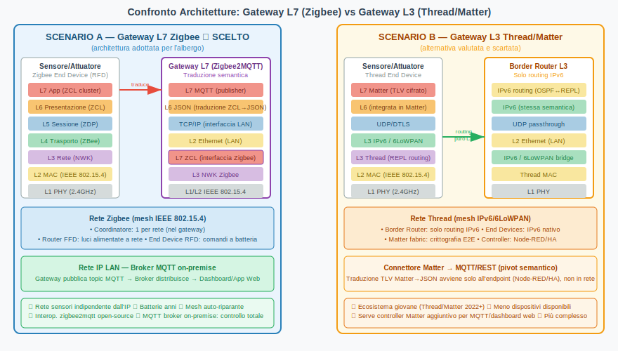
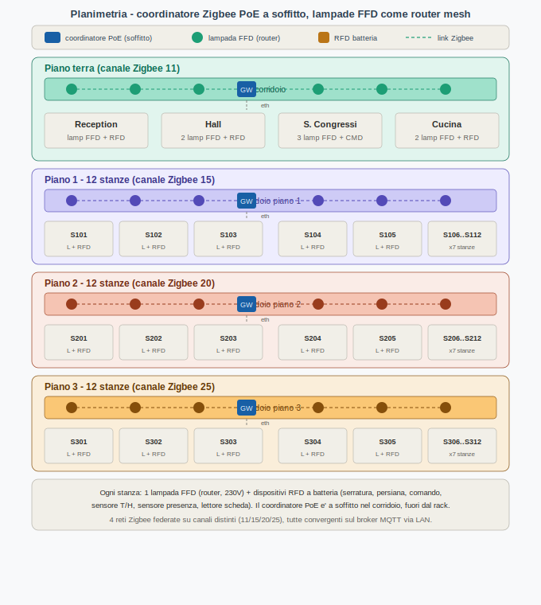
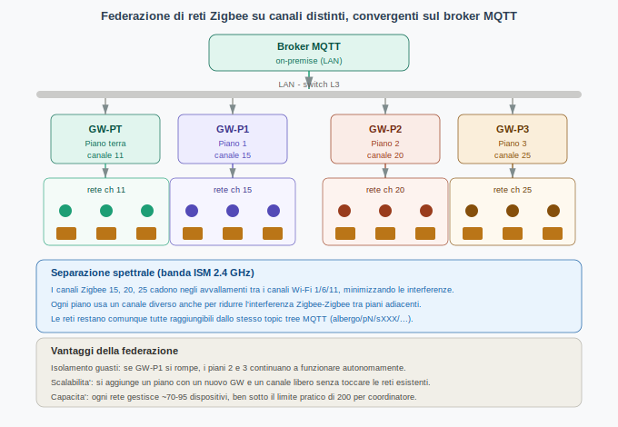
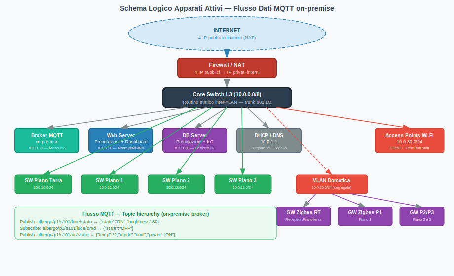
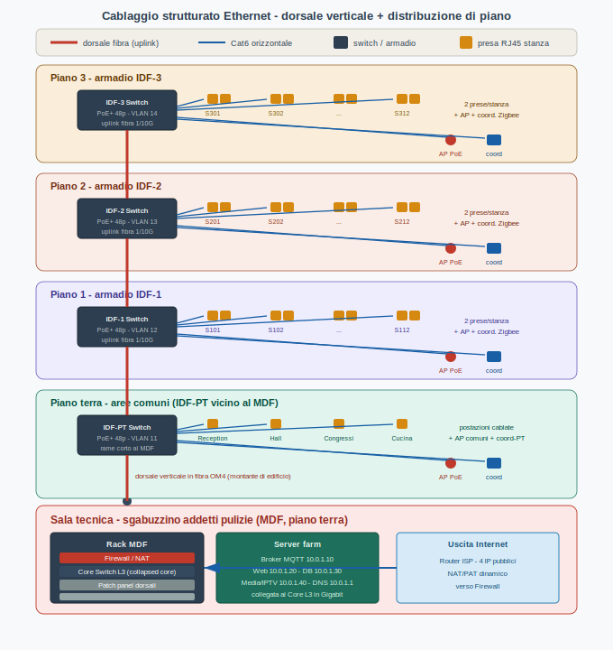
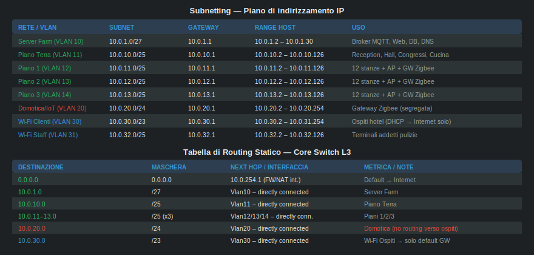
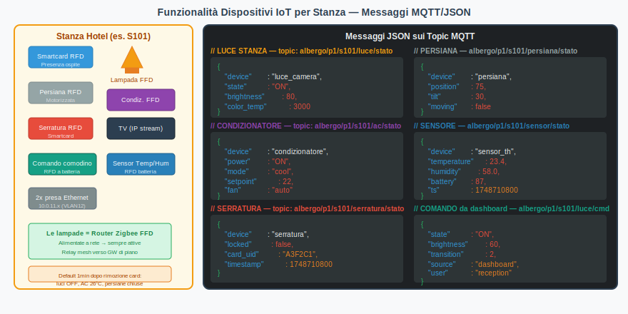
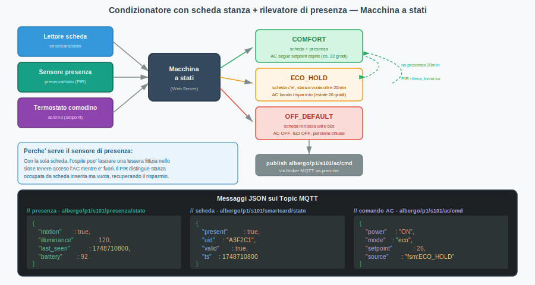

>[Torna a svolgimento Smart Road](svolgimento_smart_road.md)>[Torna a Dettaglio architettura Zigbee](/archzigbee.md) 
>


[Testo della prova Albergo Domotizzato](/esempi/progetti/albergo.pdf)

# GESTIONE ALBERGO
## Soluzione completa d'esame

---

## 1. Ipotesi aggiuntive e dimensionamento

L'albergo è un edificio di **4 piani** (piano terra + 3 piani residenziali), con le seguenti caratteristiche quantitative stimate:

| Parametro | Valore |
|-----------|--------|
| Stanze residenziali | 36 (12 per piano × 3 piani) |
| Ospiti massimi simultanei | 80 persone (2 per stanza, tasso occupazione 110%) |
| Addetti alle pulizie con Wi-Fi | 8 terminali |
| Addetti ricevimento | 5 postazioni cablate |
| Indirizzi IP pubblici | 4 (NAT dinamico per ospiti + servizi esposti) |
| Gateway Zigbee | 4 (1 per piano + 1 piano terra/reception) |
| Access Point Wi-Fi 802.11ac | 10 (2 per piano + 2 piano terra) |
| Dispositivi Zigbee per stanza | 8 (lampada FFD, persiana, condizionatore, serratura, comando comodino, sensore T/H, sensore presenza, lettore scheda) |
| Dispositivi Zigbee aree comuni | ~30 (luci corridoi FFD, portoni, giardino, garage, palestra, ristorante) |

**Stima totale nodi Zigbee:** 36 × 8 + 30 ≈ **318 dispositivi**, suddivisi in 4 reti Zigbee federate (una per piano/zona) su canali distinti. Ogni rete gestisce così ~70–95 dispositivi, ben sotto il limite pratico di ~200 per coordinatore.

**Dimensionamento router Zigbee:** Le **lampade alimentate a rete** (FFD) fungono contemporaneamente da attuatori e da router della mesh Zigbee. Con mediamente 3 lampade per stanza e 6 per corridoio, si stimano ~150 router FFD e ~100 end device RFD a batteria.

---

## 2. Scelta Architetturale: Gateway L7 Zigbee (Scenario A)

Il confronto tra i due scenari richiesti è illustrato nella figura seguente.



### 2.1 Perché si sceglie il Gateway L7 con Zigbee

**Non si sceglie** il Gateway L3 con Thread/Matter per i seguenti motivi:

1. **Ecosistema maturo**: Zigbee ha un catalogo vastissimo di dispositivi interoperabili (lampade, serrature, termostati, sensori), già ampiamente testati in ambito alberghiero.
2. **Tool chain open-source affermata**: `zigbee2mqtt` è software maturo, ben documentato, che realizza la traduzione semantica ZCL→JSON in modo automatico per centinaia di dispositivi.
3. **Rete di sensori indipendente dall'IP**: la mesh Zigbee funziona anche se la rete LAN ha problemi. I comandi locali (interruttore→lampada) continuano a operare tramite binding diretto.
4. **Batterie longeve**: i telecomandi/pulsanti RFD a batteria durano anni grazie alla modalità sleep mode e al multi-hop verso il primo router FFD vicino.
5. **Compatibilità con MQTT on-premise**: il gateway Zigbee pubblica direttamente sul broker Mosquitto locale, senza dipendere da cloud proprietari. Questo garantisce pieno controllo dei dati, bassa latenza e continuità operativa in assenza di Internet.

**Thread/Matter sarebbe preferibile** solo in scenari con forte standardizzazione futura (nuovo edificio, budget elevato, vendor unico), poiché il livello L3 comune IPv6 elimina la traduzione semantica. Tuttavia la maturità commerciale attuale (2025-2026) rende ancora rischioso affidarsi a Thread per un'infrastruttura alberghiera con 250 dispositivi di produttori diversi. In particolare, **dashboard e comandi web** richiederebbero comunque un connettore Matter→MQTT/REST aggiuntivo (Node-RED o Home Assistant), annullando il vantaggio del gateway "solo L3".

### 2.2 Broker MQTT on-premise: motivazione

Si sceglie un **broker MQTT on-premise** (Mosquitto su server dedicato in sala tecnica) invece di un broker cloud per:

- **Latenza minima**: i comandi domotica (es. accensione luci) raggiungono i gateway in < 10 ms sulla LAN locale.
- **Continuità operativa**: un'interruzione di Internet non compromette la domotica interna.
- **Privacy dei dati**: le prenotazioni e i log di accesso alle stanze non lasciano l'edificio.
- **Costo**: nessun abbonamento mensile a piattaforme cloud IoT.
- **Sicurezza**: il broker è raggiungibile dall'esterno solo tramite VPN o tunnel autenticato, non esposto direttamente su Internet.

---

## 3. Planimetria e posizionamento dispositivi



**Note progettuali:**

- I **coordinatori Zigbee** (uno per piano + uno per il piano terra) sono dispositivi **PoE montati a soffitto al centro del corridoio**, non nel rack. Il cavo Ethernet fornisce dati e alimentazione e scende al patch panel di piano. Vanno tenuti fuori dagli armadi metallici: un rack chiuso si comporta da gabbia di Faraday e degrada il segnale RF della mesh.
- Il coordinatore a soffitto vede direttamente le **lampade FFD** più vicine del corridoio, che fanno da spina dorsale della mesh e instradano i comandi verso le stanze.
- Le quattro reti sono **federate su canali Zigbee distinti** (11, 15, 20, 25) per evitare interferenze tra piani adiacenti e con il Wi-Fi a 2.4 GHz, pur convergendo tutte sullo stesso broker MQTT via LAN.
- Gli **Access Point Wi-Fi** sono posizionati baricentricamente con copertura sovrapposta (roaming 802.11r).
- La **sala tecnica** al piano terra ospita solo gli apparati cablati: Core Switch L3, Firewall/NAT, Broker MQTT, Web Server, DB Server. I coordinatori Zigbee restano a soffitto nei corridoi.
- La **rete domotica** è fisicamente separata dalla rete ospiti tramite VLAN dedicata (VLAN 20).



---

## 4. Schema Logico degli Apparati Attivi



La topologia logica comprende i seguenti livelli:

**Livello L1/L2 — Accesso Zigbee:**  
Ogni piano ha una rete Zigbee indipendente con coordinatore integrato nel gateway. I router FFD (lampade) formano la mesh. I dispositivi RFD (comandi, serrature, sensori) comunicano con il router FFD più vicino con un solo hop.

**Livello L2 — LAN Ethernet:**  
Uno switch di accesso PoE+ per piano (armadio IDF) collegato al Core L3 in fibra; trunk 802.1Q per trasportare più VLAN sullo stesso link, 2 prese Ethernet per stanza. Le VLAN separano: server farm, piani, domotica, Wi-Fi ospiti, Wi-Fi staff. Il dettaglio del cablaggio è nella sezione 4.1.

**Livello L3 — Core Switch (routing statico inter-VLAN):**  
Il Core Switch L3 smista il traffico tra le VLAN con routing statico. La VLAN 20 (domotica) è segregata: i gateway Zigbee possono raggiungere solo il broker MQTT (10.0.1.10), non la rete ospiti.

**Livello L3/L4 — Firewall/NAT:**  
4 IP pubblici mappati con PAT (Port Address Translation):
- IP1 → Web server (porta 443, HTTPS prenotazioni)
- IP2 → VPN gateway (OpenVPN, accesso remoto staff direzione)
- IP3/IP4 → NAT dinamico per accesso Internet ospiti Wi-Fi

**Livello L7 — Gateway Zigbee (zigbee2mqtt):**  
Il bridge `zigbee2mqtt` traduce la semantica ZCL Zigbee in JSON MQTT, pubblicando e sottoscrivendo topic verso il broker Mosquitto on-premise.

**Livello L7 — Broker MQTT (Mosquitto):**  
Riceve i messaggi dai gateway Zigbee (publisher) e li distribuisce alle dashboard web e all'app di gestione (subscriber).

**Livello L7 — Web Server (Node.js + NGINX):**  
Eroga il sito di prenotazione (HTTPS), la dashboard domotica per la reception e i comandi web per aree comuni. Si connette al broker MQTT come client per inviare comandi e ricevere stati.

### 4.1 Cablaggio strutturato Ethernet

Il sistema di cablaggio segue lo standard del cablaggio strutturato (gerarchia EIA/TIA 568) con un centro stella di edificio (MDF) e un armadio di permutazione per ogni piano (IDF).



**Centro stella di edificio (MDF) — sala tecnica al piano terra.** Lo sgabuzzino degli addetti alle pulizie, indicato dalla traccia come sala tecnica, ospita il rack principale con: router/firewall verso l'ISP (i 4 IP pubblici), il Core Switch L3 in configurazione *collapsed core* (fa sia da distribuzione sia da core, adeguato a un edificio di queste dimensioni), i patch panel delle dorsali verticali e la server farm. Il Core L3 è il punto in cui terminano tutte le dorsali di piano e dove avviene il routing inter-VLAN e l'applicazione delle ACL.

**Dorsale verticale (backbone) in fibra.** Dal MDF parte un montante verticale di edificio in **fibra ottica multimodale OM4** che raggiunge l'armadio IDF di ciascun piano. La fibra è preferita al rame sui tratti verticali perché supera agevolmente i ~90 m di portata del rame su un edificio a più piani, è immune ai disturbi elettromagnetici del vano ascensore/montanti elettrici e offre uplink a 1/10 Gbit/s verso gli switch di piano. Il piano terra, essendo adiacente al MDF, può essere collegato in rame corto.

**Armadi di piano (IDF) e distribuzione orizzontale.** Ogni piano ha un armadio IDF con uno switch di accesso **PoE+ a 48 porte** (lo standard 802.3at alimenta direttamente Access Point e coordinatori Zigbee dallo stesso cavo dati). Dall'IDF parte la distribuzione orizzontale in **cavo Cat6 U/FTP** verso:

- le **2 prese RJ45 per stanza** richieste dalla traccia (una tipicamente per la TV/IPTV, una per uso dati dell'ospite o telefono VoIP);
- gli **Access Point Wi-Fi** distribuiti baricentricamente, alimentati in PoE;
- i **coordinatori Zigbee** a soffitto nel corridoio, anch'essi in PoE.

Ogni tratta orizzontale resta entro i 90 m di permanent link + 10 m di patch previsti dallo standard, vincolo agevolmente rispettato con un IDF per piano.

**Dimensionamento porte per piano residenziale.** Per i 12 alloggi di un piano: 12 stanze × 2 prese = 24 porte dati + 2 Access Point + 1 coordinatore Zigbee = **27 porte attive**, comodamente entro uno switch da 48 porte, che lascia margine per crescita e per le porte di management. Il piano terra dimensiona invece sulle postazioni cablate di reception, sale comuni e cucina.

**Separazione logica su infrastruttura condivisa.** Lo stesso cablaggio fisico trasporta VLAN diverse grazie ai trunk 802.1Q tra IDF e Core: la porta della stanza è in VLAN piano (es. 12), l'Access Point pubblica le SSID ospiti/staff su VLAN 30/31, il coordinatore Zigbee è in VLAN 20. La segregazione tra reti, descritta nelle ACL della sezione 5, viaggia quindi sopra un'unica infrastruttura di rame e fibra, senza bisogno di cablaggi fisici separati per la domotica.

---

## 5. Piano di indirizzamento e routing



Il subnetting utilizza `10.0.0.0/8` come spazio privato con VLAN dedicate per ogni zona funzionale. Il **routing è statico** dato il numero contenuto di subnet e la topologia stabile dell'edificio.

### 5.1 Matrice degli accessi (chi può raggiungere cosa)

La matrice riassume le politiche di sicurezza tra le VLAN. La regola generale è "default deny": tutto ciò che non è esplicitamente permesso è bloccato. Legenda: ✓ = permesso, ✗ = negato, △ = permesso solo su porte/servizi specifici.

| Sorgente ↓ \ Destinazione → | Server (10) | Piani PT/1/2/3 | Domotica (20) | Wi-Fi Ospiti (30) | Wi-Fi Staff (31) | Internet |
|---|:---:|:---:|:---:|:---:|:---:|:---:|
| **Server Farm (VLAN 10)** | ✓ | △ | △ | ✗ | ✗ | △ |
| **Piani PT/1/2/3 (VLAN 11–14)** | △ | ✓ | ✗ | ✗ | ✗ | △ |
| **Domotica/Gateway (VLAN 20)** | △ | ✗ | ✓ | ✗ | ✗ | ✗ |
| **Wi-Fi Ospiti (VLAN 30)** | ✗ | ✗ | ✗ | ✗ | ✗ | ✓ |
| **Wi-Fi Staff (VLAN 31)** | △ | ✗ | ✗ | ✗ | ✓ | ✓ |
| **Amministratore (VPN)** | ✓ | ✓ | △ | ✗ | ✓ | ✓ |

Note di lettura delle celle △ più importanti:
- **Domotica → Server**: solo MQTT verso il broker (porta 8883/TLS). Nient'altro: i gateway non devono raggiungere il DB né il web server.
- **Server → Domotica**: solo il Web Server può aprire connessioni MQTT verso il broker; la risposta ai gateway viaggia sullo stesso canale già stabilito.
- **Piani → Server**: gli ospiti in stanza (Ethernet/IPTV) raggiungono il media server e il DNS, non il DB delle prenotazioni.
- **Wi-Fi Ospiti**: completamente isolata dalla LAN interna, può solo uscire su Internet via NAT (client isolation attiva anche tra ospiti).

### 5.2 Tabella ACL dettagliata con comandi

Le ACL sono applicate sul Core Switch L3 (sintassi tipo Cisco IOS), in ingresso su ogni interfaccia VLAN. La politica di default è **differenziata per zona**: *default-allow* solo nelle LAN di utenti interni fidati (Staff/admin), *default-deny* su tutto ciò che è confine, esposto o non fidato.

#### Quadro d'insieme — politica di default per zona

| Zona | VLAN | Politica di default | Riga finale | Perché |
|---|---|---|---|---|
| **Staff** (reception/pulizie) | 31 | **default-allow** | `permit ip any any` | utenti interni fidati: si bloccano poche eccezioni |
| Server Farm / DMZ | 10 | default-deny | `deny ip any any` | espone HTTPS **e** ospita il DB: asset critico |
| Domotica / IoT | 20 | default-deny | `deny ip any any` | dispositivi non fidati: solo MQTT verso il broker |
| Wi-Fi Ospiti | 30 | default-deny | `deny ip any any` | utenti non fidati: solo Internet, LAN isolata |
| Piani / stanze | 11–14 | default-deny | `deny ip any any` | la presa in camera la usa l'ospite → non fidata |

> Lo Staff è *default-allow* perché è l'unica zona di utenti realmente fidati. Stanze e Wi-Fi ospiti, pur essendo "interne", sono usate dai clienti: restano *default-deny*. Server Farm/DMZ e Domotica/IoT sono confine/asset critico: *default-deny*.

> **Direzione:** ogni ACL è inbound sulla SVI, quindi filtra il traffico che **parte** da quella VLAN. Le eccezioni dello Staff stanno perciò nell'ACL dello Staff (la sua interfaccia), non in quella della destinazione: il `deny ip any any` di VLAN 10/20 non fermerebbe un pacchetto che *parte* dallo staff.

---

#### VLAN 10 — Server Farm / DMZ (`ACL_SERVER`) · default-deny

| # | Azione | Proto | Sorgente | Destinazione | Porta | Scopo |
|---|---|---|---|---|---|---|
| 1 | permit | tcp | any | 10.0.1.20 | 443 | HTTPS prenotazioni dall'esterno |
| 2 | permit | tcp | 10.0.1.20 | 10.0.1.10 | 8883 | Web Server → broker MQTT |
| 3 | permit | tcp | 10.0.1.20 | 10.0.1.30 | 5432 | Web Server → PostgreSQL |
| 4 | deny | ip | 10.0.1.0/27 | 10.0.30.0/23 | — | Server non iniziano verso ospiti |
| 5 | permit | ip | 10.0.1.0/27 | any | — | Server → Internet/servizi remoti |
| 6 | deny | ip | any | any | — | **Default deny** |

```cisco
ip access-list extended ACL_SERVER
 permit tcp any host 10.0.1.20 eq 443
 permit tcp host 10.0.1.20 host 10.0.1.10 eq 8883
 permit tcp host 10.0.1.20 host 10.0.1.30 eq 5432
 deny   ip  10.0.1.0 0.0.0.31 10.0.30.0 0.0.1.255
 permit ip  10.0.1.0 0.0.0.31 any
 deny   ip  any any                       ! ← default deny
!
interface Vlan10
 ip address 10.0.1.1 255.255.255.224
 ip access-group ACL_SERVER in
```

---

#### VLAN 11–14 — Piani / stanze (`ACL_PIANI`) · default-deny

Zona "interna" ma **NON fidata**: la presa dati in camera la usa l'ospite.

| # | Azione | Proto | Sorgente | Destinazione | Porta | Scopo |
|---|---|---|---|---|---|---|
| 1 | permit | tcp/udp | 10.0.10.0/24 | 10.0.1.40 | 554,8000 | IPTV stream (RTSP) dal media server |
| 2 | permit | udp | 10.0.10.0/24 | 10.0.1.1 | 53 | DNS interno |
| 3 | permit | tcp/udp | 10.0.10.0/24 | any | 80,443 | Internet ospiti in stanza (via NAT) |
| 4 | deny | ip | 10.0.10.0/24 | 10.0.20.0/24 | — | Stanze non toccano la domotica |
| 5 | deny | ip | any | any | — | **Default deny** |

```cisco
! zona "interna" ma NON fidata: la presa in camera la usa l'ospite → default-deny
ip access-list extended ACL_PIANI
 permit udp 10.0.10.0 0.0.0.255 host 10.0.1.40 range 554 8000
 permit tcp 10.0.10.0 0.0.0.255 host 10.0.1.40 range 554 8000
 permit udp 10.0.10.0 0.0.0.255 host 10.0.1.1 eq domain
 permit tcp 10.0.10.0 0.0.0.255 any eq www
 permit tcp 10.0.10.0 0.0.0.255 any eq 443
 deny   ip  10.0.10.0 0.0.0.255 10.0.20.0 0.0.0.255
 deny   ip  any any                       ! ← default deny
!
interface range Vlan11 - 14
 ip access-group ACL_PIANI in
```

---

#### VLAN 20 — Domotica / IoT (`ACL_DOMOTICA`) · default-deny

| # | Azione | Proto | Sorgente | Destinazione | Porta | Scopo |
|---|---|---|---|---|---|---|
| 1 | permit | tcp | 10.0.20.0/24 | 10.0.1.10 | 8883 | Gateway → broker MQTT (TLS) |
| 2 | permit | udp | 10.0.20.0/24 | 10.0.1.1 | 123 | Sincronizzazione oraria NTP |
| 3 | deny | ip | any | any | — | **Default deny** |

```cisco
ip access-list extended ACL_DOMOTICA
 permit tcp 10.0.20.0 0.0.0.255 host 10.0.1.10 eq 8883
 permit udp 10.0.20.0 0.0.0.255 host 10.0.1.1 eq 123
 deny   ip  any any                       ! ← default deny
!
interface Vlan20
 ip address 10.0.20.1 255.255.255.0
 ip access-group ACL_DOMOTICA in
```

---

#### VLAN 30 — Wi-Fi Ospiti (`ACL_OSPITI`) · default-deny

Zona "interna" ma **NON fidata**: la usano i clienti.

| # | Azione | Proto | Sorgente | Destinazione | Porta | Scopo |
|---|---|---|---|---|---|---|
| 1 | deny | ip | 10.0.30.0/23 | 10.0.0.0/8 | — | Isola ospiti dalla LAN interna |
| 2 | permit | tcp/udp | 10.0.30.0/23 | any | 80,443,53 | Web + DNS verso Internet |
| 3 | permit | udp | 10.0.30.0/23 | 10.0.1.1 | 67,68 | DHCP captive portal |
| 4 | deny | ip | any | any | — | **Default deny** |

```cisco
! zona "interna" ma NON fidata: la usano i clienti → default-deny
ip access-list extended ACL_OSPITI
 deny   ip  10.0.30.0 0.0.1.255 10.0.0.0 0.255.255.255
 permit udp 10.0.30.0 0.0.1.255 host 10.0.1.1 eq bootps
 permit tcp 10.0.30.0 0.0.1.255 any eq www
 permit tcp 10.0.30.0 0.0.1.255 any eq 443
 permit udp 10.0.30.0 0.0.1.255 any eq domain
 deny   ip  any any                       ! ← default deny
!
interface Vlan30
 ip address 10.0.30.1 255.255.254.0
 ip access-group ACL_OSPITI in
```

---

#### VLAN 31 — Staff (`ACL_STAFF`) · default-allow

Unica **LAN fidata**: si elencano i `deny` (le poche cose vietate) e si chiude con `permit ip any any`.

| # | Azione | Proto | Sorgente | Destinazione | Porta | Scopo |
|---|---|---|---|---|---|---|
| 1 | deny | ip | 10.0.32.0/25 | 10.0.20.0/24 | — | Eccezione: no domotica/IoT |
| 2 | deny | ip | 10.0.32.0/25 | 10.0.30.0/23 | — | Eccezione: no rete ospiti |
| 3 | deny | tcp | 10.0.32.0/25 | 10.0.1.30 | 5432 | Eccezione: no DB diretto (solo via dashboard) |
| 4 | deny | tcp | 10.0.32.0/25 | 10.0.1.10 | 8883 | Eccezione: no broker MQTT diretto |
| 5 | permit | ip | any | any | — | **Default allow** (dashboard, Internet, resto) |

```cisco
ip access-list extended ACL_STAFF
 deny   ip  10.0.32.0 0.0.0.127 10.0.20.0 0.0.0.255      ! eccezione: no domotica/IoT
 deny   ip  10.0.32.0 0.0.0.127 10.0.30.0 0.0.1.255      ! eccezione: no rete ospiti
 deny   tcp 10.0.32.0 0.0.0.127 host 10.0.1.30 eq 5432   ! eccezione: no DB diretto
 deny   tcp 10.0.32.0 0.0.0.127 host 10.0.1.10 eq 8883   ! eccezione: no broker diretto
 permit ip  any any                                      ! ← DEFAULT ALLOW
!
interface Vlan31
 ip address 10.0.32.1 255.255.255.128
 ip access-group ACL_STAFF in
```

> **Variante con anti-spoofing (versione rigorosa).** Sullo Staff *default-allow*, prima del `permit ip any any` finale inserisci `permit ip 10.0.32.0 0.0.0.127 any` → `deny ip 10.0.0.0 0.255.255.255 any` (permetti la sorgente locale, poi scarta ogni altra sorgente interna falsificata). In alternativa, uRPF sull'interfaccia: `ip verify unicast source reachable-via rx`.

## 6. Funzionalità tecnologiche dei dispositivi



### 6.1 Dispositivi per ogni stanza

Ogni stanza (36 in totale) è dotata dei seguenti dispositivi Zigbee:

| Dispositivo | Tipo Zigbee | Alimentazione | Cluster ZCL | Note |
|-------------|------------|---------------|-------------|------|
| Lampada da soffitto | FFD (Router) | Rete 220V | `0x0006` On/Off, `0x0008` Level, `0x0300` Color | Routing mesh |
| Condizionatore | FFD (Router) | Rete 220V | `0x0201` Thermostat, `0x0202` Fan Control | Routing mesh |
| Persiana motorizzata | RFD | Rete 220V | `0x0102` Window Covering | — |
| Serratura elettronica | RFD | Batteria 3.6V | `0x0101` Door Lock | Vita batteria ~2 anni |
| Comando comodino | RFD | Batteria CR2032 | `0x0005` Scenes, `0x0006` On/Off | Vita batteria ~3 anni |
| Sensore T/H | RFD | Batteria AA | `0x0402` Temperature, `0x0405` Humidity | Vita batteria ~2 anni |
| Sensore presenza PIR/mmWave | RFD | Rete o batteria | `0x0406` Occupancy Sensing | Abbina la scheda per la logica AC |
| Lettore scheda stanza | RFD | Rete 230V | `0x0500` IAS Zone (custom) | Slot RFID 13.56 MHz |

**TV:** non Zigbee, riceve stream IP (IPTV via multicast su VLAN piano). Si connette alle prese Ethernet della stanza.

### 6.2 Gestione condizionatore con scheda stanza e rilevatore di presenza



La traccia chiede che luci, persiane, serratura e condizionatore tornino a una posizione di default un minuto dopo la rimozione della smartcard. La logica più semplice — "scheda inserita = tutto acceso, scheda rimossa = tutto in default" — ha però un difetto noto in ambito alberghiero: l'ospite lascia una scheda fittizia (o una vecchia tessera) nello slot per tenere acceso il condizionatore mentre è fuori, vanificando il risparmio energetico. Negli impianti professionali questo si risolve **combinando due segnali**: lo stato della scheda nello slot e un rilevatore di presenza (PIR o mmWave) in stanza. Il condizionatore (e in generale i carichi non di sicurezza) restano attivi solo se entrambi confermano l'occupazione effettiva.

Il condizionatore è quindi modellato con tre input e una macchina a stati che vive nel Web Server (o, in alternativa, in un'automazione locale del controller domotico):

| Segnale | Sorgente | Topic |
|---------|----------|-------|
| Scheda nello slot | Lettore RFID stanza (RFD) | `albergo/p1/s101/smartcard/stato` |
| Presenza fisica | Sensore PIR/mmWave (RFD) | `albergo/p1/s101/presenza/stato` |
| Setpoint richiesto | Termostato comodino (RFD) | `albergo/p1/s101/ac/cmd` |

Gli stati del condizionatore sono tre:

- `COMFORT` — scheda inserita **e** presenza rilevata. Il condizionatore segue il setpoint scelto dall'ospite (es. 22 °C), con limiti minimo/massimo (18–28 °C) per evitare consumi estremi.
- `ECO_HOLD` — scheda inserita ma **nessuna** presenza da più di N minuti (es. 20 min, l'ospite è uscito ma la scheda è nello slot). Il setpoint viene rilassato verso una banda di risparmio (es. estate 26 °C, inverno 19 °C). Appena il PIR rileva di nuovo movimento, si torna istantaneamente a `COMFORT`.
- `OFF_DEFAULT` — scheda **rimossa** da oltre 60 secondi (l'ospite ha lasciato la stanza e ha portato via la tessera). Il condizionatore si spegne, le luci vanno a OFF, le persiane si chiudono. La serratura resta sempre comandata indipendentemente (sicurezza).

La distinzione tra `ECO_HOLD` e `OFF_DEFAULT` è il punto chiave: con la sola scheda non si distinguerebbe "ospite uscito brevemente con scheda nello slot" da "ospite in stanza"; il PIR colma questo buco e recupera il risparmio energetico anche nel caso della scheda fittizia.

#### Binding Zigbee vs elaborazione centralizzata

Per la reattività locale, l'accensione/spegnimento immediato all'inserimento della scheda può sfruttare il **binding Zigbee** diretto tra il lettore di scheda e il condizionatore (associazione endpoint-to-endpoint), così funziona anche se la LAN o il broker sono momentaneamente irraggiungibili. La logica più sofisticata `ECO_HOLD` (che incrocia presenza, timer e PMS) richiede invece visione d'insieme e vive nel Web Server, che pubblica i comandi via MQTT. Questa è esattamente la scelta "sede dell'elaborazione dei comandi" richiesta dalla traccia: comando di sicurezza/base in locale via binding, logica energetica avanzata centralizzata.

#### Pseudocodice della macchina a stati

```javascript
const ROOM = {}; // stato per stanza: { card, presence, lastSeen, acState }

function onMessage(topic, payload) {
  const [, piano, stanza, device, kind] = topic.split('/');
  const key = `${piano}/${stanza}`;
  const r = ROOM[key] ??= { card: false, presence: false, lastSeen: 0, acState: 'OFF_DEFAULT' };

  if (device === 'smartcard') r.card = payload.present;
  if (device === 'presenza')  { r.presence = payload.motion; if (payload.motion) r.lastSeen = Date.now(); }

  evaluate(key, r);
}

function evaluate(key, r) {
  let next;
  if (!r.card) {
    next = 'OFF_DEFAULT';                       // scheda via → spegni tutto
  } else if (r.presence || (Date.now() - r.lastSeen) < 20 * 60_000) {
    next = 'COMFORT';                           // scheda + presenza recente
  } else {
    next = 'ECO_HOLD';                          // scheda c'è, ma stanza vuota da 20 min
  }

  if (next === r.acState) return;               // nessun cambio
  r.acState = next;
  applyAC(key, next);
}

function applyAC(key, state) {
  const base = `albergo/${key}/ac/cmd`;
  const stagione = currentSeason();             // 'summer' | 'winter'
  if (state === 'COMFORT') {
    publish(base, { power: 'ON', mode: stagione === 'summer' ? 'cool' : 'heat', follow_setpoint: true });
  } else if (state === 'ECO_HOLD') {
    publish(base, { power: 'ON', setpoint: stagione === 'summer' ? 26 : 19, mode: 'eco' });
  } else { // OFF_DEFAULT
    scheduleAfter(60_000, () => {               // ritardo 60 s richiesto dalla traccia
      publish(base, { power: 'OFF' });
      publish(`albergo/${key}/luce/cmd`, { state: 'OFF' });
      publish(`albergo/${key}/persiana/cmd`, { position: 0 });
    });
  }
}
```

#### Comportamento default complessivo (rimozione smartcard)

Dopo 60 secondi dalla rimozione della smartcard (stato `OFF_DEFAULT`):
- Condizionatore → OFF
- Luci → OFF
- Persiane → chiuse (0%)
- Serratura → bloccata (comandata a parte, sempre)

### 6.3 Dispositivi aree comuni

Le **aree comuni** (corridoi, giardino, garage, palestra, ristorante, sala convegni) usano comandi Zigbee RF anche alle postazioni di lavoro dei dipendenti, con la possibilità di **sezionare per gruppo di utenze** (luci, AC, portoni) tramite i gruppi Zigbee e i topic MQTT gerarchici.

---

## 7. Protocolli di comunicazione e sicurezza

### 7.1 Stack protocollare per livello

| Livello | Rete ospiti Wi-Fi | Rete domotica Zigbee | Rete staff |
|---------|-------------------|---------------------|------------|
| L7 | HTTPS, IPTV | MQTT (TLS), zigbee2mqtt | HTTPS, SSH |
| L4 | TCP/UDP | TCP (MQTT) | TCP |
| L3 | IPv4 (10.0.30/31.x) | IPv4 (10.0.20.x) | IPv4 |
| L2 | 802.11ac (WPA3) | 802.3 Ethernet | 802.11ac (WPA2-Enterprise) |
| L1 | 5 GHz / 2.4 GHz | 2.4 GHz (Zigbee IEEE 802.15.4) | 5 GHz |

### 7.2 Sicurezza rete Zigbee

La rete Zigbee utilizza **crittografia AES-128** a livello NWK (rete) e a livello APS (applicazione). Il coordinator (gateway) è il **Trust Center** che distribuisce le chiavi di rete. Il parametro `permit_join` è mantenuto a `false` in produzione; viene abilitato temporaneamente solo durante la fase di commissioning di nuovi dispositivi.

La comunicazione **gateway → broker MQTT** avviene su **TLS 1.3** (porta 8883) con autenticazione reciproca tramite certificati X.509.

### 7.3 Autenticazione utenti

| Utente | Metodo | Tecnologia |
|--------|--------|------------|
| Ospite Wi-Fi | Captive portal L7 + sessione web | NGINX + cookie JWT |
| Staff (addetti pulizie) | WPA2-Enterprise per AP | 802.1X EAP-PEAP con RADIUS |
| Direttore/Amministratore | VPN OpenVPN + HTTPS | Certificato client + password |
| Reception (dashboard) | Login web HTTPS | JWT + sessione server-side |

---

## 8. Topic MQTT — gerarchia e casi d'uso

```
albergo/
├── pT/                          # Piano Terra
│   ├── reception/luce/stato
│   ├── reception/luce/cmd
│   ├── hall/portone/stato
│   ├── hall/portone/cmd
│   ├── congressi/luce/cmd
│   └── ...
├── p1/                          # Piano 1
│   ├── s101/
│   │   ├── luce/stato           # {"state":"ON","brightness":80}
│   │   ├── luce/cmd             # {"state":"OFF"}
│   │   ├── ac/stato             # {"power":"ON","setpoint":22,"mode":"cool"}
│   │   ├── ac/cmd               # {"state":"OFF"}
│   │   ├── persiana/stato       # {"position":75,"tilt":30}
│   │   ├── persiana/cmd         # {"position":0}
│   │   ├── serratura/stato      # {"locked":true,"card_uid":"A3F2C1"}
│   │   ├── serratura/cmd        # {"action":"unlock"}
│   │   ├── sensor/stato         # {"temperature":23.4,"humidity":58}
│   │   ├── presenza/stato       # {"motion":true,"last_seen":1748710800}
│   │   ├── smartcard/stato      # {"present":true,"uid":"A3F2C1"}
│   │   └── ac/fsm               # {"state":"ECO_HOLD"}  ← stato macchina AC
│   └── corridoio/luce/cmd       # {"state":"ON"} → gruppo intero piano
├── p2/...
├── p3/...
└── sistema/
    ├── allarme/stato
    └── energia/consumo          # monitoraggio kWh
```

**Wildcard subscription** usate dalla dashboard reception:
- `albergo/+/+/luce/stato` → stato di tutte le luci di tutti i piani
- `albergo/p1/#` → tutti gli eventi del piano 1

---

## 9. Database e codice

### 9.1 Schema database (PostgreSQL)

```sql
-- Gestione prenotazioni
CREATE TABLE prenotazioni (
    id          SERIAL PRIMARY KEY,
    nome        VARCHAR(100) NOT NULL,
    cognome     VARCHAR(100) NOT NULL,
    email       VARCHAR(150) UNIQUE NOT NULL,
    stanza_id   INTEGER REFERENCES stanze(id),
    checkin     DATE NOT NULL,
    checkout    DATE NOT NULL,
    n_letti     INTEGER NOT NULL DEFAULT 1,
    caparra     NUMERIC(8,2),
    caparra_pagata BOOLEAN DEFAULT FALSE,
    card_uid    VARCHAR(20),
    creata_il   TIMESTAMP DEFAULT NOW()
);

CREATE TABLE stanze (
    id          SERIAL PRIMARY KEY,
    numero      VARCHAR(5) NOT NULL UNIQUE,   -- es. "S101"
    piano       INTEGER NOT NULL,
    n_letti     INTEGER NOT NULL,
    prezzo_notte NUMERIC(8,2) NOT NULL
);

-- Log stati IoT (time-series semplificata)
CREATE TABLE iot_log (
    id          BIGSERIAL PRIMARY KEY,
    topic       VARCHAR(200) NOT NULL,
    payload     JSONB NOT NULL,
    ricevuto_il TIMESTAMP DEFAULT NOW()
);
CREATE INDEX ON iot_log (topic, ricevuto_il DESC);

-- Sessioni utenti staff
CREATE TABLE sessioni (
    token       VARCHAR(64) PRIMARY KEY,
    user_id     INTEGER NOT NULL,
    creata_il   TIMESTAMP DEFAULT NOW(),
    scade_il    TIMESTAMP NOT NULL
);
```

### 9.2 Funzione Node.js — gestione default stanza alla partenza

```javascript
/**
 * Ascolta gli eventi di rimozione smartcard e ripristina
 * i default energetici della stanza dopo 60 secondi.
 * 
 * @param {MqttClient} mqttClient  - client MQTT già connesso al broker
 * @param {Pool}       db          - pool PostgreSQL
 */
function attivaDefaultStanza(mqttClient, db) {

  // Sottoscriviamo tutti gli eventi smartcard di tutte le stanze
  mqttClient.subscribe('albergo/+/+/smartcard/stato', { qos: 1 });

  const timer_stanze = new Map(); // stanza_id → setTimeout handle

  mqttClient.on('message', async (topic, message) => {
    const payload = JSON.parse(message.toString());

    // Estrai piano e stanza dal topic (es. albergo/p1/s101/smartcard/stato)
    const parts = topic.split('/');
    const piano  = parts[1];   // es. "p1"
    const stanza = parts[2];   // es. "s101"
    const stanzaKey = `${piano}/${stanza}`;

    if (payload.present === true) {
      // Ospite rientrato → annulla timer di default se attivo
      if (timer_stanze.has(stanzaKey)) {
        clearTimeout(timer_stanze.get(stanzaKey));
        timer_stanze.delete(stanzaKey);
        console.log(`[${stanzaKey}] Ospite rientrato, default annullato`);
      }
      return;
    }

    // Smartcard rimossa → avvia timer 60 secondi
    if (timer_stanze.has(stanzaKey)) return; // già in attesa

    console.log(`[${stanzaKey}] Smartcard rimossa, default tra 60s`);
    const handle = setTimeout(() => {
      ripristinaDefault(mqttClient, db, piano, stanza);
      timer_stanze.delete(stanzaKey);
    }, 60_000);

    timer_stanze.set(stanzaKey, handle);
  });
}

/**
 * Pubblica i comandi di ripristino default per tutti gli attuatori
 * della stanza specificata.
 */
async function ripristinaDefault(mqttClient, db, piano, stanza) {
  const base = `albergo/${piano}/${stanza}`;

  const comandi = [
    { topic: `${base}/luce/cmd`,     payload: { state: 'OFF' } },
    { topic: `${base}/ac/cmd`,       payload: { power: 'ON', setpoint: 26, mode: 'eco' } },
    { topic: `${base}/persiana/cmd`, payload: { position: 0, tilt: 0 } },
  ];

  for (const { topic, payload } of comandi) {
    mqttClient.publish(topic, JSON.stringify(payload), { qos: 1, retain: false });
    console.log(`[DEFAULT] Pubblicato su ${topic}:`, payload);
  }

  // Log su DB
  await db.query(
    `INSERT INTO iot_log (topic, payload) VALUES ($1, $2)`,
    [`${base}/sistema/default`, JSON.stringify({ event: 'checkout_default', ts: Date.now() })]
  );
}
```

### 9.3 Interfaccia grafica — Dashboard Reception (bozza)

La dashboard web è una **SPA (Single Page Application)** servita da NGINX, con le seguenti sezioni:

1. **Mappa piani**: visualizzazione in tempo reale dello stato di ogni stanza (luci, AC, occupazione).
2. **Controllo stanza**: selezionando una stanza, la reception può inviare comandi MQTT direttamente (es. accendere la luce per un sopralluogo).
3. **Prenotazioni**: calendario mensile, registrazione arrivi/partenze, gestione caparre.
4. **Aree comuni**: pannello per i comandi delle zone comuni (corridoi, sala congressi, garage).
5. **Alert**: notifiche push (via WebSocket) per allarmi (es. temperatura stanza fuori range, batteria dispositivo bassa).

Il frontend si connette al Web Server tramite **WebSocket** (Socket.io), il quale funge da proxy MQTT→WebSocket per il push degli stati in tempo reale verso il browser.

---

## 10. Protocolli di sicurezza delle informazioni — riepilogo

| Minaccia | Contromisura |
|----------|-------------|
| Accesso non autorizzato rete ospiti | VLAN segregata, Captive Portal, timeout sessione 24h |
| Intercettazione comunicazioni IoT | TLS 1.3 su MQTT (porta 8883), AES-128 Zigbee NWK |
| Accesso non autorizzato rete domotica | ACL VLAN20: solo TCP→10.0.1.10:8883 verso broker MQTT |
| Attacchi da Internet | Firewall stateful, nessuna porta domotica esposta, VPN per accesso remoto |
| Dispositivi Zigbee non autorizzati | `permit_join: false` in produzione, commissioning controllato |
| Furto credenziali staff | WPA2-Enterprise 802.1X (EAP-PEAP), RADIUS server |
| Sniffing MQTT | TLS obbligatorio, autenticazione client broker con username/password SHA-256 |

---

## 11. Conclusioni

L'architettura scelta — **Gateway L7 Zigbee con broker MQTT on-premise** — soddisfa tutti i requisiti del compito:

- **Connettività ubiqua**: ogni stanza ha Ethernet + Wi-Fi per gli ospiti e Zigbee per la domotica.
- **Domotica completa**: luci, AC, persiane, serrature comandabili da reception e da app web, con logica default automatica.
- **Prenotazioni online**: sito HTTPS con calendario, caparre, download brochure PDF.
- **Sicurezza**: segmentazione VLAN, Firewall/NAT, TLS, 802.1X, AES-128 Zigbee.
- **Dashboard e comandi web**: la combinazione Zigbee → zigbee2mqtt → MQTT broker → WebSocket → browser realizza il flusso completo in tempo reale senza cloud di terze parti.
- **Robustezza**: la mesh Zigbee è indipendente dalla LAN; il broker on-premise garantisce continuità anche senza Internet; percorsi di ridondanza fisici sui gateway di piano.
