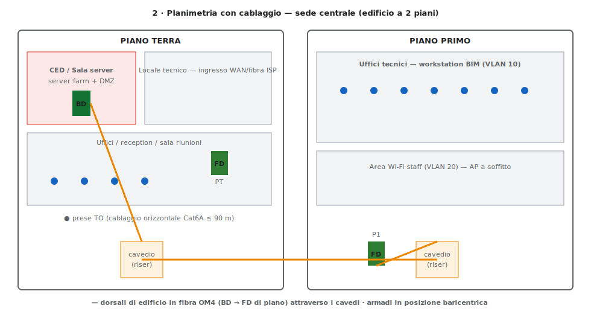
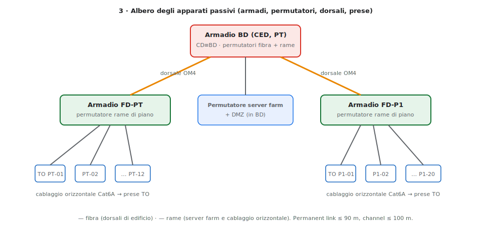
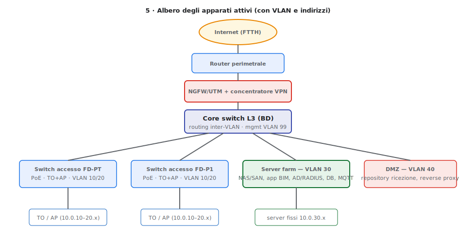
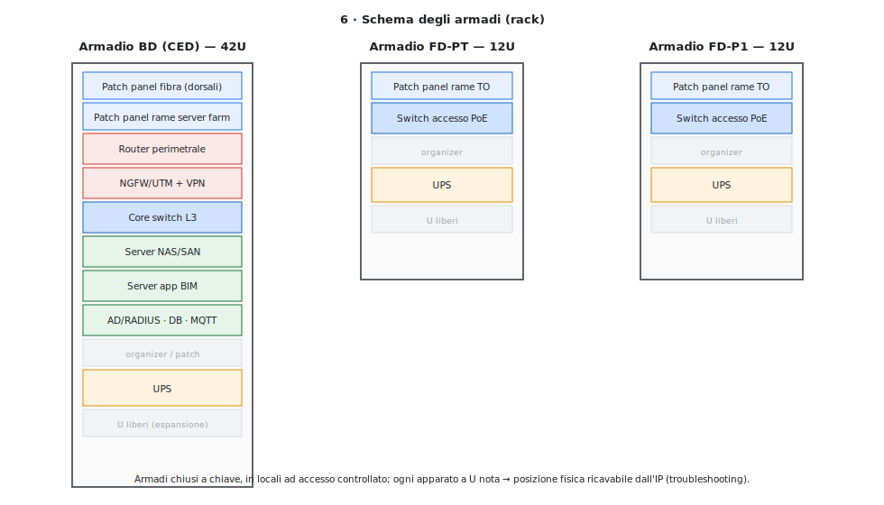

# Cablaggio strutturato della sede centrale — A038 "Sistemi e Reti"
### Allegato a [risoluzione_A038_sistemi_reti_2026.md](risoluzione_A038_sistemi_reti_2026.md)

> Schema di cablaggio della sede centrale secondo gli standard **TIA/EIA-568B** e **ISO/IEC-11801**, con i sei documenti nell'ordine canonico. Modello: **edificio unico a 2 piani**, quindi il centro stella di comprensorio coincide con quello di edificio (**CD ≡ BD**). In coda, le **misure di sicurezza del Quesito II** applicate al cablaggio.

## Gerarchia dei centri stella

Il cablaggio è articolato su tre livelli gerarchici (qui due effettivi, non essendoci un campus):

- **CD / Campus Distributor** — assente come livello fisico separato: in un edificio singolo coincide con il BD.
- **BD / Building Distributor** — **armadio di edificio** nel **CED** al piano terra; da qui partono le **dorsali di edificio**.
- **FD / Floor Distributor** — **armadio di piano** (FD-PT e FD-P1); da qui parte il **cablaggio orizzontale** verso le prese.
- **TO / Telecommunication Outlet** — prese utente.

Regola di posizionamento **baricentrico** (per minimizzare il filo): il BD al baricentro degli FD; ogni FD al baricentro delle proprie prese TO.

---

## 1 · Planimetria senza cablaggio

Indica la **destinazione d'uso** degli ambienti e quindi le funzioni aziendali e i requisiti (gli stakeholder e i requisiti funzionali/non funzionali che ne derivano), **prima** di sovrapporre la rete.

| Piano | Ambiente | Funzione / esigenza |
|---|---|---|
| PT | CED / Sala server | server farm BIM, DMZ, apparati core — alta affidabilità, accesso controllato |
| PT | Locale tecnico | ingresso WAN/fibra ISP, terminazione operatore |
| PT | Uffici / reception / sala riunioni | postazioni e Wi-Fi staff |
| P1 | Uffici tecnici | workstation BIM (banda e storage elevati) |
| P1 | Area staff | copertura Wi-Fi |

> È la **base** dei documenti successivi: da qui discendono i requisiti d'infrastruttura.

## 2 · Planimetria con cablaggio

Sulla stessa planimetria si aggiungono **posizione degli armadi** (BD, FD-PT, FD-P1), **prese TO**, **percorsi delle canalizzazioni** e **cavedi (riser)** verticali per le dorsali tra i piani.



- **Dorsali di edificio** in **fibra OM4** dal BD ai due FD attraverso i cavedi.
- **Cablaggio orizzontale** in **rame Cat6A** dagli FD alle prese TO (permanent link ≤ 90 m).
- Armadi in posizione **baricentrica** rispetto a ciò che servono.

## 3 · Albero degli apparati passivi

Gerarchia dei **componenti passivi** (armadi, permutatori/patch panel, dorsali, prese). Definisce *dove* arriva ogni cavo, indipendentemente dagli apparati attivi.



```
BD (armadio CED, PT)            ── CD≡BD
├─ permutatore fibra ───────────┬─ dorsale OM4 → FD-PT
│                               └─ dorsale OM4 → FD-P1
└─ permutatore rame server farm + DMZ
FD-PT  ─ permutatore rame ─ cablaggio orizzontale → TO PT-01 … PT-12
FD-P1  ─ permutatore rame ─ cablaggio orizzontale → TO P1-01 … P1-20
```

## 4 · Tabella delle dorsali

Elenco delle **dorsali** con tratta, mezzo e capacità (base per il dimensionamento dei materiali).

| Dorsale | Da | A | Mezzo | Lung. (≈) | Capacità |
|---|---|---|---|---|---|
| Edificio-1 | BD (CED, PT) | FD-PT | Fibra OM4 MM, 2 coppie LC | 25 m | 10 GbE |
| Edificio-2 | BD (CED, PT) | FD-P1 | Fibra OM4 MM, 2 coppie LC | 40 m | 10 GbE |
| WAN | Locale tecnico | BD | Fibra ISP / rame | 10 m | accesso Internet |
| Orizzontale PT | FD-PT | TO PT-01…12 | Rame Cat6A | ≤ 90 m | 1–2,5 GbE PoE |
| Orizzontale P1 | FD-P1 | TO P1-01…20 | Rame Cat6A | ≤ 90 m | 1–2,5 GbE PoE |

> Le dorsali in fibra sono ridondabili con una **seconda coppia** per link-aggregation/backup (continuità — vedi §Sicurezza).

## 5 · Albero degli apparati attivi

Gerarchia degli **apparati attivi** con VLAN e indirizzi, coerente con il piano della dispensa principale (`10.0.0.0/16`). È il documento indispensabile anche in contesti cloud/wireless.



```
Internet (FTTH)
└─ Router perimetrale
   └─ NGFW/UTM + concentratore VPN
      └─ Core switch L3 (BD) — routing inter-VLAN, mgmt VLAN 99
         ├─ Switch accesso FD-PT (PoE) → TO/AP   VLAN 10/20  (10.0.10–20.x)
         ├─ Switch accesso FD-P1 (PoE) → TO/AP   VLAN 10/20  (10.0.10–20.x)
         ├─ Server farm                           VLAN 30     (10.0.30.x, fissi)
         └─ DMZ (repository ricezione, rev. proxy) VLAN 40    (10.0.40.x)
```

## 6 · Schema degli armadi

**Disposizione interna** (a unità rack) di BD e FD: consente, **noto l'IP**, di risalire alla **posizione fisica** dell'apparato (armadio + U) per il troubleshooting.



- **BD (CED, 42U):** patch panel fibra + rame, router, NGFW/VPN, core switch L3, server (NAS/SAN, app BIM, AD/RADIUS, DB, MQTT), UPS, U di espansione.
- **FD-PT / FD-P1 (12U):** patch panel rame TO, switch accesso PoE, UPS, U liberi.

> **Coerenza tra documenti:** l'ordine 1→6 non è casuale — ogni documento è la base del successivo. Le proprietà richieste sono **coerenza, completezza e assenza di ambiguità**: se mancano, la documentazione di quella parte d'impianto diventa inutilizzabile.

---

## Misure di sicurezza (Quesito II) applicate al cablaggio

Mappatura delle misure del **Quesito II** sull'infrastruttura fisica e di accesso:

**Sicurezza fisica**
- **CED e armadi in locali ad accesso controllato** (badge/biometria), **armadi chiusi a chiave**, videosorveglianza e registro accessi.
- **Condizionamento** e **rilevazione incendi/allagamenti** nel CED; protezione della **DMZ** e dei permutatori critici.
- Le prese TO non utilizzate sono **disabilitate** sullo switch (porte amministrativamente spente).

**Sicurezza di rete sul cablaggio**
- **802.1X / port-security** sulle porte d'accesso (le prese TO ammettono solo dispositivi/operatori autenticati via RADIUS) — coerente con lo stack di autenticazione del documento centrale.
- **Segmentazione VLAN** con **default-deny inter-VLAN** sul core L3; **DMZ isolata** dietro il NGFW.
- **Management out-of-band** sulla VLAN 99; accesso agli apparati via SSH con AAA.

**Continuità di servizio (sul cablaggio)**
- **Dorsali ridondate** (seconda coppia in fibra) e **link-aggregation** tra core e switch di piano.
- **UPS** in ogni armadio + gruppo elettrogeno per il CED; **doppia alimentazione** sugli apparati critici.
- Apparati core/firewall in **alta disponibilità** (vedi continuità link/VPN e NAS nell'[approfondimento](approfondimento_A038.md)).

> Il **subnetting fisico** + il cablaggio strutturato sono essi stessi una misura di sicurezza operativa: localizzano un guasto (o un host compromesso) **dall'IP alla presa**, riducendo i tempi di intervento.
