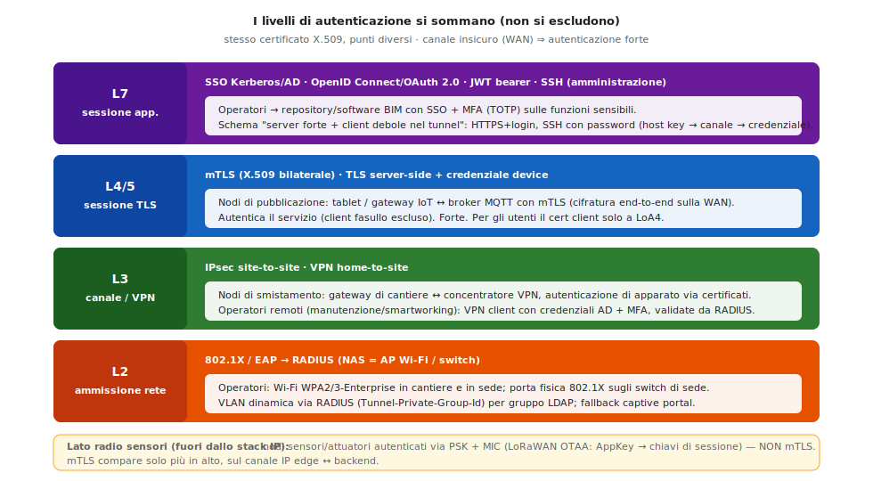

# Risoluzione — A038 "Sistemi e Reti"
### Esame di Maturità 2026 — Sessione ordinaria · Indirizzo ITIA (Informatica e Telecomunicazioni, art. Informatica)

> **Nota di metodo.** È svolta per intero la **Prima parte** (obbligatoria) e, per completezza di studio, **tutti e quattro i quesiti** della Seconda parte: in sede d'esame se ne scelgono **due**. Numeri e quantità sono *ipotesi di dimensionamento* esplicitate: l'importante in questa traccia non è il valore esatto, ma la coerenza tra ipotesi, scelte progettuali e motivazioni.

---

## Ipotesi aggiuntive e di dimensionamento

Per rendere concreto il progetto si assume:

- **Cantieri contemporaneamente attivi:** massimo **5**.
- **Dotazione tipica per cantiere:** 4 tablet rugged (scanner 3D/Lidar), 3 fotocamere timelapse, ~25 sensori di sicurezza, più i dispositivi personali di pochi operatori.
- **Natura dei cantieri:** *temporanei*, in luoghi variabili, **privi di cablaggio fisso** e a volte in zone scarsamente servite da rete cablata.
- **Traffico:** i dati "pesanti" (nuvole di punti, fotogrammi) **non sono real-time** e possono essere trasferiti a lotti/programmati; solo gli **allarmi dei sensori** richiedono bassa latenza (ma occupano banda trascurabile).

Queste ipotesi guidano due scelte chiave: rete di cantiere **wireless-centrica** con backhaul **mobile (4G/5G)**, e potenziamento della WAN di sede (l'ADSL esistente è inadeguata in upload).

---

# PRIMA PARTE

## Punto 1 — Infrastruttura di rete di un cantiere

Poiché il cantiere è temporaneo e senza cablaggio strutturato, si realizza una **LAN temporanea wireless-centrica** imperniata su un **gateway industriale 4G/5G** che fa da router, firewall e client VPN verso la sede.


**Apparati e canali locali**

- **Gateway industriale 4G/5G** (dual-SIM, robusto/IP-rated): unico punto di uscita verso Internet; instaura il **tunnel VPN IPsec** verso la sede e applica firewall/NAT.
- **Switch PoE gestito** (alimenta telecamere e AP, gestisce le VLAN).
- **Access Point Wi-Fi 802.11ax outdoor** (eventualmente **mesh** per coprire l'area): connettono i **tablet rugged**, che operano in wireless durante le scansioni.
- **Telecamere IP timelapse** collegate via **Ethernet/PoE** in punti strategici (o Wi-Fi dove il cavo è impraticabile).
- **Gateway IoT** con **broker MQTT** locale per i sensori di sicurezza: i sensori si interfacciano con tecnologie a basso consumo (**LoRa/Zigbee/BLE**) o cablate (**RS-485/Modbus**) verso i moduli di trasmissione.
- **Edge NAS**: buffer locale **store-and-forward** che bufferizza le grandi nuvole di punti e i fotogrammi e li invia alla sede quando il collegamento è disponibile (resilienza alle interruzioni).

**Schema di indirizzamento**

- IPv4 **privato** con subnet **dedicata per cantiere** per evitare sovrapposizioni nei tunnel: es. `10.10.<id_cantiere>.0/24`.
- **Segmentazione in VLAN**: `tablet`, `telecamere`, `sensori`, `management` (riduce il dominio di broadcast e isola i flussi a fini di sicurezza).
- **DHCP** per i client dinamici (tablet), **IP statici/reservation** per l'infrastruttura (router, AP, telecamere, gateway IoT).

**Protocolli e servizi**

- **DHCP, DNS** (forwarder locale), **NTP** (sincronizzazione oraria: fondamentale per timestamp di log e timelapse).
- **IPsec** (tunnel verso la sede); **WPA3-Enterprise / 802.1X** sul Wi-Fi.
- **MQTT** per la telemetria/allarmi dei sensori; **SFTP/FTPS/HTTPS** per il trasferimento di nuvole di punti e fotogrammi al repository di sede.
- **Firewall** sul gateway con regole di default-deny in ingresso.

## Punto 2 — Rete pre-esistente in sede e potenziamenti

**Situazione attuale (descritta dalla traccia).** LAN piatta con i PC degli uffici tecnici e un **router con WAN ADSL** verso Internet. È adeguata al lavoro d'ufficio ma **insufficiente** per il BIM.


**Potenziamenti necessari**

1. **WAN.** L'ADSL è asimmetrica con upload basso: inadeguata a **ricevere** grandi nuvole di punti e flussi video da più cantieri. Si passa a **fibra FTTH simmetrica** (o connessione business) con **upload elevato**, e si aggiunge **ridondanza** (seconda linea ISP e/o failover 4G/5G).
2. **Sicurezza perimetrale.** **NGFW/UTM** con **IPS/IDS** che funge anche da **concentratore VPN** per terminare i tunnel dei cantieri, e creazione di una **DMZ** per i servizi esposti (repository di ricezione, reverse proxy, broker MQTT).
3. **Server e storage.** **NAS/SAN** per il repository (nuvole di punti, fotogrammi, video timelapse); **server applicativi** per il software BIM specialistico; **server di autenticazione** (Active Directory/LDAP + **RADIUS**); **database** per i dati sensori e il **registro di log storico**; **SIEM** e sistema di **backup**.
4. **Segmentazione e core.** **Switch core L3** con **VLAN** (server, uffici tecnici, DMZ, management) e routing inter-VLAN controllato da policy.
5. **Continuità.** **UPS**, ridondanza degli apparati critici, backup e procedura di **disaster recovery**.

## Punto 3 — Canali cantiere ↔ sede e dimensionamento della banda

I cantieri sono temporanei: il collegamento più sensato è una **VPN site-to-site su Internet**, con accesso **mobile 4G/5G** lato cantiere e **fibra simmetrica** lato sede.


**Stima della capacità trasmissiva (esempio motivato)**

| Sorgente (per cantiere/giorno) | Volume stimato |
|---|---|
| Nuvole di punti (a lotti) | ~5 GB |
| Fotogrammi timelapse | ~0,5 GB |
| Dati sensori | trascurabile (decine di MB) |
| **Totale per cantiere** | **~6 GB/giorno** |

Con **5 cantieri** → ~**30 GB/giorno** verso la sede. Trasferendoli in una **finestra di 8 ore**:

```
30 GB ≈ 240 Gbit ⇒ 240.000 Mbit / 28.800 s ≈ 8,3 Mbps medi aggregati
```

Considerando overhead e picchi, alla sede si provvede **upload ≥ 50–100 Mbps simmetrici** (la fibra copre con ampio margine). Lato cantiere bastano i **picchi del 4G/5G** (decine di Mbps): la media per cantiere è ~1,7 Mbps. Le nuvole di punti, non real-time, si **schedulano** (es. di notte) per non saturare il link.

**Apparati da adottare:** router cellulari industriali **dual-SIM** (cantiere), **NGFW/concentratore VPN** e **router fibra** (sede), con failover ISP/4G.

## Punto 4 — Autenticazione degli operatori (in sede e dai cantieri)

Si imposta l'autenticazione **non come scelta unica fra protocolli**, ma fissando prima i **tre assi ortogonali** e poi scegliendo la tecnologia:

1. **Chi/cosa** si autentica — *operatore* (utente umano), *nodo terminale* (tablet, sensore), *servizio/processo* (broker, applicativi BIM).
2. **Dove** lo si fa — il livello dello stack: **L2** ammissione alla rete, **L3** canale/VPN, **L4/5** sessione sul trasporto, **L7** sessione applicativa.
3. **Quanto forte** — debole/media/forte, agganciato ai livelli di garanzia **LoA/eIDAS**.

Il principio guida è che **i livelli si sommano, non si escludono**: lo stesso certificato X.509 può vivere in punti diversi (EAP-TLS a L2, IPsec a L3, mTLS a L4/5). L'identità è centralizzata su **Active Directory/LDAP** in sede, con **RADIUS** come server AAA.



**Operatori — i quattro livelli applicati allo scenario**

- **L2 · Ammissione alla rete (accesso alla *risorsa rete* presso il NAS).** L'operatore si autentica via **802.1X/EAP** verso **RADIUS**: porta **logica** dell'**AP Wi-Fi** (in cantiere e in sede, in **WPA2/3-Enterprise**) e porta **fisica** degli **switch** di sede. Con EAP-PEAP/EAP-TTLS la credenziale utente viaggia *dentro* il tunnel creato dal certificato del server; in alternativa EAP-TLS con certificato personale. La **VLAN** può essere assegnata dinamicamente da RADIUS (`Tunnel-Private-Group-Id`) in base al gruppo LDAP, con un unico SSID; dove l'802.1X non è praticabile, **captive portal** a L7 (username/password o voucher).
- **L3 · Canale/VPN.** Gli **operatori remoti** (manutenzione, smartworking) accedono **home-to-site** con **VPN client** + credenziali AD **+ MFA** (OTP/TOTP), validate via RADIUS — *canale insicuro (Internet) ⇒ autenticazione forte*.
- **L4/5 · Sessione sul trasporto.** L'accesso ai servizi web del repository avviene su **TLS**; la password dell'operatore viaggia solo **dentro** il canale cifrato (schema *server forte + client debole nel tunnel*, lo stesso di HTTPS+login e di SSH con password).
- **L7 · Sessione applicativa e autorizzazione.** Accesso ai sistemi/repository BIM con **SSO**: **Kerberos/AD** per l'intranet, **OpenID Connect/OAuth 2.0** (token **JWT** *bearer*) per le app web; **MFA** (LoA3) sulle funzioni sensibili. Autorizzazioni per **gruppi** (minimo privilegio). L'amministrazione remota degli apparati usa **SSH** (host key → canale cifrato → chiave/credenziale del client).

**Estensione agli altri nodi (richiamata anche nel Quesito II)** — coerente con la checklist "autenticazione" della dispensa:

- **Nodi di smistamento** (gateway di cantiere ↔ concentratore VPN): **IPsec site-to-site** con autenticazione **di apparato** via **certificati X.509** e cifratura dei dati — collegamento "like wired" verso la sede.
- **Nodi di pubblicazione/elaborazione** (tablet, gateway IoT ↔ **broker MQTT**): **mTLS** (X.509 bilaterale) sul canale IP, oppure **TLS server-side + credenziale del device**.
- **Nodi sensori/attuatori** (lato radio): **PSK + MIC** — in LoRaWAN attivazione **OTAA** (AppKey 128 bit → chiavi di sessione `AppSKey/NwkSKey`). **Non è mTLS**: la mutua a certificati compare solo più in alto, sul canale IP edge↔backend.

> **Precisazioni da non sbagliare al compito.** *802.1X e mTLS non sono alternativi*: stanno a livelli diversi (L2 vs L4/5) e tipicamente **coesistono**. *Un certificato non è "mTLS"*: è una credenziale, mTLS è *come e dove* la si usa (mutua, a L4/5). *Per gli utenti* la norma forte è **token federati (OAuth/OIDC) + MFA**, non il certificato client (che compare solo a LoA4, con chiave su hardware sicuro). *PAP/password* solo su canale già cifrato o dentro un tunnel.

**Protocolli/servizi in gioco:** RADIUS/DIAMETER, LDAP/Kerberos, 802.1X/EAP(-TLS/-TTLS/-PEAP), IPsec, TLS/mTLS, OAuth 2.0/OIDC + JWT, SSH, MFA/TOTP, PKI per i certificati.

---

# SECONDA PARTE

## Quesito I — Archiviazione: soluzioni *on-premise* vs *cloud-based*

**On-premise** (NAS/SAN propri in sede).
*Vantaggi:* pieno controllo e sovranità del dato (privacy), nessun canone ricorrente, **bassa latenza** per il software BIM che gira in locale, indipendenza da Internet per l'accesso interno.
*Svantaggi:* alto **CapEx** iniziale, manutenzione e gestione a carico dell'azienda, **scalabilità limitata** dall'hardware, backup/DR da realizzare in proprio, sicurezza fisica ed energia.

**Cloud-based** (object storage / IaaS-PaaS).
*Vantaggi:* **scalabilità elastica** (ideale per nuvole di punti enormi), modello **OpEx**, accessibilità ovunque (sedi, cantieri, partner), ridondanza/backup/DR e geo-replica gestiti dal provider.
*Svantaggi:* **costi ricorrenti** che crescono col volume (le nuvole di punti pesano molto), **dipendenza da banda/connettività** (critica vista la mole dati), aspetti di **privacy/compliance**, rischio di **vendor lock-in**, latenza.

**Proposta: soluzione ibrida.** Dati "caldi" e attivi del modello BIM su **NAS/SAN in sede** (prestazioni, il software lavora in locale); **cloud** per **backup/DR**, **archivio "freddo"** delle scansioni e **collaborazione** con le altre sedi/partner. Si ottiene il meglio: prestazioni locali e resilienza/scalabilità esterne.

## Quesito II — Ulteriori misure di sicurezza e continuità trasmissiva

Oltre all'autenticazione (punto 4):

**Sicurezza informatica**
- **Cifratura** end-to-end: VPN IPsec/TLS per il traffico cantiere-sede, **HTTPS/SFTP** per i trasferimenti, **WPA3** sul Wi-Fi.
- **NGFW/UTM con IPS/IDS** in sede e firewall su ogni gateway di cantiere; ispezione **stateful** (CBAC o, meglio, **Zone-Based Firewall**) con apertura automatica dei ritorni.
- **Segmentazione** (VLAN) e **DMZ** per i servizi esposti. Doctrine delle policy: **default-deny su ogni confine di fiducia** (WAN, tunnel, accesso ai server) e **default-allow solo dentro le zone già fidate**, con **ACL anti-spoofing** in ingresso sulle subnet.
- **Endpoint security**: antivirus/EDR su tablet e PC; **MDM** sui tablet rugged (cifratura disco, **remote wipe** in caso di furto/smarrimento in cantiere).
- **Hardening**: disabilitazione servizi/porte inutili, **patch management**, cambio credenziali di default, **PKI** per certificati di apparato/server.
- **Monitoraggio**: **SIEM**, registro di **log storico**, alert su anomalie.
- **Sicurezza fisica** della sala server e dei rack di cantiere.

**Continuità trasmissiva del canale cantiere ↔ sede**
- **WAN ridondata** lato cantiere: **dual-SIM** di due operatori, oppure 4G/5G **+ satellitare** in failover automatico.
- **Doppio ISP + 4G** in failover lato sede; **alta affidabilità** (firewall ridondati).
- **VPN** con **Dead Peer Detection** e riconnessione automatica; eventuali tunnel ridondati.
- **QoS** per prioritizzare gli **allarmi** dei sensori sul traffico bulk.
- **Store-and-forward** sull'edge NAS di cantiere: i dati vengono accodati durante un'interruzione e inviati al ripristino, **senza perdite**.
- **UPS** su gateway di cantiere e apparati di sede.

## Quesito III — Bloccare le piattaforme IA nella rete didattica

**Scenario:** alcuni studenti usano, non autorizzati, piattaforme di IA per farsi generare il codice delle tracce di laboratorio.

**Misure e tecniche di blocco**
- **Web filtering / proxy** (es. Squid o filtro URL dell'UTM) con **ACL per categoria/dominio** che blocca le piattaforme IA note.
- **Filtraggio DNS** (DNS sinkhole, es. Pi-hole o DNS firewall): si risolvono i domini IA verso un *blackhole*. **Attenzione:** il **DNS-over-HTTPS (DoH)** aggira il filtro DNS → va **bloccato/forzato** il DNS interno, oppure si filtra a livello di **SNI**/application control.
- **HTTPS:** poiché l'URL è cifrato, si usa **filtraggio SNI** o **ispezione SSL** (con policy/consenso adeguati), o l'**application control** dell'NGFW che riconosce il traffico verso i servizi IA.
- **Regole firewall** per IP/domini e blocco a livello di **VLAN del laboratorio**.
- **Policy per identità**: con **captive portal / 802.1X + gruppi AD** si distingue *studenti* (bloccati) da *docenti* (autorizzati).

**Schedulazione blocco/sblocco per orario e laboratorio**
- **ACL temporizzate** (time-range) su firewall/proxy: molte soluzioni (es. pfSense) supportano regole con fasce orarie.
- **Job cron** che attivano/disattivano regole o sostituiscono i file ACL del proxy negli orari previsti.
- Applicazione **per VLAN del singolo laboratorio**, così il blocco vale solo dove/quando serve, allineato all'orario delle classi.
- Possibilità di **override autenticato del docente** per uno sblocco temporaneo durante attività guidate.

## Quesito IV — Comando SSH con port forwarding

```
ssh -p 25500 administrator@200.1.1.1
```


**Analisi del comando**
- `ssh` — avvia il **client SSH** (shell remota **cifrata e autenticata**).
- `-p 25500` — ci si connette alla **porta TCP 25500** (non la 22 di default) sull'host di destinazione.
- `administrator@200.1.1.1` — login come utente **administrator** sull'host con **IP pubblico 200.1.1.1**.

**Effetti (con la regola di redirezione)**
Su `200.1.1.1` (un router/firewall) è configurata una regola di **DNAT / port forwarding**: il traffico in ingresso sulla **porta 25500** viene **reindirizzato** a `172.16.1.100:22`. Poiché `172.16.1.100` è un **indirizzo privato (RFC 1918)** non raggiungibile direttamente da Internet, il router lo **"espone"** tramite il proprio IP pubblico su una porta non standard. Di conseguenza la **sessione SSH termina di fatto sull'host interno 172.16.1.100**: l'amministratore ottiene una shell su quel dispositivo pur avendo digitato l'indirizzo pubblico del router, che esegue la traduzione (NAT).

**Finalità d'uso**
- **Amministrazione remota** di un dispositivo interno privo di IP pubblico, **attraversando il NAT**.
- L'uso di una **porta non standard (25500)** riduce gli attacchi automatici sulla 22 (*security through obscurity*) e consente di **mappare più host interni** su porte esterne diverse di un **unico IP pubblico**.
- Caso tipico nello scenario BIM: gestione da remoto di un server/apparato dietro al router della sede o di un cantiere.

---

### Strumenti consentiti (promemoria dalla traccia)
Durata massima 6 ore. Ammessi manuali tecnici e calcolatrici scientifiche/grafiche **non** programmabili e **senza** connessione a Internet; dizionario bilingue per i non madrelingua.
