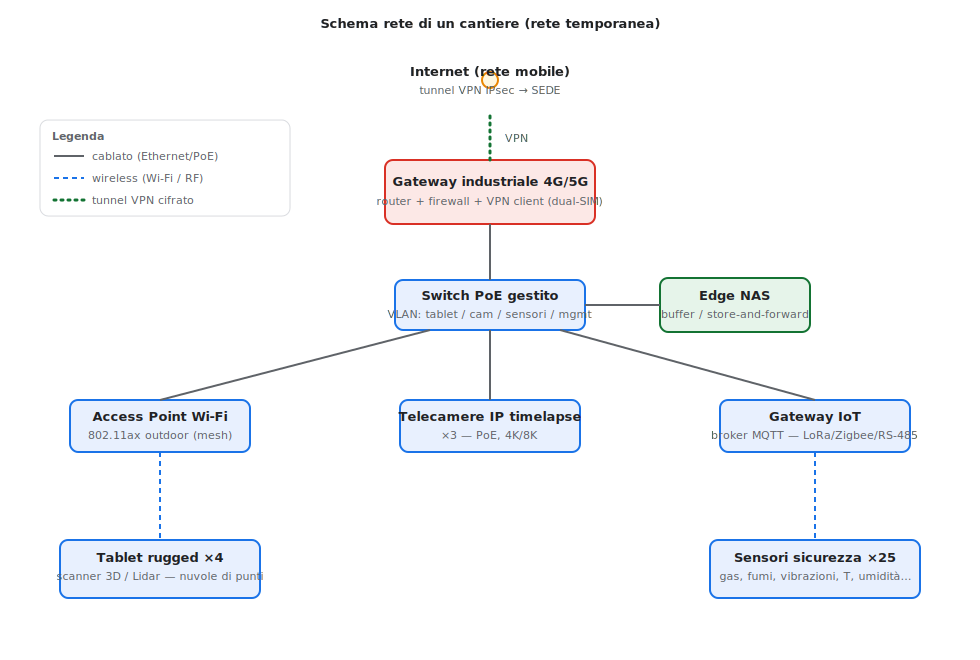
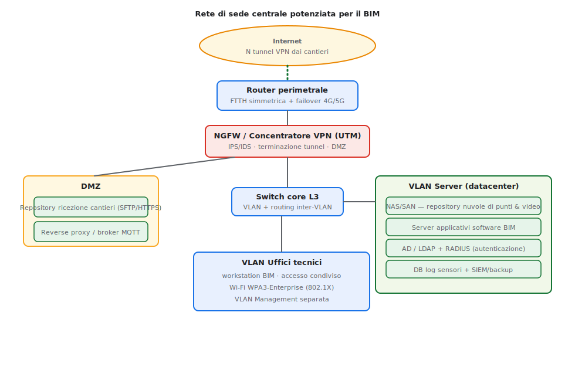
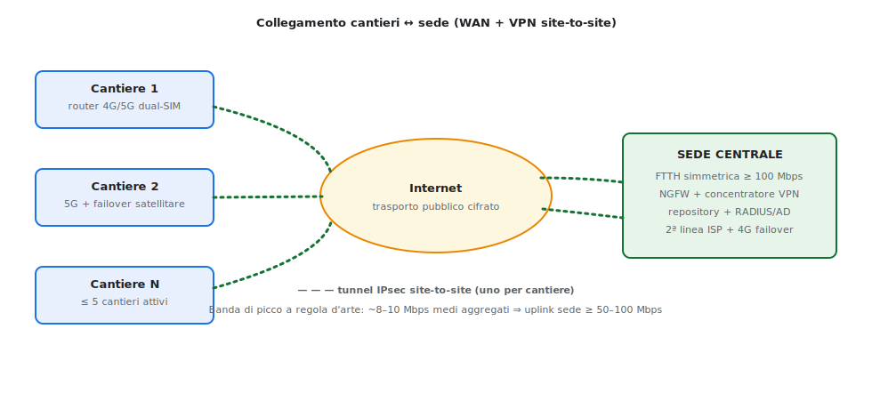

# Risoluzione — A038 "Sistemi e Reti"
### Esame di Maturità 2026 — Sessione ordinaria · Indirizzo ITIA (Informatica e Telecomunicazioni, art. Informatica)

[Traccia compito](A038_traccia_sistemi_reti_2026.md)

> **Nota di metodo.** È svolta per intero la **Prima parte** (obbligatoria) e, per completezza di studio, **tutti e quattro i quesiti** della Seconda parte: in sede d'esame se ne scelgono **due**. Numeri e quantità sono *ipotesi di dimensionamento* esplicitate: l'importante in questa traccia non è il valore esatto, ma la coerenza tra ipotesi, scelte progettuali e motivazioni.

> 📎 **Approfondimenti tecnici** (routing e autenticazione Wi-Fi mesh, SSID statico/dinamico, port-forward SSH in IOS, allocazione dei canali, continuità di servizio link/VPN e NAS — con comandi): vedi **[approfondimento_A038.md](approfondimento_A038.md)**.

> 🧩 **Cablaggio strutturato della sede** (6 documenti TIA/EIA-568B + misure di sicurezza del Quesito II): vedi **[cablaggio_sede_A038.md](cablaggio_sede_A038.md)**.

---

## Ipotesi aggiuntive e di dimensionamento

Per rendere concreto il progetto si assume:

- **Cantieri contemporaneamente attivi:** massimo **5**.
- **Dotazione tipica per cantiere:** 4 tablet rugged (scanner 3D/Lidar), 3 fotocamere timelapse, ~25 sensori di sicurezza, più i dispositivi personali di pochi operatori.
- **Natura dei cantieri:** *temporanei*, in luoghi variabili, **privi di cablaggio fisso** e a volte in zone scarsamente servite da rete cablata.
- **Traffico:** i dati "pesanti" (nuvole di punti, fotogrammi) **non sono real-time** e possono essere trasferiti a lotti/programmati; solo gli **allarmi dei sensori** richiedono bassa latenza (ma occupano banda trascurabile).

Queste ipotesi guidano due scelte chiave: rete di cantiere **wireless-centrica** con backhaul **mobile (4G/5G)**, e potenziamento della WAN di sede (l'ADSL esistente è inadeguata in upload).

---

# PRIMA PARTE

## Punto 1 — Infrastruttura di rete di un cantiere

Poiché il cantiere è temporaneo e senza cablaggio strutturato, si realizza una **LAN temporanea wireless-centrica** imperniata su un **gateway industriale 4G/5G** che fa da router, firewall e client VPN verso la sede.



**Apparati e canali locali**

- **Gateway industriale 4G/5G** (dual-SIM, robusto/IP-rated): unico punto di uscita verso Internet; instaura il **tunnel VPN IPsec** verso la sede e applica firewall/NAT.
- **Switch PoE gestito** (alimenta telecamere e AP, gestisce le VLAN).
- **Access Point Wi-Fi 802.11ax outdoor** (eventualmente **mesh** per coprire l'area): connettono i **tablet rugged**, che operano in wireless durante le scansioni.
- **Telecamere IP timelapse** collegate via **Ethernet/PoE** in punti strategici (o Wi-Fi dove il cavo è impraticabile).
- **Gateway IoT** con **broker MQTT** locale per i sensori di sicurezza: i sensori si interfacciano con tecnologie a basso consumo (**LoRa/Zigbee/BLE**) o cablate (**RS-485/Modbus**) verso i moduli di trasmissione.
- **Edge NAS**: buffer locale **store-and-forward** che bufferizza le grandi nuvole di punti e i fotogrammi e li invia alla sede quando il collegamento è disponibile (resilienza alle interruzioni).

**Schema di indirizzamento**

- **Indirizzamento classless, maschera unica `/24` (no VLSM)** sulle subnet di accesso. Poiché la VPN è in **TUN (L3, instradata)**, ogni cantiere ha **subnet distinte** dalla sede e dagli altri cantieri (è OSPF a propagarle, §Punto 3). Al cantiere *k* si assegna il blocco `10.k.0.0/16`.
- **VLAN: non indispensabili** per la connettività in una rete piccola e temporanea (una **subnet unica `/24`** sarebbe accettabile), ma **consigliate per sicurezza** per isolare almeno i **sensori IoT** (dispositivi deboli) e il **management** dal traffico client. Sul Wi-Fi/mesh si realizzano come **SSID distinti** (associazione VLAN↔SSID). *(Routing e autenticazione dei nodi mesh, SSID statico/dinamico e allocazione dei canali → [approfondimento](approfondimento_A038.md).)*

| VLAN | Zona | Subnet `/24` (cantiere *k*) | Esempio cantiere 1 | GW |
|---|---|---|---|---|
| 10 | Utenti / Tablet | `10.k.10.0/24` | `10.1.10.0/24` | `.254` |
| 20 | Telecamere timelapse | `10.k.20.0/24` | `10.1.20.0/24` | `.254` |
| 30 | Sensori IoT | `10.k.30.0/24` | `10.1.30.0/24` | `.254` |
| 99 | Management | `10.k.99.0/24` | `10.1.99.0/24` | `.254` |

> Variante minimale (cantiere molto piccolo): **subnet unica** `10.k.0.0/24`, senza VLAN, con segmentazione affidata alle sole regole host del firewall di gateway.

- **DHCP per i dispositivi wireless, indirizzi fissi per server e infrastruttura.** I client wireless (tablet) sono **numerosi, mobili e intermittenti**: entrano ed escono dalla rete, fanno roaming tra gli AP e cambiano a ogni montaggio/smontaggio del cantiere — configurarli a mano sarebbe impraticabile e fonte di conflitti, perciò un **server DHCP** li indirizza automaticamente da un *pool* fornendo IP, gateway `.254`, DNS e NTP. **Server, gateway e apparati** (router `.254`, AP, telecamere, gateway IoT, broker) hanno invece **indirizzo fisso** (statico o *reservation* DHCP su MAC) perché devono essere **raggiungibili a un indirizzo stabile e noto**, richiamato da record DNS, regole firewall/ACL, configurazioni client, indirizzo del broker MQTT, OSPF e port-forward: se cambiasse a ogni lease, tutti questi riferimenti si romperebbero.

**Protocolli e servizi**

- **DHCP e DNS a bordo del firewall/gateway** (il router 4G/5G che è anche firewall): il DHCP serve i client wireless, il DNS è un *forwarder* locale; insieme. **NTP** per la sincronizzazione oraria (fondamentale per i timestamp di log e timelapse).
- **Tunnel L3/TUN (GRE) protetto da IPsec** verso la sede, con **OSPF** per il routing; **WPA3-Enterprise / 802.1X** sul Wi-Fi.
- **MQTT** per la telemetria/allarmi dei sensori; **SFTP/FTPS/HTTPS** per il trasferimento di nuvole di punti e fotogrammi al repository di sede.
- **Firewall** sul gateway con regole di default-deny in ingresso.

## Punto 2 — Rete pre-esistente in sede e potenziamenti

**Situazione attuale (descritta dalla traccia).** LAN piatta con i PC degli uffici tecnici e un **router con WAN ADSL** verso Internet. È adeguata al lavoro d'ufficio ma **insufficiente** per il BIM.



**Potenziamenti necessari**

1. **WAN.** L'ADSL è asimmetrica con upload basso: inadeguata a **ricevere** grandi nuvole di punti e flussi video da più cantieri. Si passa a **fibra FTTH simmetrica** (o connessione business) con **upload elevato**, e si aggiunge **ridondanza** (seconda linea ISP e/o failover 4G/5G).
2. **Sicurezza perimetrale.** **NGFW/UTM** con **IPS/IDS** che funge anche da **concentratore VPN** per terminare i tunnel dei cantieri, e creazione di una **DMZ** per i servizi esposti (repository di ricezione, reverse proxy, broker MQTT).
3. **Server e storage.** **NAS/SAN** in **RAID 6/10** (ridondanza del singolo nodo) per il repository — che funge da **CDE (Common Data Environment)** del progetto BIM (nuvole di punti, fotogrammi, video timelapse); **server applicativi** per il software BIM specialistico; **server di autenticazione** (Active Directory/LDAP + **RADIUS**); **database** per i dati sensori e il **registro di log storico**; **SIEM** e sistema di **backup**.
4. **Segmentazione e core.** **Switch core L3** con **VLAN** e routing inter-VLAN controllato da policy. In sede le **VLAN sono necessarie**: convivono livelli di fiducia diversi (server farm, DMZ, uffici, management) ed è il presupposto delle policy *default-deny* sui confini. Indirizzamento **classless `/24`** nel blocco `10.0.0.0/16`:

   | VLAN | Zona | Subnet `/24` | GW |
   |---|---|---|---|
   | 10 | Uffici tecnici (workstation BIM) | `10.0.10.0/24` | `.254` |
   | 20 | Wi-Fi staff | `10.0.20.0/24` | `.254` |
   | 30 | Server farm (NAS/SAN, app BIM, AD/RADIUS, DB, MQTT) | `10.0.30.0/24` | `.254` |
   | 40 | DMZ (repository ricezione, reverse proxy) | `10.0.40.0/24` | `.254` |
   | 99 | Management apparati | `10.0.99.0/24` | `.254` |

5. **Servizi di sistema.** **DHCP e DNS a bordo del firewall (NGFW)**, insieme: il DHCP indirizza la VLAN Wi-Fi staff e i client d'ufficio, il DNS risolve i nomi interni. I **server della server farm** (VLAN 30) e gli apparati hanno **indirizzo fisso**, perché raggiunti per nome/IP stabile da DNS, ACL, client BIM e dal broker.
6. **Continuità.** **UPS**, ridondanza degli apparati critici, backup e procedura di **disaster recovery**.

## Punto 3 — Canali cantiere ↔ sede e dimensionamento della banda

I cantieri sono temporanei: il collegamento più sensato è una **VPN site-to-site su Internet**, con accesso **mobile 4G/5G** lato cantiere e **fibra simmetrica** lato sede.



**Stima della capacità trasmissiva (esempio motivato)**

| Sorgente (per cantiere/giorno) | Volume stimato |
|---|---|
| Nuvole di punti (a lotti) | ~5 GB |
| Fotogrammi timelapse | ~0,5 GB |
| Dati sensori | trascurabile (decine di MB) |
| **Totale per cantiere** | **~6 GB/giorno** |

Con **5 cantieri** → ~**30 GB/giorno** verso la sede. Trasferendoli in una **finestra di 8 ore**:

```
30 GB ≈ 240 Gbit ⇒ 240.000 Mbit / 28.800 s ≈ 8,3 Mbps medi aggregati
```

Considerando overhead e picchi, alla sede si provvede **upload ≥ 50–100 Mbps simmetrici** (la fibra copre con ampio margine). Lato cantiere bastano i **picchi del 4G/5G** (decine di Mbps): la media per cantiere è ~1,7 Mbps. Le nuvole di punti, non real-time, si **schedulano** (es. di notte) per non saturare il link.

**Apparati da adottare:** router cellulari industriali **dual-SIM** (cantiere), **NGFW/concentratore VPN** e **router fibra** (sede), con failover ISP/4G.

**Indirizzamento dei link e routing.** Il piano è **a due livelli**: `/24` uniforme per le subnet di accesso/servizio e **`/30` sui link punto-punto** dei tunnel (2 host utili, nessuno spreco), tutti ricavati dal blocco `10.255.0.0/24`.

| Interfaccia | Tratta | Subnet `/30` | IP lato cantiere | IP lato sede |
|---|---|---|---|---|
| `Tunnel1` | sede ↔ cantiere 1 | `10.255.0.0/30` | `10.255.0.1` | `10.255.0.2` |
| `Tunnel2` | sede ↔ cantiere 2 | `10.255.0.4/30` | `10.255.0.5` | `10.255.0.6` |
| `Tunnel3` | sede ↔ cantiere 3 | `10.255.0.8/30` | `10.255.0.9` | `10.255.0.10` |
| `Tunnel4` | sede ↔ cantiere 4 | `10.255.0.12/30` | `10.255.0.13` | `10.255.0.14` |
| `Tunnel5` | sede ↔ cantiere 5 | `10.255.0.16/30` | `10.255.0.17` | `10.255.0.18` |

**Propagazione delle rotte.** Una volta attivi i tunnel `/30`, ogni router conosce per
via diretta solo le proprie LAN e la dorsale del proprio tunnel: le subnet remote vanno
rese raggiungibili. Due approcci equivalenti:
- Con il **routing statico** si sfruttano i
blocchi riassuntivi: ogni cantiere riceve **una sola rotta** verso `10.0.0.0/16` (la sede),
mentre la sede riceve **una rotta per cantiere** verso `10.k.0.0/16` — compatto e
deterministico, ma da aggiornare a mano a ogni nuovo cantiere. 
- Con il **routing dinamico
OSPF** (la scelta qui adottata) si eliminano le rotte manuali: ciascun router annuncia le
proprie reti sui tunnel `point-to-point` in `area 0`, la sede impara automaticamente tutti
i `10.k.0.0/16` e i cantieri imparano `10.0.0.0/16`, con riconvergenza automatica e nessun
intervento sull'hub quando si aggiunge un cantiere.

> 📎 **Routing sulle dorsali `/30`** — tabelle statiche lato cantiere e lato sede (con le
> sole rotte non direttamente connesse, da inserire a mano) e soluzione OSPF equivalente
> con comandi e verifica: vedi
> [routing_dorsali_A038.md](routing_dorsali_A038.md).


Il **routing è dinamico con OSPF** sui tunnel (`ip ospf network point-to-point`, `area 0`): ogni router annuncia i propri `/24` e la sede raggiunge tutti i cantieri (e viceversa) senza NAT interno — gli indirizzi sono tutti distinti. Il **NAT** resta solo sull'uscita Internet di ciascun router di confine. Estratto GRE lato sede (`Tunnel1`, l'altro capo è speculare):

```cisco
R-SEDE(config)# interface Tunnel1
R-SEDE(config-if)# ip address 10.255.0.2 255.255.255.252
R-SEDE(config-if)# tunnel source <IP-pub-sede>
R-SEDE(config-if)# tunnel destination <IP-pub-cantiere1>
R-SEDE(config-if)# tunnel mode gre ip
R-SEDE(config-if)# ip ospf network point-to-point
R-SEDE(config-if)# ip ospf 100 area 0
R-SEDE(config-if)# no shutdown
```

> Nota sulle maschere: l'uso del `/30` solo sulla dorsale è una forma *minima* di VLSM, prassi standard sui link punto-punto. Per un piano **rigorosamente senza VLSM** si userebbe `/24` anche per ogni tratta di tunnel.

**Operatori — i quattro livelli applicati allo scenario**

L'identità dell'operatore è **unica e centralizzata** su **Active Directory/LDAP** in sede, con **RADIUS** come server AAA: cambia solo *dove* e *quanto forte* la si verifica lungo lo stack.

**Ammissione alla rete (accesso alla *risorsa LAN* presso il NAS).** Qui convivono **due profili di accesso** a seconda di *cosa* è il terminale:
- **(a) Dispositivo personale — BYOD (non aggiunto al dominio).** Il PC portatile personale si autentica via **802.1X/EAP** verso un server **RADIUS** sulla porta *logica* dell'**AP Wi-Fi** in modalità **WPA2/3-Enterprise**. Poiché il PC portatile **non possiede un account macchina di dominio né un certificato personale**, si adotta **EAP-PEAP / EAP-TTLS**:
     - la credenziale utente (**username + password** Radius) viaggia *dentro* il **tunnel TLS cifrato** creato dal client con la chive pubblica del **certificato del server RADIUS**.
     - dentro il tunnel cifrato viene scambiata la password Radius. RADIUS **valida** la coppia username/password su un database LDAP (lo stesso dell'Active Directory dei pc dell'ufficio) e  assegna la **VLAN dinamica** (`Tunnel-Private-Group-Id`) alla scheda di rete del portatile in base al gruppo, pur collegandosi tutti i gruppi ad un unico SSID.

- **(b) Postazione fissa aziendale (PC aggiunto al dominio Windows).** L'utente esegue il **logon di dominio**, autenticato da **LDAP/Kerberos** verso il **Domain Controller** (AD). Sulla porta *fisica* dello **switch** di sede si applica **802.1X** con autenticazione **macchina + utente** (credenziali/certificato di dominio); l'accesso successivo alle risorse intranet sfrutta il **SSO Kerberos**. Il livello di fiducia è **più alto** del BYOD perché il PC è *gestito*, *nel dominio* e sottoposto a GPO.
  > Dove l'802.1X non è praticabile (ospiti, dispositivi legacy), ripiego su **captive portal** a L7 (username/password o voucher).

**L3 · Canale/VPN.** Gli **operatori remoti** (manutenzione, smartworking) accedono **home-to-site** con **VPN client** + credenziali AD **+ MFA** (OTP/TOTP), validate via RADIUS — *canale insicuro (Internet) ⇒ autenticazione forte obbligatoria*.

**L4/5 · Sessione sul trasporto — applicativi HTTPS.** L'accesso ai servizi web del repository/BIM avviene su **HTTPS**, cioè su **TLS *non mutuo* (solo server-side)**: solo il **server** espone il proprio **certificato** (autenticazione asimmetrica *singola*, sfida in chiaro) e il client lo convalida contro la **CA radice** preinstallata. *Dentro* il tunnel così stabilito l'operatore invia la propria **password** (schema **PAP nel tunnel** = *server forte + client debole*, lo stesso di HTTPS+login e di SSH con password). **Non si usa mTLS per gli utenti**: il certificato *client* comparirebbe solo a **LoA4** (chiave su hardware sicuro), sproporzionato per l'operatore comune.

**L7 · Sessione applicativa e autorizzazione.** Accesso ai sistemi/repository BIM con **SSO**: **Kerberos/AD** per l'intranet, **OpenID Connect/OAuth 2.0** (token **JWT** *bearer*) per le app web. Autorizzazioni per **gruppi** LDAP (minimo privilegio). L'amministrazione remota degli apparati usa **SSH** (host key → canale cifrato → chiave/credenziale del client).

**Rinforzo con autenticazione a due fattori (2FA/MFA).** Tutto l'impianto sopra poggia, di base, su un **solo fattore** ("una cosa che sai", la password): da solo vale **LoA2 (eIDAS basso)**. Si aggiunge quindi un **secondo fattore** — un **OTP/TOTP** ("una cosa che hai", app authenticator o token) — che innalza l'autenticazione a **forte (LoA3 / eIDAS sostanziale)**. Il 2FA è **obbligatorio** sull'**accesso remoto/VPN** (L3, canale Internet) e sulle **funzioni sensibili** degli applicativi (L7), e raccomandato anche sul logon BYOD. Il secondo fattore viene sempre verificato **dentro un canale già cifrato** (il tunnel TLS/VPN), coerentemente col principio "PAP/password solo su canale sicuro".

> **Sintesi del modello per gli operatori.** *Un'unica identità AD/LDAP*, verificata a più livelli che **si sommano**: **802.1X/EAP-PEAP** (BYOD) **oppure** **logon di dominio Kerberos/LDAP** (PC fisso) per **entrare in rete** (L2) → **TLS non mutuo con password-in-tunnel (PAP)** per gli **applicativi HTTPS** (L4/5–L7) → il tutto **rinforzato da 2FA OTP/TOTP** per passare da LoA2 a LoA3. Il certificato *client* (mTLS, LoA4) resta riservato ad **apparati e servizi**, non agli utenti.


---

# SECONDA PARTE

## Quesito I — Archiviazione: soluzioni *on-premise* vs *cloud-based*

**On-premise** (NAS/SAN propri in sede).
*Vantaggi:* pieno controllo e sovranità del dato (privacy), nessun canone ricorrente, **bassa latenza** per il software BIM che gira in locale, indipendenza da Internet per l'accesso interno.
*Svantaggi:* alto **CapEx** iniziale, manutenzione e gestione a carico dell'azienda, **scalabilità limitata** dall'hardware, backup/DR da realizzare in proprio, sicurezza fisica ed energia.

**Cloud-based** (object storage / IaaS-PaaS).
*Vantaggi:* **scalabilità elastica** (ideale per nuvole di punti enormi), modello **OpEx**, accessibilità ovunque (sedi, cantieri, partner), ridondanza/backup/DR e geo-replica gestiti dal provider.
*Svantaggi:* **costi ricorrenti** che crescono col volume (le nuvole di punti pesano molto), **dipendenza da banda/connettività** (critica vista la mole dati), aspetti di **privacy/compliance**, rischio di **vendor lock-in**, latenza.

**Proposta: soluzione ibrida.** Dati "caldi" e attivi del modello BIM su **NAS/SAN in sede** (prestazioni, il software lavora in locale); **cloud** per **backup/DR**, **archivio "freddo"** delle scansioni e **collaborazione** con le altre sedi/partner. Si ottiene il meglio: prestazioni locali e resilienza/scalabilità esterne.

**Interoperabilità dei dati (dominio BIM).** A prescindere dallo storage, i modelli vanno scambiati in un formato **aperto e neutro**: lo standard **IFC (Industry Foundation Classes)** dell'approccio **openBIM** garantisce l'interoperabilità tra software diversi, evitando il *lock-in* dei formati proprietari. La condivisione "tra i vari uffici" richiesta dalla traccia si realizza con un **CDE (Common Data Environment)**: l'ambiente di dati condiviso (qui il repository in sede + cloud) che fa da unica fonte di verità del progetto, con versioning e controllo degli accessi. È il CDE, non un semplice file server, a coordinare il lavoro dei tecnici sul modello.

## Quesito II — Ulteriori misure di sicurezza e continuità trasmissiva

### Autenticazione reciproca dei nodi di infrastruttura

L'autenticazione del Punto 4 riguarda gli **utenti**; qui si tratta l'autenticazione **fra apparati e servizi**, che è di natura **mutua** (nessuna delle due parti è "il browser di un umano" da fidare a senso unico) e va realizzata **su canali insicuri** — l'aria del Wi-Fi/mesh, Internet fra cantiere e sede, la rete IP edge↔backend. Dove i nodi lo supportano si usa l'**autenticazione forte asimmetrica (a certificati)**; sui **nodi vincolati** che non reggono una PKI/TLS — i **sensori** sul lato radio — si ricorre all'**autenticazione mutua a chiave pre-condivisa (PSK)**. I meccanismi non si escludono: vivono a **livelli diversi** dello stack (802.1X a L2, mTLS/TLS a L4/5, IPsec a L3, SSH/Kerberos a L7) e tipicamente **coesistono**.

[](https://github.com/sebastianomelita/ArduinoBareMetal/blob/master/approfondimenti/img/stack_802.1x_mtls.svg)

#### Richiamo teorico — autenticazione forte, mutua e a tre vie

- **Forte (asimmetrica).** Chi verifica invia una **sfida**; la risposta è la **sfida firmata** con la **chiave privata**. Solo chi possiede la privata produce la risposta corretta: le *credenziali* sono irreversibili e uniche, e non c'è alcun segreto da trasmettere in chiaro. È l'unica adatta ai canali insicuri.
- **Mutua = protocollo a tre vie (3WHS).** Quando *entrambe* le parti devono autenticarsi, ciascuna lancia la propria sfida e firma quella dell'altra: è lo schema dell'**autenticazione mutua asimmetrica con sfida in chiaro**, cioè l'**mTLS** della figura sotto.
- **Certificati vs credenziali (complementari).** Il **certificato** non autentica l'apparato: autentica solo la sua **chiave pubblica**, garantendone l'intestatario tramite la **firma di una CA** fidata. Sono le **credenziali** (la sfida firmata con la privata associata a quel certificato) ad autenticare *davvero* il nodo, perché solo il detentore della privata sa produrle.
- **Difesa dal MITM nello scambio delle chiavi pubbliche.** L'associazione "chiave pubblica ↔ nodo" va resa autentica, altrimenti un Mallory si infila in mezzo. Tre modi:
  1. **PSK** — una chiave segreta condivisa con cui si cifra/autentica il primo messaggio (il caso del *segreto del RADIUS*, di WPA3-SAE).
  2. **Certificati firmati da una CA** — la via scalabile (PKI aziendale): è ciò che usano mTLS, RadSec, EAP-TLS, IPsec.
  3. **Fiducia al primo contatto (TOFU / *resurrecting duckling*)** — alla prima connessione si accetta e si memorizza la chiave della controparte (le *host key* di SSH), eventualmente entro una **finestra temporale** di pairing (come WPS/Bluetooth). Utile per il *provisioning in campo* di un gateway nuovo in cantiere, dove la PKI non è ancora raggiungibile.
- **Principio operativo.** Nell'autenticazione mutua è spesso **la parte più forte a creare il canale sicuro** su cui poi si autentica la controparte più debole.
- **PFS (Perfect Forward Secrecy).** Su tutti questi canali si impone lo scambio **Diffie-Hellman effimero (DHE/ECDHE)**: la chiave privata RSA serve solo ad **autenticare** lo scambio, mentre le chiavi di sessione sono temporanee. Così la compromissione *futura* di una privata non rende leggibile il traffico *passato* registrato (rilevante per i log dei sensori e gli allarmi).

[](https://github.com/sebastianomelita/ArduinoBareMetal/blob/master/approfondimenti/img/authutente/auth_mutua_asimmetrica.jpg)

*(Fase di registrazione = scambio autenticato delle chiavi pubbliche tramite certificati CA; dettaglio in [autenticazione_utente.md §5.6–5.8](https://github.com/sebastianomelita/ArduinoBareMetal/blob/master/approfondimenti/autenticazione_utente.md).)*

#### Applicazione ai nodi dello scenario

- **AP ↔ server RADIUS.** Il RADIUS "classico" autentica il canale AP–server con un **segreto condiviso (PSK)**: semplice ma statico, senza PFS e con autenticazione del solo messaggio. La forma robusta è **RadSec (RADIUS over TLS)** con **mTLS**: AP e server espongono ciascuno il proprio **certificato X.509** della CA aziendale → autenticazione **reciproca a tre vie**, canale cifrato con ECDHE. Impedisce sia all'AP-rogue di fingersi *authenticator*, sia al server-rogue di intercettare le credenziali EAP.
- **AP ↔ AP (backhaul mesh).** I nodi mesh si fidano a vicenda *prima* di formare la dorsale. Due strade: **(a) WPA3-SAE** (*dragonfly*), autenticazione **mutua basata su PSK** in cui nessuno trasmette la password e si neutralizzano MITM e attacchi a dizionario, con PFS; **(b) mesh enterprise a certificati**, dove ogni AP fa **EAP-TLS** verso RADIUS e i peer si fidano via PKI/controller. La mutua blocca l'inserimento di un **evil-twin** che farebbe da MITM sul backhaul.
- **Gateway sensori ↔ server RADIUS.** Il gateway IoT entra in rete come **supplicant 802.1X in EAP-TLS**: presenta il proprio **certificato di apparato**, il RADIUS presenta il suo → **mutua a certificati**, identica per struttura alla figura. RADIUS assegna la **VLAN 30 (sensori)** solo a gateway con certificato valido: un gateway clonato, privo della **chiave privata** corrispondente, non sa produrre la sfida firmata e viene **respinto**.
- **Client MQTT del gateway ↔ broker MQTT.** Sul canale IP edge↔backend si usa **mTLS** (X.509 bilaterale): è esattamente lo scenario della figura — broker e client si scambiano sfida-in-chiaro + firma e ciascuno valida il certificato dell'altro contro la **CA radice** preinstallata. Variante più leggera per device vincolati: **TLS server-side + credenziale del device** (token/username nel tunnel, schema *PAP-in-tunnel*). Garantisce che **solo** i gateway autorizzati pubblichino telemetria/allarmi e che il client parli col **broker vero**, non con un impostore.
- **Sensori ↔ AP/gateway.** Qui la scelta dipende dalla **tecnologia d'accesso** del sensore, non dal fatto che sia un sensore:
  - **Su radio a basso consumo (LoRa/Zigbee/BLE).** Sono nodi **vincolati** (poca CPU/RAM, alimentazione a batteria): **non gestiscono certificati né l'handshake TLS**, quindi l'autenticazione mutua è **simmetrica, a chiave pre-condivisa (PSK)**. Le due parti condividono in fase di provisioning un **segreto** (la *AppKey* 128 bit in LoRaWAN, la *network/link key* in Zigbee, la chiave di *pairing* in BLE). È lo schema "PSK + MIC" del Punto 4. Per il *pairing* iniziale sul campo, in cantiere, vale il modello **fiducia-al-primo-contatto entro finestra temporale** (Zigbee/BLE/WPS), il *resurrecting duckling* visto sopra.
  - **Su Wi-Fi o Ethernet.** Quando il sensore (o il suo modulo di trasmissione) ha un'interfaccia **Wi-Fi/Ethernet** — quindi CPU e stack sufficienti — **rientra nel caso generale dei terminali**: si autentica via **802.1X / EAP-TLS** verso RADIUS con un **certificato di apparato**, esattamente come il gateway IoT. Mutua a certificati, forte, con assegnazione della **VLAN 30 (sensori)** su esito positivo. In questo scenario la PSK del lato radio **non serve**: l'ammissione alla rete è già governata dalla PKI a L2.

| Accoppiamento | Meccanismo | Cosa autentica | Minaccia neutralizzata |
| --- | --- | --- | --- |
| AP ↔ RADIUS | PSK (classico) / **RadSec mTLS** | reciproca, certificati X.509 | AP-rogue, server-rogue |
| AP ↔ AP (mesh) | **WPA3-SAE (PSK)** / EAP-TLS | reciproca dei nodi mesh | evil-twin, MITM sul backhaul |
| Gateway sensori ↔ RADIUS | **802.1X / EAP-TLS** | certificato di apparato ↔ server | gateway clonato/non autorizzato |
| Client MQTT ↔ broker | **mTLS** / TLS+credenziale device | reciproca client↔broker | publisher abusivo, broker fasullo |
| **Sensori ↔ AP/gateway** — radio LP | **PSK + MIC** (LoRaWAN OTAA, Zigbee/BLE) | reciproca via segreto condiviso | sensore non autorizzato, frame falsi/replay |
| **Sensori ↔ AP/gateway** — Wi-Fi/Ethernet | **802.1X / EAP-TLS** (certificati) | certificato di apparato ↔ server | nodo rogue, accesso non autorizzato |

> **Nota sui livelli.** Questa è autenticazione **di apparato/servizio**, non di utente. Dove si usano **certificati** (AP, gateway, broker) punta al massimo livello di garanzia (**LoA4-like**), perché la **chiave privata** risiede su **hardware del dispositivo** (idealmente TPM/secure element, *tamper-resistant*). Sui **sensori** il segreto è simmetrico (PSK): forza **media**, adeguata al basso rischio del singolo nodo e all'impossibilità di gestire una PKI, e comunque irrobustita da MIC e anti-replay. Tutto ciò si **contrappone e si somma** all'autenticazione **utente** del Punto 4 (password + **MFA**, LoA3): *gli apparati capaci si autenticano con certificati mutui, i sensori con PSK, gli utenti con credenziali deboli rinforzate da un secondo fattore*. I piani convivono sullo stesso collegamento (es. un tablet che fa EAP-TLS *di apparato* mentre l'operatore fa il proprio login *utente*; un sensore in PSK verso il gateway che a sua volta fa mTLS verso il broker).

---
---
---

Oltre all'autenticazione (punto 4):

**Filtraggio del traffico — tabella degli accessi.** La segmentazione è resa effettiva da un **piano di accessi** tra le zone, applicato con ACL inbound per interfaccia sul core L3 (✓ = ammesso, ✗ = negato):

| Sorgente ↓ \ Dest → | Server farm (V30) | DMZ (V40) | Mgmt (V99) | Internet |
|---|---|---|---|---|
| Uffici V10 | App BIM, NAS, AD/DNS | ✗ | ✗ | HTTP/S |
| Wi-Fi staff V20 | solo DNS | ✗ | ✗ | HTTP/S |
| Server farm V30 | intra + DB (da App BIM) | ✗ | ✗ | update HTTPS |
| DMZ V40 | repo→NAS, bridge MQTT | — | ✗ | ✗ |
| Cantieri (tunnel) | RADIUS, MQTT | SFTP/HTTPS | ✗ | — |
| WAN (Internet) | ✗ | HTTPS/SFTP pubblicati | ✗ | — |
| Mgmt V99 | SSH agli apparati | SSH | — | ✗ |

Convenzione: **una ACL estesa con nome, inbound per interfaccia** (mai regole `out`); **default-allow** nelle LAN (con anti-spoofing), **default-deny** sui confini (Server farm, DMZ, tunnel, WAN). **Due firewall indipendenti**: la sicurezza della sede è garantita **dalle sole regole sul firewall di sede** (l'ACL del tunnel in ingresso è il controllo autoritativo verso i cantieri); le regole sul gateway di cantiere — apparato esposto e manomettibile — sono **difesa in profondità** speculare, su cui la sede **non fa affidamento**. *(ACL complete — tabella ACE + comandi IOS — in [approfondimento §11 (sede)](approfondimento_A038.md) e §12 (cantiere).)*

**Sicurezza informatica**
- **Cifratura** distinguendo i due stati del dato: **in transito** con VPN **IPsec** (ESP, **AES-256** per la riservatezza, **SHA-256** per integrità e **anti-replay** — utile per i log dei sensori) e **TLS** per i trasferimenti applicativi; **a riposo** (*data at rest*) con cifratura dei dischi **AES-256** su NAS/SAN e tablet. **WPA3** sul Wi-Fi con **Client Isolation** (i tablet non si parlano tra loro → niente movimento laterale in caso di compromissione).
- **NGFW/UTM con IPS/IDS** in sede e firewall su ogni gateway di cantiere; ispezione **stateful con CBAC** che apre i ritorni ai confini default-deny (approf. §13), in alternativa il modello a zone **ZBF** (approf. §14).
- **Segmentazione** (VLAN) e **DMZ** per i servizi esposti. Doctrine delle policy: **default-deny su ogni confine di fiducia** (WAN, tunnel, accesso ai server) e **default-allow solo dentro le zone già fidate**, con **ACL anti-spoofing** in ingresso sulle subnet.
- **Endpoint security**: antivirus/EDR su tablet e PC; **MDM** sui tablet rugged (cifratura disco, **remote wipe** in caso di furto/smarrimento in cantiere).
- **Hardening**: disabilitazione servizi/porte inutili, **patch management**, cambio credenziali di default, **PKI** per certificati di apparato/server.
- **Monitoraggio**: **SIEM**, registro di **log storico**, alert su anomalie.
- **Disponibilità dello storage (pilastro *Availability*)**: NAS/SAN in **RAID 6/10** per tollerare il guasto di uno/due dischi senza fermo né perdita, con **hot spare** e rebuild automatico. *(Livelli e parametri tipici → [approfondimento §9.5](approfondimento_A038.md).)*
- **Sicurezza fisica** della sala server e dei rack di cantiere.

**Continuità trasmissiva del canale cantiere ↔ sede**
- **WAN ridondata** lato cantiere: **dual-SIM** di due operatori, oppure 4G/5G **+ satellitare** in failover automatico.
- **Doppio ISP + 4G** in failover lato sede; **alta affidabilità** (firewall ridondati).
- **VPN** con **Dead Peer Detection** e riconnessione automatica; eventuali tunnel ridondati. Failover gestito in logica **SD-WAN** con sonde **IP SLA** (latenza/jitter/perdita): al degrado del link primario il traffico passa al backup in millisecondi.
- **QoS** per prioritizzare gli **allarmi** dei sensori sul traffico bulk.
- **Store-and-forward** sull'edge NAS di cantiere: i dati vengono accodati durante un'interruzione e inviati al ripristino, **senza perdite**.
- **UPS** su gateway di cantiere e apparati di sede.

> Le **ipotesi di continuità** (VRRP/keepalived per il link/VPN; DRBD + 3-2-1 per il NAS) e il **dettaglio comandi delle misure di sicurezza** (IPsec del tunnel, LUKS, WPA3+Client Isolation, IP SLA, RAID, GPO) sono nell'**[approfondimento](approfondimento_A038.md)** (§7–§9).

## Quesito III — Bloccare le piattaforme IA nella rete didattica

**Scenario:** alcuni studenti usano, non autorizzati, piattaforme di IA per farsi generare il codice delle tracce di laboratorio.

**Misure e tecniche di blocco**
- **Web filtering / proxy** (es. Squid o filtro URL dell'UTM) con **ACL per categoria/dominio** che blocca le piattaforme IA note.
- **Filtraggio DNS** (DNS sinkhole, es. Pi-hole o DNS firewall): si risolvono i domini IA verso un *blackhole*. **Attenzione:** il **DNS-over-HTTPS (DoH)** aggira il filtro DNS → va **bloccato/forzato** il DNS interno, oppure si filtra a livello di **SNI**/application control.
- **HTTPS:** poiché l'URL è cifrato, si usa **filtraggio SNI** o **ispezione SSL** (con policy/consenso adeguati), o l'**application control** dell'NGFW che riconosce il traffico verso i servizi IA.
- **Regole firewall** per IP/domini e blocco a livello di **VLAN del laboratorio**.
- **Policy per identità**: con **captive portal / 802.1X + gruppi AD** si distingue *studenti* (bloccati) da *docenti* (autorizzati).
- **Restrizioni sull'endpoint (GPO)**: via **Group Policy** del dominio si applica una **blocklist/allowlist delle estensioni** del browser, per impedire plugin IA o integrazioni IA negli IDE che aggirerebbero il filtro di rete. *(Le GPO come piano di autorizzazione — struttura, LSDOU, ADMX, comandi → [approfondimento §10](approfondimento_A038.md).)*

**Schedulazione blocco/sblocco per orario e laboratorio**
- **ACL temporizzate** (time-range) su firewall/proxy: molte soluzioni (es. pfSense) supportano regole con fasce orarie.
- **Job cron** che attivano/disattivano regole o sostituiscono i file ACL del proxy negli orari previsti.
- Applicazione **per VLAN del singolo laboratorio**, così il blocco vale solo dove/quando serve, allineato all'orario delle classi.
- Possibilità di **override autenticato del docente** per uno sblocco temporaneo durante attività guidate.

## Quesito IV — Comando SSH con port forwarding

```
ssh -p 25500 administrator@200.1.1.1
```


**Analisi del comando**
- `ssh` — avvia il **client SSH** (shell remota **cifrata e autenticata**).
- `-p 25500` — ci si connette alla **porta TCP 25500** (non la 22 di default) sull'host di destinazione.
- `administrator@200.1.1.1` — login come utente **administrator** sull'host con **IP pubblico 200.1.1.1**.

**Effetti (con la regola di redirezione)**
Su `200.1.1.1` (un router/firewall) è configurata una regola di **DNAT / port forwarding**: il traffico in ingresso sulla **porta 25500** viene **reindirizzato** a `172.16.1.100:22`. Poiché `172.16.1.100` è un **indirizzo privato (RFC 1918)** non raggiungibile direttamente da Internet, il router lo **"espone"** tramite il proprio IP pubblico su una porta non standard. Di conseguenza la **sessione SSH termina di fatto sull'host interno 172.16.1.100**: l'amministratore ottiene una shell su quel dispositivo pur avendo digitato l'indirizzo pubblico del router, che esegue la traduzione (NAT).

**Finalità d'uso**
- **Amministrazione remota** di un dispositivo interno privo di IP pubblico, **attraversando il NAT**.
- L'uso di una **porta non standard (25500)** riduce gli attacchi automatici sulla 22 (*security through obscurity*) e consente di **mappare più host interni** su porte esterne diverse di un **unico IP pubblico**.
- Caso tipico nello scenario BIM: gestione da remoto di un server/apparato dietro al router della sede o di un cantiere.

---

### Strumenti consentiti (promemoria dalla traccia)
Durata massima 6 ore. Ammessi manuali tecnici e calcolatrici scientifiche/grafiche **non** programmabili e **senza** connessione a Internet; dizionario bilingue per i non madrelingua.
