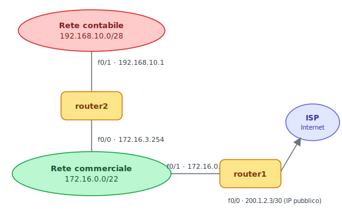
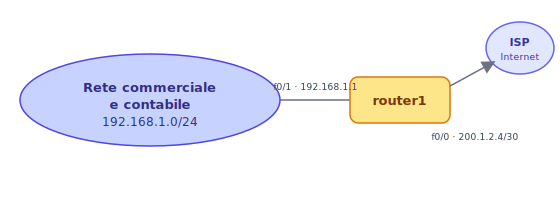
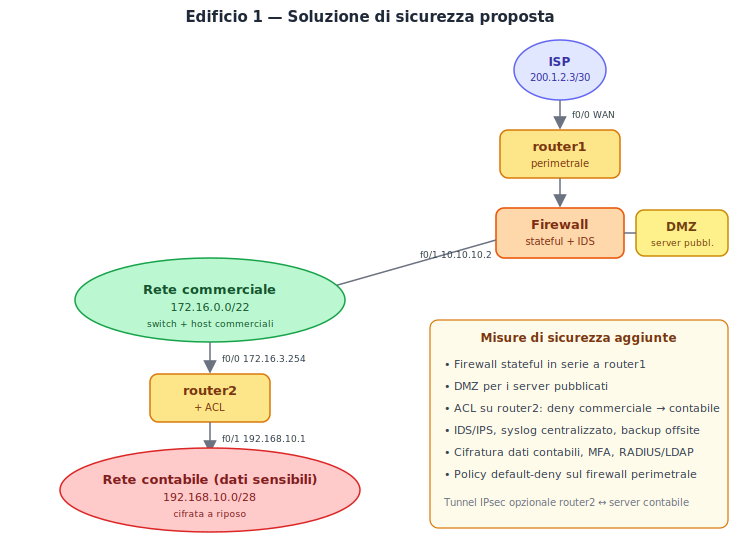
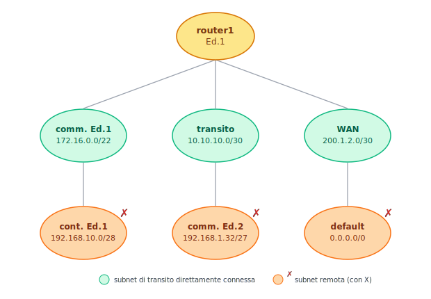
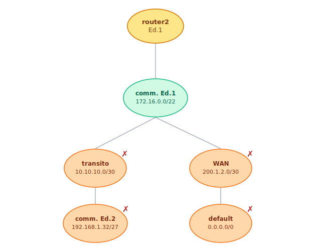
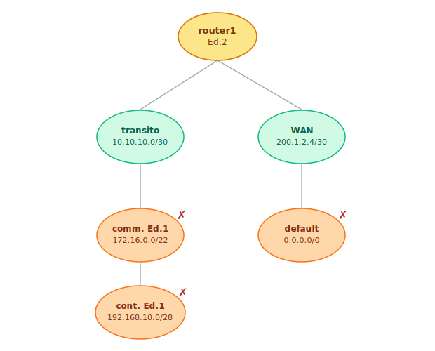
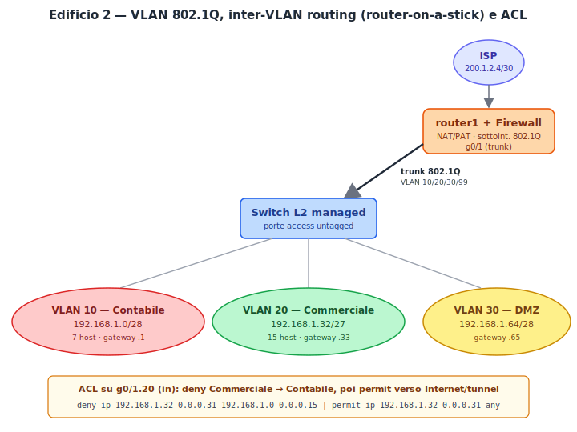
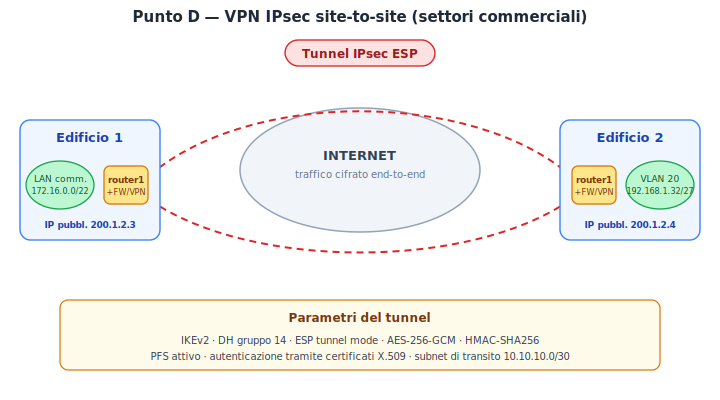

>[Torna a svolgimento Smart Road](svolgimento_smart_road.md)>[Torna a Dettaglio architettura Ethernet](/archeth.md) 
>

# Esame di Stato — Sistemi e Reti (ITTL · Telecomunicazioni)

> **Ministero dell'Istruzione, dell'Università e della Ricerca**
> Esame di Stato di Istruzione Secondaria Superiore
> Indirizzo: **ITTL — Informatica e Telecomunicazioni** · Articolazione **Telecomunicazioni**
> Tema di: **Sistemi e Reti** — Tipologia C — *Esempio prova + Svolgimento*

---

## Testo della prova

Il candidato (che potrà eventualmente avvalersi delle conoscenze e competenze maturate attraverso esperienze di alternanza scuola‑lavoro, stage o formazione in azienda) svolga la **prima parte** della prova e risponda a **due** tra i quesiti proposti nella **seconda parte**.

### Prima parte

Due edifici aziendali, distanti qualche km, ma facenti parte della stessa struttura produttiva, impiegano due reti indipendenti strutturate come di seguito definito.

**Edificio 1.** Rete interna, collegata ad internet tramite un ISP (*Internet Service Provider*), costituita da due sottoreti distinte separate da un router, definite come:

- rete del **settore commerciale**, dedicata agli specifici operatori;
- rete **contabile**, dedicata agli specifici operatori, che dovrà farsi carico delle problematiche legate alla presenza di dati sensibili.

L'edificio 1 risulta già adeguatamente cablato in termini di rete e si dovrà eventualmente intervenire solo sugli aspetti relativi alla sicurezza.

**Edificio 2.** Rete unica ad uso commerciale e contabile, definita in un unico spazio di indirizzamento e collegata ad internet tramite un ISP.

#### Schema — Edificio 1



| Sottorete contabile (dati sensibili) | Sottorete commerciale | ISP IP pubblico |
|---|---|---|
| 192.168.10.0/28 | 172.16.0.0/22 | 200.1.2.3/30 |

#### Schema — Edificio 2



| Unica rete | ISP IP pubblico |
|---|---|
| 192.168.1.0/24 | 200.1.2.4/30 |

#### Richieste

Il candidato, formulata ogni ipotesi aggiuntiva che ritenga opportuna, predisponga quanto segue:

- **a.** individui i punti di debolezza e le possibili soluzioni da adottare nell'edificio 1, in termini di sicurezza delle reti;
- **b.** progetti la struttura di rete e di indirizzamento dell'edificio 2, che prevede un numero massimo di **7 host** per la rete contabile e **15 host** per quella commerciale;
- **c.** descriva una soluzione tecnica per separare nell'edificio 2 la rete commerciale dalla rete contabile; gli utenti della rete commerciale non devono poter accedere alla rete contabile; entrambe le utenze devono poter accedere ad Internet, aggiungendo, se necessario, anche nuovi apparati;
- **d.** proponga una struttura di collegamento tra i settori commerciali dei due edifici, attraverso la rete Internet, che permetta agli operatori addetti alle postazioni commerciali di comunicare tra loro, con particolare attenzione alla sicurezza e riservatezza dei dati scambiati tra le due reti.

### Seconda parte

Il candidato scelga **due** fra i seguenti quesiti e per ciascun quesito scelto formuli una risposta della lunghezza massima di 20 righe, esclusi eventuali grafici, schemi e tabelle.

- **Quesito n. 1** — Con riferimento al punto D) della prima parte, indicare le caratteristiche principali del protocollo che si è inteso utilizzare.
- **Quesito n. 2** — Proporre una struttura di collegamento tra i settori contabili dei due edifici, attraverso la rete Internet, che permetta agli operatori delle postazioni contabili di comunicare tra loro, con particolare attenzione a sicurezza e riservatezza dei dati, anche prevedendo l'acquisizione di ulteriori indirizzi IP statici dall'ISP.
- **Quesito n. 3** — Descrivere le caratteristiche più importanti relative alle tecniche di crittografia a chiave simmetrica ed asimmetrica.
- **Quesito n. 4** — Nell'ipotesi di istituire un servizio di scambio di messaggi di testo, descrivere (eventualmente con un esempio in un linguaggio a scelta) un socket di comunicazione di tipo client/server adatto allo scopo e definire una possibile architettura hardware.

> *Durata massima della prova: 6 ore. È consentito l'uso di manuali tecnici e di calcolatrice non programmabile. È consentito l'uso del dizionario bilingue per i candidati di madrelingua non italiana. Non è consentito lasciare l'Istituto prima che siano trascorse 3 ore dalla dettatura del tema.*

---

# Svolgimento

## Introduzione e ipotesi di lavoro

La traccia propone due edifici aziendali, appartenenti alla stessa impresa e distanti qualche km, con infrastrutture di rete differenti. Nell'**Edificio 1** le reti commerciale e contabile sono due LAN fisicamente distinte, poste in cascata e separate da un router interno (`router2`): il traffico della contabile, per raggiungere Internet, deve attraversare la rete commerciale e i due router. Nell'**Edificio 2** è invece presente un'unica rete piatta (`192.168.1.0/24`) da riprogettare e segmentare.

**Obiettivi dello svolgimento:**

- **(A)** individuare i punti di debolezza dell'Edificio 1 e proporre contromisure;
- **(B)** progettare l'indirizzamento dell'Edificio 2 con le capacità richieste;
- **(C)** realizzare la separazione logica fra commerciale e contabile nell'Edificio 2 e garantire l'accesso a Internet;
- **(D)** collegare in modo sicuro i settori commerciali dei due edifici;
- **(E)** definire il routing fra i tre router della rete (statico oppure dinamico con OSPF).

**Ipotesi aggiuntive:**

- gli ISP assegnano IP pubblici statici (`200.1.2.3/30` per l'Edificio 1, `200.1.2.4/30` per l'Edificio 2);
- il cablaggio è in Cat.6 (1 Gbps) e gli apparati supportano VLAN 802.1Q, ACL, NAT/PAT e IPsec;
- tutto il traffico verso Internet transita attraverso un firewall perimetrale con politica *default-deny*;
- si tiene conto degli obblighi del GDPR per la rete contabile (dati sensibili di clienti e dipendenti).

### Nota tecnica preliminare sulle VLAN

Una VLAN è un dominio di broadcast di livello 2 definito su uno switch; i router operano a livello 3 e non propagano le VLAN. Quando il traffico attraversa un router, il tag 802.1Q viene rimosso e il pacchetto viene instradato come normale datagramma IP. Per questo motivo:

- nell'Edificio 1 la separazione fra commerciale e contabile è realizzata **fisicamente** (due LAN distinte separate dal `router2`), non con VLAN;
- nell'Edificio 2 si userà uno switch L2 managed con supporto 802.1Q; l'inter-VLAN routing viene realizzato sul router-firewall di bordo in modalità **router-on-a-stick** (sottointerfacce 802.1Q). Il trunk 802.1Q verso il router è l'unico segmento in cui più VLAN convivono fisicamente.

### Nota tecnica preliminare sulla matrice degli accessi

La **matrice degli accessi** è una descrizione della policy di sicurezza della rete: dice chi può parlare con chi, indipendentemente da quale apparato applicherà fisicamente la regola. Le righe rappresentano la sorgente del traffico, le colonne la destinazione; ciascuna cella contiene il verdetto (consentito, negato, consentito solo per specifici servizi) atteso dalla policy aziendale. È quindi un documento di alto livello, scritto una sola volta per ogni dominio amministrativo, e funge da specifica per l'implementazione concreta.

Le **tabelle ACL** sono lo strumento di implementazione: per ciascun router si stila una tabella delle regole effettivamente applicate (sorgente, destinazione, protocollo/porta, azione, interfaccia, direzione). La traduzione *matrice → tabelle ACL* è il passaggio chiave dell'irrobustimento di una rete.

**Politiche di default.**

- **Default-deny con whitelist** — si elencano esplicitamente i flussi consentiti e tutto il resto è negato. Si usa sulle interfacce di confine (WAN verso Internet, Tunnel0 verso l'altra sede), dove vale il principio del minimo privilegio.
- **Default-accept con blacklist** — si elencano esplicitamente i flussi negati e tutto il resto è permesso. Si usa sulle interfacce LAN e sulle sottointerfacce VLAN, dove la maggior parte del traffico è lecito e si vuole bloccare solo un piccolo insieme di flussi mirati.

> **Due forme equivalenti di blacklist.** La *forma A* (blacklist pura con anti-spoofing esplicito) inizia con un `deny` che blocca i pacchetti la cui sorgente non appartiene alla subnet attesa, prosegue con i `deny` mirati e termina con `permit ip any any`. La *forma B* (blacklist con whitelist implicita sulla sorgente) scrive ogni regola con la sola subnet legittima come sorgente e si affida all'*implicit deny* di IOS. Le due forme lasciano passare e bloccano esattamente lo stesso traffico. Le configurazioni di questo documento adottano la **forma A**: la default rule (`permit ip any any` per le blacklist, `deny any` / `deny ip any any` per le whitelist) è sempre scritta in chiaro come ultima ACE, sia nelle tabelle astratte sia nelle config Cisco, per massima trasparenza didattica. Dove serve l'anti-spoofing implicito si segnala in nota la forma B equivalente.

---
## Prima parte

### A) Edificio 1 — Punti di debolezza e soluzioni di sicurezza

L'Edificio 1 è strutturato come segue: `router1` connette l'azienda all'ISP tramite `f0/0` (200.1.2.3) e si affaccia sulla rete commerciale `172.16.0.0/22` con `f0/1` (172.16.0.1); la rete contabile `192.168.10.0/28` è collegata dietro a `router2` (`f0/0` 172.16.3.254 lato commerciale, `f0/1` 192.168.10.1 lato contabile). Si tratta di due LAN in cascata: tutto il traffico contabile verso Internet attraversa la rete commerciale.

**Punti di debolezza**

- **Topologia a cascata con dati sensibili più "profondi":** il traffico della contabile transita sulla commerciale, rendendo la rete più sensibile dipendente dalla sicurezza di quella meno critica. Un host commerciale compromesso può intercettare il traffico contabile (sniffing, ARP spoofing, MITM).
- **Assenza di firewall perimetrale:** `router1` esegue solo routing, senza filtraggio stateful né ispezione del traffico.
- **Nessuna DMZ:** eventuali server pubblicati risiedono nelle LAN, esponendo i dati interni.
- **`router2` senza ACL:** ogni host commerciale può raggiungere la contabile e viceversa.
- **Nessun IDS/IPS e nessuna tracciabilità:** gli attacchi non vengono rilevati né registrati.
- **Dati contabili non cifrati** a riposo e in transito, contrariamente al GDPR.
- **Autenticazione debole:** sole credenziali locali, senza MFA né directory centralizzata.

**Soluzioni proposte**

- **Firewall stateful perimetrale** (pfSense, Fortinet, Cisco ASA) fra `router1` e la rete commerciale, *default-deny* in ingresso e regole esplicite in uscita (HTTP/HTTPS, DNS, SMTP/IMAP, NTP). Può svolgere anche NAT/PAT.
- **DMZ** su una terza interfaccia del firewall per i servizi pubblici (web, mail) isolati dalla LAN.
- **ACL su `router2`** per vietare esplicitamente commerciale → contabile e consentire solo il ritorno strettamente necessario.
- **IDS/IPS** (Snort, Suricata) in-line o su mirror port.
- **Cifratura dei dati contabili:** TLS 1.3 in transito e filesystem AES-256 a riposo; backup cifrati off-site.
- **Autenticazione forte:** RADIUS/LDAP con MFA, password robuste, disabilitazione account inattivi.
- **Log centralizzato / SIEM**, backup giornalieri e disaster recovery.
- **Opzione aggiuntiva:** tunnel IPsec fra `router2` e il server contabile, per cifrare il traffico anche mentre attraversa la rete commerciale (difesa in profondità).

#### Matrice degli accessi dell'Edificio 1

Sorgenti/destinazioni: Commerciale Ed.1 (`172.16.0.0/22`), Contabile Ed.1 (`192.168.10.0/28`), Commerciale Ed.2 via tunnel IPsec (`192.168.1.32/27`), Internet.

| Sorgente \ Dest. | Commerciale Ed.1 | Contabile Ed.1 | Commerciale Ed.2 (tunnel) | Internet |
|---|:---:|:---:|:---:|:---:|
| **Commerciale Ed.1** | — | ✘ | ✔ (via IPsec) | ✔ (web/mail) |
| **Contabile Ed.1** | ✔* solo risposte | — | ✘ | ✔ (web/mail) |
| **Commerciale Ed.2 (tunnel)** | ✔ (via IPsec) | ✘ | — | n/a |
| **Internet** | ✘ | ✘ | ✘ | — |

*Legenda:* ✔ consentito · ✘ negato · ✔* consentito limitatamente al traffico indicato · — intra-segmento o non pertinente.

#### Tabella ACL — `router2` Ed.1

Politica: *default-accept con blacklist* su entrambe le interfacce LAN.

| Interfaccia | Azione | Sorgente | Destinazione | Proto | Note |
|---|---|---|---|---|---|
| f0/0 — in | DENY | 172.16.0.0/22 | 192.168.10.0/28 | IP | Comm. → Cont.: vietato |
| f0/0 — in | PERMIT | any | any | IP | **default rule** (*permit-all*): resto del traffico Comm. via router1 |
| f0/1 — in | PERMIT | 192.168.10.0/28 | 172.16.0.0/22 | TCP est. | Cont. → Comm. solo connessioni stabilite |
| f0/1 — in | DENY | 192.168.10.0/28 | 172.16.0.0/22 | IP | Cont. → Comm.: il resto è vietato |
| f0/1 — in | PERMIT | any | any | IP | **default rule** (*permit-all*): Cont. → Internet via router1 |

```cisco
! ============================================================
! router2 Ed.1 — ACL inter-LAN (Commerciale <-> Contabile)
! ============================================================
ip access-list extended ACL_COMM_IN
 remark Vieta Commerciale -> Contabile
 deny ip 172.16.0.0 0.0.3.255 192.168.10.0 0.0.0.15
 remark Default rule esplicita: permit-all (Internet via router1)
 permit ip any any
ip access-list extended ACL_CONT_IN
 remark Contabile -> Commerciale: solo connessioni gia' stabilite
 permit tcp 192.168.10.0 0.0.0.15 172.16.0.0 0.0.3.255 established
 deny ip 192.168.10.0 0.0.0.15 172.16.0.0 0.0.3.255
 remark Default rule esplicita: permit-all (Internet via router1)
 permit ip any any
interface FastEthernet0/0
 description Lato commerciale Ed.1
 ip access-group ACL_COMM_IN in
!
interface FastEthernet0/1
 description Lato contabile Ed.1
 ip access-group ACL_CONT_IN in
```

#### Tabella ACL — `router1` Ed.1

`router1` funge da firewall perimetrale verso Internet e da endpoint del tunnel IPsec. Politica: *default-deny con whitelist* su WAN e Tunnel0.

| Interfaccia | Azione | Sorgente | Destinazione | Proto | Note |
|---|---|---|---|---|---|
| f0/0 (WAN) — in | PERMIT | 200.1.2.4 (peer Ed.2) | 200.1.2.3 (self) | UDP 500/4500, ESP | Setup tunnel IPsec |
| f0/0 (WAN) — in | PERMIT | any | any | TCP est. | Risposte a connessioni interne |
| f0/0 (WAN) — in | DENY | any | any | IP | Default-deny perimetrale |
| Tunnel0 — in | PERMIT | 192.168.1.32/27 | any | IP | Solo Commerciale Ed.2 |
| Tunnel0 — in | DENY | any | any | IP | Default-deny sul tunnel |

```cisco
! ============================================================
! router1 Ed.1 — ACL perimetrale e ACL standard sul Tunnel0
! ============================================================
! --- ACL estesa sulla WAN (firewall perimetrale, default-deny) ---
ip access-list extended ACL_WAN_IN
 remark Setup tunnel IPsec dal peer Ed.2
 permit udp host 200.1.2.4 host 200.1.2.3 eq 500
 permit udp host 200.1.2.4 host 200.1.2.3 eq 4500
 permit esp host 200.1.2.4 host 200.1.2.3
 remark Risposte a connessioni iniziate dall'interno
 permit tcp any any established
 remark Default-deny
 deny ip any any
interface FastEthernet0/0
 description WAN verso ISP
 ip access-group ACL_WAN_IN in
! --- ACL standard sul Tunnel0 (solo Commerciale Ed.2) ---
access-list 11 remark Solo la Commerciale Ed.2 puo' entrare dal tunnel
access-list 11 permit 192.168.1.32 0.0.0.31
access-list 11 deny any
interface Tunnel0
 ip access-group 11 in
```

L'ACL standard sul Tunnel0 di `router1` Ed.1 è simmetrica a quella di `router1` Ed.2 (§C.1): su entrambi i lati del tunnel si applica un *default-deny* con whitelist sulla sola rete commerciale dell'altra sede — la traduzione coerente della clausola di matrice «Commerciale ↔ Commerciale via tunnel: consentito; tutto il resto: negato».



> **Fig. 1** — Edificio 1: topologia in cascata con le misure di sicurezza proposte.

---
### B) Edificio 2 — Progetto della struttura di rete e indirizzamento

La rete piatta `192.168.1.0/24` viene suddivisa in sottoreti a lunghezza variabile (**VLSM**) per ridurre i domini di broadcast e applicare politiche di sicurezza differenziate. La traccia impone un massimo di **7 host contabili** e **15 host commerciali**: si dimensionano le subnet con margine per gateway e crescita.

#### B.1 — Subnetting

**Dimensionamento**

- *Contabile:* 7 host + 1 gateway + 2 (rete/broadcast) = 10 indirizzi → subnet **/28** (14 host utili, `255.255.255.240`).
- *Commerciale:* 15 host + 1 gateway + 2 = 18 indirizzi → subnet **/27** (30 host utili, `255.255.255.224`).
- Si riservano ulteriori subnet per DMZ e management.

**Piano di indirizzamento**

| Sottorete | Network / Prefix | Subnet mask | Range host utili | Broadcast |
|---|---|---|---|---|
| Contabile (VLAN 10) | 192.168.1.0/28 | 255.255.255.240 | .1 – .14 | 192.168.1.15 |
| Commerciale (VLAN 20) | 192.168.1.32/27 | 255.255.255.224 | .33 – .62 | 192.168.1.63 |
| DMZ (VLAN 30) | 192.168.1.64/28 | 255.255.255.240 | .65 – .78 | 192.168.1.79 |
| Management (VLAN 99) | 192.168.1.80/29 | 255.255.255.248 | .81 – .86 | 192.168.1.87 |
| VPN                  | 192.168.1.80/29 | 255.255.255.248 | .81 – .86 | 192.168.1.87 |

Gli host ricevono gli IP tramite DHCP (pool per VLAN, lease 24h); server, stampanti e apparati usano IP statici o reservation. Il gateway di ciascuna VLAN è l'indirizzo della sottointerfaccia 802.1Q corrispondente sul router-firewall di bordo.

#### B.2 — Routing fra i tre router

La rete è costituita da tre router di livello 3: `router1` e `router2` dell'Edificio 1 e `router1` dell'Edificio 2. Le sottoreti rilevanti sono le reti utente, la subnet di transito `10.10.10.0/30` del tunnel IPsec e i collegamenti verso gli ISP. Si descrivono due soluzioni alternative: rotte statiche (§B.2.1, più semplice) e OSPF (§B.2.2–B.2.3, più scalabile).

> **Convenzione grafica degli alberi.** La radice è il router considerato; i nodi figli sono le subnet attraverso cui passano i flussi verso destinazioni remote. Le subnet di transito direttamente connesse sono **verdi**; le subnet remote (raggiungibili attraverso un altro router) sono **arancioni con X rossa**. L'albero rappresenta la conoscenza topologica del router; la tabella di routing contiene invece solo le rotte effettivamente programmate.

##### B.2.1 — Soluzione statica: alberi e tabelle di routing

**`router1` — Edificio 1**



> **Fig. 4** — Albero di instradamento per `router1` dell'Edificio 1.

| Destinazione | Maschera | Next-hop | Interfaccia / Note |
|---|---|---|---|
| 172.16.0.0 | 255.255.252.0 | — | f0/1 (direct) |
| 10.10.10.0 | 255.255.255.252 | — | Tunnel0 (direct) |
| 200.1.2.0 | 255.255.255.252 | — | f0/0 (direct) |
| 192.168.10.0 | 255.255.255.240 | 172.16.3.254 | via router2 Ed.1 |
| 192.168.1.32 | 255.255.255.224 | 10.10.10.2 | via Tunnel0 |
| 0.0.0.0 | 0.0.0.0 | 200.1.2.1 | default verso ISP |

```cisco
! router1 Edificio 1 — rotte statiche
ip route 192.168.10.0 255.255.255.240 172.16.3.254
ip route 192.168.1.32 255.255.255.224 10.10.10.2
ip route 0.0.0.0 0.0.0.0 200.1.2.1
```

**`router2` — Edificio 1**



> **Fig. 5** — Albero di instradamento per `router2` dell'Edificio 1.

| Destinazione | Maschera | Next-hop | Interfaccia / Note |
|---|---|---|---|
| 172.16.0.0 | 255.255.252.0 | — | f0/0 (direct) |
| 192.168.10.0 | 255.255.255.240 | — | f0/1 (direct) |
| 0.0.0.0 | 0.0.0.0 | 172.16.0.1 | default verso router1 Ed.1 |

```cisco
! router2 Edificio 1 — rotta di default
ip route 0.0.0.0 0.0.0.0 172.16.0.1
```

La rotta di default cattura per costruzione anche commerciale Ed.2, subnet di transito e Internet: tutti questi flussi finiscono comunque a `router1` Ed.1, che decide il next-hop appropriato.

**`router1` — Edificio 2**



> **Fig. 6** — Albero di instradamento per `router1` dell'Edificio 2.

| Destinazione | Maschera | Next-hop | Interfaccia / Note |
|---|---|---|---|
| 192.168.1.0 | 255.255.255.240 | — | g0/1.10 (direct) |
| 192.168.1.32 | 255.255.255.224 | — | g0/1.20 (direct) |
| 192.168.1.64 | 255.255.255.240 | — | g0/1.30 (direct) |
| 192.168.1.80 | 255.255.255.248 | — | g0/1.99 (direct) |
| 10.10.10.0 | 255.255.255.252 | — | Tunnel0 (direct) |
| 200.1.2.4 | 255.255.255.252 | — | g0/0 (direct) |
| 172.16.0.0 | 255.255.252.0 | 10.10.10.1 | via Tunnel0 |
| 192.168.10.0 | 255.255.255.240 | 10.10.10.1 | via Tunnel0 |
| 0.0.0.0 | 0.0.0.0 | 200.1.2.5 | default verso ISP |

```cisco
! router1 Edificio 2 — rotte statiche
ip route 172.16.0.0 255.255.252.0 10.10.10.1
ip route 192.168.10.0 255.255.255.240 10.10.10.1
ip route 0.0.0.0 0.0.0.0 200.1.2.5
```

> **Osservazione.** La rotta verso `192.168.10.0/28` sull'Edificio 2 è opzionale rispetto al perimetro della traccia (che vuole solo Commerciale↔Commerciale via tunnel). La si inserisce per completezza; il traffico effettivamente ammesso è poi governato dalle ACL del §C.1 e dai selettori IPsec del §D.

##### B.2.2 — Soluzione dinamica: OSPF area 0 singola

In alternativa si configura **OSPFv2** (RFC 2328), protocollo *link-state*: ogni router costruisce la mappa completa della rete e calcola le rotte minime con l'algoritmo di Dijkstra. Vantaggi rispetto alle statiche: convergenza automatica in caso di guasti, nessuna manutenzione manuale, supporto a equal-cost multipath.

**Scelta dell'area:** una sola area, l'**area 0** (backbone). Con tre soli router non serve gerarchia; i tre router formano un grafo connesso (`router2` Ed.1 — `router1` Ed.1 — Tunnel0 — `router1` Ed.2).

**Reti pubblicizzate:**

- `router1` Ed.1: `172.16.0.0/22`, `10.10.10.0/30`.
- `router2` Ed.1: `172.16.0.0/22`, `192.168.10.0/28`.
- `router1` Ed.2: VLAN locali + `10.10.10.0/30`.
- Le rotte verso Internet entrano con `default-information originate`; le subnet WAN non si propagano (interfaccia passiva).

Il tunnel IPsec, modellato come collegamento punto-punto su `10.10.10.0/30`, è utilizzabile da OSPF; si configura `ip ospf network point-to-point` per evitare elezioni DR/BDR.

> **Sintassi adottata.** Si usa la sintassi moderna di Cisco IOS (12.4+) con `ip ospf <pid> area <id>` direttamente sotto l'interfaccia, più esplicita e meno soggetta a errori in presenza di sottointerfacce.

```cisco
! router1 Ed.1
router ospf 1
 router-id 1.1.1.1
 passive-interface GigabitEthernet0/0   ! WAN: non parla OSPF verso l'ISP
 default-information originate
!
interface GigabitEthernet0/1
 description Commerciale Ed.1
 ip ospf 1 area 0
!
interface Tunnel0
 description Tunnel IPsec verso Ed.2
 ip ospf 1 area 0
 ip ospf network point-to-point
 ip ospf hello-interval 10
```

```cisco
! router2 Ed.1
router ospf 1
 router-id 2.2.2.2
 passive-interface FastEthernet0/1      ! contabile: nessun altro router li'
!
interface FastEthernet0/0
 description Lato commerciale Ed.1
 ip ospf 1 area 0
!
interface FastEthernet0/1
 description Lato contabile Ed.1
 ip ospf 1 area 0
```

```cisco
! router1 Ed.2
router ospf 1
 router-id 3.3.3.3
 passive-interface GigabitEthernet0/0       ! WAN
 passive-interface GigabitEthernet0/1.10    ! VLAN Contabile
 passive-interface GigabitEthernet0/1.20    ! VLAN Commerciale
 passive-interface GigabitEthernet0/1.30    ! VLAN DMZ
 passive-interface GigabitEthernet0/1.99    ! VLAN Management
 default-information originate
!
interface GigabitEthernet0/1.10
 ip ospf 1 area 0
interface GigabitEthernet0/1.20
 ip ospf 1 area 0
interface GigabitEthernet0/1.30
 ip ospf 1 area 0
interface GigabitEthernet0/1.99
 ip ospf 1 area 0
!
interface Tunnel0
 description Tunnel IPsec verso Ed.1
 ip ospf 1 area 0
 ip ospf network point-to-point
 ip ospf hello-interval 10
```

> **Considerazione finale.** Per una rete di tre router OSPF è didatticamente utile ma operativamente sovradimensionato. Se la rete dovesse crescere (altri uffici/tunnel), OSPF diventa rapidamente conveniente; se resta a tre router, le statiche del §B.2.1 sono più che sufficienti.

##### B.2.3 — Soluzione dinamica: OSPF multi-area (configurazione raccomandata)

In presenza di due sedi separate collegate da un tunnel di transito, la letteratura specializzata suggerisce una topologia OSPF **multi-area**, con l'area 0 collassata sul collegamento di transito e ogni sede modellata come area periferica. I router di bordo diventano **ABR** (Area Border Router).

**Mappa delle aree**

| Area | Subnet incluse | Router coinvolti |
|---|---|---|
| Area 0 (backbone) | 10.10.10.0/30 (transito tunnel) | router1 Ed.1 (ABR), router1 Ed.2 (ABR) |
| Area 1 (Edificio 1) | 172.16.0.0/22, 192.168.10.0/28 | router1 Ed.1 (ABR), router2 Ed.1 (interno) |
| Area 2 (Edificio 2) | VLAN locali (192.168.1.0/28, .32/27, .64/28, .80/29) | router1 Ed.2 (ABR) |

**Conseguenze:** l'area 0 è contigua per costruzione (i due ABR sono connessi via Tunnel0); ogni sede vede in dettaglio solo la propria area (LSA tipo 1/2), le altre subnet arrivano come rotte inter-area (LSA tipo 3); un flap su una LAN locale non causa ricalcolo SPF sull'altra sede (l'ABR aggiorna solo il summary).

```cisco
! router1 Ed.1 (ABR Area 0 / Area 1)
router ospf 1
 router-id 1.1.1.1
 passive-interface GigabitEthernet0/0
 default-information originate
!
interface GigabitEthernet0/1
 description Commerciale Ed.1
 ip ospf 1 area 1
!
interface Tunnel0
 description Tunnel IPsec verso Ed.2
 ip ospf 1 area 0
 ip ospf network point-to-point
 ip ospf hello-interval 10
```

```cisco
! router2 Ed.1 (interno Area 1)
router ospf 1
 router-id 2.2.2.2
 passive-interface FastEthernet0/1
!
interface FastEthernet0/0
 description Lato commerciale Ed.1
 ip ospf 1 area 1
!
interface FastEthernet0/1
 description Lato contabile Ed.1
 ip ospf 1 area 1
```

```cisco
! router1 Ed.2 (ABR Area 0 / Area 2)
router ospf 1
 router-id 3.3.3.3
 passive-interface GigabitEthernet0/0
 passive-interface GigabitEthernet0/1.10
 passive-interface GigabitEthernet0/1.20
 passive-interface GigabitEthernet0/1.30
 passive-interface GigabitEthernet0/1.99
 default-information originate
!
interface GigabitEthernet0/1.10
 ip ospf 1 area 2
interface GigabitEthernet0/1.20
 ip ospf 1 area 2
interface GigabitEthernet0/1.30
 ip ospf 1 area 2
interface GigabitEthernet0/1.99
 ip ospf 1 area 2
!
interface Tunnel0
 description Tunnel IPsec verso Ed.1
 ip ospf 1 area 0
 ip ospf network point-to-point
 ip ospf hello-interval 10
```

> **Ottimizzazione — stub area.** Poiché né l'area 1 né l'area 2 hanno bisogno di vedere le rotte external (la "loro" Internet arriva come default dall'ABR locale), entrambe possono essere configurate come `stub`: i LSA tipo 5 non entrano nell'area e l'ABR pubblica un solo default LSA tipo 3. Per spingersi oltre si può usare `area 1 stub no-summary` (*totally stubby area*). Per questo caso lo stub semplice è sufficiente.
>
> ```cisco
> router ospf 1
>  area 1 stub   ! su router1 Ed.1 e router2 Ed.1
>  area 2 stub   ! su router1 Ed.2
> ```

**Confronto.** Le due varianti offrono le stesse rotte ai pacchetti ma differiscono per scalabilità e isolamento dei guasti. La singola area è più semplice da configurare e debuggare; la multi-area è raccomandata per topologie inter-sito (aggiunta naturale di nuove sedi, isolamento dei flap) e in sede d'esame consente di mostrare la comprensione di ABR, LSA tipo 3 e stub area.

---
### C) Edificio 2 — Separazione delle reti e accesso a Internet

La separazione logica è realizzata con **VLAN 802.1Q** su uno switch L2 managed e su un router-firewall di bordo che esegue l'inter-VLAN routing in modalità **router-on-a-stick**. Le porte di accesso dello switch sono in modalità *access* (untagged); il collegamento verso il router-firewall è un **trunk 802.1Q** che trasporta tutte le VLAN verso un'unica interfaccia fisica, su cui sono attestate le sottointerfacce 802.1Q (`g0/1.10`, `g0/1.20`, `g0/1.30`, `g0/1.99`).

**Apparati necessari**

- 1 × switch L2 managed con VLAN 802.1Q e almeno 24 porte (1 Gbps).
- 1 × router di bordo / firewall UTM con NAT/PAT, terminazione tunnel IPsec, gestione del trunk in router-on-a-stick.
- Access Point WiFi (opzionale) con SSID multipli legati alle VLAN.

```cisco
interface GigabitEthernet0/1
 description Trunk 802.1Q verso switch L2
 no ip address
!
interface GigabitEthernet0/1.10
 description Contabile - gateway VLAN 10
 encapsulation dot1Q 10
 ip address 192.168.1.1 255.255.255.240
!
interface GigabitEthernet0/1.20
 description Commerciale - gateway VLAN 20
 encapsulation dot1Q 20
 ip address 192.168.1.33 255.255.255.224
!
interface GigabitEthernet0/1.30
 description DMZ - gateway VLAN 30
 encapsulation dot1Q 30
 ip address 192.168.1.65 255.255.255.240
!
interface GigabitEthernet0/1.99
 description Management - gateway VLAN 99
 encapsulation dot1Q 99
 ip address 192.168.1.81 255.255.255.248
```

L'accesso a Internet avviene con **NAT overload (PAT)** sull'unico IP pubblico `200.1.2.4`; il firewall consente in uscita HTTP/HTTPS, DNS, SMTP/IMAP e NTP, e in ingresso solo le risposte al traffico stabilito e i servizi esposti in DMZ.



> **Fig. 2** — Edificio 2: VLAN 802.1Q, inter-VLAN routing in router-on-a-stick e ACL fra VLAN.

#### C.1 — Matrice degli accessi dell'Edificio 2 e implementazione delle ACL

Sorgenti/destinazioni: Contabile Ed.2 (VLAN 10), Commerciale Ed.2 (VLAN 20), DMZ Ed.2 (VLAN 30), Management Ed.2 (VLAN 99), Commerciale Ed.1 via tunnel IPsec, Internet.

| Sorgente \ Dest. | Cont. Ed.2 (V10) | Comm. Ed.2 (V20) | DMZ (V30) | Mgmt (V99) | Comm. Ed.1 (tunnel) | Internet |
|---|:---:|:---:|:---:|:---:|:---:|:---:|
| **Cont. Ed.2 (V10)** | — | ✘ | ✔* HTTPS | ✘ | ✘ | ✔ (web/mail) |
| **Comm. Ed.2 (V20)** | ✘ | — | ✔* HTTPS | ✘ | ✔ (via IPsec) | ✔ (web/mail) |
| **DMZ (V30)** | ✘ | ✘ | — | ✘ | ✘ | ✔* risposte |
| **Mgmt (V99)** | ✔* SSH/SNMP | ✔* SSH/SNMP | ✔* SSH/SNMP | — | ✘ | ✘ |
| **Comm. Ed.1 (tunnel)** | ✘ | ✔ (via IPsec) | ✘ | ✘ | — | n/a |
| **Internet** | ✘ | ✘ | ✔* HTTPS/SMTP | ✘ | ✘ | — |

*Legenda:* ✔ consentito · ✘ negato · ✔* consentito solo per il protocollo indicato · — intra-VLAN o non pertinente · n/a non rilevante.

Scelte principali: isolamento bidirezionale Contabile ↔ Commerciale; accesso utenti alla DMZ solo via HTTPS; isolamento DMZ verso le LAN interne; Management che parla con tutte le VLAN solo via SSH/SNMP; tunnel IPsec ristretto a Commerciale ↔ Commerciale; ingresso da Internet limitato ai servizi in DMZ.

**Flussi pericolosi verso la contabile Ed.2**

| ID | Da → a | Sorgente del flusso | Interfaccia di ingresso al router-firewall Ed.2 | Bloccato da |
|---|---|---|---|---|
| **F1** | Ed.1 → Ed.2 | Commerciale Ed.1 (172.16.0.0/22) via tunnel | Tunnel0 (lato Ed.2, IP 10.10.10.2) | ACL standard |
| **F2** | Ed.2 → Ed.1 | Commerciale Ed.2 locale (192.168.1.32/27) | g0/1.20 (sottointerfaccia VLAN 20) | ACL estesa |

> **ACL standard vs estesa.** Una ACL **standard** filtra in base alla sola *sorgente*: poco selettiva, va applicata *vicino alla destinazione* da proteggere. Una ACL **estesa** filtra in base alla coppia (sorgente, destinazione) e a protocollo/porta: chirurgica, va applicata *vicino alla sorgente* del traffico da controllare.

**Perché una soluzione mista.** I due edifici sono due domini amministrativi che si fidano l'uno dell'altro solo fino a un certo punto: ciascun edificio implementa, sui propri apparati, il blocco di tutti i flussi entranti che minacciano la propria rete sensibile, indipendentemente dall'altro. Sul router-firewall dell'Edificio 2 questo si traduce in due ACL complementari (non alternative). Le ACL speculari sull'altro edificio realizzano una **difesa in profondità**: il pacchetto vietato deve forzare due ACL indipendenti, su due apparati gestiti da due edifici diversi.

Per ciascuna delle due ACL si riporta prima la **lista astratta delle ACE** (*Access Control Entry*) — la sequenza di regole indipendente dall'apparato, valutata dall'alto verso il basso con logica *first-match* (vince la prima ACE che combacia) e chiusa da un *implicit deny* — e poi la sua **realizzazione concreta in Cisco IOS**. La tabella astratta è la specifica; il codice IOS ne è una delle possibili implementazioni.

**Parte 1 — ACL standard su `Tunnel0` in "in"** (*default-deny con whitelist*): si autorizza la sola rete commerciale Ed.1. Il Tunnel0 è un'interfaccia di confine verso un'altra sede, quindi adotta la stessa politica di una **WAN**: si parte da *deny all* e si apre in *whitelist* solo ciò che è esplicitamente previsto, secondo il principio del minimo privilegio. Sul tunnel, inoltre, l'unica sorgente possibile è la rete dall'altro lato, quindi conoscerne la sola sorgente basta a decidere.

*Tabella delle ACE (rappresentazione astratta):*

| # | Azione | Sorgente | Destinazione | Proto / Porta | Esito |
|:--:|---|---|---|---|---|
| 1 | permit | 172.16.0.0/22 (Commerciale Ed.1) | non valutata ¹ | non valutato ¹ | accetta il traffico dal solo peer commerciale |
| 2 | **deny** | **any** | non valutata ¹ | non valutato ¹ | **default rule esplicita** (*deny-all*): scarta tutto il resto |

¹ Una ACL *standard* ispeziona **solo** l'indirizzo sorgente: destinazione e protocollo non entrano nel criterio di match. Per questo va applicata vicino alla destinazione da proteggere — qui sul Tunnel0, dove l'unica sorgente possibile è già la rete remota.
² La default rule di una ACL *standard* è `deny any` (senza campo destinazione): è l'equivalente, per le standard, del `deny ip any any` di una ACL estesa. È scritta in chiaro come ultima ACE, anziché lasciata all'*implicit deny*, per esplicitare la politica *deny-all*.

*Realizzazione concreta (Cisco IOS):*

```cisco
access-list 10 remark Solo la Commerciale Ed.1 puo' entrare dal tunnel
access-list 10 permit 172.16.0.0 0.0.3.255
access-list 10 deny any
!
interface Tunnel0
 ip address 10.10.10.2 255.255.255.252
 tunnel source GigabitEthernet0/0
 tunnel destination 200.1.2.3
 tunnel mode ipsec ipv4
 tunnel protection ipsec profile IPSEC_PROF
 ip access-group 10 in
```

**Parte 2 — ACL estesa su `g0/1.20` in "in"** (*default-accept con blacklist*): si negano esplicitamente i pochi flussi vietati (Commerciale Ed.2 → Contabile Ed.2, e opzionalmente tutto verso la DMZ tranne HTTPS) e si conclude con un `permit` che lascia passare il resto. Serve l'estesa perché dalla stessa sottointerfaccia entrano sia i pacchetti leciti (Internet, tunnel) sia quelli vietati: solo la coppia (sorgente, destinazione) permette di distinguerli.

Questa interfaccia adotta la politica **opposta** rispetto al Tunnel0: su una LAN utente la quasi totalità del traffico è lecita, quindi si parte da *permit-all* e si elencano in *blacklist* solo i pochi flussi da bloccare. La tabella è scritta in **forma A**: si elencano i `deny` mirati e si chiude con la **default rule esplicita `permit ip any any`** come ultima ACE, anziché vincolare il `permit` finale alla sola sorgente legittima. È la forma più chiara dal punto di vista didattico, perché la politica *permit-all* è scritta a tutte lettere.

> **Nota (anti-spoofing).** La default rule `permit ip any any` permette *qualunque* sorgente: di per sé questa forma **non** fa anti-spoofing. Se si vuole anche scartare i pacchetti con sorgente contraffatta (diversa da `192.168.1.32/27`) si usa invece la *forma B* — il `permit` finale ristretto a `permit ip 192.168.1.32 0.0.0.31 any`, così l'*implicit deny* scarta automaticamente le altre sorgenti — oppure si antepone alla `permit ip any any` una coppia esplicita di ACE di anti-spoofing. Le due forme bloccano comunque lo stesso flusso pericoloso (Commerciale Ed.2 → Contabile Ed.2): qui si è scelta la forma A per la massima leggibilità della default rule.

*Tabella delle ACE (rappresentazione astratta):*

| # | Azione | Protocollo | Sorgente | Porta sorg. | Destinazione | Porta dest. | Esito |
|:--:|---|---|---|:--:|---|:--:|---|
| 1 | deny | IP | 192.168.1.32/27 | — | 192.168.1.0/28 (Contabile) | — | blocca Commerciale Ed.2 → Contabile Ed.2 |
| 2 | permit | TCP | 192.168.1.32/27 | — | 192.168.1.64/28 (DMZ) | 443 | DMZ raggiungibile solo via HTTPS |
| 3 | deny | IP | 192.168.1.32/27 | — | 192.168.1.64/28 (DMZ) | — | ogni altro flusso verso la DMZ è vietato |
| 4 | **permit** | **IP** | **any** | — | **any** | — | **default rule esplicita** (*permit-all*): lascia passare tutto il resto (Internet via NAT, Commerciale Ed.1 via tunnel) |

L'ordine è vincolante (*first-match*): l'ACE 1 deve precedere la default rule, altrimenti il `permit ip any any` finale lascerebbe passare anche il flusso verso la contabile. A differenza della ACL standard, qui la **destinazione** è parte del criterio di match, ed è proprio ciò che consente di bloccare il solo flusso verso la contabile lasciando liberi Internet e tunnel.

*Realizzazione concreta (Cisco IOS):*

```cisco
ip access-list extended ACL_VLAN20_IN
 remark Blocca Commerciale Ed.2 -> Contabile Ed.2
 deny ip 192.168.1.32 0.0.0.31 192.168.1.0 0.0.0.15
 remark (Opzionale) DMZ solo HTTPS
 permit tcp 192.168.1.32 0.0.0.31 192.168.1.64 0.0.0.15 eq 443
 deny ip 192.168.1.32 0.0.0.31 192.168.1.64 0.0.0.15
 remark Default rule esplicita: permit-all (Internet via NAT, Commerciale Ed.1 via tunnel)
 permit ip any any
!
interface GigabitEthernet0/1.20
 ip access-group ACL_VLAN20_IN in
```

Le due ACL non sono alternative: coprono flussi diversi e si applicano in punti diversi. Insieme realizzano la protezione richiesta concentrando tutte le regole su un unico router.

---

### D) Collegamento sicuro fra i settori commerciali dei due edifici

Per far comunicare in modo sicuro gli operatori delle reti commerciali dei due edifici sfruttando Internet, si realizza una **VPN site-to-site basata su IPsec** in modalità tunnel fra `router1` Ed.1 e `router1` Ed.2. La soluzione è trasparente per gli utenti (nessun software sui client) e garantisce riservatezza, integrità e autenticazione del traffico end-to-end.

**Motivazione della scelta**

- Cifra l'intero payload IP in modalità tunnel (ESP), nascondendo anche gli indirizzi privati.
- Autentica i peer con certificati X.509 (o PSK robusta).
- Algoritmi moderni: AES-256-GCM, HMAC-SHA256, DH gruppo 14.
- Scambio chiavi con IKEv2 e Perfect Forward Secrecy per la rotazione periodica.

**Subnet di transito e selettori**

- `10.10.10.1/30` → interfaccia tunnel del router-firewall Ed.1;
- `10.10.10.2/30` → interfaccia tunnel del router-firewall Ed.2;
- Endpoint: `200.1.2.3` ↔ `200.1.2.4`;
- Reti interne in tunnel: `172.16.0.0/22` ↔ `192.168.1.32/27`.

Ciascun firewall permette in ingresso dal solo IP pubblico del peer: UDP 500 (IKE), UDP 4500 (NAT-T), ESP (proto 50). Il NAT/PAT **esclude esplicitamente** il traffico verso la rete commerciale remota, altrimenti i pacchetti uscirebbero con l'IP pubblico e i selettori IPsec non li riconoscerebbero come validi.



> **Fig. 3** — Punto D: tunnel IPsec site-to-site fra i due edifici.

**Riepilogo parametri del tunnel**

| Parametro | Valore consigliato |
|---|---|
| Protocollo | IPsec ESP, modalità tunnel |
| Gestione chiavi | IKEv2 con DH gruppo 14 (2048 bit) |
| Autenticazione | Certificati X.509 (CA interna) oppure PSK robusta |
| Cifratura | AES-256-GCM |
| Integrità | HMAC-SHA256 |
| PFS / rekey | Attivo, rekey ogni ora o ogni 100 MB |
| Porte / protocolli | UDP 500 (IKE), UDP 4500 (NAT-T), IP proto 50 (ESP) |
| Subnet di transito | 10.10.10.0/30 (.1 = Ed.1, .2 = Ed.2) |

---

## Seconda parte

*Si rispondono ai quesiti n. 1 e n. 3.*

### Quesito n. 1 — Caratteristiche del protocollo IPsec

Il protocollo scelto al punto D) è **IPsec** (RFC 4301–4309), che opera al **livello 3** della pila TCP/IP e offre servizi di sicurezza sul traffico IP. È costituito da tre componenti principali:

- **AH (Authentication Header):** garantisce integrità e autenticazione dell'origine, ma non la riservatezza. Oggi raramente usato da solo.
- **ESP (Encapsulating Security Payload):** offre riservatezza (cifratura simmetrica), integrità e autenticazione. È la componente effettivamente impiegata nelle VPN.
- **IKE (Internet Key Exchange):** protocollo di controllo che negozia le Security Association (SA) e scambia le chiavi con Diffie-Hellman. IKEv2 è la versione moderna.

IPsec opera in due modalità: **transport** (cifra solo il payload, lasciando in chiaro l'header IP; tipicamente host-to-host) e **tunnel** (incapsula l'intero pacchetto IP in un nuovo datagramma; usata nelle VPN site-to-site). Gli algoritmi raccomandati sono AES-256-GCM, SHA-256/384 e DH gruppo 14+. Un campo *sequence number* protegge dai replay attack. Per attraversare apparati NAT è previsto il **NAT-Traversal** su UDP 4500. Il principale vantaggio di IPsec è la trasparenza per le applicazioni: tutto il traffico IP è cifrato senza modificare i servizi sovrastanti.

### Quesito n. 3 — Crittografia simmetrica e asimmetrica

La crittografia è la disciplina che rende un messaggio leggibile solo al destinatario legittimo. Si distinguono due grandi famiglie.

**Crittografia simmetrica.** Utilizza un'unica chiave segreta condivisa fra mittente e destinatario sia per cifrare sia per decifrare. È molto veloce e adatta a grandi volumi di dati. Algoritmi diffusi: AES (128/192/256 bit), ChaCha20, 3DES (obsoleto). Il limite principale è lo scambio sicuro della chiave: se intercettata, l'intera comunicazione è compromessa. Inoltre, con *n* utenti che comunicano a coppie, servono *n(n−1)/2* chiavi.

**Crittografia asimmetrica.** Ogni utente possiede una coppia di chiavi correlate matematicamente: una *pubblica* (distribuibile) e una *privata* (segreta). Ciò che è cifrato con la pubblica si decifra solo con la privata, e viceversa. Ne discendono due usi: *riservatezza* (si cifra con la pubblica del destinatario, solo lui legge) e *firma digitale* (si firma con la propria privata, chiunque verifica con la pubblica). Algoritmi: RSA (fattorizzazione), ECC (curve ellittiche, più efficiente). Lo svantaggio è la lentezza computazionale.

**Uso combinato (schema ibrido).** I protocolli reali (TLS, IPsec/IKE, PGP) usano un approccio ibrido: la crittografia asimmetrica autentica i peer e scambia una chiave di sessione simmetrica, poi usata per cifrare il traffico effettivo sfruttandone la velocità. Le **PKI** e le **Certification Authority** garantiscono l'autenticità delle chiavi pubbliche mediante certificati X.509.

---

## Conclusioni

La soluzione proposta affronta i quattro temi della traccia — segmentazione, sicurezza perimetrale, collegamento intersede e routing — applicando tecnologie standard. Sull'**Edificio 1** si sanano le vulnerabilità della topologia in cascata con firewall stateful, DMZ, ACL sul router interno e cifratura dei dati contabili. Sull'**Edificio 2** si riprogetta la rete con VLAN 802.1Q e inter-VLAN routing in router-on-a-stick; la protezione della rete contabile è realizzata con due ACL complementari sullo stesso router (una standard sul Tunnel0, una estesa sulla sottointerfaccia VLAN 20). I settori commerciali sono collegati tramite **VPN IPsec site-to-site** su una subnet di transito dedicata `10.10.10.0/30`. Per il routing si presentano entrambe le soluzioni (statica e OSPF), sottolineando che la prima è operativamente sufficiente nella rete attuale mentre la seconda offre scalabilità in caso di crescita. L'architettura risultante è coerente, conforme al principio di **difesa in profondità** e adeguata a proteggere i dati sensibili nel rispetto del **GDPR**.
