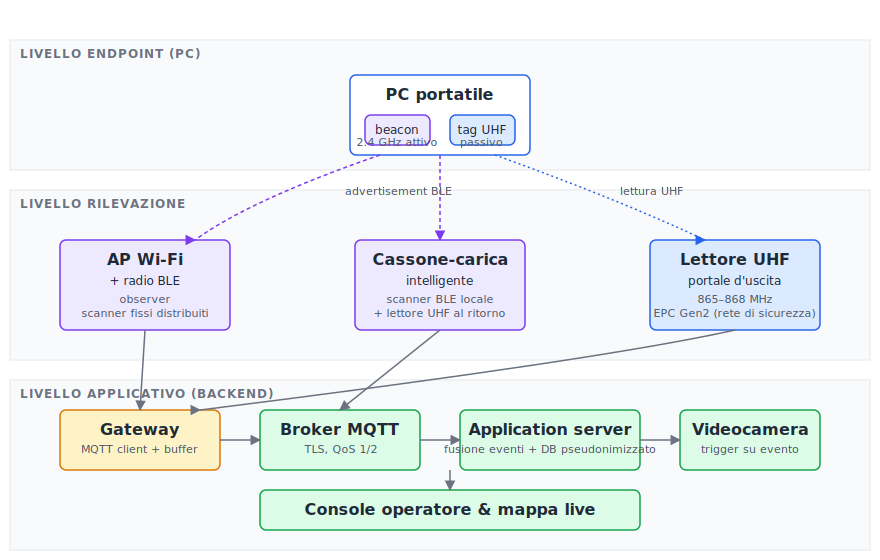
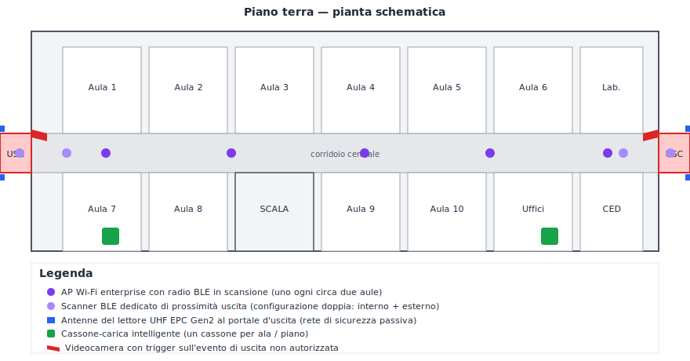
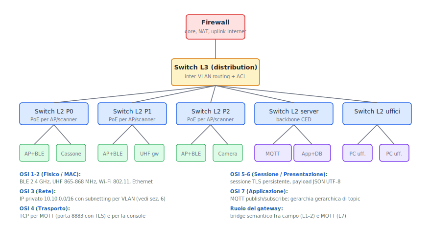
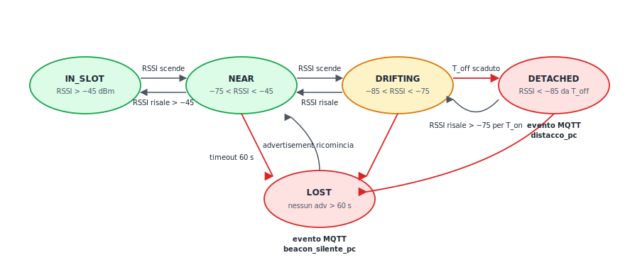
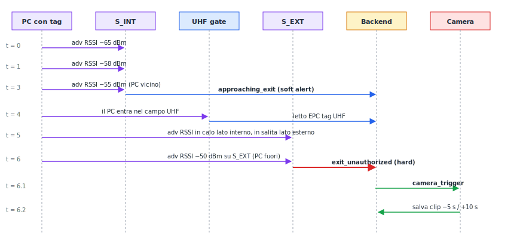

# Chiave di soluzione — Seconda prova
## Scenario C: architettura ibrida a due tag eterogenei

> *Soluzione di riferimento per la commissione. Sviluppa la combinazione di ipotesi più completa fra le tre coerenti previste dalla traccia. Le altre due (UHF passivo puro e BLE attivo puro) si ottengono per riduzione, eliminando uno dei due livelli.*

---

## Premessa metodologica

Il candidato dichiari fin da subito che la propria soluzione adotta una **architettura ibrida a due tag eterogenei**, in cui ogni PC porta contemporaneamente:

- un **dispositivo radio attivo** di tipo *broadcaster non collegabile* nella banda 2.4 GHz, responsabile delle funzioni primarie e continue (tracciamento, distacco, prossimità all'uscita);
- un **tag radio passivo** in banda UHF, responsabile della rete di sicurezza ai varchi e dell'inventario periodico.

L'architettura è giustificata dal principio di *defense in depth*: i due dispositivi hanno modi di guasto ortogonali (batteria vs. campo di interrogazione, rimozione visibile vs. rimozione nascosta) e coprono insieme tutti i casi in cui uno solo dei due sarebbe insufficiente. È un pattern noto anche in altri contesti — biblioteche RFID con codice a barre di scorta, chiavi auto con doppio sistema attivo/meccanico — e qui viene applicato a un asset patrimoniale (il PC portatile della scuola).

---

## 1. Ipotesi aggiuntive dichiarate

**Tracciamento.** Si assume che sia necessario conoscere la posizione del PC **anche quando è fermo in un'aula**, non soltanto al transito dei varchi. La motivazione è che la funzione *F3 — rilevazione di distacco* richiede di sapere in ogni istante se il PC è ancora in prossimità del proprio cassone, e ciò non si può ricavare da una lettura discreta a un varco.

**Dispositivo radio sul PC: soluzione ridondante a due tag eterogenei**, secondo quanto motivato in premessa.

**Infrastruttura Wi-Fi preesistente.** Si assume che la scuola disponga di una rete Wi-Fi enterprise con access point dotati di radio Bluetooth integrata in modalità *observer*, utilizzabili come scanner radio senza costi infrastrutturali aggiuntivi. È un'ipotesi realistica in un istituto di recente cablaggio o riammodernato col PNRR.

**Costo unitario.** Si assume accettabile un costo fino a una decina di euro per dispositivo applicato al PC, considerando che il PC è un cespite del valore di circa cinquecento euro: il costo del dispositivo radio incide quindi per circa il 2% del valore del cespite e si ammortizza sulla sua vita utile (4–6 anni).

**Cassone-carica intelligente.** Si assume che il cassone sia un **dispositivo intelligente** dotato di CPU embedded, alimentazione di rete, modulo radio BLE in modalità *observer*, antenna UHF integrata nello sportello e interfaccia Wi-Fi verso la rete di distribuzione. Questa ipotesi è necessaria perché abilita la regola di *RSSI sotto soglia per N secondi* calcolata localmente, senza interrogare il backend.

**Varco di uscita esterno.** Si assume che il varco esterno sia una **zona di rilevazione con doppia soglia** (di prossimità e di attraversamento) e *trigger* della videocamera basato sull'evoluzione del segnale ricevuto nei secondi precedenti. In sovrapposizione, l'antenna UHF al varco svolge la funzione tradizionale di *gate* hard come secondo livello.

---

## 2. Derivazione dell'architettura

L'architettura risultante si articola su **tre livelli logici**, qui descritti dal più basso al più alto.

**Livello fisico endpoint.** Su ogni PC sono applicati i due dispositivi: il broadcaster 2.4 GHz è incollato sulla scocca in posizione visibile (per facilitare l'eventuale sostituzione della batteria); il tag UHF passivo è applicato in posizione meno evidente — incollato sotto la cover di servizio della memoria, o all'interno di un'etichetta inventariale plastificata — in modo da rappresentare un secondo livello di accesso fisico per chi volesse neutralizzare il sistema.

**Livello di rilevazione.** È costituito da tre famiglie di dispositivi: gli *access point Wi-Fi enterprise* con radio BLE integrata, che fungono da scanner BLE fissi distribuiti su tutto l'edificio; il *modulo BLE in scansione del cassone-carica*, che si comporta da scanner "mobile" specializzato sul tracciamento dei propri PC arruolati; il *lettore UHF fisso integrato nel telaio della porta esterna*, che intercetta i tag passivi al passaggio della soglia. Tutti e tre i tipi di dispositivo trasferiscono i dati grezzi a un *gateway di confine* che li traduce in messaggi MQTT verso il backend.

**Livello applicativo backend.** Su una VLAN server isolata risiedono il *broker MQTT* (cuore della messaggistica), il *server applicativo* che applica la logica di correlazione fra eventi BLE e UHF e implementa la fusione *event_sources*, il *database* delle assegnazioni PC-studente (con cifratura at-rest e pseudonimizzazione), il *sistema di videosorveglianza* che riceve il *trigger* di registrazione associato all'evento di uscita, e la *console operatore* con la mappa in tempo reale dello stato della flotta PC.

Il diagramma seguente mostra l'architettura nel suo insieme:



I tre livelli sono separati anche logicamente: ciascuno parla con quello adiacente attraverso un'interfaccia ben definita, e ciascuno usa una banda di frequenze diversa (2.4 GHz per BLE, 868 MHz per UHF, sopra 2.4 GHz per la portante Wi-Fi). Questa separazione garantisce che un guasto a un livello non si propaghi al successivo se non come degrado funzionale gestito (es. il backend continua a vedere gli eventi UHF anche se l'intero strato BLE è offline).

---

## 3. Tecnologie e standard

**Beacon attivo 2.4 GHz sul PC.** Si tratta di un dispositivo radio nel ruolo GAP di *broadcaster non collegabile*, che emette periodicamente un *advertisement* contenente il proprio identificativo logico (UUID di servizio più *minor* del PC) e il valore di *TxPower* dichiarato. L'autonomia tipica su batteria a bottone è di 2–5 anni, in funzione della cadenza di advertisement (qui fissata a 1 advertisement ogni 500 ms come compromesso fra reattività e consumo). La stima della distanza relativa si ottiene dal confronto fra l'**RSSI** misurato dallo scanner e il **TxPower** dichiarato dal beacon, secondo la classica formula logaritmica di attenuazione in spazio libero, calibrata empiricamente per l'ambiente specifico in fase di sopralluogo. L'**anticollisione** sul canale è gestita probabilisticamente dal protocollo di accesso (l'advertisement viene trasmesso su tre canali distinti del piano radio, e gli scanner sentono ciascun beacon con un intervallo medio di poche centinaia di millisecondi).

**Tag passivo UHF EPC Gen2.** Standard internazionale ISO/IEC 18000-63, banda europea ETSI EN 302 208 (865–868 MHz, 15 canali da 200 kHz, potenza limite 2 W ERP per le applicazioni di etichettatura). Il tag non ha alimentazione propria: si attiva solo quando entra nel campo emesso dal reader, ricavandone l'energia. Sul portatile, che è una superficie metallica disturbante per il *far-field*, è essenziale impiegare un tag in versione *on-metal*, con substrato isolante che disaccoppia il piano di terra dell'antenna del tag dalla scocca del PC. L'anticollisione è gestita dal protocollo **slotted ALOHA / Q-protocol** previsto dallo standard, che consente al reader di leggere parecchie centinaia di tag al secondo — capacità del tutto sovradimensionata per il singolo passaggio al varco di uno studente con un PC, ma utile durante l'inventario annuale a colpo di handheld lungo i corridoi.

**Lettore UHF al varco.** Posto in configurazione *gantry* sulla porta esterna, con due antenne a polarizzazione circolare disposte a quinconce per minimizzare i punti ciechi. Portata configurata a circa 3 m per evitare letture spurie di tag presenti nei locali adiacenti.

**Access point Wi-Fi enterprise con BLE.** Standard Wi-Fi della famiglia 802.11 (in particolare 802.11ax o 802.11n a banda 2.4 GHz / 5 GHz per la rete dati) e radio BLE in modalità *observer* per la scansione. La coesistenza Wi-Fi/BLE sulla stessa banda 2.4 GHz è gestita dal *time-sharing* del modulo radio dell'access point e non comporta perdita apprezzabile né di banda Wi-Fi né di sensibilità di scansione. Il rapporto di rilevazioni BLE viene inviato dal controller della rete Wi-Fi al gateway secondo un protocollo proprietario (modellabile, sul nostro stack, come una semplice pubblicazione MQTT sul topic delle rilevazioni grezze).

**Cassone-carica intelligente.** Embedded multi-radio: BLE in scansione continua, antenna UHF integrata nello sportello con polling a bassa potenza (~50 cm di portata) per registrare la restituzione del singolo PC nello slot, Wi-Fi client per la connettività di management e di pubblicazione MQTT. La CPU embedded esegue localmente la macchina a stati del distacco (vedi quesito I) senza dover interrogare il backend.

**Broker MQTT.** Implementato on-premise sulla VLAN server. TLS lato client con certificati X.509 individuali per ciascun cassone e gateway, in modo che il broker possa autenticare la sorgente di ogni messaggio e rifiutare *injection* da dispositivi non legittimi. I client di sola lettura (dashboard operatore, sistemi di analisi) si autenticano con coppie username/password e accesso ai soli topic permessi.

---

## 4. Planimetria di massima

La scuola si articola su tre piani serviti da un'unica scala centrale e con un'uscita esterna principale al piano terra (lato ovest) e un'uscita di servizio (lato est). Per semplicità di rappresentazione il diagramma mostra il piano terra in dettaglio e indica nella legenda la replica dei pattern ai piani superiori.



Lo schema di posizionamento risponde a tre vincoli simultanei. Gli **AP Wi-Fi con radio BLE** sono installati nel corridoio a circa otto metri uno dall'altro, in modo che ogni punto del corridoio sia udibile da almeno tre AP (condizione necessaria per la trilaterazione via RSSI). Il **doppio scanner BLE** al varco (uno interno a circa cinque metri dalla soglia, uno esterno subito fuori) realizza la doppia soglia di prossimità e di attraversamento richiesta dal quesito II. Il **lettore UHF** al varco di uscita è installato in posizione *gantry* sulla soglia e funge da rete di sicurezza per i tag passivi. I **cassoni-carica** sono posizionati nei locali di servizio agli estremi del corridoio, alimentati a rete elettrica e collegati alla rete dati via Wi-Fi.

---

## 5. Schema logico di rete

La rete è organizzata su tre piani gerarchici: *access*, *distribution* e *core*. L'access è formato da una decina di switch Layer 2 distribuiti ai piani, ciascuno con porte PoE per gli AP Wi-Fi e per gli apparati di campo. Lo strato distribution è realizzato da un singolo switch Layer 3 nel CED, che esegue l'inter-VLAN routing e applica le ACL fra VLAN diverse. Il core è il firewall verso Internet, che svolge anche da uplink per la sede.



Il **gateway di confine** è l'unico apparato a essere realmente *full-stack*: a sinistra parla con la rete di campo nei rispettivi protocolli nativi (advertisement BLE, lettura EPC Gen2 sul reader UHF, query LLRP al portale); a destra pubblica via MQTT su TCP/TLS verso il broker. È quindi il punto di traduzione semantica: trasforma eventi grezzi (un advertisement BLE è un blocco binario di pochi byte) in oggetti applicativi JSON ben strutturati.

---

## 6. Piano di indirizzamento IP

Si parte dal blocco privato `10.10.0.0/16`, sufficientemente ampio da contenere comodamente sette VLAN funzionali con margine di crescita.

| VLAN | Nome | Subnet | Maschera | Host utili | Funzione |
|------|------|--------|----------|------------|----------|
| 10 | management | 10.10.10.0/24 | 255.255.255.0 | 254 | management degli apparati di rete |
| 20 | server | 10.10.20.0/24 | 255.255.255.0 | 254 | broker MQTT, application server, DB |
| 30 | wifi-didattica | 10.10.30.0/23 | 255.255.254.0 | 510 | smartphone studenti, PC in prestito |
| 40 | wifi-uffici | 10.10.40.0/24 | 255.255.255.0 | 254 | PC e telefoni VoIP del personale |
| 50 | campo-cassoni | 10.10.50.0/24 | 255.255.255.0 | 254 | indirizzi statici dei cassoni-carica |
| 60 | campo-gateway | 10.10.60.0/24 | 255.255.255.0 | 254 | gateway UHF + controller AP-BLE |
| 70 | palmari | 10.10.70.0/24 | 255.255.255.0 | 254 | reader handheld personale e palmari operatori |

**Routing.** Tutto inter-VLAN tramite lo switch L3 del CED. Si adotta **routing statico** perché la topologia è piccola, completamente sotto il controllo dell'amministratore di rete e non è prevista alcuna ridondanza di percorso che giustifichi protocolli dinamici come OSPF o RIPv2. Una sola rotta di default verso il firewall per l'uscita Internet.

**ACL fondamentali.** Sul L3 di distribuzione si configurano le seguenti regole, tutte di tipo *deny-by-default* con eccezioni esplicite:
- la VLAN 50 (cassoni) può raggiungere solo `10.10.20.0/24` sulla porta TCP 8883 (MQTT/TLS); ogni altro traffico verso server o uffici è negato;
- la VLAN 60 (gateway) ha le stesse regole della 50;
- la VLAN 30 (wifi didattica) **non può raggiungere** né la 20 (server) né la 50/60 (campo), garantendo che gli smartphone degli studenti non vedano l'infrastruttura;
- la VLAN 40 (uffici) può raggiungere la 20 (server) per la console operatore;
- la VLAN 70 (palmari) può raggiungere la 20 (server) solo su MQTT/TLS e HTTPS.

---

## 7. Quesito I — Rilevazione di distacco PC ↔ cassone

**Dove viene eseguito il calcolo.** Coerentemente con l'ipotesi del cassone intelligente, il calcolo del distacco è eseguito **localmente sul cassone**: è infatti l'unico nodo del sistema che sente direttamente, con la propria radio BLE in scansione, l'evoluzione del segnale dei beacon dei propri PC arruolati. Far transitare le rilevazioni grezze a un server centrale per poi farsele rispondere significherebbe introdurre latenza, dipendenza dalla rete e un single point of failure non necessario.

**Parametro fisico misurato.** L'RSSI del beacon BLE del singolo PC, misurato a ogni advertisement (cioè con cadenza media di 500 ms). Per attenuare il *fading* a breve termine, il cassone non usa il valore istantaneo ma una **media mobile su finestra di 5 secondi** (circa dieci campioni).

**Soglie e relativa interpretazione fisica.** Calibrate empiricamente in fase di sopralluogo della singola scuola, qui assunte come segue:
- `RSSI_in_slot = −45 dBm` (≈ 50 cm): il PC è considerato fisicamente *nel cassone*;
- `RSSI_vicino = −75 dBm` (≈ 5 m): il PC è nella stessa aula del cassone;
- `RSSI_lontano = −85 dBm` (≈ 10 m): il PC è probabilmente in un'altra aula o in corridoio.

**Isteresi temporale.** Per impedire che fluttuazioni istantanee del segnale (qualcuno passa fra cassone e PC, riflessioni multipath, attivazione della Wi-Fi 5 GHz del PC che disturba la 2.4) producano falsi allarmi, si introducono due isteresi:
- per dichiarare lo stato `DETACHED` serve `RSSI_medio < RSSI_lontano` per almeno `T_off = 30 s` consecutivi;
- per uscire da `DETACHED` e tornare a `NEAR` serve `RSSI_medio > RSSI_vicino` per almeno `T_on = 10 s`.

**Macchina a stati.** Cinque stati per ciascun PC arruolato.



Lo stato `LOST` è distinto da `DETACHED` perché segnala una **possibile anomalia del livello primario**: il beacon non emette più advertisement da oltre un minuto. Se in questo stato il tag UHF passivo del PC viene successivamente letto dal portale dell'uscita, il backend produce un evento composto `beacon_silente + lettura_uhf_uscita` che è una sospetta manomissione e va trattata con priorità massima.

**Messaggio JSON dell'evento di distacco.** Pubblicato sul topic `scuola/galilei/cassoni/CAS-03/eventi/distacco` con QoS 1.

```json
{
  "evento": "distacco_pc",
  "timestamp": "2026-05-30T10:14:22Z",
  "cassone_id": "CAS-03",
  "pc_id": "PC-017",
  "transizione": { "da": "DRIFTING", "a": "DETACHED" },
  "rssi": {
    "corrente_dbm": -91,
    "medio_30s_dbm": -88,
    "tempo_sotto_soglia_s": 32
  },
  "registro": {
    "ultima_restituzione": "2026-05-30T09:42:11Z",
    "studente_assegnato": "stud-pseudo-7f3a"
  }
}
```

---

## 8. Quesito II — Doppia rilevazione al varco di uscita

**Disposizione fisica (coerente con H6b).** Il varco esterno è equipaggiato con **due scanner BLE indipendenti**: il primo (`S_INT`) è installato sul soffitto del corridoio a circa cinque metri dalla soglia, orientato verso l'interno; il secondo (`S_EXT`) è installato all'esterno, immediatamente fuori dalla porta, orientato verso la zona di marciapiede prospiciente l'ingresso. In sovrapposizione a essi opera il **portale UHF passivo**, integrato nel telaio della porta, con due antenne a polarizzazione circolare disposte ai due lati. La **videocamera** è posta sopra la porta, lato interno, e ha un *rolling buffer* persistente di trenta secondi che le permette di salvare la registrazione retroattivamente di cinque secondi precedenti al trigger.

**Soglie e finestre temporali.**
- *Soft alert (approccio):* `RSSI_S_INT > −60 dBm` per almeno 3 s consecutivi → evento `approaching_exit`. Significa che il PC è entro circa due metri dallo scanner interno. È solo una notifica al pannello operatore e al cassone-titolare del PC, che verifica nei propri registri se è prevista una restituzione regolare.
- *Hard alert (attraversamento):* tre condizioni in AND da soddisfare entro una finestra di 5 s — `RSSI_S_EXT > −55 dBm` per almeno 2 s, trend di `RSSI_S_INT` strettamente decrescente nei 5 s precedenti, e assenza di un'autorizzazione esplicita nel registro. Quando si verificano tutte e tre, viene generato l'evento `exit_unauthorized` e contemporaneamente il *trigger* sulla videocamera.

**Sequence diagram.** L'evoluzione tipica dell'evento corrisponde al diagramma seguente.



**Anti-falsi positivi.** Lo schema descritto sopra è robusto a quattro classi tipiche di falso positivo. Lo *studente che si avvicina alla porta ma non esce* (es. saluto a un compagno fuori) genera al massimo un `approaching_exit` ma non un `exit_unauthorized`, perché S_EXT non legge mai un RSSI sopra soglia. Il *PC riportato regolarmente alla segreteria* è marcato in restituzione nel registro e l'evento viene scartato all'arbitraggio finale del backend. Le *riflessioni multipath* sono filtrate dalla finestra di 2 s su S_EXT (un picco istantaneo non basta). Lo *studente in transito sulla soglia che torna indietro* viene riconosciuto perché il trend di RSSI su S_EXT non resta sopra soglia per i 2 s richiesti.

**Rete di sicurezza UHF.** Indipendentemente dal sotto-evento BLE, se il portale UHF legge l'EPC del tag passivo del PC, viene generato un evento `exit_uhf`. Il backend fonde i due eventi BLE/UHF in un unico `evento_uscita` con campo `sources`. Tre casi:
- *sources = [BLE, UHF]* — situazione tipica, evento confermato da entrambi i canali, massima affidabilità;
- *sources = [BLE]* — il tag UHF non è stato letto (tag danneggiato, schermatura del PC); l'evento è comunque preso seriamente;
- *sources = [UHF]* — il beacon BLE non si è fatto sentire; oltre a `exit_unauthorized` viene generato anche un `beacon_silente_pc` di alta priorità, perché sospetto di manomissione.

**Caso H6a (portale hard tradizionale)**. Se il candidato avesse scelto il portale hard, dovrebbe rinunciare al *soft alert* di prossimità — il gate sa solo "tag rilevato/non rilevato" — e implementare la "doppia logica" via software, ad esempio simulando un *soft alert* attraverso lo scanner BLE dei cassoni che notano il PC che si avvia verso l'uscita. La videocamera viene attivata direttamente dall'evento hard del gate.

---

## 9. Quesito III — Topic MQTT, JSON e pseudocodice del gateway

**Gerarchia dei topic.** Cinque livelli per garantire filtraggio efficace lato subscriber e leggibilità del sistema. Lo schema generale è:

```
scuola / <istituto> / <area> / <classe_dispositivo|funzione> / <id_specifico> / <tipo_evento>
```

Esempi concreti:

| Topic | Cosa pubblica |
|-------|---------------|
| `scuola/galilei/p0-ovest/usc/eventi` | eventi (prossimità, uscita) del varco ovest piano 0 |
| `scuola/galilei/cassoni/CAS-03/eventi/restituzione` | F1 — restituzione di un PC al cassone 03 |
| `scuola/galilei/cassoni/CAS-03/eventi/distacco` | F3 — allerta di distacco dal cassone 03 |
| `scuola/galilei/scanners/AP-3F-12/rilevazioni` | F2 — rilevazioni BLE grezze dello scanner integrato nell'AP 3F-12 |
| `scuola/galilei/uhf/USC-OVEST/letture` | letture UHF al portale ovest |
| `scuola/galilei/_sys/anomalie` | anomalie di sistema (beacon silente, gateway down, ecc.) |

**Quality of Service.** QoS 0 (*at-most-once*) per le rilevazioni grezze, ad alta frequenza, di cui la perdita di qualche campione è tollerabile; QoS 1 (*at-least-once*) per gli eventi applicativi di interesse (restituzione, distacco, prossimità); QoS 2 (*exactly-once*) per gli eventi di sicurezza critici (`exit_unauthorized`, anomalie) per i quali la duplicazione è inaccettabile (genererebbe doppi allarmi al pannello operatore).

**JSON di F1 — restituzione al cassone.** Generato dal cassone quando l'antenna UHF nel proprio sportello legge il tag passivo del PC in un determinato slot, confermato dall'RSSI del beacon BLE sopra la soglia `RSSI_in_slot`.

```json
{
  "evento": "restituzione_pc",
  "timestamp": "2026-05-30T15:48:11Z",
  "cassone_id": "CAS-03",
  "slot": 4,
  "pc_id": "PC-017",
  "conferma_doppia": { "ble_rssi_dbm": -42, "uhf_epc_letto": true },
  "studente_titolare": "stud-pseudo-7f3a",
  "durata_prestito_min": 47
}
```

**JSON di F3 — distacco.** Già mostrato al quesito I.

**JSON di F5 — evento di uscita non autorizzata.** Pubblicato sul topic dell'area uscita con QoS 2. È l'evento che incorpora la fusione fra canale BLE e canale UHF.

```json
{
  "evento": "exit_unauthorized",
  "timestamp": "2026-05-30T13:45:01Z",
  "varco_id": "USC-OVEST",
  "pc_id": "PC-017",
  "sources": ["BLE", "UHF"],
  "ble": {
    "scanner_interno": "S_INT_USC_OVEST",
    "scanner_esterno": "S_EXT_USC_OVEST",
    "rssi_int_trend_dbm": [-58, -62, -68, -75, -82],
    "rssi_ext_max_dbm": -48,
    "tempo_oltre_soglia_ext_s": 2.3
  },
  "uhf": {
    "antenna_id": "UHF_USC_OVEST_A1",
    "epc": "303035303530303030303031372E",
    "rssi_dbm": -62
  },
  "videocamera": {
    "id": "CAM_USC_OVEST",
    "trigger_t": "2026-05-30T13:45:01Z",
    "buffer_pre_s": 5,
    "buffer_post_s": 10,
    "clip_filename": "evt_20260530_134501_PC017.mp4",
    "keyframe_filename": "evt_20260530_134501_PC017.jpg"
  },
  "registro": {
    "studente_titolare": "stud-pseudo-7f3a",
    "autorizzazione_uscita": null
  }
}
```

**Pseudocodice del gateway** (logica residente sul cassone-carica, scenario C). Si articola in tre thread paralleli più funzioni di servizio.

```
// === Stato del cassone ===
registro_pc[]          // lista di PC arruolati con il loro stato corrente
buffer_eventi[]        // coda eventi da pubblicare
mqtt_connesso = false

// === Inizializzazione ===
all'avvio del cassone:
    carica registro_pc[] dalla memoria persistente
    apri sessione TLS verso il broker MQTT
    avvia thread T1: scansione_ble
    avvia thread T2: valutatore_stati
    avvia thread T3: pubblicatore_mqtt

// === Thread T1: scansione BLE continua (non bloccante) ===
funzione scansione_ble:
    loop perenne:
        adv = leggi_prossimo_advertisement_ble()
        se adv.id_beacon è in registro_pc:
            aggiorna_campione_rssi(adv.id_beacon, adv.rssi, ora_corrente())

// === Thread T2: valutazione stati ogni 1 secondo ===
funzione valutatore_stati:
    loop perenne ogni 1 s:
        per ogni pc in registro_pc:
            rssi_med = media_mobile_rssi(pc, finestra=5s)
            eta_ultima = ora_corrente() - pc.timestamp_ultima_rilevazione

            se eta_ultima > 60 s:
                se pc.stato ≠ "LOST":
                    transizione(pc, "LOST")
                    accoda_evento("beacon_silente_pc", pc)

            altrimenti se rssi_med > RSSI_IN_SLOT:
                se pc.stato ≠ "IN_SLOT":
                    transizione(pc, "IN_SLOT")
                    se pc.stato_precedente in {"NEAR","DRIFTING","DETACHED"}:
                        accoda_evento("restituzione_pc", pc)

            altrimenti se rssi_med > RSSI_VICINO:
                se pc.stato == "DETACHED" e pc.tempo_sopra_soglia < T_ON:
                    rimani in "DETACHED"
                altrimenti:
                    transizione(pc, "NEAR")

            altrimenti se rssi_med > RSSI_LONTANO:
                transizione(pc, "DRIFTING")

            altrimenti:  // rssi_med < RSSI_LONTANO
                se pc.stato == "DETACHED":
                    rimani in "DETACHED"
                altrimenti se pc.tempo_sotto_soglia > T_OFF:
                    transizione(pc, "DETACHED")
                    accoda_evento("distacco_pc", pc)
                altrimenti:
                    transizione(pc, "DRIFTING")

// === Thread T3: pubblicazione MQTT con buffering ===
funzione pubblicatore_mqtt:
    loop perenne:
        se non mqtt_connesso:
            tenta riconnessione TLS al broker
            se fallisce: aspetta 5 s ; continua
        se buffer_eventi non vuoto:
            evento = buffer_eventi.testa()
            esito = mqtt.pubblica(evento.topic, evento.payload, qos=evento.qos)
            se esito ok:
                buffer_eventi.estrai_testa()
            altrimenti:
                mqtt_connesso = false   // riconnetterà al prossimo giro
        aspetta 100 ms

// === Servizio: transizione di stato con deduplica ===
funzione transizione(pc, nuovo_stato):
    se pc.stato == nuovo_stato:
        ritorna   // nessun cambiamento, nessuna pubblicazione
    pc.stato_precedente = pc.stato
    pc.stato = nuovo_stato
    pc.timestamp_transizione = ora_corrente()
    aggiorna_contatori(pc)

// === Servizio: accodamento eventi ===
funzione accoda_evento(tipo, pc):
    payload = costruisci_json(tipo, pc, ora_corrente())
    topic   = costruisci_topic(tipo, pc)
    qos     = mappa_qos[tipo]    // 1 per applicativi, 2 per critici
    buffer_eventi.accoda({topic, payload, qos})
```

Il **buffering** è la garanzia di resilienza: se il Wi-Fi è temporaneamente caduto, gli eventi rimangono in coda nel cassone fino al ripristino, senza perdita. Il **deduplicatore** integrato in `transizione()` impedisce che fluttuazioni di RSSI sulla frontiera di una soglia (un campione sopra, uno sotto, uno sopra ancora) producano una cascata di messaggi inutili.

---

## 10. Quesito IV — Sicurezza e privacy

**Le due famiglie di dati trattate.** Vanno distinte fin dal disegno.

I **dati patrimoniali** (identificativo del PC, sua posizione attuale, suo storico di spostamenti come asset) sono dati che la scuola tratta in qualità di proprietaria del bene, ai fini di sicurezza patrimoniale e gestione dell'inventario. Non sono in sé dati personali e non ricadono nel GDPR. La base giuridica è il legittimo interesse della scuola e l'adempimento del compito di pubblico interesse di custodia dei beni dell'istituto.

I **dati indirettamente personali** si producono nel momento in cui il PC viene assegnato a uno studente nel registro dei prelievi: la coppia `(PC_id, studente_id)` lega gli spostamenti del PC agli spostamenti dello studente che lo porta con sé. Questo è un dato personale relativo a un minore e ricade pienamente nel GDPR. Il principio di proporzionalità del controllo a distanza, ricavato dall'art. 4 dello Statuto dei lavoratori, è richiamato per analogia anche se gli studenti non sono lavoratori in senso tecnico.

**Contromisure tecniche.**

*Segmentazione di rete.* L'apparato di campo (cassoni, scanner, gateway UHF) sta sulle VLAN 50, 60 e non vede il database degli studenti né le reti d'utenza. Gli apparati di campo possono *pubblicare* eventi su MQTT verso il broker, ma non possono leggere il DB del registro dei prestiti, che risiede sulla VLAN server 20 ed è accessibile solo all'application server.

*Autenticazione mutua TLS* fra cassoni/gateway e broker MQTT. Ogni cassone ha un proprio certificato X.509 individuale; il broker verifica la firma a ogni connessione e applica policy di pubblicazione granulari: il cassone `CAS-03` può pubblicare solo sui topic che iniziano per `scuola/galilei/cassoni/CAS-03/`. Questo impedisce a un dispositivo rogue (un finto cassone) di iniettare eventi falsi nel sistema.

*Pseudonimizzazione del registro prestiti.* Nel DB applicativo lo studente non è identificato per nome o codice fiscale, ma per un identificativo pseudonimo derivato dal codice fiscale tramite una funzione hash crittografica con *salt* segreto custodito separatamente. La corrispondenza pseudonimo → identità reale è mantenuta in un secondo DB (segreteria), su una rete diversa, accessibile solo al personale autorizzato.

*Minimizzazione dei messaggi MQTT.* Nessun messaggio sul broker contiene il nome dello studente: trasporta solo il `pc_id` e, quando proprio necessario, lo pseudonimo `stud-pseudo-7f3a`. L'arricchimento con i dati anagrafici avviene solo al backend, e solo a fronte di un evento di sicurezza che richieda investigazione (es. `exit_unauthorized`).

*Rotating identifier per i beacon BLE.* Affinché un osservatore esterno alla scuola, dotato di un comune smartphone con Bluetooth, non possa tracciare i PC stando sul piazzale, i beacon utilizzano uno schema di identificativi rotanti del tipo Eddystone-EID (rotating ephemeral identifier) o iBeacon con rolling minor. Solo i dispositivi della scuola, dotati della chiave simmetrica, riescono a risolvere l'identificativo effimero in `pc_id` reale.

*Cifratura at-rest* del DB dei prestiti e dei log di sistema. Backup cifrati con chiavi gestite separatamente dai sistemi di produzione.

**Retention.** Le rilevazioni grezze di posizione (RSSI individuali, stati istantanei della macchina a stati) si conservano 30 giorni nel formato originale, dopo i quali sono aggregate statisticamente e anonimizzate. Gli eventi applicativi (restituzioni, distacchi) si conservano per l'anno scolastico più uno (~22 mesi). Gli eventi di sicurezza con clip video associata si conservano 6 mesi salvo che un'indagine giudiziaria ne richieda la conservazione più lunga.

**Adempimenti GDPR.**

*Informativa* preventiva consegnata a studenti e famiglie all'atto dell'iscrizione, completa di: finalità del trattamento (sicurezza del patrimonio scolastico, gestione del prestito dei PC), base giuridica (legittimo interesse e adempimento di compito di pubblico interesse), categorie di dati trattati, periodi di conservazione, diritti dell'interessato (accesso, rettifica, cancellazione, opposizione), contatti del DPO.

*Valutazione di impatto sulla protezione dei dati* (DPIA, art. 35 GDPR), obbligatoria poiché il trattamento è sistematico e riguarda soggetti vulnerabili (minori).

*Diritto di opposizione.* Lo studente o il genitore può chiedere di non aderire al sistema di prestito; in tal caso non riceve PC ma non può opporsi al tracciamento dei PC come asset patrimoniali (perché non lo riguarda direttamente).

*Ruolo del Responsabile della Protezione dei Dati (DPO).* Validazione del sistema in fase progettuale; revisione annuale dell'efficacia delle contromisure; punto di contatto per gli esercizi dei diritti dell'interessato; supporto al titolare (il dirigente scolastico) per la gestione di eventuali violazioni e notifiche al Garante entro 72 ore.

**Vincolo derivato dallo Statuto dei lavoratori.** Sebbene applicabile per analogia, il principio dell'art. 4 va dichiarato esplicitamente nel regolamento d'istituto: il sistema **non può essere utilizzato per valutare il comportamento o il rendimento dello studente**, ma esclusivamente per la finalità dichiarata di tutela del patrimonio e di gestione del prestito. La policy di accesso al sistema riflette questa scelta: i docenti non hanno accesso alla mappa live degli spostamenti dei PC; solo il personale di sorveglianza e la dirigenza vi accedono, e solo per attività investigativa successiva a un evento di sicurezza.

---

# Appendici — varianti minori dello Scenario C

> *Le due varianti seguenti rappresentano combinazioni di ipotesi diverse, entrambe coerenti, entrambe meritevoli di punteggio se ben argomentate, ma con un funzionamento sensibilmente più povero rispetto alla soluzione ibrida principale. Si descrivono per il confronto: ciò che vale di simile rispetto allo Scenario C non viene ripetuto e si rinvia alle sezioni 1–10.*

## Appendice A — Variante "UHF passivo a portali"

### A.1 Ipotesi caratterizzanti

Questa variante adotta la combinazione **H1(a), H2(a), H4(a), H6(a)** con ipotesi neutre su H3 (irrilevante: non si usa BLE quindi la presenza di Wi-Fi BLE-capable è indifferente) e H5(a) (cassone "muto"). Il candidato che la sceglie dichiara esplicitamente che gli **basta sapere quando il PC transita dai varchi**, che vuole **costi unitari minimi** sul singolo tag (pochi centesimi), e che accetta in cambio una notevole **rinuncia funzionale** rispetto a quanto la traccia consente.

### A.2 Architettura derivata

L'intero sistema poggia sul **solo tag passivo UHF** (EPC Gen2, banda 865–868 MHz, *on-metal*) applicato a ciascun PC. I lettori sono fissi a varco: uno per piano sull'accesso al corridoio, lettori dedicati all'ingresso delle aule più sensibili (laboratorio di informatica, palestra) e un **portale di tipo *hard*** al varco esterno con allarme istantaneo e trigger della videocamera. Il cassone-carica ospita un'antenna UHF integrata nello sportello che legge in massa i PC presenti all'apertura e alla chiusura. **Non esistono dispositivi BLE**: la rete Wi-Fi resta dedicata alle funzioni didattiche e non porta carico di scansione radio. Il gateway raccoglie le letture EPC e le pubblica via MQTT verso il backend, che applica la logica applicativa per ricavare gli eventi semantici (transito anomalo, uscita non autorizzata).

### A.3 Funzioni: cosa resta, cosa cade

- **F1 — registrazione prelievo/restituzione:** *implementata* dall'antenna UHF integrata nello sportello del cassone, con scansione massiva all'apertura e alla chiusura. Granularità: cassone (non slot specifico).
- **F2 — posizione del cassone:** *non implementata.* Il cassone non porta un tag tracciato; si rinuncia perché in pratica si sposta poco.
- **F3 — rilevazione di distacco PC↔cassone:** *non implementata nella forma originale.* Si degrada a evento discreto: il portale di piano segnala se un PC passa fuori dall'orario previsto, ma non c'è la nozione di "distanza dal cassone".
- **F4 — allerta *soft* di prossimità all'uscita:** *non implementata* nella forma originale. Si può simulare con un secondo portale UHF nel corridoio a qualche metro dalla porta, che funge da pre-allarme sulla console operatore.
- **F5 — evento di uscita + videocamera:** *implementata* nel modo classico antitaccheggio retail — portale *hard* al varco + trigger istantaneo della videocamera.
- **F6 — ricerca del PC dimenticato:** *implementata* via reader handheld UHF in modalità "Geiger" lungo i corridoi (è la stessa funzione che nello Scenario C costituiva la rete di sicurezza, qui promossa a funzione primaria).

### A.4 Quesiti — risposte sintetiche

**Quesito I.** Il "distacco" si riduce a un evento di transito non autorizzato dal varco di piano. L'algoritmo risiede interamente al backend: a ogni lettura EPC, il server applicativo verifica se il PC è nel registro dei prestiti autorizzati per l'orario corrente; in caso negativo emette un evento `transito_anomalo`. Nessun calcolo locale, nessun RSSI, nessuna isteresi temporale: solo lookup discreto in un database. La latenza è dell'ordine dei secondi e la granularità è quella del varco di piano, non del cassone.

**Quesito II.** Doppia rilevazione realizzata con due portali UHF in serie: il primo a circa tre metri dentro il corridoio (*soft alert*), il secondo sulla soglia esterna (*hard alert* + trigger camera). La criticità intrinseca è che un tag UHF non porta informazione di traiettoria: il portale interno spara comunque, anche se lo studente torna indietro. I falsi positivi sono parte del prezzo da pagare per la semplicità della tecnologia.

**Quesito III.** Topic MQTT e payload JSON molto più semplici: una sola classe di sorgente (lettore UHF), una sola classe di evento di campo (`lettura_portale`). È il backend a derivare semanticamente gli eventi applicativi (transito anomalo, uscita non autorizzata) tramite arricchimento successivo contro il registro dei prestiti. Il gateway esegue un ciclo che legge dal reader, filtra i duplicati entro due secondi, pubblica su MQTT e mantiene il buffer locale in caso di interruzione della rete.

**Quesito IV.** Privacy notevolmente semplificata. Poiché non esiste tracciamento continuo, non c'è dato di posizione continua di natura potenzialmente personale: restano solo gli eventi discreti di transito ai varchi, di per sé patrimoniali. Il richiamo allo Statuto dei lavoratori (per analogia agli studenti) è meno cogente. Restano la cifratura del registro studente-PC, la pseudonimizzazione e il ruolo del DPO, ma la DPIA risulta più snella perché il volume e la sensibilità del trattamento sono inferiori.

---

## Appendice B — Variante "BLE attivo puro"

### B.1 Ipotesi caratterizzanti

Combinazione **H1(b), H2(b), H3(b), H4(b), H5(b), H6(b)**. È identica a quella dello Scenario C tranne che per **H2**: qui il dispositivo radio sul PC è **soltanto** il beacon attivo, senza il tag UHF passivo di backup. La scelta è coerente per chi privilegia la **semplicità di un'unica tecnologia** rispetto alla resilienza ridondante della soluzione a due tag eterogenei.

### B.2 Architettura derivata

Identica a quella dello Scenario C descritta alla sezione 2, **rimuovendo interamente lo strato UHF**: niente tag passivo sul PC, niente antenna UHF integrata nello sportello del cassone, niente portale UHF al varco di uscita. Restano tutte le radio BLE già presenti (sui PC come beacon, sui cassoni e sugli AP come scanner, ai varchi come scanner di prossimità) e il backend resta invariato. Nel diagramma di architettura della sezione 2 si può immaginare di depennare i blocchi e le frecce relative al canale UHF.

### B.3 Funzioni: tutte presenti, una è esposta

Tutte e sei le funzioni F1–F6 sono implementate **esattamente come nello Scenario C** sul canale BLE; la registrazione di restituzione al cassone (F1) si appoggia all'RSSI del beacon che sale sopra la soglia di slot. La differenza essenziale è di **resilienza**: se il beacon BLE di un PC viene rimosso, danneggiato o ha la batteria scarica, il PC diventa **invisibile al sistema**. Nello Scenario C il tag UHF passivo intercettava comunque il PC al varco esterno; qui non c'è secondo livello, e l'unica difesa è l'evento `beacon_silente` (stato `LOST` della macchina a stati) che si attiva dopo 60 secondi di silenzio. Una rimozione effettuata già fuori dall'edificio non è rilevabile in tempo utile.

### B.4 Quesiti — risposte sintetiche

**Quesito I.** Identico allo Scenario C, sezione 7. Stessa macchina a stati, stesse soglie RSSI, stessa isteresi temporale, stesso payload JSON.

**Quesito II.** Identica disposizione fisica del doppio scanner BLE descritta alla sezione 8, ma il blocco "rete di sicurezza UHF" e l'analisi delle tre combinazioni `sources` vengono meno: il campo `sources` nel JSON dell'evento di uscita contiene sempre e solo `["BLE"]`. Sparisce conseguentemente la classe di evento composto `beacon_silente + lettura_uhf_uscita` di alta priorità, che nello Scenario C costituiva il segnale forte di sospetta manomissione.

**Quesito III.** Topic MQTT e payload JSON identici a quelli dello Scenario C, eccetto che i topic della famiglia `scuola/galilei/uhf/*` non esistono e il campo `uhf` nel JSON dell'evento di uscita è sempre assente. Lo pseudocodice del gateway è identico.

**Quesito IV.** Identica analisi GDPR e identiche contromisure rispetto allo Scenario C. Un solo dettaglio cambia: l'assenza dello strato UHF passivo elimina un piccolo vettore di rischio di *eavesdropping* a media distanza (un reader UHF non autorizzato a trenta-cinquanta metri con antenna ad alto guadagno può, in teoria, sentire i tag passivi al varco). In compenso si introduce il rischio di "scomparsa silenziosa" del PC dal sistema in caso di guasto del beacon. Dal punto di vista del titolare del trattamento questo è un rischio operativo, non un rischio privacy, ma va comunque indicato nella DPIA come ipotesi di funzionamento degradato del sistema.

---

## Tabella di sintesi delle tre soluzioni

| Aspetto | Variante A (UHF puro) | Variante B (BLE puro) | Scenario C (ibrido) |
|---|---|---|---|
| Costo radio per PC | < 1 € | 5–10 € | 5–11 € |
| Granularità di posizione | Solo al transito dei varchi | Continua, di zona/aula | Continua + varchi |
| Latenza di un'allerta di distacco | Discreta, solo al varco | Pochi secondi | Pochi secondi |
| Antitaccheggio *hard* al varco esterno | Sì, nativo (EAS classico) | No, derivato da trend RSSI | Sì, su entrambi i livelli |
| Manutenzione su singolo PC | Nessuna | Sostituzione batteria 1–3 anni | Idem variante B |
| Resilienza a guasto silenzioso del primario | non applicabile | Bassa | Alta (rete di sicurezza UHF) |
| Resilienza a rimozione malevola del tag | Bassa | Bassa | Media-alta (due livelli da neutralizzare) |
| Complessità progettuale | Bassa | Media | Alta |
| Rischi privacy aggiuntivi | Bassi | Tracciamento continuo da gestire | Idem B |
| Compatibilità con punteggio pieno d'esame | Solo se la rinuncia è motivata in modo netto | Sì | Sì, con maggiore profondità progettuale |

> **In sintesi per la commissione.** La variante A premia la *concretezza ingegneristica* del candidato che riconosce i propri limiti di budget e rinuncia consapevolmente alle funzioni *smart*. La variante B premia l'*eleganza architetturale* di chi sceglie un'unica tecnologia coerente e la sa applicare in tutte le sue declinazioni. Lo Scenario C premia la *maturità sistemica* di chi capisce che, in un sistema di sicurezza, la ridondanza eterogenea vale più della semplicità di stack.


