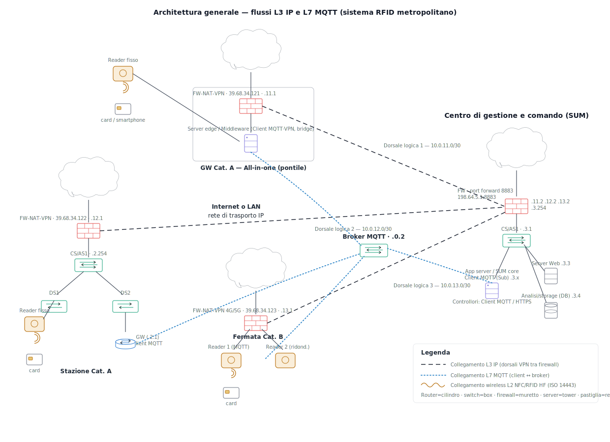
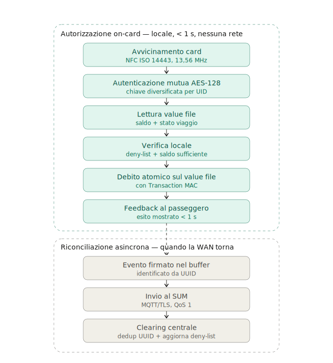

>[Torna a Dettaglio architettura RFID](/archrfid.md) 
>


# SIMULAZIONE SECONDA PROVA — SISTEMI E RETI
**Indirizzo:** Informatica e Telecomunicazioni — Articolazione Informatica
**Disciplina:** Sistemi e Reti
**Tema:** sistema metropolitano di bigliettazione elettronica su card NFC/RFID
**Anno scolastico:** 2025/2026

> Documento completo: analisi, architettura della rete di reti, planimetrie e cablaggio, alberi degli apparati, indirizzamento e configurazione, sicurezza e continuità di servizio, quesiti della seconda parte, motivazione delle scelte tecnologiche con riferimenti alla dispensa.

---

# PRIMA PARTE

## 1. Analisi del sistema e ipotesi aggiuntive

Il sistema è un'infrastruttura metropolitana per la gestione di card di trasporto pubblico basata su tecnologia **NFC/RFID HF** (ISO 14443, 13,56 MHz), analoga alle soluzioni Oyster (Londra), Navigo (Parigi), Carta Mia (Torino). Le card sono **MIFARE DESFire EV3** (o equivalente) per autenticazione crittografica e resistenza alla clonazione.

**Ipotesi aggiuntive.** Card fisica e app per smartphone adottano entrambe **NFC ISO 14443-4**. Il **Servizio Unico Metropolitano (SUM)** è un datacenter centralizzato della società partecipata. I controllori usano smartphone/tablet con app che accede via HTTPS al server della sede. Si stimano ~500 luoghi di imbarco/sbarco: ~80 **stazioni ad alta frequenza (Cat. A)** e ~420 **fermate a bassa frequenza (Cat. B)**. Il sistema opera in tempo reale, con latenza massima accettabile di ~1–2 s per il feedback al viaggiatore.

---

## 2. Architettura generale: rete di trasporto IP con gateway di confine

L'infrastruttura è modellata come **rete di reti** a topologia *hub-and-spoke*. Le reti di sito sono **reti laterali (spoke)** attestate, tramite il proprio **router di confine (CE)**, su una **rete di trasporto IP metropolitana** (core MPLS/IP). Il **gateway di confine (PE)** del SUM aggrega tutte le reti laterali; sopra il trasporto corrono **tunnel VPN IPsec** punto-punto, uno per sito, che costituiscono le subnet di dorsale logiche.

```
   Reti laterali (spoke)                Rete di trasporto IP          SUM (hub)
 ┌───────────────────────┐                                    ┌──────────────────────┐
 │ Sito Cat. A           │── CE-A ──┐                      ┌──│ Gateway confine (PE) │
 │ (LAN + server edge)   │          │                      │  │ Firewall + WAF       │
 └───────────────────────┘          │     ╔═══════════╗    │  │ Core switch          │
 ┌───────────────────────┐          ├────►║  core     ║◄───┤  │ Broker MQTT cluster  │
 │ Sito Cat. B           │── CE-B ──┤     ║  MPLS/IP  ║    │  │ App server           │
 │ (2 reader su WAN)     │          │     ╚═══════════╝    │  │ DB centrale          │
 └───────────────────────┘          │                      │  └──────────────────────┘
 ┌───────────────────────┐          │                      │   ▲ VPN IPsec da ogni CE
 │ Sede controllori      │── CE-C ──┘                      └───┘  (tunnel punto-punto)
 └───────────────────────┘
```

Le subnet di dorsale logiche (interfacce `Tunnel0`): CE-A `10.255.1.0/30`, CE-B `10.255.2.0/30`, CE-C `10.255.3.0/30`, con il PE come secondo estremo. Il PNAT sul router di confine condivide l'indirizzo pubblico WAN con gli host interni.


*Figura 1 — Architettura generale (icone Cisco). Tratteggio nero = flussi L3 IP (dorsali logiche VPN tra i firewall dei siti e il firewall del SUM); punteggiato azzurro = flussi L7 MQTT (client MQTT dei siti ↔ broker centrale); bobina = interfaccia wireless L2 NFC/RFID HF (ISO 14443) tra reader e card.*

La classificazione classica (Ferguson & Huston, ripresa in quasi tutti i testi di reti) distingue:

- Una **secure VPN** ottiene la riservatezza con la **crittografia**: i tunnel IPsec che abbiamo messo sono esattamente questo. Il provider di trasporto non è considerato fidato — può anche essere Internet pubblica — e la sicurezza è garantita end-to-end dai due estremi che cifrano (AES-256 nel nostro caso). È la scelta giusta quando le dorsali viaggiano su un trasporto non controllato.
- Una **trusted VPN** non cifra: la separazione del traffico è garantita dal **provider** che riserva e isola i percorsi. L'esempio tipico è proprio una **MPLS L3VPN** (o L2VPN), dove l'operatore tiene separate le VRF dei vari clienti tramite le etichette MPLS e il cliente "si fida" che nessuno entri nel suo instradamento. Non c'è cifratura: la fiducia è contrattuale e tecnica verso l'operatore.

Nel nostro progetto le dorsali logiche sono realizzate come **secure VPN IPsec** sopra un trasporto generico; in alternativa, se la società partecipata acquista dall'operatore un servizio **MPLS** dedicato per la rete metropolitana, le stesse dorsali possono essere realizzate come **trusted VPN (MPLS L3VPN)**, eliminando l'overhead della cifratura ma spostando la fiducia sull'operatore.


### 2.1 Categoria A — luoghi ad alta frequenza (stazioni treni, metro principali, pontili capolinea)

Reader connessi in **LAN locale** a uno **switch PoE+**, attestati a un **server edge** che esegue il middleware RFID (gestione sessione di viaggio, traduzione semantica dell'UID, risposta locale a bassa latenza) e a un **router/firewall perimetrale** con VPN verso il SUM. Il feedback al viaggiatore è gestito localmente in < 200 ms; verso il SUM si trasmettono eventi aggregati.

*Motivazione e modello offline.* Il server edge riduce latenza e banda verso il SUM, ma la continuità in caso di WAN assente **non** si appoggia a una cache del saldo: l'autorità sul valore è la **card stessa**. Al tap l'edge autentica la card, legge il *value file* DESFire (saldo + stato viaggio), verifica la deny-list locale e **addebita atomicamente sul value file con Transaction MAC**. L'autorizzazione si chiude in locale anche a SUM irraggiungibile; verso il SUM si trasmettono solo eventi già conclusi, per il clearing.

### 2.2 Categoria B — fermate a bassa frequenza (metro secondarie, tram/bus, pontili intermedi)

**Almeno 2 reader** (ridondanza fisica). I reader sono **IP nativi con client MQTT integrato** e si connettono **direttamente al SUM** via WAN cellulare (4G/5G) con un router di confine in armadietto stradale. La validazione del tap è **autonoma sul reader**: autenticazione mutua, lettura/debito atomico sul *value file* della card e controllo della **deny-list locale**, senza dipendere dal SUM. Il SUM resta autorità di **clearing**, non di autorizzazione per singolo tap. Ogni reader mantiene la deny-list (aggiornata con TTL) e un **buffer flash** con gli eventi firmati (UUID) da riconciliare al ripristino del collegamento. Politica di rischio: addebito ammesso fino a una **soglia di saldo negativo** configurata, recuperata al successivo top-up online.

---

## 3. Planimetrie fisiche e cablaggio strutturato

> Le planimetrie complete sono fornite come schemi grafici a parte. Qui se ne riassume il contenuto progettuale.

### 3.1 Stazione Cat. A (≈ 60 × 45 m)


*Figura 2 — Planimetria fisica stazione Cat. A: atrio con tornelli, banchine, locale tecnico con armadio CD, armadi FD baricentrici, prese TO, dorsali in fibra e cablaggio orizzontale.*

- **Armadio CD** nel locale tecnico, in posizione **baricentrica**; accorpa i ruoli CD/BD/FD-0 e serve direttamente i tornelli dell'atrio.
- **Armadi FD** di banchina (FD-1, FD-2), baricentrici rispetto alle proprie prese, entro i **90 m** di cablaggio orizzontale.
- **Prese TO** ai tornelli/varchi; **canalizzazione verticale di dorsale in fibra** (FD→CD), **canalizzazione orizzontale in controsoffitto** in UTP Cat6A (TO→FD).
- Vincoli rispettati: cablaggio orizzontale ≤ 90 m, armadi in posizione baricentrica, dorsali in fibra.

### 3.2 Fermata Cat. B (pensilina ≈ 8 × 3 m)


*Figura 3 — Planimetria fisica fermata Cat. B: due reader ridondati ai due accessi, armadietto stradale IP55 con router 4G/5G e mini-switch PoE.*

- **2 reader NFC ridondati** ai due accessi (prese TO B.01, B.02).
- **Armadietto stradale IP55** con router 4G/5G di confine, mini-switch PoE 4 porte e UPS.
- Cablaggio breve (< 15 m), UTP Cat6A interrato. Nessun armadio strutturato.

### 3.3 Pontile capolinea (Cat. A fluviale)


*Figura 4 — Planimetria fisica pontile capolinea: pontile galleggiante con varchi/prese TO, FD di banchina, CD nel locale tecnico a terra, WAN ridondata fibra + 4G.*

- Imbarcadero con **pensilina di banchina** e **locale tecnico** lato terra (CD).
- Reader ai varchi di imbarco/sbarco (TO); FD di banchina baricentrico; dorsale in fibra verso il CD a terra (cavo per esterni/antiumidità).
- Connettività WAN ridondata (fibra terrestre + backup 4G) data l'esposizione ambientale.

---

## 4. Alberi degli apparati (stazione Cat. A)

### 4.1 Albero degli apparati passivi (topologia logica)


*Figura 5 — Albero degli apparati passivi: radice CD, nodi FD, foglie TO; i rami sono le dorsali.*

```
                         ┌──────────┐
                         │    CD    │  (locale tecnico — radice)
                         └────┬─────┘
            ┌─────────────────┼───────────────────┐   dorsali (rami)
       ┌────┴────┐       ┌────┴────┐         ┌────┴────┐
       │  FD-0   │       │  FD-1   │         │  FD-2   │
       │ (atrio) │       │(banch.1)│         │(banch.2)│
       └────┬────┘       └────┬────┘         └────┬────┘
        TO A.01..A.07     TO 1.01..1.06       TO 2.01..2.05   (foglie)
```

**Tabella dorsali (estratto):**

| Dorsale | Cavo | Categoria | Molteplicità | Lung. | Ruolo |
|---|---|---|---|---|---|
| CD–FD1 | SMF | OS2 | 2 fibre | ~40 m | dorsale banchina 10G |
| CD–FD2 | SMF | OS2 | 2 fibre | ~55 m | dorsale banchina 10G |
| FD1–TO 1.xx | UTP | Cat6A | 4 coppie | ≤ 90 m | orizzontale 1G PoE+ |

### 4.2 Albero degli apparati attivi (configurazione **router-on-a-stick**)


*Figura 6 — Albero degli apparati attivi (icone Cisco), variante router-on-a-stick: R-FW unico apparato L3 con sottointerfacce dot1q, core switch L2, access switch PoE+ negli FD, reader.*

```
                 WAN / rete di trasporto IP
                          │ Gi0/0
                  ┌───────┴────────┐
                  │  R-FW (unico   │  sottointerfacce dot1q = gateway VLAN:
                  │  apparato L3)  │   Gi0/1.10 10.1.1.1  (reader)
                  └───────┬────────┘   Gi0/1.20 10.1.2.1  (server)
                          │ Gi0/1      Gi0/1.99 10.1.99.1 (mgmt)
                    trunk 802.1q (unico)
                  ┌───────┴────────┐
                  │ CS — core L2   │── server edge .10 (broker MQTT) / NAS .11  (VLAN 20)
                  │ (sola commut.) │
                  └───┬────┬───┬───┘
              trunk10G│    │   │
              ┌───────┘  ┌─┘   └────────┐
          ┌───┴──┐   ┌───┴──┐       ┌───┴──┐
          │ AS-0 │   │ AS-1 │       │ AS-2 │  access switch PoE+ (negli FD)
          │atrio │   │banc.1│       │banc.2│
          └──┬───┘   └──┬───┘       └──┬───┘
          reader     reader         reader  (VLAN 10, PoE+)
```

**Scelta progettuale — perché router-on-a-stick e non switch L3.** Con un core L3 il livello 3 è distribuito su due apparati: le subnet interne sono direttamente connesse allo switch L3 ma **remote** per il router perimetrale, che richiede quindi rotte statiche di ritorno (o un protocollo dinamico) e un link di transito dedicato — due tabelle da gestire. Con switch L2 + router-on-a-stick si **collassa tutto il livello 3 sul solo router perimetrale**: le sottointerfacce `.10/.20/.99` sono i gateway delle VLAN, tutte le subnet interne diventano **direttamente connesse** (rotte automatiche), non servono rotte statiche interne né link di transito, e si configura l'instradamento una sola volta. Il traffico dei reader è di piccoli messaggi JSON: l'effetto "tornante" sul trunk non è un collo di bottiglia reale. Limite da dichiarare: `R-FW` diventa *single point of failure*, mitigabile con un secondo router in **VRRP/HSRP** dove serva la massima continuità.

---

## 5. Piano di indirizzamento e VLAN (stazione Cat. A)

| VLAN | Funzione | Subnet | Broadcast | Gateway (sottointerf.) | Range host | DHCP |
|---|---|---|---|---|---|---|
| 10 | Reader NFC | 10.1.1.0/24 | 10.1.1.255 | 10.1.1.1 (Gi0/1.10) | .2–.254 | .100–.200 |
| 20 | Server (edge, NAS) | 10.1.2.0/24 | 10.1.2.255 | 10.1.2.1 (Gi0/1.20) | .2–.254 | statico |
| 99 | Management | 10.1.99.0/24 | 10.1.99.255 | 10.1.99.1 (Gi0/1.99) | .2–.254 | statico |
| — | Dorsale VPN → SUM | 10.255.1.0/30 | 10.255.1.3 | Tu0 (.1 ↔ PE .2) | .1–.2 | — |

**Indirizzi statici dei server:**

| Host | VLAN | Indirizzo | Ruolo |
|---|---|---|---|
| srv-edge | 20 | 10.1.2.10 | middleware + broker MQTT locale |
| srv-sis | 20 | 10.1.2.11 | DHCP/DNS · NAS log |
| R-FW | — | gateway VLAN | router perimetrale L3 · PNAT · VPN |

**Schema metropolitano (estratto):** SUM DMZ `10.0.1.0/28`, server farm `10.0.2.0/24`, admin `10.0.3.0/28`; stazioni Cat. A `10.1.N.0/24` (VLAN multiple); fermate Cat. B `10.2.M.0/29`; sede controllori `10.3.0.0/24`; tunnel `10.255.x.0/30`.

---

## 6. Configurazione di R-FW (Cisco IOS — router-on-a-stick)

Instradamento inter-VLAN collassato sul solo router perimetrale, NAT overload, dorsale VPN verso il SUM, ACL conformi (default-deny su reader/server/WAN/tunnel, default-allow solo sul piano di management) e ritorno stateful via CBAC. Per ogni interfaccia: **mini-tabella ACE astratta + blocco IOS** corrispondente.

### 6.1 — Base: routing, CBAC, DHCP, NAT, interfacce

```cisco
hostname R-FW-STAZ-A
ip routing
!
! === Motore stateful (CBAC): apre i ritorni delle sessioni iniziate dall'interno ===
ip inspect name STATEFUL tcp
ip inspect name STATEFUL udp
ip inspect name STATEFUL icmp
!
! === DHCP per i reader (il pool risiede sul router) ===
ip dhcp excluded-address 10.1.1.1 10.1.1.99
ip dhcp excluded-address 10.1.1.201 10.1.1.254
ip dhcp pool VLAN10-READER
 network 10.1.1.0 255.255.255.0
 default-router 10.1.1.1
 dns-server 10.1.2.11
!
! === Interfacce L3 (gateway VLAN + WAN + tunnel) ===
interface GigabitEthernet0/0
 description WAN verso ISP / core MPLS-IP
 ip address dhcp
 ip nat outside
 ip access-group ACL-WAN-IN in
!
interface GigabitEthernet0/1
 description Trunk 802.1q verso core switch L2
 no ip address
!
interface GigabitEthernet0/1.10
 description Gateway VLAN 10 - Reader NFC
 encapsulation dot1Q 10
 ip address 10.1.1.1 255.255.255.0
 ip nat inside
 ip access-group VLAN10-IN in
 ip inspect STATEFUL in
!
interface GigabitEthernet0/1.20
 description Gateway VLAN 20 - Server farm (edge, NAS)
 encapsulation dot1Q 20
 ip address 10.1.2.1 255.255.255.0
 ip nat inside
 ip access-group VLAN20-IN in
 ip inspect STATEFUL in
!
interface GigabitEthernet0/1.99
 description Gateway VLAN 99 - Management
 encapsulation dot1Q 99
 ip address 10.1.99.1 255.255.255.0
 ip access-group VLAN99-IN in
 ip inspect STATEFUL in
!
interface Tunnel0
 description Dorsale VPN verso SUM (10.255.1.0/30)
 ip address 10.255.1.1 255.255.255.252
 tunnel source GigabitEthernet0/0
 tunnel destination <IP_PE_SUM>
 tunnel protection ipsec profile VPN-SUM
 ip access-group ACL-TUNNEL-IN in
!
! === Instradamento: subnet interne direttamente connesse, niente rotte statiche interne ===
ip route 0.0.0.0 0.0.0.0 GigabitEthernet0/0
ip route 10.0.0.0 255.0.0.0 Tunnel0
!
! === PNAT (overload) per gli host interni ===
ip access-list standard NAT-INTERNI
 permit 10.1.0.0 0.0.255.255
ip nat inside source list NAT-INTERNI interface GigabitEthernet0/0 overload
```

### 6.2 — `VLAN10-IN` · Reader NFC (Gi0/1.10) · default-deny

I reader Cat. A parlano **solo** col broker edge locale `10.1.2.10`, più DHCP/DNS/NTP. Niente SUM diretto, niente resto della server farm, niente management.

| # | Azione | Proto | Sorgente | Destinazione | Porta | Scopo |
|---|---|---|---|---|---|---|
| 1 | permit | udp | host 0.0.0.0 | host 255.255.255.255 | 67 | DHCP DISCOVER/REQUEST (broadcast) |
| 2 | permit | udp | 10.1.1.0/24 | 10.1.1.1 | 67 | DHCP rinnovo unicast |
| 3 | permit | tcp | 10.1.1.0/24 | 10.1.2.10 | 8883 | Reader → broker edge (MQTT/TLS) |
| 4 | permit | udp | 10.1.1.0/24 | 10.1.2.11 | 53 | DNS |
| 5 | permit | udp | 10.1.1.0/24 | 10.1.2.11 | 123 | NTP (validità certificati TLS) |
| 6 | deny | ip | any | any | — | **Default deny** (log) |

```cisco
ip access-list extended VLAN10-IN
 remark === Reader NFC: solo broker edge + DHCP/DNS/NTP ===
 permit udp host 0.0.0.0 host 255.255.255.255 eq bootps
 permit udp 10.1.1.0 0.0.0.255 host 10.1.1.1 eq bootps
 permit tcp 10.1.1.0 0.0.0.255 host 10.1.2.10 eq 8883
 permit udp 10.1.1.0 0.0.0.255 host 10.1.2.11 eq domain
 permit udp 10.1.1.0 0.0.0.255 host 10.1.2.11 eq ntp
 deny   ip any any log
```

### 6.3 — `VLAN20-IN` · Server farm (Gi0/1.20) · default-deny

L'edge inoltra al broker centrale del SUM (via VPN), risolve/sincronizza e si aggiorna. Non inizia verso i reader: risponde soltanto, e i ritorni li apre CBAC.

| # | Azione | Proto | Sorgente | Destinazione | Porta | Scopo |
|---|---|---|---|---|---|---|
| 1 | permit | tcp | 10.1.2.10 | 10.0.2.0/24 | 8883 | Edge → broker cluster SUM (via VPN) |
| 2 | permit | udp | 10.1.2.0/24 | any | 53 | DNS ricorsivo upstream |
| 3 | permit | udp | 10.1.2.0/24 | any | 123 | NTP |
| 4 | permit | tcp | 10.1.2.0/24 | any | 443 | Aggiornamenti software (HTTPS) |
| 5 | deny | ip | any | any | — | **Default deny** (log) |

```cisco
ip access-list extended VLAN20-IN
 remark === Server farm: edge->broker SUM + DNS/NTP/updates ===
 permit tcp host 10.1.2.10 10.0.2.0 0.0.0.255 eq 8883
 permit udp 10.1.2.0 0.0.0.255 any eq domain
 permit udp 10.1.2.0 0.0.0.255 any eq ntp
 permit tcp 10.1.2.0 0.0.0.255 any eq 443
 deny   ip any any log
```

> Il traffico **intra-VLAN** (edge `10.1.2.10` ↔ srv-sis `10.1.2.11` per DNS/log) è L2 nella stessa subnet: non passa dal router, nessuna ACL serve.

### 6.4 — `VLAN99-IN` · Management (Gi0/1.99) · control plane

| # | Azione | Proto | Sorgente | Destinazione | Porta | Scopo |
|---|---|---|---|---|---|---|
| 1 | permit | ip | 10.1.99.0/24 | any | — | Management: accesso pieno |
| 2 | deny | ip | any | any | — | **Default deny** (log) |

```cisco
ip access-list extended VLAN99-IN
 remark === Management: accesso totale ===
 permit ip 10.1.99.0 0.0.0.255 any
 deny   ip any any log
```

### 6.5 — `ACL-WAN-IN` · WAN (Gi0/0) · anti-spoofing + default-deny

Scarta le sorgenti impossibili, ammette l'instaurazione del tunnel IPsec dal PE del SUM, poi nega il resto. I ritorni NAT li apre CBAC.

| # | Azione | Proto | Sorgente | Destinazione | Porta | Scopo |
|---|---|---|---|---|---|---|
| 1 | deny | ip | host 0.0.0.0 | any | — | Sorgente nulla |
| 2 | deny | ip | 10.0.0.0/8 | any | — | Anti-spoofing RFC1918 |
| 3 | deny | ip | 172.16.0.0/12 | any | — | Anti-spoofing RFC1918 |
| 4 | deny | ip | 192.168.0.0/16 | any | — | Anti-spoofing RFC1918 |
| 5 | deny | ip | 127.0.0.0/8 | any | — | Loopback |
| 6 | deny | ip | 224.0.0.0/4 | any | — | Multicast come sorgente |
| 7 | permit | udp | host «IP_PE_SUM» | any | 500,4500 | IKE / NAT-T del tunnel IPsec |
| 8 | permit | esp | host «IP_PE_SUM» | any | — | ESP del tunnel IPsec |
| 9 | deny | ip | any | any | — | **Default deny** (log) |

```cisco
ip access-list extended ACL-WAN-IN
 remark === Anti-spoofing: sorgenti illegittime ===
 deny   ip host 0.0.0.0 any log
 deny   ip 10.0.0.0 0.255.255.255 any log
 deny   ip 172.16.0.0 0.15.255.255 any log
 deny   ip 192.168.0.0 0.0.255.255 any log
 deny   ip 127.0.0.0 0.255.255.255 any log
 deny   ip 224.0.0.0 15.255.255.255 any log
 remark === Instaurazione tunnel IPsec dal PE del SUM ===
 permit udp host <IP_PE_SUM> any eq isakmp
 permit udp host <IP_PE_SUM> any eq non500-isakmp
 permit esp host <IP_PE_SUM> any
 deny   ip any any log
```

### 6.6 — `ACL-TUNNEL-IN` · dorsale VPN dal SUM (Tunnel0) · default-deny

Sul tunnel arriva il traffico interno dal SUM. Si ammette solo ciò che il SUM **inizia** (gestione remota verso il management); le risposte alle sessioni dell'edge le apre CBAC.

| # | Azione | Proto | Sorgente | Destinazione | Porta | Scopo |
|---|---|---|---|---|---|---|
| 1 | permit | tcp | 10.0.3.0/28 | 10.1.99.0/24 | 22 | SUM admin → mgmt (SSH) |
| 2 | permit | udp | 10.0.3.0/28 | 10.1.99.0/24 | 161 | SUM admin → mgmt (SNMP) |
| 3 | deny | ip | any | any | — | **Default deny** (log) |

```cisco
ip access-list extended ACL-TUNNEL-IN
 remark === Dal SUM: solo SSH/SNMP verso il management di stazione ===
 permit tcp 10.0.3.0 0.0.0.15 10.1.99.0 0.0.0.255 eq 22
 permit udp 10.0.3.0 0.0.0.15 10.1.99.0 0.0.0.255 eq snmp
 deny   ip any any log
```

### 6.7 — Logging

```cisco
logging host 10.1.2.11
logging trap informational
```

Crittografia IPsec (ISAKMP policy AES-256/SHA-256/DH14, transform-set ESP-AES-256) come da profilo `VPN-SUM`. `<IP_PE_SUM>` coincide con `tunnel destination`; se il profilo incapsula GRE, aggiungere `permit gre host <IP_PE_SUM> any` in `ACL-WAN-IN`.

> **Nota d'ordine.** Le definizioni `ip inspect name STATEFUL` stanno in §6.1 (prima delle interfacce) perché alcune versioni IOS rifiutano `ip inspect STATEFUL in` se la regola non esiste ancora. Le ACL sono definite in §6.2–6.6 dopo l'applicazione `ip access-group`: incollando il config completo i riferimenti si risolvono comunque.


---

## 7. Tecnologie e modalità di comunicazione

**Card ↔ reader:** ISO 14443-4, 13,56 MHz, 0–10 cm, AES-128 (DESFire EV3), autenticazione mutua con chiavi diversificate per UID, anticollisione ad **albero binario** (deterministica).

**Reader/edge → SUM:** **MQTT over TLS 1.3** (porta 8883), QoS 1. Topic gerarchico-spaziale: `sum/sito/<idSito>/reader/<idReader>/{tap,stato,ack,config}`. Payload **JSON ASCII** per interoperabilità multi-vendor.

**Controllori → sede:** REST su **HTTPS/TLS 1.3**, autenticazione **JWT** con refresh token; endpoint di verifica card in tempo reale.

---

## 8. Continuità di servizio e sicurezza

**Continuità.** Cat. A: link WAN ridondato (fibra + backup 4G/5G con failover) e server edge che valida in locale. Cat. B: 2 reader ridondati con validazione autonoma e buffer flash con risincronizzazione. SUM: broker MQTT in cluster active-active, DB master-slave, datacenter Tier III. Deduplica degli eventi tramite **UUID** per evento (finestra di 60 s).

**Transazioni in modalità degradata.** Stato e valore risiedono nel *value file* cifrato della card (DESFire EV3): credito/debito atomici autenticati AES-128 con **Transaction MAC** come prova crittografica. Il reader/edge autorizza in locale (< 1 s) anche con WAN assente; l'evento, identificato da **UUID**, viene accodato e inviato al SUM via MQTT/TLS (QoS 1) al ripristino. Il SUM esegue **clearing e deduplica per UUID** e ridistribuisce la **deny-list** (card sospese/rubate) con TTL. Feedback al passeggero definito anche in degradato: "viaggio registrato" su esito positivo, rifiuto su deny-list o saldo oltre soglia.



*Figura 7 — Transazione su card NFC in modalità offline. Cornice superiore: il ciclo di autorizzazione (autenticazione → lettura value file → verifica → debito atomico → feedback) si chiude tra card e reader in < 1 s, senza rete. Cornice inferiore: l'evento firmato viene riconciliato con il SUM in modo asincrono al ripristino della WAN.*

**Sicurezza.** TLS 1.3 / VPN IPsec AES-256 verso il SUM; reader autenticati al broker con certificati **X.509**; segmentazione **VLAN** + ACL inter-VLAN; **firewall** perimetrale, **IDS/IPS**, **WAF** sulle API; separazione DMZ/zona interna; SIEM con retention 12 mesi. Card: autenticazione mutua **AES-128**, chiavi diversificate per UID, dati cifrati. Privacy: la card porta un **value file cifrato e pseudonimizzato** col minimo stato necessario al funzionamento offline; i dati di mobilità nominali restano nel back-end, **pseudonimizzazione** nei log, conformità **GDPR** (diritto alla cancellazione dei dati di mobilità).

---

# SECONDA PARTE — Quesiti

## Quesito 1 — Progettazione logica del database dei reader

**Entità principali e schema relazionale:**

```
SITO(idSito PK, nome, tipo, indirizzo, lat, lon, categoria)
     tipo ∈ {stazione_treno, stazione_metro, fermata_tram, fermata_bus, pontile}
     categoria ∈ {A, B}
READER(idReader PK, macAddress UNIQUE, modello, firmware, dataInstallazione,
       stato CHECK(∈ 'attivo','guasto','manutenzione'), ipAddress,
       idSito FK→SITO, idStazioneLocale FK→STAZIONE_LOCALE NULLABLE)
STAZIONE_LOCALE(idStazione PK, idSito FK→SITO UNIQUE, ipServerLocale, nomeServer)
LINEA(idLinea PK, nome, mezzo, gestore)
SITO_LINEA(idSito FK, idLinea FK, direzione, PK(idSito,idLinea))   -- N:M
SERVIZIO_MANUTENZIONE(idServizio PK, idReader FK→READER, dataOra, tipo, descrizione, tecnico, esito)
```

**Associazioni:** READER–SITO (N:1), READER–STAZIONE_LOCALE (N:1, NULL per Cat. B), SITO–LINEA (N:M via SITO_LINEA), READER–SERVIZIO_MANUTENZIONE (1:N).

## Quesito 2 — Protocollo applicativo per l'interazione con il SUM

**Trasporto:** MQTT/TLS, QoS 1 (consegna garantita), modello publish/subscribe adatto a molti reader → un consumatore centrale, riconnessione automatica e persistenza.

**Messaggio di tap (reader → SUM):**
```json
{ "eventId":"3f8a2c1d-...","eventType":"tap","timestamp":"2026-06-02T08:34:12.045Z",
  "idReader":"READER-CAT-B-0042","idSito":"SITO-METRO-022",
  "uid":"04:A3:B2:C1:D0:E9:F8","rssi":-35 }
```
**Risposta (SUM → reader):**
```json
{ "eventId":"3f8a2c1d-...","esito":"OK","tipoEvento":"inizio_viaggio",
  "saldoResiduo":18.40,"messaggio":"Buon viaggio! Saldo: €18,40" }
```
`esito` ∈ { OK, ERRORE_CARD_DISABILITATA, ERRORE_SALDO_INSUFFICIENTE, ERRORE_CARD_SCONOSCIUTA }. Inoltre: `heartbeat` periodico (stato reader, conteggio tap, buffer pendente) e canale `verifica`/`risposta` per i controllori.

**Pseudocodice firmware reader (Cat. B):** all'avvio connette il broker in TLS e si sottoscrive al topic `ack`; al tap pubblica l'evento (QoS 1) e attende la risposta entro 2 s, mostrando il feedback; se offline accoda nel buffer flash e ritrasmette al ripristino; invia heartbeat ogni 60 s.

---

# Motivazione delle scelte tecnologiche (con riferimenti alla dispensa)

1. **HF/NFC ISO 14443, non UHF** — portata < 10 cm: al varco si legge *solo* la card avvicinata; la prossimità è anche difesa nativa dall'eavesdropping (*rfid_standard*, *rfid_sicurezza*).
2. **Anticollisione ad albero binario** — deterministica, garantisce la lettura del singolo: caso d'uso ideale "autenticazione singola affidabile" vs lo slotted ALOHA probabilistico dell'UHF (*rfid_anticollisione*).
3. **Reader fisso PoE + NFC dello smartphone** — stesso standard HF 13,56 MHz su card e app, nessun hardware aggiuntivo lato utente (*rfid_tag_reader*).
4. **Middleware on-edge nelle stazioni** — le letture grezze sono inutilizzabili (vanno filtrate, deduplicate, tradotte semanticamente); l'on-edge è scelto per ridurre latenza e traffico → feedback < 1 s in Cat. A (*rfid_architettura*).
5. **Gateway di confine, buffering, VPN, segmentazione** — il gateway è il dispositivo di confine tra rete di accesso e rete IP; buffering persistente per non perdere transazioni; reader embedded poco aggiornati ⇒ VLAN + firewall; connessione indiretta via VPN/tunnel verso il SUM (*rfid_architettura*).
6. **MQTT, topic gerarchico-spaziale, JSON** — formato e gerarchia indicati dalla dispensa; client MQTT a bordo del reader IP nativo (Cat. B) o del gateway/edge (Cat. A) (*rfid_architettura*).
7. **DESFire EV3, AES-128, chiavi per UID, identificativo opaco** — i tag low-end sono clonabili; autenticazione mutua e rolling codes contro clonazione e replay; privacy by design e GDPR per servizi al pubblico (*rfid_sicurezza*).

*Schede di riferimento (collegate da `archrfid.md`):* `rfid_standard.md`, `rfid_anticollisione.md`, `rfid_tag_reader.md`, `rfid_architettura.md`, `rfid_sicurezza.md`.

---


