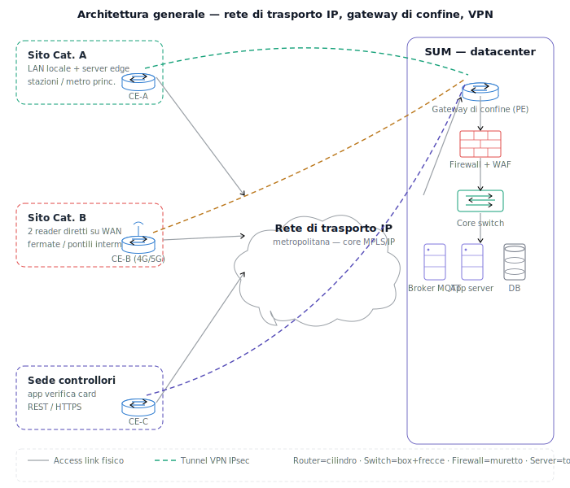
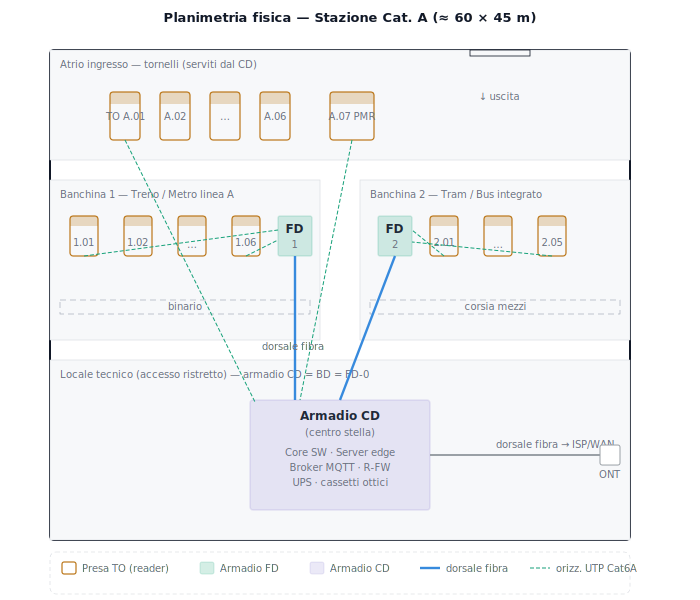
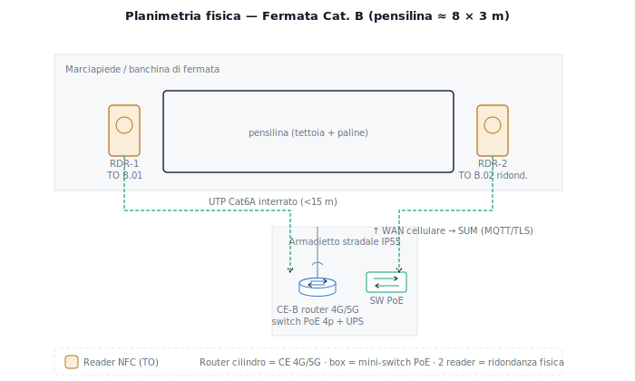
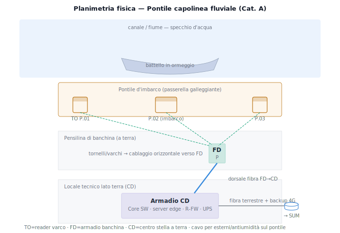
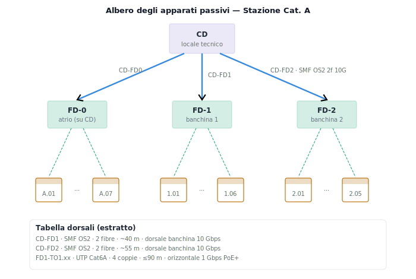
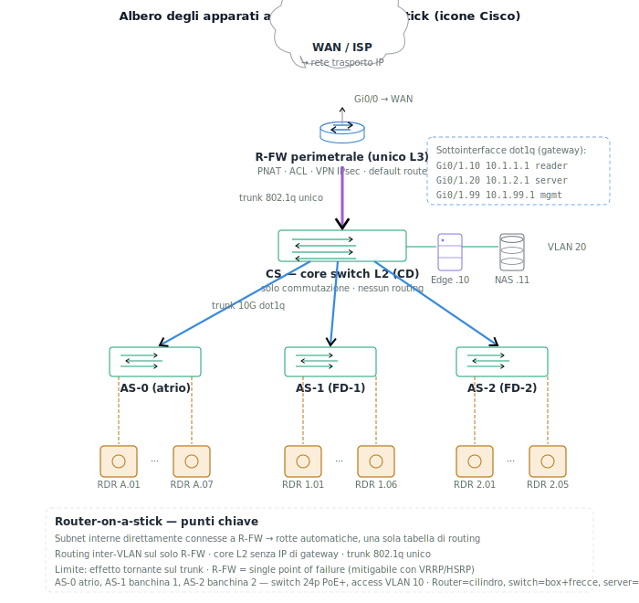

# SIMULAZIONE SECONDA PROVA — SISTEMI E RETI
**Indirizzo:** Informatica e Telecomunicazioni — Articolazione Informatica
**Disciplina:** Sistemi e Reti
**Tema:** sistema metropolitano di bigliettazione elettronica su card NFC/RFID
**Anno scolastico:** 2025/2026

> Documento completo: analisi, architettura della rete di reti, planimetrie e cablaggio, alberi degli apparati, indirizzamento e configurazione, sicurezza e continuità di servizio, quesiti della seconda parte, motivazione delle scelte tecnologiche con riferimenti alla dispensa.

---

# PRIMA PARTE

## 1. Analisi del sistema e ipotesi aggiuntive

Il sistema è un'infrastruttura metropolitana per la gestione di card di trasporto pubblico basata su tecnologia **NFC/RFID HF** (ISO 14443, 13,56 MHz), analoga alle soluzioni Oyster (Londra), Navigo (Parigi), Carta Mia (Torino). Le card sono **MIFARE DESFire EV3** (o equivalente) per autenticazione crittografica e resistenza alla clonazione.

**Ipotesi aggiuntive.** Card fisica e app per smartphone adottano entrambe **NFC ISO 14443-4**. Il **Servizio Unico Metropolitano (SUM)** è un datacenter centralizzato della società partecipata. I controllori usano smartphone/tablet con app che accede via HTTPS al server della sede. Si stimano ~500 luoghi di imbarco/sbarco: ~80 **stazioni ad alta frequenza (Cat. A)** e ~420 **fermate a bassa frequenza (Cat. B)**. Il sistema opera in tempo reale, con latenza massima accettabile di ~1–2 s per il feedback al viaggiatore.

---

## 2. Architettura generale: rete di trasporto IP con gateway di confine

L'infrastruttura è modellata come **rete di reti** a topologia *hub-and-spoke*. Le reti di sito sono **reti laterali (spoke)** attestate, tramite il proprio **router di confine (CE)**, su una **rete di trasporto IP metropolitana** (core MPLS/IP). Il **gateway di confine (PE)** del SUM aggrega tutte le reti laterali; sopra il trasporto corrono **tunnel VPN IPsec** punto-punto, uno per sito, che costituiscono le subnet di dorsale logiche.

```
   Reti laterali (spoke)                Rete di trasporto IP          SUM (hub)
 ┌───────────────────────┐                                    ┌──────────────────────┐
 │ Sito Cat. A           │── CE-A ──┐                      ┌──│ Gateway confine (PE) │
 │ (LAN + server edge)   │          │                      │  │ Firewall + WAF       │
 └───────────────────────┘          │     ╔═══════════╗    │  │ Core switch          │
 ┌───────────────────────┐          ├────►║  core     ║◄───┤  │ Broker MQTT cluster  │
 │ Sito Cat. B           │── CE-B ──┤     ║  MPLS/IP  ║    │  │ App server           │
 │ (2 reader su WAN)     │          │     ╚═══════════╝    │  │ DB centrale          │
 └───────────────────────┘          │                      │  └──────────────────────┘
 ┌───────────────────────┐          │                      │   ▲ VPN IPsec da ogni CE
 │ Sede controllori      │── CE-C ──┘                      └───┘  (tunnel punto-punto)
 └───────────────────────┘
```

Le subnet di dorsale logiche (interfacce `Tunnel0`): CE-A `10.255.1.0/30`, CE-B `10.255.2.0/30`, CE-C `10.255.3.0/30`, con il PE come secondo estremo. Il PNAT sul router di confine condivide l'indirizzo pubblico WAN con gli host interni.


*Figura 1 — Architettura generale (icone Cisco): reti laterali con router di confine CE, rete di trasporto IP, gateway PE del SUM e tunnel VPN IPsec in overlay.*

### 2.1 Categoria A — luoghi ad alta frequenza (stazioni treni, metro principali, pontili capolinea)

Reader connessi in **LAN locale** a uno **switch PoE+**, attestati a un **server edge** che esegue il middleware RFID (gestione sessione di viaggio, cache saldo, traduzione semantica dell'UID, risposta locale a bassa latenza) e a un **router/firewall perimetrale** con VPN verso il SUM. Il feedback al viaggiatore è gestito localmente in < 200 ms; verso il SUM si trasmettono eventi aggregati.

*Motivazione:* il server edge riduce latenza e banda verso il SUM e garantisce continuità di servizio anche con link WAN temporaneamente assente.

### 2.2 Categoria B — fermate a bassa frequenza (metro secondarie, tram/bus, pontili intermedi)

**Almeno 2 reader** (ridondanza fisica). I reader sono **IP nativi con client MQTT integrato** e si connettono **direttamente al SUM** via WAN cellulare (4G/5G) con un router di confice in armadietto stradale. Nessun server locale: la logica risiede nel SUM. Ogni reader ha **buffer flash** per accumulare le transazioni in caso di disconnessione e ritrasmetterle al ripristino.

---

## 3. Planimetrie fisiche e cablaggio strutturato

> Le planimetrie complete sono fornite come schemi grafici a parte. Qui se ne riassume il contenuto progettuale.

### 3.1 Stazione Cat. A (≈ 60 × 45 m)


*Figura 2 — Planimetria fisica stazione Cat. A: atrio con tornelli, banchine, locale tecnico con armadio CD, armadi FD baricentrici, prese TO, dorsali in fibra e cablaggio orizzontale.*

- **Armadio CD** nel locale tecnico, in posizione **baricentrica**; accorpa i ruoli CD/BD/FD-0 e serve direttamente i tornelli dell'atrio.
- **Armadi FD** di banchina (FD-1, FD-2), baricentrici rispetto alle proprie prese, entro i **90 m** di cablaggio orizzontale.
- **Prese TO** ai tornelli/varchi; **canalizzazione verticale di dorsale in fibra** (FD→CD), **canalizzazione orizzontale in controsoffitto** in UTP Cat6A (TO→FD).
- Vincoli rispettati: cablaggio orizzontale ≤ 90 m, armadi in posizione baricentrica, dorsali in fibra.

### 3.2 Fermata Cat. B (pensilina ≈ 8 × 3 m)


*Figura 3 — Planimetria fisica fermata Cat. B: due reader ridondati ai due accessi, armadietto stradale IP55 con router 4G/5G e mini-switch PoE.*

- **2 reader NFC ridondati** ai due accessi (prese TO B.01, B.02).
- **Armadietto stradale IP55** con router 4G/5G di confine, mini-switch PoE 4 porte e UPS.
- Cablaggio breve (< 15 m), UTP Cat6A interrato. Nessun armadio strutturato.

### 3.3 Pontile capolinea (Cat. A fluviale)


*Figura 4 — Planimetria fisica pontile capolinea: pontile galleggiante con varchi/prese TO, FD di banchina, CD nel locale tecnico a terra, WAN ridondata fibra + 4G.*

- Imbarcadero con **pensilina di banchina** e **locale tecnico** lato terra (CD).
- Reader ai varchi di imbarco/sbarco (TO); FD di banchina baricentrico; dorsale in fibra verso il CD a terra (cavo per esterni/antiumidità).
- Connettività WAN ridondata (fibra terrestre + backup 4G) data l'esposizione ambientale.

---

## 4. Alberi degli apparati (stazione Cat. A)

### 4.1 Albero degli apparati passivi (topologia logica)


*Figura 5 — Albero degli apparati passivi: radice CD, nodi FD, foglie TO; i rami sono le dorsali.*

```
                         ┌──────────┐
                         │    CD    │  (locale tecnico — radice)
                         └────┬─────┘
            ┌─────────────────┼──────────────────┐   dorsali (rami)
       ┌────┴────┐       ┌────┴────┐         ┌────┴────┐
       │  FD-0   │       │  FD-1   │         │  FD-2   │
       │ (atrio) │       │(banch.1)│         │(banch.2)│
       └────┬────┘       └────┬────┘         └────┬────┘
        TO A.01..A.07     TO 1.01..1.06       TO 2.01..2.05   (foglie)
```

**Tabella dorsali (estratto):**

| Dorsale | Cavo | Categoria | Molteplicità | Lung. | Ruolo |
|---|---|---|---|---|---|
| CD–FD1 | SMF | OS2 | 2 fibre | ~40 m | dorsale banchina 10G |
| CD–FD2 | SMF | OS2 | 2 fibre | ~55 m | dorsale banchina 10G |
| FD1–TO 1.xx | UTP | Cat6A | 4 coppie | ≤ 90 m | orizzontale 1G PoE+ |

### 4.2 Albero degli apparati attivi (configurazione **router-on-a-stick**)


*Figura 6 — Albero degli apparati attivi (icone Cisco), variante router-on-a-stick: R-FW unico apparato L3 con sottointerfacce dot1q, core switch L2, access switch PoE+ negli FD, reader.*

```
                 WAN / rete di trasporto IP
                          │ Gi0/0
                  ┌───────┴────────┐
                  │  R-FW (unico   │  sottointerfacce dot1q = gateway VLAN:
                  │  apparato L3)  │   Gi0/1.10 10.1.1.1  (reader)
                  └───────┬────────┘   Gi0/1.20 10.1.2.1  (server)
                          │ Gi0/1      Gi0/1.99 10.1.99.1 (mgmt)
                    trunk 802.1q (unico)
                  ┌───────┴────────┐
                  │ CS — core L2   │── server edge .10 (broker MQTT) / NAS .11  (VLAN 20)
                  │ (sola commut.) │
                  └───┬────┬───┬───┘
              trunk10G│    │   │
              ┌───────┘  ┌─┘   └────────┐
          ┌───┴──┐   ┌───┴──┐       ┌───┴──┐
          │ AS-0 │   │ AS-1 │       │ AS-2 │  access switch PoE+ (negli FD)
          │atrio │   │banc.1│       │banc.2│
          └──┬───┘   └──┬───┘       └──┬───┘
          reader     reader         reader  (VLAN 10, PoE+)
```

**Scelta progettuale — perché router-on-a-stick e non switch L3.** Con un core L3 il livello 3 è distribuito su due apparati: le subnet interne sono direttamente connesse allo switch L3 ma **remote** per il router perimetrale, che richiede quindi rotte statiche di ritorno (o un protocollo dinamico) e un link di transito dedicato — due tabelle da gestire. Con switch L2 + router-on-a-stick si **collassa tutto il livello 3 sul solo router perimetrale**: le sottointerfacce `.10/.20/.99` sono i gateway delle VLAN, tutte le subnet interne diventano **direttamente connesse** (rotte automatiche), non servono rotte statiche interne né link di transito, e si configura l'instradamento una sola volta. Il traffico dei reader è di piccoli messaggi JSON: l'effetto "tornante" sul trunk non è un collo di bottiglia reale. Limite da dichiarare: `R-FW` diventa *single point of failure*, mitigabile con un secondo router in **VRRP/HSRP** dove serva la massima continuità.

---

## 5. Piano di indirizzamento e VLAN (stazione Cat. A)

| VLAN | Funzione | Subnet | Broadcast | Gateway (sottointerf.) | Range host | DHCP |
|---|---|---|---|---|---|---|
| 10 | Reader NFC | 10.1.1.0/24 | 10.1.1.255 | 10.1.1.1 (Gi0/1.10) | .2–.254 | .100–.200 |
| 20 | Server (edge, NAS) | 10.1.2.0/24 | 10.1.2.255 | 10.1.2.1 (Gi0/1.20) | .2–.254 | statico |
| 99 | Management | 10.1.99.0/24 | 10.1.99.255 | 10.1.99.1 (Gi0/1.99) | .2–.254 | statico |
| — | Dorsale VPN → SUM | 10.255.1.0/30 | 10.255.1.3 | Tu0 (.1 ↔ PE .2) | .1–.2 | — |

**Indirizzi statici dei server:**

| Host | VLAN | Indirizzo | Ruolo |
|---|---|---|---|
| srv-edge | 20 | 10.1.2.10 | middleware + broker MQTT locale |
| srv-sis | 20 | 10.1.2.11 | DHCP/DNS · NAS log |
| R-FW | — | gateway VLAN | router perimetrale L3 · PNAT · VPN |

**Schema metropolitano (estratto):** SUM DMZ `10.0.1.0/28`, server farm `10.0.2.0/24`, admin `10.0.3.0/28`; stazioni Cat. A `10.1.N.0/24` (VLAN multiple); fermate Cat. B `10.2.M.0/29`; sede controllori `10.3.0.0/24`; tunnel `10.255.x.0/30`.

---

## 6. Configurazione di R-FW (Cisco IOS — router-on-a-stick)

```
hostname R-FW-STAZ-A
ip routing
!
ip dhcp excluded-address 10.1.1.1 10.1.1.99
ip dhcp excluded-address 10.1.1.201 10.1.1.254
ip dhcp pool VLAN10-READER
 network 10.1.1.0 255.255.255.0
 default-router 10.1.1.1
 dns-server 10.1.2.11
!
interface GigabitEthernet0/0
 description WAN verso ISP / core MPLS-IP
 ip address dhcp
 ip nat outside
!
interface GigabitEthernet0/1
 description Trunk 802.1q verso core switch L2
 no ip address
!
interface GigabitEthernet0/1.10
 encapsulation dot1Q 10
 ip address 10.1.1.1 255.255.255.0
 ip nat inside
 ip access-group VLAN10-IN in
interface GigabitEthernet0/1.20
 encapsulation dot1Q 20
 ip address 10.1.2.1 255.255.255.0
 ip nat inside
 ip access-group VLAN20-IN in
interface GigabitEthernet0/1.99
 encapsulation dot1Q 99
 ip address 10.1.99.1 255.255.255.0
 ip access-group VLAN99-IN in
!
interface Tunnel0
 description Dorsale VPN verso SUM (10.255.1.0/30)
 ip address 10.255.1.1 255.255.255.252
 tunnel source GigabitEthernet0/0
 tunnel destination <IP_PE_SUM>
 tunnel protection ipsec profile VPN-SUM
!
! subnet interne = direttamente connesse -> nessuna rotta statica interna
ip route 0.0.0.0 0.0.0.0 GigabitEthernet0/0
ip route 10.0.0.0 255.0.0.0 Tunnel0
!
ip access-list standard NAT-INTERNI
 permit 10.1.0.0 0.0.255.255
ip nat inside source list NAT-INTERNI interface GigabitEthernet0/0 overload
!
! --- ACL inter-VLAN (isolamento dei gruppi, default deny) ---
ip access-list extended VLAN10-IN
 permit tcp 10.1.1.0 0.0.0.255 host 10.1.2.10 eq 8883
 permit udp 10.1.1.0 0.0.0.255 host 10.1.1.1 eq 67
 permit udp 10.1.1.0 0.0.0.255 host 10.1.2.11 eq 53
 permit ip  10.1.1.0 0.0.0.255 10.0.0.0 0.255.255.255
 deny   ip  10.1.1.0 0.0.0.255 10.1.2.0 0.0.0.255
 deny   ip  10.1.1.0 0.0.0.255 10.1.99.0 0.0.0.255
 deny   ip  any any
ip access-list extended VLAN20-IN
 permit ip  10.1.2.0 0.0.0.255 10.0.0.0 0.255.255.255
 deny   ip  10.1.2.0 0.0.0.255 10.1.99.0 0.0.0.255
 permit ip  10.1.2.0 0.0.0.255 any
ip access-list extended VLAN99-IN
 permit ip 10.1.99.0 0.0.0.255 any
```

Crittografia IPsec (ISAKMP policy AES-256/SHA-256/DH14, transform-set ESP-AES-256) come da profilo `VPN-SUM`.

---

## 7. Tecnologie e modalità di comunicazione

**Card ↔ reader:** ISO 14443-4, 13,56 MHz, 0–10 cm, AES-128 (DESFire EV3), autenticazione mutua con chiavi diversificate per UID, anticollisione ad **albero binario** (deterministica).

**Reader/edge → SUM:** **MQTT over TLS 1.3** (porta 8883), QoS 1. Topic gerarchico-spaziale: `sum/sito/<idSito>/reader/<idReader>/{tap,stato,ack,config}`. Payload **JSON ASCII** per interoperabilità multi-vendor.

**Controllori → sede:** REST su **HTTPS/TLS 1.3**, autenticazione **JWT** con refresh token; endpoint di verifica card in tempo reale.

---

## 8. Continuità di servizio e sicurezza

**Continuità.** Cat. A: link WAN ridondato (fibra + backup 4G/5G con failover) e cache del saldo sul server edge. Cat. B: 2 reader ridondati con buffer flash e risincronizzazione. SUM: broker MQTT in cluster active-active, DB master-slave, datacenter Tier III. Deduplica degli eventi tramite **UUID** per evento (finestra di 60 s).

**Sicurezza.** TLS 1.3 / VPN IPsec AES-256 verso il SUM; reader autenticati al broker con certificati **X.509**; segmentazione **VLAN** + ACL inter-VLAN; **firewall** perimetrale, **IDS/IPS**, **WAF** sulle API; separazione DMZ/zona interna; SIEM con retention 12 mesi. Card: autenticazione mutua **AES-128**, chiavi diversificate per UID, dati cifrati. Privacy: **identificativo opaco** sulla card, dati personali solo nel back-end, **pseudonimizzazione** nei log, conformità **GDPR** (diritto alla cancellazione dei dati di mobilità).

---

# SECONDA PARTE — Quesiti

## Quesito 1 — Progettazione logica del database dei reader

**Entità principali e schema relazionale:**

```
SITO(idSito PK, nome, tipo, indirizzo, lat, lon, categoria)
     tipo ∈ {stazione_treno, stazione_metro, fermata_tram, fermata_bus, pontile}
     categoria ∈ {A, B}
READER(idReader PK, macAddress UNIQUE, modello, firmware, dataInstallazione,
       stato CHECK(∈ 'attivo','guasto','manutenzione'), ipAddress,
       idSito FK→SITO, idStazioneLocale FK→STAZIONE_LOCALE NULLABLE)
STAZIONE_LOCALE(idStazione PK, idSito FK→SITO UNIQUE, ipServerLocale, nomeServer)
LINEA(idLinea PK, nome, mezzo, gestore)
SITO_LINEA(idSito FK, idLinea FK, direzione, PK(idSito,idLinea))   -- N:M
SERVIZIO_MANUTENZIONE(idServizio PK, idReader FK→READER, dataOra, tipo, descrizione, tecnico, esito)
```

**Associazioni:** READER–SITO (N:1), READER–STAZIONE_LOCALE (N:1, NULL per Cat. B), SITO–LINEA (N:M via SITO_LINEA), READER–SERVIZIO_MANUTENZIONE (1:N).

## Quesito 2 — Protocollo applicativo per l'interazione con il SUM

**Trasporto:** MQTT/TLS, QoS 1 (consegna garantita), modello publish/subscribe adatto a molti reader → un consumatore centrale, riconnessione automatica e persistenza.

**Messaggio di tap (reader → SUM):**
```json
{ "eventId":"3f8a2c1d-...","eventType":"tap","timestamp":"2026-06-02T08:34:12.045Z",
  "idReader":"READER-CAT-B-0042","idSito":"SITO-METRO-022",
  "uid":"04:A3:B2:C1:D0:E9:F8","rssi":-35 }
```
**Risposta (SUM → reader):**
```json
{ "eventId":"3f8a2c1d-...","esito":"OK","tipoEvento":"inizio_viaggio",
  "saldoResiduo":18.40,"messaggio":"Buon viaggio! Saldo: €18,40" }
```
`esito` ∈ { OK, ERRORE_CARD_DISABILITATA, ERRORE_SALDO_INSUFFICIENTE, ERRORE_CARD_SCONOSCIUTA }. Inoltre: `heartbeat` periodico (stato reader, conteggio tap, buffer pendente) e canale `verifica`/`risposta` per i controllori.

**Pseudocodice firmware reader (Cat. B):** all'avvio connette il broker in TLS e si sottoscrive al topic `ack`; al tap pubblica l'evento (QoS 1) e attende la risposta entro 2 s, mostrando il feedback; se offline accoda nel buffer flash e ritrasmette al ripristino; invia heartbeat ogni 60 s.

---

# Motivazione delle scelte tecnologiche (con riferimenti alla dispensa)

1. **HF/NFC ISO 14443, non UHF** — portata < 10 cm: al varco si legge *solo* la card avvicinata; la prossimità è anche difesa nativa dall'eavesdropping (*rfid_standard*, *rfid_sicurezza*).
2. **Anticollisione ad albero binario** — deterministica, garantisce la lettura del singolo: caso d'uso ideale "autenticazione singola affidabile" vs lo slotted ALOHA probabilistico dell'UHF (*rfid_anticollisione*).
3. **Reader fisso PoE + NFC dello smartphone** — stesso standard HF 13,56 MHz su card e app, nessun hardware aggiuntivo lato utente (*rfid_tag_reader*).
4. **Middleware on-edge nelle stazioni** — le letture grezze sono inutilizzabili (vanno filtrate, deduplicate, tradotte semanticamente); l'on-edge è scelto per ridurre latenza e traffico → feedback < 1 s in Cat. A (*rfid_architettura*).
5. **Gateway di confine, buffering, VPN, segmentazione** — il gateway è il dispositivo di confine tra rete di accesso e rete IP; buffering persistente per non perdere transazioni; reader embedded poco aggiornati ⇒ VLAN + firewall; connessione indiretta via VPN/tunnel verso il SUM (*rfid_architettura*).
6. **MQTT, topic gerarchico-spaziale, JSON** — formato e gerarchia indicati dalla dispensa; client MQTT a bordo del reader IP nativo (Cat. B) o del gateway/edge (Cat. A) (*rfid_architettura*).
7. **DESFire EV3, AES-128, chiavi per UID, identificativo opaco** — i tag low-end sono clonabili; autenticazione mutua e rolling codes contro clonazione e replay; privacy by design e GDPR per servizi al pubblico (*rfid_sicurezza*).

*Schede di riferimento (collegate da `archrfid.md`):* `rfid_standard.md`, `rfid_anticollisione.md`, `rfid_tag_reader.md`, `rfid_architettura.md`, `rfid_sicurezza.md`.

---

## Allegati grafici (cartella `../img/`)
1. `../img/1_architettura_generale.svg` — Architettura generale: rete di trasporto IP, gateway di confine, VPN (Figura 1).
2. `../img/2_planimetria_stazione_catA.svg` — Planimetria fisica stazione Cat. A (Figura 2).
3. `../img/5_planimetria_fermata_catB.svg` — Planimetria fisica fermata Cat. B (Figura 3).
4. `../img/6_planimetria_pontile_capolinea.svg` — Planimetria fisica pontile capolinea (Figura 4).
5. `../img/3_albero_passivi_stazione.svg` — Albero degli apparati passivi (Figura 5).
6. `../img/4_albero_attivi_router_on_a_stick.svg` — Albero degli apparati attivi, router-on-a-stick (Figura 6).
7. `config_R-FW_router-on-a-stick.txt` — Configurazione completa Cisco IOS di `R-FW`.

> Per visualizzare le figure, tenere il file Markdown e la cartella `../img/` nella stessa posizione.
