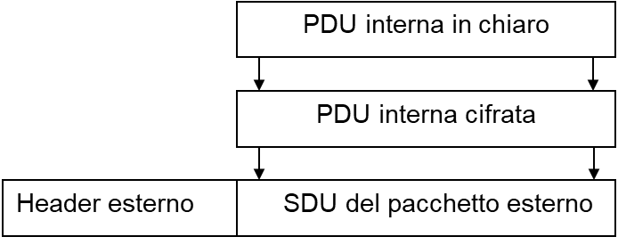
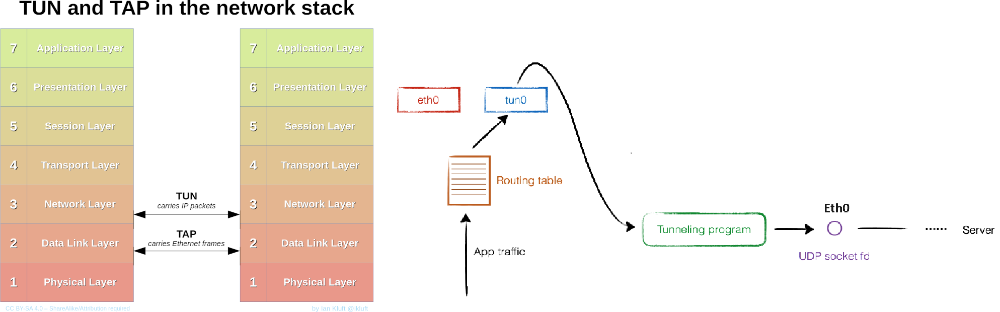
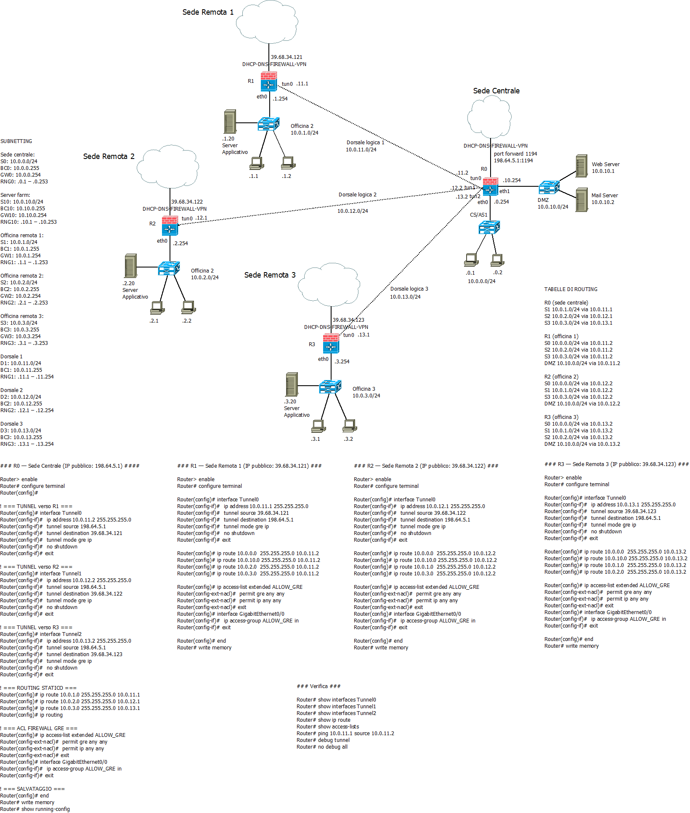
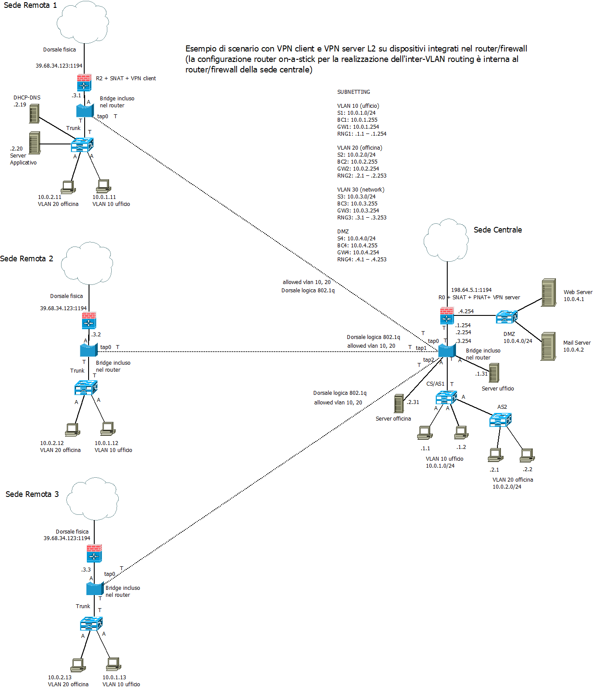

>>[Torna a reti ethernet](archeth.md)

- [Dettaglio architettura Zigbee](archzigbee.md)
- [Dettaglio architettura BLE](archble.md)
- [Dettaglio architettura WiFi infrastruttura](archwifi.md)
- [Dettaglio architettura WiFi mesh](archmesh.md) 
- [Dettaglio architettura LoraWAN](lorawanclasses.md) 

# **VPN di reti Ethernet** 

## **Ruolo del tunneling**

Realizza una connessione virtuale punto-punto cifrata tra utenti remoti attraverso una rete pubblica (Internet). Trasporta pacchetti privati (trusted) incapsulati all’interno di pacchetti pubblici (untrusted). I pacchetti prima di essere incapsulati all’interno del tunnel vengono cifrati per garantire la confidenzialità dei dati in essi contenuti.



In genere, il **tunnelling** si può considerare un **imbustamento fuori ordine** che **incapsula** pachetti del **livello N** su pacchetti di **livello N o superiore**. 

## **Interfacce virtuali tun e tap**

Nelle reti Informatiche, **TUN e TAP** sono **driver** che permettono la creazione di **periferiche di rete virtuali**. Rispetto alle comuni periferiche (ad es. eth0) che sono controllate direttamente dalle schede di rete, i pacchetti spediti da o verso dispositivi TUN/TAP sono spediti da o verso **programmi software** che si occupano dello **sbustamento** in ricezione e dell'**imbustamento** in trasmissione:
- **TUN** è in grado di **simulare** una periferica di rete IP collegata ad un **link L3 punto-punto**, su cui viaggiano **pacchetti IP**, che si collega ad una periferica analoga all'**altro capo del tunnel**. 
- **TAP** è in grado di **simulare** una NIC Ethernet che è collegata ad una **dorsale L2 punto-punto**, su cui viaggiano **trame MAC**,  che si collega ad una periferica analoga all'**altro capo del tunnel**.




Le **interfacce TAP e tun** sono quindi delle ulteriori interfacce che possono essere utilizzate tutte le volte che si desidera **instradare** il traffico di rete attraverso il **tunnel VPN**. 

## **VPN L3**

In questo tipo di VPN i pacchetti con indirizzo IP privato, appartenenti ad una subnet in cui è partizionata una **rete LAN**, vengono **imbustati** all'interno dei pacchetti **IP pubblici** della rete **Internet**, realizzando così un **tunnel L3 su L3**. Il processo di **imbustamento** del tunnel avviene per tutti i pacchetti che vengono **inoltrati** verso l'interfaccia viruale **tun**.

Infatti, le **interfacce virtuali tun** compaiono nella **routing table** come **interfacce locali** verso cui inoltrare **pacchetti IP** destinati ad una **subnet direttamente connessa**.

```
Destination     Gateway         Genmask         Flags Metric Ref    Use Iface
0.0.0.0         192.168.1.1     0.0.0.0         UG    0      0        0 eth0
10.8.0.0        0.0.0.0         255.255.255.0   U     0      0        0 tun0
```

### **Canale virtuale e canale reale**

L'**interfaccia virtuale** realizza un **canale virtuale diretto** tra i due router con il ruolo di client e server della connessione VPN dove viene **inoltrato** il **pacchetto interno trasportato**. In realtà il **canale reale**, quello dove viene inoltrato il **pacchetto esterno vettore**, passa per il **router di confine** di ogni LAN remota che utilizza **Internet** per inoltrare ulteriormente il pacchetto esterno verso il **server VPN**. 

### **Esempio officina 1**

Realizzare l'interconnessione tra una sede centrale di una officina multimarca che ha sedi sparse in tutta Italia. Le officine devono poter consultare i lsistema informativo centrale per vedere la disponibilità di pezzi di ricambi da parte di altre officine e per la consultazione dei listini di lavorazioni e ricambi. 



## **VPN L2**

In questo tipo di VPN le trame MAC con indirizzo locale, appartenenti ad una LAN remota in cui è partizionata una **rete LAN**, vengono **imbustate** all'interno dei pacchetti **IP pubblici** della rete **Internet**, realizzando così un **tunnel L2 su L3**. Il processo di **imbustamento** del tunnel avviene per tutti i pacchetti che vengono **inoltrati** verso l'interfaccia viruale **tap**.

Le **interfacce virtuali tap** compaiono nella **tabella di inoltro** del bridge come **interfacce locali** verso cui inoltrare **trame MAC** destinate ad host raggiungibili attraverso quella interfaccia.

Quando due reti sono collegate tramite un tunnel bridged L2 OpenVPN, la risoluzione degli indirizzi MAC (ARP - Address Resolution Protocol) attraverso il tunnel avviene in modo simile a una rete locale fisica, ma con alcune differenze dovute alla natura del tunnel VPN. Ecco come funziona una richiesta ARP tra due reti collegate da un tunnel bridged L2 OpenVPN:
1. **Richiesta ARP da parte del mittente**: Supponiamo che un dispositivo su una delle reti VPN voglia comunicare con un dispositivo sull'altra rete VPN. Il mittente invierà una richiesta ARP broadcast per ottenere l'indirizzo MAC del dispositivo di destinazione.
2. **Trasmissione attraverso il tunnel VPN**: La richiesta ARP broadcast, insieme a tutte le altre trame Ethernet, viene incapsulata in pacchetti VPN dal router VPN locale e inviata attraverso il tunnel VPN al router VPN remoto.
3. **Decapsulamento al router VPN remoto**: Una volta che i pacchetti VPN raggiungono il router VPN remoto, vengono decapsulati per esporre le trame Ethernet originali.
4. **Trasmissione sulla rete locale**: Le trame Ethernet originali, compresa la richiesta ARP broadcast, vengono inoltrate sulla rete locale del router VPN remoto.
5. **Risposta ARP dalla destinazione**: Il dispositivo di destinazione sulla rete VPN remota riceve la richiesta ARP e risponde con il proprio indirizzo MAC.
6. **Inoltro della risposta attraverso il tunnel VPN**: La risposta ARP, insieme a tutte le altre trame Ethernet, viene incapsulata in pacchetti VPN dal router VPN remoto e inviata attraverso il tunnel VPN al router VPN locale.
7. **Decapsulamento al router VPN locale**: Una volta che i pacchetti VPN raggiungono il router VPN locale, vengono decapsulati per esporre le trame Ethernet originali.
8. **Inoltro della risposta alla sorgente**: Il router VPN locale inoltra la risposta ARP alla sorgente originaria attraverso la sua rete locale.

In questo modo, la **risoluzione degli indirizzi MAC** tra le due reti collegate da un tunnel bridged L2 OpenVPN avviene attraverso il **tunnel VPN**, consentendo la comunicazione tra dispositivi su reti distinte come se fossero sulla **stessa rete locale**.

### **Canale virtuale e canale reale**

L'**interfaccia virtuale** realizza un **canale virtuale diretto** tra i due **bridge** con il ruolo di client e server della connessione VPN dove viene **inoltrata** il **la trama MAC**. In realtà il **canale reale**, quello dove viene inoltrato il pacchetto esterno vettore, passa per il **router di confine** di ogni LAN remota che utilizza **Internet** per inoltrare ulteriormente il pacchetto esterno verso il **server VPN**. 

### **Esempio officina 2**

Realizzare l'interconnessione tra una sede centrale di una officina multimarca che ha sedi sparse in tutta Italia. Le officine devono poter consultare i lsistema informativo centrale per vedere la disponibilità di pezzi di ricambi da parte di altre officine e per la consultazione dei listini di lavorazioni e ricambi. Inoltre le officine sono divise in due reparti, l'officina vera e propria dove si effettuano le riparazioni e l'ufficio amministrativo e contabile dove si gestiscono i rapporti con fornitori e clienti. Officina e amministrazione devono poter consultare server dedicati allo svolgimento delle rispettive funzioni che sono dislocati presso la sede centrale e ciascuna delle due funzioni non dovrebbe poter avere accesso ai server dell'altra.



La **subnet network** è mappata sulla **VLAN 30** ed è la subnet dove posseggono il proprio indirizzo IP tutti i router di confine di tutte le reti (sia centrale che remote) che, quindi, attraverso di essa sono **raggiungibili** per configurazione/manutenzione.

### **Porte dei bridge**

Le **porte dei bridg**e che collegano ad altri dispostivi L2 (**bridge** o **switch**) sono tutte **tagged**, cioè di **trunk**, e trasportano, in maniera isolata tra loro, tutte le VLAN della rete. Le **VLAN** sono **condivise** tra sede centrale e remote e, essendo queste **mappate** sulla **loro subnet**, accade che **dispositivi di sedi remote** possono **condividere** la **stessa subnet**.

Le **porte dei bridge** che collegano ai **PC** o al **router** sono tutte **untagged**, cioè di **accesso**, e trasportano i pacchetti dell'**unica VLAN** a cui sono **associate** e a cui, quindi, i dispositivi ad esse collegati appartengono.

### **Inter vlan routing**

L'**inter vlan routing** è realizzato dal solo router nella **sede centrale**, l'unico che, avendo **porte di trunk**, possiede interfacce su **tutte le vlan** e, quindi, su **tutte le subnet** ed, essendo le dorsali verso il router realizzate con un **trunk** terminato su tre **interfacce virtuali** 802.1q, la configurazione dell'**inter vlan routing** è di tipo **router on a stick**.

Sitografia:
- https://it.wikipedia.org/wiki/TUN/TAP
- https://shorewall.org/OPENVPN.html
- https://subscription.packtpub.com/book/cloud-and-networking/9781849510103/2/ch02lvl1sec27/proxy-arp
- https://icr.advantech.com/support/faq/detail/how-to-create-openvpn-tap-interface-bridge-mode
- https://www.cisco.com/c/en/us/td/docs/security/firepower/623/fdm/fptd-fdm-config-guide-623/fptd-fdm-s2svpn.html
- https://www.aaflalo.me/2015/01/openvpn-tap-bridge-mode/
- https://documentation.suse.com/sles/15-SP5/html/SLES-all/cha-security-vpnserver.html
- https://support.industry.siemens.com/cs/document/109792357/how-do-configure-an-openvpn-tunnel-between-two-scalance-sc64x-2cs-?dti=0&lc=en-AF
- https://support.industry.siemens.com/cs/attachments/109792357/109792357_OpenVPN_en.pdf
- https://openmaniak.com/openvpn_bridging.php

>[Torna a reti ethernet](archeth.md)

- [Dettaglio architettura Zigbee](archzigbee.md)
- [Dettaglio architettura BLE](archble.md)
- [Dettaglio architettura WiFi infrastruttura](archwifi.md)
- [Dettaglio architettura WiFi mesh](archmesh.md) 
- [Dettaglio architettura LoraWAN](lorawanclasses.md) 

