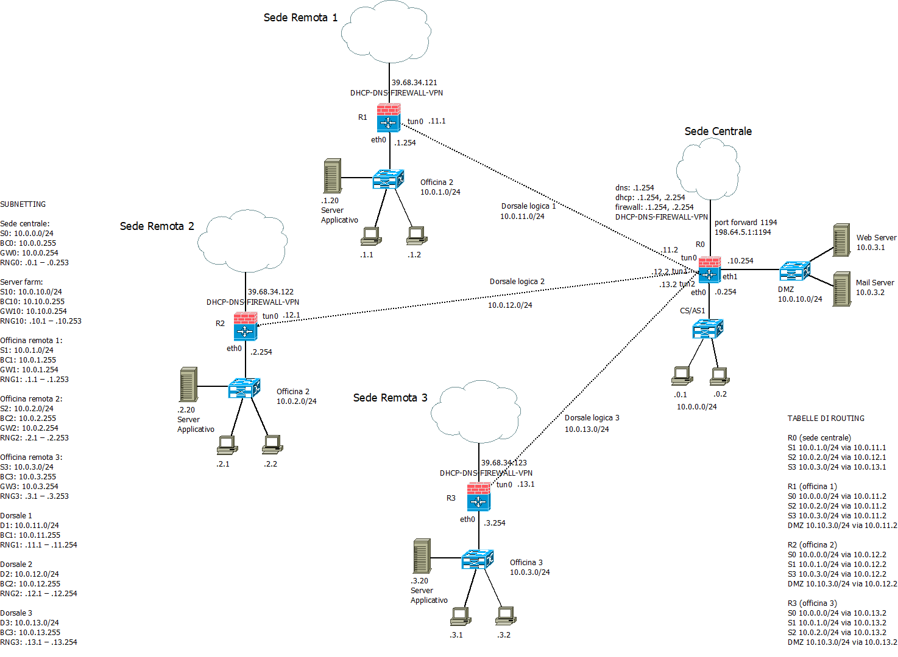

>>[Torna a reti ethernet](archeth.md)

- [Dettaglio architettura Zigbee](archzigbee.md)
- [Dettaglio architettura BLE](archble.md)
- [Dettaglio architettura WiFi infrastruttura](archwifi.md)
- [Dettaglio architettura WiFi mesh](archmesh.md) 
- [Dettaglio architettura LoraWAN](lorawanclasses.md) 

# **VPN di reti Ethernet** 

## **Ruolo del tunneling**

Realizza una **connessione virtuale punto-punto cifrata** tra **utenti remoti** attraverso una rete pubblica (**Internet**). Trasporta **pacchetti privati** (trusted) incapsulati all’interno di **pacchetti pubblici** (untrusted). I pacchetti prima di essere incapsulati all’interno del tunnel vengono **cifrati** per garantire la **confidenzialità** dei dati in essi contenuti.


In genere, il **tunnelling** si può considerare un **imbustamento fuori ordine** che **incapsula** pachetti del **livello N** su pacchetti di **livello N o superiore**. 

## **Interfacce virtuali tun e tap**

Nelle reti Informatiche, **TUN e TAP** sono **driver** che permettono la creazione di **periferiche di rete virtuali**. Rispetto alle comuni periferiche (ad es. eth0) che sono controllate direttamente dalle schede di rete, i pacchetti spediti da o verso dispositivi TUN/TAP sono spediti da o verso **programmi software** che si occupano dello **sbustamento** in ricezione e dell'**imbustamento** in trasmissione:
- **TUN** è in grado di **simulare** una periferica di rete IP collegata ad un **link L3 punto-punto**, su cui viaggiano **pacchetti IP**, che si collega ad una periferica analoga all'**altro capo del tunnel**. 
- **TAP** è in grado di **simulare** una NIC Ethernet che è collegata ad una **dorsale L2 punto-punto**, su cui viaggiano **trame MAC**,  che si collega ad una periferica analoga all'**altro capo del tunnel**.


Le **interfacce TAP e tun** sono quindi delle ulteriori interfacce che possono essere utilizzate tutte le volte che si desidera **instradare** il traffico di rete attraverso il **tunnel VPN**. 

## **VPN L3**

In questo tipo di VPN i pacchetti con indirizzo IP privato, appartenenti ad una subnet in cui è partizionata una **rete LAN**, vengono **imbustati** all'interno dei pacchetti **IP pubblici** della rete **Internet**, realizzando così un **tunnel L3 su L3**. Il processo di **imbustamento** del tunnel avviene per tutti i pacchetti che vengono **inoltrati** verso l'interfaccia viruale **tun**.

Infatti, le **interfacce virtuali tun** compaiono nella **routing table** come **interfacce locali** verso cui inoltrare **pacchetti IP** destinati ad una **subnet direttamente connessa**.

```
Destination     Gateway         Genmask         Flags Metric Ref    Use Iface
0.0.0.0         192.168.1.1     0.0.0.0         UG    0      0        0 eth0
10.8.0.0        0.0.0.0         255.255.255.0   U     0      0        0 tun0
```

### **Canale virtuale e canale reale**

L'**interfaccia virtuale** realizza un **canale virtuale diretto** tra i due router con il ruolo di client e server della connessione VPN dove viene **inoltrato** il **pacchetto interno trasportato**. In realtà il **canale reale**, quello dove viene inoltrato il **pacchetto esterno vettore**, passa per il **router di confine** di ogni LAN remota che utilizza **Internet**, da lì il pacchetto esterno viene ulteriormente inoltrato verso il **server VPN**. 

### **Esempio officina 1**

1. Realizzare l'interconnessione tra una sede centrale di una officina multimarca che ha sedi sparse in tutta Italia. Le officine devono poter consultare i lsistema informativo centrale per vedere la disponibilità di pezzi di ricambi da parte di altre officine e per la consultazione dei listini di lavorazioni e ricambi.
2. Negare ad un PC della subnet officina di entrare nella subnet ufficio.



#### **ACL per negare accesso alla rete ufficio dalle reti officina**

Per risolvere il quesito 2, cioè negare ad un PC della subnet officina di comunicare con un PC della subnet ufficio, si può creare **una ACL** nel **router firewall** centrale **per ogni interfaccia tun**.

Le ACL si dividono in:
- **Standard**, valutano il solo indirizzo di sorgente e vanno poste vicino alla destinazione 
- **Estese**, valutano anche l'indirizzo di destinazione e vanno poste vicino all’origine

```C++
! Definizione lista di regole (blacklist)
(config)# access-list 101 deny 10.0.1.0 0.0.0.255
(config)# access-list 101 deny 10.0.2.0 0.0.0.255
(config)# access-list 101 deny 10.0.3.0 0.0.0.255
(config)# access-list 101 permit any 
! Selezione interfaccia tun0
(config)# interface tun0 
! Applicazione in ingress su tun0
(config-if)# ip access-group 101 in
(config-if)# exit
! Selezione interfaccia tun1
(config)# interface tun1 
! Applicazione in ingress su tun1
(config-if)# ip access-group 101 in
(config-if)# exit
! Selezione interfaccia tun2
(config)# interface tun2 
! Applicazione in ingress su tun2
(config-if)# ip access-group 101 in
(config-if)# exit
```
Una volta inviato inviato verso l'**interfaccia tun** con un **ip privato**, il **pacchetto** esce da un'**altra interfaccia del client VPN** imbustato dentro un pacchetto con **IP pubblico** che, per questo motivo, viene **inoltrato** verso il **default gateway** ```10.0.1.254``` oppure ```10.0.2.254``` oppure ```10.0.3.254```, a seconda della della LAN remota di appartenenza.

## **VPN L2**

In questo tipo di VPN le trame MAC con indirizzo locale, appartenenti ad una LAN remota in cui è partizionata una **rete LAN**, vengono **imbustate** all'interno dei pacchetti **IP pubblici** della rete **Internet**, realizzando così un **tunnel L2 su L3**. Il processo di **imbustamento** del tunnel avviene per tutti i pacchetti che vengono **inoltrati** verso l'interfaccia viruale **tap**.

Le **interfacce virtuali tap** compaiono nella **tabella di inoltro** del bridge come **interfacce locali** verso cui inoltrare **trame MAC** destinate ad host raggiungibili attraverso quella interfaccia.

### **ARP su interfacce tap**

Quando due reti sono collegate tramite un tunnel bridged L2 OpenVPN, la risoluzione degli indirizzi MAC (ARP - Address Resolution Protocol) attraverso il tunnel avviene in modo simile a una rete locale fisica, ma con alcune differenze dovute alla natura del tunnel VPN. Ecco come funziona una richiesta ARP tra due reti collegate da un tunnel bridged L2 OpenVPN:
1. **Richiesta ARP da parte del mittente**: Supponiamo che un dispositivo su una delle reti VPN voglia comunicare con un dispositivo sull'altra rete VPN. Il mittente invierà una richiesta ARP broadcast per ottenere l'indirizzo MAC del dispositivo di destinazione.
2. **Trasmissione attraverso il tunnel VPN**: La richiesta ARP broadcast, insieme a tutte le altre trame Ethernet, viene incapsulata in pacchetti VPN dal router VPN locale e inviata attraverso il tunnel VPN al router VPN remoto.
3. **Decapsulamento al router VPN remoto**: Una volta che i pacchetti VPN raggiungono il router VPN remoto, vengono decapsulati per esporre le trame Ethernet originali.
4. **Trasmissione sulla rete locale**: Le trame Ethernet originali, compresa la richiesta ARP broadcast, vengono inoltrate sulla rete locale del router VPN remoto.
5. **Risposta ARP dalla destinazione**: Il dispositivo di destinazione sulla rete VPN remota riceve la richiesta ARP e risponde con il proprio indirizzo MAC.
6. **Inoltro della risposta attraverso il tunnel VPN**: La risposta ARP, insieme a tutte le altre trame Ethernet, viene incapsulata in pacchetti VPN dal router VPN remoto e inviata attraverso il tunnel VPN al router VPN locale.
7. **Decapsulamento al router VPN locale**: Una volta che i pacchetti VPN raggiungono il router VPN locale, vengono decapsulati per esporre le trame Ethernet originali.
8. **Inoltro della risposta alla sorgente**: Il router VPN locale inoltra la risposta ARP alla sorgente originaria attraverso la sua rete locale.

In questo modo, la **risoluzione degli indirizzi MAC** tra le due reti collegate da un tunnel bridged L2 OpenVPN avviene attraverso il **tunnel VPN**, consentendo la comunicazione tra dispositivi su reti distinte come se fossero sulla **stessa rete locale**.

### **Canale virtuale e canale reale**

L'**interfaccia virtuale** realizza un **canale virtuale diretto** tra i due **bridge** con il ruolo di client e server della connessione VPN dove viene **inoltrata** il **la trama MAC**. In realtà il **canale reale**, quello dove viene inoltrato il pacchetto esterno vettore, passa per il **router di confine** di ogni LAN remota che utilizza **Internet** da lì il pacchetto esterno viene ulteriormente inoltrato verso il **server VPN**. 

### **Esempio officina 2**

Realizzare l'interconnessione tra una sede centrale di una officina multimarca che ha sedi sparse in tutta Italia. Le officine devono poter consultare i lsistema informativo centrale per vedere la disponibilità di pezzi di ricambi da parte di altre officine e per la consultazione dei listini di lavorazioni e ricambi. Inoltre le officine sono divise in due reparti, l'officina vera e propria dove si effettuano le riparazioni e l'ufficio amministrativo e contabile dove si gestiscono i rapporti con fornitori e clienti. Officina e amministrazione devono poter consultare server dedicati allo svolgimento delle rispettive funzioni che sono dislocati presso la sede centrale e ciascuna delle due funzioni non dovrebbe poter avere accesso ai server dell'altra.


Una volta inviato inviato verso l'**interfaccia tap**, la **trama** esce da un'**altra interfaccia del client VPN** imbustata dentro un pacchetto con **IP pubblico** che, per questo motivo, viene **inoltrato** verso il **default gateway**  ```10.0.3.254```della LAN.

I **server** dei **due gruppi** di utenti (officina e uffici) sono collegati a **porte di accesso** associate ad una **sola vlan**, quella del gruppo di appartenenza, per cui sono visibili **direttamente** (senza intervaln routing) solo dai PC di **quella vlan**.

#### **Porte dei bridge**

Le **porte dei bridge** che collegano ad altri dispostivi L2 (**bridge** o **switch**) sono tutte **tagged**, cioè di **trunk**, e trasportano, in maniera isolata tra loro, tutte le VLAN della rete. Le **VLAN** sono **condivise** tra sede centrale e remote e, essendo queste **mappate** sulla **loro subnet**, accade che **dispositivi di sedi remote** possono **condividere** la **stessa subnet**.

Le **porte dei bridge** che collegano ai **PC** o al **router** sono tutte **untagged**, cioè di **accesso**, e trasportano i pacchetti dell'**unica VLAN** a cui sono **associate** e a cui, quindi, i dispositivi ad esse collegati appartengono.

#### **Inter vlan routing**

L'**inter vlan routing** è realizzato dal solo router nella **sede centrale**, l'unico che, avendo **porte di trunk**, possiede interfacce su **tutte le vlan** e, quindi, su **tutte le subnet** ed, essendo le dorsali verso il router realizzate con un **trunk** terminato su tre **interfacce virtuali** 802.1q, la configurazione dell'**inter vlan routing** è di tipo **router on a stick**. Poichè l'intervlan routing di tipo router on a stick si realizza con subnet direttamente connesse ad un solo router, allora la **definizione manuale** delle **tabelle di routing** non è necessaria.

#### **ACL per negare accesso alla rete ufficio dalle reti officina**

Per risolvere il quesito 2, cioè negare ad un PC della subnet officina di comunicare con un PC della subnet ufficio, si può creare **una ACL** nel **router firewall** centrale **per l'interfaccia vlan 10**.

Le ACL si dividono in:
- **Standard**, valutano il solo indirizzo di sorgente e vanno poste vicino alla destinazione 
- **Estese**, valutano anche l'indirizzo di destinazione e vanno poste vicino all’origine


```C++
! Definizione lista di regole (blacklist)
(config)# access-list 101 deny 10.0.1.0 0.0.0.255
(config)# access-list 101 deny 10.0.2.0 0.0.0.255
(config)# access-list 101 deny 10.0.3.0 0.0.0.255
(config)# access-list 101 permit any 
! Selezione interfaccia vlan 10
(config)# interface vlan 10 
! Applicazione in ingress su vlan 10
(config-if)# ip access-group 101 in
(config-if)# exit
```

## **VPN commerciali**

- **OpenVPN** (https://it.wikipedia.org/wiki/OpenVPN), è una delle VPN incorporate nel firewall Pfsense. Viene utilizzata per guadagnare l’accesso da remoto alla rete della segreteria. L’accesso è riservato solo ai sistemisti di rete, ciascuno con la propria utenza, e permette la manutenzione diretta di server e apparati dotati di indirizzo IP. Un altro uso importante è l’accesso diretto al firewall per operazioni di manutenzione. Il modello di VPN realizzato è quello Client to Site non permanente.
- **Guacamole** (https://en.wikipedia.org/wiki/Apache_Guacamole), è un **gateway HTTPS-RDP** che permette di accedere ad una singola macchina dotata di desktop grafico. L’accesso amministrativo è riservato ai sistemisti della rete, quello utente è riservato individualmente agli impiegati che utilizzano, a vario titolo, una certa postazione. L’accesso è protetto da autenticazione forte 2F basata su pin OTP da inserire in un autenticatore installato sullo smartphone personale dell’utente della postazione. L’accesso è limitato al solo PC della postazione e non permette di accedere a nessuna altra risorsa che non sia già montata (fisicamente o virtualmente) sulla macchina della postazione. Il modello di riferimento è la postazione di smartworking che replica a casa la postazione di lavoro remota. Il livello di sicurezza è alto anche perché il trasferimento di file dalla macchina utente a quella remota è inibito per cui eventuali malware presenti sul PC domestico non possono infettare la macchina di lavoro remota.

In entrambe le soluzioni la comunicazione tra client VPN e macchina remota si articola in un tratto cifrato nel percorso in Internet e in un tratto in chiaro nel percorso in LAN. Il server, posto a cavallo tra i due percorsi, è in entrambi i casi, una macchina interna alla rete LAN (il firewall nel caso di OpenVPN, il gateway HTTPS-RDP nel caso di Guacamole). In nessun caso vengono inviati dati a piattaforme terze all’esterno della LAN, in particolare, neppure in cloud. 


In dettaglio:
- **OpenVPN** realizza un canale End to End, steso tra il PC client e il server VPN, entro il quale vengono cifrati, con crittografia TLS, i segmenti UDP/TCP. Questi, una volta arrivati sul server, verranno inviati verso una macchina specifica, scelta dall’utente, utilizzando il servizio di inoltro dei pacchetti IP fornito dal router della LAN. Poichè il server utilizza il servizio di inoltro di base della LAN (router), i pacchetti del client possono raggiungere una macchina qualsiasi della LAN, senza limitazione alcuna. L’accesso a questo tipo di servizio è riservato esclusivamente ai sistemisti di rete.
- **Guacamole** realizza un canale End to End, steso tra il PC client e il server VPN, entro il quale vengono cifrati con crittografia SSL i pacchetti HTTP (al cui interno stanno i segmenti UDP/TCP). Questi, all’arrivo, vengono raccolti dal server che, avendo adesso anche il ruolo di gateway (HTTP-RDP), li trasforma in pacchetti RDP che inoltrerà verso un PC specifico tramite il protocollo RDP (utilizzando i servizi di inoltro IP del router della LAN). Poiché il server realizza un inoltro diretto a livello di applicazione, può scegliere, in base allo username, il servizio di desktop remoto verso cui collegarsi. L’utente non partecipa a questa scelta perché l’abbinamento tra le macchine e il singolo utente è deciso dal sistemista e quindi non ha alcuna possibilità di raggiungere altre macchine oltre quelle per cui egli è stato autorizzato. L’accesso a questo tipo di servizio, con il server Guacamole della segreteria, è riservato ai soli dipendenti della segreteria.

Schermata di accesso di un utente che è autorizzato ad accedere 2 desktop remoti:


Sitografia:
- https://it.wikipedia.org/wiki/TUN/TAP
- https://shorewall.org/OPENVPN.html
- https://subscription.packtpub.com/book/cloud-and-networking/9781849510103/2/ch02lvl1sec27/proxy-arp
- https://icr.advantech.com/support/faq/detail/how-to-create-openvpn-tap-interface-bridge-mode
- https://www.cisco.com/c/en/us/td/docs/security/firepower/623/fdm/fptd-fdm-config-guide-623/fptd-fdm-s2svpn.html
- https://www.aaflalo.me/2015/01/openvpn-tap-bridge-mode/
- https://documentation.suse.com/sles/15-SP5/html/SLES-all/cha-security-vpnserver.html
- https://support.industry.siemens.com/cs/document/109792357/how-do-configure-an-openvpn-tunnel-between-two-scalance-sc64x-2cs-?dti=0&lc=en-AF
- https://support.industry.siemens.com/cs/attachments/109792357/109792357_OpenVPN_en.pdf
- https://openmaniak.com/openvpn_bridging.php
- https://www.cisco.com/c/it_it/support/docs/smb/switches/cisco-small-business-300-series-managed-switches/smb5653-configure-port-to-vlan-interface-settings-on-a-switch-throug.html

>[Torna a reti ethernet](archeth.md)

- [Dettaglio architettura Zigbee](archzigbee.md)
- [Dettaglio architettura BLE](archble.md)
- [Dettaglio architettura WiFi infrastruttura](archwifi.md)
- [Dettaglio architettura WiFi mesh](archmesh.md) 
- [Dettaglio architettura LoraWAN](lorawanclasses.md) 

