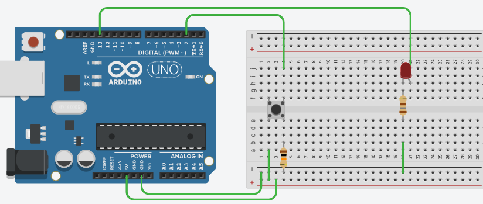

>[Torna all'indice](indexpulsanti.md)
## **ACCENSIONE DI UN LED MEDIANTE UN PULSANTE**



In realtà dovremmo vedere la pressione del pulsante come un generico **evento di input** al quale il microcontrollore **risponde** generando un **output** dopo avere **elaborato una logica di comando**. Possiamo interpretare **la logica di comando** come l’algoritmo che genera la risposta all’evento.

Il discorso è generale e non vale solo per i pulsanti ma per qualunque **applicazione** eseguita da un microcontrollore, che, non a caso, in ambito industriale è spesso indicato come **Logic Solver**.

Quindi le **fasi** di una **generica applicazione** dovrebbero essere nell’ordine:

1. **Lettura** ingressi

2.  **Elaborazione logica** di comando

3. **Scrittura** uscite

Ad es.:
```C++
val = digitalRead(pulsante);  // lettura ingressi
stato = !(stato); // calcolo logica di comando
digitalWrite(led,stato); // scrittura uscite
```
In un microcontrollore le **tre fasi** sono eseguite in quell’ordine ma, se inserite dentro la funzione loop(), sono eseguite **periodicamente**, all’infinito, fino allo spegnimento della macchina.

Questo fatto impone alcune riflessioni:

- **Quanto spesso** vengono eseguite queste fasi? Posso controllare la loro periodicità?

- **Devono** **essere eseguite** **sempre**? Posso filtrare la loro esecuzione?

- **Sono con memoria**? Cioè posso legare il risultato di una fase a quello delle fasi eseguite in precedenza?

**Quanto spesso**.

- Se le metto **“direttamente”** dentro il blocco loop() vengono eseguite molto spesso, anzi più spesso che si può. Il numero di volte al secondo dipende dalla velocità della CPU e dalla velocità delle singole operazioni.

- Se le metto dentro un blocco di codice la cui esecuzione è forzata ad avvenire in certi istanti prestabiliti (ad esempio ogni 9 loop) allora possono essere eseguite meno frequentemente. La **periodicità** dell’esecuzione è controllabile mediante algoritmi di **scheduling** (pianificazione nel tempo) che possono essere realizzati in vario modo. In genere, **a basso livello**, i modi sono tre:

  -  **Ritardo** dell’esecuzione mediante funzione delay() impostabile ad un tempo di millisecondi prefissato.

  -  **Polling** della funzione millis() nel loop che permette di scegliere l’istante di tempo adatto per eseguire un certo blocco di codice posto all’interno del loop (tipicamente dentro un blocco if-then-else con una condizione che valuta millis())

   - **Interrupt** generato da un timer HW che permette di eseguire una funzione definita al di fuori dal loop() allo scadere del timer.


**Filtro delle esecuzioni**. Ovviamente blocchi di codice possono essere filtrati tramite **istruzioni di selezione**, quindi inserendoli nel blocco then o in quello else di un **costrutto if-then-else**. La condizione di selezione può valutare il **tempo** (la faccio durare fino ad un certo tempo) oppure altri **ingressi** (confronto il valore attuale di un ingresso con quello di altri ingressi), oppure lo **stato** del sistema (se il motore è in movimento faccio una certa cosa se no non la faccio). Di seguito la fase di scrittura delle uscite non viene eseguita ad ogni loop ma solo se un certo ingresso ha un determinato valore:
```C++
if(in==HIGH){
	digitalWrite(led,closed);  //scrittura uscita
}
```
**Memoria**. In genere si fanno frequentemente due cose:

- Tenere memoria degli **ingressi** al loop precedente. Cioè conservare il valore corrente di uno o più ingressi in una variabile per poi poterlo “consumare” cioè leggere ed utilizzarlo durante l’esecuzione del loop successivo.
	```C++
	pval = val; // ultima istruzione che chiude loop()
	```
- Tenere traccia dello **stato** del mio algoritmo, cioè memoria di informazioni importanti (dedotte dalla storia di ingressi e da quella di altre variabili di stato) conservandole all’interno di una variabile di stato. Ad esempio se
 deduco il nuovo stato da quello precedente:
	```C++
	stato = !stato 
	```
	oppure, se deduco il nuovo stato da un ingresso e dallo stato precedente:
	```C++
	if(in == HIGH && stato == 0) 	stato = 1; 
	```
In **entrambi** i casi precedenti le informazioni devono “**sopravvivere**” tra un **loop e l’altro**, cioè il loro valore non deve essere cancellato al termine dell’esecuzione della funzione loop() e ciò può essere ottenuto dichiarando le **variabili di memoria globali**, cioè dichiarandole **all’esterno** di tutte le funzioni del sistema, compresa la funzione loop().

**In conclusione,** quando vogliamo gestire **l’evento di un pulsante** dobbiamo chiederci che **caratteristiche** ha l’evento alla luce delle considerazioni precedenti per capire quale è la **maniera più appropriata** per gestirlo.

>[Torna all'indice](indexpulsanti.md)
<!--stackedit_data:
eyJoaXN0b3J5IjpbMjc5MDE0MzUzLDEwNzI1MTQyNzhdfQ==
-->