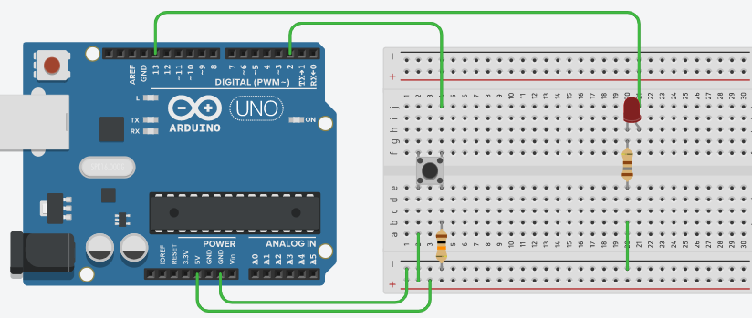
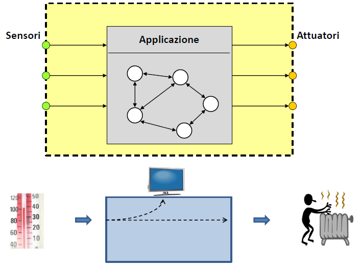

>[Torna all'indice generale](index.md) >[versione in Python](fasigenericapy.md)
## **Fasi di una applicazione**



Un **microcontrollore** possiede la specificità di avere integrate nello stesso chip un gran numero di periferiche con le quali una generica applicazione in qualche modo deve colloquiare.

il **colloquio** si può realizzare sostanzialmente usando due **tecniche di gestione**:
- **polling**. Le periferiche vengono interrogate periodicamente osservando i loro **stato**, se questo è **ready** cioè **pronto** per una determinata modalità di accesso (lettura, scrittura o lettura/scrittura) allora **l'applicazione** legge il valore della periferica con una opportuna istruzione di **I/O**. Questa tecnica si dice **sincrona** poichè i tempi di accesso alla periferica sono prevedibili in quanto stabiliti dall'applicazione).
- **interrupt.** Le periferiche segnalano la loro disponibilità (o necessità) di comunicare con la CPU (e quindi con l'applicazione) solamente quando sono pronte inviando un particolare **segnale** che viaggia dalla periferica alla CPU attraverso il bus controlli, detto **interrupt**. Il segnale di Interrupt **sospende** temporaneamente l'esecuzione dell'applicazione e attiva una funzione di servizio, detta **ISR (Interrupt Service Routine)**, che gestirà la comunicazione con la periferica. Questa tecnica si dice **asincrona** poichè i tempi di accesso alla periferica non sono prevedibili in quanto stabiliti da un sistema esterno fuori dal controllo del nostro sistema.

Il **polling degli ingressi** è una attività che, insieme al codice del programma, si effettua **all'interno del loop()**.

Una **ISR()** è una funzione a parte, **esterna al loop()** che viene richiamata in risposta ad un evento di interrupt.

Sia che venga notificato con un interrupt, sia che venga rilevato dall'appplicazione, in qualche modo si genera un **evento di input** che deve essere gestito. 

**Eventi di input** possono essere di varia natura: l'input di un pulsante, l'input da una seriale, l'input da una porta digitale in genere. Qualunque sia il tipo di dispositivo, nello sviluppo del ragionamento che faremo adesso, lo possiamo assimilare ad un generico **sensore**.

In definitiva, se il nostro **"sensore"** è un pulsante, dovremmo vedere la pressione del pulsante come un generico **evento di input** al quale il microcontrollore **risponde** generando un **output** dopo avere **elaborato una logica di comando**. Possiamo interpretare **la logica di comando** come l’algoritmo che genera la risposta all’evento.

Il discorso è del tutto generale e non vale solo per i pulsanti ma per qualunque **ingresso** e per qualunque **applicazione** eseguita da un microcontrollore, che, non a caso, in ambito industriale è spesso indicato come **Logic Solver**.



Quindi le **fasi** di una **generica applicazione** dovrebbero essere nell’ordine:

1. **Lettura** ingressi

2.  **Elaborazione logica** di comando

3. **Scrittura** uscite

Ad es.:
```C++
val = digitalRead(pulsante);  // lettura ingressi
stato = !(stato); // calcolo logica di comando
digitalWrite(led,stato); // scrittura uscite
```
In un microcontrollore le **tre fasi** sono eseguite in quell’ordine ma, se inserite dentro la funzione loop(), sono eseguite **periodicamente**, all’infinito, fino allo spegnimento della macchina.

Questo fatto impone alcune riflessioni:

- **Quanto spesso** vengono eseguite queste fasi? Posso controllare la loro periodicità?

- **Devono** **essere eseguite** **sempre**? Posso filtrare la loro esecuzione?

- **Sono con memoria**? Cioè posso legare il risultato di una fase a quello delle fasi eseguite in precedenza?

**Quanto spesso**.

- Se le metto **“direttamente”** dentro il blocco loop() vengono eseguite molto spesso, anzi più spesso che si può. La **periodicità**, cioè il numero di volte al secondo, dipende dalla velocità della CPU e dalla velocità delle singole operazioni e non è possibile stabilirla con precisione.

- Se le metto **nel loop()** ma dentro un **blocco di codice condizionale** la cui esecuzione avviene periodicamente in certi istanti prestabiliti (ad esempio ogni 10 secondi) allora possono essere eseguite **meno frequentemente**. La **periodicità** dell’esecuzione è controllabile **con precisione** mediante algoritmi di **scheduling** (pianificazione nel tempo) che possono essere realizzati in vario modo. In genere, **a basso livello**, i modi sono tre:

  -  **Ritardo** dell’esecuzione mediante funzione delay() impostabile ad un tempo di millisecondi prefissato.

  -  **Polling della funzione millis()** nel loop che permette di scegliere l’istante di tempo adatto per eseguire un certo blocco di codice posto all’interno del loop (tipicamente dentro un blocco if-then-else con una condizione che valuta millis())

   - **Interrupt** generato da un timer HW che permette di eseguire una ISR(), definita al di fuori dal loop(), allo scadere del timer.
- se le metto dentro una **ISR()** saranno eseguite in maniera **asincrona** ma, se solo una fase sta dentro la ISR(), va gestita opportunamente la **comunicazione** con le altre fasi che sono dentro il loop().


**Filtro delle esecuzioni**. Ovviamente blocchi di codice possono essere filtrati tramite **istruzioni di selezione**, quindi inserendoli nel blocco then o in quello else di un **costrutto if-then-else**. La condizione di selezione può valutare il **tempo** (la faccio durare fino ad un certo tempo) oppure altri **ingressi** (confronto il valore attuale di un ingresso con quello di altri ingressi), oppure lo **stato** del sistema (se il motore è in movimento faccio una certa cosa se no non la faccio). Di seguito la fase di scrittura delle uscite non viene eseguita ad ogni loop ma solo se un certo ingresso ha un determinato valore:
```C++
if(in==HIGH){
	digitalWrite(led,closed);  //scrittura uscita
}
```
**Persistenza** di una **variabile** tra **più loop()**. Le variabili in un microcontrollore possono essere **dichiarate**:
- all'**interno** del loop() e allora si dicono locali alla funzione loop() all'interno della quale svolgono per in tero il lorto **ciclo di vita**, cioè nascono (vengono dichiarate e quindi allocate), evolvono (vengono lette e modificate) e muoiono (vengono deallocate) all'interno della funzione loop(). Il loop() è anche l'**ambito di visibilità** (scope) delle variabili locali, cioè dichiarate al suo interno, perchè solo all'interno del loop possono essere accessibili sia in lettura che in scrittura. Al di fuori del loop() variabili con lo stesso nome sono ammesse ma sono considerate variabili diverse. Questo è il motivo per cui variabili locali al loop() non hanno proprietà di **persistenza** tra un loop e l'altro, sono sempre, ad ogni ciclo, nuovi dati che occupano le stesse posizioni di memoria.
- all'**esterno** del loop() e allora si dicono esterne alla funzione loop(), se poi queste sono pure dichiarate esterne ad ogni funzione del progetto (loop comprteso) allora si dicono **globali**. 
     - Le **variabili globali** hanno il loro **ciclo di vita** che dura per tutta l'esecuzione del programma, sono dichiarate al di fuori del looop(), inizializzate nel setup() e lette e modificate all'interno del loop().
     - Le **variabili globali** hanno la loro visibilità in tutte le funzioni del progetto, cioè sono accessibili, in lettura e in scrittura, da parte del codice inserito nel loop() e in tutte le altre funzioni dichiarate altrove nel progetto.
   

- Tenere **memoria** degli **ingressi** al loop precedente fino al loop **successivo**. Cioè conservare il valore corrente di uno o più ingressi in una variabile per poi poterlo “consumare” cioè leggere ed utilizzarlo durante l’esecuzione del loop successivo.
	```C++
	pval = val; // ultima istruzione che chiude loop()
	```
- Tenere **memoria** dello **stato** del mio algoritmo, cioè traccia di informazioni importanti (dedotte dalla storia di ingressi e da quella di altre variabili di stato) conservandole all’interno di una **variabile di stato** che viene **letta ed aggiornata** ad ogni loop. Ad esempio se
 deduco il nuovo stato da quello precedente:
	```C++
	stato = !stato 
	```
	oppure, se deduco il nuovo stato da un ingresso e dallo stato precedente:
	```C++
	if(in == HIGH && stato == 0) 	stato = 1; 
	```
In **entrambi** i casi precedenti le informazioni devono “**sopravvivere**” tra un **loop e l’altro**, cioè il loro valore non deve essere cancellato al termine dell’esecuzione della funzione loop() e ciò può essere ottenuto dichiarando le **variabili di memoria globali**, cioè dichiarandole **all’esterno** di tutte le funzioni del sistema, compresa la funzione loop().

**In conclusione,** quando vogliamo gestire **l’evento di un pulsante** dobbiamo chiederci che **caratteristiche** ha l’evento alla luce delle considerazioni precedenti per capire quale è la **maniera più appropriata** per gestirlo.

>[Torna all'indice generale](index.md) >[versione in Python](fasigenericapy.md)
<!--stackedit_data:
eyJoaXN0b3J5IjpbMjc5MDE0MzUzXX0=
-->
