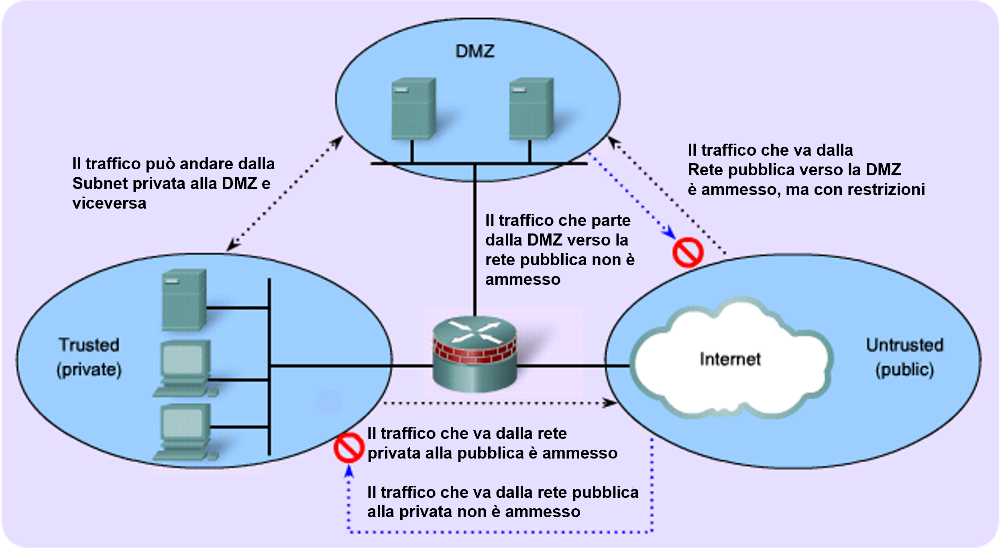
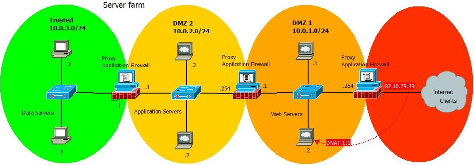

>[Torna a reti ethernet](archeth.md)

- [Dettaglio architettura Zigbee](archzigbee.md)
- [Dettaglio architettura BLE](archble.md)
- [Dettaglio architettura WiFi infrastruttura](archwifi.md)
- [Dettaglio architettura WiFi mesh](archmesh.md) 
- [Dettaglio architettura LoraWAN](lorawanclasses.md) 

# **Firewall** 

Il **firewall** è un **dispositivo** che eleva il livello di sicurezza di una rete locale mediante il **processo di filtraggio** (eliminazione selettiva) dei pacchetti in transito in base a delle **regole di controllo** predefinite che, per essere efficaci, devono tenere esaminare costantemente le principali **arterie obbligate di traffico** da e verso la LAN.

Il firewall + un componente essenziale della rete e ne esiste sempre almeno uno al confine tra la rete LAN e Internet. Funzionalità basilari di un firewall di qualità:
- **Stateful Firewall** con controllo granulare e possibilità di funzionare in maniera trasparente al layer 2 (in bridging)
- **Network address translation**
- **HA (High Availability)**: grazie a CARP permette di configurare due firewall su due macchine identiche per replicarsi e autosostituirsi nel caso di guasto di una delle due (il software pfsync si occupa di replicare lo stato firewall, la tabella delle connessioni e le regole del firewall, permettendo di passare al secondo firewall senza che le connessioni attive di rete cadano)
- **Load Balancing**: bilanciamento del carico di lavoro tra due o più server che si trovano dietro a pfSense (utilizzato normalmente per web server, mail server, ecc.)
- **VPN server**, su protocolli IPsec, OpenVPN e L2TP.
- **PPPoE server**
- **Grafici** RRD ed informazioni sullo stato in tempo reale.
- **Captive portal**
- **Gestione uPnP** e DNS dinamici
- Grazie all'aggiunta di ulteriori moduli è possibile estendere le funzionalità di base ed integrarne di evolute come **web proxying** (con Squid), **url filtering** (Squidguard, DansGuardian), **IDS** (Snort) , **antivirus** (HAVP) ed altre ancora, fino alla gestione di messaggistica VoIP con FreeSWITCH.

Il firewall è usato anche come **reverse proxy server** per realizzare un **ALG (Application Level Gateway)** con funzione di redirezione delle richieste tra server diversi sulla medesima porta TCP.
E’ usato anche per realizzare la funzione di **NAT**, cioè traduzione degli indirizzi IP da privati a pubblici e viceversa.
E’ adoperato come router tra le sue interfacce standard quali **LAN**, **WAN** e **DMZ**.
Può essere usato anche come **bilanciatore di carico** delle **connessioni WAN multiple** (ad es. due in fibra e una wireless).

## **ALG** 

il destination NAT può reindirizzare dinamicamente le connessioni anche in base a criteri che valutano l’intestazione della richiesta. Un comportamento comune è quello di esaminare il path dell’indirizzo url cioè la parte compresa tra il nome dell’host e la sezione della query.
Ad ogni path corrisponde un backend con un proprio pool di server. Tutti i server, indipendentemente dal pool di appartenenza, possono condividere una stessa porta esterna sul router/NAT.


Questa tecnica permette di superare il limite tecnico del port forwarding tradizionale che impone il vincolo della non condivisibilità di una stessa porta esterna del router tra più server interni nella LAN.
Questa tecnica può essere adoperata per realizzare il partizionamento del carico in base al tipo di servizio oppure, per uno stesso servizio, in base alla provenienza geografica della richiesta.
Ad esempio una richiesta con l’indirizzo https://segreteria.marconicloud.it /non è utilizzabile dall’utente perché è riservato agli accessi ad un webservice https da parte dell’aministrazione remota di axios. https://segeteria.marconicloud/guacamole/ invece, pur afferendo alla stessa porta 443, viene dal modulo ALG rediretto verso il server di VPN Guacamole.


- Ridondanza dei bilanciatori di carico (proxy)
- Scelta del bilanciatore in base alla disponibilità
- Disponibilità valutata con healt check mediante keepalived

### **Esempio di partizionamento e bilanciamento del carico** 

- Realizzare, con il reverse proxy haproxy, il partizionamento del traffico sulle porte 80 e 443 tra i server blog_miosito e web_miosito.
- Nel contempo realizzare il bilanciamento del carico tra tre server con lo stesso servizio per il traffico verso web_miosito

``` C++
# Configurazione HAProxy
global
  log /dev/log    local0
  log /dev/log    local1 notice
  maxconn 4096
  user haproxy
  group haproxy
  daemon

defaults
  log     global
  mode    http
  option  httplog
  option  dontlognull
  timeout connect 5000
  timeout client  50000
  timeout server  50000

frontend http_front
  bind *:80
  bind *:443 ssl crt /etc/haproxy/cert.pem  # Certificato SSL (opzionale)
  
  # Reindirizza automaticamente le richieste HTTP a HTTPS, a meno che non siano già in SSL
  http-request redirect scheme https unless { ssl_fc }
  # Indica al backend che è posto dietro ad un reverse proxy che termina la connessione https
  http-request add-header X-Forwarded-Proto https if { ssl_fc }

  # ACL per indirizzo del blog
  acl is_blog hdr_end(host) -i blog.miosito.com

  # ACL per indirizzo del web
  acl is_web hdr_end(host) -i web.miosito.com

  use_backend blog_backend if is_blog
  use_backend web_backend if is_web

backend blog_backend
  server blog_server1 blog.miosito.com:80 check

backend web_backend
  balance roundrobin    # Bilanciamento del carico round-robin tra i server
  server web_server1 web.miosito.com:80 check
  server web_server2 web.miosito.com:80 check
  server web_server3 web.miosito.com:80 check
```

## **IPS** 

IDS (Intrusion Detetection System): talvolta ad un firewall è associata anche la funzione rilevamento delle intrusioni:
- sistema basato su euristiche (algoritmi semplificati che, tramite l’elaborazione di alcuni indicatori, approssimano la valutazione sicura dell’accadere di una certa situazione) che analizza il traffico e tenta di riconoscere host attaccanti in base al:
    - contenuto delle informazioni che trasmettono
    - comportamento sospetto che tengono 
- riconosce i tentativi di intrusione ma non prende iniziative autonome oltre quella di inviare una notifica al sistemista di rete.
IPS (Intrusion Prevention System). E’ un IDS che può anche scatenare reazioni automatiche da parte del firewall. Implementa uno schema di filtraggio dinamico per cui esso:
- riconosce i tentativi di intrusione e, in più,  può anche applicare temporaneamente regole di filtraggio più selettive delle solite, prendendo autonomamente l’iniziativa di bloccare host ritenuti pericolosi.
Pfsense permette di impostare entrambe le funzioni. Attualmente è impostata quella di IPS. Il modulo IPS si chiama Snort https://it.wikipedia.org/wiki/Snort). 

### **Scansione dei contenuti** 

Le connessioni cifrate HTTPS, essendo End to End, in realtà non sono ispezionabili per cui la funzione di deep inspection su di esse è, di fatto, inefficace.
Connessioni cifrate end to end (HTTPS) sono ispezionabili solo in modalità proxy mediante SSL MITM Filtering.

#### **SSL MITM Filtering** 
Si può alternativamente realizzare con un proxy HTTPS (ad es Squid) + autorità di certificazione locale. Per far ciò bisogna installare su ogni client il certificato CA di una CA locale (normalmente lo stesso firewall/proxy). Il sistema guadagna in sicurezza ma può sorgere qualche problema di privacy:
•	Consenso informato degli utenti
•	Responsabilità sulla fedeltà e correttezza dei sistemisti


#### **Fasi dell’ispezione SSL MITM Filtering** 

1.	Il proxy SSL intercetta le connessioni dal client sulla porta TCP 443.
2.	Il proxy SSL Effettua negoziazioni SSL con il server web per conto del cliente.
3.	Analizza il certificato inviato dal server. Se il certificato non è conforme, l'accesso al server verrà bloccato.
4.	Se il certificato è conforme, il proxy SSL cercherà le regole del filtro SSL: blocca, passa o decifra
5.	Se il certificato è conforme, il proxy SSL genererà un certificato falso e lo presenterà al client, che verificherà il certificato. Se il certificato dell'autorità di firma non è stato installato nel browser o nel sistema e dichiarato come autorità attendibile, verrà visualizzato un messaggio di errore.
6.	Se il certificato è presente, il traffico sarà protetto. Verranno quindi applicate le protezioni dell'applicazione (ad es. antivirus, antispam, sandboxing).
Benchè il firewall Pfsense consenta questo tipo di ispezione intrusiva, considerazioni di tipo organizzativo (oneroso installare altri certificati su un gran numero di pc) e di tipo etico ci hanno scoraggiato dall’applicarla.

## **Regole firewall** 



### **Pubblicazione dei servizi di sistema**

I **servizi di sistema** quali server DNS interni, server DHCP, server NAS, server di Active Directory, server di autenticazione Kerberos, server Radius, server di desktop remoto RDP, non dovrebbero essere esposti direttamente nella DMZ in quanto sono servizi progettati per essere utilizzati all'interno di una LAN, benchè molti di questi implementino protocolli di cifratura e di autenticazione molto robusti. In quanto servizi di sistema, i client di queste macchine dovrebbero essere interni alla LAN e non macchine poste nella WAN.

Diverso è il discorso per servizi che pubblicano all'esterno e che utilizzano, per svolgere i loro compiti, servizi interni. Ad esempio un server Guacamole di desktop remoto che utilizza il servizio RDP di una macchina interna della LAN o il servizio di autenticazione dell'utente basato su Radius o sulla consultazione di una database LDAP. In questo caso i server che pubblicano all'esterno nella DMZ sono bifronti e in gergo vengono chiamati three tier, in quanto posseggono un terminale remoto in WAN che è il processo client dell'utente (tipicamente web), un server nella DMZ che gestisce il dialogo con il client e che realizza le funzioni di business per l'utente che però necessita, a sua volta, di dati o servizi posti nella LAN e forniti da server posti al suo interno. 

Nel caso di Guacamole, sicuramente il server in DMZ ha necessità dell'accesso ad un PC interno alla LAN (postazione di lavoro) e dell'accesso ad un server di autenticazione, molto probabilmente attestato sul core switch (CS) o sullo switch che realizza la server farm. E' bifronte perchè è un server di un client che ha iniziato nella WAN la sua connessione verso la DMZ, ma è anche lui stesso un client, posto nella DMZ, che inizia una connessione verso un server della LAN. In sostanza è una applicazione distribuita three tier con il tier 1 nella WAN (il client utente), il tier 2 nella DMZ (il server utente + il client dei servizi interni), il tier 3 nella LAN (un server dati o multimediale).



L'architettura del firewall deve essere adatta a quella di un servizio multitier (modello server farm), per cui nella DMZ si espongono:
1. prima le funzioni di pubblicazione blandamente protette da un primo firewall.
2. Poi si espongonole funzioni di business (microservizi interni) protetti in maniera più occhiuta da un altro firewall (può accedere solo il server in DMZ)
3. Poi alla fine si espone il server dei dati o dei flussi multimediali che può essere acceduto solo da un ristretto numero di server di business e mai direttamente dall'utente.
  
La logica è quella dei compartimenti stagni dove ogni intrusione causa danni di importanza via via maggiore. I beni aziendali sicuramente più preziosi per l'azienda sono i dati e stanno nella zona più interna protetta da più linee di difesa.

Non è necessario che esistano davvero degli switch che creino delle LAN su cui si attesta il firewall comune a molti server. Potrebbe semplicemente esserci una cascata di server con a bordo un firewall personale (ad es. Shorewall) che filtra gli accessi a gruppi di client via via numericamente più ristretti e più fidati.


### **Azioni di una regola**

- **ALLOW (o ACCEPT)**: permette al pacchetto di attraversare il firewall.
- **REJECT**: Proibisce al pacchetto di passare. Scarta con un avviso. Invia indietro all’host sorgente un messaggio ICMP di destinazione non raggiungibile (destination-unreachable)
- **DROP (DENY, BLACKHOLE)**: Proibisce al pacchetto di passare. Lo scarta in maniera silenziosa, senza inviare risposta


Le ACL si dividono in:
- **Standard**, valutano il solo indirizzo di sorgente e vanno poste vicino alla destinazione 
- **Estese**, valutano anche l'indirizzo di destinazione e vanno poste vicino all’origine


Le ACL (Access Control List ) vengono elaborate dal router secondo l’ordine con cui le varie clausole compaiono (lista con priorità). Si scorre la lista fino a che non si trova il **primo match** (verifica) delle condizioni, a questo punto si **interrompe** la valutazione, viene **applicata la decisione** presa e si passa al pacchetto successivo:
- Bisogna, pertanto, inserire **prima le entry più selettive** e poi quelle più generiche. 
- Se nessuna regola viene soddisfatta, viene applicata una **decisione di default**, chiamata policy dell'ACL.
- Di solito tutto quello che non è esplicitamente previsto è negato (DENY ALL)

Le ACL devono essere:
- **Definite** caratterizzando il loro nome e le ACE che comprendono (con una GUI o appositi comandi come access-list mia_ACL di CISCO IOS)
- **Associate** ad un certa interfaccia in una certa **direzione** (ingress od egress) scegliendola da una lista tramite una GUI oppure con comandi come ```ip access-group mia_ACL in```.

In base alla direzione dell'interfaccia in cui sono applicate le regole possono essere:
- regole **inbound** sono applicate al traffico che entra in un'interfaccia. Queste regole vengono valutate prima che il traffico sia inoltrato attraverso il dispositivo.
- regole **outbound** sono applicate al traffico che esce da un'interfaccia. Queste regole vengono valutate dopo che il traffico è stato inoltrato attraverso il dispositivo.

### **Impostazione dei filtraggi WAN inbound**

Nell'**interfaccia WAN** gli indirizzi di destinazione possono essere:
- **privati** perchè le regole di filtraggio, essendo valutate dopo un eventuale DNAT, allora alcuni **indirizzi di destinazione** potrebbero essere stati già tradotti. Le regole, in questo caso, devono confermare le traduzioni di un DNAT permettendo che il traffico fluisca verso gli indirizzi **IP privati di destinazione**. Possono essere:
        - indirizzo di un **server specifico** su cui un **port forwarding** di un **IP pubblico** redirige la connessione su un **certo servizio** (ad es. 10.13.0.30:443)
        - indirizzo **ip virtuale** di un **reverse proxy** (ad es. haproxy) con funzione di **ALG** o **bilanciatore di carico** (ad es. 10.13.0.200:443)
- l'**indirizzo pubblico** non tradotto dell'**interfaccia WAN** per ottenere l'accesso da remoto ai **servizi del firewall** che, normalmente, si limitano alla **VPN**. 

Poichè la WAN è una interfaccia con una rete insicura allora la **politica di default** delle sue regole è la **deny all**, di conseguenza le regole sono tutte delle **white list** che permettono esplicitamente tutto ciò che non è già negato. Le regole sono organizzabili in **liste** con **scopi diversi**:
- Lista di **deny** per regole di sicurezza essenziali come quelle antispoofing
- lista di **permit** in base al servizio (porta) sulla destinazione avente l’IP pubblico del router/firewall se cattura pacchetti non tradotti dal NAT.
- lista di **permit** in base al servizio (porta) sulla destinazione avente l’IP privato di un server interno se cattura pacchetti già tradotti dal NAT.
- Regola **di default** **deny All** esplicita alla fine

#### **Impostazione dei filtraggi WAN inbound su Pfsense**


#### **Impostazione dei filtraggi WAN inbound su un router Cisco**

``` C++
! Blocca gli indirizzi non validi (antispoofing)
access-list 101 deny ip 10.0.0.0 0.255.255.255 any
access-list 101 deny ip 172.16.0.0 0.15.255.255 any
access-list 101 deny ip 192.168.0.0 0.0.255.255 any
access-list 101 deny ip 127.0.0.0 0.255.255.255 any
access-list 101 deny ip 169.254.0.0 0.0.255.255 any
access-list 101 deny ip 224.0.0.0 15.255.255.255 any
access-list 101 deny ip 240.0.0.0 7.255.255.255 any

! Permetti il traffico verso servizi specifici sull'IP pubblico del router/firewall
access-list 101 permit tcp any host <public-ip> eq 80
access-list 101 permit tcp any host <public-ip> eq 443

! Permetti il traffico verso servizi specifici sull'IP privato di un server interno
access-list 101 permit tcp any host <internal-server-ip> eq 22
access-list 101 permit tcp any host <internal-server-ip> eq 3389

! Blocca tutto il traffico rimanente
access-list 101 deny ip any any

! Applica le ACL all'interfaccia WAN
interface GigabitEthernet0/1
 ip access-group 101 in
```

### **Impostazione dei filtraggi LAN inbound**

In questa direzione i pacchetti attraversano prima le regole di firewall dell'interfaccia LAN e poi il SNAT OUTBOUND. Quindi sia gli indirizzi di sorgente sono ancora privati.

Poichè la LAN è una interfaccia con una rete sicura allora la **politica di default** delle sue regole è la **permit all**, di conseguenza le regole sono tutte delle **black list** che negano esplicitamente tutto ciò che non è già permesso. Le regole sono organizzabili in **liste** con **scopi diversi**:
- Interfaccia LAN.  Le regole più comuni sono:
- Regole **permit anti lockout** per non chiudersi la porta di accesso al firewall
- Regole **deny antispoofing** indirizzi marziani, cioè gli indirizzi che sono estranei al piano di indirizzamento in uso sulla rete LAN.
- Regole **deny** per impedire l’**accesso (ad internet)** a gruppi di utenti
- Regole di **tagging** per **qualificare** il traffico in uscita per poi applicare politiche di shaping sul traffico in direzione opposta (code differenti per velocità differenti)
- Regola **di default** **permit All** esplicita alla fine

#### **Impostazione dei filtraggi LAN inbound su Pfsense**


#### **Impostazione dei filtraggi LAN inbound su un router Cisco**
``` C++
! Permetti l'accesso amministrativo al firewall
access-list 101 permit ip host <admin-ip> any

! Blocca il traffico da un gruppo specifico di utenti
access-list 101 deny ip <user-group-subnet> <subnet-mask> any

! Consenti tutto il traffico rimanente
access-list 101 permit ip any any

! Crea la class map per il traffico HTTP
class-map match-all WEB-TRAFFIC
 match protocol http

! Crea la policy map per taggare il traffico HTTP
policy-map SHAPE-WEB-TRAFFIC
 class WEB-TRAFFIC
  set dscp af21

! Applica le ACL e le politiche all'interfaccia WAN
interface GigabitEthernet0/1
 ip access-group 101 in
 service-policy output SHAPE-WEB-TRAFFIC
```

### **Regole floating**

Le **regole floating** in un firewall sono **regole avanzate** che possono essere applicate in modo più flessibile rispetto alle regole standard, poiché non sono legate a una specifica interfaccia o direzione del traffico, cioè, possono essere applicate a più interfacce contemporaneamente e in una o in entrambe le direzioni. 

Molti firewall commerciali permettono di base solo l'impostazione di regone inbound. Le regole outbound sono di norma scoraggiate nei firewall perimetrali per motivi di:
- **Efficienza**. L'ACL inbound è più efficiente di quella in uscita perché in l'ingresso, qualsiasi pacchetto che viene risolto (match) con un "deny" viene eliminato PRIMA che il pacchetto venga instradato all'interfaccia in uscita a cui è destinato. Inoltre spesso è considerato inutile filtrare il traffico verso l'esterno perchè si da per buono il principio che il traffico proveniente dall'interno è già verificato e sicuro.
- **Duplicazione delle Regole e complessità**: In molti casi, le regole inbound possono essere sufficienti per garantire la sicurezza, rendendo le regole outbound ridondanti e non necessarie. La ridondanza, d'altronde, genera complessità di gestione e predisposizione ad errori, specie se non si è esperti.
- **Efficacia**: molte normative di sicurezza e conformità richiedono un controllo rigoroso del traffico in entrata ritenendolo la soluzione più efficace.

Cisco non usa il termine "floating rules", configurazioni avanzate come **policy map** e **class map** possono essere utilizzate per applicare politiche QoS o altre regole sofisticate in modo simile alle regole floating di firewall commerciali come **pfSense**.

#### **Scopo delle regole floating**

- **Applicazione Globale**: Le regole floating possono essere applicate a tutte le interfacce o a una selezione di interfacce. Questo è utile quando si desidera una regola di firewall che si applichi globalmente, indipendentemente dall'interfaccia attraverso cui il traffico sta passando.
- **Priorità e Sovrapposizione**: Le regole floating vengono valutate prima delle regole standard delle interfacce (WAN, LAN, etc.). Questo permette di creare eccezioni o regole prioritarie che possono sovrascrivere le regole specifiche delle interfacce.
- **Direzione del Traffico**: Possono essere configurate per essere applicate al traffico in entrata (inbound), in uscita (outbound), o in entrambe le direzioni (any). Questo offre una grande flessibilità nella gestione del traffico.
- **Condizioni Avanzate**: Permettono di utilizzare condizioni avanzate come il tagging del traffico, la limitazione della banda, il controllo dello stato delle connessioni (stateful filtering), e altre opzioni avanzate che potrebbero non essere disponibili nelle regole delle interfacce standard.

#### **Esempio di utilizzo**

- **Regole di Sicurezza Globale**: Supponiamo di voler bloccare tutto il traffico ICMP (ping) in ingresso su tutte le interfacce per motivi di sicurezza. Una regola floating può essere configurata per bloccare ICMP su tutte le interfacce in modalità inbound.
- **Regole di Quality of Service (QoS)**: Se si desidera applicare una regola di limitazione della banda a determinati tipi di traffico indipendentemente dall'interfaccia, una regola floating può essere utilizzata per taggare il traffico e applicare le restrizioni di banda necessarie.
- **Eccezioni per il Traffico VPN**: Se avete una VPN configurata e volete garantire che il traffico VPN bypassi le regole di filtro standard delle interfacce, potete usare una regola floating per permettere specifici tipi di traffico attraverso la VPN, ignorando le regole più restrittive delle interfacce LAN o WAN.
- **Regole di Logging**: Potreste voler loggare tutto il traffico HTTP (porta 80) per scopi di monitoraggio e auditing su tutte le interfacce. Una regola floating può essere configurata per loggare questo traffico su tutte le interfacce in entrambe le direzioni.

## **NAT**
Il NAT è un processo (non è un protocollo!) che esegue la traduzione di indirizzi nel passaggio di pacchetti attraverso l’interfaccia tra interno ed esterno e viceversa:
- È posto al confine tra due reti diverse di cui una è da lui considerata interna mentre l’altra è considerata esterna.
- Una funzione secondaria molto utile è quella di bloccare del tutto le connessioni iniziate dall’esterno mentre rimangono permesse quelle iniziate dall’interno.
- Dall’esterno all’interno, rimangono permessi solo i messaggi che transitano in risposta a connessioni iniziate dall’interno (da un client)
- Si divide in **SNAT** e **DNAT**.

### **SNAT** 

- modifica l'indirizzo sorgente dei pacchetti trasformando indirizzi sorgente interni in indirizzi sorgente esterni
- Altera le connessioni iniziate da uno o più host interni in modo da presentare verso l'esterno uno o più indirizzi IP diversi da quelli originali. 
- Quindi chi (all’esterno) riceve le connessioni le vede provenire da un indirizzo diverso da quello utilizzato da chi effettivamente le genera.
- La NAT table viene aggiornata staticamente (dal sistemista) o dinamicamente, con un nuovo record IPIn-IPOut, nel momento in cui un host interno richiede l’accesso all’esterno
- i pacchetti della stessa connessione che viaggiano in  senso opposto vengono inoltrati correttamente fino all’host iniziante grazie alle informazioni contenute nella tabella di NAT che stavolta viene letta al contrario.

Si usa per:
- Ovviare alla penuria di indirizzi IP pubblici
- Per isolare una rete locale da accessi iniziati dall’esterno
- Prendere un tronco di rete a valle del NAT e farlo apparire al resto della rete a monte come un unico host
- A corredo di una VPN, per adattare tronchi di LAN remoti con piani di indirizzamento uguali o sovrapposti (Double NAT)

Si divide in:
- SNAT statico, è spesso associato ad un DNAT statico, traduce solo indirizzi IP
- SNAT dinamico, traduce solo indirizzi IP 
- PNAT o IP masquerading, o IP Overloading o NAPT (Network Address and Port Translation) traduce sia gli indirizzi IP che  gli indirizzi TCP/UDP

### **DNAT** 

- modifica l'indirizzo destinazione dei pacchetti trasformando indirizzi di destinazione esterni in indirizzi di destinazione interni
- le connessioni iniziate da uno o più host esterni vengono alterate in modo da essere redirette dall’interfaccia esterna a quella interna verso indirizzi IP diversi da quelli originali e su porte corrispondenti  secondo le - informazioni contenute nella NAT table. 
- Se l’indirizzo di destinazione esterno non è presente nella NAT table il pacchetto in arrivo dall’esterno viene scartato
- Chi effettua le connessioni si collega in realtà con un indirizzo di destinazione diverso da quello che aveva scelto

Si usa per:
- Port forwarding in associazione ad un SNAT dinamico o a un PNAT
- Realizzare la trasparenza di un proxy
- Bilanciamento del carico di lavoro di un pool di server
- Gestione dei fallimenti di un server principale

### **Esempio si SNAT PNAT con due port forward** 

``` C++
! Configurazione dell'interfaccia WAN
interface GigabitEthernet0/1
 description WAN Interface
 ip address dhcp
 ip nat outside

! Configurazione dell'interfaccia LAN
interface GigabitEthernet0/0
 description LAN Interface
 ip address 192.168.1.1 255.255.255.0
 ip nat inside

! Creare un pool di indirizzi NAT (se necessario)
ip nat pool mynatpool 203.0.113.10 203.0.113.10 netmask 255.255.255.0

! Associare l'interfaccia LAN al NAT realizzando un PNAT
ip nat inside source list 1 pool mynatpool overload

! Access list per consentire il NAT per la rete interna
access-list 1 permit 192.168.1.0 0.0.0.255

! Port forwarding per HTTPS verso il server interno 192.168.1.100
ip nat inside source static tcp 192.168.1.100 443 interface GigabitEthernet0/1 443

! Port forwarding per SSH verso il server interno 192.168.1.101
ip nat inside source static tcp 192.168.1.101 22 interface GigabitEthernet0/1 22
```

Sitografia:
- https://www.cisco.com/c/it_it/support/docs/ip/access-lists/26448-ACLsamples.html

>[Torna a reti ethernet](archeth.md)

- [Dettaglio architettura Zigbee](archzigbee.md)
- [Dettaglio architettura BLE](archble.md)
- [Dettaglio architettura WiFi infrastruttura](archwifi.md)
- [Dettaglio architettura WiFi mesh](archmesh.md) 
- [Dettaglio architettura LoraWAN](lorawanclasses.md) 

