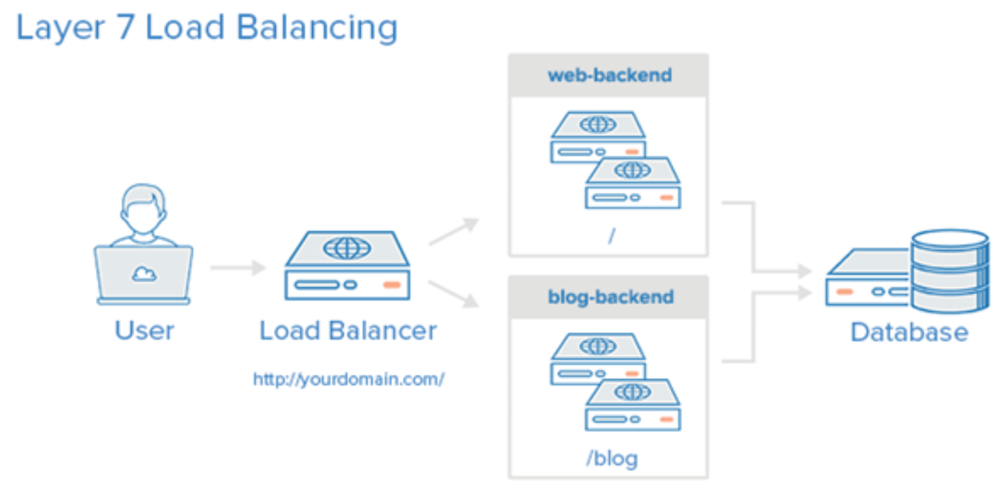
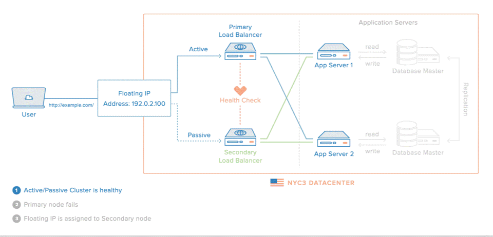
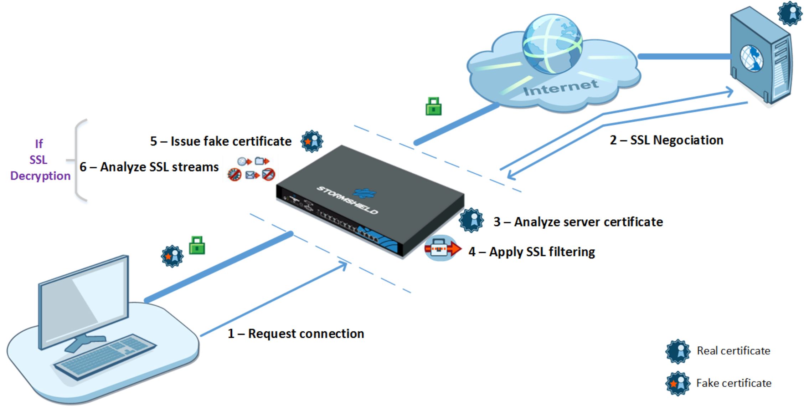
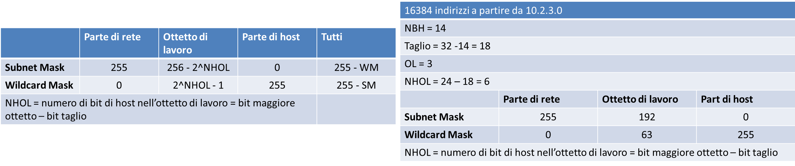
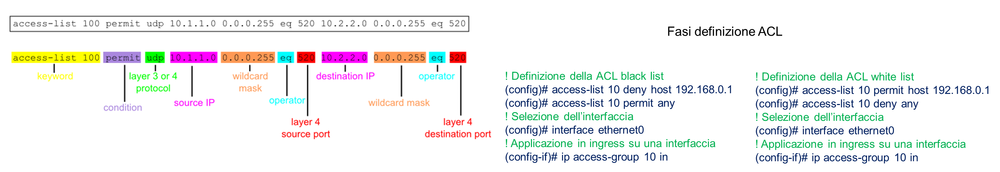
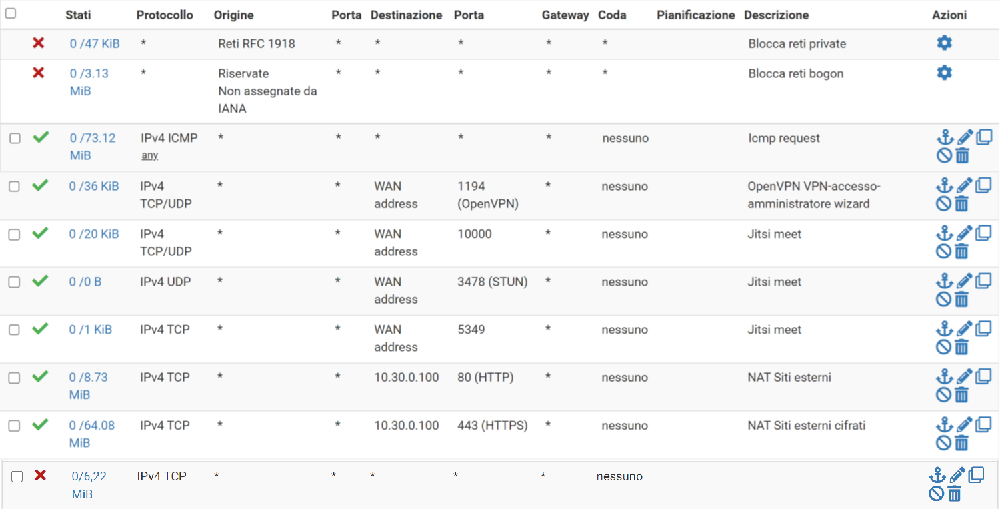
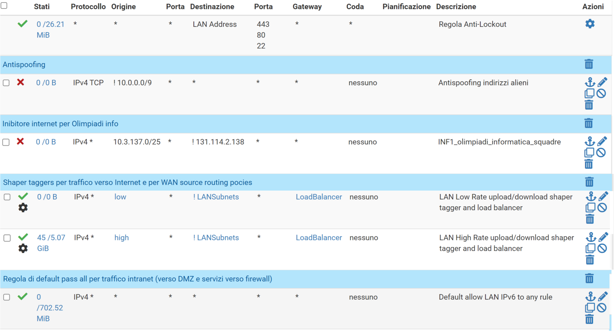

>[Torna a reti ethernet](archeth.md)

- [Dettaglio architettura Zigbee](archzigbee.md)
- [Dettaglio architettura BLE](archble.md)
- [Dettaglio architettura WiFi infrastruttura](archwifi.md)
- [Dettaglio architettura WiFi mesh](archmesh.md) 
- [Dettaglio architettura LoraWAN](lorawanclasses.md) 

# **Firewall** 

Il firewall + un componente essenziale della rete e ne esiste sempre almeno uno al confine tra la rete LAN e Internet. Funzionalità basilari di un firewall di qualità:
- **Stateful Firewall** con controllo granulare e possibilità di funzionare in maniera trasparente al layer 2 (in bridging)
- **Network address translation**
- **HA (High Availability)**: grazie a CARP permette di configurare due firewall su due macchine identiche per replicarsi e autosostituirsi nel caso di guasto di una delle due (il software pfsync si occupa di replicare lo stato firewall, la tabella delle connessioni e le regole del firewall, permettendo di passare al secondo firewall senza che le connessioni attive di rete cadano)
- **Load Balancing**: bilanciamento del carico di lavoro tra due o più server che si trovano dietro a pfSense (utilizzato normalmente per web server, mail server, ecc.)
- **VPN server**, su protocolli IPsec, OpenVPN e L2TP.
- **PPPoE server**
- **Grafici** RRD ed informazioni sullo stato in tempo reale.
- **Captive portal**
- **Gestione uPnP** e DNS dinamici
- Grazie all'aggiunta di ulteriori moduli è possibile estendere le funzionalità di base ed integrarne di evolute come **web proxying** (con Squid), **url filtering** (Squidguard, DansGuardian), **IDS** (Snort) , **antivirus** (HAVP) ed altre ancora, fino alla gestione di messaggistica VoIP con FreeSWITCH.

Il firewall è usato anche come **reverse proxy server** per realizzare un **ALG (Application Level Gateway)** con funzione di redirezione delle richieste tra server diversi sulla medesima porta TCP.
E’ usato anche per realizzare la funzione di **NAT**, cioè traduzione degli indirizzi IP da privati a pubblici e viceversa.
E’ adoperato come router tra le sue interfacce standard quali **LAN**, **WAN** e **DMZ**.
Può essere usato anche come **bilanciatore di carico** delle **connessioni WAN multiple** (ad es. due in fibra e una wireless).

## **ALG** 

il destination NAT può reindirizzare dinamicamente le connessioni anche in base a criteri che valutano l’intestazione della richiesta. Un comportamento comune è quello di esaminare il path dell’indirizzo url cioè la parte compresa tra il nome dell’host e la sezione della query.
Ad ogni path corrisponde un backend con un proprio pool di server. Tutti i server, indipendentemente dal pool di appartenenza, possono condividere una stessa porta esterna sul router/NAT.



Questa tecnica permette di superare il limite tecnico del port forwarding tradizionale che impone il vincolo della non condivisibilità di una stessa porta esterna del router tra più server interni nella LAN.
Questa tecnica può essere adoperata per realizzare il partizionamento del carico in base al tipo di servizio oppure, per uno stesso servizio, in base alla provenienza geografica della richiesta.
Ad esempio una richiesta con l’indirizzo https://segreteria.marconicloud.it /non è utilizzabile dall’utente perché è riservato agli accessi ad un webservice https da parte dell’aministrazione remota di axios. https://segeteria.marconicloud/guacamole/ invece, pur afferendo alla stessa porta 443, viene dal modulo ALG rediretto verso il server di VPN Guacamole.



- Ridondanza dei bilanciatori di carico (proxy)
- Scelta del bilanciatore in base alla disponibilità
- Disponibilità valutata con healt check mediante keepalived


## **IPS** 

IDS (Intrusion Detetection System): talvolta ad un firewall è associata anche la funzione rilevamento delle intrusioni:
- sistema basato su euristiche (algoritmi semplificati che, tramite l’elaborazione di alcuni indicatori, approssimano la valutazione sicura dell’accadere di una certa situazione) che analizza il traffico e tenta di riconoscere host attaccanti in base al:
    - contenuto delle informazioni che trasmettono
    - comportamento sospetto che tengono 
- riconosce i tentativi di intrusione ma non prende iniziative autonome oltre quella di inviare una notifica al sistemista di rete.
IPS (Intrusion Prevention System). E’ un IDS che può anche scatenare reazioni automatiche da parte del firewall. Implementa uno schema di filtraggio dinamico per cui esso:
- riconosce i tentativi di intrusione e, in più,  può anche applicare temporaneamente regole di filtraggio più selettive delle solite, prendendo autonomamente l’iniziativa di bloccare host ritenuti pericolosi.
Pfsense permette di impostare entrambe le funzioni. Attualmente è impostata quella di IPS. Il modulo IPS si chiama Snort https://it.wikipedia.org/wiki/Snort). 

### **Scansione dei contenuti** 

Le connessioni cifrate HTTPS, essendo End to End, in realtà non sono ispezionabili per cui la funzione di deep inspection su di esse è, di fatto, inefficace.
Connessioni cifrate end to end (HTTPS) sono ispezionabili solo in modalità proxy mediante SSL MITM Filtering.

#### **SSL MITM Filtering** 
Si può alternativamente realizzare con un proxy HTTPS (ad es Squid) + autorità di certificazione locale. Per far ciò bisogna installare su ogni client il certificato CA di una CA locale (normalmente lo stesso firewall/proxy). Il sistema guadagna in sicurezza ma può sorgere qualche problema di privacy:
•	Consenso informato degli utenti
•	Responsabilità sulla fedeltà e correttezza dei sistemisti



#### **Fasi dell’ispezione SSL MITM Filtering** 

1.	Il proxy SSL intercetta le connessioni dal client sulla porta TCP 443.
2.	Il proxy SSL Effettua negoziazioni SSL con il server web per conto del cliente.
3.	Analizza il certificato inviato dal server. Se il certificato non è conforme, l'accesso al server verrà bloccato.
4.	Se il certificato è conforme, il proxy SSL cercherà le regole del filtro SSL: blocca, passa o decifra
5.	Se il certificato è conforme, il proxy SSL genererà un certificato falso e lo presenterà al client, che verificherà il certificato. Se il certificato dell'autorità di firma non è stato installato nel browser o nel sistema e dichiarato come autorità attendibile, verrà visualizzato un messaggio di errore.
6.	Se il certificato è presente, il traffico sarà protetto. Verranno quindi applicate le protezioni dell'applicazione (ad es. antivirus, antispam, sandboxing).
Benchè il firewall Pfsense consenta questo tipo di ispezione intrusiva, considerazioni di tipo organizzativo (oneroso installare altri certificati su un gran numero di pc) e di tipo etico ci hanno scoraggiato dall’applicarla.

## **Regole firewall** 

### **Azioni di una regola**

- **ALLOW (o ACCEPT)**: permette al pacchetto di attraversare il firewall.
- **REJECT**: Proibisce al pacchetto di passare. Scarta con un avviso. Invia indietro all’host sorgente un messaggio ICMP di destinazione non raggiungibile (destination-unreachable)
- **DROP (DENY, BLACKHOLE)**: Proibisce al pacchetto di passare. Lo scarta in maniera silenziosa, senza inviare risposta





Le ACL si dividono in:
- **Standard**, valutano il solo indirizzo di sorgente e vanno poste vicino alla destinazione 
- **Estese**, valutano anche l'indirizzo di destinazione e vanno poste vicino all’origine



Le ACL (Access Control List ) vengono elaborate dal router secondo l’ordine con cui le varie clausole compaiono (lista con priorità). Si scorre la lista fino a che non si trova il **primo match** (verifica) delle condizioni, a questo punto si **interrompe** la valutazione, viene **applicata la decisione** presa e si passa al pacchetto successivo:
- Bisogna, pertanto, inserire **prima le entry più selettive** e poi quelle più generiche. 
- Se nessuna regola viene soddisfatta, viene applicata una **decisione di default**, chiamata policy dell'ACL.
- Di solito tutto quello che non è esplicitamente previsto è negato (DENY ALL)

Le ACL devono essere:
- **Definite** caratterizzando il loro nome e le ACE che comprendono (con una GUI o appositi comandi come access-list mia_ACL di CISCO IOS)
- **Applicate** ad un certa interfaccia in una certa direzione (ingress od egress) scegliendola da una lista tramite una GUI oppure con comandi come ```ip access-group mia_ACL in```.


### **Impostazione dei filtraggi WAN inbound**

Nell'**interfaccia WAN** gli indirizzi di destinazione possono essere:
- **privati** perchè le regole di filtraggio, essendo valutate dopo un eventuale DNAT, allora alcuni **indirizzi di destinazione** potrebbero essere stati già tradotti. Le regole, in questo caso, devono confermare le traduzioni di un DNAT permettendo che il traffico fluisca verso gli indirizzi **IP privati di destinazione**. Possono essere:
        - indirizzo di un **server specifico** su cui un **port forwarding** di un **IP pubblico** redirige la connessione su un **certo servizio** (ad es. 10.13.0.30:443)
        - indirizzo **ip virtuale** di un **reverse proxy** (ad es. haproxy) con funzione di **ALG** o **bilanciatore di carico** (ad es. 10.13.0.200:443)
- l'**indirizzo pubblico** non tradotto dell'**interfaccia WAN** per ottenere l'accesso da remoto ai **servizi del firewall** che, normalmente, si limitano alla **VPN**. 

Poichè la WAN è una interfaccia con una rete insicura allora la **politica di default** delle sue regole è la **deny all**, di conseguenza le regole sono tutte delle **white list** che permettono esplicitamente tutto ciò che non è già negato. Le regole sono organizzabili in **liste** con **scopi diversi**:
- Lista di **deny** per regole di sicurezza essenziali come quelle antispoofing
- lista di **permit** in base al servizio (porta) sulla destinazione avente l’IP pubblico del router/firewall se cattura pacchetti non tradotti dal NAT.
- lista di **permit** in base al servizio (porta) sulla destinazione avente l’IP privato di un server interno se cattura pacchetti già tradotti dal NAT.
- Regola **di default** **deny All** esplicita alla fine



### **Impostazione dei filtraggi LAN inbound**

In questa direzione i pacchetti attraversano prima le regole di firewall dell'interfaccia LAN e poi il SNAT OUTBOUND. Quindi sia gli indirizzi di sorgente sono ancora privati.

Poichè la LAN è una interfaccia con una rete sicura allora la **politica di default** delle sue regole è la **permit all**, di conseguenza le regole sono tutte delle **black list** che negano esplicitamente tutto ciò che non è già permesso. Le regole sono organizzabili in **liste** con **scopi diversi**:
- Interfaccia LAN.  Le regole più comuni sono:
- Regole **permit anti lockout** per non chiudersi la porta di accesso al firewall
- Regole **deny antispoofing** indirizzi marziani, cioè gli indirizzi che sono estranei al piano di indirizzamento in uso sulla rete LAN.
- Regole **deny** per impedire l’**accesso (ad internet)** a gruppi di utenti
- Regole di **tagging** per **qualificare** il traffico in uscita per poi applicare politiche di shaping sul traffico in direzione opposta (code differenti per velocità differenti)
- Regola **di default** **permit All** esplicita alla fine




>[Torna a reti ethernet](archeth.md)

- [Dettaglio architettura Zigbee](archzigbee.md)
- [Dettaglio architettura BLE](archble.md)
- [Dettaglio architettura WiFi infrastruttura](archwifi.md)
- [Dettaglio architettura WiFi mesh](archmesh.md) 
- [Dettaglio architettura LoraWAN](lorawanclasses.md) 

