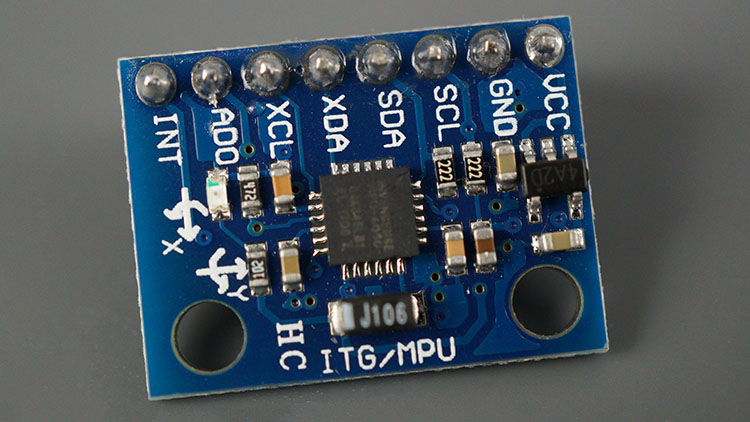
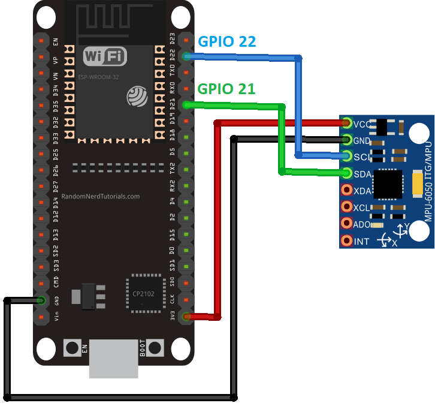

>[Torna a gateway BUS](gateway.md)

## **Gateway per BUS I2C (TwoWire)**

### **Schema di principio del BUS I2C**

Notare i **collegamenti in parallelo** tra tutti i dispositivi attorno a 3 fili (2 fili escluso massa).

 

### **Il sensore di movimento MPU6050**



### **Esempio di cablaggio**


Dal **punto di vista SW** seve **una libreria** da scaricare dentro la solita cartella **libraries** (disponibile su Git al link https://github.com/ElectronicCats/mpu6050) :
- **mpu6050-master.zip** da scompattare e rinominare semplicemente **mpu6050**. Per installare il protocollo standard I2C e il driver del sensore MPU6050.

### **Gateway I2C-MQTT per la lettura di un solo sensore**

La libreria MQTT è asincrona per cui non bloccante. E' adoperabile sia per **ESP8266** che per **ESP32**.

```C++
//#include <WiFiClientSecure.h>
#include <WiFi.h>       // per ESP32
//#include <ESP8266WiFi.h> per ESP8266
#include <AsyncMqttClient.h>
#include <Ticker.h>
#include <I2Cdev.h>
#include <Wire.h>
#include <MPU6050.h>

// Raspberry Pi Mosquitto MQTT Broker
//#define MQTT_HOST IPAddress(192, 168, 1, 254)
#define MQTT_HOST "test.mosquitto.org"
// For a cloud MQTT broker, type the domain name
//#define MQTT_HOST "example.com"
#define MQTT_PORT 1883

#define WIFI_SSID "myssid"
#define WIFI_PASSWORD "mypsw"

//Temperature MQTT Topic
#define MQTT_PUB "esp/mpu6050/"

Ticker mqttReconnectTimer;
Ticker wifiReconnectTimer;

// class default I2C address is 0x68
// specific I2C addresses may be passed as a parameter here
// AD0 low = 0x68 (default for InvenSense evaluation board)
// AD0 high = 0x69
MPU6050 accelgyro;
//MPU6050 accelgyro(0x69); // <-- use for AD0 high

int16_t ax, ay, az;
int16_t gx, gy, gz;

String datastr = "";

AsyncMqttClient mqttClient;

unsigned long previousMillis = 0;   // Stores last time temperature was published
const long interval = 4000;        // Interval at which to publish sensor readings
byte count = 0;

void connectToWifi() {
  Serial.println("Connecting to Wi-Fi...");
  WiFi.mode(WIFI_STA);
  //WiFi.disconnect();
  WiFi.begin(WIFI_SSID, WIFI_PASSWORD);
}

void connectToMqtt() {
  Serial.println("Connecting to MQTT...");
  mqttClient.connect();
}

void WiFiEvent(WiFiEvent_t event) {
  Serial.printf("[WiFi-event] event: %d\n", event);
  switch(event) {
    case SYSTEM_EVENT_STA_GOT_IP:
      Serial.println("WiFi connected");
      Serial.println("IP address: ");
      Serial.println(WiFi.localIP());
      connectToMqtt();
      break;
    case SYSTEM_EVENT_STA_DISCONNECTED:
      Serial.println("WiFi lost connection");
      mqttReconnectTimer.detach(); // ensure we don't reconnect to MQTT while reconnecting to Wi-Fi
      wifiReconnectTimer.once_ms(2000, connectToWifi);
      break;
  }
}

void onMqttConnect(bool sessionPresent) {
  Serial.println("Connected to MQTT.");
  Serial.print("Session present: ");
  Serial.println(sessionPresent);
}

void onMqttDisconnect(AsyncMqttClientDisconnectReason reason) {
  Serial.println("Disconnected from MQTT.");
  if (WiFi.isConnected()) {
    mqttReconnectTimer.once_ms(2000, connectToMqtt);
  }
}

void onMqttPublish(uint16_t packetId) {
  Serial.println("Publish acknowledged.");
  Serial.print("  packetId: ");
  Serial.println(packetId);
}

void set_sensor_offset() {
  // use the code below to change accel/gyro offset values
  Serial.println("Updating internal sensor offsets...");
    // -76  -2359 1688  0 0 0
    Serial.print(accelgyro.getXAccelOffset()); Serial.print("\t"); // -76
    Serial.print(accelgyro.getYAccelOffset()); Serial.print("\t"); // -2359
    Serial.print(accelgyro.getZAccelOffset()); Serial.print("\t"); // 1688
    Serial.print(accelgyro.getXGyroOffset()); Serial.print("\t"); // 0
    Serial.print(accelgyro.getYGyroOffset()); Serial.print("\t"); // 0
    Serial.print(accelgyro.getZGyroOffset()); Serial.print("\t"); // 0
    Serial.print("\n");
    accelgyro.setXGyroOffset(220);
    accelgyro.setYGyroOffset(76);
    accelgyro.setZGyroOffset(-85);
    Serial.print(accelgyro.getXAccelOffset()); Serial.print("\t"); // -76
    Serial.print(accelgyro.getYAccelOffset()); Serial.print("\t"); // -2359
    Serial.print(accelgyro.getZAccelOffset()); Serial.print("\t"); // 1688
    Serial.print(accelgyro.getXGyroOffset()); Serial.print("\t"); // 0
    Serial.print(accelgyro.getYGyroOffset()); Serial.print("\t"); // 0
    Serial.print(accelgyro.getZGyroOffset()); Serial.print("\t"); // 0
    Serial.print("\n");
}

void busInit(){
	// join I2C bus (I2Cdev library doesn't do this automatically)
	Wire.begin();
	// initialize device
	delay(2000);
	Serial.println("Initializing I2C devices...");
	accelgyro.initialize();
	delay(2000);
	// verify connection
	Serial.println("Testing device connections...");
	Serial.println(accelgyro.testConnection() ? "MPU6050 connection successful" : "MPU6050 connection failed");
	delay(500);
	//Set accel/gyro offsets
	set_sensor_offset();
}

void setup() {
  // Start the DS18B20 sensor
  
  Serial.begin(115200);
  Serial.println();
  Serial.println();

  WiFi.onEvent(WiFiEvent);

  mqttClient.onConnect(onMqttConnect);
  mqttClient.onDisconnect(onMqttDisconnect);
  mqttClient.onPublish(onMqttPublish);
  mqttClient.setServer(MQTT_HOST, MQTT_PORT);
  // If your broker requires authentication (username and password), set them below
  //mqttClient.setCredentials("REPlACE_WITH_YOUR_USER", "REPLACE_WITH_YOUR_PASSWORD");
  connectToWifi();
  count = 0;
  while (WiFi.status() != WL_CONNECTED && count < 10) {
    delay(500);
    count++;
    Serial.print(".");
  }
  busInit();  
}

void readData(String &str){    
    // read raw accel/gyro measurements from device

    accelgyro.getMotion6(&ax, &ay, &az, &gx, &gy, &gz);

    // these methods (and a few others) are also available
    //accelgyro.getAcceleration(&ax, &ay, &az);
    //accelgyro.getRotation(&gx, &gy, &gz);
    str = "{\"XAcc\":\"";
    str += ax;
    str += "\",\"YAcc\":\"";
    str += ay;
    str += "\",\"ZAcc\":\"";
    str += az;
    str += "\",\"XGyro\":\"";
    str += gx;
    str += "\",\"YGyro\":\"";
    str += gy;
    str += "\",\"ZGyro\":\"";
    str += gz;
    str += "\"}";
    //delay(500); 
}

void loop() {
  unsigned long currentMillis = millis();
  if (currentMillis - previousMillis >= interval) {
    previousMillis = currentMillis;
	
    Serial.print("Requesting data...");
    readData(datastr);
    Serial.println("DONE");
    
    // Publish an MQTT message on topic esp32/ds18b20/temperature    
    uint16_t packetIdPub1 = mqttClient.publish(MQTT_PUB, 1, true, datastr.c_str(), datastr.length());                           
    Serial.print("Pubblicato sul topic %s at QoS 1, packetId: ");
    Serial.println(MQTT_PUB);
    Serial.println(packetIdPub1);
    Serial.print("Messaggio inviato: ");
    Serial.println(str); 
  }
}


```
**Sitografia:**
- https://randomnerdtutorials.com/esp32-mpu-6050-web-server/


>[Torna a gateway BUS](gateway.md)
