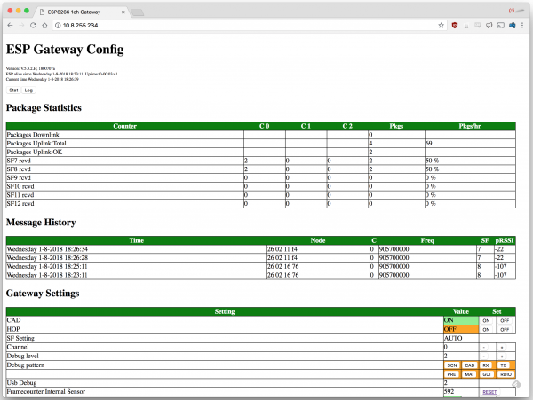

>[Torna all'indice generale](index.md)
## **Gateways LoRa-IP**

Per una discussione sintetica di tutti i tipi di BUS semplici dal punto di vista generale si rimanda a [Cablati semplici](cablatisemplici.md ).

### **1) La scheda LoRa RMF95/W**


E' un modem Lora che implementa esclusivamente il **livello fisico** dello stack LoraWan spesso indicato semplicemente come **LoRa**. Sopra di esso può essere utilizzato lo **stack applicativo LoRawan** oppure un qualsiasi altro stack (ad es. **6LowPan e REPL**). 

In ogni caso, le funzioni di **rete** ed **applicative** al di sopra del livello fisico, con il **chip RMF95/W**M vanno implementate in SW mediante apposite **librerie**. Se si vuole un **modem** che implementi **in HW** tutto lo **stack LoraWan** si guardi il modulo **Microchip RN2483**.

### **Schema cablaggio**

Il transxeiver LoRa RMF95/W deve essere interfacciato con una scheda MCU a parte. Sotto L'IDE di Arduino si possono utilizzare tutte le schede della famiglia Arduino più le schede ESP8266 e ESP32 di Espressif dotate di modulo WiFi integrato. Di seguito proponiamo un esempio con la scheda ESP32.


In questo caso transceiver Semtech SX1276 e MCU ESP32 sono già cablate insieme sulla stessa scheda. Di seguito è riportato il mappaggio del pinout del transceiver Lora su quello della MCU ESP32:
```
SX1276 pin name <--> ESP32 pin number
	ANA: 	Antenna
	GND: 	GND
	DIO3: 	don’t connect
	DIO4: 	don’t connect
	3.3V: 	3.3V
	DIO0: 	GPIO 2
	DIO1: 	don’t connect
	DIO2: 	don’t connect
	GND: 	don’t connect
	DIO5: 	don’t connect
	RESET: 	GPIO 14
	NSS: 	GPIO 5
	SCK: 	GPIO 18
	MOSI: 	GPIO 23
	MISO: 	GPIO 19
	GND: 	don’t connect
```

La lunghezza del filo dipende dalla frequenza:
- 868 MHz: 86,3 mm 
- 915 MHz: 81,9 mm
- 433 MHz: 173,1 mm

Per il nostro modulo dobbiamo utilizzare un filo da 86,3 mm saldato direttamente al pin ANA del ricetrasmettitore. Si noti che l'utilizzo di un'antenna adeguata estenderà il raggio di comunicazione.

### **2) La scheda TTGO LoRa32 SX1276 OLED**


E' una scheda che integra in un unico modulo **porte GPIO** + **transceiver SX1276** + **OLED SSD1306** da 0.96'' + **MCU ESP32**. Il  transceiver SX1276 implementa esclusivamente il **livello fisico** dello stack LoraWan spesso indicato semplicemente come **LoRa**. Sopra di esso può essere utilizzato lo **stack applicativo LoRawan** oppure un qualsiasi altro stack (ad es. **6LowPan e REPL**). 

In ogni caso, le funzioni di **rete** ed **applicative** al di sopra del livello fisico, con il **SX1276** vanno implementate in SW sulla MCU mediante apposite **librerie**. Se si vuole un **modem** che implementi **in HW** tutto lo **stack LoraWan** si guardi il modulo **Microchip RN2483**.

### **Schema cablaggio**

In questo caso transceiver Semtech SX1276 e MCU ESP32 sono già cablate insieme sulla stessa scheda. Di seguito è riportato il mappaggio del pinout del transceiver Lora su quello della MCU ESP32:
```
SX1276 pin name <--> ESP32 pin number
	MISO		GPIO 19
	MOSI		GPIO 27
	SCK		GPIO 5
	CS		GPIO 18
	IRQ		GPIO 26
	RST		GPIO 14
```

### **3) La scheda Pycom LoPy**


E' una scheda che integra in un unico modulo **porte GPIO** + **transceiver LORa/Sigfox** + **MCU ESP32**. Il  transceiver SX1276 implementa esclusivamente il **livello fisico** dello stack LoraWan spesso indicato semplicemente come **LoRa**. Sopra di esso può essere utilizzato lo **stack applicativo LoRawan** oppure un qualsiasi altro stack (ad es. **6LowPan e REPL**). 

In ogni caso, le funzioni di **rete** ed **applicative** al di sopra del livello fisico, con il **transceiver** vanno implementate in SW sulla MCU mediante apposite **librerie**. Se si vuole un **modem** che implementi **in HW** tutto lo **stack LoraWan** si guardi il modulo **Microchip RN2483**.

A causa di un paio di problemi con il design SiPy, il modulo assorbe più corrente di quanto dovrebbe mentre è in Deep Sleep. Il regolatore di commutazione DC-DC rimane sempre in modalità ad alte prestazioni, che viene utilizzata per fornire il ripple di uscita più basso possibile quando il modulo è in uso. In questa modalità assorbe una corrente di riposo di 10mA. Quando il regolatore viene messo in modalità ECO la corrente di riposo scende a 10uA. Sfortunatamente, il pin utilizzato per controllare questa modalità è fuori dal dominio RTC. Ciò significa che non è utilizzabile durante il deep sleep. Ciò fa sì che il regolatore rimanga in modalità PWM, mantenendo la sua corrente di riposo a 10 mA. Inoltre, il chip flash non entra in modalità di spegnimento poiché il pin CS è flottante durante il Deep Sleep. Ciò fa sì che il chip flash consumi circa 2 mA di corrente. Per ovviare a questo problema è disponibile uno "shield per il Deep Sleep" che si collega al modulo e consente di interrompere l'alimentazione dal dispositivo.

### **Schema cablaggio**

In questo caso transceiver LoRa e MCU ESP32 sono già cablate insieme sulla stessa scheda. Di seguito è riportato il mappaggio del pinout del transceiver Lora su quello della MCU ESP32:


### **4) La scheda Heltech Wireless Stick Lite**


### **Bande di frequenza e potenza**
```
				Lower EU	Upper EU	US (FCC)
Intervallo di frequenze		865 – 868 MHz	915 – 921 MHz	902 – 928 MHz
Potenza irradiata		2 watt		4 watt		4 watt
Canale di banda			200 kHz		400 kHz		400 kHz
```

### **Classi di servizio**

**Classe A**

La **trasmissione** del nodo in uplink è **asincrona** cioè i messaggi, dal nodo al gateway, possono essere inviati in qualsiasi momento. 

Dopo la trasmissione il nodo apre **due finestre di ricezione**. Il Network server **può rispondere** tramite un gateway con un messaggio in Downlink in una delle due finestre. Solitamente **la prima** finestra è aperta sullo stesso canale utilizzato nella trasmissione in Uplink, mentre **la seconda** finestra viene aperta su un canale differente, accordato in precedenza con il Network Server, per migliorare la resistenza alle interferenze.

**Classe B**

**Periodicamente**, ogni 128 secondi, un **nodo** riceve dal **gateway** un beacon per la **sincronizzazione** (tra nodo e gateway) e per la **schedulazione** delle ricezioni. Un **pacchetto beacon** contiene uno specifico tempo di riferimento in cui far aprire ai nodi della rete una **finestra di ricezione extra**, chiamata **ping slot**. In pratica è una multiplazione TDMA con cui, ad ogni beacon, il network server riserva uno slot temporale ai vari nodi afferenti ad un certo gateway. La posizione dello slot, nella trama tra un beacon e l'altro, viene ricalcolata ad ogni nuovo beacon per evitare errori di ricezione **sistematici**. 

La ricezione è affetta da una **latenza** piuttosto variabile e potenzialmente elevata. In compenso, il **consumo** è ancora puttosto ridotto perchè, ad ogni trama, la finestra di ricezione è una sola e molto breve.

La **trasmissione** in uplink, analogamente alla classe A, è ancora asincrona.

**Classe C**

La **finestra** di ricezione, quando il nodo non trasmette, è **sempre aperta** per cui la trasmissione in downlink da parte del network server può avvenire, in maniera completamente **asincrona**, in qualsiasi momento. La finestra di ricezione è **chiusa** soltanto durante la trasmissione. In questa modalità la **latenza** è minima ma il **consumo** è massimo per cui si tratta di un modo di funzionamento adatto a dispositivi perennemente connessi ad una fonte di **alimentazione persistente** (rete elettrica, panneli solari).

**ALOHA**

In tutte le classi l'**accesso multiplo** al canale in **uplink** è un TDM a contesa random di tipo **ALOHA**.


### **Modi di autenticazione**

**Attivazione via etere (OTAA)**

L'**attivazione over-the-air (OTAA)** è il modo preferito e più sicuro per connettersi con The Things Network. I dispositivi eseguono una procedura di unione con la rete (join), durante la quale viene assegnato un **DevAddr** dinamico e le **chiavi** di sicurezza vengono **negoziate** con il dispositivo.

**Attivazione tramite personalizzazione (ABP)**

In alcuni casi potrebbe essere necessario codificare il **DevAddr** e le **chiavi di sicurezza** hardcoded nel dispositivo. Ciò significa attivare un dispositivo **tramite personalizzazione (ABP)**. Questa strategia potrebbe sembrare più semplice, perché si salta la procedura di adesione, ma presenta alcuni svantaggi legati alla sicurezza.

**ABP vs OTAA**

In generale, non ci sono inconvenienti nell'utilizzo dell'OTAA rispetto all'utilizzo dell'ABP, ma ci sono alcuni requisiti che devono essere soddisfatti quando si utilizza l'OTAA.La specifica LoRaWAN avverte in modo specifico contro il ricongiungimento sistematico in caso di guasto della rete. Un dispositivo dovrebbe conservare il risultato di un'attivazione in una memoria permanente se si prevede che il dispositivo venga spento e riacceso durante la sua vita:
- un dispositivo ABP utilizza una memoria non volatile per mantenere i contatori di frame tra i riavvii. 
- Un approccio migliore sarebbe passare all'utilizzo di OTAA e memorizzare la sessione OTAA anziché i contatori di frame.

L'unica cosa da tenere a mente è che un join OTAA richiede che il dispositivo finale si trovi all'interno della copertura della rete su cui è registrato. La ragione di ciò è che la procedura di join OTAA richiede che il dispositivo finale sia in grado di ricevere il messaggio di downlink Join Accept dal server di rete.

Un approccio migliore consiste nell'eseguire un join OTAA in una fabbrica o in un'officina in cui è possibile garantire la copertura di rete e i downlink funzionanti. Non ci sono svantaggi in questo approccio finché il dispositivo segue le migliori pratiche LoRaWAN (https://www.thethingsindustries.com/docs/devices/best-practices/).

### **Buone pratiche**

**Connessioni confermate**

È possibile che non si riceva subito un ACK per ogni uplink o downlink di tipo confermato. Una buona regola empirica è attendere almeno tre ACK mancati per presumere la perdita del collegamento.

In caso di perdita del collegamento, procedere come segue:
- Imposta la potenza TX al massimo consentito/supportato e riprova
- Diminuisci gradualmente la velocità dei dati e riprova
- Ripristina i canali predefiniti e riprova
- Invia richieste di adesione periodiche con backoff

**Cicli di alimentazione**

I dispositivi dovrebbero salvare i parametri di rete tra i cicli di alimentazione regolari. Ciò include parametri di sessione come DevAddr, chiavi di sessione, FCnt e nonces. Ciò consente al dispositivo di unirsi facilmente, poiché chiavi e contatori rimangono sincronizzati.

### **Architettura di riferimento per IoT**

L'**architettura tipica del SW** a bordo di un dispositivo IoT è riassumibile:


Il **middleware** in genere è composto da **librerie di terze parti** da **compilare** all'interno di un **IDE** (ad es. Arduino) o all'interno di un **SDK** cioè un pacchetto di sviluppo per applicazioni che fornisce vari strumenti per compilazione, debug e documentazione (ad es. AWS IoT, Azure IoT, ESP-IDF). Oppure esistono **framework** specifici per IoT Open Source come RIOT che, una volta compilati su una macchina Linux, forniscono veri e propri **SO per IoT** con esattamente ciò che serve per la **comunicazione** di un certo dispositivo.

### **Librerie del progetto**

In questo caso gran parte delle funzioni del middleware, quelle relative alla comunicazione via stack LoRaWan, è implementato all'interno del sistema a microprocessore (MCU). Nello specifico, le funzioni di livello applicativo, che in ambito IoT, sono tutte quelle comprese tra il livello 2 e il livello 7 ISO/OSI sono compito della MCU mentre il livello fisico è realizzato in HW dal chip del modem.

Dal **punto di vista SW** servono delle **librerie** da scaricare dentro la solita cartella **libraries**:
- **Single Channel LoRaWAN Gateway**. Si scarica da https://github.com/things4u/ESP-1ch-Gateway come ESP-1ch-Gateway-master.zip da scompattare e rinominare semplicemente come **ESP-1ch-Gateway**
- **Arduino Time Library**. Si scarica da https://github.com/PaulStoffregen/Time come Time-master.zip da scompattare e rinominare semplicemente come **Time**
- **ArduinoJson**. Si scarica da https://github.com/bblanchon/ArduinoJson come ArduinoJson-6.x.zip da scompattare e rinominare semplicemente come **ArduinoJson-6.x**
- **arduino-base64**. Si scarica da https://github.com/adamvr/arduino-base64 come arduino-base64-master.zip da scompattare e rinominare semplicemente come **arduino-base64**
- **Streaming**. Si scarica dahttp://arduiniana.org/libraries/streaming/ come Streaming5.zip da scompattare e rinominare semplicemente come **Streaming**. Attenzione che dentro la cartella Streaming5 ci ata la cartella Streaming da scompattare.

Le librerie esposte sopra possono essere recuperate e copiate nella libraries prendendole da: \ESP-1ch-Gateway\lib

### **File di configurazione**

Prima di caricare lo schetch **ESP-1ch-Gateway.ino** sulla tua scheda, dovrai apportare alcune modifiche a un paio di file. Ecco una rapida panoramica:

**ESP-sc-gway.h**

Questo file è la principale fonte di configurazione per lo sketch del gateway. Le definizioni che probabilmente dovrai modificare sono:

- **Radio**. 
	- **_LFREQ** -- Imposta la gamma di frequenza su cui comunicherà la radio. Impostalo su 433 (Asia), 868 (UE) o 915 (USA)
    	- **_SPREADING** -- Imposta il fattore di diffusione LoRa. È possibile utilizzare SF7, SF8, SF9, SF10, SF11 o SF12. Tieni presente che ciò influirà sui dispositivi con cui il tuo gateway può comunicare.
    - **_CAD** -- Rilevamento dell'attività del canale. Se abilitato (impostato a 1) CAD consentirà al gateway di monitorare i messaggi inviati a qualsiasi fattore di diffusione. Il compromesso se abilitato: i segnali molto deboli potrebbero non essere captati dalla radio.
- **Hardware**
	- **OLED:** se la scheda non include un OLED, impostalo su 0.
	- **_PIN_OUT**: configura l'SPI e altre impostazioni hardware. Impostalo su 6, aggiungeremo una definizione hardware personalizzata in seguito.
	- **CFG_sx1276_radio**: assicurati che sia definito e che CFG_sx1272_radio non lo sia. Serve a configura la radio LoRa collegata a ESP32.
- **The Things Network (TTN)**
	- **_TTNSERVER** -- Il server per il tuo router LoRa. Per esempio. "router.eu.thethings.network" o "us-west.thethings.network"
	- **_TTNPORT** -- 1700 è la porta standard per TTN
	- **_DESCRIPTION** -- Personalizza il nome del tuo gateway
	- **_EMAIL** -- Il tuo indirizzo email, o quello del proprietario del gateway
	- **_LAT** e **_LON** -- Coordinate GPS del tuo gateway
- **Wifi**
	- Aggiungi almeno una rete WiFi all'array ```wpas wpa[]```, ma lascia vuota la prima voce. Per esempio:
	
```C++
	wpas wpa[] = {
	  { "" , "" },  // Reserved for WiFi Manager
	  { "my_wifi_network", "my_wifi_password" }
	};
```

**loramodem.h**

Questo file definisce come è configurato il modem LoRa, inclusi quali canali di frequenza può utilizzare e quali pin utilizza ESP32 per comunicare con esso. 

Introdurre eventuali modifiche sapendo bene cosa si sta facendo, in ogni caso, una sezione che va modificata obbligatoriamente è la dichiarazione **_PIN_OUT**.

Innanzitutto, trova la riga che dice ```#error "Pin Definitions _PIN_OUT deve essere 1(HALLARD) o 2 (COMRESULT)"``` ed eliminala. Quindi copia e incolla queste righe al suo posto (tra ```#else e #endif```):

```C++
struct pins {
  uint8_t dio0 = 26;
  uint8_t dio1 = 33;
  uint8_t dio2 = 32;
  uint8_t ss = 16;
  uint8_t rst = 27; // Reset not used
} pins;
#define SCK  14
#define MISO 12
#define MOSI 13
#define SS  16
#define DIO0 26
```

L'array ```int freqs[]``` può essere impostato, se si desidera utilizzare sottobande diverse, ma, oltre a ciò, non c'è molto altro qui che consigliamo di modificare.

### **Caricamento dello scketch**

Con le modifiche apportate, prova a compilare e caricare lo schetch sul tuo ESP32. Dopo che è stato caricato, apri il tuo monitor seriale e imposta la velocità di trasmissione su 115200. I messaggi di debug qui possono essere molto utili e trovare l'**indirizzo IP del tuo gateway** è fondamentale se vuoi monitorare il server web.

Lo schetch potrebbe richiedere molto tempo per la configurazione iniziale: **formatterà** il file **system SPIFFS** e creerà un **file di configurazione** non volatile. Una volta completato, dovresti vedere il tentativo di ESP32 di connettersi alla tua rete WiFi, quindi potrai inizializzare la radio.

Dopo che ESP32 si è connesso, cercalo per stampare un indirizzo IP. Apri il browser web del tuo computer e metti l'IP della scheda sulla barra degli indirizzi. Dovresti essere accolto dal portale web ESP Gateway Config:



Questa pagina Web può essere utilizzata per **monitorare** i messaggi in arrivo e su quali **frequenze** e **fattori di diffusione** sono arrivati. 

Può anche essere utilizzata per modificare al volo la **configurazione del gateway**. È possibile regolare il **canale** o il **fattore di diffusione**, o attivare/disattivare **CAD**, o anche attivare il **salto di frequenza**.

Ovviamente, per vedere i messaggi passare avrai bisogno di un dispositivo LoRa (o device_s_) configurato per comunicare con il tuo gateway. 

### **Codice di esempio**

Per vedere un codice di esempio, aprire il file **ESP-sc-gway.ino**:

```C++
// 1-channel LoRa Gateway for ESP8266 and ESP32
// Copyright (c) 2016-2021 Maarten Westenberg
// Author: Maarten Westenberg (mw12554@hotmail.com)
//
// Based on work done by Thomas Telkamp for Raspberry PI 1-ch gateway and many others.
//
// All rights reserved. This program and the accompanying materials
// are made available under the terms of the MIT License
// which accompanies this distribution, and is available at
// https://opensource.org/licenses/mit-license.php
//
// NO WARRANTY OF ANY KIND IS PROVIDED
//
// The protocols and specifications used for this 1ch gateway: 
// 1. LoRA Specification version V1.0 and V1.1 for Gateway-Node communication
//	
// 2. Semtech Basic communication protocol between Lora gateway and server version 3.0.0
//	https://github.com/Lora-net/packet_forwarder/blob/master/PROTOCOL.TXT
//
// Notes: 
// - Once call hostbyname() to get IP for services, after that only use IP
//	 addresses (too many gethost name makes the ESP unstable)
// - Only call yield() in main stream (not for background NTP sync). 
//
// ----------------------------------------------------------------------------------------
#define ARDUINO_ARCH_ESP32 1
#define  _OLED 0
#define _GATEWAYNODE 0


#if defined (ARDUINO_ARCH_ESP32) || defined(ESP32)
#	define ESP32_ARCH 1
#	ifndef _PIN_OUT
#		define _PIN_OUT 4									// For ESP32 pin-out 4 is default
#	endif
#elif defined(ARDUINO_ARCH_ESP8266)
	//
#else
#	error "Architecture unknown and not supported"
#endif

// The followion file contains most of the definitions
// used in other files. It should be the first file.
#include "configGway.h"										// contains the configuration data of GWay
#include "configNode.h"		
#include "ESP-sc-gway.h"								// Contains the personal data of Wifi etc.
/*
#include <Esp.h>											// ESP8266 specific IDE functions
#include <string.h>
#include <stdio.h>
#include <sys/types.h>
#include <unistd.h>
#include <fcntl.h>
#include <cstdlib>
#include <sys/time.h>
#include <cstring>
#include <string>											// C++ specific string functions
*/
#include <SPI.h>											// For the RFM95 bus
#include <TimeLib.h>										// http://playground.arduino.cc/code/time
#include <ArduinoJson.h>
//#include <FS.h>												// ESP8266 Specific
#include <WiFiUdp.h>
#include <pins_arduino.h>
#include <gBase64.h>										// https://github.com/adamvr/arduino-base64 (changed the name)

// Local include files
#include "loraModem.h"
#include "loraFiles.h"
#include "oLED.h"
/*
"C" {
#	include "lwip/err.h"
#	include "lwip/dns.h"
}
*/
#if (_GATEWAYNODE==1) || (_LOCALSERVER>=1)
#	include "AES-128_V10.h"
#endif

// ----------- Specific ESP32 stuff --------------
#if defined(ESP32_ARCH)
#	include <WiFi.h>
#	include <ESPmDNS.h>
#	include <SPIFFS.h>
//#	include <WiFiManager.h>									// Standard lib for ESP WiFi config through an AP

#	define ESP_getChipId()   ((uint32_t)ESP.getEfuseMac())

#	if _SERVER==1
#		include <WebServer.h>								// Standard Webserver for ESP32
#		include <Streaming.h>          						// http://arduiniana.org/libraries/streaming/
		WebServer server(_SERVERPORT);
#	endif //_SERVER

#	if _OTA==1
//#		include <ESP32httpUpdate.h>							// Not yet available
#		include <ArduinoOTA.h>
#	endif //_OTA


// ----------- Specific ESP8266 stuff --------------
#elif defined(ARDUINO_ARCH_ESP8266)
	"C" {
#		include "user_interface.h"
#		include "c_types.h"
	}
#	include <ESP8266WiFi.h>									// Which is specific for ESP8266
#	include <ESP8266mDNS.h>
#	include <WiFiManager.h>									// Library for ESP WiFi config through an AP

#	define ESP_getChipId()   (ESP.getChipId())

#	if _SERVER==1
#		include <ESP8266WebServer.h>
#		include <Streaming.h>          						// http://arduiniana.org/libraries/streaming/
		ESP8266WebServer server(_SERVERPORT);				// Standard IDE lib
#	endif //_SERVER

#	if _OTA==1
#		include <ESP8266httpUpdate.h>
#		include <ArduinoOTA.h>
#	endif //_OTA
					

#else
#	error "Architecture not supported"

#endif


#include <DNSServer.h>										// Local DNSserver


// ----------- Declaration of variables --------------

uint8_t debug=1;											// Debug level! 0 is no msgs, 1 normal, 2 extensive
uint8_t pdebug= P_MAIN ;									// Initially only MAIN and GUI
uint32_t txDones=0;											// Count the number of TXDONE calls in stateMachine for a send

#if _GATEWAYNODE==1
#	if _GPS==1
#		include <TinyGPS++.h>
		TinyGPSPlus gps;
		HardwareSerial sGps(1);
#	endif //_GPS
#endif //_GATEWAYNODE

using namespace std;

bool		sx1276 = true;									// Actually we use sx1276/RFM95
uint8_t		MAC_array[6];
uint8_t		currentMode = 0x81;

// ----------------------------------------------------------------------------
//
// Configure these values only if necessary!
//
// ----------------------------------------------------------------------------

uint8_t protocol	= _PROTOCOL;

// Set spreading factor (SF7 - SF12)
sf_t sf 			= _SPREADING;							// Initial value of SF					

// Set location, description and other configuration parameters
// Defined in ESP-sc_gway.h
//
float lat			= _LAT;									// Configuration specific info...
float lon			= _LON;
int   alt			= _ALT;
char platform[24]	= _PLATFORM; 							// platform definition
char email[40]		= _EMAIL;    							// used for contact email
char description[64]= _DESCRIPTION;							// used for free form description 

// JSON definitions
StaticJsonDocument<312> jsonBuffer;							// Use of arduinoJson version 6!
	
// define servers

IPAddress ntpServer;										// IP address of NTP_TIMESERVER
IPAddress ttnServer;										// IP Address of thethingsnetwork server
IPAddress thingServer;										// Only if we use a second (backup) server

WiFiUDP Udp;

time_t startTime = 0;										// The time in seconds since 1970 that the server started. 
uint32_t eventTime = 0;										// Timing of _event to change value (or not).
uint32_t sendTime = 0;										// Time that the last message transmitted
uint32_t doneTime = 0;										// Time to expire when CDDONE takes too long
uint32_t statTime = 0;										// last time we sent a stat message to server
uint32_t pullTime = 0;										// last time we sent a pull_data request to server
uint32_t rstTime  = 0;										// When to reset the timer
uint32_t fileTime = 0;										// Write the configuration to file

#define TX_BUFF_SIZE  1024									// Upstream buffer to send to MQTT
#define RX_BUFF_SIZE  1024									// Downstream received from MQTT
#define STATUS_SIZE	  512									// Should(!) be enough based on the static text .. was 1024

#if _SERVER==1
	uint32_t wwwtime = 0;
#endif
#if _NTP_INTR==0
	uint32_t ntptimer = 0;
#endif
#if _GATEWAYNODE==1
	uint16_t LoraUp.fcnt = 0;								// We write this to SPIFF file
	uint16_t LoraDown.fcnt = 0;								// LoraDown framecount init 0
#endif
#ifdef _PROFILER
	uint32_t endTmst=0;
#endif

// Init the indexes of the data we display on the webpage
// We use this for circular buffers
uint16_t iMoni=0;
uint16_t iSeen=0;
uint16_t iSens=0;

// volatile bool inSPI This initial value of mutex is to be free,
// which means that its value is 1 (!)
// 
int16_t mutexSPI = 1;

uint8_t buff[64]; 											// Buffer to use for sx1276, set to 64 characters
uint8_t buff_down[TX_BUFF_SIZE];							// Buffer for downstream
IPAddress remoteIpNo;
unsigned int remotePortNo;


// ----------------------------------------------------------------------------
// FORWARD DECLARATIONS
// These forward declarations are done since other .ino fils are linked by the
// compiler/linker AFTER the main ESP-sc-gway.ino file. 
// And espcecially when calling functions with ICACHE_RAM_ATTR the complier 
// does not want this.
// Solution can also be to specify less STRICT compile options in Makefile
// ----------------------------------------------------------------------------


#if _MUTEX==1
	void ICACHE_FLASH_ATTR CreateMutux(int *mutex);
	bool ICACHE_FLASH_ATTR GetMutex(int *mutex);
	void ICACHE_FLASH_ATTR ReleaseMutex(int *mutex);
#endif


// ============================================================================
// MAIN PROGRAM CODE (SETUP AND LOOP)


// ----------------------------------------------------------------------------
// Setup code (one time)
// _state is S_INIT
// ----------------------------------------------------------------------------
void setup() {

	char MAC_char[19];										// XXX Unbelievable
	MAC_char[18] = 0;
	char hostname[12];										// hostname space

	initDown(&LoraDown);
	initConfig(&gwayConfig);
		
#	if _DUSB>=1
		Serial.begin(_BAUDRATE);							// As fast as possible for bus
		delay(500);
		Serial.flush();
#	endif //_DUSB

#	if _OLED>=1
		init_oLED();										// When done display "STARTING" on Oled
#	endif //_OLED

#	if _GPS==1
		// Pins are defined in LoRaModem.h together with other pins
		sGps.begin(9600, SERIAL_8N1, GPS_TX, GPS_RX);		// PIN 12-TX 15-RX
#	endif //_GPS

	delay(500);

	if (SPIFFS.begin()) {
#		if _MONITOR>=1
		if ((debug>=1) && (pdebug & P_MAIN)) {
			mPrint(F("SPIFFS begin"));
		}
#		endif //_MONITOR
	}
	else {													// SPIFFS not found
		if (pdebug & P_MAIN) {
			mPrint(F("SPIFFS not found, formatting"));
		}
		msg_oLED("FORMAT");
		SPIFFS.format();
		delay(500);
		initConfig(&gwayConfig);							// After a format reinit variables
	}
	
	// If we set SPIFFS_FORMAT in 
#	if _SPIFFS_FORMAT>=1
	msg_oLED("FORMAT");
	SPIFFS.format();										// Normally disabled. Enable only when SPIFFS corrupt
	delay(500);
	initConfig(&gwayConfig);
	gwayConfig.formatCntr++;
	if ((debug>=1) && (pdebug & P_MAIN)) {
		mPrint("SPIFFS Format Done");
	}
#	endif //_SPIFFS_FORMAT>=1

#	if _MONITOR>=1
		msg_oLED("MONITOR");
		initMonitor(monitor);
		
#		if defined CFG_noassert
			mPrint("No Asserts");
#		else
			mPrint("Do Asserts");
#		endif //CFG_noassert
#	endif //_MONITOR

	delay(500);
	
	// Read the config file for all parameters not set in the setup() or configGway.h file
	// This file should be read just after SPIFFS is initializen and before
	// other configuration parameters are used.
	// It will overwrite any settings given by initConfig
	//
	if (readGwayCfg(_CONFIGFILE, &gwayConfig) > 0) {			// read the Gateway Config
#		if _MONITOR>=1
		if (debug>=0) {
			mPrint("readGwayCfg:: return OK");
		}
#		endif
	}
	else {
#		if _MONITOR>=1
		if (debug>=0) {
			mPrint("setup:: readGwayCfg: ERROR readGwayCfg Failed");
		}
#		endif	
	};							
	delay(500);

#	if _WIFIMANAGER==1
		msg_oLED("WIFIMGR");
#		if _MONITOR>=1
			mPrint(F("setup:: WiFiManager"));
#		endif //_MONITOR
		delay(500);
	
		wifiMgr();
#	endif //_WIFIMANAGER

	msg_oLED("WIFI STA");
	WiFi.mode(WIFI_STA);									// WiFi settings for connections
	WiFi.setAutoConnect(true);
	WiFi.macAddress(MAC_array);
    sprintf(MAC_char,"%02x:%02x:%02x:%02x:%02x:%02x",
		MAC_array[0],MAC_array[1],MAC_array[2],MAC_array[3],MAC_array[4],MAC_array[5]);

#	if _MONITOR>=1
		mPrint("MAC: " + String(MAC_char) + ", len=" + String(strlen(MAC_char)) );
#	endif //_MONITOR


	// Setup WiFi UDP connection. Give it some time and retry x times. '0' means try forever
	while (WlanConnect(0) <= 0) {
#		if _MONITOR>=1
		if ((debug>=0) && (pdebug & P_MAIN)) {
			mPrint("setup:: Error Wifi network connect(0)");
		}
#		endif //_MONITOR
	}

	yield();

#	if _MONITOR>=1
	if ((debug>=1) & (pdebug & P_MAIN)) {
		mPrint("setup:: WlanConnect="+String(WiFi.SSID()) );
	}
#	endif
	
	// After there is a WiFi router connection, we set the hostname with last 3 bytes of MAC address.
#	if defined(ESP32_ARCH)
		// ESP32
		sprintf(hostname, "%s%02x%02x%02x", "esp32-", MAC_array[3], MAC_array[4], MAC_array[5]);
		WiFi.setHostname(hostname);
		MDNS.begin(hostname);
#	else
		//ESP8266
		sprintf(hostname, "%s%02x%02x%02x", "esp8266-", MAC_array[3], MAC_array[4], MAC_array[5]);
		wifi_station_set_hostname(hostname);
#	endif	//ESP32_ARCH

#	if _MONITOR>=1
	if (debug>=0) {
		String response = "Host=";
#		if defined(ESP32_ARCH)
			response += String(WiFi.getHostname());
#		else
			response += String(wifi_station_get_hostname());
#		endif //ESP32_ARCH

		response += " WiFi Connected to " + String(WiFi.SSID());
		response += " on IP=" + String(WiFi.localIP().toString() );
		mPrint(response);
	} 
#	endif //_MONITOR

	delay(500);
	// If we are here we are connected to WLAN
	
#	if _UDPROUTER==1
		// So now test the UDP function
		if (!connectUdp()) {
#			if _MONITOR>=1
				mPrint("Error connectUdp");
#			endif //_MONITOR
		}
#	elif _TTNROUTER==1
		if (!connectTtn()) {
#			if _MONITOR>=1
				mPrint("Error connectTtn");
#			endif //_MONITOR
		}
#	else
#		if _MONITOR>=1
			mPrint("Setup:: ERROR, No Router Connection defined");
#		endif //_MONITOR	
#	endif //_UDPROUTER

	delay(200);
	
	// Pins are defined and set in loraModem.h
    pinMode(pins.ss, OUTPUT);
	pinMode(pins.rst, OUTPUT);
    pinMode(pins.dio0, INPUT);								// This pin is interrupt
	pinMode(pins.dio1, INPUT);								// This pin is interrupt
	//pinMode(pins.dio2, INPUT);								// XXX future expansion


#if defined(ESP32_ARCH)
	SPI.begin(SCK, MISO, MOSI, SS);							// Init the SPI pins
#else
	SPI.begin();
#endif //ESP32_ARCH
	// define the SPI settings for reading/writing messages
	SPISettings settings(SPISPEED, MSBFIRST, SPI_MODE0);
	SPI.beginTransaction(settings);

	delay(500);
	
	// We choose the Gateway ID to be the Ethernet Address of our Gateway card
    // display results of getting hardware address
	//
#	if _MONITOR>=1
	if (debug>=0) {
		String response= "Gateway ID: ";
		printHexDigit(MAC_array[0], response);
		printHexDigit(MAC_array[1], response);
		printHexDigit(MAC_array[2], response);
		printHexDigit(0xFF,			response);
		printHexDigit(0xFF,			response);
		printHexDigit(MAC_array[3], response);
		printHexDigit(MAC_array[4], response);
		printHexDigit(MAC_array[5], response);

		response += ", Listening at SF" + String(sf) + " on ";
		response += String(freqs[gwayConfig.ch].upFreq) + " Hz.";
		mPrint(response);
	}
#	endif //_MONITOR

	// ---------- TIME -------------------------------------
	msg_lLED("GET TIME",".");
	ntpServer = resolveHost(NTP_TIMESERVER, 15);
	if (ntpServer.toString() == "0:0:0:0")	{					// Experimental
#		if _MONITOR>=1
			mPrint("setup:: NTP Server not found, found="+ntpServer.toString());
#		endif
		delay(10000);											// Delay 10 seconds
		ntpServer = resolveHost(NTP_TIMESERVER, 10);
	}

	// Set the NTP Time
	// As long as the time has not been set we try to set the time.
#	if _NTP_INTR==1
		setupTime();											// Set NTP time host and interval
		
#	else //_NTP_INTR
	{
		// If not using the standard libraries, do manual setting
		// of the time. This method works more reliable than the 
		// interrupt driven method.
		String response = ".";
		while (timeStatus() == timeNotSet) {					// time still 1/1/1970 and 0:00 hrs

			time_t newTime;
			if (getNtpTime(&newTime)<=0) {
#				if _MONITOR>=1
				if (debug>=0) {
					mPrint("setup:: ERROR Time not set (yet). Time="+String(newTime) );
				}
#				endif //_MONITOR
				response += ".";
				msg_lLED("GET TIME",response);
				delay(800);
				continue;
			}
			response += ".";
			msg_lLED("GET TIME",response);
			delay(1000);
			setTime(newTime);
		}
		
		// When we are here we succeeded in getting the time
		startTime = now();										// Time in seconds
#		if _MONITOR>=1
		if (debug>=0) {
			String response= "Time set=";
			stringTime(now(),response);
			mPrint(response);
		}
#		endif //_MONITOR

		writeGwayCfg(_CONFIGFILE, &gwayConfig );
	}
#	endif //_NTP_INTR

	delay(100);


#if _GWAYSCAN==1
	mPrint("setup:: _GWAYSCAN=1: Setup OK");

#else

	// ---------- TTNSERVER or THINGSERVER -------------------------------	
#	ifdef _TTNSERVER
		ttnServer = resolveHost(_TTNSERVER, 10);			// Use DNS to get server IP
		if (ttnServer.toString() == "0:0:0:0") {			// Experimental
#			if _MONITOR>=1
			if (debug>=1) {
				mPrint("setup:: TTN Server not found");
			}
#			endif
			delay(10000);									// Delay 10 seconds
			ttnServer = resolveHost(_TTNSERVER, 10);
		}	
		delay(100);
#	endif //_TTNSERVER

#	ifdef _THINGSERVER
		thingServer = resolveHost(_THINGSERVER, 10);		// Use DNS to get server IP
		delay(100);
#	endif //_THINGSERVER

#endif //_GWAYSCAN

	// The Over the Air updates are supported when we have a WiFi connection.
	// The NTP time setting does not have to be precise for this function to work.
#if _OTA==1
	setupOta(hostname);										// Uses wwwServer 
#endif //_OTA

	readSeen(_SEENFILE, listSeen);							// read the seenFile records

#if _SERVER==1	
	// Setup the webserver
	setupWWW();
#endif //_SERVER

	delay(100);												// Wait after setup
	
	// Setup and initialise LoRa state machine of _loraModem.ino
	_state = S_INIT;
	initLoraModem();
	
	if (gwayConfig.cad) {
		_state = S_SCAN;
		sf = SF7;
		cadScanner();										// Always start at SF7
	}
	else { 
		_state = S_RX;
		rxLoraModem();
	}
	LoraUp.payLoad[0]= 0;
	LoraUp.size = 0;										// Init the length to 0

	// init interrupt handlers, which are shared for GPIO15 / D8, 
	// we switch on HIGH interrupts
	if (pins.dio0 == pins.dio1) {
		attachInterrupt(pins.dio0, Interrupt_0, RISING);	// Share interrupts
	}
	// Or in the traditional Comresult case
	else {
		attachInterrupt(pins.dio0, Interrupt_0, RISING);	// Separate interrupts
		attachInterrupt(pins.dio1, Interrupt_1, RISING);	// Separate interrupts
		//attachInterrupt(pins.dio2, Interrupt_2, RISING);	// Separate interrupts		
	}

	writeConfig(_CONFIGFILE, &gwayConfig);					// Write config
	printSeen(_SEENFILE, listSeen);							// Write the last time record  is seen

	// activate Oled display
#	if _OLED>=1
		acti_oLED();
		addr_oLED();
#	endif //_OLED

	writeRegister(REG_IRQ_FLAGS_MASK, (uint8_t) 0x00);		// Allow all
	writeRegister(REG_IRQ_FLAGS, (uint8_t) 0xFF);			// Reset all interrupt flags

	// Now print a few registers
#	define printReg(x) {int i=readRegister(x); if(i<=0x0F) Serial.print('0'); Serial.print(i,HEX);}
	Serial.print("RegInvertiQ :: "); printReg(REG_INVERTIQ);  Serial.println();
	Serial.print("RegInvertiQ2:: "); printReg(REG_INVERTIQ2); Serial.println();

	mPrint(" --- Setup() ended, Starting loop() ---");

}//setup


// ----------------------------------------------------------------------------
// LOOP
// This is the main program that is executed time and time again.
// We need to give way to the backend WiFi processing that 
// takes place somewhere in the ESP8266 firmware and therefore
// we include yield() statements at important points.
//
// Note: If we spend too much time in user processing functions
// and the backend system cannot do its housekeeping, the watchdog
// function will be executed which means effectively that the 
// program crashes.
// We use yield() to avoid ANY watch dog activity of the program.
//
// NOTE2: For ESP make sure not to do large array declarations in loop();
// ----------------------------------------------------------------------------
void loop ()
{
	int packetSize;
	uint32_t nowSeconds = now();
	
	// If we are not connected, try to connect.
	// We will not read Udp in this loop cycle if not connected to Wlan
	if (WlanConnect(1) < 0) {
#		if _MONITOR>=1
		if ((debug>=0) && (pdebug & P_MAIN)) {
			mPrint("loop:: ERROR reconnect WLAN");
		}
#		endif //_MONITOR
		yield();
		return;												// Exit loop if no WLAN connected
	} //WlanConnect()

	yield();												// 200403 to make sure UDP buf filled

	// So if we are connected 
	// Receive UDP PUSH_ACK messages from server. (*2, par. 3.3)
	// This is important since the TTN broker will return confirmation
	// messages on UDP for every message sent by the gateway. So we have to consume them.
	// As we do not know when the server will respond, we test in every loop.
	//
	while( (packetSize= Udp.parsePacket()) > 0) {
#		if _MONITOR>=1
		if ((debug>=3) && (pdebug & P_TX)) {
			mPrint("loop:: readUdp available");
		}
#		endif //_MONITOR

		// DOWNSTREAM
		// Packet may be PUSH_ACK (0x01), PULL_ACK (0x03) or PULL_RESP (0x04)
		// This command is found in byte 4 (buffer[3])
		// Only PULL_RESP carries more data for sensor and needs action,
		// others are for Gateway only.
		//
		if (readUdp(packetSize) < 0) {
#			if _MONITOR>=1
			if (debug>=0)
				mPrint("v readUdp ERROR, returning < 0");
#			endif //_MONITOR
			break;
		}
		// Now we know we succesfully received message from host
		// If return value is 0, we received a NTP message,
		// otherwise a UDP message with other TTN content, all ACKs are 4 bytes long
		else {
			//_event=1;										// Could be done double if more messages received
			//mPrint("v udp received="+String(micros())+", packetSize="+String(packetSize));
		}
	}

	yield();

	// check for event value, which means that an interrupt has arrived.
	// In this case we handle the interrupt ( e.g. message received)
	// in userspace in loop().
	//
	stateMachine();											// do the state machine
	
	// After a quiet period, make sure we reinit the modem and state machine.
	// The interval is in seconds (about 15 seconds) as this re-init
	// is a heavy operation. 
	// So it will kick in if there are not many messages for the gateway.
	// Note: Be careful that it does not happen too often in normal operation.
	//
	if ( ((nowSeconds - statr[0].time) > _MSG_INTERVAL) &&
		(msgTime <= statr[0].time) ) 
	{
#		if _MONITOR>=1
		if ((debug>=2) && (pdebug & P_MAIN)) {
			String response="";
			response += "REINIT:: ";
			response += String( _MSG_INTERVAL );
			response += (" ");
			mStat(0, response);
			mPrint(response);
		}
#		endif //_MONITOR

		yield();											// Allow buffer operations to finish

		if ((gwayConfig.cad) || (gwayConfig.hop)) {
			_state = S_SCAN;
			sf = SF7;
			cadScanner();
		}
		else {
			_state = S_RX;
			rxLoraModem();
		}

		msgTime = nowSeconds;
	}

#	if _OTA==1
	// Perform Over the Air (OTA) update if enabled and requested by user.
	// It is important to put this function early in loop() as it is
	// not called frequently but it should always run when called.
	//
	yield();
	ArduinoOTA.handle();
#	endif //_OTA

	// If event is set, we know that we have a (soft) interrupt.
	// After all necessary web/OTA services are scanned, we will
	// reloop here for timing purposes. 
	// v as less yield() as possible.
	if (_event == 1) {
		return;
	}
	else yield();

#	if _SERVER==1
	// Handle the Web server part of this sketch. Mainly used for administration 
	// and monitoring of the node. This function is important so it is called at the
	// start of the loop() function.
	server.handleClient();
#	endif //_SERVER


	// stat PUSH_DATA message (*2, par. 4)
	// Down send to server
	//	
    if ((nowSeconds - statTime) >= _STAT_INTERVAL) {		// Wake up every xx seconds
		yield();											// on 26/12/2017
        sendStat();											// Show the status message and send to server
#		if _MONITOR>=1
		if ((debug>=2) && (pdebug & P_MAIN)) {
			mPrint("Send Pushdata sendStat");
		}
#		endif //_MONITOR

		// If the gateway behaves like a node, we do from time to time
		// send a node message to the backend server.
		// The Gateway node message has nothing to do with the STAT_INTERVAL
		// message but we schedule it in the same frequency.
		//
#		if _GATEWAYNODE==1
		if (gwayConfig.isNode) {
			// Give way to internal some Admin if necessary
			yield();

			// If the 1ch gateway is a sensor itself, send the sensor values
			// could be battery but also other status info or sensor info

			if (sensorPacket() < 0) {
#				if _MONITOR>=1
				if ((debug>=1) || (pdebug & P_MAIN)) {
					mPrint("sensorPacket: Error");
				}
#				endif //_MONITOR
			}
		}
#		endif//_GATEWAYNODE
		statTime = nowSeconds;
    }


	// send PULL_DATA message (*2, par. 4)
	//
	// This message will also restart the server which taken approx. 3 ms.
	// Byte 0:		Prtocol Version
	// Byte 1-2:	Arbritary Token Value
	// Byte 3:		PULL_DATA ident ==0x02
	// Byte 4-7:	Gateway EUI
	//
	nowSeconds = now();
    if ((nowSeconds - pullTime) >= _PULL_INTERVAL) {		// Wake up every xx seconds

		yield();
        pullData();											// Send PULL_DATA message to server
		pullTime = nowSeconds;
		
#		if _MONITOR>=1
		if ((debug>=3) && (pdebug & P_RX)) {
			String response = "^ PULL_DATA:: ESP-sc-gway: message micr=";
			printInt(micros(), response);
			mPrint(response);
		}
#		endif //_MONITOR
    }


	// send RESET_DATA message (*2, par. 4)
	// 				MMM Do we need this as standard?
	// This message will also restart the server which taken approx. 3 ms.
	nowSeconds = now();
    if ((nowSeconds - rstTime) >= _RST_INTERVAL) {			// Wake up every xx seconds

		yield();
		startReceiver();
		rstTime = nowSeconds;
		
#		if _MONITOR>=1
		if ((debug>=2) && (pdebug & P_MAIN)) {
			String response = "^ ESP-sc-gway:: RST_DATA message sent: micr=";
			printInt(micros(), response);
			mPrint(response);
		}
#		endif //_MONITOR
    }

	
	// If we do our own NTP handling (advisable)
	// We do not use the timer interrupt but use the timing
	// of the loop() itself which is better for SPI
#	if _NTP_INTR==0
		// Set the time in a manual way. v not use setSyncProvider
		//  as this function may collide with SPI and other interrupts
		// Note: It can be that we do not receive a time this loop (no worries)
		yield();
		if (nowSeconds - ntptimer >= _NTP_INTERVAL) {
			yield();
			time_t newTime;
			if (getNtpTime(&newTime)<=0) {
#				if _MONITOR>=1
				if (debug>=2) {
					mPrint("loop:: WARNING Time not set (yet). Time="+String(newTime) );
				}
#				endif //_MONITOR
			}
			else {
				setTime(newTime);
				if (year(now()) != 1970) {					// Do not when year(now())=="1970"
					ntptimer = nowSeconds;					// beacause of "FORMAT"
				}
			}
		}
#	endif //_NTP_INTR

#	if _MAXSEEN>=1
		if ((nowSeconds - fileTime) >= _FILE_INTERVAL) {
			printSeen(_SEENFILE, listSeen);
			fileTime = nowSeconds;
		}
#	endif //_MAXSEEN

}//loop

```
**ESP-sc-gway.h**

```C++
void ICACHE_RAM_ATTR Interrupt_0();
void ICACHE_RAM_ATTR Interrupt_1();

int sendPacket(uint8_t *buf, uint8_t len);								// _txRx.ino forward

void printIP(IPAddress ipa, const char sep, String & response);			// _wwwServer.ino
void setupWWW();														// _wwwServer.ino forward

void mPrint(String txt);												// _utils.ino
int getNtpTime(time_t *t);												// _utils.ino
int mStat(uint8_t intr, String & response);								// _utils.ino
void SerialStat(uint8_t intr);											// _utils.ino
void printHexDigit(uint8_t digit, String & response);					// _utils.ino
int inDecodes(char * id);												// _utils.ino
static void stringTime(time_t t, String & response);					// _utils.ino

int initMonitor(struct moniLine *monitor);								// _loraFiles.ino
void initConfig(struct espGwayConfig *c);								// _loraFiles.ino
int printSeen(const char *fn, struct nodeSeen *listSeen);				// _loraFiles.ino
int readGwayCfg(const char *fn, struct espGwayConfig *c);				// _loraFiles.ino
int readSeen(const char *fn, struct nodeSeen *listSeen);
int writeConfig(const char *fn, struct espGwayConfig *c);
int writeGwayCfg(const char *fn, struct espGwayConfig *c);
int addSeen(struct nodeSeen *listSeen, struct stat_t stat);
int initSeen(struct nodeSeen *listSeen);

void init_oLED();														// _oLED.ino
void acti_oLED();														// _oLED.ino
void addr_oLED();														// _oLED.ino
void msg_oLED(String mesg);												// _oLED.ino
void msg_lLED(String mesg, String mesg2);

void setupOta(char *hostname);											// _otaServer.ino

void initLoraModem();													// _loraModem.ino
void rxLoraModem();														// _loraModem.ino
void writeRegister(uint8_t addr, uint8_t value);						// _loraModem.ino
void cadScanner();														// _loraModem.ino
void startReceiver();													// _loraModem.ino
void initDown(struct LoraDown *LoraDown);
uint8_t readRegister(uint8_t addr);

void stateMachine();													// _stateMachine.ino

bool connectUdp();														// _udpSemtech.ino
int readUdp(int packetSize);											// _udpSemtech.ino
int sendUdp(IPAddress server, int port, uint8_t *msg, uint16_t length);	// _udpSemtech.ino
void sendStat();														// _udpSemtech.ino
void pullData();														// _udpSemtech.ino
IPAddress resolveHost(String svrName, int maxTry);
int WlanConnect(int maxTry);

void hop();
void opmode(uint8_t mode);
void  setFreq(uint32_t freq);
void setRate(uint8_t sf, uint8_t crc);
uint8_t receivePkt(uint8_t *payload);
void writeRegister(uint8_t addr, uint8_t value);
uint8_t readRegister(uint8_t addr);
void rxLoraModem();
 
int loraWait(struct LoraDown *LoraDown);
void txLoraModem(struct LoraDown *LoraDown);
 
void updateOtaa();

int base64_decode(char * output, char * input, int inputLen);
int base64_dec_len(char * input, int inputLen);
int base64_enc_len(int plainLen);
int base64_encode(char *output, char *input, int inputLen);
uint8_t encodePacket(uint8_t *Data, uint8_t DataLength, uint16_t FrameCount, uint8_t *DevAddr, uint8_t *AppSKey, uint8_t Direction);
 
```

### **Sitografia:**

- https://learn.sparkfun.com/tutorials/esp32-lora-1-ch-gateway-lorawan-and-the-things-network/all#single-channel-lorawan-gateway-code
- https://redmine.laas.fr/attachments/download/1505/LMIC-v2.3.pdf
- https://github.com/matthijskooijman/arduino-lmic/blob/master/doc/LMiC-v1.5.pdf
- https://randomnerdtutorials.com/esp32-lora-rfm95-transceiver-arduino-ide/
- https://jackgruber.github.io/2020-04-13-ESP32-DeepSleep-and-LoraWAN-OTAA-join/
- https://gitmemory.com/issue/JackGruber/Arduino-Pro-Mini-LoRa-Sensor-Node/2/678644527
- https://lora-developers.semtech.com/library/tech-papers-and-guides/lorawan-class-b-devices/
- https://cpp.hotexamples.com/it/examples/-/-/LMIC_sendAlive/cpp-lmic_sendalive-function-examples.html
- https://www.semiconductorstore.com/pdf/Migrating-Sensor-Design-LoRaWAN-WhitePaper_FINAL.pdf
- https://www.ictpower.it/tecnologia/lora-nozioni-di-base-e-approfondimenti.htm
- https://github.com/RAKWireless/WisNode-Arduino-Library
- https://wikifactory.com/@prusalab/prusahive/v/7f51dd4/file/Firmware/PrusaHiveV0.2/lib/TheThingsNetwork_esp32-master/src/lmic/lmic/radio.c
- https://docs.pycom.io/gitbook/assets/lopy-pinout.pdf
- https://docs.pycom.io/datasheets/development/sipy/
- https://www.thethingsnetwork.org/labs/story/program-your-lopy-from-the-arduino-ide-using-lmic
- https://www.studiopieters.nl/esp32-pinout/
- https://github.com/beegee-tokyo/SX126x-Arduino/

>[Torna all'indice generale](index.md)


