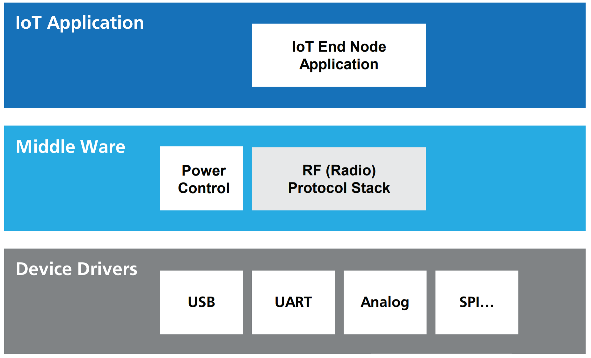

>[Torna all'indice generale](index.md)
## **Gateways per reti di sensori**
BUS cablato:
1. [Dallas](lorawandallas.md)
2. [I2C](gatewayi2clorahw.md)
3. [SPI](gatewayspi.md)
4. [Modbus](gatewaymodbus.md)

Stella cablato (punto-punto):
1. [Analogico](lorahwgatewayanalogico.md)
2. [Digitale](lorahwgatewaydigitale.md)

Radio punto-punto:
1. [Analogico](gatewayradioa.md)
2. [Digitale](gatewayradiod.md)


Per una discussione sintetica di tutti i tipi di BUS semplici dal punto di vista generale si rimanda a [Cablati semplici](cablatisemplici.md ).

### **La scheda LoRa RN2483**


L'RN2483 è un **modem integrato LoRa™** con:
- una portata di oltre 15 km (raggio extraurbano)
- capacità di utilizzo a bassa potenza per una durata della batteria superiore a 10 anni
- alta sensibilità e immunità aòòe interferenze. E' in grado di demodulare segnali con potenze fino a 20 dB al di sotto del livello di rumore.
- opera sui 433 e 868 MHz frequenza industriale scientifica e medica (ISM) senza licenza e funge da nodo finale (End System) nella rete di una infrastruttura LoRa.
- possiede, caricato sul modem, l'intero stack protocollare LoRaWAN™ per cui è facile da configurare tramite semplici comandi ASCII inviati via UART, riducendo notevolmente il tempo di sviluppo. L'RN2483 è aderente alla certificazione europea R&TTE.

### **Schema cablaggio**


```
RN2483 pin name <--> Arduino pin number
  UART_TX (6)   <-->   10
  UART_RX (7)   <-->   11
  RESET (32)    <-->   12
  VDD (34)      <-->   3.3V
  GND (33)      <-->   Gnd
```

La lunghezza del filo dipende dalla frequenza:
- 868 MHz: 86,3 mm 
- 915 MHz: 81,9 mm
- 433 MHz: 173,1 mm


Per il nostro modulo dobbiamo utilizzare un filo da 86,3 mm saldato direttamente al pin ANA del ricetrasmettitore. Si noti che l'utilizzo di un'antenna adeguata estenderà il raggio di comunicazione.

### **Modi di autenticazione**

**Attivazione via etere (OTAA)**

L'**attivazione over-the-air (OTAA)** è il modo preferito e più sicuro per connettersi con The Things Network. I dispositivi eseguono una procedura di unione con la rete (join), durante la quale viene assegnato un **DevAddr** dinamico e le **chiavi** di sicurezza vengono **negoziate** con il dispositivo.

**Attivazione tramite personalizzazione (ABP)**

In alcuni casi potrebbe essere necessario codificare il **DevAddr** e le **chiavi di sicurezza** hardcoded nel dispositivo. Ciò significa attivare un dispositivo **tramite personalizzazione (ABP)**. Questa strategia potrebbe sembrare più semplice, perché si salta la procedura di adesione, ma presenta alcuni svantaggi legati alla sicurezza.

**ABP vs OTAA**

In generale, non ci sono inconvenienti nell'utilizzo dell'OTAA rispetto all'utilizzo dell'ABP, ma ci sono alcuni requisiti che devono essere soddisfatti quando si utilizza l'OTAA.La specifica LoRaWAN avverte in modo specifico contro il ricongiungimento sistematico in caso di guasto della rete. Un dispositivo dovrebbe conservare il risultato di un'attivazione in una memoria permanente se si prevede che il dispositivo venga spento e riacceso durante la sua vita:
- un dispositivo ABP utilizza una memoria non volatile per mantenere i contatori di frame tra i riavvii. 
- Un approccio migliore sarebbe passare all'utilizzo di OTAA e memorizzare la sessione OTAA anziché i contatori di frame.

L'unica cosa da tenere a mente è che un join OTAA richiede che il dispositivo finale si trovi all'interno della copertura della rete su cui è registrato. La ragione di ciò è che la procedura di join OTAA richiede che il dispositivo finale sia in grado di ricevere il messaggio di downlink Join Accept dal server di rete.

Un approccio migliore consiste nell'eseguire un join OTAA in una fabbrica o in un'officina in cui è possibile garantire la copertura di rete e i downlink funzionanti. Non ci sono svantaggi in questo approccio finché il dispositivo segue le migliori pratiche LoRaWAN (https://www.thethingsindustries.com/docs/devices/best-practices/).

### **Buone pratiche**

**Connessioni confermate**

È possibile che non si riceva subito un ACK per ogni uplink o downlink di tipo confermato. Una buona regola empirica è attendere almeno tre ACK mancati per presumere la perdita del collegamento.

In caso di perdita del collegamento, procedere come segue:
- Imposta la potenza TX al massimo consentito/supportato e riprova
- Diminuisci gradualmente la velocità dei dati e riprova
- Ripristina i canali predefiniti e riprova
- Invia richieste di adesione periodiche con backoff

**Cicli di alimentazione**

I dispositivi dovrebbero salvare i parametri di rete tra i cicli di alimentazione regolari. Ciò include parametri di sessione come DevAddr, chiavi di sessione, FCnt e nonces. Ciò consente al dispositivo di unirsi facilmente, poiché chiavi e contatori rimangono sincronizzati.

### **Architettura di riferimento per IoT**

L'**architettura tipica del SW** a bordo di un dispositivo IoT è riassumibile:



Il **middleware** in genere è composto da **librerie di terze parti** da **compilare** all'interno di un **IDE** (ad es. Arduino) o all'interno di un **SDK** cioè un pacchetto di sviluppo per applicazioni che fornisce vari strumenti per compilazione, debug e documentazione (ad es. AWS IoT, Azure IoT, ESP-IDF). Oppure esistono **framework** specifici per IoT Open Source come RIOT che, una volta compilati su una macchina Linux, forniscono veri e propri **SO per IoT** con esattamente ciò che serve per la **comunicazione** di un certo dispositivo.

### **Librerie del progetto**

In questo caso gran parte delle funzioni del middleware, quelle relative alla comunicazione via stack LoRaWan, è implementato all'interno del chip del modem. Il middleware nel sistema a microprocessore (MCU) stavolta svolge ben poche funzioni di comunicazione. 


Dal **punto di vista SW** serve **1 libreria** da scaricare dentro la solita cartella **libraries**:
- **RN2483-Arduino-Library**. Si scarica da https://github.com/jpmeijers/RN2483-Arduino-Library come RN2483-Arduino-Library-master.zip da scompattare e rinominare semplicemente come **RN2483-Arduino-Library**
- **EspSoftwareSerial**. Si scarica da https://github.com/plerup/espsoftwareserial/ come espsoftwareserial-master.zip da scompattare e rinominare semplicemente come **espsoftwareserial**


### **Gateway LoraWan con OTAA join**

```C++
/*
 * Author: JP Meijers
 * Date: 2016-10-20
 *
 * Transmit a one byte packet via TTN. This happens as fast as possible, while still keeping to
 * the 1% duty cycle rules enforced by the RN2483's built in LoRaWAN stack. Even though this is
 * allowed by the radio regulations of the 868MHz band, the fair use policy of TTN may prohibit this.
 *
 * CHECK THE RULES BEFORE USING THIS PROGRAM!
 *
 * CHANGE ADDRESS!
 * Change the device address, network (session) key, and app (session) key to the values
 * that are registered via the TTN dashboard.
 * The appropriate line is "myLora.initABP(XXX);" or "myLora.initOTAA(XXX);"
 * When using ABP, it is advised to enable "relax frame count".
 *
 * Connect the RN2xx3 as follows:
 * RN2xx3 -- ESP8266
 * Uart TX -- GPIO4
 * Uart RX -- GPIO5
 * Reset -- GPIO15
 * Vcc -- 3.3V
 * Gnd -- Gnd
 *
 */
#include <rn2xx3.h>
#include <SoftwareSerial.h>
#include <DHT.h>

#define RESET 15
//sensors defines
#define DHTPIN 2
#define DHTTYPE DHT22
SoftwareSerial mySerial(4, 5); // RX, TX !! labels on relay board is swapped !!

DHT dht(DHTPIN, DHTTYPE);

//create an instance of the rn2xx3 library,
//giving the software UART as stream to use,
//and using LoRa WAN
rn2xx3 myLora(mySerial);

void inline sensorsInit() {
	dht.begin();
}

void inline readSensorsAndTx() {
// Read sensor values and multiply by 100 to effictively have 2 decimals
  uint16_t humidity = dht.readHumidity(false) * 100;

  // false: Celsius (default)
  // true: Farenheit
  uint16_t temperature = dht.readTemperature(false) * 100;

  // Split both words (16 bits) into 2 bytes of 8
  byte payload[4];
  payload[0] = highByte(temperature);
  payload[1] = lowByte(temperature);
  payload[2] = highByte(humidity);
  payload[3] = lowByte(humidity);

  Serial.print("Temperature: ");
  Serial.println(temperature);
  Serial.print("Humidity: ");
  Serial.println(humidity);
  
  //myLora.tx("!"); //send String, blocking function
  myLora.txBytes(payload, sizeof(payload)); // blocking function
}

// the setup routine runs once when you press reset:
void setup() {
  // LED pin is GPIO2 which is the ESP8266's built in LED
  pinMode(2, OUTPUT);
  led_on();

  // Open serial communications and wait for port to open:
  Serial.begin(57600);
  mySerial.begin(57600);
  
  sensorsInit();
  
  delay(1000); //wait for the arduino ide's serial console to open

  Serial.println("Startup");

  initialize_radio();

  //transmit a startup message
  myLora.tx("TTN Mapper on ESP8266 node");

  led_off();

  delay(2000);
}

void initialize_radio()
{
  //reset RN2xx3
  pinMode(RESET, OUTPUT);
  digitalWrite(RESET, LOW);
  delay(100);
  digitalWrite(RESET, HIGH);

  delay(100); //wait for the RN2xx3's startup message
  mySerial.flush();

  //check communication with radio
  String hweui = myLora.hweui();
  while(hweui.length() != 16)
  {
    Serial.println("Communication with RN2xx3 unsuccessful. Power cycle the board.");
    Serial.println(hweui);
    delay(10000);
    hweui = myLora.hweui();
  }

  //print out the HWEUI so that we can register it via ttnctl
  Serial.println("When using OTAA, register this DevEUI: ");
  Serial.println(hweui);
  Serial.println("RN2xx3 firmware version:");
  Serial.println(myLora.sysver());

  //configure your keys and join the network
  Serial.println("Trying to join TTN");
  bool join_result = false;

  //ABP: initABP(String addr, String AppSKey, String NwkSKey);
  join_result = myLora.initABP("02017201", "8D7FFEF938589D95AAD928C2E2E7E48F", "AE17E567AECC8787F749A62F5541D522");

  //OTAA: initOTAA(String AppEUI, String AppKey);
  //join_result = myLora.initOTAA("70B3D57ED00001A6", "A23C96EE13804963F8C2BD6285448198");

  while(!join_result)
  {
    Serial.println("Unable to join. Are your keys correct, and do you have TTN coverage?");
    delay(60000); //delay a minute before retry
    join_result = myLora.init();
  }
  Serial.println("Successfully joined TTN");

}

// the loop routine runs over and over again forever:
void loop() {
    led_on();
    
    readSensorsAndTx();
	
    led_off();
    delay(2000);
}

void led_on()
{
  digitalWrite(2, 1);
}

void led_off()
{
  digitalWrite(2, 0);
}
```

### **Gateway LoraWan con OTAA join e deepSleep**

La **memoria RTC** (Real Time Clock) è un'area della SRAM del processore che rimane alimentata e accessibile alle funzioni RTC del microcontrollore ESP32 e del coprocessore ULP anche quando è attivato lo standby. Nell'esempio sottostante la memoria RTC viene utilizzata per memorizzare un flag di avvenuta conessione. I parametri della connessione (chiave di sessione) vengono recuperati dal modem se questo era stato precedentemente associata (join) al gateway LoRaWan con successo.

```C++
/*
 * Author: JP Meijers
 * Date: 2016-10-20
 *
 * Transmit a one byte packet via TTN. This happens as fast as possible, while still keeping to
 * the 1% duty cycle rules enforced by the RN2483's built in LoRaWAN stack. Even though this is
 * allowed by the radio regulations of the 868MHz band, the fair use policy of TTN may prohibit this.
 *
 * CHECK THE RULES BEFORE USING THIS PROGRAM!
 *
 * CHANGE ADDRESS!
 * Change the device address, network (session) key, and app (session) key to the values
 * that are registered via the TTN dashboard.
 * The appropriate line is "myLora.initABP(XXX);" or "myLora.initOTAA(XXX);"
 * When using ABP, it is advised to enable "relax frame count".
 *
 * Connect the RN2xx3 as follows:
 * RN2xx3 -- ESP8266
 * Uart TX -- GPIO4
 * Uart RX -- GPIO5
 * Reset -- GPIO15
 * Vcc -- 3.3V
 * Gnd -- Gnd
 *
 */
#include <rn2xx3.h>
#include <SoftwareSerial.h>
#include <DHT.h>

#define RESET 15
// Interval between send in seconds, so 300s = 5min
#define TX_INTERVAL ((uint32_t) 300)
//sensors defines
//#define SensorPin A0  // used for Arduino and ESP8266
#define SensorPin 4     // used for ESP32

SoftwareSerial mySerial(4, 5); // RX, TX !! labels on relay board is swapped !!

//create an instance of the rn2xx3 library,
//giving the software UART as stream to use,
//and using LoRa WAN
rn2xx3 myLora(mySerial);

// Saves the LMIC structure during DeepSleep
RTC_DATA_ATTR bool joined = false;

int16_t h1;

void inline sensorsInit() {

}

void inline readSensorsAndTx() {
// Split both words (16 bits) into 2 bytes of 8
	byte payload[2];

	Serial.print("Requesting data...");
	h1 = analogRead(SensorPin);
	Serial.println("DONE");

	payload[0] = highByte(h1);
	payload[1] = lowByte(h1);
	
	Serial.println(F("Packet queued"));
  
	//myLora.tx("!"); //send String, blocking function
	myLora.txBytes(payload, sizeof(payload)); // blocking function
}

void goDeepSleep()
{
    Serial.println(F("Go DeepSleep"));
    Serial.flush();
    esp_sleep_enable_timer_wakeup(TX_INTERVAL * 1000000);
    esp_deep_sleep_start();
}

// the setup routine runs once when you press reset:
void setup() {
  // LED pin is GPIO2 which is the ESP8266's built in LED
  pinMode(2, OUTPUT);
  led_on();

  // Open serial communications and wait for port to open:
  Serial.begin(57600);
  mySerial.begin(57600);
  myLora.autobaud();
  
  sensorsInit();
  
  delay(1000); //wait for the arduino ide's serial console to open

  Serial.println("Startup");

  initialize_radio();

  //transmit a startup message
  myLora.tx("I'm on again!");

  led_off();
  loop_once();
  goDeepSleep();
}

void loop_once() {
    led_on();
    readSensorsAndTx();
    led_off();
    // mando il modem in deep sleep
    myLora.sleep(TX_INTERVAL * 1000);
}

void initialize_radio()
{
  //reset RN2xx3
  pinMode(RESET, OUTPUT);
  digitalWrite(RESET, LOW);
  delay(100);
  digitalWrite(RESET, HIGH);

  delay(100); //wait for the RN2xx3's startup message
  mySerial.flush();

  //check communication with radio
  String hweui = myLora.hweui();
  while(hweui.length() != 16)
  {
    Serial.println("Communication with RN2xx3 unsuccessful. Power cycle the board.");
    Serial.println(hweui);
    delay(10000);
    hweui = myLora.hweui();
  }

  //print out the HWEUI so that we can register it via ttnctl
  Serial.println("When using OTAA, register this DevEUI: ");
  Serial.println(hweui);
  Serial.println("RN2xx3 firmware version:");
  Serial.println(myLora.sysver());
  bool join_result = false;
  
  if(!joined){
	  //configure your keys and join the network
	  Serial.println("Trying to join TTN");
	  
	  //ABP: initABP(String addr, String AppSKey, String NwkSKey);
	  join_result = myLora.initABP("02017201", "8D7FFEF938589D95AAD928C2E2E7E48F", "AE17E567AECC8787F749A62F5541D522");

	  //OTAA: initOTAA(String AppEUI, String AppKey);
	  //join_result = myLora.initOTAA("70B3D57ED00001A6", "A23C96EE13804963F8C2BD6285448198");
  }

  while(!join_result)
  {
    Serial.println("Unable to join. Are your keys correct, and do you have TTN coverage?");
    delay(60000); //delay a minute before retry
    join_result = myLora.init();
  }
  if(!joined){
	  joined = true;
  }
  Serial.println("Successfully joined TTN");
}

// the loop routine runs over and over again forever:
void loop() {}

void led_on()
{
  digitalWrite(2, 1);
}

void led_off()
{
  digitalWrite(2, 0);
}

```
### **APPENDICE DI CONSULTAZIONE**

 

**Callbacks dell'applicazione**


### **Sitografia:**

- https://github.com/jpmeijers/RN2483-Arduino-Library
- http://nl.farnell.com/microchip/rn2483-i-rm095/lora-transceiver-mod-433-868mhz/dp/2491391?ost=rn2483&selectedCategoryId=&categoryId=700000005613farnell.com
- https://sites.google.com/site/connecttottn/
- https://www.disk91.com/2015/technology/networks/first-step-in-lora-land-microchip-rn2483-test/
- http://ww1.microchip.com/downloads/en/devicedoc/70005219a.pdf

>[Torna all'indice generale](index.md)


