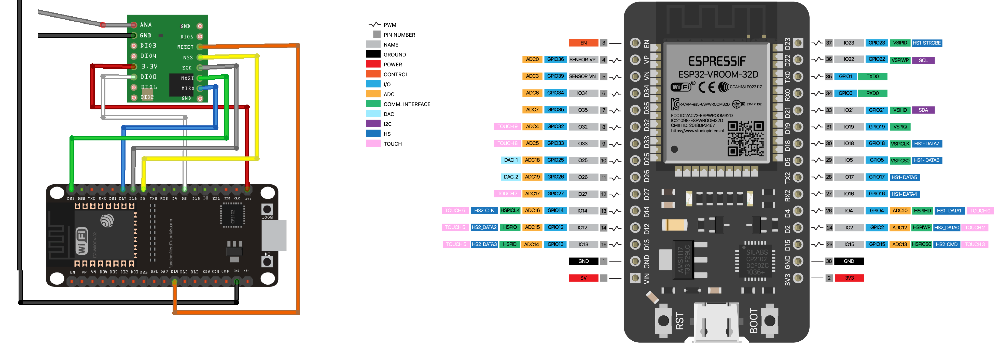
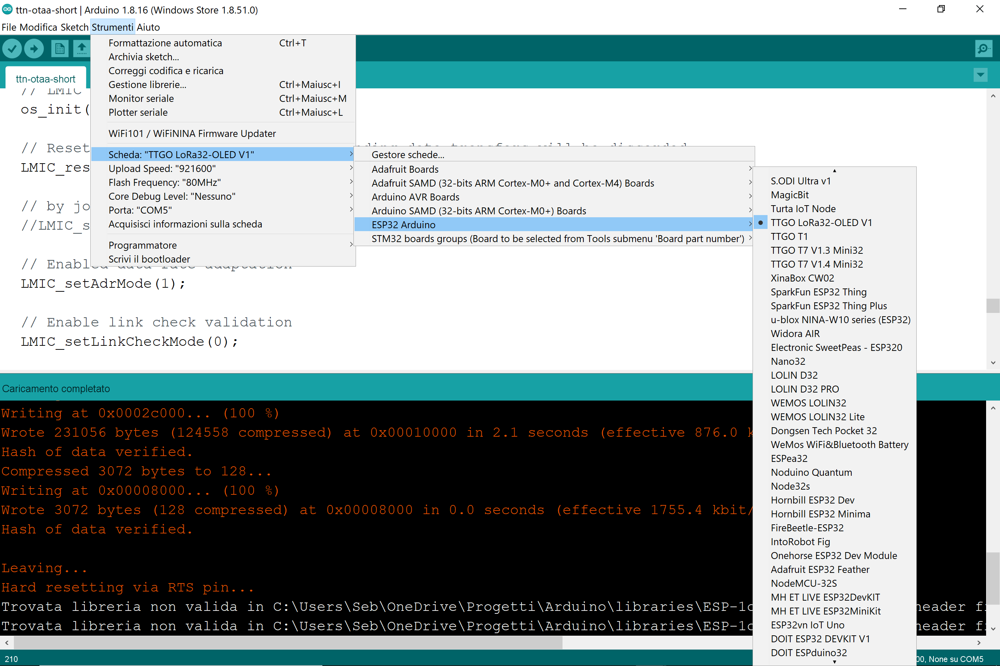

>[Torna all'indice generale](index.md)
## **Scheda sensori con modem LoRaWan SW (LMIC)**
BUS cablato:
1. [Dallas](lorawanswdallas.md)
2. [I2C](gatewayi2clorasw.md)
3. [SPI](gatewayspi.md)
4. [Modbus](gatewaymodbus.md)

Stella cablato (punto-punto):
1. [Analogico](loraswgatewayanalogico.md)
2. [Digitale](loraswgatewaydigitale.md)

Radio punto-punto:
1. [Analogico](gatewayradioa.md)
2. [Digitale](gatewayradiod.md)


Per una discussione sintetica di tutti i tipi di BUS semplici dal punto di vista generale si rimanda a [Cablati semplici](cablatisemplici.md ).

## **Impostazioni LMIC comuni**

1. **Selezione scheda**. **Attenzione** che la definizione del cablaggio dei pin SPI potrebbe non essere corretta. La **selezione della scheda** nell'IDE Arduino è importante perchè definisce anche il **mappaggio** dei pin **MISO**, **MOSI**, **SCK** e **(N)SS** del BUS **SPI** che è **diverso** per ogni scheda.
2. Selezione della **versione LoRaWAN**. Questa libreria implementa la V1.0.3 della specifica LoRaWAN. Tuttavia, può essere utilizzato anche con V1.0.2. 
La versione LoRaWAN predefinita, se nessuna versione è selezionata esplicitamente, è V1.0.3. ```LMIC_LORAWAN_SPEC_VERSION``` è definito come un numero intero che riflette la versione specifica di destinazione. 

Per selezionare la versione in **```project_config/lmic_project_config.h```**, aggiungere:
```C++
// selezione versione 1.0.2
//#define LMIC_LORAWAN_SPEC_VERSION   LMIC_LORAWAN_SPEC_VERSION_1_0_2
// selezione versione 1.0.3
#define LMIC_LORAWAN_SPEC_VERSION    LMIC_LORAWAN_SPEC_VERSION_1_0_3
```

3. **Impostazione banda di frequenze**. Aprire il file /libraries/MCCI_LoRaWAN_LMIC_library/project_config/**lmic_project_config.h**. Questo file contiene le impostazioni per la libreria LMIC. Modificare lmic_project_config.h per commentare la riga #define CFG_us915 1 e decommentare la frequenza per il tuo paese/regione.

Le **frequenze** sono:

     - CFG_eu868 – EU
     - CFG_us915 – Stati Uniti
     - CFG_au915 – Australia
     - CFG_as923 – Asia
     - CFG_in866 – India
     - CFG_kr920 – Corea del Sud
      
Ad esempio, per utilizzare la **frequenza UE**, commentare e decommentare come segue:

```C++
#define CFG_eu868 1
//#define CFG_us915 1
//#define CFG_au915 1
//#define CFG_as923 1
// #define LMIC_COUNTRY_CODE LMIC_COUNTRY_CODE_JP /* per as923-JP */
//#define CFG_kr920 1
//#define CFG_in866 1
```

4. Impostare la variabile **lmic_pinmap** per indicare alla libreria LMIC quali pin Arduino utilizza il nostro shield. Dovrà essere usata una struttura diversa per ogni scheda. Fare riferimento alla documentazione dell'hardware per le mappature dei pin corrette. Le impostazioni più comuni da definire sono:

	- **.nss**, per la connessione 'slave select',
	- **.rxtx**, per controllare l'interruttore dell'antenna, non utilizzato da questo software quindi impostare su LMIC_UNUSED_PIN
	- **.rst**, pin di reset, usato per resettare il ricetrasmettitore
	- **.dio**, pin I/O digitali per ottenere informazioni sullo stato dallo shield, ad esempio quando una trasmissione inizia o è completata.
 
5. **Impostare l'autenticazione OTAA**. Aggiungere le linee seguenti impostare le variabili per l'attivazione del dispositivo Over-the-Air (OTAA):

```C++
// Insert Device EUI here
static const u1_t PROGMEM DEVEUI[8] = ;
void os_getDevEui (u1_t* buf) { memcpy_P(buf, DEVEUI, 8); 

// Insert Application EUI here
static const u1_t PROGMEM APPEUI[8] = ;
void os_getArtEui (u1_t* buf) { memcpy_P(buf, APPEUI, 8);}

// Insert App Key here
static const u1_t PROGMEM APPKEY[16] = ;
void os_getDevKey (u1_t* buf) {  memcpy_P(buf, APPKEY, 16);}
```
DEVEUI, APPEUI e APPKEY devono essere forniti dl gestore del server e inseriti in forma esadecimale in una maniera analoga a quanto sotto:

```C++
// Insert Device EUI here
static const u1_t PROGMEM DEVEUI[8] = { 0x6B, 0x1E, 0x77, 0xEB, 0xDF, 0x69, 0x20, 0x00 };
void os_getDevEui (u1_t* buf) { memcpy_P(buf, DEVEUI, 8);}

// Insert Application EUI here
static const u1_t PROGMEM APPEUI[8] = { 0x9E, 0x03, 0x03, 0xD0, 0x7E, 0xD5, 0xB3, 0x70 };
void os_getArtEui (u1_t* buf) { memcpy_P(buf, APPEUI, 8); 

// Insert App Key here
static const u1_t PROGMEM APPKEY[16] = { 0x69, 0x21, 0xFB, 0x85, 0xE4, 0x49, 0x05, 0x97, 0x4D, 0xCF, 0x8D, 0x33, 0x9C, 0xB1, 0x37, 0x9D };
void os_getDevKey (u1_t* buf) {  memcpy_P(buf, APPKEY, 16);}void os_getDevKey (u1_t* buf) {  memcpy_P(buf, APPKEY, 16);}
```


- L'interfaccia AS-JS serve a fornire la chiave di sessione dell'applicazione da Join server (JS) a Application server (AS).
- L'interfaccia NS-JS è Utilizzata per la procedura di attivazione del roaming per recuperare il NetID di hNS associato al dispositivo finale.


Dopo che il server di accesso (**Join Server**) ha autenticato il dispositivo che richiede di unirsi alla rete, questi, attraverso il **Network Server**, restituisce un messaggio di accettazione dell'accesso al dispositivo.

6. Per impostare il **ritardo di trasmissione**, aggiungere le linee sottostanti con cui, ad esempio, è stato scelto di trasmettere una volta ogni 150 secondi.

```C++
// Schedule uplink to send every TX_INTERVAL seconds
const unsigned TX_INTERVAL = 150;
```

Il **ritardo** è legato al **duty cicle**, cioè la quantità di tempo in cui un dispositivo può trasmettere nello spettro LoRaWAN, che è **regolato dal governo**. Il **limite in Europa** del duty cicle è dell' **1%**, ciò significa che per un dato periodo di tempo il dispositivo può trasmettere solo per l'1% di quel tempo, ad es. 864 secondi in un periodo di 24 ore. Inoltre, TTN ha una politica di utilizzo corretto che limita il tempo di uplink per nodo a 30 secondi al giorno. Il **seguente calcolo** potrebbe quindi essere utilizzato per calcolare il **tempo minimo tra trasmissioni successive** in uplink:


7. Definizione delle **Sottobande**. La seguente tabella riassume le 2 restrizioni della banda 868MHz secondo la normativa Europea ERC-REC-70-3E:

	|   | Sottobande | Frequenza (MHz) |    Potenza     | Duty Cycle | Note             |
	|---|------------|-----------------|----------------|------------|------------------|
	|   | g          | 863,00 - 868,00 | 25mW  (14dBm)  | 1%         |                  |
	|   | g1         | 868,00 - 868,60 | 25mW  (14dBm)  | 1%         | LoRaWAN / Sigfox |
	|   | g2         | 868,70 - 869,20 | 25mW  (14dBm)  | 0,1%       |                  |
	|   | g3         | 869,40 - 869,65 | 500mW (27dBm)  | 10%        | Downlink LoRaWAN |
	|   | g4         | 869.70 - 870.00 | 25mW  (14dBm)  | 1%         |                  |
	
La zona più interessante è la seconda, 868,00 – 868,60. Su questi 600kHz abbiamo i 2000 canali Sigfox e i 3 canali LoRaWAN standard.

In LMIC per la 868 europea la definizione delle sottobande si fa con del codice nel setup():
```
bit_t LMIC_setupBand (u1_t bandidx, s1_t txpow, u2_t txcap)
``` 
ma è utile solo in modo **ABP**, in modo **OTAA** è del tutto automatica e non è necessario eseguirla esplicitamente.

8. **Canali in banda 868 MhZ**. Questo è un elenco di definizioni di piani di frequenza utilizzate in The Things Network. Questi piani di frequenza si basano su quanto specificato nel documento dei parametri regionali LoRaWAN.
- **Uplink**:

1. 868.1 - SF7BW125 to SF12BW125
2. 868.3 - SF7BW125 to SF12BW125 and SF7BW250
3. 868.5 - SF7BW125 to SF12BW125
4. 867.1 - SF7BW125 to SF12BW125
5. 867.3 - SF7BW125 to SF12BW125
6. 867.5 - SF7BW125 to SF12BW125
7. 867.7 - SF7BW125 to SF12BW125
8. 867.9 - SF7BW125 to SF12BW125
9. 868.8 - FSK
	
- **Downlink**:

1. Uplink channels 1-9 (RX1)
2. 869.525 - SF9BW125 (RX2)

Queste informazioni sono utili solo in modo **ABP**, in modo **OTAA** la loro impostazione è del tutto automatica e non è necessario eseguirla esplicitamente.

9. Impostazione della **data rate** e dello **spreading factor** (sono vincolate insieme). 


L'impostazione si fa con il seguente spezzone di codice all'interno del setup():
```C++
// Enable/disable link check validation. 
void LMIC_setLinkCheckMode (1);

// Enable or disable data rate adaptation. Should be turned off if the device is mobile.
void LMIC_setAdrMode (1);

// Set data rate to Spreading Factor 7 and transmit power to 14 dBi for uplinks
LMIC_setDrTxpow(DR_SF7,14);
```
Imposta velocità dati e potenza di trasmissione. Dovrebbe essere utilizzato solo se l'adattamento della velocità dati automatico (data rate adaptation) è disabilitato. Dovrebbe essere disabilitato se il dispositivo è mobile.

La modalità di controllo del collegamento è abilitata per impostazione predefinita e viene utilizzata periodicamente verificare la connettività di rete. Deve essere chiamato solo se viene stabilita una sessione.

## **Configurazioni per schede note**

### **1) La scheda LoRa RMF95/W**


E' un modem Lora che implementa esclusivamente il **livello fisico** dello stack LoraWan spesso indicato semplicemente come **LoRa**. Sopra di esso può essere utilizzato lo **stack applicativo LoRawan** oppure un qualsiasi altro stack (ad es. **6LowPan e REPL**). 

In ogni caso, le funzioni di **rete** ed **applicative** al di sopra del livello fisico, con il **chip RMF95/W**M vanno implementate in SW mediante apposite **librerie**. Se si vuole un **modem** che implementi **in HW** tutto lo **stack LoraWan** si guardi il modulo **Microchip RN2483**.

### **Schema cablaggio**

Il transxeiver LoRa RMF95/W deve essere interfacciato con una scheda MCU a parte. Sotto L'IDE di Arduino si possono utilizzare tutte le schede della famiglia Arduino più le schede ESP8266 e ESP32 di Espressif dotate di modulo WiFi integrato. Di seguito proponiamo un esempio con la scheda ESP32.




In questo caso transceiver Semtech SX1276 e MCU ESP32 sono già cablate insieme sulla stessa scheda. Di seguito è riportato il mappaggio del pinout del transceiver Lora su quello della MCU ESP32:
```
SX1276 pin name <--> ESP32 pin number
	ANA: 	Antenna
	GND: 	GND
	DIO3: 	don’t connect
	DIO4: 	don’t connect
	3.3V: 	3.3V
	DIO0: 	GPIO 2
	DIO1: 	don’t connect
	DIO2: 	don’t connect
	GND: 	don’t connect
	DIO5: 	don’t connect
	RESET: 	GPIO 14
	NSS: 	GPIO 5
	SCK: 	GPIO 18
	MOSI: 	GPIO 23
	MISO: 	GPIO 19
	GND: 	don’t connect
```

La configurazione della libreria LMIC coerente con il mappaggio esposto sopra è:
```
// Pin mapping
const lmic_pinmap lmic_pins = {
  .nss = 5, 
  .rxtx = LMIC_UNUSED_PIN,
  .rst = 14,
  .dio = {/*dio0*/ 2, /*dio1*/ 2, /*dio2*/ 2}
};
```

La lunghezza del filo dipende dalla frequenza:
- 868 MHz: 86,3 mm 
- 915 MHz: 81,9 mm
- 433 MHz: 173,1 mm

Per il nostro modulo dobbiamo utilizzare un filo da 86,3 mm saldato direttamente al pin ANA del ricetrasmettitore. Si noti che l'utilizzo di un'antenna adeguata estenderà il raggio di comunicazione.

### **2) La scheda TTGO LoRa32 SX1276 OLED**


E' una scheda che integra in un unico modulo **porte GPIO** + **transceiver SX1276** + **OLED SSD1306** da 0.96'' + **MCU ESP32**. Il  transceiver SX1276 implementa esclusivamente il **livello fisico** dello stack LoraWan spesso indicato semplicemente come **LoRa**. Sopra di esso può essere utilizzato lo **stack applicativo LoRawan** oppure un qualsiasi altro stack (ad es. **6LowPan e REPL**). 

In ogni caso, le funzioni di **rete** ed **applicative** al di sopra del livello fisico, con il **SX1276** vanno implementate in SW sulla MCU mediante apposite **librerie**. Se si vuole un **modem** che implementi **in HW** tutto lo **stack LoraWan** si guardi il modulo **Microchip RN2483**.

### **Schema cablaggio**

La selezione della scheda **TTGO LoRa32 SX1276 OLED**:



In questo caso transceiver Semtech SX1276 e MCU ESP32 sono già cablate insieme sulla stessa scheda. Di seguito è riportato il mappaggio del pinout del transceiver Lora su quello della MCU ESP32:
```
SX1276 pin name <--> ESP32 pin number
	MISO		GPIO 19
	MOSI		GPIO 27
	SCK		GPIO 5
	CS		GPIO 18
	IRQ		GPIO 26
	RST		GPIO 14
```

La configurazione della libreria LMIC coerente con il mappaggio esposto sopra è:
```
// Pin mapping
const lmic_pinmap lmic_pins = {
  .nss = 18, 
  .rxtx = LMIC_UNUSED_PIN,
  .rst = 14,
  .dio = {/*dio0*/ 26, /*dio1*/ 33, /*dio2*/ 32}
};
```

### **3) La scheda Pycom LoPy**


E' una scheda che integra in un unico modulo **porte GPIO** + **transceiver LORa/Sigfox** + **MCU ESP32**. Il  transceiver SX1276 implementa esclusivamente il **livello fisico** dello stack LoraWan spesso indicato semplicemente come **LoRa**. Sopra di esso può essere utilizzato lo **stack applicativo LoRawan** oppure un qualsiasi altro stack (ad es. **6LowPan e REPL**). 

In ogni caso, le funzioni di **rete** ed **applicative** al di sopra del livello fisico, con il **transceiver** vanno implementate in SW sulla MCU mediante apposite **librerie**. Se si vuole un **modem** che implementi **in HW** tutto lo **stack LoraWan** si guardi il modulo **Microchip RN2483**.

A causa di un paio di problemi con il design SiPy, il modulo assorbe più corrente di quanto dovrebbe mentre è in Deep Sleep. Il regolatore di commutazione DC-DC rimane sempre in modalità ad alte prestazioni, che viene utilizzata per fornire il ripple di uscita più basso possibile quando il modulo è in uso. In questa modalità assorbe una corrente di riposo di 10mA. Quando il regolatore viene messo in modalità ECO la corrente di riposo scende a 10uA. Sfortunatamente, il pin utilizzato per controllare questa modalità è fuori dal dominio RTC. Ciò significa che non è utilizzabile durante il deep sleep. Ciò fa sì che il regolatore rimanga in modalità PWM, mantenendo la sua corrente di riposo a 10 mA. Inoltre, il chip flash non entra in modalità di spegnimento poiché il pin CS è flottante durante il Deep Sleep. Ciò fa sì che il chip flash consumi circa 2 mA di corrente. Per ovviare a questo problema è disponibile uno "shield per il Deep Sleep" che si collega al modulo e consente di interrompere l'alimentazione dal dispositivo.

### **Schema cablaggio**

In questo caso transceiver LoRa e MCU ESP32 sono già cablate insieme sulla stessa scheda. Di seguito è riportato il mappaggio del pinout del transceiver Lora su quello della MCU ESP32:


La configurazione della libreria LMIC coerente con il mappaggio esposto sopra è:
```
// Pin mapping
const lmic_pinmap lmic_pins = {
    .mosi = 27,
    .miso = 19,
    .sck = 5,
    .nss = 17,
    .rxtx = LMIC_UNUSED_PIN,
    .rst = 18,
    .dio = {23, 23, 23}, //workaround to use 1 pin for all 3 radio dio pins
};
```

### **4) La scheda Heltech Wireless Stick Lite**


La selezione della scheda **Heltech Wireless Stick Lite**:


La configurazione della libreria LMIC coerente con il mappaggio esposto sopra è:
```
// Pin mapping for Heltec ESP32 and Wireless Stick Lite
const lmic_pinmap lmic_pins = {
  .nss = 18,  //CS pin
  .rxtx = LMIC_UNUSED_PIN,
  .rst = 14, //RST PIN
  .dio = {26, 35, 34},  //DIO 0, 1, 2
  //.mosi = 27,
  //.miso = 19,
  //.sck = 5,
};
```

### **Bande di frequenza e potenza**
```
				Lower EU	Upper EU	US (FCC)
Intervallo di frequenze		865 – 868 MHz	915 – 921 MHz	902 – 928 MHz
Potenza irradiata		2 watt		4 watt		4 watt
Canale di banda			200 kHz		400 kHz		400 kHz
```

### **Classi di servizio**

**Classe A**

La **trasmissione** del nodo in uplink è **asincrona** cioè i messaggi, dal nodo al gateway, possono essere inviati in qualsiasi momento. 

Dopo la trasmissione il nodo apre **due finestre di ricezione**. Il Network server **può rispondere** tramite un gateway con un messaggio in Downlink in una delle due finestre. Solitamente **la prima** finestra è aperta sullo stesso canale utilizzato nella trasmissione in Uplink, mentre **la seconda** finestra viene aperta su un canale differente, accordato in precedenza con il Network Server, per migliorare la resistenza alle interferenze.

**Classe B**

**Periodicamente**, ogni 128 secondi, un **nodo** riceve dal **gateway** un beacon per la **sincronizzazione** (tra nodo e gateway) e per la **schedulazione** delle ricezioni. Un **pacchetto beacon** contiene uno specifico tempo di riferimento in cui far aprire ai nodi della rete una **finestra di ricezione extra**, chiamata **ping slot**. In pratica è una multiplazione TDMA con cui, ad ogni beacon, il network server riserva uno slot temporale ai vari nodi afferenti ad un certo gateway. La posizione dello slot, nella trama tra un beacon e l'altro, viene ricalcolata ad ogni nuovo beacon per evitare errori di ricezione **sistematici**. 

La ricezione è affetta da una **latenza** piuttosto variabile e potenzialmente elevata. In compenso, il **consumo** è ancora puttosto ridotto perchè, ad ogni trama, la finestra di ricezione è una sola e molto breve.

La **trasmissione** in uplink, analogamente alla classe A, è ancora asincrona.

**Classe C**

La **finestra** di ricezione, quando il nodo non trasmette, è **sempre aperta** per cui la trasmissione in downlink da parte del network server può avvenire, in maniera completamente **asincrona**, in qualsiasi momento. La finestra di ricezione è **chiusa** soltanto durante la trasmissione. In questa modalità la **latenza** è minima ma il **consumo** è massimo per cui si tratta di un modo di funzionamento adatto a dispositivi perennemente connessi ad una fonte di **alimentazione persistente** (rete elettrica, panneli solari).

**ALOHA**

In tutte le classi l'**accesso multiplo** al canale in **uplink** è un TDM a contesa random di tipo **ALOHA**.


### **Modi di autenticazione**

**Attivazione via etere (OTAA)**

L'**attivazione over-the-air (OTAA)** è il modo preferito e più sicuro per connettersi con The Things Network. I dispositivi eseguono una procedura di unione con la rete (join), durante la quale viene assegnato un **DevAddr** dinamico e le **chiavi** di sicurezza vengono **negoziate** con il dispositivo.

**Attivazione tramite personalizzazione (ABP)**

In alcuni casi potrebbe essere necessario codificare il **DevAddr** e le **chiavi di sicurezza** hardcoded nel dispositivo. Ciò significa attivare un dispositivo **tramite personalizzazione (ABP)**. Questa strategia potrebbe sembrare più semplice, perché si salta la procedura di adesione, ma presenta alcuni svantaggi legati alla sicurezza.

**ABP vs OTAA**

In generale, non ci sono inconvenienti nell'utilizzo dell'OTAA rispetto all'utilizzo dell'ABP, ma ci sono alcuni requisiti che devono essere soddisfatti quando si utilizza l'OTAA.La specifica LoRaWAN avverte in modo specifico contro il ricongiungimento sistematico in caso di guasto della rete. Un dispositivo dovrebbe conservare il risultato di un'attivazione in una memoria permanente se si prevede che il dispositivo venga spento e riacceso durante la sua vita:
- un dispositivo ABP utilizza una memoria non volatile per mantenere i contatori di frame tra i riavvii. 
- Un approccio migliore sarebbe passare all'utilizzo di OTAA e memorizzare la sessione OTAA anziché i contatori di frame.

L'unica cosa da tenere a mente è che un join OTAA richiede che il dispositivo finale si trovi all'interno della copertura della rete su cui è registrato. La ragione di ciò è che la procedura di join OTAA richiede che il dispositivo finale sia in grado di ricevere il messaggio di downlink Join Accept dal server di rete.

Un approccio migliore consiste nell'eseguire un join OTAA in una fabbrica o in un'officina in cui è possibile garantire la copertura di rete e i downlink funzionanti. Non ci sono svantaggi in questo approccio finché il dispositivo segue le migliori pratiche LoRaWAN (https://www.thethingsindustries.com/docs/devices/best-practices/).

### **Buone pratiche**

**Connessioni confermate**

È possibile che non si riceva subito un ACK per ogni uplink o downlink di tipo confermato. Una buona regola empirica è attendere almeno tre ACK mancati per presumere la perdita del collegamento.

In caso di perdita del collegamento, procedere come segue:
- Imposta la potenza TX al massimo consentito/supportato e riprova
- Diminuisci gradualmente la velocità dei dati e riprova
- Ripristina i canali predefiniti e riprova
- Invia richieste di adesione periodiche con backoff

**Cicli di alimentazione**

I dispositivi dovrebbero salvare i parametri di rete tra i cicli di alimentazione regolari. Ciò include parametri di sessione come DevAddr, chiavi di sessione, FCnt e nonces. Ciò consente al dispositivo di unirsi facilmente, poiché chiavi e contatori rimangono sincronizzati.

### **Architettura di riferimento per IoT**

L'**architettura tipica del SW** a bordo di un dispositivo IoT è riassumibile:


Il **middleware** in genere è composto da **librerie di terze parti** da **compilare** all'interno di un **IDE** (ad es. Arduino) o all'interno di un **SDK** cioè un pacchetto di sviluppo per applicazioni che fornisce vari strumenti per compilazione, debug e documentazione (ad es. AWS IoT, Azure IoT, ESP-IDF). Oppure esistono **framework** specifici per IoT Open Source come RIOT che, una volta compilati su una macchina Linux, forniscono veri e propri **SO per IoT** con esattamente ciò che serve per la **comunicazione** di un certo dispositivo.

### **Librerie del progetto**

In questo caso gran parte delle funzioni del middleware, quelle relative alla comunicazione via stack LoRaWan, è implementato all'interno del sistema a microprocessore (MCU). Nello specifico, le funzioni di livello applicativo, che in ambito IoT, sono tutte quelle comprese tra il livello 2 e il livello 7 ISO/OSI sono compito della MCU mentre il livello fisico è realizzato in HW dal chip del modem.

Dal **punto di vista SW** seve **4 librerie** da scaricare dentro la solita cartella **libraries**:
- **Arduino-LMIC library**. Si scarica da https://github.com/mcci-catena/arduino-lmic come arduino-lmic-master.zip da scompattare e rinominare semplicemente come **arduino-lmic**

La libreria **LMIC** offre un semplice **modello di programmazione** basato sugli **eventi** in cui sono presenti tutti gli eventi del protocollo
inviato alla funzione di callback **onEvent()** dell'applicazione. Per liberare l'applicazione di dettagli come **tempi** o **interruzioni**, la libreria ha un ambiente di runtime integrato per prendersi cura di timer, code e gestione dei lavori (jobs).

**Jobs di un'applicazione**

In questo modello tutto il codice dell'applicazione viene eseguito nei cosiddetti job che vengono eseguiti sul thread principale dallo **schedulatore** dei task run-time **os_runloop()**. Questi lavori di applicazione sono codificati come normali funzioni C e possono essere gestiti a run-time utilizzando apposite funzioni.

Per la **gestione dei jobs** è necessario un **descrittore** del job **osjob_t** che identifica il job e
memorizza le informazioni di **contesto**. I lavori **non** devono essere di **lunga durata** per garantire un funzionamento **senza interruzioni**. Dovrebbero solo **aggiornare lo stato** e **pianificare le azioni**, che attiveranno nuovi **job** o **callback** di eventi.

**Tempi del sistema operativo**

**LMIC** utilizza valori del tipo **```ostime_t```** per rappresentare il tempo in **tick**. Il **rate** di questi tick è predefinito
a 32768 tick al secondo, ma può essere configurato in fase di compilazione su qualsiasi valore compreso tra 10000 tick al secondo e 64516 tic al secondo.

**Loop di eventi principale**

Tutto ciò che un'applicazione deve fare è inizializzare l'ambiente di runtime utilizzando **os_init()** o
**os_init_ex()** e quindi chiama periodicamente la funzione di pianificazione dei lavori (schedulatore) **os_runloop_once()**. Per avviare le azioni del protocollo e generare eventi, è necessario impostare un lavoro iniziale. Pertanto, un job di avvio (startup job) è schedulato (pianificato) utilizzando la funzione **os_setCallback()**.

La libreria dovrebbero supportare solamente le classi di servizio A e B (C esclusa).

```C++
osjob_t initjob;
void setup () {
 // initialize run-time env
 os_init();
 // setup initial job
 os_setCallback(&initjob, initfunc);
}
void loop () {
 // execute scheduled jobs and events
 os_runloop_once();
}
```
Il codice di avvio mostrato nella funzione **```initfunc()```** di seguito inizializza il MAC ed esegue il Join alla
rete LoraWan:
```C++
// initial job
static void initfunc (osjob_t* j) {
 // reset MAC state
 LMIC_reset();
 // start joining
 LMIC_startJoining();
 // init done - onEvent() callback will be invoked...
}
```
La funzione **```initfunc()```** non è bloccante ma ritorna immediatamente e lo stato della connessione verrà notificato quando verrà chiamata la funzione di callback **```onEvent()```**. La notifica avviene tramite gli eventi: ```EV_JOINING**```, ```EV_JOINED``` o ```EV_JOIN_FAILED```.


**Callback onEvent()**

Questa funzione di callback può reagire a determinati eventi e attivare nuove azioni in base all'**evento** e allo **stato** della connessione. Tipicamente, un'applicazione non elabora tutti gli eventi ma solo quelli a cui è interessata e pianifica (schedula) ulteriori azioni del protocollo utilizzando le API di LMIC. 

Gli **eventi possibili** sono:
1. **EV_SCAN_TIMEOUT** Dopo una chiamata a LMIC_enableTracking() non è stato ricevuto alcun beacon entro l'intervallo di beacon. Il monitoraggio deve essere riavviato.
2. **EV_BEACON_FOUND** Dopo una chiamata a LMIC_enableTracking() il primo beacon è stato ricevuto all'interno dell'intervallo di beacon .
3. **EV_BEACON_MISSED** Nessun segnale è stato ricevuto all'ora prevista.
4. **EV_BEACON_TRACKED** Il prossimo segnale è stato ricevuto all'ora prevista.
5. **EV_JOINING**. Il nodo ha iniziato a unirsi alla rete.
6. **EV_JOINED**. Il nodo si è unito con successo alla rete ed è ora pronto per gli scambi di dati.
7. **EV_RFU1**.
8. **EV_JOIN_FAILED**. Il nodo non è stato in grado di unirsi alla rete (dopo aver riprovato).
9. **EV_REJOIN_FAILED**. Il nodo non si è unito a una nuova rete ma è ancora connesso alla vecchia rete.
10. **EV_TXCOMPLETE** I dati preparati tramite LMIC_setTxData() sono stati inviati e la finestra di ricezione per il downlink è completa. Se era stata richiesta una conferma, allora questa è stata ricevuta. Durante la gestione di questo evento, il codice dovrebbe anche verificare la ricezione dei dati. 
11. **EV_LOST_TSYNC** Il segnale è stato perso ripetutamente e la sincronizzazione dell'ora è andata persa. Il onitoraggio o ping deve essere riavviato.
12. **EV_RESET** Ripristino della sessione a causa del rollover dei contatori di sequenza. La rete verrà riconnessa automaticamente a acquisire nuova sessione.
13. **EV_RXCOMPLETE** Solo classe B: è stato ricevuto un downlink in uno slot ping. Il codice dovrebbe controllare i dati di ricezione. 
14. **EV_LINK_DEAD** Nessuna conferma è stata ricevuta dal server di rete per un lungo periodo di tempo. Le trasmissioni sono ancora possibili, ma la loro ricezione è incerta.
15. **EV_LINK_ALIVE** Il collegamento era morto, ma ora è di nuovo vivo.
16. **EV_SCAN_FOUND** Questo evento è riservato per uso futuro e non viene mai segnalato.
17. **EV_TXSTART** Questo evento viene segnalato appena prima di dire al driver radio di iniziare la trasmissione.
18. **EV_TXCANCELED**
19. **EV_RXSTART**.
20. **EV_JOIN_TXCOMPLETE**.  Non è stato acettato alcun join.

**Gestione della ricezione**

Per ricevere LMIC si unisce alla rete tramite un **join** e **ascolta ripetutamente** i dati in **downlink**. Questo è ottenuto abilitando la **modalità ping**. La chiamata a **LMIC_setPingable()** imposta la modalità ping localmente e avvia la **scansione dei beacon**. Una volta che il primo beacon è stato trovato, è necessario inviare in uplink un frame di configurazione (in questo caso un frame vuoto tramite LMIC_sendAlive()) per trasportare le **opzioni MAC** e per notificare al server la **modalità ping** e il suo **intervallo**. Ogni volta che il server invia, in uno degli slot di ricezione, un dato in downlink, l'evento **EV_RXCOMPLETE** viene attivato e i dati ricevuti possono essere valutati nel campo **frame** del **struttura LMIC**. Il codice di esempio registra i dati ricevuti sulla console e, nel caso speciale quando viene ricevuto esattamente un byte, pilota il LED in base al valore ricevuto.


Quando viene ricevuto EV_TXCOMPLETE o EV_RXCOMPLETE, il codice di elaborazione dell'evento dovrebbe controllare se ci sono dati in ricezione (downlink) ed eventualmente passarli all'applicazione. Per fare ciò, si usa un codice come il seguente:

```C++
void do_recv(uint8_t  bPort, uint8_t *msg, uint8_t len){
	
}

void onEvent (ev_t ev) {
    switch(ev) {
      // network joined, session established
      case EV_JOINED:
          // enable pinging mode, start scanning...
          // (set local ping interval configuration to 2^1 == 2 sec)
          LMIC_setPingable(1);
          Serial.println("SCANNING...\r\n");
          break;

      // beacon found by scanning
      case EV_BEACON_FOUND:
          // send empty frame up to notify server of ping mode and interval!
          LMIC_sendAlive();
          break;

      // data frame received in ping slot
      case EV_RXCOMPLETE:
          // Any data to be received?
	  if (LMIC.dataLen != 0 || LMIC.dataBeg != 0) {
		 // Data was received. Extract port number if any.
		 u1_t bPort = 0;
		 if (LMIC.txrxFlags & TXRX_PORT)
			bPort = LMIC.frame[LMIC.dataBeg – 1];
		 // Call user-supplied function with port #, pMessage, nMessage;
		 // nMessage might be zero.
		 do_recv(bPort, LMIC.frame + LMIC.dataBeg, LMIC.dataLen);
	  }
      break;    
    }
}
```

### **File di configurazione**

In questo porting LMIC, a differenza di  altri simili,  non va modificato il file src/lmic/config.h per configurare il FW. La configurazione è spostata sul file project_config/lmic_project_config.h. 

Il file imposta:
- selezionare la versione di LoRaWAN 
- Selezione della configurazione della regione LoRaWAN
- Selezione del ricetrasmettitore radio 
- Controllo dell'uso degli interrupt
- Disabilitare PING
- Disabilitare i Beacon
- Abilitazione del supporto orario di rete
- altre variabili più raramente usate


### **Nodo LoraWan con OTAA join**

Si trova, assieme ad altri esempi, nella cartella al link https://github.com/mcci-catena/arduino-lmic#sflt16
Al termine di una trasmissione, indicato dall'evento ```EV_TXCOMPLETE```viene pianficata una nuova trasmissione tramite```os_setTimedCallback(&sendjob, os_getTime()+sec2osticks(TX_INTERVAL), do_send)``` dopo un tempo ```TX_INTERVAL```.

La funzione ```os_runloop_once()``` riserva un quanto di tempo allo scheduler dei job della connessione LoRaWan. Una trasmissione LoraWan però potrebbe non essere completata in un solo quanto per cui potrebbero essere necessari parecchi loop() per completarla. Quest'ultima considerazione chiarisce che è importante non inserire delay() o istruzioni molto lente dopo una chiamata a ```os_runloop_once()``` perchè una lunga interruzione del processo di trasmissione potrebbe portare ad una perdita di dati.

Tuttavia, durante la trasmissione di un messaggio, è fondamentale assicurarsi che ```os_runloop_once()``` venga chiamato frequentemente prima delle scadenze rigide. L'API ```os_queryTimeCriticalJobs()``` può essere utilizzata per verificare se sono previste scadenze a breve. Prima di eseguire un job che richiede n millisecondi, si può chiamare ```os_queryTimeCriticalJobs(ms2osticks(n))``` e saltare il job se l'API indica che LMIC richiede attenzione.

Un'alternativa per evitare alla radice instabilità e perdite di dati potrebbe essere chiamare nel loop() ```os_runloop_once()``` tutte le volte che sono necessarie per portare a compimento una trasmissione lasciando il controllo della CPU agli altri task del microcontrollore solo dopo che questa è terminata.
```C++
loop(){
...
	//Run LMIC loop until he as finish
	while(flag_TXCOMPLETE == 0)
	{
		os_runloop_once();
	}
	flag_TXCOMPLETE = 0;
}
```
Il codice alla luce delle considerazioni precedenti diventa:

```C++
/*******************************************************************************
 * Copyright (c) 2015 Thomas Telkamp and Matthijs Kooijman
 * Copyright (c) 2018 Terry Moore, MCCI
 *
 * Permission is hereby granted, free of charge, to anyone
 * obtaining a copy of this document and accompanying files,
 * to do whatever they want with them without any restriction,
 * including, but not limited to, copying, modification and redistribution.
 * NO WARRANTY OF ANY KIND IS PROVIDED.
 *
 * This example sends a valid LoRaWAN packet with payload "Hello,
 * world!", using frequency and encryption settings matching those of
 * the The Things Network.
 *
 * This uses ABP (Activation-by-personalisation), where a DevAddr and
 * Session keys are preconfigured (unlike OTAA, where a DevEUI and
 * application key is configured, while the DevAddr and session keys are
 * assigned/generated in the over-the-air-activation procedure).
 *
 * Note: LoRaWAN per sub-band duty-cycle limitation is enforced (1% in
 * g1, 0.1% in g2), but not the TTN fair usage policy (which is probably
 * violated by this sketch when left running for longer)!
 *
 * To use this sketch, first register your application and device with
 * the things network, to set or generate a DevAddr, NwkSKey and
 * AppSKey. Each device should have their own unique values for these
 * fields.
 *
 * Do not forget to define the radio type correctly in
 * arduino-lmic/project_config/lmic_project_config.h or from your BOARDS.txt.
 *
 *******************************************************************************/

 // References:
 // [feather] adafruit-feather-m0-radio-with-lora-module.pdf

#include <lmic.h>
#include <hal/hal.h>
#include <SPI.h>

//
// For normal use, we require that you edit the sketch to replace FILLMEIN
// with values assigned by the TTN console. However, for regression tests,
// we want to be able to compile these scripts. The regression tests define
// COMPILE_REGRESSION_TEST, and in that case we define FILLMEIN to a non-
// working but innocuous value.
//
#ifdef COMPILE_REGRESSION_TEST
# define FILLMEIN 0
#else
# warning "You must replace the values marked FILLMEIN with real values from the TTN control panel!"
# define FILLMEIN (#dont edit this, edit the lines that use FILLMEIN)
#endif


// This EUI must be in little-endian format, so least-significant-byte
// first. When copying an EUI from ttnctl output, this means to reverse
// the bytes. For TTN issued EUIs the last bytes should be 0xD5, 0xB3,
// 0x70. 00-80-00-00-A0-00-C9-DC
//static const u1_t PROGMEM APPEUI[8] = { 0xDC, 0xC9, 0x00, 0xA0, 0x00, 0x00, 0x80, 0x00 };
static const u1_t PROGMEM APPEUI[8]={ 0x00, 0x80, 0x00, 0x00, 0xA0, 0x00, 0xC9, 0xDC };
void os_getArtEui (u1_t* buf) { memcpy_P(buf, APPEUI, 8);};

// This should also be in little endian format, see above. 0A3AF2FFFE46AD84
static const u1_t PROGMEM DEVEUI[8] = { 0x84, 0xAD, 0x46, 0xFE, 0xFF, 0xF2, 0x3A, 0x0A };
//static const u1_t PROGMEM DEVEUI[8]={ 0x0A, 0x3A, 0xF2, 0xFF, 0xFE, 0x46, 0xAD, 0x84 };
void os_getDevEui (u1_t* buf) { memcpy_P(buf, DEVEUI, 8);};

// This key should be in big endian format (or, since it is not really a
// number but a block of memory, endianness does not really apply). In
// practice, a key taken from ttnctl can be copied as-is. 9C56B96176DF60A01C40132AD1BE1EFC
static const u1_t PROGMEM APPKEY[16] = { 0x9C, 0x56, 0xB9, 0x61, 0x76, 0xDF, 0x60, 0xA0, 0x1C, 0x40, 0x13, 0x2A, 0xD1, 0xBE, 0x1E, 0xFC };
void os_getDevKey (u1_t* buf) {  memcpy_P(buf, APPKEY, 16);};

void printHex2(unsigned v) {
    v &= 0xff;
    if (v < 16)
        Serial.print('0');
    Serial.print(v, HEX);
}

static uint8_t mydata[] = "pippo";
static osjob_t sendjob;

// Schedule TX every this many seconds (might become longer due to duty
// cycle limitations).
const unsigned TX_INTERVAL = 10;

// Pin mapping
// Adapted for Feather M0 per p.10 of [feather]
const lmic_pinmap lmic_pins = {
    .nss = 18,
    .rxtx = LMIC_UNUSED_PIN,
    .rst = 14,
    .dio = {26, 33, 32},
};

/*
LORA_CS = const(18)
LORA_SCK = const(5)
LORA_MOSI = const(27)
LORA_MISO = const(19)
LORA_IRQ = const(26)
LORA_RST = const(14)
*/
// Definizione delle porte SPI
#define SCK     5   // Pin del clock
#define MISO    19  // Pin MISO
#define MOSI    27  // Pin MOSI
#define SS      18  // Pin SS (Slave Select)

void onEvent (ev_t ev) {
    Serial.print(os_getTime());
    Serial.print(": ");
    switch(ev) {
        case EV_SCAN_TIMEOUT:
            Serial.println(F("EV_SCAN_TIMEOUT"));
            break;
        case EV_BEACON_FOUND:
            Serial.println(F("EV_BEACON_FOUND"));
            break;
        case EV_BEACON_MISSED:
            Serial.println(F("EV_BEACON_MISSED"));
            break;
        case EV_BEACON_TRACKED:
            Serial.println(F("EV_BEACON_TRACKED"));
            break;
        case EV_JOINING:
            Serial.println(F("EV_JOINING"));
            break;
        case EV_JOINED:
            Serial.println(F("EV_JOINED"));
            {
              u4_t netid = 0;
              devaddr_t devaddr = 0;
              u1_t nwkKey[16];
              u1_t artKey[16];
              LMIC_getSessionKeys(&netid, &devaddr, nwkKey, artKey);
              Serial.print("netid: ");
              Serial.println(netid, DEC);
              Serial.print("devaddr: ");
              Serial.println(devaddr, HEX);
              Serial.print("AppSKey: ");
              for (size_t i=0; i<sizeof(artKey); ++i) {
                if (i != 0)
                  Serial.print("-");
                printHex2(artKey[i]);
              }
              Serial.println("");
              Serial.print("NwkSKey: ");
              for (size_t i=0; i<sizeof(nwkKey); ++i) {
                      if (i != 0)
                              Serial.print("-");
                      printHex2(nwkKey[i]);
              }
              Serial.println();
            }
            // Disable link check validation (automatically enabled
            // during join, but because slow data rates change max TX
	          // size, we don't use it in this example.
            LMIC_setLinkCheckMode(0);
            break;
        /*
        || This event is defined but not used in the code. No
        || point in wasting codespace on it.
        ||
        || case EV_RFU1:
        ||     Serial.println(F("EV_RFU1"));
        ||     break;
        */
        case EV_JOIN_FAILED:
            Serial.println(F("EV_JOIN_FAILED"));
            break;
        case EV_REJOIN_FAILED:
            Serial.println(F("EV_REJOIN_FAILED"));
            break;
        case EV_TXCOMPLETE:
            Serial.println(F("EV_TXCOMPLETE (includes waiting for RX windows)"));
            if (LMIC.txrxFlags & TXRX_ACK)
              Serial.println(F("Received ack"));
            if (LMIC.dataLen) {
              Serial.println(F("Received "));
              Serial.println(LMIC.dataLen);
              Serial.println(F(" bytes of payload"));
              // Stampa il payload ricevuto
              Serial.print(F("Received payload: "));
              Serial.write(LMIC.frame + LMIC.dataBeg, LMIC.dataLen);
              Serial.println();
            }
            // Schedule next transmission
            os_setTimedCallback(&sendjob, os_getTime()+sec2osticks(TX_INTERVAL), do_send);
            break;
        case EV_LOST_TSYNC:
            Serial.println(F("EV_LOST_TSYNC"));
            break;
        case EV_RESET:
            Serial.println(F("EV_RESET"));
            break;
        case EV_RXCOMPLETE:
            // data received in ping slot
            if (LMIC.dataLen) {
              Serial.println(F("Received downlink message:"));
              // Stampa il payload ricevuto
              Serial.write(LMIC.frame + LMIC.dataBeg, LMIC.dataLen);
              Serial.println();
            }
            break;
        case EV_LINK_DEAD:
            Serial.println(F("EV_LINK_DEAD"));
            break;
        case EV_LINK_ALIVE:
            Serial.println(F("EV_LINK_ALIVE"));
            break;
        /*
        || This event is defined but not used in the code. No
        || point in wasting codespace on it.
        ||
        || case EV_SCAN_FOUND:
        ||    Serial.println(F("EV_SCAN_FOUND"));
        ||    break;
        */
        case EV_TXSTART:
            Serial.println(F("EV_TXSTART"));
            break;
        case EV_TXCANCELED:
            Serial.println(F("EV_TXCANCELED"));
            break;
        case EV_RXSTART:
            /* do not print anything -- it wrecks timing */
            break;
        case EV_JOIN_TXCOMPLETE:
            Serial.println(F("EV_JOIN_TXCOMPLETE: no JoinAccept"));
            break;
        default:
            Serial.print(F("Unknown event: "));
            Serial.println((unsigned) ev);
            break;
    }
}

void do_send(osjob_t* j){
    // Check if there is not a current TX/RX job running
    if (LMIC.opmode & OP_TXRXPEND) {
        Serial.println(F("OP_TXRXPEND, not sending"));
    } else {
        // Prepare upstream data transmission at the next possible time.
        LMIC_setTxData2(1, mydata, sizeof(mydata)-1, 0);
        Serial.println(F("Packet queued"));
    }
    // Next TX is scheduled after TX_COMPLETE event.
}

void setup() {
    Serial.begin(115200); //actual baud rate is not important
    while(!Serial && millis() < 5000) {
      //Wait up to 5 sec for USB to connect 
    }
    Serial.println("Hello!");
    //    pinMode(13, OUTPUT);
    delay(100);     // per sample code on RF_95 test
    Serial.println(F("Starting"));

    #ifdef VCC_ENABLE
    // For Pinoccio Scout boards
    pinMode(VCC_ENABLE, OUTPUT);
    digitalWrite(VCC_ENABLE, HIGH);
    delay(1000);
    #endif

    // LMIC init
    os_init();
    // Reset the MAC state. Session and pending data transfers will be discarded.
    LMIC_reset();

    // Set static session parameters. Instead of dynamically establishing a session
    // by joining the network, precomputed session parameters are be provided.
    #if defined(CFG_eu868)
    // Set up the channels used by the Things Network, which corresponds
    // to the defaults of most gateways. Without this, only three base
    // channels from the LoRaWAN specification are used, which certainly
    // works, so it is good for debugging, but can overload those
    // frequencies, so be sure to configure the full frequency range of
    // your network here (unless your network autoconfigures them).
    // Setting up channels should happen after LMIC_setSession, as that
    // configures the minimal channel set. The LMIC doesn't let you change
    // the three basic settings, but we show them here.
    LMIC_setupChannel(0, 868100000, DR_RANGE_MAP(DR_SF12, DR_SF7),  BAND_CENTI);      // g-band
    LMIC_setupChannel(1, 868300000, DR_RANGE_MAP(DR_SF12, DR_SF7B), BAND_CENTI);      // g-band
    LMIC_setupChannel(2, 868500000, DR_RANGE_MAP(DR_SF12, DR_SF7),  BAND_CENTI);      // g-band
    LMIC_setupChannel(3, 867100000, DR_RANGE_MAP(DR_SF12, DR_SF7),  BAND_CENTI);      // g-band
    LMIC_setupChannel(4, 867300000, DR_RANGE_MAP(DR_SF12, DR_SF7),  BAND_CENTI);      // g-band
    LMIC_setupChannel(5, 867500000, DR_RANGE_MAP(DR_SF12, DR_SF7),  BAND_CENTI);      // g-band
    LMIC_setupChannel(6, 867700000, DR_RANGE_MAP(DR_SF12, DR_SF7),  BAND_CENTI);      // g-band
    LMIC_setupChannel(7, 867900000, DR_RANGE_MAP(DR_SF12, DR_SF7),  BAND_CENTI);      // g-band
    LMIC_setupChannel(8, 868800000, DR_RANGE_MAP(DR_FSK,  DR_FSK),  BAND_MILLI);      // g2-band

    // TTN defines an additional channel at 869.525Mhz using SF9 for class B
    // devices' ping slots. LMIC does not have an easy way to define set this
    // frequency and support for class B is spotty and untested, so this
    // frequency is not configured here.
    #elif defined(CFG_us915) || defined(CFG_au915)
    // NA-US and AU channels 0-71 are configured automatically
    // but only one group of 8 should (a subband) should be active
    // TTN recommends the second sub band, 1 in a zero based count.
    // https://github.com/TheThingsNetwork/gateway-conf/blob/master/US-global_conf.json
    LMIC_selectSubBand(1);
    #elif defined(CFG_as923)
    // Set up the channels used in your country. Only two are defined by default,
    // and they cannot be changed.  Use BAND_CENTI to indicate 1% duty cycle.
    // LMIC_setupChannel(0, 923200000, DR_RANGE_MAP(DR_SF12, DR_SF7),  BAND_CENTI);
    // LMIC_setupChannel(1, 923400000, DR_RANGE_MAP(DR_SF12, DR_SF7),  BAND_CENTI);

    // ... extra definitions for channels 2..n here
    #elif defined(CFG_kr920)
    // Set up the channels used in your country. Three are defined by default,
    // and they cannot be changed. Duty cycle doesn't matter, but is conventionally
    // BAND_MILLI.
    // LMIC_setupChannel(0, 922100000, DR_RANGE_MAP(DR_SF12, DR_SF7),  BAND_MILLI);
    // LMIC_setupChannel(1, 922300000, DR_RANGE_MAP(DR_SF12, DR_SF7),  BAND_MILLI);
    // LMIC_setupChannel(2, 922500000, DR_RANGE_MAP(DR_SF12, DR_SF7),  BAND_MILLI);

    // ... extra definitions for channels 3..n here.
    #elif defined(CFG_in866)
    // Set up the channels used in your country. Three are defined by default,
    // and they cannot be changed. Duty cycle doesn't matter, but is conventionally
    // BAND_MILLI.
    // LMIC_setupChannel(0, 865062500, DR_RANGE_MAP(DR_SF12, DR_SF7),  BAND_MILLI);
    // LMIC_setupChannel(1, 865402500, DR_RANGE_MAP(DR_SF12, DR_SF7),  BAND_MILLI);
    // LMIC_setupChannel(2, 865985000, DR_RANGE_MAP(DR_SF12, DR_SF7),  BAND_MILLI);

    // ... extra definitions for channels 3..n here.
    #else
    # error Region not supported
    #endif

    // Imposta LMIC in modalità di classe C
    //LMIC_setClockError(MAX_CLOCK_ERROR);

    SPI.begin();
    // Impostazione delle porte SPI
    SPI.begin(SCK, MISO, MOSI, SS);

    // Disable link check validation
    LMIC_setLinkCheckMode(0);

    // TTN uses SF9 for its RX2 window.
    LMIC.dn2Dr = DR_SF9;
    LMIC.dn2Freq = 869525000; // Frequenza in Hz

    // Set data rate and transmit power for uplink
    LMIC_setDrTxpow(DR_SF7,14);

    // Start job
    do_send(&sendjob);
}

void loop() {
    os_runloop_once();
}

```

### **Nodo LoraWan con OTAA join e deepSleep**


Dopo la segnalazione dell'evento trasmissione completata EV_TXCOMPLETE viene settato il flag GOTO_DEEPSLEEP che comunica al loop il momento buono per andare in deep sleep. 

Nel loop() un if di check controlla se non ci sono operazioni interne di servizio dello schedulatore pendenti. Se esistono operazioni pendenti si pianifica un nuovo check dopo 2 sec, se queste non ci stanno si comanda la discesa del sistema in deep sleep mediante la funzione GoDeepSleep(). Le operazioni (job) ancora pendenti, prima di eseguire un nuovo job che richiede n millisecondi (nello specifico, un deep sleeep), si controllano con ```os_queryTimeCriticalJobs(ms2osticks(n))```.

```C++
void GoDeepSleep()
{
    Serial.println(F("Go DeepSleep"));
    PrintRuntime();
    Serial.flush();
    requestModuleActive(0);
    esp_sleep_enable_timer_wakeup(TX_INTERVAL * 1000000);
    esp_deep_sleep_start();
}

static void requestModuleActive(bit_t state) {
    ostime_t const ticks = hal_setModuleActive(state);

    if (ticks)
        hal_waitUntil(os_getTime() + ticks);;
}
```
La funzione ```requestModuleActive``` ha il compito di attivare o disattivare il transceiver LoRa a seconda se il parametro fornito vale 1 o 0. La ```requestModuleActive```, usata insieme alla ```LowPower.deepSleep(sec)``` che si occupa di mandare in deep sleep la CPU, contribuisce a minimizzare il consumo di energia del nodo LoraWan a vantaggio della durata della carica di eventuali batterie di alimentazione.

Il sistema però, dopo un wakeup (risveglio) non riparte dall'ultima istruzione eseguita ma dall'inizio del setup per cui è praticamente smemorato riguardo i parametri di una eventuale connessione precedentemente stabilita. Costringere il sistema a rinegoziare una join ad ogni risveglio è uno spreco di tempo e di risorse preziose di batterie per cui sarebbe opportuno trovare un modo di tenere traccia dei dati salienti di una connessione.

Dichiarazione della variabile che contiene la sessione:
```C++
RTC_DATA_ATTR lmic_t RTC_LMIC;
```

La lettura viene fatta alla fine del sutup(). Il salvataggio viene fatto dopo la segnalazione del flag GOTO_DEEPSLEEP.

```C++
#include <arduino.h>
#include <lmic.h>
#include <hal/hal.h>
#include <SPI.h>

// include the DHT22 Sensor Library
#include "DHT.h"
// DHT digital pin and sensor type
#define DHTPIN 10
#define DHTTYPE DHT22

//#include <ttn_credentials.h>
#define TTN_APPEUI {0}
#define TTN_DEVEUI {0}
#define TTN_APPKEY {0}
#define MAX_BANDS 4
//#define CFG_LMIC_EU_like 0

bool GOTO_DEEPSLEEP = false;

// rename ttn_credentials.h.example to ttn_credentials.h and add you keys
static const u1_t PROGMEM APPEUI[8] = TTN_APPEUI;
static const u1_t PROGMEM DEVEUI[8] = TTN_DEVEUI;
static const u1_t PROGMEM APPKEY[16] = TTN_APPKEY;
void os_getArtEui(u1_t *buf) { memcpy_P(buf, APPEUI, 8); }
void os_getDevEui(u1_t *buf) { memcpy_P(buf, DEVEUI, 8); }
void os_getDevKey(u1_t *buf) { memcpy_P(buf, APPKEY, 16); }

static uint8_t payload[5];
static osjob_t sendjob;
bool flag_TXCOMPLETE = false;

// Schedule TX every this many seconds
// Respect Fair Access Policy and Maximum Duty Cycle!
// https://www.thethingsnetwork.org/docs/lorawan/duty-cycle.html
// https://www.loratools.nl/#/airtime
const unsigned TX_INTERVAL = 30;

// payload to send to TTN gateway


// Saves the LMIC structure during DeepSleep
RTC_DATA_ATTR lmic_t RTC_LMIC;

#define PIN_LMIC_NSS 18
#define PIN_LMIC_RST 14
#define PIN_LMIC_DIO0 26
#define PIN_LMIC_DIO1 33
#define PIN_LMIC_DIO2 32

// Declared in hal.h, to be defined and initialized by the application.
// Use os_init_ex() if you want not to use a const table, or if
// you need to define a derived type (so you can override methods).
//extern const lmic_pinmap lmic_pins;

// Pin mapping for Heltec ESP32 and Wireless Stick Lite
const lmic_pinmap lmic_pins = { // deve avere questo nome se globale!
    .nss = PIN_LMIC_NSS,
    .rxtx = LMIC_UNUSED_PIN,
    .rst = PIN_LMIC_RST,
    .dio = {PIN_LMIC_DIO0, PIN_LMIC_DIO1, PIN_LMIC_DIO2},
};

// init. DHT
DHT dht(DHTPIN, DHTTYPE);

// https://github.com/mcci-catena/arduino-lmic/blob/89c28c5888338f8fc851851bb64968f2a493462f/src/lmic/lmic.h#L233

void PrintRuntime()
{
    long seconds = millis() / 1000;
    Serial.print("Runtime: ");
    Serial.print(seconds);
    Serial.println(" seconds");
}

void PrintLMICVersion()
{
    Serial.print(F("LMIC: "));
    Serial.print(ARDUINO_LMIC_VERSION_GET_MAJOR(ARDUINO_LMIC_VERSION));
    Serial.print(F("."));
    Serial.print(ARDUINO_LMIC_VERSION_GET_MINOR(ARDUINO_LMIC_VERSION));
    Serial.print(F("."));
    Serial.print(ARDUINO_LMIC_VERSION_GET_PATCH(ARDUINO_LMIC_VERSION));
    Serial.print(F("."));
    Serial.println(ARDUINO_LMIC_VERSION_GET_LOCAL(ARDUINO_LMIC_VERSION));
}

void onEvent(ev_t ev)
{
    Serial.print(os_getTime());
    Serial.print(": ");
    switch (ev)
    {
    case EV_SCAN_TIMEOUT:
        Serial.println(F("EV_SCAN_TIMEOUT"));
        break;
    case EV_BEACON_FOUND:
        Serial.println(F("EV_BEACON_FOUND"));
        break;
    case EV_BEACON_MISSED:
        Serial.println(F("EV_BEACON_MISSED"));
        break;
    case EV_BEACON_TRACKED:
        Serial.println(F("EV_BEACON_TRACKED"));
        break;
    case EV_JOINING:
        Serial.println(F("EV_JOINING"));
        break;
    case EV_JOINED:
        Serial.println(F("EV_JOINED"));
        {
            u4_t netid = 0;
            devaddr_t devaddr = 0;
            u1_t nwkKey[16];
            u1_t artKey[16];
            LMIC_getSessionKeys(&netid, &devaddr, nwkKey, artKey);
            Serial.print("netid: ");
            Serial.println(netid, DEC);
            Serial.print("devaddr: ");
            Serial.println(devaddr, HEX);
            Serial.print("artKey: ");
            for (size_t i = 0; i < sizeof(artKey); ++i)
            {
                Serial.print(artKey[i], HEX);
            }
            Serial.println("");
            Serial.print("nwkKey: ");
            for (size_t i = 0; i < sizeof(nwkKey); ++i)
            {
                Serial.print(nwkKey[i], HEX);
            }
            Serial.println("");
        }
        // Disable link check validation (automatically enabled
        // during join, but because slow data rates change max TX
        // size, we don't use it in this example.
        LMIC_setLinkCheckMode(0);
        break;
    /*
        || This event is defined but not used in the code. No
        || point in wasting codespace on it.
        ||
        || case EV_RFU1:
        ||     Serial.println(F("EV_RFU1"));
        ||     break;
        */
    case EV_JOIN_FAILED:
        Serial.println(F("EV_JOIN_FAILED"));
        break;
    case EV_REJOIN_FAILED:
        Serial.println(F("EV_REJOIN_FAILED"));
        break;
    case EV_TXCOMPLETE:
        Serial.println(F("EV_TXCOMPLETE (includes waiting for RX windows)"));
        if (LMIC.txrxFlags & TXRX_ACK)
            Serial.println(F("Received ack"));
        if (LMIC.dataLen)
        {
            Serial.print(F("Received "));
            Serial.print(LMIC.dataLen);
            Serial.println(F(" bytes of payload"));
        }
        GOTO_DEEPSLEEP = true;
        break;
    case EV_SCAN_TIMEOUT:
	    Serial.println(F("EV_SCAN_TIMEOUT"));
	    break;
	case EV_BEACON_FOUND:
	    Serial.println(F("EV_BEACON_FOUND"));
	    break;
	case EV_BEACON_MISSED:
	    Serial.println(F("EV_BEACON_MISSED"));
	    break;
	case EV_BEACON_TRACKED:
	    Serial.println(F("EV_BEACON_TRACKED"));
	    break;
	case EV_JOINING:
	    Serial.println(F("EV_JOINING"));
	    break;
	case EV_JOIN_FAILED:
            Serial.println(F("EV_JOIN_FAILED"));
            break;
        case EV_REJOIN_FAILED:
            Serial.println(F("EV_REJOIN_FAILED"));
            break;
	case EV_LOST_TSYNC:
            Serial.println(F("EV_LOST_TSYNC"));
            break;
        case EV_RESET:
            Serial.println(F("EV_RESET"));
            break;
        case EV_RXCOMPLETE:
            // data received in ping slot
            Serial.println(F("EV_RXCOMPLETE"));
            break;
        case EV_LINK_DEAD:
            Serial.println(F("EV_LINK_DEAD"));
            break;
        case EV_LINK_ALIVE:
            Serial.println(F("EV_LINK_ALIVE"));
            break;	
	case EV_TXSTART:
            Serial.println(F("EV_TXSTART"));
            break;
        case EV_TXCANCELED:
            Serial.println(F("EV_TXCANCELED"));
            break;
        case EV_RXSTART:
            /* do not print anything -- it wrecks timing */
            break;
        case EV_JOIN_TXCOMPLETE:
            Serial.println(F("EV_JOIN_TXCOMPLETE: no JoinAccept"));
            break;
        default:
            Serial.print(F("Unknown event: "));
            Serial.println((unsigned) ev);
            break;
    }
}

void do_send(osjob_t *j)
{
    // Check if there is not a current TX/RX job running
    if (LMIC.opmode & OP_TXRXPEND)
    {
        Serial.println(F("OP_TXRXPEND, not sending"));
    }
    else
    {
        // Prepare upstream data transmission at the next possible time.
        // read the temperature from the DHT22
        float temperature = dht.readTemperature();
        Serial.print("Temperature: "); Serial.print(temperature);
        Serial.println(" *C");
        // adjust for the f2sflt16 range (-1 to 1)
        temperature = temperature / 100;
        // float -> int
        // note: this uses the sflt16 datum (https://github.com/mcci-catena/arduino-lmic#sflt16)
        uint16_t payloadTemp = LMIC_f2sflt16(temperature);
        // int -> bytes
        byte tempLow = lowByte(payloadTemp);
        byte tempHigh = highByte(payloadTemp);
        // place the bytes into the payload
        payload[0] = tempLow;
        payload[1] = tempHigh;   

        // prepare upstream data transmission at the next possible time.
        // transmit on port 1 (the first parameter); you can use any value from 1 to 223 (others are reserved).
        // don't request an ack (the last parameter, if not zero, requests an ack from the network).
        // Remember, acks consume a lot of network resources; don't ask for an ack unless you really need it.
        LMIC_setTxData2(1, payload, sizeof(payload)-1, 0);
        Serial.println(F("Packet queued"));
    }
    // Next TX is scheduled after TX_COMPLETE event.
}

void SaveLMICToRTC(int deepsleep_sec)
{
    Serial.println(F("Save LMIC to RTC"));
    RTC_LMIC = LMIC;

    // ESP32 can't track millis during DeepSleep and no option to advanced millis after DeepSleep.
    // Therefore reset DutyCyles

    unsigned long now = millis();

    // EU Like Bands
#if defined(CFG_LMIC_EU_like2)//era CFG_LMIC_EU_like ma non funziona
    Serial.println(F("Reset CFG_LMIC_EU_like band avail"));
    for (int i = 0; i < MAX_BANDS; i++)
    {
        ostime_t correctedAvail = RTC_LMIC.bands[i].avail - ((now / 1000.0 + deepsleep_sec) * OSTICKS_PER_SEC);
        if (correctedAvail < 0)
        {
            correctedAvail = 0;
        }
        RTC_LMIC.bands[i].avail = correctedAvail;
    }

    RTC_LMIC.globalDutyAvail = RTC_LMIC.globalDutyAvail - ((now / 1000.0 + deepsleep_sec) * OSTICKS_PER_SEC);
    if (RTC_LMIC.globalDutyAvail < 0)
    {
        RTC_LMIC.globalDutyAvail = 0;
    }
#else
    Serial.println(F("No DutyCycle recalculation function!"));
#endif
}

void LoadLMICFromRTC()
{
    Serial.println(F("Load LMIC from RTC"));
    LMIC = RTC_LMIC;
}

void GoDeepSleep()
{
    Serial.println(F("Go DeepSleep"));
    PrintRuntime();
    Serial.flush();
    requestModuleActive(0);
    esp_sleep_enable_timer_wakeup(TX_INTERVAL * 1000000);
    esp_deep_sleep_start();
}

static void requestModuleActive(bit_t state) {
    ostime_t const ticks = hal_setModuleActive(state);

    if (ticks)
        hal_waitUntil(os_getTime() + ticks);;
}

void setup()
{
    Serial.begin(115200);

    Serial.println(F("Starting DeepSleep test"));
    PrintLMICVersion();

    // LMIC init
    os_init();
    //os_init_ex((const void *)&lmic_pins);
    requestModuleActive(1);
	
    // Reset the MAC state. Session and pending data transfers will be discarded.
    LMIC_reset();

    if (RTC_LMIC.seqnoUp != 0)
    {
        LoadLMICFromRTC();
    }

    // Start job (sending automatically starts OTAA too)
    do_send(&sendjob);
}

void loop()
{
    static unsigned long lastPrintTime = 0;

    os_runloop_once();

    const bool timeCriticalJobs = os_queryTimeCriticalJobs(ms2osticksRound((TX_INTERVAL * 1000)));
    if (!timeCriticalJobs && GOTO_DEEPSLEEP == true && !(LMIC.opmode & OP_TXRXPEND))
    {
        Serial.print(F("Can go sleep "));
        SaveLMICToRTC(TX_INTERVAL);
        GoDeepSleep();
    }
    else if (millis() - lastPrintTime > 2000)
    {
        Serial.print(F("Cannot sleep "));
        Serial.print(F("TimeCriticalJobs: "));
        Serial.print(timeCriticalJobs);
        Serial.print(" ");

        PrintRuntime();
        lastPrintTime = millis();
    }
}
```
### **APPENDICE DI CONSULTAZIONE**

 **Funzioni di gestione run-time**

- ```void os_init()``` Inizializza il sistema operativo chiamando os_init_ex(NULL).
- void os_init_ex (const void * pHalData) Per facilitare l'uso di questa libreria su più piattaforme, la routine os_init_ex() prende un puntatore arbitrario ai dati della piattaforma. L'implementazione HAL predefinita di Arduino LMIC prevede che questo puntatore sia un riferimento a un oggetto C++ struct lmic_pinmap. Vedere README.md per ulteriori informazioni.
- ```void os_setCallback (osjob_t* job, osjobcb_t cb)``` Prepara un job immediatamente eseguibile. Questa funzione può essere chiamata in qualsiasi momento, anche dai contesti del gestore di interrupt (ad es. se è diventato disponibile un nuovo valore del sensore).
- ```void os_setTimedCallback (osjob_t* job, ostime_t time, osjobcb_t cb)``` Pianifica un lavoro a tempo da eseguire con il timestamp specificato (ora di sistema assoluta). Questa funzione può essere chiamata in qualsiasi momento, anche dai contesti del gestore di interrupt.
- ```void os_clearCallback (osjob_t* job)``` Annulla un processo di runtime. Un processo di runtime pianificato in precedenza viene rimosso dal timer e dalle code di esecuzione. Il lavoro è identificato dall'indirizzo della struttura del lavoro. La funzione non ha effetto se il lavoro specificato non è ancora pianificato.
- ```void os_runloop()``` Esegue i lavori di runtime dal timer e dalle code di esecuzione. Questa funzione è il principale distributore di azioni. Non ritorna e deve essere eseguito sul thread principale. Questa routine non viene normalmente utilizzata in
Ambienti Arduino, in quanto disabilita la normale chiamata della funzione Arduino loop().
- ```void os_runloop_once()``` Esegue i lavori di runtime dal timer e dalle code di esecuzione. Questa funzione è proprio come os_runloop(), tranne per il fatto che ritorna dopo aver inviato il primo lavoro disponibile.
- ```ostime_t os_getTime()``` Interroga l'ora di sistema assoluta (in tick).
- ```ostime_t us2osticks(s4_t us)``` Restituisce i tick corrispondenti al valore intero us. Questa potrebbe essere una macro simile a una funzione, quindi potrebbe essere valutata più di una volta. Qualsiasi parte frazionaria del calcolo viene scartata.
ostime_t us2osticksCeil(s4_t us) Restituisce i tick corrispondenti al valore intero us. Questa potrebbe essere una macro simile a una funzione, quindi potrebbe essere valutata più di una volta. Se la parte frazionaria del calcolo è diversa da zero, il risultato viene aumentato verso l'infinito positivo.
- ```ostime_t us2osticksRound(s4_t us)``` Restituisce i tick corrispondenti al valore intero us. Questa potrebbe essere una macro simile a una funzione, quindi potrebbe essere valutata più di una volta. Il risultato viene arrotondato al segno di spunta più vicino.
- ```ostime_t ms2osticks(s4_t ms)``` Restituisce i tick corrispondenti al valore intero in millisecondi ms. Questa potrebbe essere una macro simile a una funzione, quindi ms può essere valutato più di una volta. Se la parte frazionaria del calcolo è diversa da zero, il risultato viene aumentato verso l'infinito positivo.
- ```ostime_t ms2osticksCeil(s4_t ms)``` Restituisce i tick corrispondenti al valore intero in millisecondi ms. Questa potrebbe essere una macro simile a una funzione, quindi ms può essere valutato più di una volta.
- ```ostime_t ms2osticksRound(s4_t ms)``` Restituisce i tick corrispondenti al valore intero in millisecondi ms. Questa potrebbe essere una macro simile a una funzione, quindi ms può essere valutato più di una volta. Il risultato viene arrotondato al segno di spunta più vicino.
- ```ostime_t us2osticks(s4_t sec)``` Restituisce i tick corrispondenti al secondo valore intero sec. Questa potrebbe essere una macro simile a una funzione, quindi sec può essere valutato più di una volta.
- ```S4_t osticks2ms(ostime_t os)``` Restituisce i millisecondi corrispondenti al valore di tick os. Questa potrebbe essere una macro simile a una funzione, quindi os può essere valutato più di una volta.
- ```S4_t osticks2us(ostime_t os)``` Restituisce i microsecondi corrispondenti al valore di tick os. Questa potrebbe essere una macro simile a una funzione, quindi os può essere valutato più di una volta.
- int LMIC_setTxData2 (porta u1_t, dati xref2u1_t, u1_t dlen, u1_t confermato) Prepara la trasmissione dei dati in uplink per il primo momento successivo possibile. Funzione più conveniente di LMIC_setTxData(). Se i dati sono NULL, verranno utilizzati i dati in LMIC.pendTxData[].

**Callbacks dell'applicazione**

Oltre la ```void onEvent (ev_t ev)```, la libreria LMIC richiede che l'applicazione implementi alcune funzioni di callback. Queste funzioni verranno chiamate dal motore di stato per eseguire query su informazioni specifiche dell'applicazione e per fornire eventi di stato all'applicazione.
- ```void os_getDevEui (u1_t* buf)``` L'implementazione di questa funzione di callback deve fornire l'EUI del dispositivo e copiarlo nel buffer specificato. L'EUI del dispositivo ha una lunghezza di 8 byte ed è memorizzato in formato little-endian, ovvero il primo byte meno significativo (LSBF).
- ```void os_getDevKey (u1_t* buf)``` L'implementazione di questa funzione di callback deve fornire la chiave dell'applicazione crittografica specifica del dispositivo e copiarla nel buffer specificato. La chiave dell'applicazione specifica del dispositivo è una chiave AES a 128 bit (16 byte di lunghezza). Modello di programmazione e API Arduino LoRaWAN MAC in C (LMIC) Specifiche tecniche 11
- ```void os_getArtEui (u1_t* buf)``` L'implementazione di questa funzione di callback deve fornire l'applicazione EUI e copiarla nel dato
respingente. L'EUI dell'applicazione ha una lunghezza di 8 byte ed è memorizzata in formato little-endian, ovvero lesssignificant-byte-first (LSBF).


### **Sitografia:**

- https://redmine.laas.fr/attachments/download/1505/LMIC-v2.3.pdf
- https://github.com/matthijskooijman/arduino-lmic/blob/master/doc/LMiC-v1.5.pdf
- https://randomnerdtutorials.com/esp32-lora-rfm95-transceiver-arduino-ide/
- https://jackgruber.github.io/2020-04-13-ESP32-DeepSleep-and-LoraWAN-OTAA-join/
- https://gitmemory.com/issue/JackGruber/Arduino-Pro-Mini-LoRa-Sensor-Node/2/678644527
- https://lora-developers.semtech.com/library/tech-papers-and-guides/lorawan-class-b-devices/
- https://cpp.hotexamples.com/it/examples/-/-/LMIC_sendAlive/cpp-lmic_sendalive-function-examples.html
- https://www.semiconductorstore.com/pdf/Migrating-Sensor-Design-LoRaWAN-WhitePaper_FINAL.pdf
- https://www.ictpower.it/tecnologia/lora-nozioni-di-base-e-approfondimenti.htm
- https://github.com/RAKWireless/WisNode-Arduino-Library
- https://wikifactory.com/@prusalab/prusahive/v/7f51dd4/file/Firmware/PrusaHiveV0.2/lib/TheThingsNetwork_esp32-master/src/lmic/lmic/radio.c
- https://docs.pycom.io/gitbook/assets/lopy-pinout.pdf
- https://docs.pycom.io/datasheets/development/sipy/
- https://www.thethingsnetwork.org/labs/story/program-your-lopy-from-the-arduino-ide-using-lmic
- https://www.studiopieters.nl/esp32-pinout/
- https://www.rfwireless-world.com/Terminology/LoRaWAN-Interface-Types.html
- https://lora-developers.semtech.com/documentation/tech-papers-and-guides/building-a-lora-based-device-end-to-end-with-arduino/connect-to-a-network-server/

>[Torna all'indice generale](index.md)


